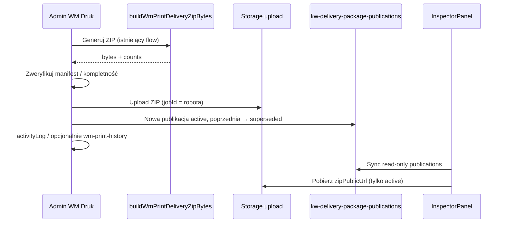
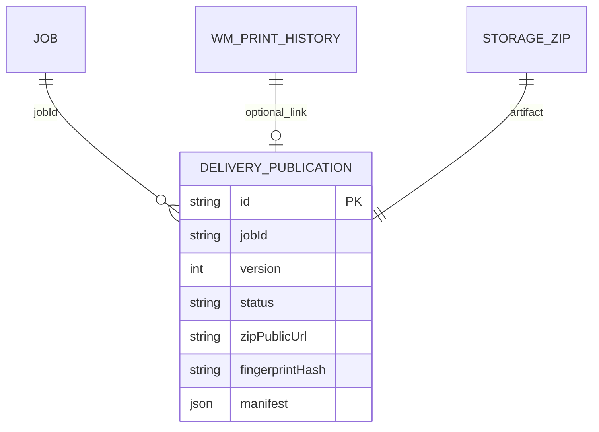

# INSPECTOR-P1 — Published Delivery Package (plan)

**Data:** 2026-06-16  
**Tryb:** AUDIT + PLAN · **READ ONLY** · bez implementacji / commit / push  
**Baseline prod:** v**2.59.44** · commit **`26251ff`**  
**Kontekst decyzyjny:** Inspektor **NIE** dostaje WM Druk (generatory, szablony, ustawienia, historia WM, edycja EM).  
**Powiązane:** [`P0-INSPECTOR-AUDIT.md`](P0-INSPECTOR-AUDIT.md) · ARCHITECTURE § **12.1.8** WM Druk · § **12.1.10** EM · § **9.1** Inspektor

---

## Streszczenie rekomendacji

| Obszar | Decyzja |
|--------|---------|
| **Przechowywanie** | **A — gotowy ZIP w storage** (immutable snapshot po weryfikacji admina) |
| **Aktywna publikacja** | **Jedna aktywna per robota** + **historia wersji** (superseded/revoked) |
| **Pobieranie inspektora** | **ZIP (primary)** + **manifest (lista plików, read-only)** — bez generatorów |
| **Nieaktualność** | **Fingerprint wejść generacji** porównywany z bieżącym stanem (admin widzi diff; inspektor — status) |
| **Integracja WM Druk** | Nowy krok **„Opublikuj”** po `buildWmPrintDeliveryZipBytes` — **bez zmiany** pipeline generacji |
| **Nowy KV** | `kw-delivery-package-publications` — **osobna domena**, nie rozszerzać `kw-wm-print-history` |

---

## Odpowiedzi na pytania (1–10)

### 1. Model danych publikacji

Rekomendowany model (TypeScript — specyfikacja, nie kod prod):

```typescript
/** Status publikacji widocznej w UI */
type DeliveryPackagePublicationStatus =
  | "active"      // jedyna aktywna dla jobId
  | "superseded"  // zastąpiona nowszą publikacją
  | "revoked";    // admin wycofał (inspektor: jak BRAK PAKIETU)

/** Pojedynczy wpis w manifeście — tylko metadane, bez ścieżek regeneracji */
interface DeliveryPackageManifestEntry {
  folder: "Odbiory" | "Pomiary";
  fileName: string;           // np. 01-ZI.pdf
  displayLabel: string;         // czytelna etykieta (ZI, Protokół RAP-44-2026, …)
  mimeType: string;
  sizeBytes?: number;
}

/** Fingerprint wejść użytych przy generacji — do wykrywania nieaktualności */
interface DeliveryPackageGenerationFingerprint {
  schemaVersion: 1;
  jobId: string;
  selectedTemplateIds: string[];          // posortowane
  includeMeasurements: boolean;
  measurementId: string | null;
  measurementUpdatedAt: string | null;
  dateMode: "today" | "custom";
  customDateIso: string | null;           // YYYY-MM-DD
  jobVariableDigest: string;              // hash: address, flat, defaultCity
  wmJobDocDigests: { id: string; uploadedAt: string }[];
  templateFileDigests: { templateId: string; fileId: string }[];
  settingsDigest: string;                 // defaultCity + zipNameSuffix
}

interface DeliveryPackagePublication {
  id: string;
  jobId: string;
  version: number;                        // 1, 2, 3… per jobId (monotonic)

  status: DeliveryPackagePublicationStatus;

  publishedAt: string;                    // ISO
  publishedByUserId: string;
  publishedByUserName: string;
  publishNote?: string;                   // opcjonalna notatka admina „zweryfikowano”

  /** Artefakt — SSOT dla inspektora */
  zipStoragePath: string;
  zipPublicUrl: string;
  zipFileName: string;                    // np. GORLICKA_26_6_ODBIOR_WM.zip
  zipSizeBytes: number;
  zipSha256?: string;                     // opcjonalnie — integralność

  /** Manifest — co inspektor widzi wewnątrz pakietu */
  manifest: DeliveryPackageManifestEntry[];
  odbiorFileCount: number;
  pomiaryFileCount: number;
  includesMeasurements: boolean;

  /** Nieaktualność */
  generationFingerprint: DeliveryPackageGenerationFingerprint;
  fingerprintHash: string;                // sha256(canonicalJSON(fingerprint))

  /** Traceability — opcjonalny link do istniejącego logu WM Druk */
  wmPrintHistoryEntryId?: string;

  supersededAt?: string;
  supersededByPublicationId?: string;
  revokedAt?: string;
  revokedByUserId?: string;
}
```

**KV:** tablica `DeliveryPackagePublication[]` pod kluczem **`kw-delivery-package-publications`**.

**SSOT aktywnej publikacji:** `getActiveDeliveryPackagePublication(publications, jobId)` → wpis ze `status === "active"` (max 1).

**Indeks logiczny:** filtrowanie po `jobId`; sort `version DESC`.

---

### 2. A) sam ZIP vs B) snapshot do odtworzenia ZIP

| Kryterium | **A — przechowywać ZIP** | **B — snapshot do regeneracji** |
|-----------|--------------------------|----------------------------------|
| **Zgodność z modelem biznesowym** | Admin publikuje **dokładnie to**, co zweryfikował | Inspektor/regeneracja wymagałaby dostępu do szablonów/EM — **narusza zakaz** |
| **Immutability** | Pełna — odbiór terenowy na zamrożonym artefakcie | Regeneracja może dać inny wynik (data ZI, fonty, EM engine) |
| **Koszt storage** | Wyższy (~1–5 MB/ZIP × roboty) | Niższy (same metadane) |
| **Złożoność inspektora** | Tylko download + manifest | Wymaga silnika generacji po stronie inspektora lub Edge — **odrzucone** |
| **Wykrywanie nieaktualności** | Fingerprint wejść + osobny status | Naturalnie „zawsze fresh” — ale **nie wiadomo co inspektor pobrał wczoraj** |
| **Audyt prawny/operacyjny** | „Pakiet opublikowany 16.06 o 14:32” = dowód | Trudniejsze — brak zamrożonego pliku |
| **Integracja z obecnym WM Druk** | `buildWmPrintDeliveryZipBytes` → upload → publikacja | Duplikacja całego `generate-zip.ts` w nowym flow |

**Rekomendacja: A (gotowy ZIP)** jako SSOT artefaktu inspektora.

**Uzupełnienie (nie zamiast A):** przechowywać **`generationFingerprint`** obok ZIP — to **nie** jest snapshot do regeneracji przez inspektora, tylko **sygnał nieaktualności** dla admina i status „PAKIET NIEAKTUALNY” dla inspektora.

Opcja B jako **wyłącznie admin-side** (ponowna generacja w WM Druk) pozostaje bez zmian — inspektor nigdy nie regeneruje.

---

### 3. Wykrywanie „pakiet wymaga ponownej publikacji”

#### 3.1 Zasada

Porównanie: `fingerprintHash` **aktywnej publikacji** vs `computeDeliveryPackageFingerprintHash(...)` **z bieżących danych**.

Jeśli różne → **`stale: true`** (admin: „Opublikuj ponownie”; inspektor: **PAKIET NIEAKTUALNY**).

#### 3.2 Co wchodzi w fingerprint (wpływa na ZIP)

| Źródło zmiany | Sygnał w fingerprint | Uwagi |
|---------------|---------------------|-------|
| **ZI / szablony generated** | `selectedTemplateIds` + `templateFileDigests` | Zmiana szablonu w KV, podmiana pliku szablonu |
| **Data ZI** | `dateMode`, `customDateIso` | `WmPrintGenerateOptions` z WM Druk |
| **Adres w ZI** | `jobVariableDigest` | `address`, `flatNumber`, `settings.defaultCity` |
| **Uploadd WM Druk per robota** | `wmJobDocDigests[]` | `kw-wm-print-job-docs` — id + uploadedAt |
| **Pomiary EM w ZIP** | `includeMeasurements`, `measurementId`, `measurementUpdatedAt` | `getProductionMeasurementForJob` + `updatedAt` raportu |
| **Ustawienia nazwy ZIP** | `settingsDigest` | Wpływa na nazwę pliku, nie treść — **opcjonalnie** poza fingerprint (tylko kosmetyka) |

#### 3.3 Co **nie** powinno automatycznie oznaczać stale (domyślnie)

| Źródło | Dlaczego nie |
|--------|--------------|
| **Checklista inspektora** `documents{}` | Osobny proces; nie zmienia bytes ZIP |
| **Checklista admin Roboty** | Jak wyżej, chyba że powiązana z `jobFiles[]` wpływającymi na WM job docs |
| **Nowy wpis `kw-wm-print-history`** | Historia ≠ publikacja; generacja bez publish nie zmienia statusu inspektora |
| **Notatki WM / op-notes** | Komunikacja, nie zawartość pakietu |
| **Etap handover** | Status procesu, nie ZIP |

#### 3.4 Wyjątki do rozważenia (P1C backlog)

- Admin toggle **„wymuszone stale”** (manual flag) gdy fingerprint nie łapie zmiany biznesowej.
- Osobny sygnał: **„EM dodane po publikacji bez pomiarów”** gdy poprzedni ZIP miał `includesMeasurements: false`, a teraz jest aktywny RAP.

#### 3.5 Gdzie liczyć fingerprint

| Miejsce | Rola |
|---------|------|
| **`src/lib/delivery-package/fingerprint.ts`** (nowy moduł) | Pure functions — **zero importu UI WM Druk w inspektorze** |
| **Admin — WM Druk / Roboty** | Wyświetlenie „aktualny / nieaktualny” + lista przyczyn (diff czytelny) |
| **Inspektor** | Tylko enum statusu — **bez** ujawniania templateIds / ustawień |

---

### 4. Workflow ADMIN → INSPECTOR



#### ADMIN — kroki produktowe

1. **Przygotuj dokumentację** (WM Druk: sloty job_upload, szablony, EM w ZIP jeśli RAP aktywny) — *bez zmian*.
2. **Generuj ZIP** — wywołanie `buildWmPrintDeliveryZipBytes` (dziś kończy się `saveAs`; P1A doda **`bytes` bez pobrania**).
3. **Zweryfikuj** — panel podglądu:
   - liczba plików Odbiory / Pomiary,
   - manifest (nazwy),
   - opcjonalnie checksum,
   - fingerprint preview,
   - completeness WM (`computeWmPrintCompleteness`) — informacyjnie.
4. **Opublikuj dla inspektora** — upload + zapis KV + supersede poprzedniej wersji.
5. **Opcjonalnie:** wpis w `jobNotes` / `activityLog` „Opublikowano pakiet odbiorowy v3”.

#### INSPECTOR — kroki

1. Otwórz robotę → sekcja **WM** (lub nowa kapsułka **Pakiet**).
2. Widzi status + metadane publikacji.
3. **Pobierz opublikowany pakiet** (ZIP) — ten sam plik co admin zweryfikował.
4. Przy **PAKIET NIEAKTUALNY** — banner „Skontaktuj się z biurem”; **nadal może pobrać ostatni opublikowany ZIP** (świadomy wybór P1 — alternatywa: blokada downloadu; rekomendacja: **pobieranie dozwolone z ostrzeżeniem**).

---

### 5. Status w Inspektorze

Enum **`DeliveryPackageInspectorStatus`** (wyliczany, nie przechowywany):

| Status UI | Warunek |
|-----------|---------|
| **BRAK PAKIETU** | Brak publikacji `active` dla `jobId` (lub ostatnia `revoked`) |
| **PAKIET GOTOWY** | Jest `active` + `stale === false` |
| **PAKIET NIEAKTUALNY** | Jest `active` + `stale === true` |

**Prezentacja (propozycja UX):**

| Status | Kolor | Akcja |
|--------|-------|-------|
| BRAK PAKIETU | szary | „Biuro jeszcze nie opublikowało pakietu odbiorowego” |
| PAKIET GOTOWY | zielony | Przycisk **Pobierz pakiet ZIP** |
| PAKIET NIEAKTUALNY | amber | Banner + **Pobierz ostatni pakiet** + „Nowa wersja w przygotowaniu” |

**Nie pokazywać inspektorowi:** „stale bo zmieniono szablon ZI id=…” — tylko status ludzki.

---

### 6. Jedna aktywna vs wielowersyjna historia

**Rekomendacja: obie warstwy**

| Warstwa | Semantyka |
|---------|-----------|
| **Aktywna (`status: active`)** | Dokładnie **1** per `jobId` — to widzi inspektor |
| **Historia (`superseded`)** | Poprzednie wersje — **admin-only** (audyt „co było opublikowane 12.06”) |
| **Revoked** | Admin wycofuje błędną publikację → inspektor = BRAK PAKIETU |

Inspektor **domyślnie** widzi tylko aktywną. Historia wersji w inspektorze — **P3 backlog** (read-only „poprzedni pakiet z 10.06”) — nie P1.

---

### 7. Co inspektor **powinien** widzieć

| Informacja | Przykład |
|------------|----------|
| Status pakietu | PAKIET GOTOWY / NIEAKTUALNY / BRAK |
| Data publikacji | 16.06.2026, 14:32 |
| Kto opublikował | Dawid (imię) |
| Wersja pakietu | v3 |
| Rozmiar ZIP | 2,4 MB |
| Zawartość — manifest | Folder Odbiory: ZI, … · Folder Pomiary: 5× DOCX + INDEX (jeśli były) |
| Liczniki | 8 plików Odbiory · 6 plików Pomiary |
| Opcjonalna notatka admina | „Komplet na odbiór 17.06, RAP-44” |
| Przycisk pobrania | **Pobierz pakiet odbiorowy (ZIP)** |

---

### 8. Czego inspektor **NIE** powinien widzieć

| Ukryte | Powód |
|--------|-------|
| Moduł WM Druk, generator, szablony | Decyzja produktowa |
| `kw-wm-print-templates`, settings, job-docs KV | ACL + brak potrzeby regeneracji |
| `kw-wm-print-history` (surowa) | Zastąpione publikacją |
| `selectedTemplateIds`, fingerprint hash, diff | Implementacja wewnętrzna |
| Edycja / anulowanie publikacji | Tylko admin |
| Generowanie ZIP/DOCX/PDF | Admin-only |
| EM registry, value engine, edycja pomiarów | Admin-only |
| Storage paths innych modułów | Wystarczy `zipPublicUrl` opublikowanego artefaktu |
| Link „Otwórz WM Druk” | **Brak** — nie deep link do generatora |

---

### 9. Pobieranie: ZIP / lista plików / oba

| Tryb | P1 | Uzasadnienie |
|------|-----|--------------|
| **ZIP** | **TAK — primary** | Odbiór terenowy = jeden plik offline; zgodne z modelem admina |
| **Lista plików (manifest)** | **TAK — read-only** | Inspektor wie co jest w środku przed pobraniem |
| **Pojedyncze pliki z URL** | **NIE w P1** | Wymaga rozpakowania do storage per plik — koszt + ACL; backlog P2 |

**Rekomendacja P1:** **oba w sensie informacyjnym** (manifest + download ZIP), **bez** pobierania pojedynczych plików.

**P2 opcjonalnie:** podgląd PDF ZI z rozpakowanego manifestu — tylko jeśli admin przy publikacji uploaduje też ekstrakt głównych PDF do podfolderu storage (osobna decyzja kosztowa).

---

### 10. Powiązanie z obecnym workflow WM Druk

#### Stan obecny (bez publikacji)

```text
WmPrintView.handleGenerateZip
  → downloadWmPrintZip → saveAs (lokalnie u admina)
  → recordHistory(buildWmPrintHistoryZipEntry) → kw-wm-print-history (metadane)
```

- ZIP **nie trafia** do chmury.
- Inspektor **nie ma** dostępu do historii WM Druk.
- `JobWmPrintHistoryPanel` w Robotach = metadane + link do modułu.

#### Stan docelowy (minimalny diff architektury WM Druk)

```text
[W bez zmian] buildWmPrintDeliveryZipBytes / buildWmPrintFilesForJob / generate-zip.ts

[NOWE — obok download]
publishDeliveryPackageForJob({
  job, templates, jobDocs, settings, opts, selectedTemplateIds, delivery,
  publishedBy, publishNote?,
})
  1. bytes ← buildWmPrintDeliveryZipBytes(...)
  2. manifest ← z listy WmPrintGeneratedFile + EM append (nazwy folderów)
  3. fingerprint ← computeDeliveryPackageFingerprint(...)
  4. upload ← storage-upload (jobId = job.id, prefix delivery-package-v{N})
  5. KV ← supersede poprzedni active + append publication
  6. opcjonalnie wmPrintHistoryEntryId ← istniejący buildWmPrintHistoryZipEntry
```

**WM Druk UI:** przycisk **„Opublikuj dla inspektora”** obok **„Pobierz ZIP”** (dwa osobne CTA).

- **Pobierz ZIP** — jak dziś (admin lokalnie).
- **Opublikuj** — upload + KV (inspektor).

**Roboty:** opcjonalny skrót **`JobDeliveryPackageSummaryPanel`** (read-only status + link do WM Druk dla admina) — P1B.

**Inspektor:** **`InspectorDeliveryPackagePanel`** w sekcji WM — P1B.

**Nie zmieniać:** `kw-wm-print-*` merge, szablony, ZI generator, EM generator, `generate-zip.ts` algorytmu.

---

## SEKCJA A — Current Architecture

### A.1 WM Druk — pipeline ZIP (SSOT generacji)

| Element | Plik / klucz | Rola |
|---------|--------------|------|
| Orkiestracja ZIP | `src/lib/wm-print/generate-zip.ts` | `buildWmPrintDeliveryZipBytes` |
| Foldery ZIP | `Odbiory/`, `Pomiary/` | Stałe `WM_PRINT_ZIP_FOLDER_*` |
| Szablony | `kw-wm-print-templates` | Admin-only |
| Uploady per robota | `kw-wm-print-job-docs` | Admin-only |
| Ustawienia | `kw-wm-print-settings` | Admin-only |
| Historia generacji | `kw-wm-print-history` | Metadane only, cap 1000 — **bez bytes** |
| EM w ZIP | `getProductionMeasurementForJob` + `appendMeasurementDocxToZip` | Warunek `includeMeasurements` |
| Download | `downloadWmPrintZip` → `saveAs` | **Tylko dysk lokalny admina** |
| Storage upload | `uploadWmPrintJobDocumentFile` | job docs, nie ZIP odbiorowy |

### A.2 Inspektor — obecny stan integracji z odbiorem

| Element | Stan |
|---------|------|
| WM Druk | **Brak** |
| EM | **Brak** (tylko checkbox checklisty „Pomiary”) |
| Pakiet odbiorowy | **Brak** |
| Sync KV WM | InspectorPanel **nie** syncuje `kw-wm-print-*` |
| Sekcja WM | `JobWmPanel`, etapy, billing proposals |

Źródło: [`P0-INSPECTOR-AUDIT.md`](P0-INSPECTOR-AUDIT.md).

### A.3 Storage i upload (reuse)

- Edge: `POST /make-server-0afb8820/storage-upload`
- Bucket: `make-0afb8820-photos` (public URL)
- Wzorzec: `jobAttachments`, `uploadWmPrintJobDocumentFile` — upload z `jobId` + prefiks nazwy

**Publikacja ZIP** może użyć tego samego endpointu z `filename: delivery-package-v{version}-{base}.zip`.

### A.4 Granica modułów (must preserve)

```text
┌─────────────────────────────────────────────────────────┐
│ WM Druk (admin)                                         │
│  templates · settings · generate · history · publish    │
└───────────────────────────┬─────────────────────────────┘
                            │ publish (ZIP bytes + manifest)
                            ▼
┌─────────────────────────────────────────────────────────┐
│ Delivery Package Publications (nowa domena)             │
│  kw-delivery-package-publications + storage ZIP         │
└───────────────────────────┬─────────────────────────────┘
                            │ read-only sync
                            ▼
┌─────────────────────────────────────────────────────────┐
│ InspectorPanel (inspector)                              │
│  status · manifest · download ZIP                       │
└─────────────────────────────────────────────────────────┘
```

---

## SEKCJA B — Business Workflow

### B.1 Role i odpowiedzialności

| Rola | Odpowiedzialność |
|------|------------------|
| **Admin** | Przygotowanie dokumentów WM Druk, generacja, weryfikacja, **publikacja**, ponowna publikacja gdy stale |
| **Inspektor** | Pobranie **opublikowanego** pakietu, użycie na odbiorze, checklista/etap/notatki (istniejące) |
| **Pracownik** | Bez zmian — dokumentacja budowy |

### B.2 Macierz stanów biznesowych

| Stan operacyjny | Admin | Inspektor |
|-----------------|-------|-----------|
| Dokumenty w przygotowaniu | Edycja WM Druk | BRAK PAKIETU |
| ZIP wygenerowany lokalnie, nie opublikowany | Ma plik na PC; inspektor nie widzi | BRAK PAKIETU |
| Opublikowano vN | Active + ewentualnie stale warning | PAKIET GOTOWY lub NIEAKTUALNY |
| Zmiana ZI/EM po publikacji | Stale → republish | PAKIET NIEAKTUALNY |
| Revoke błędnej publikacji | Brak active | BRAK PAKIETU |

### B.3 Powiązanie z etapem handover

Publikacja **nie zastępuje** etapu `handed_over`. Recommended guardrail (P1C, UX):

- Banner inspektora: „Przed odbiorem upewnij się, że masz **PAKIET GOTOWY**”.
- Opcjonalnie (backlog): admin nie może opublikować bez minimalnej completeness WM — **soft warning**, nie twardy blok (realia terenu).

---

## SEKCJA C — Data Model

### C.1 Klucze KV

| Klucz | Zawartość | Kto czyta | Kto pisze |
|-------|-----------|-----------|-----------|
| **`kw-delivery-package-publications`** | `DeliveryPackagePublication[]` | Admin + Inspektor | **Tylko admin** (publish/supersede/revoke) |
| `kw-wm-print-*` | Bez zmian | Admin | Admin |
| `kw-jobs` | Bez zmian w P1 | Oba | Inspektor (ograniczone) + admin |

**Sync:** dodać klucz do `DATA_KEYS` + merge LWW po `id` (wzorzec `operational-notes` / `wm-print-history`).

**Backup:** dodać do listy backup completeness (jak EM/OP notes HF).

### C.2 Operacje domenowe (spec)

| Funkcja | Opis |
|---------|------|
| `normalizeDeliveryPackagePublications` | Parse + validate |
| `mergeDeliveryPackagePublications` | Merge by id, timestamp publish |
| `getActivePublicationForJob` | Single active |
| `computePublicationStale` | Porównanie fingerprint |
| `publishDeliveryPackage` | Upload + supersede + append |
| `revokeDeliveryPackage` | active → revoked |
| `buildManifestFromZipBuild` | Mapowanie z `WmPrintGeneratedFile[]` + EM counts |

### C.3 Powiązanie z `kw-wm-print-history`

- **Opcjonalne** pole `wmPrintHistoryEntryId` — korelacja audytowa.
- Historia WM Druk **pozostaje** log generacji (w tym lokalne „Pobierz ZIP”).
- Publikacja **jest osobnym zdarzeniem** — nie każde generowanie ≠ publikacja.

### C.4 Limity (propozycja)

| Limit | Wartość |
|-------|---------|
| Publikacji per job (łącznie) | 50 (potem archiwum) |
| Max ZIP size | 25 MB (jak job attachments) |
| Manifest entries max | 200 |

---

## SEKCJA D — UX Proposal

### D.1 Admin — WM Druk (robot detail / wiersz)

```
┌──────────────────────────────────────────────────────────┐
│ Pakiet odbiorowy                                         │
│ Status: Opublikowany v3 · 16.06.2026 · Dawid            │
│ ⚠ Pakiet nieaktualny — zmieniono RAP po publikacji       │
│                                                          │
│ [Pobierz ZIP]  [Opublikuj dla inspektora…]  [Wycofaj]    │
│                                                          │
│ Podgląd zawartości (manifest):                           │
│   Odbiory/  01-ZI.pdf, 02-…                             │
│   Pomiary/  protokol.docx, … (6 plików)                  │
└──────────────────────────────────────────────────────────┘
```

Modal **Opublikuj:** checkbox potwierdzenia + opcjonalna notatka + podgląd manifestu.

### D.2 Admin — Roboty (skrót, P1B)

Panel **`JobDeliveryPackageSummaryPanel`** — jak `JobWmPrintHistoryPanel`, ale status publikacji + stale + CTA „WM Druk → Opublikuj”.

### D.3 Inspektor — sekcja WM (P1B)

```
┌──────────────────────────────────────────────────────────┐
│ 📦 Pakiet odbiorowy WM                                   │
│ ● PAKIET GOTOWY                                          │
│ Opublikowano: 16.06.2026, 14:32 · Dawid · wersja 3      │
│ 8 plików Odbiory · 6 plików Pomiary · 2,4 MB             │
│                                                          │
│ Zawartość:                                               │
│   Odbiory — ZI, …                                        │
│   Pomiary — Protokół RAP-44-2026, …                      │
│                                                          │
│ [ ⬇ Pobierz pakiet ZIP ]                                 │
└──────────────────────────────────────────────────────────┘
```

Wariant **NIEAKTUALNY:** amber banner nad przyciskiem.

Wariant **BRAK:** szary empty state + „Biuro opublikuje pakiet przed odbiorem”.

### D.4 Pulpit inspektora — KPI (P1C)

- Licznik: **Roboty bez opublikowanego pakietu** (aktywne WM, termin ≤7 dni).
- Licznik: **Pakiet nieaktualny** (wymaga kontaktu z biurem).

---

## SEKCJA E — Security / Permissions

### E.1 ACL

| Akcja | super_admin | admin | moderator | inspector |
|-------|-------------|-------|-----------|-----------|
| Generować ZIP (WM Druk) | TAK | TAK | TAK* | **NIE** |
| Publikować pakiet | TAK | TAK | TAK* | **NIE** |
| Wycofać publikację | TAK | TAK | ?** | **NIE** |
| Czytać publikacje | TAK | TAK | TAK | **TAK (read-only)** |
| Pobierać ZIP opublikowany | TAK | TAK | TAK | **TAK** |

\* moderator — jak dziś WM Druk (spójność z `adminCanViewRates` / dostęp do modułów).  
\** do ustalenia z product ownerem; rekomendacja: admin + super_admin only dla revoke.

### E.2 Implementacja obrony

- **Lib:** `inspectorCannotPublishDeliveryPackage(session)` — guard mutacji.
- **InspectorPanel sync:** fetch tylko `kw-delivery-package-publications` — **nie** dodawać `kw-wm-print-templates`.
- **UI variant:** `InspectorDeliveryPackagePanel` — zero importów z `WmPrintView` / `generate-zip`.
- **Storage URL:** public bucket (jak zdjęcia) — URL znany = download; akceptowalne (inspektor i tak uprawniony); opcjonalny P3 signed URL via Edge.

### E.3 Audyt

- `activityLog` job: typ `delivery_package_published` / `delivery_package_revoked`.
- Opcjonalnie wpis w `kw-operational-notes` **nie** — osobna domena.

---

## SEKCJA F — Recommendation

### F.1 Werdykt projektowy: **GO z modelem A (stored ZIP)**

Mechanizm **Published Delivery Package** domyka lukę z P0-INSPECTOR-AUDIT **bez** naruszenia granicy WM Druk:

- Admin zachowuje pełną kontrolę generacji.
- Inspektor dostaje **immutable artefakt** + czytelny status.
- Architektura WM Druk pozostaje **nienaruszona** — tylko **nowy consumer** bytes z istniejącego `buildWmPrintDeliveryZipBytes`.

### F.2 Antywzorce (NIE robić)

| Antywzorzec | Dlaczego |
|-------------|----------|
| Deep link inspektora do `WmPrintView` | Łamie decyzję produktową |
| Traktować `kw-wm-print-history` jako publikację | Generacja ≠ weryfikacja |
| Regeneracja ZIP po stronie inspektora | Wymaga szablonów/EM |
| Snapshot-only bez ZIP | Brak zamrożonego artefaktu odbioru |
| Auto-publish po każdym „Pobierz ZIP” | Admin traci krok weryfikacji |

### F.3 Kryteria akceptacji INSPECTOR-P1 (prod)

1. Admin może opublikować pakiet po generacji; poprzednia wersja → superseded.
2. Inspektor widzi status BRAK / GOTOWY / NIEAKTUALNY per robota.
3. Inspektor pobiera **ten sam ZIP** co zapisany przy publikacji (checksum opcjonalny).
4. Manifest widoczny bez dostępu do WM Druk.
5. Zmiana ZI/EM/upload WM doc po publikacji → stale u admina i inspektora.
6. Inspektor **nie** ma nowych ścieżek do generatorów DOCX/ZI/EM.
7. Smoke + regresja WM Druk ZIP bez zmiany outputu bytes (publish używa tego samego buildera).

---

## Roadmapa INSPECTOR-P1A / P1B / P1C

### INSPECTOR-P1A — Foundation (domena + publish admin)

| ID | Zakres | Pliki (plan) |
|----|--------|--------------|
| P1A-1 | Typy + normalize/merge + `DATA_KEYS` | `src/lib/delivery-package/*`, `cloud-sync.ts` |
| P1A-2 | `fingerprint.ts` + `computePublicationStale` | pure lib + test unit |
| P1A-3 | `publishDeliveryPackage` — upload storage + KV supersede | `delivery-package-publish.ts` |
| P1A-4 | Refactor: `buildWmPrintDeliveryZipBytes` reuse bez `saveAs` | minimal touch `generate-zip.ts` |
| P1A-5 | UI WM Druk: manifest preview + „Opublikuj dla inspektora” | `WmPrintView.tsx` |
| P1A-6 | Smoke `test-delivery-package-publish-p1a.mjs` | scripts |

**Trudność:** **Średnia (M)** · 3–5 dni  
**Ryzyko:** **Średnie** — upload dużych ZIP, merge KV  
**Wpływ biznesowy:** **Wysoki** — umożliwia cały flow

---

### INSPECTOR-P1B — Inspector read-only + sync

| ID | Zakres |
|----|--------|
| P1B-1 | Sync `kw-delivery-package-publications` w `InspectorPanel` |
| P1B-2 | `InspectorDeliveryPackagePanel` w sekcji WM |
| P1B-3 | Status enum + download ZIP (`fetch` + blob save / PWA) |
| P1B-4 | `JobDeliveryPackageSummaryPanel` w `JobsView` (admin skrót) |
| P1B-5 | Help inspektora + CHANGELOG + ARCHITECTURE § nowa podsekcja |
| P1B-6 | Smoke `test-delivery-package-inspector-p1b.mjs` |

**Trudność:** **Średnia-niska (S–M)** · 2–4 dni  
**Ryzyko:** **Niskie** — read-only, wzorzec znany z innych paneli  
**Wpływ biznesowy:** **Wysoki** — inspektor realnie używa pakietu

---

### INSPECTOR-P1C — Stale detection + operacje + KPI

| ID | Zakres |
|----|--------|
| P1C-1 | Admin UI: stale banner + human-readable przyczyny (diff) |
| P1C-2 | Revoke publication + activityLog |
| P1C-3 | Inspector dashboard KPI: brak pakietu / nieaktualny |
| P1C-4 | Backup key completeness (4+1 klucz) |
| P1C-5 | E2E fragment: admin publish → inspector download |
| P1C-6 | Raport `audit/INSPECTOR-P1-IMPLEMENT-REPORT.md` |

**Trudność:** **Średnia (M)** · 2–4 dni  
**Ryzyko:** **Średnie** — false positive stale (wymaga tuningu fingerprint)  
**Wpływ biznesowy:** **Średni-wysoki** — zaufanie do statusu „GOTOWY”

---

### Podsumowanie roadmapy

| Faza | Effort łącznie | Ryzyko | Biznes |
|------|----------------|--------|--------|
| **P1A** | M | Średnie | ★★★★★ |
| **P1B** | S–M | Niskie | ★★★★★ |
| **P1C** | M | Średnie | ★★★★☆ |
| **INSPECTOR-P1 łącznie** | **~7–13 dni** | **Średnie** | **Krytyczne dla odbioru WM** |

**Release workflow:** B (functional UI) — build → smoke P1A+P1B → commit → push → verify FAST.

---

## Załącznik — Przykład fingerprint (kanoniczny JSON)

```json
{
  "schemaVersion": 1,
  "jobId": "abc-123",
  "selectedTemplateIds": ["2b22da48-...", "template-b"],
  "includeMeasurements": true,
  "measurementId": "em-uuid",
  "measurementUpdatedAt": "2026-06-16T10:00:00.000Z",
  "dateMode": "today",
  "customDateIso": null,
  "jobVariableDigest": "sha256:…",
  "wmJobDocDigests": [{ "id": "doc-1", "uploadedAt": "2026-06-15T…" }],
  "templateFileDigests": [{ "templateId": "2b22da48-…", "fileId": "tf-1" }],
  "settingsDigest": "sha256:…"
}
```

`fingerprintHash = SHA256(stableStringify(fingerprint))`.

---

## Załącznik — Diagram danych



---

*INSPECTOR-P1 Published Delivery Package · plan READ ONLY · 2026-06-16 · baseline 2.59.44*
