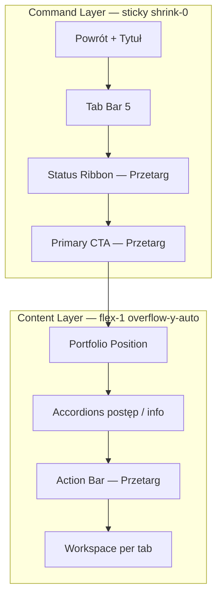

# NG-03 — Tender Workspace UX EPIC CLOSE REPORT

> **Status dokumentu:** **FINAL** · **EPIC NG-03 CLOSED** (seria 03.0 → 03.7)  
> **Data closeout epic:** 2026-06-30 · **docs maintenance (R-03):** 2026-07-05  
> **Production:** **2.63.7** (tab SSOT **2.63.8**)  
> **Design freeze SSOT:** [`docs/NG-03-DESIGN-FREEZE.md`](../docs/NG-03-DESIGN-FREEZE.md) · banner **EPIC CLOSED** (R-03)  
> **Deprecation legacy:** [`docs/NG-03-TENDER-DETAIL-PANEL-DEPRECATION.md`](../docs/NG-03-TENDER-DETAIL-PANEL-DEPRECATION.md) (M-06)  
> **A-03-1 overlap audit:** [`docs/A-03-1-STATUS-OVERLAP-AUDIT.md`](../docs/A-03-1-STATUS-OVERLAP-AUDIT.md)  
> **Audyt źródłowy:** [`audit/NG-03-TENDER-WORKSPACE-UX-ARCHITECTURE-AUDIT.md`](NG-03-TENDER-WORKSPACE-UX-ARCHITECTURE-AUDIT.md)

---

## 1. Executive Summary

Epic **NG-03** przekształcił detal przetargu V4 z przeciążonego chrome (7 tabów, 3 bloki trust, KPI 8-komórkowy, ukryta kwalifikacja) w **Command Layer + Content Layer** z progressive disclosure, mobile cards i bridge do Strategii — **wyłącznie UX/prezentacja**, bez zmian NG-02 runtime, parserów, sync KV ani logiki CTA.

| Pole | Wartość |
|------|---------|
| **Epic** | NG-03 Tender Workspace UX |
| **Status epic** | **CLOSED** |
| **Wersje prod** | **2.63.0** → **2.63.7** |
| **UX Certification** | NG-03.5A **88/100** → NG-03.7 **warnings resolved** |
| **P0 post-epic** | Command Layer height freeze — **2.63.6** (RCA: chrome > budget → 0 px content scroll) |
| **Outstanding prod bugs (NG-03 scope)** | **NONE** |

---

## 2. Timeline (NG-03.1 → 03.7)

| Faza | Wersja | Zakres | Status |
|------|--------|--------|--------|
| **NG-03.0** | — | Design Freeze · [`docs/NG-03-DESIGN-FREEZE.md`](../docs/NG-03-DESIGN-FREEZE.md) | **CLOSED** |
| **NG-03.1** | 2.63.0 | 5 tabów V4 · sub-taby Decyzja · redirect strategia/materialy | **RELEASED** |
| **NG-03.2** | 2.63.1 | Command Layer · Status Ribbon · KPI Compact · accordions | **RELEASED** |
| **NG-03.3** | 2.63.2 | Operator Action Bar (desktop + mobile sticky) | **RELEASED** |
| **NG-03.4** | 2.63.3 | Workspace density V2 · accordion operator | **RELEASED** |
| **NG-03.5** | 2.63.4 | Mobile cards Kosztorys / Ceny / Dokumenty | **RELEASED** |
| **NG-03.5A** | — | UX Certification (88/100 · 3 warnings · 0 blockers) | **CERTIFIED** |
| **NG-03.6** | 2.63.5 | Strategy Bridge · Portfolio Position · kontekst tenderId | **RELEASED** |
| **P0 hotfix** | 2.63.6 | Command Layer height budget (≤280 px / ≤50vh) | **RELEASED** |
| **NG-03.7** | 2.63.7 | Polish · touch 44px · tablet · HelpView · **EPIC CLOSE** | **RELEASED** |

---

## 3. Before / After UX

### AS-IS (2.62.99)

```text
Powrót → Breadcrumb → Tytuł → KPI 8 → Tab Bar 7 (2× Wkrótce)
→ Trust Banner → Chips → Strip → CTA → V2 rozwinięty → Executive blocks
Kwalifikacja: tylko ?ws=qualification (niewidoczne sub-taby)
Mobile: tabele min-w 520–820 px → h-scroll
```

### TO-BE (2.63.7)

```text
COMMAND LAYER (sticky, height-budgeted)
  Powrót · Tytuł · 5 tabów · [Ribbon + CTA na Przetarg]
CONTENT (scroll)
  Portfolio Position · Accordions (postęp, info) · Action Bar
Decyzja: sub-taby Przegląd | Kwalifikacja | Oferta
Mobile/tablet <1024: karty wierszy · immersive detal · touch ≥44 px
Strategia: bridge z Przetargu (bez tab detalu)
```

| Metryka | Przed | Po |
|---------|-------|-----|
| Tab Bar detalu | 7 (2 placeholdery) | **5 aktywnych** |
| Sygnały postępu (Przetarg) | 3–4 duplikaty | **Ribbon + accordion** |
| CTA widoczne bez scrollu content | Często NIE | **TAK** (Design Freeze) |
| Kwalifikacja P2-F | Ukryta (query) | **Sub-tab Decyzja** |
| Mobile tabele | h-scroll | **Card view <1024 px** |
| Touch targets (cert 03.5A) | WARN | **PASS (03.7)** |
| Command Layer height (prod) | 725–926 px (P0 bug) | **≤280 / ≤50vh** |

---

## 4. Architecture Summary



| Warstwa | Komponenty SSOT | Zmiany logiki |
|---------|-----------------|---------------|
| Command | `TenderDetailCommandLayer`, `TenderStatusRibbon`, `TenderWorkflowPrimaryAction` | **Nie** (prezentacja) |
| Content | `TenderPrzetargWorkspace`, workspaces per tab | **Nie** |
| Action Bar | `TenderWorkflowOperatorActionBar` | **Nie** |
| Runtime | `useTenderPipelineRuntime` | **Nie zmieniany w NG-03** |
| CTA resolve | `tender-workflow-primary-action.ts` | **Nie zmieniany** |
| Trust | `tender-trust-layer.ts` | **Nie zmieniany** (tylko UI) |

---

## 5. Regression Summary

| Test | Zakres | Wynik (closeout) |
|------|--------|------------------|
| `test-ng-03-1-navigation.mjs` | 5 tabów · Decyzja sub-taby | PASS |
| `test-ng-03-2-command-layer.mjs` | Command Layer · Ribbon · accordions | PASS |
| `test-ng-03-3-action-bar.mjs` | Operator Action Bar slots | PASS |
| `test-ng-03-4-workspace-density.mjs` | V2 density · accordions | PASS |
| `test-ng-03-5-mobile-cards.mjs` | Card/desktop dual layout (lg) | PASS |
| `test-ng-03-6-strategy-bridge.mjs` | Portfolio · Strategia context | PASS |
| `test-ng-03-7-polish.mjs` | Touch · tablet · HelpView · report | PASS |
| `test-p0-command-layer-height.mjs` | Height budget · P0 guards | PASS |
| `e2e/audit-p0-tender-freeze.spec.ts` | Playwright height + scroll | PASS |
| `npm run build` | Production bundle | PASS |

---

## 6. Test Coverage

### Komendy (copy-paste)

```bash
npx vite-node scripts/test-ng-03-1-navigation.mjs
npx vite-node scripts/test-ng-03-2-command-layer.mjs
npx vite-node scripts/test-ng-03-3-action-bar.mjs
npx vite-node scripts/test-ng-03-4-workspace-density.mjs
npx vite-node scripts/test-ng-03-5-mobile-cards.mjs
npx vite-node scripts/test-ng-03-6-strategy-bridge.mjs
npx vite-node scripts/test-ng-03-7-polish.mjs
npx vite-node scripts/test-p0-command-layer-height.mjs
npm run build
```

### NG-03.5A warnings → NG-03.7 resolution

| Warning (03.5A) | Rozwiązanie (03.7) |
|-----------------|-------------------|
| Touch targets <44 px (taby, CTA, strip) | `min-h-[44px]` + `lg:min-h-[36px]` desktop |
| Tablet 640–820 px — module chrome + desktop Action Bar | `max-lg:hidden` immersive · Action Bar sticky do lg · cards do lg |
| Command Layer height | **P0 2.63.6** + utrzymanie w 03.7 |

---

## 7. Lessons Learned

1. **Design Freeze height budget jest twardym constraintem** — bez pomiaru Playwright Command Layer może „po cichu” zabić Content Layer (0 px scroll, brak kliknięć).
2. **Jeden sygnał = jedno miejsce** — Status Ribbon zastąpił 3 rzędy trust; V2 w accordionie; CTA tylko w Command Layer.
3. **Mobile First ≠ tylko ≤390 px** — tablet 640–1023 wymaga osobnej polityki (immersive shell, karty, sticky Action Bar).
4. **UX Certification przed bridge** (03.5A) skutecznie wychwyciła touch/tablet bez blokowania 03.6.
5. **P0 hotfix w trakcie epica** — OK gdy scope prezentacji; nie mieszać z NG-02 runtime.

---

## 8. Remaining Backlog (poza NG-03)

| ID | Temat | Uwagi |
|----|-------|-------|
| NG-03 mat. | Tab `materialy` | Backlog feature flag — **nie** placeholder |
| P2-H.7 | Edge magic bytes 7z | Poza NG-03 |
| TP200B | Kosztorys fidelity `rows` cap | Planned epic |
| Mobile Certification | Field validation Pass 1–4 | Osobny program od NG-03 |
| `schematic_edited` Audit Hub | P1.1 | Tylko na polecenie |
| **M-06** | `TenderDetailPanelHosted` deprecation map | **CLOSED** docs · 2026-07-05 |
| **A-03-1** | Status overlap audit (Ribbon/Strip/V2) | **CLOSED** audit-only · 2026-07-05 |

---

## 9. Recommendation for Next Epic

**Priorytet produktowy (propozycja):**

1. **P0 Payroll Cloud Recovery** — baseline w `PROJECT-HANDOFF-CURRENT.md` (następny epic operacyjny).
2. **TP200B Kosztorys fidelity** — parserVersion + `rows` cap (handoff PLANNED).
3. **NG-04 (opcjonalny)** — materiały tab / lista density P2 — **tylko** po nowym AUDIT + Design Freeze.

**Nie rozpoczynać** bez briefu: zmiany `useTenderPipelineRuntime`, merge dossier, Trust polityka, Command Layer height guards.

---

## 10. Werdykt

```text
EPIC NG-03: CLOSED · PRODUCTION STABLE · GO
UX Score post-03.7: CERTIFIED (warnings from 03.5A resolved)
```

---

*NG-03 Tender Workspace UX — Epic Closeout · 2026-06-30*
