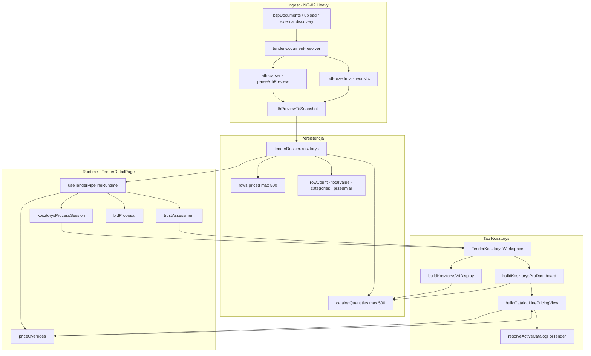

# NG-04 — Kosztorys Workspace PRO · AUDIT

> **Status:** **AUDIT ONLY** · **bez implementacji**  
> **Data:** 2026-07-01  
> **Baseline prod:** **v2.63.8** · commit **`f482016`**  
> **Epic:** NG-04 — Kosztorys Workspace PRO  
> **Design freeze:** [`docs/NG-04-DESIGN-FREEZE.md`](../docs/NG-04-DESIGN-FREEZE.md)

---

## 0. Werdykt audytu

| Obszar | Stan |
|--------|------|
| **Dane runtime** | Bogate w `tenderDossier.kosztorys` + pipeline; UI Kosztorys używa głównie `catalogQuantities` (bez cen ATH) |
| **Parser ATH** | Pełne wiersze z cenami + kategorie R/M/S w preview; **utrata** breakdown i `code` przy zapisie snapshot |
| **Parser PDF** | Pozycje ilościowe; **brak** cen jednostkowych |
| **Wycena katalogowa** | SSOT w `buildCatalogLinePricingView` — **obecnie na zakładce Ceny**, nie w pełni w Kosztorys |
| **Benchmark** | Robocizna/materiał vs baza firmy + benchmark rynku — **Ceny tab**; Kosztorys PRO tylko `marketHint` agregat |
| **Historia** | Brak historii zmian pozycji kosztorysu; są override per przetarg i globalna historia Bazy cen |
| **UI** | `TenderKosztorysWorkspace` (V4.2 PRO dashboard) — read-only, mobile-first, bez edycji linii |

**Rekomendacja:** NG-04 to **warstwa prezentacji + integracja istniejących SSOT**, nie nowy parser ani duplikat kalkulatora.

---

## 1. Mapa architektury (as-is)

```text
┌─────────────────────────────────────────────────────────────────────────┐
│ TenderDetailPage (tab=kosztorys · URL SSOT)                             │
│   useTenderPipelineRuntime ──────────────────────────────────────────── │
│     ├─ useTenderDocumentsBootstrap (autoRunning)                        │
│     ├─ useTenderDossierHeavyLazy (heavy parse · lazy mount)             │
│     ├─ useTenderPricingAuto (bidProposal · priceOverrides)              │
│     └─ useTenderTrustAssessment (trustAssessment)                       │
├─────────────────────────────────────────────────────────────────────────┤
│ TenderKosztorysWorkspace                                                │
│   ├─ KosztorysProcessStatusBar ← deriveKosztorysProcessPhase + health   │
│   ├─ buildKosztorysProDashboard ← buildKosztorysV4Stats + pricing view  │
│   ├─ buildKosztorysV4Display ← catalogQuantities SSOT                   │
│   ├─ TrustInlineHint / TrustReasonList                                  │
│   └─ JobFilePreviewModal (Pełny podgląd ATH · on-demand parse)          │
└─────────────────────────────────────────────────────────────────────────┘
         ▲                              ▲
         │ read                         │ write (heavy only)
         │                              │
┌────────┴──────────────┐    ┌─────────┴──────────────────────────────────┐
│ TenderPipelineItem    │    │ tender-dossier-pipeline / document-resolver │
│  tenderDossier        │◄───│ buildTenderDossierHeavy · athPreviewToSnapshot│
│  swzAnalysis          │    │ pdf-przedmiar-heuristic · ath-parser         │
│  bzpDocuments         │    └──────────────────────────────────────────────┘
└───────────────────────┘
```

### 1.1 SSOT pliki (Kosztorys)

| Warstwa | Plik | Rola |
|---------|------|------|
| **Snapshot** | `src/lib/tenders-bzp-brief.ts` | `TenderKosztorysSnapshot`, `TenderDossier`, `athPreviewToSnapshot` |
| **Wiersz priced** | `src/lib/tenders-bzp-swz.ts` | `TenderCostLine` |
| **Parser ATH** | `src/lib/ath-parser.ts` | `AthPreviewRow`, `AthPreviewResult`, lazy preview API |
| **Parser PDF** | `src/lib/pdf-przedmiar-heuristic.ts` | Heurystyka BOQ → `AthPreviewRow` |
| **Display V4** | `src/lib/tender-detail-v4-display.ts` | `buildKosztorysV4Display`, `buildKosztorysV4Stats`, catalog SSOT |
| **PRO dashboard** | `src/lib/tender-kosztorys-pro-dashboard.ts` | KPI, TOP 20, ocena, filtry branżowe |
| **Fazy procesu** | `src/lib/tender-kosztorys-process-phase.ts` | E0–E12, `deriveKosztorysProcessPhase` |
| **Health** | `src/lib/tender-kosztorys-process-health.ts` | slow/stale/timeout |
| **Status danych** | `src/lib/tender-data-ssot.ts` | `resolvedCostStatus`, FOUND_WITH/NO_VALUE |
| **Wycena linii** | `src/lib/tender-catalog-line-pricing.ts` | `buildCatalogLinePricingView` (Ceny + PRO backend) |
| **Trust** | `src/lib/tender-trust-layer.ts` | wymiar `kosztorys` |
| **UI główny** | `src/app/TenderKosztorysWorkspace.tsx` | Workspace tab Kosztorys |
| **Runtime** | `src/app/hooks/useTenderPipelineRuntime.ts` | Jedyny facade NG-02 |

---

## 2. Diagram przepływu danych



**Kluczowa rozbieżność:** tabela „Pełny kosztorys” czyta **`catalogQuantities`** (lp, opis, j.m., ilość, hint KNR) — **nie** `rows.unitPrice/total` z ATH. TOP 20 wartości pochodzi z **wyceny katalogowej WGDOM**, nie z cen zamawiającego.

---

## 3. Odpowiedzi na 10 pytań audytu

### 3.1 Jakie dane kosztorysu są już dostępne w runtime?

**Źródło:** `TenderPipelineItem` + `useTenderPipelineRuntime` (`TenderDetailPage`).

| Dane | Dostęp | Uwagi |
|------|--------|-------|
| `item.tenderDossier.kosztorys` | ✅ | Główny snapshot po heavy parse |
| `item.tenderDossier.scanSummary` | ✅ | kosztorysFound, costDiscovery, pdfPrzedmiarCase |
| `item.tenderDossier.bidProposal` | ✅ | Via runtime; używane w PRO (marża) |
| `item.tenderDossier.parserVersion` | ✅ | TP200A stale rescan |
| `item.tenderDossier.estimatePln` | ✅ | Priorytet wartości gdy brak SWZ |
| `pipelineRuntime.kosztorysProcessSession` | ✅ | Fazy E0–E12, retry |
| `pipelineRuntime.trustAssessment` | ✅ | Wymiar `kosztorys` |
| `pipelineRuntime.priceOverrides` | ✅ | Nadpisania per przetarg (Ceny; PRO czyta lokalnie ze store) |
| `buildKosztorysProDashboard(item)` | ✅ | Derivacja KPI — nie persistowane |
| `buildKosztorysV4Display(item)` | ✅ | Wiersze tabeli + empty states |
| Lazy ATH preview (`JobFilePreviewModal`) | ✅ | Pełny parser on-demand; nie mutuje dossier |

**Nie mountowane na Kosztorys:** `TenderCatalogLinePricingSection` (pełna tabela wyceny z benchmarkiem) — tylko zakładka **Ceny** (`TenderBidProposalPanel`).

---

### 3.2 Jakie pola posiada pojedyncza pozycja kosztorysu?

| Model | Pola | Gdzie używane |
|-------|------|---------------|
| **`TenderCostLine`** (snapshot `rows`) | `lp`, `description`, `unit`, `quantity`, `unitPrice`, `total` | ATH priced mode, kalkulator `computeAthPricedDirectCosts`, fallback UI |
| **`TenderCatalogQuantityLine`** (snapshot `catalogQuantities`) | `lp`, `description`, `unit`, `quantity` | **SSOT tabeli Kosztorys**, wycena katalogowa |
| **`AthPreviewRow`** (parser, nie snapshot) | + `code`, `category`, `categoryLp`, `przedmiar[]` | Pełny podgląd ATH, PDF rows przed snapshot |
| **`CatalogLinePricingRow`** (computed) | `materialPlnPerUnit`, `laborPlnPerUnit`, `lineTotalPln`, `categoryId`, źródła cen, `isUnknown` | PRO TOP 20, Ceny tab |
| **`KosztorysV4CatalogDisplayRow`** (UI) | `lp`, `description`, `unit`, `quantity`, `catalog` (hint KNR) | Tabela „Pełny kosztorys” |

**Utrata przy `athPreviewToSnapshot`:** `code`, `category`, `przedmiar` per row (przedmiar agregowany osobno max 30), category breakdown R/M/S.

---

### 3.3 Jakie dane są dostępne w `tenderDossier`?

```typescript
// tenders-bzp-brief.ts — TenderDossier
{
  brief: TenderBrief;           // scope, terminy, lokalizacja…
  kosztorys: TenderKosztorysSnapshot | null;
  bidProposal?: TenderBidProposal | null;
  scanSummary?: TenderDossierScanSummary | null;
  estimatePln?: number | null;
  parserVersion?: number;       // CURRENT_PARSER_VERSION = 4
  builtAt: string;
}
```

**`TenderKosztorysSnapshot`:**

| Pole | Opis |
|------|------|
| `ok`, `sourceFilename`, `sourceDocumentIndex`, `zipInnerPath` | Metadane źródła |
| `title`, `totalValue`, `currency` | Nagłówek / suma |
| `rowCount` | Pełna liczba pozycji parsera (może > `rows.length`) |
| `rows` | Do **500** priced lines (`TenderCostLine`) |
| `catalogQuantities` | Do **500** lines bez cen (P2-G) |
| `przedmiar` | Do **30** linii obmiaru |
| `categories` | Do **12** `{ name, total }` — **bez** R/M/S |
| `warnings`, `parsedAt` | Jakość / trace |
| `pdfPrzedmiarCase`, `pdfPrzedmiarNoTextLayer`, `pdfPrzedmiarExtractError` | PDF UX |

---

### 3.4 Jakie dane posiada ATH parser?

**Plik:** `src/lib/ath-parser.ts` · **`AthPreviewResult`**

| Element | Zawartość |
|---------|-----------|
| **Wiersze** | `AthPreviewRow`: lp, code (KNR), description, unit, quantity, **unitPrice**, **total**, category, przedmiar[] |
| **Kategorie** | `AthPreviewCategory`: lp, name, total, level, **breakdown** (`R · M · S` z pola `kn=`) |
| **Podsumowanie** | `summaryLines`, `totalValue`, `currency`, `title` |
| **Format** | xml / text / binary detection |
| **Ograniczenia** | Best-effort; boilerplate warnings filtrowane w UI |

**Pełny podgląd:** `JobFilePreviewModal` + `kosztorysResultForDisplay()` — wszystkie pola parsera, nie snapshot.

---

### 3.5 Jakie dane posiada PDF parser?

**Plik:** `src/lib/pdf-przedmiar-heuristic.ts` · wynik → `AthPreviewRow[]`

| Element | Zawartość |
|---------|-----------|
| **Wiersze** | lp, code (KNR span), description, unit, quantity |
| **Ceny** | `unitPrice: ""`, `total: ""` — **typowo puste** |
| **UX** | `uxCase` 1=pozycje, 2=brak, 3=skan/CAD/błąd |
| **Sygnały** | MIN_SIGNALS=3 (KNR, Lp, Ilość, j.m., unit tokens) |
| **Pipeline** | Ten sam `athPreviewToSnapshot`; `resolvedCostStatus` → **FOUND_NO_VALUE** |

---

### 3.6 Czy istnieją ceny jednostkowe, robocizna, materiał, sprzęt?

| Typ | Istnieje? | Gdzie | W Kosztorys UI? |
|-----|-----------|-------|-----------------|
| **Cena j. ATH (zamawiający)** | ✅ w `rows.unitPrice` | Snapshot | ❌ tabela główna; ✅ TOP 20 używa wyceny WGDOM, nie ATH |
| **Wartość ATH** | ✅ `rows.total`, `totalValue` | Snapshot | Częściowo w stopce / valuation fallback |
| **Robocizna / materiał (WGDOM)** | ✅ `CatalogLinePricingRow` | `wgdom-catalog-cost-engine` | ❌ pełna tabela tylko Ceny; PRO agregaty |
| **Robocizna / materiał / sprzęt (ATH kn=)** | ✅ w parserze (kategoria) | `AthPreviewCategory.breakdown` | ❌ **nie trafia do snapshot** |
| **Heurystyka ATH priced** | ✅ | `computeAthPricedDirectCosts` — % share per row | Kalkulator oferty, nie Kosztorys tab |
| **Sprzęt per pozycja** | ❌ | Tylko składnik S w breakdown działu | ❌ |

---

### 3.7 Czy istnieje benchmark cen?

| Mechanizm | Scope | Kosztorys PRO |
|-----------|-------|---------------|
| **`labor-benchmark.ts`** | Stawka robocizny vs zakres rynkowy per kategoria | `marketHint` (agregat tekstowy) |
| **`material-history.ts` / `material-impact.ts`** | Trend materiałów vs historia firmy | ❌ nie w Kosztorys |
| **`wgdom-cost-catalog-history.ts`** | Snapshots Bazy cen (90 dni) | ❌ nie w Kosztorys |
| **`work-catalog/market-average-engine.ts`** | Średnia rynkowa P3.1 Biblioteka Robót | ❌ **nie podpięte** do Kosztorys |
| **`tender-price-overrides`** | Override per przetarg | Wpływa na PRO przez `buildCatalogLinePricingView` |

**Benchmark per linia kosztorysu:** istnieje w **`TenderCatalogLinePricingSection`** (Ceny) — **nie** w `TenderKosztorysWorkspace`.

---

### 3.8 Czy istnieje historia zmian?

| Typ historii | Istnieje? | Dotyczy kosztorysu? |
|--------------|-----------|---------------------|
| `estimateHistory` na `TenderPipelineItem` | ✅ | Tylko „Nasz szacunek” — nie pozycje |
| `tender-price-overrides` | ✅ | Nadpisania cen kategorii per przetarg (`updatedAt`) |
| `wgdom-cost-catalog-history` | ✅ | Globalna Baza cen — nie per przetarg |
| `changeMonitor` | ✅ | Zmiany dokumentów BZP — nie pozycje BOQ |
| `tender-dossier-trace` | ✅ | Log techniczny parse — dev/diagnostics |
| **Historia edycji pozycji kosztorysu** | ❌ | Brak |
| **Diff parse v3→v4 / rescan** | ❌ | Tylko `parserVersion` + lazy rescan |

---

### 3.9 Jakie komponenty renderują obecny ekran Kosztorys?

**Mount:** `TenderDetailPage` → `activeTab === "kosztorys"` → `TenderKosztorysWorkspace`

| Komponent | Rola |
|-----------|------|
| `KosztorysProcessStatusBar` | Faza procesu + health + retry |
| `TrustInlineHint` | Kompaktowy sygnał trust |
| Hero KPI (4 karty) | Pozycje ATH, Pokrycie, FIT WGDOM, Status |
| CTA | Pełny podgląd ATH, Pobierz ATH |
| Sekcja **KOSZTORYS PRO** | Wycenione/Niewycenione, Wartość, Marża, marketHint |
| **Ocena kosztorysu** | `buildKosztorysProAssessment` |
| **Największe pozycje** | `KosztorysTopCostTable` TOP 20 |
| Filtry branżowe | wykończeniowe / sanitarne / elektryczne / … |
| **Pełny kosztorys** | `KosztorysCatalogTable` (preview 20 + pokaż wszystkie) |
| Chips kategorii ATH | `kosztorys.categories` |
| `TrustReasonList` | ath_cap, row_cap |
| `JobFilePreviewModal` | Modal ATH/NOR |

**Brak na Kosztorys:** Operator Action Bar, Command Layer CTA, `TenderCatalogLinePricingSection`.

---

### 3.10 Które komponenty można ponownie wykorzystać (Reuse First)?

| Asset | Reuse w NG-04 | Uwaga |
|-------|---------------|-------|
| `buildCatalogLinePricingView` | **★★ MUST** | Jedyna wycena linii — nie duplikować |
| `TenderCatalogLinePricingSection` | **★★ MUST** | Wpiąć lub wydzielić wariant „compact” |
| `TenderKosztorysWorkspace` | **★★** | Rozszerzyć, nie fork |
| `buildKosztorysProDashboard` | **★★** | KPI SSOT |
| `buildKosztorysV4Display` | **★★** | Tabela + empty states |
| `KosztorysProcessStatusBar` | **★** | Bez zmian |
| `TenderMobileRowCard` / `TenderDesktopTable` | **★** | Mobile first |
| `JobFilePreviewModal` | **★** | ATH full fidelity |
| `LaborBenchmarkStatusBadge`, `MaterialHistoryCell` | **★** | Z Ceny tab |
| `useTenderPipelineRuntime` | **★★ MUST** | Jedyny runtime facade |
| `tender-trust-layer` | **★** | Sygnały kosztorys |
| `resolveActiveCatalogForTender` | **★★** | PRICE-BRIDGE PB-2 |

**Nie reuse (zakaz duplikacji):** nowy parser, własny benchmark engine, równoległy snapshot model.

---

## 4. Lista braków funkcjonalnych (gap analysis)

### P0 — blokery PRO UX

| ID | Brak | Wpływ |
|----|------|-------|
| G-01 | Tabela główna **nie pokazuje cen ATH** ani wyceny WGDOM per linia | Użytkownik nie widzi „ceny j.” w pełnym BOQ |
| G-02 | **R/M/S z ATH** ginie w snapshot | Brak wiarygodnego podziału kosztów zamawiającego |
| G-03 | **Wycena z benchmarkiem** tylko na Ceny | Duplikacja intencji tabów; Kosztorys ≠ PRO w pełni |
| G-04 | PDF kosztorys = ilości **bez cen** | FOUND_NO_VALUE — PRO status „WYMAGA WYCENY” |
| G-05 | Brak **side-by-side** ATH cena vs WGDOM cena | Trudna decyzja ofertowa na jednym ekranie |

### P1 — PRO completeness

| ID | Brak | Wpływ |
|----|------|-------|
| G-06 | Brak filtra/szukania **Search First** w BOQ | 500 poz. — nawigacja słaba |
| G-07 | Brak widoku **przedmiar/obmiar** per pozycja | `przedmiar[]` w parserze; snapshot max 30 bez linku LP |
| G-08 | Brak **kodu normy** (`code`) w UI tabeli | Jest w ATH preview, nie w catalogQuantities |
| G-09 | Brak historii **override / wyceny** per linia | Tylko kategoria-level overrides |
| G-10 | **Market average P3.1** nie w Kosztorys | Osobny silnik gotowy, nie zintegrowany |

### P2 — nice-to-have / poza MVP PRO

| ID | Brak |
|----|------|
| G-11 | Edycja pozycji / własny BOQ |
| G-12 | OCR PDF (uxCase 3) |
| G-13 | Eksport BOQ PDF/Excel z workspace |
| G-14 | Diff między wersjami dokumentu (changeMonitor → BOQ) |

---

## 5. Propozycja docelowego Workspace PRO (NG-04)

### 5.1 Wizja

**Kosztorys PRO** = jeden ekran decyzyjny: *„Co jest w BOQ, ile kosztuje u zamawiającego, ile kosztuje nas, gdzie jest ryzyko?”* — bez nowych parserów.

### 5.2 Warstwy UI (docelowo)

```text
Command Layer (istniejący TenderDetailPage — bez CTA na kosztorys)
└─ Content: TenderKosztorysWorkspace PRO
     ├─ [1] Process + Trust (reuse)
     ├─ [2] Executive KPI strip (reuse PRO dashboard)
     ├─ [3] BOQ Explorer (NOWY layout · reuse data SSOT)
     │      ├─ Search + filtry branżowe (reuse + search)
     │      ├─ Tabela unified row:
     │      │    LP · Opis · j.m. · Ilość · KNR
     │      │    Cena ATH · Wartość ATH (gdy priced)
     │      │    Cena WGDOM · Wartość WGDOM · Δ benchmark
     │      └─ Mobile: karty z tymi samymi polami
     ├─ [4] Category rollups (ATH categories + WGDOM categorySummary)
     ├─ [5] TOP ryzyka / TOP wartości (reuse TOP 20 · rozszerzyć kolumny)
     └─ [6] ATH Source panel (reuse preview modal + download)
```

### 5.3 Zasady implementacji (z audytu)

1. **SSOT FIRST** — `catalogQuantities` + `rows` + `buildCatalogLinePricingView`; merge w **jednym** lib helperze (`buildKosztorysProRowView` — nowy, pure).
2. **Reuse First** — `TenderCatalogLinePricingSection` jako sekcja lub shared row renderer.
3. **Zero Duplicate Logic** — zakaz drugiego benchmarku; `labor-benchmark` + `material-impact` import only.
4. **Mobile First** — BOQ scroll + sticky search; KPI collapsible.
5. **Search First** — filtr tekstowy po opisie/LP/KNR obowiązkowy w PRO.
6. **Parsers frozen** — ewentualne rozszerzenie snapshot (code w catalogQuantities) = **osobny pod-epic** po DESIGN FREEZE + AUDIT migracji.

### 5.4 Fazy epic (propozycja)

| Faza | Zakres | Parser? |
|------|--------|---------|
| **NG-04.1** | Unified BOQ table (ATH + WGDOM columns) · search | ❌ |
| **NG-04.2** | Wpięcie benchmark badges per linia (reuse Ceny components) | ❌ |
| **NG-04.3** | Category rollup R/M/S z lazy ATH preview (read-only modal) | ❌ (preview only) |
| **NG-04.4** | opcjonalnie: persist `code` in catalogQuantities | ⚠️ wymaga AUDIT sync |

---

## 6. Regression risk (implementacja przyszła)

| Obszar | Ryzyko | Mitigacja |
|--------|--------|-----------|
| `buildCatalogLinePricingView` | HIGH | Golden tests TP182/TP200B + `test-v41-kosztorys-workspace.mjs` |
| Snapshot shape | MEDIUM | Nie zmieniać bez migracji parserVersion |
| Tab Kosztorys lazy parse | MEDIUM | Nie ruszać `useTenderDossierHeavyLazy` mount guard |
| Ceny tab | LOW | Shared components — test `TenderBidProposalPanel` |
| Mobile layout | MEDIUM | E2E tender mobile smoke |

---

## 7. Architecture / SSOT compliance

| Reguła | As-is | NG-04 target |
|--------|-------|--------------|
| SSOT FIRST | ✅ dossier + pricing lib | ✅ jeden row merge helper |
| Reuse First | ⚠️ Ceny vs Kosztorys split | ✅ shared pricing section |
| Zero Duplicate Logic | ⚠️ dwa widoki wyceny | ✅ jeden `CatalogLinePricingView` |
| Mobile First | ✅ cards + table | ✅ utrzymać |
| Search First | ❌ brak search BOQ | ✅ NG-04.1 |
| URL SSOT tab | ✅ 2.63.8 | ✅ bez zmian |

---

## 8. Production impact

| Aspekt | Ocena |
|--------|-------|
| **Audyt (dziś)** | **ZERO** — read-only |
| **NG-04.1 (UI only)** | LOW — brak zmian backend/sync |
| **Rozszerzenie snapshot** | HIGH — wymaga osobnego release + rescan policy |

---

## 9. Testy istniejące (regresja)

```bash
npx vite-node scripts/test-v41-kosztorys-workspace.mjs
npx vite-node scripts/test-tender-kosztorys-process-phase.mjs
npx vite-node scripts/test-tender-kosztorys-process-health.mjs
npx vite-node scripts/test-tp200b-snapshot-fidelity.mjs
npx vite-node scripts/test-tender-catalog-line-pricing.mjs   # jeśli istnieje
npm run build
```

---

## 10. Powiązane dokumenty

- [`docs/WORKFLOW-ARCHITECTURE-v2.63.md`](../docs/WORKFLOW-ARCHITECTURE-v2.63.md) § 5.3 Kosztorys
- [`docs/SESSION-HANDOFF-KOSZTORYS-PROCESS-UX-P0.md`](../docs/SESSION-HANDOFF-KOSZTORYS-PROCESS-UX-P0.md)
- [`docs/SESSION-HANDOFF-TP200-PLANNED.md`](../docs/SESSION-HANDOFF-TP200-PLANNED.md)
- [`docs/NG-03-DESIGN-FREEZE.md`](../docs/NG-03-DESIGN-FREEZE.md) — wzorzec freeze
- [`docs/NG-04-DESIGN-FREEZE.md`](../docs/NG-04-DESIGN-FREEZE.md)
