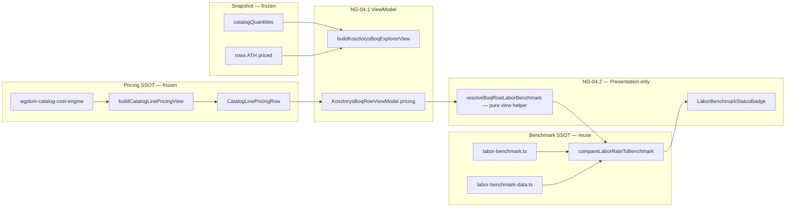

# NG-04.2 — Benchmark per Line · AUDIT ONLY

> **Status:** **AUDIT COMPLETE** — bez implementacji  
> **Data:** 2026-07-01  
> **Baseline prod:** **v2.63.9** · commit **`5112718`** · NG-04.1 BOQ Explorer **RELEASED**  
> **Epic:** NG-04 — Kosztorys Workspace PRO · **Faza 04.2**  
> **DESIGN FREEZE (propozycja):** [`docs/NG-04.2-DESIGN-FREEZE.md`](../docs/NG-04.2-DESIGN-FREEZE.md)

---

## 0. Werdykt audytu

| Pole | Wartość |
|------|---------|
| **Feasibility** | **HIGH** — wszystkie dane i UI już istnieją w warstwie Ceny / `labor-benchmark` |
| **Rekomendowany scope NG-04.2** | Badge **robocizny** per linia BOQ (below / ok / above / ukryty) |
| **Model danych** | **Brak nowego modelu** — Principle #004; derive z `KosztorysBoqRowViewModel.pricing` |
| **Parser / snapshot** | **Bez zmian** |
| **Gotowość IMPLEMENT** | **TAK** — po akceptacji DESIGN FREEZE NG-04.2 |

---

## 1. Kontekst po NG-04.1 (2.63.9)

### 1.1 Stan BOQ Explorer

```
useMemo → buildKosztorysBoqExplorerView({ item })   // merge ONCE
       → KosztorysBoqExplorerSection
            useMemo → filterKosztorysBoqRows(...)    // search/filter ONLY
            visibleRows = slice(PREVIEW_LIMIT=20)
```

**Kolumny obecne (desktop + mobile):** LP · Opis · j.m. · Ilość · KNR · Cena ATH · Wartość ATH · Cena WGDOM · Wartość WGDOM.

**Brak:** kolumna / pole **Benchmark** (planowane w wireframe NG-04.0 §2.1).

### 1.2 Luka względem oryginalnego audytu NG-04

| ID | Brak (audyt NG-04) | Status po 04.1 |
|----|-------------------|----------------|
| G-03 | Wycena z benchmarkiem tylko na Ceny | **Częściowo** — WGDOM ceny w BOQ, benchmark nadal tylko agregat `marketHint` |
| G-05 | Brak side-by-side ATH vs WGDOM + Δ | **Częściowo** — ATH+WGDOM obok siebie; brak Δ benchmark |

NG-04.2 domyka **G-03** na poziomie linii (read-only badge), bez przenoszenia kalkulatora oferty na Kosztorys.

---

## 2. Mapa źródeł benchmarków

### 2.1 Diagram SSOT



### 2.2 Tabela źródeł

| # | Źródło | Plik | Co dostarcza | Użycie w NG-04.2 |
|---|--------|------|--------------|------------------|
| **S1** | Stawka robocizny per linia | `CatalogLinePricingRow.laborPlnPerUnit` | zł/j.m. po klasyfikacji WGDOM | **Input** do porównania |
| **S2** | Kategoria WGDOM | `CatalogLinePricingRow.categoryId` | mapowanie na benchmark | **Input** |
| **S3** | Jednostka miary | `CatalogLinePricingRow.unit` → `normalizeWgdomCostUnit()` | dopasowanie zakresu j.m. | **Input** |
| **S4** | Zakresy rynkowe | `labor-benchmark-data.ts` · `LABOR_BENCHMARK_RANGES` | min–max zł/j.m. per kategoria | **SSOT zakresów** |
| **S5** | Porównanie | `compareLaborRateToBenchmark()` | `LaborBenchmarkComparison` | **Jedyny algorytm** |
| **S6** | Edycja benchmarku | `TenderPriceBasePanel` · `ACTIVE_LABOR_BENCHMARK_EDITION` | Wrocław Q2 2026 itd. | Read-only odczyt tych samych danych |
| **S7** | Agregat dashboard | `buildKosztorysProDashboard` → `marketHint` | tekst KPI z **categorySummary** avg | **Bez zmian** — inny poziom agregacji |
| **S8** | Wpływ finansowy | `labor-benchmark-impact.ts` | odchylenie × ilość per **kategoria** | **Poza NG-04.2** (badge only) |
| **S9** | Historia materiałów | `material-history.ts` | trend vs firma 90 dni | **Poza scope** — to nie benchmark rynku |
| **S10** | Market average P3.1 | `work-catalog/market-average-engine.ts` | średnia Biblioteka Robót | **Explicit out of scope** (NG-04 §9) |

### 2.3 Czego NIE ma (i nie powstanie w 04.2)

| Typ benchmarku | Status |
|----------------|--------|
| Benchmark **ATH** (cena zamawiającego vs rynek) | ❌ brak silnika; wymagałby nowego modelu |
| Benchmark **materiału rynkowego** per linia | ❌ tylko historia firmy (`material-impact`) |
| Benchmark **sprzętu / R-M-S ATH** | ❌ nie w snapshot |
| **market-average-engine** | ❌ osobny epic P3 |

### 2.4 Ważna korekta względem Ceny tab

W **`TenderCatalogLinePricingSection`** benchmark **robocizny** jest dziś na poziomie **`categorySummary`** (średnia rbh kategorii), **nie** na każdej linii w tabeli „Katalog linii kosztorysu”.

NG-04.2 wprowadza benchmark **per linia BOQ** przez `laborPlnPerUnit` **tej** pozycji — dokładniejsze niż dziedziczenie statusu kategorii. Algorytm ten sam (`compareLaborRateToBenchmark`), granularność inna.

---

## 3. Analiza możliwości reuse

### 3.1 MUST reuse (Zero Duplicate Logic)

| Asset | Rola w NG-04.2 | Zmiana |
|-------|----------------|--------|
| `compareLaborRateToBenchmark()` | Porównanie stawki vs zakres | **0** — import only |
| `LaborBenchmarkStatusBadge` | Badge compact w tabeli / karcie | **0** — import only |
| `normalizeWgdomCostUnit()` | Normalizacja j.m. z pricing row | **0** |
| `laborBenchmarkStatusClass` / `Icon` | Styling | **0** |
| `KosztorysBoqRowViewModel.pricing` | Już osadzone w ViewModel 04.1 | **0** |
| `boqRowMobileFields` / `BoqRowDesktopCells` | Many Views — dodać kolumnę prezentacji | **UI only** |

### 3.2 SHOULD reuse

| Asset | Rola | Uwaga |
|-------|------|-------|
| `LaborBenchmarkCell` | Tooltip / rozszerzony widok (zakres + nasza stawka) | Opcjonalnie NG-04.3, nie blocker 04.2 |
| `formatLaborBenchmarkRange` | Tekst zakresu w tooltip | Prezentacja |
| Wzorzec z `TenderPriceBasePanel` | `compareLaborRateToBenchmark(laborPln, row.id, row.unit)` | Identyczny call pattern |

### 3.3 NOWY helper (dozwolony — warstwa prezentacji, nie model)

```typescript
// Propozycja — lib pure, NIE część KosztorysBoqRowViewModel
function resolveBoqRowLaborBenchmark(
  row: KosztorysBoqRowViewModel,
): LaborBenchmarkComparison | null
```

**Reguły:**
- Zwraca `null` gdy `row.isUnknown` lub `laborPlnPerUnit <= 0`
- Woła wyłącznie `compareLaborRateToBenchmark` + `normalizeWgdomCostUnit`
- **Nie** woła `buildCatalogLinePricingView` ani `buildKosztorysBoqExplorerView`
- Może być testowany w `test-ng04-2-benchmark-per-line.mjs`

### 3.4 Zakaz reuse / antywzorce

| Antywzorzec | Dlaczego |
|-------------|----------|
| Kopiowanie `LABOR_BENCHMARK_RANGES` do BOQ lib | Duplikacja SSOT |
| Nowy typ `BoqBenchmarkRowViewModel` | Łamie Principle #004 |
| Dodanie `benchmarkStatus` do `KosztorysBoqRowViewModel` | Łamie #004 (nowe pole modelu) |
| Dziedziczenie statusu z `categorySummary` zamiast per-line labor | Fałszywe OK/above na outlierach |
| Drugi `buildCatalogLinePricingView` w Kosztorys | Łamie #003 |
| Integracja `market-average-engine` | Poza freeze |

### 3.5 Zgodność z Principles #001–#003

| Principle | Wymaganie | NG-04.2 compliance |
|-----------|-----------|-------------------|
| **#001** One ViewModel | Jedna tablica rows, wiele widoków | Badge w `KosztorysBoqRowFields` — **PASS** |
| **#002** Lazy Rendering | Brak rebuild przy search/filter | Benchmark tylko w renderze wiersza — **PASS** |
| **#003** Search ≠ Merge | Merge tylko w `buildKosztorysBoqExplorerView` | Helper prezentacji poza merge — **PASS** |

---

## 4. Wpływ na wydajność

### 4.1 Baseline M8 (NG-04.1 · prod cap 500)

| Metryka | Wynik M8 | Próg |
|---------|----------|------|
| Build ViewModel 500 | ~56 ms | < 2500 ms |
| 50× search burst | ~3.5 ms | < 600 ms |
| 20× filter cycle | ~320 ms | < 400 ms |
| ViewModel reference po search/filter | unchanged | required |

### 4.2 Szacunek kosztu NG-04.2

| Operacja | Złożoność | Szacunek 500 linii |
|----------|-----------|-------------------|
| `compareLaborRateToBenchmark` | O(k), k ≈ 15 zakresów | < 0.05 ms / wiersz |
| 500× compare (worst case „Pokaż wszystkie”) | — | **< 25 ms** jednorazowo |
| Domyślny UI (20 widocznych) | 20× compare | **< 1 ms** / render |
| React re-render przy search | Tylko visible rows | Bez dodatkowego merge |

**Wniosek:** NG-04.2 mieści się w budżecie M8, **o ile**:
1. Benchmark **nie** jest liczony w `buildKosztorysBoqExplorerView`
2. Benchmark **nie** jest w `filterKosztorysBoqRows`
3. Opcjonalnie `React.memo` na komórce badge — nice-to-have, nie blocker

### 4.3 Ryzyko wydajnościowe (niskie)

| Ryzyko | Mitigacja |
|--------|-----------|
| `enrichLaborBenchmarkWithHistory` w każdej linii | **Nie używać** w compact badge — tylko status; historia = NG-04.3 |
| Brak wirtualizacji przy 500 badge | Akceptowalne przy <25 ms; virtual list = NG-04.4+ |
| Podwójne `pricingView` (dashboard + BOQ) | Już istnieje w 04.1 — **bez zmiany** |

### 4.4 Propozycja gate M8.2 (pre-release 04.2)

Rozszerzyć `test-ng04-m8-large-boq-performance.mjs`:
- 500× `resolveBoqRowLaborBenchmark` < 50 ms total
- Static: `buildKosztorysBoqExplorerView` **nie** importuje `compareLaborRateToBenchmark`
- Search burst po symulacji benchmark render — reference ViewModel unchanged

---

## 5. Analiza regresji

### 5.1 Macierz regresji

| Obszar | Ryzyko | Mechanizm | Mitigacja |
|--------|--------|-----------|-----------|
| **NG-02 runtime** | NONE | Brak dotyku `useTenderPipelineRuntime` | — |
| **Parsery ATH/PDF** | NONE | Brak zmian snapshot | `test-tp200b-snapshot-fidelity.mjs` |
| **buildCatalogLinePricingView** | LOW | Tylko read `pricing` z ViewModel | `test-tender-price-bridge.mjs` |
| **Tab Ceny** | LOW | Shared badge — osobny mount | Smoke `TenderBidProposalPanel` |
| **marketHint KPI** | LOW | Osobna ścieżka category avg | Test: hint nadal z categorySummary |
| **TOP 20** | NONE | `selectTopCostRows` bez benchmark | `test-v41` T09–T13 |
| **Search / filter M8** | MEDIUM | Nowy kod w row render | M8.2 gate + static assert |
| **Mobile layout** | MEDIUM | +1 kolumna / pole karty | Manual ≤390px |
| **UNKNOWN pozycje** | LOW | Badge ukryty | Test: isUnknown → brak badge |
| **Spójność z Ceny** | INFO | Per-line vs category avg może różnić się od hint | Dokumentacja UX — oczekiwane |

### 5.2 Regresja względem NG-02 (process phase)

| Check | Oczekiwanie |
|-------|-------------|
| `deriveKosztorysProcessPhase` | **ready** bez zmian |
| Lazy heavy parse mount | Bez zmian |
| Trust / ath_cap | Bez zmian |

### 5.3 Regresja względem NG-04.1

| Check | Oczekiwanie |
|-------|-------------|
| Kolumny ATH/WGDOM | Bez zmian wartości |
| `filterKosztorysBoqRows` | Bez zmian sygnatury |
| `buildKosztorysBoqExplorerView` | Bez nowych pól ( #004 ) |
| M8 PASS | M8.2 PASS po implementacji |

### 5.4 Golden tenders

| Tender | Test |
|--------|------|
| TP182 | `test-v41-kosztorys-workspace.mjs` |
| TP200B cap 500 | `test-tp200b-snapshot-fidelity.mjs` |
| Labor benchmark | `test-labor-benchmark.mjs` · `test-labor-benchmark-pro.mjs` |

---

## 6. UX freeze (propozycja)

### 6.1 Kolumna Benchmark (desktop)

| Stan | Wyświetlanie |
|------|--------------|
| `isUnknown` | **Ukryj** (puste / „—”) |
| `laborPlnPerUnit` null/0 | **Ukryj** |
| `status === unavailable` | **Ukryj** (brak mapowania kategorii/j.m.) |
| `below` / `ok` / `above` | `LaborBenchmarkStatusBadge` **compact** |

### 6.2 Mobile card

Dodać pole `{ label: "Benchmark rbh", value: <badge> }` po „Cena WGDOM”, tylko gdy status ≠ unavailable.

### 6.3 Poza scope 04.2

- Tooltip FOUND_NO_VALUE ATH (→ **NG-04.3**)
- Wpływ finansowy per linia (→ backlog / Ceny)
- Filtr „tylko powyżej benchmarku” (→ NG-04.4 polish)
- Material trend badge (→ osobny pod-epic)

---

## 7. Test plan (propozycja — bez implementacji)

```bash
npx vite-node scripts/test-ng04-2-benchmark-per-line.mjs   # nowy
npx vite-node scripts/test-ng04-kosztorys-boq-explorer.mjs
npx vite-node scripts/test-ng04-m8-large-boq-performance.mjs  # + M8.2
npx vite-node scripts/test-v41-kosztorys-workspace.mjs
npx vite-node scripts/test-labor-benchmark.mjs
npm run build
```

**Przypadki testowe (min):**
- T01: classified row ELEKTRYKA m2 → status ok/above/below zgodny z `compareLaborRateToBenchmark`
- T02: UNKNOWN → null / brak badge
- T03: kategoria bez zakresu dla j.m. → unavailable → ukryty
- T04: static — `tender-kosztorys-boq-explorer.ts` nie importuje `labor-benchmark`
- T05: spójność — ten sam laborPln co w `CatalogLinePricingRow` dla tego LP

---

## 8. Production impact

| Warstwa | Impact |
|---------|--------|
| KV / sync | **NONE** |
| Parsery | **NONE** |
| Bundle size | **LOW** — reuse istniejących modułów już w bundle (Ceny) |
| Tab Kosztorys UX | **LOW** — jedna kolumna / pole karty |

---

## 9. Rekomendacja fazowa

| Faza | Deliverable | Zależność |
|------|-------------|-----------|
| **NG-04.2** | Badge rbh per linia BOQ | Akceptacja DESIGN FREEZE |
| **NG-04.3** | ATH tooltip + opcjonalnie `LaborBenchmarkCell` expanded | Po 04.2 |
| **NG-04.4** | Filtry benchmark, mobile polish, EPIC CLOSE | Po 04.3 |

---

## 10. Akceptacja audytu

Implementacja **NG-04.2** może startować gdy:

- [ ] Ten audyt zaakceptowany
- [ ] [`docs/NG-04.2-DESIGN-FREEZE.md`](../docs/NG-04.2-DESIGN-FREEZE.md) zaakceptowany (w tym Principle **#004**)
- [ ] Brak równoległej zmiany `buildCatalogLinePricingView` / parserów

**Workflow:** PLAN (opcjonalny krótki) → IMPLEMENT → TEST → BUILD → COMMIT (na polecenie) → PUSH → VERIFY
