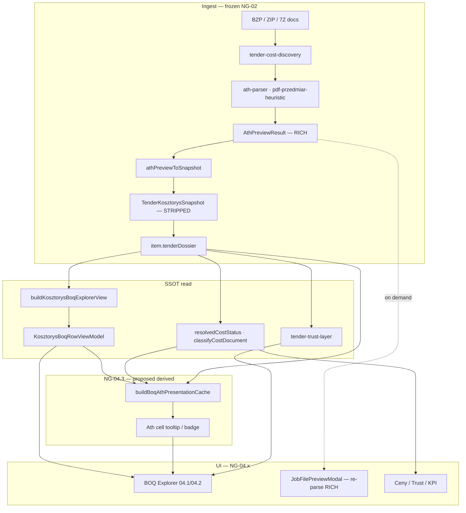

# NG-04.3 — ATH Fidelity · AUDIT ONLY

> **Status:** **AUDIT COMPLETE** — bez implementacji  
> **Data:** 2026-07-01  
> **Baseline prod:** **v2.63.10** · NG-04.2 Benchmark per Line **RELEASED**  
> **Epic:** NG-04 — Kosztorys Workspace PRO · **Faza 04.3**  
> **DESIGN FREEZE (propozycja):** [`docs/NG-04.3-DESIGN-FREEZE.md`](../docs/NG-04.3-DESIGN-FREEZE.md)

---

## 0. Werdykt audytu

| Pole | Wartość |
|------|---------|
| **Feasibility NG-04.3 (UI-only)** | **HIGH** — FOUND_NO_VALUE, source, trust, KNR hint, tooltip states z snapshot + SSOT |
| **Feasibility pełne R/M/S / code / przedmiar per LP** | **MEDIUM** — dane w `AthPreviewResult`; snapshot je obcina; odzysk bez NG-02 = modal + derived cache z re-parse on-demand |
| **Zmiana parsera / snapshot** | **Poza NG-04.3** — backlog G-02 / NG-04.4+ (`parserVersion` bump) |
| **Gotowość PLAN** | **TAK** po akceptacji DESIGN FREEZE |

**Hasło:** ATH Fidelity = **użytkownik wie skąd pochodzi cena ATH, dlaczego jest „—”, i gdzie szukać pełnej wiarygodności** — bez rozszerzania `KosztorysBoqRowViewModel`.

---

## 1. Mapa przepływu danych

### 1.1 Diagram end-to-end



### 1.2 Warstwy fidelity

| Warstwa | Plik / typ | Fidelity | Persisted |
|---------|------------|----------|-----------|
| **L0 Parser** | `AthPreviewResult` | **Pełna** (code, przedmiar, R/M/S, categories) | Nie — tylko przy parse |
| **L1 Snapshot** | `TenderKosztorysSnapshot` | **Obcięta** (cap 500/500, brak code, brak breakdown) | Tak — KV/sync |
| **L2 BOQ ViewModel** | `KosztorysBoqRowViewModel` | **Merge catalog + rows** (ATH cena gdy match) | Nie — useMemo |
| **L3 BOQ UI** | `KosztorysBoqRowFields` | Kolumny + „—” | Render |
| **L4 Modal** | `JobFilePreviewModal` + re-parse | **Pełna** (do limitu 80 wierszy UI) | Session |

---

## 2. Audyt per obszar (8 zakresów)

### 2.1 FOUND_NO_VALUE

| Aspekt | Stan |
|--------|------|
| **Definicja SSOT** | `resolvedCostStatus()` → `FOUND_WITH_VALUE` \| `FOUND_NO_VALUE` \| `NOT_FOUND` (`tender-data-ssot.ts`) |
| **Warunek** | `kosztorys.ok` + brak `totalValue` > 0 PLN |
| **Gdzie w UI** | KPI Kosztorys, Trust (`kosztorys_no_prices`), Dokumenty „Bez cen”, DocumentSummary „Wymaga kalkulacji”, Ceny tryb `catalog` |
| **BOQ Explorer** | Kolumny ATH pokazują **„—”** (`formatBoqAthPrice`) — **brak rozróżnienia** FOUND_NO_VALUE vs brak match vs priced empty row |
| **Parser** | PDF przedmiar: rows bez `unitPrice`/`total` → naturalnie FOUND_NO_VALUE po snapshot |

**Utracone w BOQ:** semantyka „przedmiar bez cen” vs „wiersz bez dopasowania ATH” vs „cena pusta w priced ATH”.

---

### 2.2 Tooltipy ATH

| Aspekt | Stan |
|--------|------|
| **Plan NG-04.0** | Tooltip FOUND_NO_VALUE przy pustej Cena ATH |
| **Implementacja 04.1** | **Brak** tooltipów — tylko tekst „—” |
| **Modal** | Pełna tabela: Lp, **Podstawa (code)**, Opis, j.m., Ilość, Cena j., Wartość + sekcja Przedmiar |
| **Komponenty** | Radix `tooltip.tsx` w shellu; **nie** użyty w BOQ ATH |

**Dostępne dane do tooltipu (bez nowego ViewModel):**
- `row.athMatched`, `row.athUnitPrice`, `row.athTotal`
- `resolvedCostStatus(item)` (document-level)
- `classifyCostDocument(item)` (typ ATH/PDF)
- Trust reasons (`TrustReasonList` już na BOQ)

---

### 2.3 Source metadata

| Pole | Parser / discovery | Snapshot | BOQ ViewModel | BOQ UI |
|------|-------------------|----------|---------------|--------|
| `sourceFilename` | ✅ | ✅ | `meta.sourceFilename` | stopka sekcji |
| `sourceDocumentIndex` | ✅ (pipeline) | ✅ opcjonalnie | ❌ | ❌ |
| `zipInnerPath` | ✅ | ✅ opcjonalnie | ❌ | ❌ |
| `scanSummary.costDiscovery` | ✅ type, source, **confidence** | ✅ na dossier | ❌ | ❌ |
| `classifyCostDocument` | derived | — | ❌ | ❌ |
| `meta.catalogSourceLabel` | — | — | ✅ | **WGDOM** katalog, nie ATH |

**Utracone w BOQ:** typ dokumentu (ATH/PDF/XLSX), confidence discovery, ścieżka ZIP inner.

---

### 2.4 Confidence

| Typ | Gdzie istnieje | BOQ |
|-----|----------------|-----|
| **Discovery confidence** | `TenderCostDiscoveryResult.confidence` (0–1) | ❌ |
| **PDF przedmiar case** | `pdfPrzedmiarCase` 1/2/3, `noTextLayer`, `extractError` | ❌ (Trust partial) |
| **Work scope confidence** | `tender-work-scope-inference` → Executive / Przetarg | ❌ |
| **Formal requirements confidence** | SWZ parsers | ❌ |
| **Per-row ATH match confidence** | **Nie istnieje** | — |

**Wniosek:** NG-04.3 może pokazać **document-level** confidence (discovery + pdf case); per-row confidence wymagałby nowej heurystyki (poza scope bez audytu).

---

### 2.5 Explainability

| Mechanizm | Lokalizacja | BOQ |
|-----------|-------------|-----|
| `buildBidFlowExplanation()` | Tab **Ceny** | ❌ |
| Trust `TenderTrustReason` | Kosztorys (`TrustReasonList`) | ✅ częściowo |
| `buildKosztorysProAssessment` | KPI tekst | ✅ agregat |
| `resolvedCostStatusDisplay` hint | SSOT | ❌ w BOQ (tylko process bar) |
| `buildKosztorysAthVisibilityHint` | cap pozycji | Trust + hint tekstowy, nie per cell |

**Utracone:** krótkie „dlaczego ta komórka ATH jest pusta” — główny cel NG-04.3.

---

### 2.6 R/M/S fidelity

| Etap | Zawartość |
|------|-----------|
| **Parser ATH** | `AthPreviewCategory.breakdown` z pola `kn=` → `"R … · M … · S … PLN"` (`ath-parser.ts`) |
| **Snapshot** | `categories: { name, total }[]` — **breakdown usunięty** |
| **BOQ** | Brak |
| **Modal** | `summaryLines` ze składem R/M/S per dział |
| **Kalkulator** | Heurystyka `laborShareOfRow` na priced rows — **osobny silnik**, nie ATH R/M/S |

**Utracone:** 100% R/M/S per dział i per pozycja w snapshot i BOQ.

---

### 2.7 Kod KNR

| Etap | `code` / KNR |
|------|--------------|
| **AthPreviewRow.code** | ✅ `extractKnrCode(pd)` ATH; PDF heuristic `code` pełny |
| **TenderCostLine** | ❌ brak pola |
| **TenderCatalogQuantityLine** | ❌ brak pola |
| **athPreviewToSnapshot** | **Nie kopiuje** `code` |
| **BOQ `knrHint`** | `extractKatalogHintFromDescription(description)` — regex na opisie, **nie** z `code` |

**Gap:** PDF WM często ma bogatszy `code` w parserze niż regex na `description` w BOQ (np. pełna norma w Podstawie vs skrót w opisie).

**Freeze NG-04.4+:** persist `code` in `catalogQuantities` = parser bump.

---

### 2.8 Przedmiar source

| Etap | Przedmiar |
|------|-----------|
| **AthPreviewRow.przedmiar[]** | `{ quantity, formula? }` per pozycja |
| **Snapshot `przedmiar[]`** | Flat max **30**, `description` = prefix 80 znaków opisu pozycji, **brak LP** |
| **BOQ** | Brak |
| **Modal** | Tabela przedmiar z Lp, opis, ilość, **wzór** |

**Utracone:** powiązanie LP ↔ wzór obmiaru w snapshot; całość w BOQ.

---

## 3. Lista utraconych informacji (summary)

| ID | Informacja | Gdzie ginie | Wpływ UX |
|----|------------|-------------|----------|
| **L-01** | `AthPreviewRow.code` | `athPreviewToSnapshot` → `TenderCostLine` | Słabszy KNR w BOQ |
| **L-02** | `category.breakdown` (R/M/S) | Snapshot categories strip | Brak składu kosztów ATH w PRO |
| **L-03** | `przedmiar[]` per LP + formula | Snapshot flatten cap 30 | Brak obmiaru w BOQ |
| **L-04** | `row.category` / `categoryLp` | Nie w snapshot rows | Brak kontekstu działu w BOQ |
| **L-05** | FOUND_NO_VALUE semantics per cell | BOQ → samo „—” | Mylące przy partial match |
| **L-06** | `costDiscovery.confidence` | Nie w BOQ | Użytkownik nie widzi jakości źródła |
| **L-07** | `pdfPrzedmiarCase` 2/3 | Tylko Trust / modal banner | Brak w wierszu BOQ |
| **L-08** | `summaryLines` / narzuty | Snapshot (częściowo warnings only) | KPI bez ATH summary |
| **L-09** | `subtitle`, `documentType` | Snapshot (tylko `title` optional) | Słabszy kontekst dokumentu |
| **L-10** | Wiersze > 500 / priced cap | Snapshot cap | ath_cap trust (już jest) |
| **L-11** | Pełny parse przy każdym wejściu BOQ | Heavy parse lazy | Modal = jedyna pełna fidelity |

---

## 4. Możliwości odzyskania **bez zmian NG-02**

Zasada: **nie zmieniać** `useTenderPipelineRuntime`, contract heavy parse, ani shape merge w `buildKosztorysBoqExplorerView` poza **read-only** meta z dossier.

### 4.1 Derived presentation cache (#007 kontynuacja)

Nowy pure helper (propozycja):

```typescript
buildBoqAthPresentationCache(
  rows: KosztorysBoqRowViewModel[],
  ctx: {
    costStatus: ResolvedCostStatus;
    classified: ClassifiedCostDocument | null;
    pdfCase?: TenderKosztorysSnapshot["pdfPrzedmiarCase"];
  },
): ReadonlyMap<string, BoqAthPresentationMeta>
```

`BoqAthPresentationMeta` — **nie** część ViewModel:

| Pole | Źródło |
|------|--------|
| `athCellState` | `priced` \| `no_value_doc` \| `no_match` \| `empty_row` |
| `tooltipPl` | derived z state + costStatus |
| `sourceLabel` | `classifyCostDocument` |
| `confidenceLabel` | discovery confidence bucket |
| `knrSource` | `description_hint` (obecny knrHint) |

### 4.2 UI patterns (bez parsera)

| Obszar | Odzysk | Mechanizm |
|--------|--------|-----------|
| FOUND_NO_VALUE tooltip | ✅ HIGH | Derived state + `resolvedCostStatus` |
| Source chip | ✅ HIGH | `classifyCostDocument` + `sourceFilename` |
| Confidence (doc) | ✅ MEDIUM | `costDiscovery.confidence` z scanSummary |
| Explainability | ✅ HIGH | Tooltip + link „Pełny podgląd ATH” |
| KNR | ⚠️ PARTIAL | `knrHint` + tooltip „z opisu”; pełny code → modal |
| R/M/S | ⚠️ PARTIAL | CTA do modal (summaryLines); nie inline BOQ bez re-parse |
| Przedmiar | ⚠️ PARTIAL | CTA modal; snapshot `przedmiar[]` max 30 bez LP — słabe |
| Pełna fidelity | ✅ HIGH | **Istniejący** `JobFilePreviewModal` re-parse |

### 4.3 Opcjonalny session cache (poza NG-02)

- Po pierwszym otwarciu modalu: `Map<tenderId, AthPreviewResult>` w React context **sesji** — tylko prezentacja, nie sync.
- BOQ tooltip „wzór obmiaru” mógłby lookup `preview.rows[lp].przedmiar` **jeśli** użytkownik otworzył modal.
- **Ryzyko:** pamięć; **mitigacja:** cap 1 tender, TTL sesji.

### 4.4 Wymaga parsera / snapshot (poza NG-04.3)

| Potrzeba | Epic |
|----------|------|
| `code` w `catalogQuantities` | NG-04.4+ / G-08 |
| `breakdown` w snapshot categories | G-02 R/M/S |
| `przedmiar` indexed by LP | G-07 / parser bump |
| Per-row match confidence | Nowy AUDIT |

---

## 5. Stan UI po NG-04.2 (baseline)

| Element BOQ | ATH fidelity |
|-------------|--------------|
| Cena ATH / Wartość ATH | Wartość lub „—” |
| KNR | Regex z opisu |
| Benchmark rbh | WGDOM only |
| Trust | `TrustReasonList` pod tabelą |
| Pełny podgląd | CTA → modal (rich) |

---

## 6. Regresja i zależności

| Obszar | Ryzyko NG-04.3 |
|--------|----------------|
| NG-02 runtime | **NONE** jeśli tylko derived cache |
| `buildKosztorysBoqExplorerView` | **LOW** — brak nowych pól VM |
| M8 performance | **LOW** — cache podobny do benchmark |
| Modal | **NONE** — reuse |
| TP200B golden | **NONE** bez zmian snapshot |

---

## 7. Rekomendacja zakresu NG-04.3 (MVP)

**W scope (UI-only, #007):**
1. Tooltip / ikona przy Cena ATH (`priced` / FOUND_NO_VALUE / no match)
2. Source metadata chip (ATH/PDF + filename skrót)
3. Document confidence / pdf case badge (compact)
4. Link explainability → Pełny podgląd ATH
5. KNR: tooltip „wyekstrahowano z opisu” gdy brak pełnego code

**Poza scope 04.3:**
- Inline R/M/S per linia
- Persist `code` w snapshot
- Session preview cache (opcjonalnie 04.3.1)
- OCR PDF case 3

---

## 8. Test plan (propozycja)

| ID | Scenariusz |
|----|------------|
| T01 | FOUND_NO_VALUE → tooltip „Przedmiar bez cen” |
| T02 | FOUND_WITH_VALUE + brak ath match → „Brak dopasowania wiersza ATH” |
| T03 | Priced row → brak tooltip lub „Cena zamawiającego” |
| T04 | Static: ViewModel bez pól athTooltip* |
| T05 | `classifyCostDocument` → source chip PDF vs ATH |
| T06 | TP200B — brak regresji snapshot |

---

## 9. Akceptacja audytu

- [ ] Audyt zaakceptowany
- [ ] [`docs/NG-04.3-DESIGN-FREEZE.md`](../docs/NG-04.3-DESIGN-FREEZE.md) zaakceptowany
- [ ] PLAN NG-04.3

**Następny krok:** PLAN ONLY → IMPLEMENT (na polecenie)
