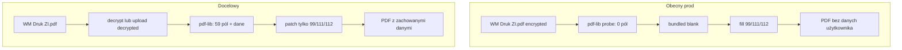

# ZI-2026 — weryfikacja źródła szablonu (TEMPLATE SOURCE)

**Data:** 2026-06-15  
**Tryb:** READ ONLY · bez commit · bez push · bez deploy  
**Kontekst:** smoke PASS na mapping 99/111/112, ale output oparty na pustym blanku — niezgodność z workflow WM Druk

---

## Werdykt skrócony

| Pytanie | Odpowiedź |
|---------|-----------|
| Co użył smoke? | **Bundled template** (odszyfrowany blank Tauron) — **nie** szablon WM Druk z KV |
| Czy prod używa aktywnego ZI.pdf z WM Druk? | **NIE** (w praktyce) — szyfrowany upload → cichy fallback na blank |
| Czy istniejące dane użytkownika są zachowane? | **NIE** przy obecnym fallbackie · **TAK** po naprawie (fill na odszyfrowanym źródle WM) |

---

## 1. Jaki plik został użyty w smoke?

**Odpowiedź: bundled template (odszyfrowany blank Tauron 2026)**

Smoke **nie** pobiera szablonu z WM Druk (`kw-wm-print-templates` → storage URL). Wczytuje plik repo:

```33:34:scripts/test-wm-print-zi-2026-smoke.mjs
const templatePath = join(process.cwd(), "public", "wm-print", "zi-tauron-2026-template.pdf");
const templateBytes = new Uint8Array(readFileSync(templatePath));
```

| Kategoria | Plik | Rola |
|-----------|------|------|
| **Użyty w smoke** | `public/wm-print/zi-tauron-2026-template.pdf` | Bundled SSOT — qpdf decrypt z oficjalnego `zi.ashx` (blank) |
| Nie użyty | Szablon WM Druk (`ZI.pdf` w storage / KV) | Brak fetch z `storageUrl` w smoke |
| Nie użyty bezpośrednio | `tauron-zi-official.ashx` | Źródło oficjalne; bundled to jego wersja odszyfrowana |
| Output smoke | `audit/.../zi-2026-smoke-sepa-83-7.pdf` | Blank + 3 pola adresu §4 |

**Dowód pdf-lib (probe 2026-06-15):**

| Plik | pdf-lib `fieldCount` | pdf.js `nonEmptyCount` |
|------|----------------------|------------------------|
| bundled | **59** | 4 (domyślne Off na checkboxach) |
| smoke output | **59** | **7** (tylko 99/111/112 + checkboxy Off) |
| user `ZI.pdf` (Desktop) | **0** | **14** (Dawid, Thai Thanh, Wrocław, Szkolna, 55, …) |

Smoke waliduje **mapping i geometrię pól**, nie **workflow źródła dokumentu**.

---

## 2. Czy `generatePdfZiTauron2026()` korzysta z aktywnego szablonu ZI z WM Druk?

**Odpowiedź: NIE** (w typowym workflow produkcyjnym)

### Co robi prod (intencja)

Łańcuch wywołań jest poprawny **do momentu resolve**:

```121:125:src/lib/wm-print/generate-zip.ts
    const groupFiles = getWmPrintTemplateFiles(t);
    for (let idx = 0; idx < groupFiles.length; idx++) {
      const tf = groupFiles[idx];
      const sourceBytes = await fetchBytes(tf.storageUrl);
      const generated = await generateFromTemplateBytes(t, sourceBytes, vars);
```

Dla `t.name === "ZI"` → `generatePdfZiTauron2026(sourceBytes, vars)` z bajtów **aktywnego pliku grupy ZI** w panelu Szablony.

### Gdzie odchodzi od rzeczywistego ZI.pdf

```61:68:src/lib/wm-print/generate-pdf-zi-tauron2026.ts
export async function resolveZiTauron2026TemplateBytes(sourceBytes: Uint8Array): Promise<Uint8Array> {
  try {
    const probe = await PDFDocument.load(sourceBytes, { ignoreEncryption: true });
    if (probe.getForm().getFields().length >= 50) return sourceBytes;
  } catch {
    /* fallback bundled */
  }
  return loadZiTauron2026BundledTemplateBytes();
}
```

**Mechanizm:**

1. pdf-lib na **szyfrowanym** Tauron R6/AESv3 (puste hasło) widzi **0 pól** — potwierdzone w [`ZI-2026-LIBRARY-AUDIT-REPORT.md`](ZI-2026-LIBRARY-AUDIT-REPORT.md).
2. Warunek `>= 50` **nie przechodzi** → **cichy fallback** na `public/wm-print/zi-tauron-2026-template.pdf` (pusty blank).
3. Wypełniane są wyłącznie pola 99/111/112 na **blanku**, nie na pliku użytkownika.

**Referencja użytkownika** `C:/Users/dawid/Desktop/Dokumenty/ZI.pdf` (wgrany/wypełniony szablon WM):

- pdf.js: **59 pól**, **14 niepustych** (m.in. imię, nazwisko, miejscowość, checkbox „Tak”, stare wartości §4).
- pdf-lib: **0 pól** → generator **zastąpiłby** ten plik blankiem bundlowym.

**Wniosek:** Architektura **deklaruje** źródło WM Druk, ale **domyślnie ignoruje** zawartość szyfrowanego `ZI.pdf` i generuje dokument od zera.

---

## 3. Minimalna poprawka architektury (gdy NIE)

### Cel biznesowy

1. Pobrać **aktywny** `ZI.pdf` z WM Druk (storage).
2. **Zachować** wszystkie istniejące `/V` (dane użytkownika).
3. **Nadpisać tylko** `Pole tekstowe 99`, `111`, `112` z `JOB_*`.

### Minimalny fix (3 warstwy)

#### A. Usunąć cichy fallback blank → błąd lub decrypt

**Nie** zamieniać szyfrowanego uploadu na bundled bez ostrzeżenia. Opcje:

| Wariant | Opis |
|---------|------|
| **A1 (strict)** | Gdy `fieldCount < 50` → `throw` z komunikatem: „Szablon ZI wymaga odszyfrowania — wgraj wersję po qpdf lub skontaktuj się z adminem” |
| **A2 (decrypt path)** | Warstwa decrypt **przed** pdf-lib (patrz B) |

Bundled zostaje tylko jako **seed / brak pliku w grupie**, nie jako zamiennik wypełnionego `ZI.pdf`.

#### B. Decrypt źródła WM (bloker pdf-lib)

Jedna z dróg (wybór produktowy — minimalna zmiana logiczna):

```
fetchWmPrintFileBytes(storageUrl)
  → decrypt R6 (qpdf CLI w CI / worker, lub pikepdf w Edge)
  → pdf-lib.load(decryptedBytes)   // 59 pól, z danymi użytkownika
  → setText tylko 99, 111, 112
  → save (opcjonalnie re-encrypt jak pikepdf PoC)
```

**Minimalna wersja bez Pythona w prod:** decrypt **przy uploadzie** szablonu ZI w `uploadWmPrintTemplateFile` / Edge `storage-upload` — zapisać w storage **kopię odszyfrowaną** (lub zastąpić upload wersją post-qpdf). Wtedy pdf-lib w przeglądarce widzi `fieldCount=59` i `resolve` zwraca `sourceBytes`.

#### C. Smoke — oddzielny gate workflow

Dodać drugi test (nie zastępujący obecnego):

- fixture: **rzeczywisty** `ZI.pdf` z WM (np. Desktop reference),
- asercja: po generacji **nadal** `Pole tekstowe 39 = Dawid`, checkbox 39 = Tak, itd.,
- plus nowe 99/111/112.

Obecny smoke pozostaje testem **mapowania na blanku**.

### Diagram (stan obecny vs docelowy)



---

## 4. Czy po użyciu rzeczywistego ZI.pdf wszystkie dane zostaną zachowane?

### Obecny kod — **NIE**

Fallback na bundled **usuwa** 14 niepustych pól z referencyjnego `ZI.pdf` (pdf.js). Smoke output ma tylko adres §4 + domyślne checkboxy.

### Po poprawce (fill na odszyfrowanym źródle WM) — **TAK** (z zastrzeżeniami)

`generatePdfZiTauron2026()` **już** modyfikuje wyłącznie trzy pola:

```95:109:src/lib/wm-print/generate-pdf-zi-tauron2026.ts
  const values: Record<string, string> = {
    "Pole tekstowe 99": (vars.JOB_STREET ?? "").trim(),
    "Pole tekstowe 111": formatBuildingForZi2026(vars.JOB_BUILDING ?? ""),
    "Pole tekstowe 112": (vars.JOB_APARTMENT ?? "").trim(),
  };

  for (const [fieldName, value] of Object.entries(values)) {
    try {
      form.getTextField(fieldName).setText(value);
```

Gdy `resolve` zwróci **bytes użytkownika** (odszyfrowane, 59 pól), pdf-lib load/save **nie czyści** pozostałych pól — nadpisuje tylko wskazane trzy.

**Zastrzeżenia (poza zakresem tego raportu, ale ważne):**

| Temat | Ryzyko |
|-------|--------|
| Re-save pdf-lib | Może zmienić rozmiar AP / NeedAppearances — wymaga manual gate Edge/Adobe |
| Szyfrowanie wyjścia | pdf-lib save domyślnie **nie** R6 — może być OK dla WM druku |
| Stare wartości w 99/102/111 | Użytkownik miał Szkolna/55/5 — nowy mapping **111/112** nadpisze budynek/lokal; pole **102** (kod pocztowy w starym fill) **nie jest** czyszczone przez generator |
| Górny wiersz §4 (95/96/97) | Generator nie dotyka — zachowane jeśli były w źródle |

**Potwierdzenie empiryczne (do zrobienia w IMPLEMENT):** uruchomić generator z `Desktop/Dokumenty/ZI.pdf` **po** decrypt → pdf.js diff before/after: wszystkie pola poza 99/111/112 identyczne.

---

## Powiązane pliki (analiza)

| Plik | Rola w źródle szablonu |
|------|------------------------|
| `scripts/test-wm-print-zi-2026-smoke.mjs` | Bundled only — **nie** symuluje WM Druk |
| `src/lib/wm-print/generate-pdf-zi-tauron2026.ts` | `resolveZiTauron2026TemplateBytes` — fallback blank |
| `src/lib/wm-print/generate-zip.ts` | Fetch WM `storageUrl` → przekazanie do generatora |
| `src/lib/wm-print/upload.ts` | Upload bez normalizacji decrypt |
| `public/wm-print/zi-tauron-2026-template.pdf` | Bundled blank SSOT |
| `docs/ZI-2026-HANDOFF.md` | Dokumentuje fallback encrypted → bundled |

---

## Artefakty probe (READ ONLY)

| Plik | Opis |
|------|------|
| `audit/tauron-audit-2026-06-15/_readonly-template-source-probe.mjs` | Skrypt diagnostyczny (nie prod) |
| `audit/tauron-audit-2026-06-15/zi-2026-template-source-probe.json` | Wynik pdf-lib + pdf.js |

---

## Rekomendacja kolejności (bez implementacji w tej sesji)

1. **P0 workflow:** decrypt-on-upload lub decrypt-before-fill — **koniec cichego fallbacku** na blank przy wypełnionym `ZI.pdf`.
2. **P0 test:** smoke „WM source preservation” na `Desktop/Dokumenty/ZI.pdf` (lub KV prod snapshot).
3. **P1:** mapping 99/111/112 (już PASS na blanku) — regresja na źródle z danymi.
4. **Manual gate:** Edge — dane użytkownika + nowy adres §4 widoczne razem.

---

**STOP RELEASE** — ten raport nie zmienia kodu prod. Decyzja o IMPLEMENT po akceptacji architektury decrypt + preservation gate.
