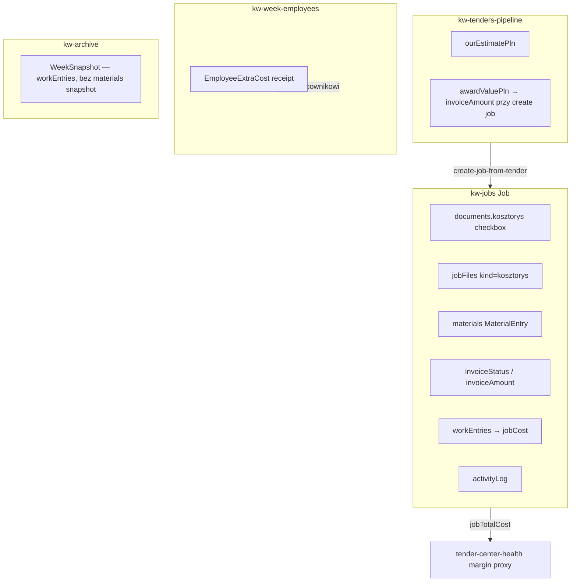
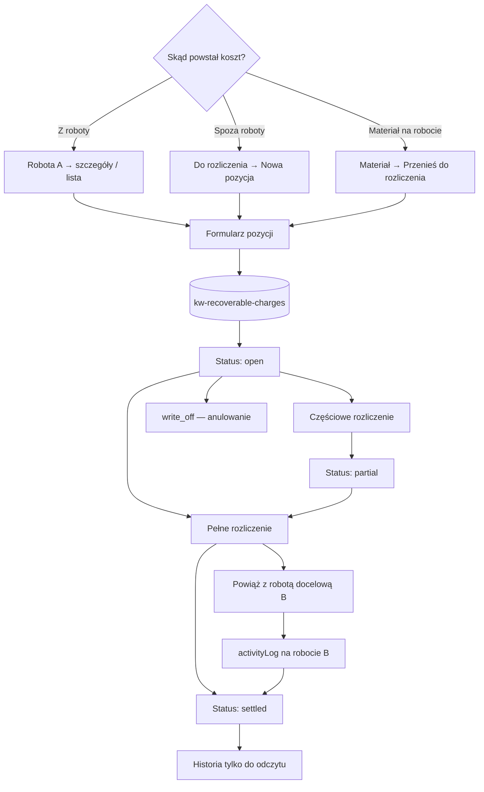

# Sprint 20.3A — Additional Billing System (AUDIT + DESIGN ONLY)

> **Data audytu:** 2026-06-06  
> **Tryb:** AUDYT + DESIGN — **bez implementacji, bez commitów**  
> **Prod baseline:** v2.45.41 · Sprint 20.1B.1 CLOSED  
> **Robocza nazwa wewnętrzna:** „Szymon, ja dopiszę”  
> **Nazwa produktowa (propozycja):** **Do rozliczenia** / **Do odzyskania**

---

## Spis treści

1. [Problem biznesowy](#1-problem-biznesowy)
2. [Analiza aktualnego systemu](#2-analiza-aktualnego-systemu)
3. [Modele biznesowe A / B / C](#3-modele-biznesowe-a--b--c)
4. [Rekomendowany model danych](#4-rekomendowany-model-danych)
5. [Workflow produktowy](#5-workflow-produktowy)
6. [Dashboard i KPI](#6-dashboard-i-kpi)
7. [Menu i UX — Media merge](#7-menu-i-ux--media-merge)
8. [Responsive audit — Admin Layout](#8-responsive-audit--admin-layout)
9. [Ryzyko wdrożenia](#9-ryzyko-wdrożenia)
10. [Propozycja sprintów](#10-propozycja-sprintów)
11. [RECOMMENDATION](#11-recommendation)

---

## 1. Problem biznesowy

### 1.1 Scenariusz typowy

```
Robota zakończona → kosztorys zamknięty → faktura wystawiona
        ↓ (tygodnie/miesiące później)
Dodatkowe prace / materiał / naprawa poza zakresem
        ↓
Firma płaci ludziom i materiał → klient obiecał „później”
        ↓
Brak śledzenia → zapomnienie → strata finansowa
```

### 1.2 Wymagania systemowe (must-have)

| # | Wymaganie |
|---|-----------|
| 1 | Rejestracja pozycji **powiązanej z robotą** (Scenariusz A) |
| 2 | Rejestracja pozycji **bez roboty** (Scenariusz B) |
| 3 | **Częściowe rozliczenie** z historią (Scenariusz C) |
| 4 | Powiązanie rozliczenia z **kolejną robotą** klienta |
| 5 | **KPI** — ile pozycji i ile PLN czeka na odzysk |
| 6 | Audyt: kto utworzył, kiedy, skąd, gdzie rozliczono |

### 1.3 Ograniczenia projektowe WGDOM (z audytów poprzednich sprintów)

- Nowe pola w `Job` — możliwe, ale **ostrożnie** (`mergeJobsById` w `cloud-sync.ts`)
- Nowy klucz KV — **dopuszczalny** (wzorzec: `kw-employee-leaves`, `kw-tenders-pipeline`)
- Bez zmian Edge Functions — preferowane (storage upload już istnieje)
- Mobile-first dla inspektora; admin desktop + mobile nav

---

## 2. Analiza aktualnego systemu

### 2.1 Mapa architektury — billing w WGDOM dziś



### 2.2 Jobs — co już istnieje

| Mechanizm | Plik / typ | Co robi | Gap względem „Do rozliczenia” |
|-----------|------------|---------|-------------------------------|
| **`MaterialEntry`** | `app-domain.ts` L185–190 | `description`, `cost`, `date` na robocie | Brak statusu, brak rozliczenia, brak powiązania z fakturą, tylko admin |
| **`jobFiles` kosztorys** | `job-documents.ts`, `JobsView` | Upload pliku + checkbox | Plik statyczny, brak pozycji ani wersjonowania VO |
| **`invoiceStatus/Amount`** | `Job` L274–276 | `pending` / `invoiced` / `paid` + kwota | **UI usunięte** (CHANGELOG ~2.45); pole martwe poza `invoiceAmount` z BZP |
| **`jobTotalCost()`** | `app-domain.ts` L1430+ | Robocizna + materiały | Koszt **wewnętrzny**, nie należność od klienta |
| **`activityLog`** | `job-activity.ts` | Audyt zdarzeń na robocie | Brak typów billing recovery |
| **`JobCostBreakdownPanel`** | `JobsView` + `company-labor-cost.ts` | Marża / ZUS / koszt własny | Nie dotyczy należności poza kontraktem |

**Odpowiedź KROK 1:**

| Pytanie | Rekomendacja |
|---------|--------------|
| Gdzie przechowywać pozycje? | **Osobna encja** + opcjonalny `sourceJobId` (Scenariusz B wymaga rekordów bez roboty) |
| Część Job? | **Nie jako główny model** — `materials[]` za słabe (brak partial settle, brak standalone) |
| Osobna encja? | **Tak** — `RecoverableCharge` w nowym KV `kw-recoverable-charges` |
| Wykorzystać istniejące? | **Tak** — wzorce `MaterialEntry`, `EmployeeExtraCost`, `activityLog`, `appendJobActivity` |

### 2.3 Kosztorysy

| Warstwa | Gdzie | Uwagi |
|---------|-------|-------|
| Checklista dokumentów | `job.documents.kosztorys` | Boolean — „mamy dokument” |
| Plik | `jobFiles[]` kind `kosztorys` | Jeden slot per kind (najnowszy wygrywa) |
| Przetarg | `TenderPipelineItem.ourEstimatePln` | Osobny model; po create job **nie sync** zwrotny |
| Parser ATH | `ath-kosztorys-pdf.ts` | Import pozycji — **nie** podpięty pod billing recovery |

**Wniosek:** Kosztorys końcowy to **punkt zamknięcia zakresu umownego**. Pozycje „Do rozliczenia” muszą być **jawnie oznaczone jako poza zamkniętym kosztorysem** — nie jako kolejny `MaterialEntry` bez kontekstu.

### 2.4 Faktury

| Pole | Stan |
|------|------|
| `invoiceStatus` | W modelu, **brak UI** |
| `invoiceNumber` | W modelu, **brak UI** |
| `invoiceAmount` | Wypełniane z przetargu (`create-job-from-tender.ts`); read-only baner BZP w `JobsView` |
| `tender-center-health.ts` | Margin proxy: `(invoiceAmount - jobTotalCost) / invoiceAmount` na completed jobs |

**Wniosek:** Moduł fakturowania klienta był **wycofany z UI**. „Do rozliczenia” to **nie to samo** co faktura — to **należność / rezerwa do przyszłego rozliczenia**. Można w przyszłości powiązać z odświeżonym `invoiceStatus`, ale 20.3A powinien być **niezależny**.

### 2.5 Dashboard

| Element | Plik | Billing relevance |
|---------|------|-----------------|
| Kafelki operacyjne | `DashboardView.tsx` L372+ | Roboty, wypłata, ekipa, WM |
| `attentionCount` | `DashboardView.tsx` | pending receipts, docs, photos — **brak billing recovery** |
| Command Center | `CommandCenterExecutivePanel.tsx` | Health/financial używa martwych pól invoice |

### 2.6 Tender Center / Command Center

- `CommandCenterExecutiveSnapshot` — pipeline, health, forecast, action center
- `tender-center-health.ts` — `pendingInvoices` liczy `invoiceStatus === "pending"` (martwe dane)
- **Brak** operacyjnego „cash to recover” z realizacji

**Rekomendacja:** CC dostaje **opcjonalny** widget w 20.3C (owner view), nie w 20.3A.

### 2.7 Worker / Inspector

| Rola | Raportowanie kosztów | Możliwość reuse |
|------|---------------------|----------------|
| **Pracownik** | Paragony → `EmployeeExtraCost` (payroll) | Status pending/approved — wzorzec workflow |
| **Inspektor** | Brak kwot; alerty brak zlecenia/kosztorysu | Może **zgłaszać** pozycję (opis + zdjęcie) w 20.3B+ |
| **Admin** | `materials[]` na robocie | Główny kanał tworzenia w 20.3A |

### 2.8 Archiwum

- `kw-archive` — tygodnie listy płac; `workEntries` z robót w snapshot
- **Materiały robót nie są snapshotowane** per tydzień
- Robota nie ma archiwum — `status: completed` + live record

**Wniosek:** Pozycje „Do rozliczenia” powinny **żyć niezależnie od statusu roboty źródłowej** — inaczej znikną po „zamknięciu” roboty.

### 2.9 Klucze KV (istniejące)

```
kw-jobs, kw-directory, kw-week-employees, kw-archive,
kw-employee-leaves, kw-tenders-pipeline, kw-contacts, ...
```

**Propozycja nowego klucza:** `kw-recoverable-charges` (lub `kw-additional-billing`) — lista `RecoverableCharge[]`, merge jak `employee-leaves`.

---

## 3. Modele biznesowe A / B / C

### Scenariusz A — Powiązane z robotą

```
Źródło:     Robota „Szkoła nr 5” (completed)
Pozycja:    Dodatkowe malowanie — 630 PLN
Status:     open → partial → settled
Rozliczenie: Robota „Dom Kowalskich” — +630 PLN do faktury / noty
```

| Pole logiczne | Wartość |
|---------------|---------|
| `sourceJobId` | `job-szkola-5` |
| `sourceJobLabel` | denormalized: „ul. Szkolna 5” |
| `clientHint` | z `job.client` (WM / inny) |
| `amountOriginal` | 630 |
| `amountSettled` | 0 → 630 |
| `amountRemaining` | 630 → 0 |

### Scenariusz B — Poza systemem robot

```
Źródło:     brak jobId
Opis:       Naprawa bramy u klienta X
Kwota:      420 PLN
Adres:      ręczny / klient tekstowy
```

| Pole logiczne | Wartość |
|---------------|---------|
| `sourceJobId` | `null` |
| `standaloneTitle` | „Naprawa bramy — os. Słoneczne” |
| `standaloneClient` | „Klient polecający” |
| `amountOriginal` | 420 |

**Wymóg:** UI musi umożliwić utworzenie **bez wyboru roboty** — przycisk „Pozycja spoza roboty”.

### Scenariusz C — Częściowe rozliczenie

```
Utworzono:    1200 PLN (Robota A)
Rozliczenie 1: 500 PLN (Robota B) — 2026-03-10
Rozliczenie 2: 700 PLN (Robota C) — 2026-04-02
Status:       settled (remaining = 0)
```

**Ledger rozliczeń** (tablica `settlements[]`):

```typescript
interface ChargeSettlement {
  id: string;
  amount: number;
  settledAt: string;
  settledBy: string;          // admin displayName
  targetJobId?: string;       // opcjonalnie — rozliczenie na robocie
  targetJobLabel?: string;    // denormalized
  note?: string;
}
```

`amountRemaining = amountOriginal - sum(settlements.amount)`

---

## 4. Rekomendowany model danych

### 4.1 Encja `RecoverableCharge`

```typescript
type RecoverableChargeStatus = "open" | "partial" | "settled" | "written_off";

type RecoverableChargeCategory =
  | "extra_work"      // dodatkowe prace
  | "material"        // materiał
  | "repair"          // naprawa / poprawka
  | "other";

interface RecoverableCharge {
  id: string;
  createdAt: string;
  updatedAt: string;
  createdBy: string;              // admin id / name

  // Źródło (A lub B)
  sourceJobId?: string;           // null = Scenariusz B
  sourceJobLabel?: string;        // adres + m.{flat}
  standaloneTitle?: string;       // B: tytuł gdy brak job
  standaloneClient?: string;
  standaloneAddress?: string;

  category: RecoverableChargeCategory;
  description: string;            // „Dodatkowe malowanie klatki”
  amountOriginal: number;           // PLN, 2 dec
  amountSettled: number;            // derived / cached
  amountRemaining: number;        // derived / cached
  status: RecoverableChargeStatus;

  settlements: ChargeSettlement[];

  // Opcjonalne dowody
  receiptUrls?: string[];         // storage paths
  internalNote?: string;

  // Powiązanie z kosztem wewnętrznym (informacyjne)
  linkedPayrollExtraCostId?: string;  // future
  linkedMaterialEntryId?: string;     // future — migracja z Job.materials
}
```

### 4.2 Persistencja

| Aspekt | Decyzja |
|--------|---------|
| **KV key** | `kw-recoverable-charges` |
| **Sync** | `pushRecoverableChargesToCloud` / `mergeRecoverableCharges` (wzorzec `employee-leaves.ts`) |
| **Tombstone** | `kw-recoverable-charges-deleted-ids` (opcjonalnie, jak inne encje) |
| **Storage** | Paragony: istniejący `storage-upload` → `billing-receipts/{chargeId}/...` |
| **Job mutation** | Przy rozliczeniu na robocie B: `appendJobActivity(jobB, type: "billing_recovery", ...)` — **bez** zmiany `invoiceAmount` w 20.3A |

### 4.3 Dlaczego NIE tylko rozszerzyć `Job.materials[]`

| Kryterium | `materials[]` | `RecoverableCharge` |
|-----------|---------------|---------------------|
| Scenariusz B (bez roboty) | ❌ | ✅ |
| Partial settle | ❌ | ✅ |
| Historia rozliczeń | ❌ | ✅ |
| KPI cross-job | ❌ | ✅ |
| Status open/settled | ❌ | ✅ |
| Życie po `completed` | znika z UI roboty | ✅ niezależna lista |

**Opcja migracji (20.3B):** przycisk „Przenieś materiał do Do rozliczenia” z istniejącego wpisu `MaterialEntry`.

### 4.4 Relacja z `invoiceAmount`

- **20.3A:** brak automatycznej aktualizacji `invoiceAmount`
- **20.3C (opcjonalnie):** przy full settle na robocie docelowej — sugestia „dodaj do faktury” (manual)

---

## 5. Workflow produktowy

### 5.1 Diagram główny



### 5.2 Utworzenie pozycji

**Wejścia (3 ścieżki):**

1. **Robota A** → zakładka „Do rozliczenia” (nowa sekcja w `JobsView` detail) → „Dodaj pozycję”
2. **Menu „Do rozliczenia”** → „Nowa pozycja” → opcjonalnie wybierz robotę źródłową
3. **Dashboard alert** → „Masz 3 pozycje bez rozliczenia” → link

**Formularz (minimalny MVP):**

| Pole | Wymagane |
|------|----------|
| Kwota PLN | ✅ |
| Opis | ✅ |
| Kategoria | ✅ |
| Robota źródłowa | opcjonalnie (A) / puste (B) |
| Tytuł / klient / adres | gdy brak roboty |
| Notatka wewnętrzna | opcjonalnie |
| Zdjęcie / paragon | opcjonalnie |

### 5.3 Rozliczenie

```
Do rozliczenia → wybierz pozycję (remaining > 0)
    ↓
[Rozlicz] → kwota (max = remaining)
    ↓
Opcjonalnie: wybierz robotę docelową B
    ↓
Potwierdzenie → settlement record + update amounts
    ↓
Jeśli targetJobId: wpis w activityLog roboty B
```

**Reguły:**

- `settlement.amount <= amountRemaining`
- Po `amountRemaining === 0` → `status = settled`
- `settled` — **brak edycji kwoty** (tylko podgląd + ewentualnie write-off reversal w 20.3C)
- Jedna pozycja → **wiele** rozliczeń (Scenariusz C)

### 5.4 Historia (widok szczegółów)

```
┌─────────────────────────────────────────────────────────┐
│  Dodatkowe malowanie — 630 PLN                          │
│  Status: ● Częściowo rozliczone (230 / 630)             │
├─────────────────────────────────────────────────────────┤
│  Powstało                                               │
│  • Robota: ul. Szkolna 5 m.12 (zakończona 2026-01-15)   │
│  • Utworzył: Dawid · 2026-02-03                         │
│  • Kategoria: Dodatkowe prace                           │
├─────────────────────────────────────────────────────────┤
│  Rozliczenia                                            │
│  ┌──────────────────────────────────────────────────┐   │
│  │ 230 PLN · Robota ul. Kwiatowa 3 · 2026-03-10     │   │
│  │ 400 PLN · (oczekuje)                             │   │
│  └──────────────────────────────────────────────────┘   │
│  Pozostało: 400 PLN                                     │
├─────────────────────────────────────────────────────────┤
│  [ Rozlicz kolejną kwotę ]  [ Edytuj ]  [ Anuluj ]      │
└─────────────────────────────────────────────────────────┘
```

### 5.5 Makietka — lista główna

```
┌─────────────────────────────────────────────────────────────┐
│  💰 Do rozliczenia                          [ + Nowa ]      │
│  18 pozycji · 14 820 PLN do odzyskania                      │
├─────────────────────────────────────────────────────────────┤
│  Filtr: [ Wszystkie ▾ ] [ Otwarte ▾ ] [ Szukaj... ]        │
├─────────────────────────────────────────────────────────────┤
│  ● ul. Szkolna 5 · Malowanie klatki          630 PLN  OPEN  │
│  ● Naprawa bramy (spoza roboty)              420 PLN  OPEN  │
│  ◐ ul. Parkowa 2 · Docieplenie            700/1200 PLN PART │
│  ✓ ul. Leśna 1 · Uszczelnienie              350 PLN  DONE  │
└─────────────────────────────────────────────────────────────┘
```

### 5.6 Makietka — sekcja w robocie (JobsView)

```
┌─ Roboty → ul. Szkolna 5 ─────────────────────────────────┐
│  [Pliki] [Dokumenty] [Pracownicy] ... [Do rozliczenia (2)]│
├──────────────────────────────────────────────────────────┤
│  Pozycje powiązane z tą robotą (jako źródło)              │
│  • Malowanie klatki — 630 PLN — OPEN     [Otwórz]         │
│  • Materiał farba — 180 PLN — PARTIAL  [Otwórz]         │
│  [ + Dodaj pozycję do rozliczenia ]                       │
├──────────────────────────────────────────────────────────┤
│  Rozliczone TU (jako cel)                                 │
│  • (brak)                                                 │
└──────────────────────────────────────────────────────────┘
```

---

## 6. Dashboard i KPI

### 6.1 Propozycja KPI

| Metryka | Obliczenie |
|---------|------------|
| **Liczba pozycji otwartych** | `status in (open, partial)` |
| **Suma do odzyskania** | `sum(amountRemaining)` gdzie `status != settled && != written_off` |
| **Najstarsza pozycja** | `min(createdAt)` where open — alert ageing |
| **Rozliczone w tym miesiącu** | `sum(settlements.amount)` w bieżącym miesiącu |

### 6.2 Gdzie pokazać KPI

| Miejsce | Priorytet | Uzasadnienie |
|---------|-----------|--------------|
| **Dashboard — kafelek** | **P0** | Operacyjny pulse; obok „Do ogarnięcia” |
| **Dashboard — sekcja lista** | **P1** | Top 5 najstarszych / największych (20.3C) |
| **Admin Sidebar — badge** | **P1** | Liczba open przy nowym menu item |
| **Command Center** | **P2** | Dla ownera z Przetargami — widget finansowy (20.3C) |
| **Sidebar „Bieżący tydzień”** | **Nie** | Sidebar zajęty payroll — nie mieszać |

### 6.3 Makietka — kafelek Dashboard

```
┌─────────────────────────────┐
│  💰 Do odzyskania           │
│  14 820 PLN                 │
│  18 pozycji · 3 > 30 dni    │
└─────────────────────────────┘
     ↓ klik → view=billing
```

Integracja z `attentionCount`:

```typescript
// propozycja — 20.3C
if (openChargesCount > 0) attentionCount += 1;
if (oldestOpenChargeDays > 30) attentionCount += 1;
```

---

## 7. Menu i UX — Media merge

### 7.1 Stan obecny — admin nav (12 pozycji + tenders)

| key | label | Badge |
|-----|-------|-------|
| dashboard | Pulpit | — |
| payroll | Lista Płac | — |
| schedule | Grafik | employees |
| directory | Pracownicy | active |
| contacts | Kontakty | emails |
| archive | Archiwum | weeks |
| jobs | Roboty | photos/in_progress |
| inspector | Inspektor | alerts |
| **photos** | **Zdjęcia** | approved count |
| **jobfiles** | **Pliki robot** | file count |
| guide | Zmiany/Instrukcja | — |
| tenders | Przetargi | conditional |

**Mobile primary:** tylko 4 — `dashboard`, `payroll`, `schedule`, `jobs`.  
**Zdjęcia** i **Pliki** dostępne tylko z „Więcej” na mobile.

### 7.2 Problem

- Menu **nasycone** — dodanie „Do rozliczenia” jako 13. pozycji pogarsza UX
- **Zdjęcia** + **Pliki robot** to ten sam mental model: **media robót**
- Wzorzec **GuideView** już łączy dwie zakładki w jednym `View`

### 7.3 Rekomendacja: połączyć w **📂 Media**

```
View key: media (zastępuje photos + jobfiles)

┌─────────────────────────────────────────────────────────┐
│  📂 Media — zdjęcia i pliki robót                         │
├─────────────────────────────────────────────────────────┤
│  [ Zdjęcia ]  [ Pliki ]     ← segmented control jak Guide│
├─────────────────────────────────────────────────────────┤
│  (zawartość JobPhotosGalleryView / JobFilesBrowser)      │
└─────────────────────────────────────────────────────────┘
```

| Aspekt | Ocena |
|--------|-------|
| Oszczędność slotu menu | **+1** wolna pozycja na „Do rozliczenia” |
| Ryzyko regresji | **MEDIUM** — dwa lazy chunki, dwa badge w nav |
| Mobile | Lepsze — jedna pozycja „Media” w „Więcej” |
| Inspector | **Bez zmian** — bottom nav Galeria/Pliki zostają osobno (inne IA) |

### 7.4 Proponowane menu po reorganizacji

```
Pulpit | Lista Płac | Grafik | Pracownicy | Kontakty | Archiwum
Roboty | Inspektor | Media | Do rozliczenia | Zmiany/Instrukcja | [Przetargi]
```

**Kolejność implementacji:**

1. **20.3A** — dodać „Do rozliczenia” (bez merge Media — żeby nie mieszać scope)
2. **20.3B lub osobny 20.2D** — merge Media (osobny mały sprint UI)

Alternatywa: merge Media **przed** 20.3A jeśli priorytetem jest slot menu.

### 7.5 Gdzie w menu „Do rozliczenia”

- **Label:** `Do rozliczenia` (krótki) lub `Do odzyskania` (KPI language)
- **Ikona:** `Wallet` / `CircleDollarSign` / `Receipt`
- **Badge:** `openChargesCount`
- **Hint:** „Dodatkowe prace i koszty poza kosztorysem — śledź i rozliczaj przy kolejnych robotach.”
- **Mobile:** w „Więcej” (nie primary) — jak Media dziś

---

## 8. Responsive audit — Admin Layout

### 8.1 Struktura shell

```
admin-app-shell (overflow-hidden, height: 100svh)
├── AdminSidebar w-56 (224px) — hidden < md
└── kolumna (flex-1 min-w-0 overflow-hidden)
    ├── AdminTopbar (shrink-0, sticky)
    ├── AdminViewRouter (flex-1 min-h-0 overflow-hidden)
    └── AdminMobileNav (fixed bottom, md:hidden)
```

Desktop `body`: `overflow-y: auto` (`index.html`) — historyczne źródło **podwójnego scrolla** (fixy v2.35.10–2.35.12).

### 8.2 Lista problemów (~1280px laptop, sidebar otwarty)

| # | Problem | Plik | Przyczyna | Priorytet |
|---|---------|------|-----------|-----------|
| R1 | **Podwójny scroll pionowy** (body + widok) | `index.html`, `App.tsx` | `body overflow-y:auto` + shell fixed height + inner `overflow-y-auto` | HIGH |
| R2 | **Payroll: pion + poziom jednocześnie** | `PayrollView.tsx` | Tabele `min-w-[1040px]` / `min-w-[1180px]` w kolumnie ~400–600px przy split panel | HIGH |
| R3 | **Schedule: overflow-auto (X+Y)** | `ScheduleView.tsx` | Jeden kontener `overflow-auto` na tabelę `min-w-[720px]` | MEDIUM |
| R4 | **Jobs: dwa niezależne scrollY** | `JobsView.tsx` | Lista 45% + detail 55% — oba `overflow-y-auto` | MEDIUM |
| R5 | **Jobs: KPI/fazy H-scroll** | `JobListPanelHeader.tsx`, `JobListStatus.tsx` | `overflow-x-auto` + `min-w-max` w toolbarze | LOW |
| R6 | **Archive grid H-scroll** | `ArchiveScheduleGrid.tsx` | `min-w-[640px]` | LOW |
| R7 | **Topbar chipy przy wielu nav** | `AdminTopbar.tsx` | `flex-wrap` — OK po 2.35.11, ale ciasno przy 12+ items | MEDIUM (po dodaniu billing) |
| R8 | **Nowy widok billing — szeroka tabela** | (przyszły) | Ryzyko powtórzenia Payroll `min-w` anti-pattern | **Zapobiec w 20.3A** |

### 8.3 Rekomendacje layout dla modułu „Do rozliczenia”

| Zasada | Implementacja |
|--------|---------------|
| Mobile-first lista | Karty na `<sm`, tabela na `sm+` |
| Brak sztywnego `min-w` > viewport | Kolumny zwijane / priorytetyzacja |
| Jeden scroll container | `flex-1 overflow-y-auto` — nie `overflow-auto` na tabeli jeśli możliwe |
| Split panel opcjonalny | Detail w drawer/sheet na `<lg`, nie stały 38% split |

### 8.4 ASCII — problem Payroll @ 1280px

```
┌──────────┬────────────────────────────────────────────────┐
│ Sidebar  │ Topbar                                         │
│ 224px    ├──────────────────────────┬─────────────────────┤
│          │ Lista płac               │ WeekEmployeeDetail  │
│          │ ┌──────────────────────┐ │ min-w 400px         │
│          │ │ table min-w 1180px → │ │                     │
│          │ │ H scroll             │ │ V scroll            │
│          │ └──────────────────────┘ │                     │
│          │ V scroll                 │ V scroll            │
└──────────┴──────────────────────────┴─────────────────────┘
         ↑ często jednocześnie H + V w lewej kolumnie
```

---

## 9. Ryzyko wdrożenia

| Obszar | Ryzyko | Mitigacja |
|--------|--------|-----------|
| **Nowy KV + sync** | MEDIUM | Wzorzec `employee-leaves`; smoke merge; tombstone |
| **Dokładność kwot** | HIGH | `amountSettled` derived; testy partial; brak float — `toFixed(2)` |
| **Regresja jobs** | LOW | Osobna encja; tylko `activityLog` dotyka Job |
| **UI scope creep** | MEDIUM | 20.3A = lista + CRUD; settle w 20.3B |
| **Menu overload** | MEDIUM | Media merge w osobnym tickecie |
| **Responsive nowego widoku** | MEDIUM | Karty mobile; unikać min-w 1000+ |
| **Uprawnienia** | LOW | Tylko admin; inspektor read-only w 20.3C |
| **Archiwum / raporty** | LOW | 20.3C — PDF zestawienia |

**Ogólna ocena ryzyka wdrożenia:** **MEDIUM**

---

## 10. Propozycja sprintów

### Sprint 20.3A — Foundation

| Element | Zakres |
|---------|--------|
| **Model** | `RecoverableCharge`, `ChargeSettlement`, types |
| **KV** | `kw-recoverable-charges`, merge, push/pull |
| **Lib** | `recoverable-charges.ts` — CRUD, compute totals, status transitions |
| **UI** | Nowy view `billing` / `recoverable` — lista + formularz create/edit |
| **Wejście z Job** | Link „Dodaj do rozliczenia” (create z prefill `sourceJobId`) — **bez** zakładki pełnej |
| **Nav** | Nowa pozycja menu + badge count |
| **Testy** | `smoke-test-recoverable-charges-20.3a.mjs` — CRUD, totals |
| **Bez** | Settle, partial, dashboard KPI, PDF |

**Szacunek:** MEDIUM · **~8–12 plików** · regresja LOW

### Sprint 20.3B — Workflow

| Element | Zakres |
|---------|--------|
| **Settle** | Pełne i częściowe rozliczenie |
| **Target job** | Powiązanie z robotą docelową + `activityLog` |
| **Job tab** | Sekcja „Do rozliczenia” w `JobsView` detail |
| **Scenariusz B** | Standalone create flow |
| **Write-off** | Anulowanie z powodem |
| **Migracja** | „Przenieś materiał” z `MaterialEntry` (opcjonalnie) |
| **Inspector** | Zgłoszenie pozycji (opis + foto) → pending admin approve (opcjonalnie) |

**Szacunek:** MEDIUM–HIGH

### Sprint 20.3C — Reporting

| Element | Zakres |
|---------|--------|
| **Dashboard KPI** | Kafelek + `attentionCount` |
| **Eksport** | PDF/CSV zestawienie otwartych pozycji |
| **Command Center** | Widget „Do odzyskania” (owner) |
| **Ageing alerts** | >30 dni open |
| **Archiwum raport** | Miesięczne zestawienie rozliczeń |
| **Media merge** | (jeśli nie zrobione wcześniej) `photos`+`jobfiles` → `Media` |

**Szacunek:** MEDIUM

### Zależności

```
20.3A (Foundation) → 20.3B (Workflow) → 20.3C (Reporting)
Media merge — równolegle lub przed 20.3A (UX)
```

---

## 11. RECOMMENDATION

### Czy warto wdrożyć ten moduł w WGDOM?

**TAK — rekomendacja: wdrożyć.**

| Kryterium | Ocena |
|-----------|-------|
| Wartość biznesowa | **HIGH** — bezpośrednio adresuje stratę pieniędzy |
| Dopasowanie do produktu | **HIGH** — naturalne rozszerzenie Jobs + Dashboard |
| Złożoność techniczna | **MEDIUM** — nowy KV, ale wzorzec znany |
| Ryzyko regresji | **LOW–MEDIUM** — izolowana encja |
| Koszt opportunity | **MEDIUM** — 3 sprinty; można MVP w 20.3A+20.3B |

### Ocena rekomendacji (pilność / priorytet)

| Wymiar | Ocena |
|--------|-------|
| **Priorytet biznesowy** | **HIGH** |
| **Złożoność implementacji** | **MEDIUM** |
| **Ryzyko projektu** | **MEDIUM** |
| **ROI** | **HIGH** |

### Decyzje projektowe — podsumowanie

| # | Decyzja |
|---|---------|
| 1 | **Osobna encja** `RecoverableCharge` w `kw-recoverable-charges` |
| 2 | **Nie** rozszerzać `Job.materials[]` jako głównego modelu |
| 3 | **Ledger** `settlements[]` dla Scenariusza C |
| 4 | **Dashboard kafelek** P0; sidebar badge P1 |
| 5 | **Media merge** — rekomendowane przed lub równolegle (oszczędność menu) |
| 6 | **Responsive** — karty mobile, unikać wide tables w nowym module |
| 7 | **Faktury** — nie przywracać w 20.3A; billing recovery ≠ invoice module |

---

**Dokument:** `docs/ADDITIONAL-BILLING-AUDIT-20.3A.md`  
**Status:** AUDIT + DESIGN COMPLETE — **bez implementacji**  
**Następny krok:** Akceptacja zakresu 20.3A → implementacja Foundation
