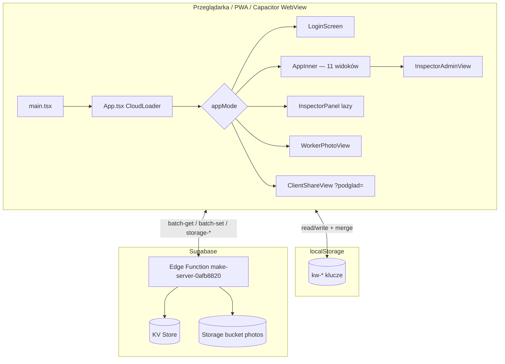
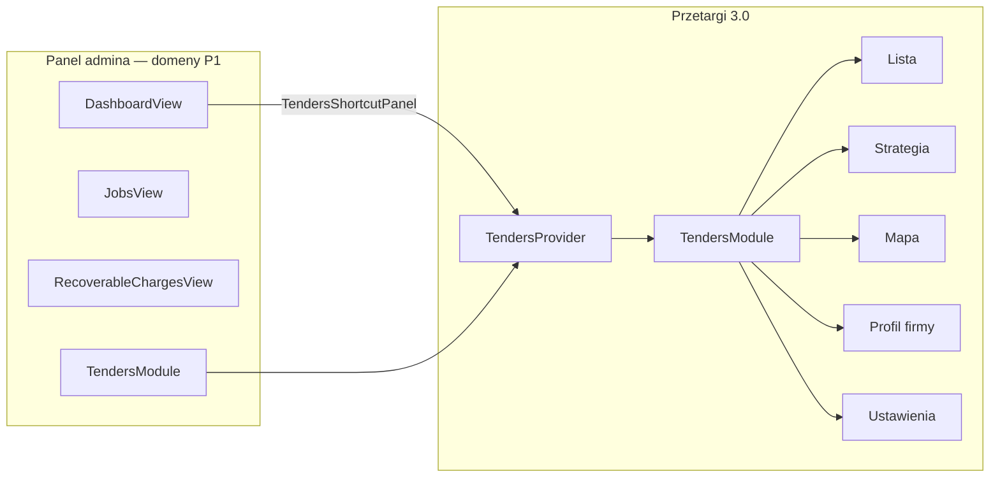

# W&G DOM — przewodnik architektury (living document)

> **Dla kogo:** programista, agent AI, reviewer — kto ma zrozumieć system **bez czytania plik po pliku**.  
> **Produkcja:** https://www.wgdom.fun · **Repo:** https://github.com/dawidthai125/wgdom · branch `main`  
> **Aktualna wersja UI:** `CHANGELOG[0].version` w [`src/app/changelog-data.ts`](../src/app/changelog-data.ts) (**2.55.3** · P2-G.2C)
> **Ostatnia aktualizacja tego dokumentu:** 2026-06-13 (P2-H.1 — Marketplanet ezamawiajacy.pl)
> **★ SSOT baseline prod:** [`PROJECT-HANDOFF-CURRENT.md`](PROJECT-HANDOFF-CURRENT.md) · **★ Pulpit V3:** [`SESSION-HANDOFF-DASHBOARD-V3.md`](SESSION-HANDOFF-DASHBOARD-V3.md)  
> **Backup baseline:** tag `pre-next-feature-2.50.64` · [`BACKUP-REPORT-2.50.64.md`](BACKUP-REPORT-2.50.64.md) · [`SESSION-HANDOFF-PRE-NEXT-FEATURE-2.50.64.md`](SESSION-HANDOFF-PRE-NEXT-FEATURE-2.50.64.md)

---

## ⚠️ Obowiązek utrzymania tego pliku

**Przy każdej zmianie funkcji, naprawie lub nowej funkcji** — równolegle z CHANGELOG i instrukcją — zaktualizuj **ten dokument**, jeśli dotyczy:

- nowego panelu, klucza danych, endpointu API, flow syncu
- zmiany deployu (Vercel / Supabase / PWA cache)
- nowej konwencji lub pułapki, o której warto pamiętać

**Kolejność pracy (obowiązkowa):**

1. Implementacja (+ chmura, jeśli dane trwałe)
2. Wpis w `CHANGELOG` (`changelog-data.ts`)
3. Instrukcja `HelpView` / hinty nawigacji (jeśli widoczne dla użytkownika)
4. **Aktualizacja `docs/ARCHITECTURE.md`** (sekcja dotycząca zmiany + data na górze)
5. Krótkie podsumowanie po polsku

Reguła Cursor: `.cursor/rules/wgdom-development.mdc`

---

## 1. Szybki start (5 minut)

**Wznowienie po przerwie (agent AI):** [`CURRENT-TASK.md`](../CURRENT-TASK.md) → [`PROJECT-HANDOFF-CURRENT.md`](PROJECT-HANDOFF-CURRENT.md) → ten dokument § 11 (sync), § 12.1.3 (Przetargi 3.0), § 15.1 (widoki admin).

```bash
cd WGDOM1
npm install
cp .env.example .env   # jeśli istnieje; uzupełnij VITE_SUPABASE_*
npm run dev              # http://127.0.0.1:5173
npm run build            # produkcja → dist/
npm run test:mobile      # Playwright na www.wgdom.fun (domyślnie)
npm run audit:mobile     # statyczny audyt kodu mobile
```

**Deploy frontendu:** `git push origin main` → Vercel Git Integration (auto-build). **Nie** używaj `vercel deploy` / `vercel --prod`.  
**VERIFY DEPLOY:** push SUCCESS + `version.json` prod + app OK — bez pollingu GitHub/Vercel. Szczegóły: [`WORKFLOW-RELEASE-DEPLOY.md`](WORKFLOW-RELEASE-DEPLOY.md).  
**Deploy backendu:** push zmian w `supabase/functions/**` → GitHub Action `Deploy Supabase Edge Functions`.

**Zmienne środowiskowe (Vite → frontend):**

| Zmienna | Gdzie ustawić | Opis |
|---------|---------------|------|
| `VITE_SUPABASE_PROJECT_ID` | `.env` / Vercel | ID projektu Supabase |
| `VITE_SUPABASE_ANON_KEY` | `.env` / Vercel | Klucz anon (publiczny) |
| `VITE_SUPABASE_FUNCTION_SLUG` | opcjonalnie | Domyślnie `make-server-0afb8820` |

Konfiguracja: `src/config/supabase.ts` → `isSupabaseConfigured()` — bez tych zmiennych sync nie działa (UI pokazuje błąd chmury).

---

## 2. Stos technologiczny

| Warstwa | Technologia |
|---------|-------------|
| UI | React 18, TypeScript, Vite 6 |
| Style | Tailwind CSS 4, `src/styles/mobile.css` |
| Komponenty UI | shadcn/Radix (`src/app/components/ui/`) |
| Routing | **Brak react-router** — nawigacja przez stan React w `App.tsx` |
| Dane lokalne | `localStorage` + merge timestampów |
| Chmura | Supabase Edge Function (Hono) + KV store + Storage |
| Hosting UI | Vercel (SPA, auto-deploy z `main`) |
| PWA | `scripts/sw.template.js` → `dist/sw.js`, `manifest.webmanifest` |
| Native | Capacitor (Android/iOS) — WebView → www.wgdom.fun |
| Testy E2E | Playwright (`e2e/`) |
| PDF | pdfmake (lazy load), docx (dynamic import) |

---

## 3. Architektura wysokiego poziomu



### 3.1 Domeny produktu (admin) — P1 baseline v2.51.x

```text
┌─────────────┐  ┌─────────────┐  ┌──────────────────┐  ┌─────────────────────────────┐
│  Dashboard  │  │   Roboty    │  │ Do Rozliczenia   │  │         Przetargi           │
│  (Pulpit)   │  │   (jobs)    │  │ (recoverable…)   │  │        (tenders)            │
└──────┬──────┘  └─────────────┘  └──────────────────┘  └──────────────┬──────────────┘
       │                                                              │
       │ TendersShortcutPanel                                         │ TendersProvider
       │ (skrót → Strategia)                                          ▼
       │                                                    ┌─────────────────┐
       └───────────────────────────────────────────────────│  TendersModule  │
                                                            │ Lista · Strategia│
                                                            │ Mapa · Profil   │
                                                            │ Ustawienia      │
                                                            └─────────────────┘
```

**Command Center removed in v2.51.0** — brak `CommandCenterProvider`, `TenderCenterProView`, `OwnerDashboard`.



**Zasada:** aplikacja to **offline-first SPA**. Prawda biznesowa = merge(localStorage, stan React, chmura) z regułami timestampów i tombstone'ów.

---

## 4. Bootstrap aplikacji

| Plik | Rola |
|------|------|
| `index.html` | Viewport, PWA meta, CSS anty-zoom iOS; **2.50.20:** md+ `overflow: hidden` na `html/body/#root` |
| `src/main.tsx` | React root, SW, Capacitor shell, klawiatura mobile, viewport desktop, deep linki |
| `src/app/App.tsx` | **Monolit** — auth, admin, worker, changelog, cloud loader |
| `src/styles/index.css` | Import fontów, tailwind, theme, **mobile.css** |

**Łańcuch renderowania:**

```
main.tsx → App (default export) → CloudLoader → AppInnerWithAuth
```

- `CloudLoader` — przy starcie: **dwufazowy bootstrap** (§ 11.5): faza 1 CORE → `ready=true`; faza 2 DEFERRED w tle. Timeout 5 s → UI i tak się pokaże.
- `AppInnerWithAuth` — wybór trybu po `sessionStorage` / query `?podglad=`.

---

## 5. Tryby aplikacji (auth / routing)

Nawigacja **nie używa URL** (poza `?podglad=` i deep linkami). Stan w React + `sessionStorage`.

| `appMode` | Komponent | Wejście |
|-----------|-----------|---------|
| `login` | `LoginScreen` | Domyślny |
| `admin` | `AppInner` + `AdminAccessContext` | Panel administracyjny, rola ≠ inspector |
| `inspector` | `InspectorPanel` (**lazy**) | Przycisk Inspektor, rola `inspector` |
| `worker` | `WorkerPhotoView` | Pracownik — telefon + PIN 4 cyfry |

**Session storage:**

| Klucz | Znaczenie |
|-------|-----------|
| `wg-session-mode` | `admin` \| `inspector` \| `worker` |
| `wg-worker-name`, `wg-worker-id` | Sesja pracownika |
| `wg-inspector-visit-recorded` | Jednorazowy event wizyty inspektora |

**Role admina** (`src/lib/admin-auth.ts`): `super_admin` | `admin` | `moderator` | `inspector`  
- `adminCanViewRates()` — moderator **nie widzi** stawek PLN/h.  
- Super Admin (⚙): użytkownicy, hasła, restore backupów chmurowych.

**Widoczność etykiet ról w UI (20.5A.7)** — `src/lib/role-visibility.ts` → `visibleRoleLabelForViewer(viewerRole, subjectRole)`:

| Viewer | Widzi etykiety |
|--------|----------------|
| `super_admin` | wszystkie role + Pracownik |
| `admin`, `moderator` | tylko Inspektor (+ Pracownik) |
| `inspector` | tylko Inspektor (+ Pracownik) |

Filtr stosowany w `resolveAuthorContact()` (`content-author-contact.ts`) i `AuthorAttribution`; bypassy: `EmployeeSmsModal`, `RecoverableChargesView`. Topbar: tooltip roli tylko dla super admina. **Admin Settings (⚙)** — pełne role (ekran zarządzania). Dane KV (`authorAdminRole`, `senderRole`) bez zmian — tylko prezentacja.

---

## 6. Panel administracyjny (`AppInner`)

### 6.1 Widoki (`View` union)

| `view` | Opis | Główna funkcja w App.tsx |
|--------|------|--------------------------|
| `dashboard` | Pulpit V3: **KPI** (5) · **Braki dokumentów** · **Pilne uwagi** (kategorie) · **Przetargi — skrót** (`TendersShortcutPanel`) · dolna siatka operacyjna | `DashboardView` |
| `payroll` | Lista płac | `PayrollView` |
| `schedule` | Grafik tygodnia | `ScheduleView` |
| `directory` | Kartoteka pracowników | `DirectoryView` |
| `contacts` | Kontakty e-mail | `ContactsView` |
| `archive` | Archiwum tygodni | `ArchiveView` |
| `jobs` | Roboty (pełny CRUD) | `JobsView` |
| `inspector` | Monitoring inspektora (feed admin) | `InspectorAdminView` |
| `photos` | Galeria zdjęć (admin) — zaakceptowane zdjęcia ekipy; ZIP całej roboty / kategorii | `JobPhotosGalleryView` w `App.tsx` |
| `jobfiles` | Pliki robót | `JobAllFilesView` / browser |
| `guide` | Instrukcja + Changelog | `HelpView`, `ChangelogView` |
| `tenders` | **Przetargi 3.0** — `TendersModule` (Lista, Strategia, Mapa, Profil, Ustawienia) | Super Admin zawsze; admin/moderator gdy `tendersTabForStaffEnabled` |

Widoki nieaktywne są **odmontowywane** (`{view==="jobs"&&<JobsView/>}`) — scroll wewnątrz każdego widoku.

### 6.2 Shell admin — mobile i desktop scroll (**2.50.20**)

**Zasada:** dokument (`html`/`body`) **nie scrolluje**. Jedyne scrollowanie pionowe/poziome — wewnątrz aktywnego widoku.

```text
html, body, #root          overflow: hidden (mobile + md+)
└─ .admin-app-shell        100dvh (mobile) / var(--app-height) (desktop)
   └─ AdminViewRouter      flex min-h-0 min-w-0 overflow-hidden
      └─ [widok aktywny]    overflow-y-auto lub overflow-x-auto (tabela)
```

| Warstwa | Plik / klasa | Rola |
|---------|--------------|------|
| Dokument | `index.html` | Bazowo `overflow: hidden`; md+ wysokość `var(--app-height)` |
| Shell | `src/styles/mobile.css` `.admin-app-shell` | md+: `padding-top: var(--app-viewport-offset-top)`, `box-sizing: border-box` |
| Router | `src/app/admin/AdminViewRouter.tsx` | `min-w-0` — flex nie wypycha poziomo całego okna |
| Pulpit | `src/app/DashboardView.tsx` | `min-w-0` + `overflow-y-auto` na panelu głównym |
| Media | `src/app/MediaView.tsx` | `min-w-0` — containment szerokości |
| Viewport | `src/lib/app-viewport.ts` | **Tylko desktop** — `--app-height` z `visualViewport` |

**Mobile (`<768px`):**

- Dolna nawigacja (`md:hidden`) — 4 skróty + Menu
- Shell: `.admin-app-shell` → `height: 100dvh`
- Pull-to-refresh: **brak** — sync przez chmurę + wskaźnik statusu

**Desktop (≥768px) — historia:**

- Przed **2.50.20:** `@media (min-width: 768px)` ustawiał `overflow-y: auto` na `html/body` → **podwójny scrollbar** z wewnętrznym scroll widoków.
- Po **2.50.20:** Fix A — `overflow: hidden` na dokumencie; szczegóły: [`docs/SESSION-HANDOFF-2.50-DESKTOP-LAYOUT.md`](SESSION-HANDOFF-2.50-DESKTOP-LAYOUT.md).

**Testy:** `scripts/smoke-test-desktop-layout-2.50.20.mjs`, `e2e/desktop-layout.spec.ts`, `e2e/desktop-smoke.spec.ts`.

### 6.3 Sync admina

| Mechanizm | Opis |
|-----------|------|
| `useLocalStorage` | Hook w `App.tsx` — zapis do LS + `applyWriteTimestamps` + listener `storage` (cross-tab) |
| Auto-push | `useEffect` na 7 slice'ach stanu → debounce **2 s** → `runCloudSync()` |
| Pull on focus | `pullFromCloudAndMerge()` — visibility, focus, native resume |
| Pełny push | `pushAllDataToCloudSafe` → `computeMergedDataBundle` → merge z LS przed chmurą |
| Ochrona race | `pullInFlightRef`, `suppressAutoSyncUntilRef` (~4,5 s po pull), anulowanie timera push przy pull |

**Bundle admina:** `adminDataBundle()` = kolejność `DATA_KEYS`.

---

## 7. Panel inspektora (pole)

**Plik:** `src/app/InspectorPanel.tsx` (**lazy-loaded** od v2.35.15)

| Zakładka | Opis |
|----------|------|
| `dashboard` | Pulpit WM — KPI, „Dzisiaj”, Action Center (max 3), tygodniowe statystyki |
| `jobs` | Lista robót (karty + postęp %) + szczegóły sekcjami (WM, docs, pliki, zdjęcia, raporty) |
| `gallery` | Galeria zdjęć ekip |
| `files` | Przeglądarka plików + ZIP |
| `portfolio` | Portfolio WM |

**Sprint 20.2A (v2.45.40) — bez nowych KV, bez zmian `mergeJobsById`:**

| Element | Plik | Opis |
|---------|------|------|
| Postęp kontroli | `inspector-dashboard.ts` | `computeInspectionProgress()` — **20.2A.1:** documents 50% + stage 25% + photos 15% + notes 10% (bez `filesPct`; zlecenie/kosztorys tylko w REQUIRED_DOCS) |
| KPI / Action Center | `InspectorDashboard.tsx` | `computeInspectorKpiStats`, `buildActionCenterItems`, `buildTodayJobs` |
| Karty | `InspectorJobCard.tsx` | Postęp %, brakujące do odbioru, ostatnia aktywność, 🔴🟠🟢 |
| Checklist grupy | `InspectorDocChecklist.tsx` | Dokumentacja / Pomiary / Zdjęcia + licznik `n/8` |
| FAB zdjęcie | `InspectorQuickPhotoFab.tsx` | Aparat + wybór roboty → `uploadInspectorPhoto` / `photo-queue` |

Smoke: `npx vite-node scripts/smoke-test-inspector-20.2a.mjs`

**Sync inspektora:**

- Własny `useState` dla `jobs` + `directory` (nie `useLocalStorage`)
- `persistJobs()` → LS + `pushKeysToCloudSafe(["kw-jobs"])`
- `refreshFromCloud()` — mount, focus, visibility, co **120 s**, pull-to-refresh
- **Storage listener** (v2.35.15) — natychmiastowa sync z adminem w innej karcie (`kw-jobs`, `kw-directory`)
- `pushKeysToCloudSafe` — merge z **localStorage przed chmurą** (v2.35.15)

Inspektor **nie** syncuje payroll / archive / contacts — celowo.

---

## 8. Panel inspektora (zakładka admina) — 20.5B.2

**Plik:** `src/app/InspectorAdminView.tsx`  
**Rola:** centrum **monitoringu** (nie workspace operacyjny).

- Feed aktywności z `job-activity.ts` + filtry (w tym billing proposal/note)
- CTA „Otwórz w Robotach” → `pendingJobId` + `pendingJobSection` (`inspector-feed-deeplink.ts`)
- Nieprzeczytane + statystyki logowań — `inspector-stats.ts` · `kw-inspector-stats`
- **Dashboard WM** — KPI „Aktywne WM” + alerty terminów odbioru w „Uwaga dziś”; szczegóły w **Roboty** i **InspectorPanel** (zakładka Portfolio WM). Nie w Inspektorze admin (20.5B.2, 20.5B.4).
- Akcje operacyjne (upload, checklista, approve billing, email plików) — wyłącznie **`JobsView`**

**Panel terenowy** (`InspectorPanel.tsx`) — osobny flow, bez zmian w 20.5B.2.

---

## 9. Panel pracownika

**Plik:** `WorkerPhotoView` w `App.tsx` (~linia 13300+)

- Logowanie: 9 cyfr telefonu + PIN 4 cyfry (`workerPinHash` w kartotece)
- Zakładki: Roboty, Grafik, Wypłata
- Sync: `pushKeysToCloudSafe` dla `kw-jobs`, `kw-week-employees`
- Pull: `reloadWorkerData()` — focus, visibility, PTR, native resume
- **v2.35.15:** po pull zapisuje payroll/archive/week range do localStorage
- Kolejka zdjęć offline: `src/lib/photo-queue.ts`
- Privacy shield przy blur karty: `privacy-shield.ts`

### 9.1 Dokumentacja robót — worker → admin → inspektor (20.5B.6A.1+)

**Model:** `workerReports[]` w `Job` @ `kw-jobs` — **bez osobnego klucza KV**. Merge: `mergeJobsById` w `cloud-sync.ts`.

| Rola | UI | Dane |
|------|-----|------|
| **Pracownik** | `WorkerPhotoView` → `JobReportForm` (`layout="worker"`) | zakres → `workScopeText`; wymiary → `rooms[]`; obrys → `sketch` |
| **Admin** | `JobsView` tab **Dokumentacja** → `JobWorkerReportsPanel` | odczyt/zatwierdzenie raportów; tab **Zdjęcia** → `photos[]` |
| **Inspektor** | `InspectorPanel` tab **Dokumentacja** + **Galeria** | raporty read-only; checklista `InspectorDocChecklist`; plan PDF = `jobFiles[]` kind `plan_techniczny` |

**Worker progress flow (20.5B.6A.4, UX only):** `computeWorkerJobProgress()` w `src/lib/worker-job-progress.ts` — postęp wyliczany **dynamicznie** z `myPhotos` (zdjęcia pracownika) i `myReports` (jego wpisy w `workerReports[]`): Zdjęcia → Dokumentacja (`workScopeText`) → Wymiary (`rooms[]`) → Obrys (`sketch`). UI: `WorkerJobProgressFlow`, `WorkerStepCta`, baner edukacyjny. **Brak nowych pól**, brak zapisu stanu progress, brak sticky UI. Klik kroku → `scrollIntoView` do `#worker-section-*`.

**Semantyka (20.5A.8/9):**

- **Zdjęcia ekipy** → `photos[]` (before/after/progress) — tab Zdjęcia
- **Obrys** → `workerReports[].sketch` — upload „Foto rysunku”, **nie** tab Zdjęcia
- **Plan techniczny PDF** → `jobFiles[]` kind `plan_techniczny` — dokument kontraktowy, **≠** sketch

**Naming (20.5B.6A.1):** tab „Raporty” → **„Dokumentacja”** we wszystkich rolach (copy only).

**Handoff:** [`SESSION-HANDOFF-20.5B-ROBOTY-DOC-VERSION-2026-06.md`](SESSION-HANDOFF-20.5B-ROBOTY-DOC-VERSION-2026-06.md) · **Audyt GO:** [`AUDIT-WORKER-INSPECTOR-READINESS-20.5B.md`](AUDIT-WORKER-INSPECTOR-READINESS-20.5B.md)

**Pliki:** `JobReportForm.tsx`, `JobWorkerReportsPanel.tsx`, `job-documents.ts` (`JOB_DOCUMENTATION_SOURCE_HELP`, `RYSUNEK_PLAN_CHECKLIST_HELP`), `syncJobDocumentsFromReports()`

### 9.2 Kontakt z inspektorem — szablony wiadomości (2.1.0 → 2.1.1, v2.50.70)

**Cel:** z poziomu roboty wysłać email do inspektora WM z czytelnym podsumowaniem „po naszej stronie gotowe” vs „brakuje zlecenia/kosztorysu” — **bez załączników**, reuse `POST /send-job-email`.

| Element | Opis |
|---------|------|
| **UI** | `JobsView` → przycisk „Kontakt z inspektorem” → `JobInspectorContactModal.tsx` |
| **Odbiorca** | `EmailContact.isInspector` w `kw-contacts`; **2.1.1:** `isDefaultInspector` — jeden domyślny (`resolveDefaultInspectorContact`: oznaczony → fallback 1× inspektor → null) |
| **Kontakty UI** | Checkbox „Inspektor WM” + „Domyślny odbiorca inspektora” (tylko gdy inspektor); badge „Inspektor” + „Domyślny”; radio max jeden |
| **Modal UX (2.1.1)** | Start z domyślnym odbiorcą, „Wyślij” od razu aktywne; „Zmień odbiorcę ▼” — pełna lista `isInspector`; hint „Wysyłka testowa” gdy inny niż domyślny; powitanie w treści po zmianie odbiorcy |
| **Szablony A–D** | `inspector-message-templates.ts` — brak zlecenia/kosztorysu × faza (`inferJobPhase`, handover); **E (podziękowanie) poza MVP** |
| **Auto-sugestia** | Priorytet: D > C > A > B wg `documents.zlecenie`, `documents.kosztorys`, fazy |
| **Treść maila** | Sekcje „Po naszej stronie dostępne” (zdjęcia, plan techniczny, dokumentacja robót) i „Brakuje” (zlecenie/kosztorys) — wyliczane z job |
| **Wysyłka** | Payload `{ mode: "inspector_template", introMessage, photos: [], reportSections: [] }` — Edge akceptuje intro ≥40 znaków bez zdjęć/raportów |
| **Historia** | `activityLog` typ `email_sent` + tekst z `inspectorTemplateActivityText()` (nazwa szablonu) |

**Pliki:** `src/lib/inspector-message-templates.ts`, `src/lib/email-contacts.ts`, `src/app/JobInspectorContactModal.tsx`, `src/app/ContactsView.tsx`, `src/app/JobsView.tsx`, `supabase/functions/make-server-0afb8820/index.tsx` (`send-job-email`).

**Smoke:** `scripts/smoke-test-inspector-templates-2.1.mjs`

---

## 10. Model danych

### 10.1 Klucze biznesowe (`DATA_KEYS` w `cloud-sync.ts`)

| Klucz | Zawartość | Kto R/W |
|-------|-----------|---------|
| `kw-directory` | Kartoteka pracowników | Admin, worker (login), inspector (read) |
| `kw-week-employees` | Lista płac — bieżący tydzień | Admin, worker (edit) |
| `kw-archive` | Zapisane tygodnie (snapshots) | Admin |
| `kw-weekFrom` / `kw-weekTo` | Zakres dat tygodnia płac (Pn–So; niedziela = wciąż ten sam tydzień) | Admin |

**Tydzień płacowy (v2.45.14, rollover v2.49.20):** zakres Pn–So. **Nd przed 20:00** — domykany tydzień (wypłaty w sobotę). **Nd od 20:00** — w panelu admina startuje **nadchodzący** tydzień (archiwum + pusta lista, gdy **brak nierozliczonej kasy sobotniej**). **Pn+** — to samo przy pierwszym wejściu, jeśli tydzień w tyle. Auto-archiwum + email backup: niedziela. Alert spójności nie pokazuje się przy pustej liście na nowy tydzień.

**Rollover blokada (Sprint 20.1C, v2.49.20):** `hasPayrollRolloverBlockers()` w `src/lib/payroll-rollover.ts` — blokuje gdy `!settled && calcEmployeeSaturdayCash() > 0`. **Nie blokuje:** ⏭ PRZENIESIONO, biweekly `!isPayoutWeek`, urlop, net ≤ 0. Używane w `tryPayrollWeekCycle`, `trySundayArchiveOnly`, `goToCurrent` (`App.tsx`). Kasa per osoba = ten sam model co `totalSaturdayCash` (tygodniówki + biweekly payout week).
| `kw-jobs` | Roboty (zdjęcia, pliki, WM, activity…) | Wszyscy |
| `kw-contacts` | Kontakty e-mail | Admin |
| `kw-employee-leaves` | Nieobecności pracowników (urlop / L4 / bezpłatny, tygodnie Pn–So) | Admin |
| `kw-recoverable-charges` | Pozycje do rozliczenia / odzyskania (Sprint 20.3A) | Admin (write); Inspektor (read-only, 20.5A.3A) |

**Do rozliczenia (Sprint 20.3A + 20.4A Foundation, v2.47.00):**

| Aspekt | Opis |
|--------|------|
| **Model** | Tablica `RecoverableCharge[]` w `kw-recoverable-charges` — status `open` / `partial` / `settled`; źródło `job` (opcjonalny `sourceJobId`) lub `standalone` |
| **Settlement ledger (20.4A)** | `settlements[]` (`RecoverableChargeSettlement`), cache `amountSettled` / `amountRemaining`; status wyliczany przez `deriveChargeAmounts()` — UI rozliczania w 20.4B |
| **Legacy** | `normalizeRecoverableCharges`: brak settlements → `[]`; legacy `settled` → syntetyczny wpis migracyjny; legacy `partial` → reset do `open` |
| **Merge** | `mergeRecoverableCharges()` — union `settlements` po `id` (`mergeSettlementsById`), potem `deriveChargeAmounts()`; pola skalarne LWW po `updatedAt` |
| **UI (20.4B, v2.47.10)** | `RecoverableChargesView.tsx` + `SettleChargeModal.tsx` — KPI (do rozliczenia / częściowo / odzyskano), Rozlicz, historia, status tylko do odczytu |
| **Dashboard V3 (v2.50.74)** | Kategoria **Do odzyskania** w Pilnych uwagach — `alerts.length` pozycji; klik → moduł. Karta `RecoverableChargesDashboardCard` **usunięta** |
| **Reporting aging (20.4C.2A, v2.48.10)** | `computeRecoverableChargesReportingStats()` — jedno przejście; kubełki 0–30/31–60/61–90/90+ od `createdAt`; tylko open+partial; `RecoverableChargesAnalysisSection.tsx` w module |
| **Alerty (20.4C.2B, v2.48.20)** | `computeRecoverableChargesAlerts()` — A kwota / B wiek>90 / C partial>60 / D brak aktywności>60; `RecoverableChargesAlertsSection.tsx` w module; na Pulpicie V3: `alerts.length` (nie `attentionCount` 0/1) |
| **Insights (20.4C.2C, v2.48.30)** | `computeRecoverableChargesTimeStats()` + `computeRecoverableChargesTopLists()`; `RecoverableChargesInsightsSection.tsx` — KPI miesiąc/rok + TOP 5 |
| **Jobs integracja (20.5A.1, v2.49.00)** | `getRecoverableChargeJobStats()` — agregacja po `sourceJobId` / `targetJobId`; badge 💰 na `JobListCardV2`; `JobRecoverableChargesPanel.tsx` w Przeglądzie roboty; deep link `pendingRecoverableChargeId` → `RecoverableChargesView` |
| **Create from job (20.5A.2, v2.49.10)** | `buildRecoverableChargeDraftFromJob()` + `JobCreateRecoverableChargeModal.tsx` — modal na robocie (bez nawigacji); `pendingRecoverableChargeCreatePreset` → moduł z auto-create; `finalizeRecoverableChargeDraftForSave()` współdzielony |
| **Inspektor review (20.5A.3A, v2.49.70)** | `InspectorPanel` — read-only fetch/merge `kw-recoverable-charges` (bez `pushRecoverableChargesToCloud`); `JobRecoverableChargesPanel` `variant="inspector"` w sekcji WM — kwoty, KPI, pełna historia `settlements[]`; badge 💰 na `InspectorJobCard`. Kwoty odzyskania ≠ `adminCanViewRates` (stawki PLN/h) |
| **Badge menu** | `countUnsettledRecoverableCharges()` — open + partial |
| **Menu** | **Do rozliczenia** (💰); **Media** = Zdjęcia + Pliki robot (jak Instrukcja/Zmiany) |
| **Sync** | Admin: `pushRecoverableChargesToCloud()`; Inspektor: tylko odczyt LS + cloud merge; tombstone `kw-recoverable-charges-deleted-ids` |
| **Inspektor uwagi (20.5A.4, v2.49.80)** | `JobNote.recoverableChargeId` + `context: billing` w `kw-jobs`; `activityLog` typ `inspector_billing_note`; wątek w `JobRecoverableChargesPanel`; bez push `kw-recoverable-charges` |
| **Billing evidence (20.5A.5, v2.50.42)** | `JobNote.attachments[]`; `uploadBillingEvidence()` → `storage-upload` prefix `billing-evidence-`; inspektor/admin podgląd w wątku pozycji |
| **Billing proposal (20.5A.6, v2.50.44)** | `JobNote.context: billing_proposal` + `proposalStatus` pending/approved/rejected w `kw-jobs`; inspektor `appendBillingProposalNote()` + dowody `uploadBillingProposalEvidence()`; admin approve → `createChargeDraftFromProposal()` + `appendRecoverableChargeCreate()` → `kw-recoverable-charges`; reject z `rejectedReason`; KPI/badge 💰 **nie** liczą propozycji pending |
| **Backlog** | 20.3C legacy CC + GuideView · Roboty 2.0 FULL — tylko na polecenie |

Pliki: `src/lib/recoverable-charges.ts`, `src/lib/job-wm.ts`, `src/lib/billing-evidence-upload.ts`, `src/app/RecoverableChargesView.tsx`, `src/app/JobRecoverableChargesPanel.tsx`, `src/app/JobCreateRecoverableChargeModal.tsx`, `src/app/InspectorBillingProposalModal.tsx`, `src/app/BillingProposalReviewCard.tsx`, `src/app/InspectorPanel.tsx`, `src/app/JobsView.tsx`, `src/app/MediaView.tsx`.

**Nieobecności (Sprint 20.0A, v2.45.37, prod `778f616`):**

| Aspekt | Opis |
|--------|------|
| **Model** | Tablica `EmployeeLeave[]` w `kw-employee-leaves` — typy: urlop / L4 / bezpłatny; zakres tygodni Pn–So |
| **UI** | `EmployeeLeavesSection.tsx` w kartotece — CRUD; walidacja overlap + blokada tygodni w archiwum |
| **Payroll leave overlay** | `payroll-leave-overlay.ts` — na **live** liście płac: `netPay`/`grossPay`=0, **godziny bez zmian**; etykiety 🏖 URLOP / 🤒 CHOROBOWE / 🚫 BEZPŁATNY |
| **Biweekly** | `calcBiweeklyWeekNetWithLeave` — cash split i payout zerowane w tygodniu urlopu |
| **Archive snapshot freeze** | Przy `buildWeekSnapshot` zamrażany `leaveStatus` w `EmployeeSnapshot`; archiwalna lista płac i PDF/DOCX **tylko ze snapshotu** — bez live lookup urlopów dodanych później |
| **Eksport** | `payroll-export.ts` — `payrollNetDisplayText()` → „URLOP” / status zamiast kwoty net |
| **Sync** | `mergeEmployeeLeaves()` w `cloud-sync.ts`; push przez `pushEmployeeLeavesToCloud()` |
| **Edge** | Walidacja payloadu + overlap w `batch-set`; filtrowanie ID z tombstone list |

Pliki: `src/lib/employee-leaves.ts`, `src/lib/payroll-leave-overlay.ts`, `src/app/EmployeeLeavesSection.tsx`, `src/app/PayrollView.tsx`.

**Odroczenie wypłaty (Sprint 20.1A, v2.45.38, prod `f24fafe` — CLOSED):**

| Aspekt | Opis |
|--------|------|
| **Model danych** | Pole opcjonalne `payrollCarryForward` na `WeekEmployee` w `kw-week-employees` — `{ amount, targetWeekFrom, targetWeekTo, createdAt }`. **Bez nowego klucza KV / Edge deploy.** |
| **UI** | Lista płac (`PayrollView`) + panel pracownika (`WeekEmployeeDetail`) — przycisk ⏭ „Przenieś na następny tydzień” (jednorazowo, **weekly only**). |
| **MODEL A (frozen amount)** | Kwota `amount` **zamrożona** w momencie kliknięcia — **nie** przelicza się po zmianie godzin/stawki w tygodniu źródłowym. |
| **Tydzień źródłowy (carry out)** | `displayNetPay=0`, etykieta **PRZENIESIONO**; `carryForwardOut` w snapshot. |
| **Tydzień docelowy (carry in)** | `displayNet = baseNet + carryForwardIn` (tylko jeden tydzień docelowy). |
| **Priorytet overlay** | urlop → carry out → carry in → biweekly |
| **Biweekly V1 (blocked)** | Wypłata co 2 tygodnie — **zablokowana** (`canDeferPayroll` → `biweekly_blocked`). Urlop blokuje przeniesienie. |
| **Archive snapshot freeze** | Przy `buildWeekSnapshot(..., savedWeeksForCarry?)` zamrażane w `EmployeeSnapshot`: `carryForwardOut`, `carryForwardTargetFrom/To`, `carryForwardIn`, `carryForwardFromWeek`. Archiwalna lista płac **tylko ze snapshotu** — historyczne kwoty niezmienne. |
| **Archive behavior** | `ArchiveView` renderuje zamrożone `carryForwardOut/In` z `EmployeeSnapshot`; brak live recalc z bieżących `WeekEmployee`. |
| **PDF/DOCX export** | `payroll-export.ts` — `payrollNetDisplayText()`: W1 „PRZENIESIONO”; W2 `4500,00 (+2250,00 przen.)` — tekst ze snapshotu archiwum. |
| **Sync** | `pickPayrollCarryForward()` w `mergeWeekEmployeeRecord` — merge nie gubi defer gdy chmura nie ma pola |
| **Double-click guard** | Drugie ⏭ → `already_deferred` (BLOCKED) |

Pliki: `src/lib/payroll-carry-forward.ts`, `src/lib/payroll-carry-snapshot.ts`, `src/app/PayrollView.tsx`, `src/app/WeekEmployeeDetail.tsx`, `src/app/app-domain.ts`, `src/lib/payroll-export.ts`, `src/app/ArchiveView.tsx`, `src/lib/cloud-sync.ts` (merge carry).

**Carry forward workflow (Sprint 20.1B, v2.45.39 — CLOSED):** rozdzielenie **saved** (backup) vs **closed** (historyczny).

| Aspekt | Opis |
|--------|------|
| **`isPayrollWeekSaved`** | `savedWeeks.some(weekFrom/weekTo)` — kopia zapasowa istnieje |
| **`isPayrollWeekClosed`** | `weekFrom/weekTo ≠ getPayrollWeekRange(now)` — kalendarzowe (legacy / testy) |
| **`isPayrollWeekClosedForUi`** | Jak wyżej, **ale** `hasRolloverBlockers` → nadal operacyjny (Sprint 20.1D) |
| **Defer ⏭** | Dozwolony gdy **nie** closed (UI); zablokowany: `closed_week` (nie `archived_week`) |
| **Aktywny tydzień (saved lub nie)** | Lista płac + PDF/DOCX z **live** `weekEmployees`; urlopy z live overlay |
| **Tydzień historyczny (closed)** | Lista płac + PDF/DOCX ze **snapshotu**; defer zablokowany |
| **Snapshot refresh** | `refreshSavedActiveWeekSnapshot()` w `App.tsx` — po defer, toggle settled, edycji rosteru (tylko gdy saved + operacyjny) |
| **Banery UI** | Zapisany operacyjny: „kopia zapasowa”; historyczny: „podgląd ze snapshotu” |

Pliki 20.1B: `src/lib/payroll-cycle.ts`, `src/app/PayrollView.tsx`, `src/app/App.tsx`, `src/lib/payroll-leave-overlay.ts` (biweekly overlay tylko closed).

**Payroll rollover (Sprint 20.1C, v2.49.20 — lokalnie):**

| Aspekt | Opis |
|--------|------|
| **Plik** | `src/lib/payroll-rollover.ts` — `calcEmployeeSaturdayCash`, `blocksPayrollRollover`, `hasPayrollRolloverBlockers` |
| **Warunek blokady** | `!emp.settled && saturdayCash > 0` |
| **saturdayCash** | Tygodniówka: `calcWeeklyNetWithCarry`; biweekly: `displayNet` tylko w `isPayoutWeek`, inaczej 0 |
| **Zwolnienia** | Carry out (PRZENIESIONO), biweekly accrual, urlop, net ≤ 0 — przez `saturdayCash === 0` |
| **Bez zmian** | `autoArchiveAndAdvance`, `buildWeekSnapshot`, MODEL A, `computePayrollCashSplit`, sync KV |
| **Smoke** | `scripts/smoke-test-payroll-rollover-20.1c.mjs` |
| **20.1C.2** | Dashboard alerty = `listPayrollRolloverBlockers` (v2.49.40) |

**Closed week semantics (Sprint 20.1D, v2.49.60 — CLOSED):**

| Aspekt | Opis |
|--------|------|
| **Problem** | Nd ≥20:00 zegar → W2, ale blockers trzymają stan na W1; stary `isPayrollWeekClosed` = historyczny |
| **Fix** | `isPayrollWeekClosedForUi(week, hasRolloverBlockers)` — calendar behind + blockers → **nie** closed |
| **UI** | `PayrollView`, `App.tsx` snapshot refresh, `payroll-leave-overlay` biweekly |
| **Smoke** | `scripts/smoke-test-payroll-week-closed-20.1d.mjs` (T1–T6) |

**Nowy typ danych → MUSISZ:** dodać do `DATA_KEYS`, hook stanu w adminie, merge w `mergeDataKey`, push/pull paths, tombstone przy DELETE.

### 10.2 Tombstones (usunięcia nie wracają z chmury)

| Klucz | Dotyczy |
|-------|---------|
| `kw-jobs-deleted-ids` | Usunięte roboty |
| `kw-directory-deleted-ids` | Usunięci pracownicy |
| `kw-contacts-deleted-ids` | Usunięte kontakty |
| `kw-archive-deleted-ids` | Usunięte tygodnie archiwum |
| `kw-employee-leaves-deleted-ids` | Usunięte nieobecności (Sprint 20.0A) — merge i Edge batch-set filtrują te ID |
| `kw-recoverable-charges-deleted-ids` | Usunięte pozycje do rozliczenia (Sprint 20.3A) |

### 10.3 Klucze konfiguracyjne (chmura przez `persistKey`)

| Klucz | Zawartość |
|-------|-----------|
| `kw-admin-passwords` | Hash hasła per userId |
| `kw-admin-users-config` | Role, custom users, telefony |
| `kw-app-settings` | Np. `athPreviewEnabled`, `tendersTabForStaffEnabled` |
| `kw-inspector-stats` | Logowania / wizyty inspektorów |
| `kw-tenders-pipeline` | Pipeline przetargów BZP (status, notatki) — Super Admin |

### 10.4 Tylko lokalne (bez chmury)

`kw-local-snapshot-bundle`, `kw-jobs-last-good`, `wg-payroll-list-mode`, flagi UI, `sessionStorage`.

---

## 11. Sync i merge (`src/lib/cloud-sync.ts`)

**Serce systemu.** Przed edycją syncu — przeczytaj ten plik.

### 11.1 Główne funkcje

| Funkcja | Kiedy używać |
|---------|--------------|
| `fetchKeysFromCloud(keys)` | Odczyt batch z API |
| `pushKeysToCloud(keys, values)` | Surowy zapis (CloudLoader bootstrap) |
| `pushKeysToCloudSafe(keys, values)` | Push z merge LS + chmura — **inspektor, worker, pojedyncze klucze** |
| `pushAllDataToCloudSafe(bundle)` | Pełny push admina — 7 kluczy + tombstones |
| `pullAndMergeDataBundle(bundle)` | Pull bez zapisu — odświeżenie UI admina |
| `computeMergedDataBundle(bundle)` | Fetch + merge — używane przez push i pull |
| `prepareDataBundleForCloudPush` | Admin: merge React z LS przed chmurą |
| `prepareKeysForCloudPush` | Partial keys: merge LS przed chmurą (v2.35.15) |
| `mergeDataKey` / `mergeJobsById` | Logika per-typ |
| `mergeWeekEmployeeRecord` | Stawka, dni, **settled** — osobne timestampy |
| `persistKey(key, value)` | LS + opcjonalny cloud (settings, stats) |

### 11.2 Zasady merge (skrót)

- **Jobs:** per `id`, winner po `updatedAt` + merge pól (documents, photos, activity…)
- **Week employees:** per `id`; `rateUpdatedAt`, `dataUpdatedAt`, `settledUpdatedAt` osobno
- **Edge `batch-set` (FIX A, 2026-06-03):** `mergeWeekEmployeeRecordByTimestamps` używa `pickSettledByTimestamps` / `isLikelySpuriousUnsettle` jak klient; `mergeWeekEmployeesUnion` zawsze scala rekordy (nie zastępuje całego wpisu po `weekEmployeeRichness`)
- **Directory:** lokalna lista decyduje o składzie; pola scalane per id
- **Archive:** lokalna lista + merge `weekEmployees` wewnątrz tygodnia
- **Employee leaves:** per `id`, winner po `updatedAt`; union z filtrem `kw-employee-leaves-deleted-ids` — usunięte wpisy **nie wracają** z chmury (Sprint 20.0A)
- **Remis timestampów:** preferencja **chmury** (v2.35.14+)
- **Po pull admina:** `suppressAutoSyncUntilRef` — nie pushuj od razu pętlą

### 11.3 Pułapki syncu (NIE psuj)

1. **Nigdy** nie zapisuj trwałych danych tylko w React state bez LS/chmury.
2. Partial push (`pushKeysToCloudSafe`) **musi** iść przez `prepareKeysForCloudPush` — inaczej nadpiszesz edycje admina z innej karty.
3. Inspektor w tej samej karcie co admin — używaj storage events; między urządzeniami — timestamp merge.
4. Usuwanie roboty → `addDeletedJobId` + `pushJobsAfterDelete`.
5. Usuwanie z kartoteki → `pushDirectoryToCloud` (natychmiast).
6. **Stale localStorage + bootstrap push** — stary LS może przywrócić usunięte klucze KV (admin passwords, martwe URL w jobs). Fix: P11/P15 w `CloudLoader`; po incydencie **hard refresh**. Szczegóły → [`INCIDENTS-2026-06.md`](INCIDENTS-2026-06.md).
7. **Logout nie uruchamia ponownie CloudLoader** — merge bootstrap tylko przy pierwszym mount strony.

### 11.4 Payroll Guard i bootstrap merge (P11, czerwiec 2026)

| Mechanizm | Plik | Rola |
|-----------|------|------|
| `wouldBlockPayrollShrink` | `cloud-sync.ts` | Blokuje push gdy `activeDays` lub `totalHours` spada >50% vs chmura |
| `applyPayrollGuardBeforePush` | `cloud-sync.ts` | Wywoływany przed batch-set payroll |
| `applyBootstrapPayrollMerge` | `CloudLoader.tsx` | Po fetch z chmury: jeśli chmura bogatsza niż lokal → preferuj chmurę (fix 0 h w UI) |
| `sanitizeWeekEmployeesForTargetRange` | `cloud-sync.ts` | Odrzuca rekordy spoza docelowego zakresu tygodnia |

Test: `npx vite-node scripts/test-p11-bootstrap-payroll.mjs`

### 11.5 Admin passwords (`kw-admin-passwords`, P15)

- Klucz KV: mapa `userId → SHA-256("wgdom-admin-account-v1:" + login + ":" + password)`.
- **Brak klucza** = hasło startowe z `BUILTIN_ADMIN_ACCOUNTS` (`admin-auth.ts`).
- **`mergeAdminPasswordOverrides(local, cloud)`** (P15): baza = klucze z chmury; lokal nadpisuje tylko wspólne klucze; klucze tylko w LS **nie wracają** do push.
- **`shouldPushAdminPasswordOverridesOnBootstrap`**: nie pushuj gdy `cloudKeys < localKeys` (chmura jest źródłem prawdy o składzie override).

Test: `npx vite-node scripts/test-p15-admin-password-merge.mjs`

**Nie mieszaj** z ogólnym `mergeDataKey` — admin passwords mają osobną logikę w `CloudLoader`, nie w `cloud-sync.ts`.

### 11.5 CloudLoader CORE / DEFERRED bootstrap (Performance 1.3A+, prod `a6cdb4a`)

**Cel:** szybsze `ready=true` — cięższe klucze przetargów i kontaktów pobierane **po** wejściu w UI (login / admin).

| Faza | Kiedy | Klucze | Plik |
|------|--------|--------|------|
| **CORE** | przed `setReady(true)` | `BOOTSTRAP_CORE_KEYS` (6) + tombstones + admin keys | `CloudLoader.tsx`, `cloud-sync.ts` |
| **DEFERRED** | `void` po `ready` | `BOOTSTRAP_DEFERRED_KEYS` (6) + tombstones (w tym `kw-employee-leaves-deleted-ids`, `kw-recoverable-charges-deleted-ids`) | `fetchAndMergeDeferredBootstrap()` |

**CORE:** `kw-directory`, `kw-week-employees`, `kw-archive`, `kw-weekFrom`, `kw-weekTo`, `kw-jobs`.

**DEFERRED:** `kw-tenders-pipeline`, `kw-tenders-company-profile`, `kw-tenders-custom-keywords`, `kw-contacts`, `kw-employee-leaves`, `kw-recoverable-charges`.

Po zakończeniu fazy 2: event `wgdom-deferred-bootstrap` (`WGDOM_DEFERRED_BOOTSTRAP_EVENT`) → `TendersProvider` wywołuje `bumpProfileVersion()` (profil firmy w module Przetargi).

**Uwaga:** `useTendersPipeline` nadal może robić własny fetch pipeline przy mount CC — nie zakłada danych z fazy 1 CloudLoader.

**Dokumentacja sesji:** [`SESSION-HANDOFF-PERFORMANCE-2026-06.md`](SESSION-HANDOFF-PERFORMANCE-2026-06.md)

---

### 11.6 ARCH-001 — Circular Dependency Prevention (2026-06-13)

**Status:** obowiązuje od v2.53.3 · wynik incydentu P0 v2.53.1 → hotfix v2.53.2

#### Incydent (v2.53.1)

| Pole | Wartość |
|------|---------|
| **Wersja** | 2.53.1 (UX.1A) |
| **Objaw** | Biały ekran — aplikacja nie renderuje się |
| **Błąd** | `Uncaught ReferenceError: Cannot access '…' before initialization` (minifikacja: `Pa`) |
| **Chunk** | `app-core` (Vite manualChunk: `cloud-sync.ts`) |
| **Root cause** | **ESM circular dependency** + **Temporal Dead Zone (TDZ)** przy inicjalizacji modułu |

#### Łańcuch awarii (uproszczony)

```text
cloud-sync (inicjalizacja…)
  → tenders-sync
    → tender-cost-calibration
      → cloud-sync          ← cykl #1 (static import)
      → tenders-bzp
        → tenders-pipeline-session-cache
          → cloud-sync      ← cykl #2 (WGDOM_DEFERRED_BOOTSTRAP_EVENT)
```

Przy starcie aplikacji `session-cache` rejestruje `window.addEventListener` używając eksportu z `cloud-sync`, który **nie zdążył** zostać zainicjalizowany → crash przed pierwszym renderem React.

#### Naprawa (v2.53.2)

- `tender-cost-calibration.ts` — `fetchKeysFromCloud` / `persistKey` tylko przez **`import()` dynamiczny** (async).
- `tenders-pipeline-session-cache.ts` — lokalna stała `"wgdom-deferred-bootstrap"` (bez importu z `cloud-sync`).
- Usunięty value-import `matchPriorityBuyer` z `tenders-bzp` w kalibracji (tylko `import type`).

---

#### ★ P0 ARCH RULE (obowiązkowa)

**`cloud-sync` nie może być importowany na poziomie modułu (static `import`) przez:**

| Kategoria | Przykłady |
|-----------|-----------|
| **Modele domenowe** | `tenders-bzp`, `recoverable-charges`, `employee-leaves` |
| **Feature modules** | `tender-cost-calibration`, `tenders-bzp-company`, store katalogów |
| **Sync participants** | Moduły importowane **przez** `cloud-sync.ts` do merge (bezpośrednio lub w drzewie zależności) |
| **Cloud-sync consumers w cyklu** | Każdy moduł w drzewie `cloud-sync → … → moduł → cloud-sync` |

**Zakazane relacje:**

```text
cloud-sync ↔ domena
cloud-sync ↔ feature
cloud-sync ↔ sync participant
cloud-sync ↔ cloud-sync consumer (static, w tym samym drzewie init)
```

**Dozwolone:**

| Wzorzec | Przykład |
|---------|----------|
| UI → cloud-sync | `CloudLoader.tsx`, `App.tsx`, panele zapisu |
| Bootstrap → cloud-sync | Faza CORE/DEFERRED w `CloudLoader` |
| Orchestrator → cloud-sync | Jednokierunkowo: tylko cloud-sync importuje merge helpery |
| **Dynamic `import()`** | `await import("@/lib/cloud-sync")` w funkcjach async |
| **Dependency injection** | Przekazanie `persistKey` / callback z warstwy UI (preferowane przy nowych modułach) |

**Niedozwolone (przykłady):**

```text
❌ cloud-sync → tenders-sync → tender-cost-calibration → cloud-sync (static)
❌ cloud-sync → … → tenders-bzp → session-cache → cloud-sync (static)
```

**Dlaczego:** ESM ładuje moduły w kolejności zależności; cykl powoduje, że binding `const` / `let` jest w **TDZ** w momencie użycia → `ReferenceError` → **white screen** bez error boundary (crash przed React).

---

#### Lessons Learned — P0 White Screen (v2.53.1)

1. **Objaw:** Pusty `#root`, brak UI — błąd tylko w konsoli przeglądarki.
2. **Root cause:** Cykl importów w chunku startowym (`app-core`), nie błąd React ani UX.1A layout.
3. **Naprawa:** Rozbić cykl — dynamic import lub lokalna stała zamiast importu z orchestratora.
4. **Jak unikać:**
   - Przed dodaniem `import … from cloud-sync` w `src/lib/**` — sprawdź, czy moduł jest w drzewie zależności `cloud-sync.ts`.
   - Merge helpery (`tenders-sync`, `employee-leaves`, …) **nigdy** nie importują cloud-sync.
   - Unikaj **top-level side effects** (`window.addEventListener`, async I/O) w modułach lib współdzielonych z app-core.
   - Uruchom `node scripts/audit-import-cycles.mjs` przed release’em dotykającym sync/lib.
   - `madge --circular src/` może nie wykryć cykli runtime TDZ — testuj **preview build** + ładowanie strony logowania.

---

#### Audyt repo (ARCH-001, read-only 2026-06-13)

**Skrypt:** `node scripts/audit-import-cycles.mjs` — skan `src/lib`, cykle ESM, naruszenia P0, module-level listeners.

**Module-level `window.addEventListener` w `src/lib`:**

| Plik | Uwagi |
|------|--------|
| `tenders-pipeline-session-cache.ts` | Fix 2.53.2 — lokalna stała zdarzenia; **backlog:** przenieść rejestrację do `TendersProvider` init |

**Top-level static import `cloud-sync` w `src/lib` (consumers — OK poza drzewem merge):**

`admin-auth`, `app-settings`, `ath-parser`, `billing-evidence-upload`, `company-qualification-profile`, `experience-reference-upload`, `inspector-stats`, `job-*-upload`, `local-data-backup`, `tenders-admin`, `tenders-bzp`, `tenders-bzp-award`, `tenders-bzp-company`, `tenders-bzp-learn`, `tender-external-docs`, `weekly-backup-email`, `wgdom-cost-catalog-store`, `wgdom-user-classification-dictionary` — **bezpieczne**, o ile nie trafią do drzewa init `cloud-sync` (lazy / po bootstrap).

**Dynamic import cloud-sync (wzorzec P0-safe):**

- `tender-cost-calibration.ts` — load/save store

**P0 static import w drzewie `cloud-sync` (audyt 2026-06-13 — backlog refaktor, nie blokuje prod po 2.53.2):**

| Moduł | Uwaga |
|-------|--------|
| `wgdom-user-classification-dictionary.ts` | cloud-sync importuje `defaultStore`; moduł importuje `persistKey` — **latentny cykl** |
| `wgdom-cost-catalog-store.ts` | Store poza merge default; static cloud-sync — refaktor → dynamic import |
| `job-file-upload.ts` | W reachability przez job-documents chain — refaktor → API_BASE only lub dynamic |

Audyt: `npm run audit:import-cycles` → JSON z `p0StaticImportViolations`, `cyclesFound`, `moduleLevelWindowListeners`.

---

#### Raport ryzyka (ARCH-001)

| Moduł | Ryzyko | Powód | Zalecenie |
|-------|--------|-------|-----------|
| `cloud-sync.ts` | **HIGH** | Centralny orchestrator, chunk app-core | Nie importować consumerów; trzymać merge helpery czyste |
| `tenders-sync.ts` | **HIGH** | Bezpośredni sync participant | Zero importu cloud-sync; płytkie zależności |
| `tender-cost-calibration.ts` | **MEDIUM** | Historyczny cykl P0 (naprawiony) | Zachować dynamic import; unikać value-import z `tenders-bzp` |
| `tenders-pipeline-session-cache.ts` | **MEDIUM** | Module-level listener + łańcuch z `tenders-bzp` | Stała zdarzenia lokalna; rozważyć init w Provider |
| `tenders-bzp.ts` | **MEDIUM** | Static cloud-sync + session-cache | Nie łączyć z drzewem merge cloud-sync |
| `tenders-bzp-learn.ts` | **MEDIUM** | cloud-sync + używany przez pipeline | Rozważyć lazy persist przy refaktorze |
| `wgdom-user-classification-dictionary.ts` | **HIGH** | cloud-sync ↔ dictionary (static obie strony) | Backlog: dynamic import jak kalibracja |
| `wgdom-cost-catalog-store.ts` | **MEDIUM** | Store + static cloud-sync w reachability | Dynamic import persist |
| `job-file-upload.ts` | **MEDIUM** | cloud-sync w drzewie job-documents | Import tylko API_BASE lub lazy |
| `recoverable-charges.ts` | **LOW** | Merge participant, brak cloud-sync | Utrzymać separację |
| `employee-leaves.ts` | **LOW** | Merge participant, brak cloud-sync | Utrzymać separację |
| `payroll-cycle.ts` / billing lib | **LOW** | Poza drzewem cloud-sync | Brak akcji |

---

## 12. Supabase — backend

**Funkcja:** `supabase/functions/make-server-0afb8820/index.tsx`  
**Project ref:** `bdpygdvfgbggermvqtys` (w workflow deploy)  
**Klient API:** `API_BASE` = `https://{PROJECT_ID}.supabase.co/functions/v1/{slug}`  
**Auth nagłówków:** `Authorization: Bearer {VITE_SUPABASE_ANON_KEY}`

### 12.1 Endpointy (prefiks `/make-server-0afb8820/`)

| Metoda | Ścieżka | Opis |
|--------|---------|------|
| GET | `/health` | Healthcheck |
| POST | `/batch-get` | `{ keys: string[] }` → `{ values: unknown[] }` |
| POST | `/batch-set` | `{ keys, values }` — z ochroną przed shrink jobs/directory |
| POST | `/batch-del` | Usuwanie kluczy KV |
| GET | `/jobs-backup-status` | Status backupów robót |
| POST | `/restore-jobs-backup` | Przywrócenie robót |
| GET | `/payroll-backup-status` | Backup listy płac |
| POST | `/restore-payroll-backup` | Przywrócenie płac |
| GET | `/data-backup-status` | Pełny backup danych |
| POST | `/restore-data-backup` | Przywrócenie bundle |
| POST | `/storage-upload-url` | Signed URL upload |
| POST | `/storage-upload` | Upload pliku (zdjęcia, PDF, ATH…) |
| POST | `/storage-delete` | Usunięcie z bucket |
| POST | `/kosztorys-preview` | Podgląd kosztorysu ATH |
| POST | `/send-backup-email` | Mail backup |
| POST | `/send-job-email` | Mail roboty (+ `mode: inspector_template` — szablony inspektora 2.1.0) |
| POST | `/send-payroll-email` | Mail listy płac |
| POST | `/send-job-files-email` | Mail plików |
| GET | `/client-share` | Token podglądu klienta `?podglad=` |
| GET/POST | `/sms-*` | SMS bulk, nadawcy, historia |
| GET | `/tenders-bzp-search` | Proxy BZP — `?days=30&pages=4&province=PL02`, filtr remont/modernizacja |
| GET | `/tenders-bzp-notice` | HTML ogłoszenia BZP — `?noticeNumber=` |
| GET | `/tenders-bzp-documents` | Skan załączników — `?tenderId=&noticeNumber=` (readmodels → mp-client → off-platform: **v2.55.0** `*.ezamawiajacy.pl` → Logintrade → …) |
| GET | `/tenders-bzp-analyze-swz` | Analiza SWZ z HTML/PDF (serwer) — `?noticeNumber=` lub `?tenderId=&documentIndex=` |
| GET | `/tenders-bzp-award-result` | **v2.45.7** — wynik postępowania z BZP — `?bzpNumber=` / `?moIdentifier=` |
| GET | `/tenders-bzp-document-bytes` | Pobranie załącznika base64 — e-Zamówienia, `?downloadUrl=` lub **v2.55.0** `?sourcePageUrl=` (ezamawiajacy sesja replay) |
| POST | `/tenders-bzp-upload` | Upload SWZ/kosztorysu do storage `tenders/{id}/` |
| POST | `/tenders-bzp-attach-to-job` | Kopiowanie plików przetargu → roboty |
| POST | `/tenders-external-discover` | **v2.44** — linki z ogłoszenia + **v2.55.0** ezamawiajacy (priorytet) + Logintrade + crawl BIP |

**Storage bucket:** `make-0afb8820-photos` (public, auto-create) — **jedyny bucket** w projekcie (audyt 2026-06-10: 140 obiektów, 54.15 MB). Frontend uploaduje wyłącznie przez Edge (`/storage-upload`, `/storage-delete`); bez bezpośredniego `supabase.storage` w `src/`.

**Pre-feature backup (v2.50.64):** pełny eksport storage — [`AUDIT-STORAGE-BACKUP-COMPLETENESS-2.50.64.md`](AUDIT-STORAGE-BACKUP-COMPLETENESS-2.50.64.md) (**STORAGE BACKUP COMPLETE 100%**). Skrypty: `run-pre-feature-backup-2.50.64.mjs`, `run-storage-full-backup-2.50.64.mjs`.

### 12.1.1 Przetargi BZP (pipeline v2.37 → v2.45.12)

**Klucz chmury:** `kw-tenders-pipeline` — tablica `TenderPipelineItem[]` (+ `kw-tenders-company-profile`, `kw-tenders-custom-keywords`, `kw-tenders-deleted-ids`).

**Dostęp:** Super Admin zawsze; Administrator i Moderator — gdy `tendersTabForStaffEnabled` w `kw-app-settings`.

#### Pliki — lista / sync

| Plik | Rola |
|------|------|
| `src/lib/tenders-bzp.ts` | Typy pipeline, scoring, merge, API klienta, `patchOurEstimatePln`, dashboard stats |
| `src/lib/tenders-sync.ts` | Merge pipeline z chmurą, CSV, deleted ids |
| `src/lib/tenders-bzp-keywords.ts` | Słowa kluczowe scoringu (sync z Edge) |
| `src/lib/tenders-bzp-learn.ts` | Uczenie słów z przetargów „interesuje nas” |
| `src/lib/tenders-actions.ts` | **v2.45.8** — chipy „wymaga działania”, auto-wynik BZP, alerty pulpitu, .ics, porównanie cen |
| `src/lib/tenders-wadium.ts` | **v2.45.7** — wadium % wartości, limit profilu, blokada udziału |
| `src/lib/tenders-map-coords.ts` | Geolokacja heurystyczna Wrocław + siatka kafelków OSM |
| `src/app/TendersView.tsx` | UI listy, filtry, lejek, chipy akcji, mapa (zwijana) |
| `src/app/TendersMapPanel.tsx` | **v2.45.12** — mapa OSM (kafelki) Wrocław + markery + lista punktów |
| `src/app/TenderKeywordsPanel.tsx` | **v2.45.12** — własne słowa kluczowe + podgląd wbudowanego słownika |
| `src/app/TenderBidPrepPanel.tsx` | **v2.45.5+** — karta ofertowa (checklist, wadium, wynik BZP, pakiet PDF) |

#### Pliki — szczegóły przetargu (po rozwinięciu)

| Plik | Rola |
|------|------|
| `src/app/TenderDetailPanel.tsx` | Auto-analiza przy expand; **`analyzeTenderSwzEnhanced`** (pdf.js klient); historia szacunku |
| `src/app/TenderDossierPanel.tsx` | Karta przetargu (brief, kosztorys, przedmiar) |
| `src/app/TenderAttachmentsPanel.tsx` | Załączniki e-Zamówienia + podgląd ZIP/PDF/ATH |
| `src/app/TenderExternalDocsPanel.tsx` | **v2.44** — dokumenty u zamawiającego (BIP, linki z ogłoszenia) |
| `src/app/TenderFitPanel.tsx` | Dopasowanie profilu, wymagania vs firma, referencje z luką PLN |
| `src/app/TenderBidProposalPanel.tsx` | Propozycja ceny ofertowej (kalkulator) |
| `src/app/TenderCompanyProfilePanel.tsx` | Profil firmy + model kosztów (schema **v6**) |
| `src/lib/tender-document-resolver.ts` | Parsowanie najlepszego załącznika BZP + **`parseExternalTenderDocuments`** |
| `src/lib/tenders-bzp-analyze-local.ts` | **v2.45.7** — analiza SWZ po stronie klienta (pdf.js, kryteria, tabele) |
| `src/lib/tenders-bzp-award.ts` | **v2.45.7** — parser + fetch wyniku postępowania |
| `src/lib/tender-bid-package-pdf.ts` | **v2.45.7** — eksport „Pakiet wyceny” PDF (pdfmake) |
| `src/lib/tenders-bzp-doc-parse.ts` | PDF (pdf.js), DOCX, XLSX, ZIP → kosztorys / tekst SWZ |
| `src/lib/tenders-bzp-swz.ts` | Analiza SWZ (wartość, wadium, kryteria, tabele) |
| `src/lib/tenders-bzp-fit.ts` | Dopasowanie przetarg ↔ profil, `estimatedValuePlnFromItem` |
| `src/lib/tenders-bzp-brief.ts` | Brief z HTML ogłoszenia |
| `src/lib/tenders-bzp-company.ts` | Profil firmy W&G DOM, `TenderCompanyCostModel` (schema **v6**) |
| `src/lib/tenders-bid-calculator.ts` | Kalkulator oferty — robocizna + materiały + Kp + stałe + marża |
| `src/lib/tenders-bid-prep.ts` | Checklist karty ofertowej, linia na liście przetargów |
| `src/lib/company-labor-cost.ts` | **v2.43** — model z listy płac + koszty poboczne tygodniowe |
| `src/lib/tender-external-docs.ts` | **v2.44** — wyciąganie linków z HTML, portale BIP |
| `src/lib/wheel-scroll-forward.ts` | **v2.43.1** — scroll kółkiem z nagłówków flex |

#### Flow auto-analizy (`TenderDetailPanel`, raz na `item.id`)

1. Pobierz HTML ogłoszenia (`/tenders-bzp-notice`) + listę załączników BZP.
2. Analiza SWZ: **`analyzeTenderSwzEnhanced`** (klient pdf.js + HTML; fallback serwer `/tenders-bzp-analyze-swz`).
3. Parsuj najlepsze załączniki (`parseBestTenderDocuments`) → kosztorys ATH / SWZ z PDF.
4. Zbuduj `tenderDossier` (brief + kosztorys).
5. **Jeśli brak kosztorysu lub wartości SWZ** → `POST /tenders-external-discover` (BIP, crawl portali Wrocław).
6. Przelicz `tenderFit` + `computeTenderBidProposal`.
7. **v2.45.8:** po załadowaniu / sync BZP — `autoFetchAwardResults` (max 5) dla postępowań po terminie.

#### Pola `TenderPipelineItem` (ważne od v2.38+)

| Pole | Opis |
|------|------|
| `bzpDocuments` | Załączniki z e-Zamówienia (po skanie) |
| `noticeHtml` | Cache HTML ogłoszenia |
| `swzAnalysis` | Wartość, wadium, kryteria, tabele, opłacalność |
| `tenderDossier` | `{ brief, kosztorys, builtAt }` |
| `tenderFit` | Dopasowanie + szacunek szans % |
| `ourEstimatePln` | Ręczny / auto szacunek brutto |
| `estimateHistory` | **v2.45.7** — historia zmian „Nasz szacunek” |
| `awardResult` | **v2.45.7** — wykonawca, kwota wygranej, `isUs` |
| `awardFetchAttemptedAt` | **v2.45.8** — cooldown auto-pobierania wyniku |
| `externalDocDiscovery` | **v2.44** `{ pageLinks, files[], status, builtAt }` |
| `linkedJobId` | Powiązana robota po wygranej |

#### UX przetargów (v2.45.5–2.45.12)

- **Karta ofertowa** (`TenderBidPrepPanel`) — checklist, analiza SWZ, wadium + blokada, referencje, wynik BZP, porównanie cen, .ics terminu, pakiet PDF.
- **Chipy „wymaga działania”** — filtry: termin bez wyceny, wadium, brak kosztorysu, referencje NIE, obciążenie zespołu.
- **Pulpit admin (7G, historyczny)** — skrót przetargowy na Pulpicie (`TendersShortcutPanel`); pełna strategia w **Przetargi → Strategia**. Polonizacja: v2.50.43. Legacy `tenderDashStats` **usunięte** (Performance 1.1C, `a6cdb4a`). Archiwum CC: [`archive/command-center/`](archive/command-center/) (**SUPERSEDED**).
- **Mapa Wrocław** — kafelki **OpenStreetMap** (`tile.openstreetmap.org`) + markery; **nie** `staticmap.openstreetmap.de` (niedostępny). Panel domyślnie rozwinięty.
- **Słownik słów kluczowych** — wbudowany w `tenders-bzp-keywords.ts` (~280 haseł) + opcjonalne własne w chmurze (`kw-tenders-custom-keywords`).

#### Edge — przetargi

| Endpoint | Opis |
|----------|------|
| `GET /tenders-bzp-search` | Proxy BZP. Skan `PL02` + orgi WM, ZIK, ZIM, TBS, Gmina, MOPS (Wrocław) |
| `GET /tenders-bzp-award-result` | **v2.45.7** — szuka ogłoszenia o wyniku (`ContractAwardNotice`) |
| `POST /tenders-external-discover` | Body: `{ tenderId, noticeHtml, … }` → `{ discovery }` |

**Deploy Supabase wymagany** przy zmianie endpointów przetargowych (`index.tsx`).

**Zarządzanie sekcją (v2.45):** klucze `kw-tenders-*` w `DATA_KEYS`; merge w `tenders-sync.ts`; CSV, bulk, profil, słownik słów kluczowych.

### 12.1.3 Przetargi 3.0 — Strategia + skrót pulpitu

> **Command Center removed in v2.51.0** — runtime CC usunięty; **v2.51.1** — rename `tender-center-*` → `tenders-strategy-*`, folder `src/app/tenders/strategy/`.

**Moduł:** `src/app/tenders/TendersModule.tsx` — 5 zakładek (Lista, Strategia, Mapa, Profil firmy, Ustawienia).

**Provider:** `src/app/tenders/context/TendersProvider.tsx` — pipeline BZP, decyzje właściciela, snapshot strategii (`useTendersStrategySnapshot`).

**Pulpit V3:** `DashboardView` → operacje (Braki + Pilne uwagi) + `TendersShortcutPanel` (pilne terminy, wygrane bez roboty, wymagające decyzji; CTA **Przetargi → Strategia**). Strategia wyłącznie w zakładce **Przetargi → Strategia** (`TendersStrategyContent`).

| Plik | Rola |
|------|------|
| `src/lib/dashboard-urgent-today.ts` | **SSOT** liczników Pilnych uwag |
| `src/app/DashboardPilneUwagiSection.tsx` | UI kategorii Pilnych uwag |
| `src/app/tenders/components/TendersShortcutPanel.tsx` | Skrót przetargowy na Pulpicie |
| `src/app/tenders/context/useTendersStrategySnapshot.ts` | Hook snapshot strategii |
| `src/app/tenders/context/tenders-strategy-snapshot.ts` | Typ `TendersStrategySnapshot` |
| `src/app/tenders/components/TendersStrategyContent.tsx` | UI zakładki Strategia |
| `src/app/tenders/strategy/components/TendersStrategyHero.tsx` | Indeks kondycji + tryb wzrostu |
| `src/app/tenders/strategy/components/ActionCenter.tsx` | Centrum działań |
| `src/lib/tenders-strategy-action-center.ts` | Logika Action Center |
| `src/lib/tenders-strategy-forecast-90d.ts` | Prognoza 90 dni |
| `src/lib/tenders-strategy-decision.ts` | Scoring / GO·HOLD·NO-GO |
| `src/lib/tenders-strategy-financial-capacity.ts` | Zdolność finansowa |
| `src/lib/tenders-strategy-ui-labels-pl.ts` | Etykiety PL strategii |

**Pipeline:** `src/app/tenders/strategy/hooks/useTendersPipeline.ts` — `loading=false` po pipeline+rescore; award/BZP w tle.

**Dokumentacja historyczna CC (SUPERSEDED):** [`archive/command-center/`](archive/command-center/)

**Polonizacja UI (20.3B+ FULL, v2.50.43):** etykiety w `tenders-strategy-ui-labels-pl.ts`; enumy GO/HOLD/NO-GO bez zmian. **Smoke:** `scripts/smoke-test-ui-language-20.3b-full.mjs`, `smoke-test-ui-language-20.3b.mjs`.

**Prod baseline:** v2.51.0 (`39b1892`) — usunięcie CC runtime; v2.51.1 — rename ETAP 4. **Kwalifikacja ofertowa P2-F** — § 12.1.5. Rozszerzenia Fazy 8 — § 12.1.4.

### 12.1.5 P2-F — Tender Qualification Pipeline (CLOSED, v2.51.19–2.51.24)

> **★ Handoff SSOT:** [`SESSION-HANDOFF-P2-F-TENDER-QUALIFICATION.md`](SESSION-HANDOFF-P2-F-TENDER-QUALIFICATION.md)

**Status:** **COMPLETE** (P2-F.0 → P2-F.5) · prod **`e015453`** · **2.51.24**

Pipeline **SWZ → profil wykonawcy → dopasowanie → dokumenty ofertowe** (Karta ofertowa przetargu).

| Wersja | Sprint | Commit | Skrót |
|--------|--------|--------|-------|
| 2.51.19 | P2-F.0 | `a2d0f8a` | Formal Requirements Extraction |
| 2.51.20 | P2-F.1 | `28c5602` | Warunki udziału vs `kw-company-profile` |
| 2.51.21 | P2-F.2 | `73683f8` | Experience & References Qualification |
| 2.51.22 | P2-F.3 | `7dd7563` | Company Experience Auto-Build (Roboty/ATH) |
| 2.51.23 | P2-F.4 | `77b352a` | Referencje upload + ATH Quick Access |
| 2.51.24 | P2-F.5 | `e015453` | Works Register Generator PDF/DOCX |

**Klucz chmury:** `kw-company-profile` — `CompanyQualificationProfile` schema **v4** (`company-qualification-profile.ts`); merge w `tenders-sync.ts`.

**Moduły lib (parsowanie + silniki):**

| Plik | Rola |
|------|------|
| `tender-formal-requirements.ts` | Wymagania formalne z SWZ (personel, uprawnienia, członkostwo) |
| `tender-participation-requirements.ts` | Wymagania udziału z tekstu SWZ |
| `tender-participation-check.ts` | MATCH/MISSING/UNKNOWN vs profil |
| `tender-experience-requirements.ts` | Wymogi doświadczenia (minProjects, minValuePln, referenceRequired) |
| `tender-experience-check.ts` | Porównanie `experienceProjects[]` ↔ SWZ; `getMatchingExperienceProjects()` |
| `company-experience-discovery.ts` | Auto-odkrywanie realizacji z Robót/faktur/ATH |
| `experience-reference-upload.ts` | Upload referencji/protokołów → storage |
| `tender-ath-quick-access.ts` | Otwórz przedmiar / Pobierz PDF (reuse ATH viewer) |
| `tender-works-register.ts` | Selekcja realizacji + model wykazu |
| `tender-works-register-pdf.ts` / `-docx.ts` | Export wykazu robót |

**UI:**

| Komponent | Rola |
|-----------|------|
| `CompanyQualificationProfilePanel.tsx` | Profil wykonawcy — realizacje, odkryte, upload referencji |
| `TenderParticipationPanel.tsx` | Warunki udziału + rekomendowane realizacje |
| `TenderWorksRegisterPanel.tsx` | Wykaz robót — Generuj PDF/DOCX |
| `TenderBidPrepPanel.tsx` | Karta ofertowa — agreguje panele P2-F |

**Fundament (P2-E):** `tender-data-ssot.ts`, `tender-document-resolver.ts` — kosztorys ATH, SSOT checklist.

**Test regresji:** `npx vite-node scripts/test-tender-dossier-pipeline.mjs` (161 testów, P2-E + P2-F.0–F.5).

**Trace:** `[FORMAL TRACE]`, `[EXPERIENCE TRACE]`, `[EXPERIENCE DISCOVERY TRACE]`, `[ATH QUICK ACCESS TRACE]`, `[WORKS REGISTER TRACE]`.

**Nie zmieniaj bez polecenia:** merge `kw-company-profile`, semantyka `referenceStatus`, filtry śmieci PDF w parserach SWZ, reuse ATH viewer.

### 12.1.6 P2-G — Tender Cost Intelligence (P2-G.1 COMPLETE)

**Status:** **P2-G.1A–P2-G.3B COMPLETE** · prod backlog **2.53.0**

**Cel:** autorska wycena przetargu z przedmiaru ATH **bez cen** (FOUND_NO_VALUE) — koszt wykonania + oferty min/rekom/agresywna przez rozszerzenie `computeTenderBidProposal()`, **nie** nowy moduł ofertowy.

**Źródła wyceny (UI):**

| `pricingMode` | Badge | Jakość |
|---------------|-------|--------|
| `ath_priced` | Kosztorys ATH | Wysoka |
| `catalog` | Katalog WGDOM | Średnia (Ograniczona gdy UNKNOWN >15%) |

**Chmura:** `kw-wgdom-cost-catalog` — `WgdomCostCatalogStore` (regiony `wroclaw` / `dolnyslask`, **10 kategorii MVP**). Sync: `DATA_KEYS`, `BOOTSTRAP_DEFERRED_KEYS`, merge w `tenders-sync.ts` · edycja: `TenderCompanyProfilePanel` → sekcja **WGDOM Cost Catalog**.

**P2-G.1B — FOUND_NO_VALUE → catalog mode:**

| Warunek | `pricingMode` | Wejście direct cost |
|---------|---------------|---------------------|
| Suma ATH / pozycje z kwotami > 0 | `ath_priced` | Heurystyka R/M z kosztorysu |
| Brak cen + `catalogQuantities[]` | `catalog` | `aggregateCatalogDirectCost()` → reuse Kp, stałe, marża |

**Snapshot:** `catalogQuantities[]` max **250** poz. w `athPreviewToSnapshot()`.

**P2-G.1C — UI:**

| Element | Plik |
|---------|------|
| Kafelek „Nasza wycena” (multi-linia, źródło, status ok) | `tenders-bid-prep.ts`, `buildOurEstimateTileDisplay()` |
| Badge źródła, podstawa kalkulacji, jakość, disclaimer | `TenderBidProposalPanel.tsx` |
| Quality engine | `tender-bid-quality.ts` |
| Persistencja katalogu | `wgdom-cost-catalog-store.ts` |

**P2-G.1D — UX (discoverability + explainability, bez zmian algorytmu):**

| Element | Opis | Plik |
|---------|------|------|
| Klik kafelka „Nasza wycena” | `scrollIntoView` → `#tender-bid-proposal-panel`, hint „Kliknij, aby zobaczyć szczegóły”, rozwinięcie breakdown | `TenderBidPrepPanel.tsx`, `tenders-bid-prep.ts`, `tender-bid-ux.ts` |
| Szczegóły wyceny | Nagłówek „💰 Szczegóły wyceny”, sekcje „Skąd pochodzi wycena?” / „Jak powstała wycena?” (flow kroków), breakdown domyślnie otwarty | `TenderBidProposalPanel.tsx`, `buildBidFlowExplanation()` |
| Profil firmy — segmentacja | 4 sekcje: Cost Intelligence · Profil kwalifikacyjny · Regiony · Zaawansowane; opisy pól wyceny (`COST_FIELD_HINTS`) | `TenderCompanyProfilePanel.tsx`, `PROFILE_SECTION_*` |

**Nie zmieniaj bez polecenia:** merge katalogu, ścieżka `ath_priced`, ATH Quick Access, **algorytm `computeTenderBidProposal()`** (1D–1F = UX/inspekcja/słownik klasyfikatora).

**P2-G.1E — Classification Inspector (UNKNOWN analysis, bez zmian kalkulatora):**

| Element | Opis | Plik |
|---------|------|------|
| Podsumowanie klasyfikacji | `buildClassificationSummary()` — total/classified/UNKNOWN, pokrycie %, rozkład kategorii + j.m. | `tender-classification-inspector.ts` |
| Lista UNKNOWN | `buildUnknownRows()` — sort: ilość ↓, LP ↑ | j.w. |
| Hinty katalogu | `buildCatalogTuningHints()` — top słowa z opisów UNKNOWN | j.w. |
| UI inspektora | Sekcja „🔍 Klasyfikacja przedmiaru”, zwijana lista UNKNOWN, sugestie katalogu | `TenderBidProposalPanel.tsx` |
| Jakość z pokrycia | ≥95% Wysoka · 85–95% Dobra · 70–85% Średnia · &lt;70% Ograniczona; advice przy UNKNOWN &gt;15% | `tender-bid-quality.ts` |

**P2-G.1F — WGDOM Construction Dictionary (wiedza klasyfikatora):**

| Element | Opis | Plik |
|---------|------|------|
| Słownik branżowy | 150+ terminów (synonimy, odmiany) → 8 kategorii MVP | `wgdom-construction-dictionary.ts` |
| Klasyfikator | Katalog seed → **słownik** → heurystyka STOLARKA; `classifyAthLineCategoryWithoutDictionary()` do delty | `wgdom-ath-classifier.ts` |
| coverageDelta | UI: pokrycie przed/po słowniku (+X pp) | `tender-classification-inspector.ts`, `TenderBidProposalPanel.tsx` |

**Źródła wiedzy:** KB.pl, słowniki budowlane, poradniki remontowe, UNKNOWN TBS/WM (P2-G.1E). **Bez** cen · **bez** zmian stawek katalogu · **bez** zmian `computeTenderBidProposal()`.

**P2-G.2A — Assisted Classification (user learning):**

| Element | Opis | Plik |
|---------|------|------|
| Słownik użytkownika | `{ phrase, category, source }` — wpisy z ręcznego przypisania UNKNOWN | `wgdom-user-classification-dictionary.ts` |
| Chmura | `kw-wgdom-classification-dictionary` — load/save/merge (jak katalog kosztów) | `cloud-sync.ts`, `tenders-sync.ts` |
| Klasyfikator | Katalog seed → **słownik użytkownika** → słownik branżowy → STOLARKA | `wgdom-ath-classifier.ts` |
| UNKNOWN Inspector | Select kategorii + Zapisz przy każdej pozycji UNKNOWN | `TenderBidProposalPanel.tsx` |
| Reclassification | `buildClassificationSummary()` natychmiast po zapisie — bez re-analizy SWZ | `tender-classification-inspector.ts` |
| Zarządzanie | Profil firmy → 🧠 WGDOM Classification Dictionary (edycja, usuń, przywróć) | `TenderCompanyProfilePanel.tsx` |
| Pokrycie | Metryka z kolorem: zielony &gt;97%, żółty 90–97%, czerwony &lt;90% | `tender-bid-ux.ts` |

**Cel biznesowy:** pokrycie klasyfikacji 97–99% na realnych przetargach TBS/WM — bez rozbudowy wyłącznie słownika programisty.

**P2-G.2B — Cost Category Expansion CORE (poprawność kubełka, nie pokrycie %):**

| Element | Opis | Plik |
|---------|------|------|
| **TRANSPORT_UTYLIZACJA** | Wywóz gruzu/odpadów — normy m³/kpl (≠ rozbiórka) | `wgdom-cost-catalog.ts` |
| **WENTYLACJA** | Kratki, nawiewniki, anemostaty — normy szt/mb | j.w. |
| Słownik | Terminy gruzu przeniesione z ROZBIORKI; wentylacja; pomiary zerowania → ELEKTRYKA | `wgdom-construction-dictionary.ts` |
| Anti-double-count | Gdy przedmiar ma TRANSPORT_UTYLIZACJA → `weeklyAncillaryLines({ excludeWasteDisposal: true })` | `tenders-bid-calculator.ts`, `company-labor-cost.ts` |
| Migracja user dict | ROZBIORKI + fraza gruz/odpad → TRANSPORT_UTYLIZACJA przy normalize | `wgdom-user-classification-dictionary.ts` |
| Inspektor | Nowe kubełki w `CLASSIFICATION_CATEGORY_ORDER` | `tender-classification-inspector.ts` |

**Backlog P2-G.2C:** ~~GLADZIE_TYNKI / WYPOSAZENIE~~ **COMPLETE** (v2.52.9) · ~~WM/ZZK wod-kan + gaz~~ **COMPLETE** (v2.55.3).

**P2-G.2C — WM/ZZK/MOPS classification expansion (v2.55.3):**

| Element | Opis | Plik |
|---------|------|------|
| **HYDRAULIKA** | Rozszerzenie wod-kan: rurociągi PVC/PP, WC, baterie, Thermaflex (≠ duplikat INSTALACJE_WODKAN) | `wgdom-cost-catalog.ts`, `wgdom-construction-dictionary.ts`, `wgdom-phrase-rules.ts` |
| **INSTALACJE_GAZ** | Nowa kategoria — rurociągi gazowe, zawory, gazomierze, przyłącza (≠ kuchnia AGD) | j.w. |
| **ROBOTY_OGOLNOBUDOWLANE** | Przebicia otworów, zamurowania | j.w. |
| **WYPOSAZENIE** | Kuchnie/kuchenki gazowe, piekarnik, AGD | j.w. |
| Katalog MVP | 12 → **14** kategorii (`WGDOM_COST_CATEGORY_IDS`) | `wgdom-cost-catalog.ts` |
| Inspektor | 15 kubełków (14 + UNKNOWN) w `CLASSIFICATION_CATEGORY_ORDER` | `tender-classification-inspector.ts` |
| Test regresji | §23 — 15 pozycji WM/ZZK | `test-tender-cost-intelligence.mjs` |

**P2-G.2C — Work Category Refinement (GLADZIE_TYNKI + WYPOSAZENIE, v2.52.9):**

| Element | Opis | Plik |
|---------|------|------|
| **GLADZIE_TYNKI** | Gładzie, tynki, szpachlowanie, narożniki — normy m² + **mb** (≠ szeroki GK) | `wgdom-cost-catalog.ts` |
| **WYPOSAZENIE** | Tabliczki opisowe, oznaczenia — normy szt/kpl, niski materiał | j.w. |
| **GK (węższy)** | Tylko zabudowa sucha: regips, profile CD/UD, sufity podwieszane | j.w., `wgdom-construction-dictionary.ts` |
| Phrase rules | Narożniki/gładzie → GLADZIE_TYNKI; tabliczki → WYPOSAZENIE | `wgdom-phrase-rules.ts` |
| Migracja user dict | GK + fraza gładź/tynk/narożnik → GLADZIE_TYNKI (selektywnie) | `wgdom-user-classification-dictionary.ts` |
| Inspektor | 12 kubełków + UNKNOWN w `CLASSIFICATION_CATEGORY_ORDER` | `tender-classification-inspector.ts` |
| Katalog chmura | normalize merge 10→12 kat. bez utraty stawek użytkownika | `wgdom-cost-catalog-store.ts` |

**Powód wydzielenia:** pozycje mb (narożniki) w GK dostawały fallback m² — błędna wycena mimo poprawnej klasyfikacji (P2-G.2D).

**P2-G.2D — Phrase-Based Classification (frazy robocze, nie tokeny):**

| Element | Opis | Plik |
|---------|------|------|
| Phrase rules | ~60 reguł `contains` / `prefix` po `foldPolishText()` — obsługa odmian (np. katownika aluminiowego) | `wgdom-phrase-rules.ts` |
| Pipeline | katalog seed → **user dict** → **phrase rules** → słownik branżowy → STOLARKA → UNKNOWN | `wgdom-ath-classifier.ts` |
| Priorytet | User dictionary zawsze przed phrase rules | j.w. |
| Inspektor | `buildUnknownPhraseHints()` — top frazy UNKNOWN (wpływ = suma ilości) | `tender-classification-inspector.ts` |
| UI | „Top nieznane frazy” w `TenderBidProposalPanel` | j.w. |
| Kalkulator | **Bez zmian** — tylko lepsza klasyfikacja pozycji ATH | — |

**Backlog:** split STOLARKA — tylko na polecenie po audycie misclassification.

**P2-G.3B — Historical Cost Calibration (MIN):**

| Element | Opis | Plik |
|---------|------|------|
| Pola pipeline | `submittedBidPln`, `submittedAt` (optional, null = brak) | `tenders-bzp.ts` |
| Snapshot | `HistoricalCostSnapshot` — recommended, submitted, cost, award, tenderType, categories | `tender-cost-calibration.ts` |
| Chmura | `kw-tender-calibration` — merge by snapshot id, max 500 | `tender-cost-calibration.ts`, `cloud-sync.ts` |
| Analityka | `buildCalibrationSummary()`, `computeCalibrationDelta()` | j.w. |
| Hints | `buildCatalogCalibrationHints()` — N≥10, **read-only** (bez auto-zmiany katalogu) | j.w. |
| UI wycena | 📈 Kalibracja historyczna w sekcji **Oferta** (`TenderOfferSection`; dedup z panelu wyceny UX.1A) | j.w. |
| UI profil | 🎯 Kalibracja WGDOM w `TenderCompanyProfilePanel` | j.w. |
| Zapis oferty | Status submitted/won/lost → „Zapisz ofertę złożoną” + snapshot | `TenderDetailPanel.tsx` |

**Zasada:** uczenie na ofertach **W&G we Wrocławiu** — własne dane first; bez Sekocenbud/Intercenbud/AI API.

**Stabilność app-core (2.53.2 HOTFIX):** `tender-cost-calibration.ts` **nie importuje** `cloud-sync` na poziomie modułu (tylko `import()` w async load/save). `tenders-pipeline-session-cache.ts` używa lokalnej stałej `"wgdom-deferred-bootstrap"` zamiast importu z `cloud-sync` — unika cyklu `cloud-sync → tenders-sync → tender-cost-calibration → tenders-bzp → session-cache → cloud-sync` przy starcie aplikacji.

**Moduły lib:**

| Plik | Rola |
|------|------|
| `wgdom-cost-catalog.ts` | Typy, seed, `getCategoryRate()` |
| `wgdom-cost-catalog-store.ts` | load/save/merge, `kw-wgdom-cost-catalog` |
| `wgdom-ath-classifier.ts` | `classifyAthLineCategory()` — katalog → user dict → phrase rules → branżowy |
| `wgdom-catalog-cost-engine.ts` | `computeFromCatalogRow()`, `aggregateCatalogDirectCost()` |
| `tenders-bid-calculator.ts` | `computeTenderBidProposal()` + `pricingMode` |
| `tender-bid-quality.ts` | `assessBidQuality()`, `extractCalculationBasis()` |
| `tender-bid-ux.ts` | P2-G.1D/2A — nav hint, flow, profile sections, coverage tone |
| `tender-classification-inspector.ts` | P2-G.1E — summary, UNKNOWN rows, catalog tuning hints, coverageDelta |
| `wgdom-construction-dictionary.ts` | P2-G.1F — 150+ terminów branżowych, `matchConstructionDictionary()` |
| `wgdom-phrase-rules.ts` | P2-G.2D — reguły fraz roboczych, `matchWgdomPhraseRules()` |
| `wgdom-user-classification-dictionary.ts` | P2-G.2A — user learning, `matchUserClassificationDictionary()` |
| `tender-cost-calibration.ts` | P2-G.3B — historical snapshots, calibration summary, catalog hints |
| `tender-workspace-ux.ts` | UX.1A — sekcje workspace, summary snapshot, monitoring counts |

**Test:** `npx vite-node scripts/test-tender-cost-intelligence.mjs` (320+ asercji) · regresja P2-F: `test-tender-dossier-pipeline.mjs`

**Źródła danych (hierarchia):**

1. Lista płac → `fullyLoadedHourly()`
2. `TenderCompanyCostModel` (`kw-tenders-company-profile`)
3. **WGDOM Cost Catalog** (`kw-wgdom-cost-catalog`)
4. Referencje rynkowe — tylko pomocniczo, bez scrapingu

**Nie zmieniaj bez polecenia:** merge katalogu, ścieżka `ath_priced`, ATH Quick Access, klasyfikator keywords bez migracji danych.

**UX.1A — Tender Workspace Cleanup (MIN, v2.53.1):**

Reorganizacja **ekranu pojedynczego przetargu** (`TenderDetailPanel`) — bez zakładek workspace (UX.1B), bez zmian algorytmów wyceny/P2-F.

| Kolejność sekcji | Komponent / ID |
|------------------|----------------|
| 1. Tender Summary (sticky) | `TenderSummaryBar` · `#tender-summary-bar` |
| 2. Karta ofertowa + 6 kafelków | `TenderBidPrepPanel` (tylko header + tiles) |
| 3. Dokumenty / Załączniki | `TenderAttachmentsPanel` · `#tender-attachments-section` — **primary ATH** |
| 4. Kwalifikacja ofertowa | `TenderQualificationSection` · accordion open: Participation + Works + Fit |
| 5. Wycena | `TenderBidProposalPanel` · `#tender-valuation-section` |
| 6. Oferta | `TenderOfferSection` · złożona + wynik BZP + kalibracja |
| 7. Szczegóły formalne | accordion 📑 · `TenderDossierPanel` · `#tender-formal-details-section` |
| 8. Ogłoszenie HTML | na końcu (poza accordionem) |

**Deduplikacja UX.1A:**

- **Nasza wycena** — jeden input na kafelku `our-bid` (usunięte osobne pole PLN).
- **Kalibracja** — tylko w `TenderOfferSection`; `TenderBidProposalPanel` ma `showHistoricalCalibration={false}`.
- **ATH** — pełny podgląd/PDF w Załącznikach; kafelek kosztorysu → skrót „Zobacz w dokumentach”.

**Monitoring:** banner gdy `changeMonitor.unseenCount > 0` lub `qaMonitor.unseenCount > 0` → `openTendersStrategy()` (sygnał, bez pełnego monitora per-przetarg).

**Przygotowanie pod UX.1B:** stałe sekcji w `tender-workspace-ux.ts` (`TENDER_WORKSPACE_SECTION_ORDER`) — przyszłe zakładki workspace mapują na te same bloki.

**Test:** `npx vite-node scripts/test-tender-workspace-ux.mjs` · regresja: `test-tender-cost-intelligence.mjs`, `test-tender-dossier-pipeline.mjs`

**UX.1B — Tender Workspace Tabs (v2.53.4):**

Architektura **5 workspace** w `TenderDetailPanel` — tylko reorganizacja UI (lazy render), bez zmian algorytmów.

| Workspace | Pytanie | Komponenty |
|-----------|---------|------------|
| **Shell** | — | `TenderSummaryBar` + `TenderWorkspaceTabBar` |
| **Przegląd** | Czy warto startować? | Monitoring, akcje, `TenderBidPrepPanel` (overview), skróty, notatki — **≤ 1 viewport** |
| **Dokumenty** | Jakie dokumenty / SWZ? | `TenderDocumentsWorkspace` · attachments, dossier, HTML, SWZ meta |
| **Kwalifikacja** | Czy spełniamy warunki? | `TenderQualificationWorkspace` · participation, works, fit, wadium, referencje |
| **Wycena** | Za ile startować? | `TenderBidProposalPanel` · historia szacunku · sloty P2-G.3C/D/E |
| **Oferta** | Co z ofertą? | `TenderOfferCompletenessPanel` (P2-F.6) · `TenderOfferSection` |

**SSOT tabs:** `TENDER_WORKSPACE_TAB_ORDER` w `tender-workspace-ux.ts` · mapowanie kafelków: `bidPrepTileToWorkspace()`.

**Anti-CC:** max **5** workspace · nowe funkcje → sub-sekcja w istniejącym tabie · brak KPI/AI dashboard w detail.

**ARCH-001:** shell i workspace komponenty = czysty UI (bez importu `cloud-sync`).

**Handoff SSOT:** [`docs/SESSION-HANDOFF-UX-1-TENDER-WORKSPACE.md`](SESSION-HANDOFF-UX-1-TENDER-WORKSPACE.md)

**UX.1C — Tender Documents Prioritization (v2.53.5):**

Workspace **Dokumenty** — tylko warstwa UI (`TenderAttachmentsPanel`), bez zmian pipeline SWZ/ATH/dossier/sync.

- `normalizeTenderDocumentTitle()` — czytelne nazwy (PL znaki, `_` → spacja)
- `prioritizeTenderDocuments()` — TOP 5 wg tierów: SWZ → ATH/przedmiar → formularz → STWIOR → OPZ → …
- Pozostałe dokumenty domyślnie zwinięte — przycisk „Pokaż pozostałe dokumenty (X)”

**SSOT:** `tender-workspace-ux.ts` · test: `scripts/test-tender-workspace-ux.mjs` § UX.1C

**UX.1D — Formal Details Compression (v2.53.6):**

Sekcja **Szczegóły formalne** w workspace Dokumenty — skrót domyślnie, pełna karta przetargu lazy.

- `buildTenderFormalDetailsSummary()` — max 5 linii (wadium, termin, kryteria, warunki udziału, wartość)
- `hasTenderFormalDetailsSection()` — czy renderować sekcję
- Pełny `TenderDossierPanel` tylko po rozwinięciu — bez zmian pipeline/danych

**Kolejność workspace Dokumenty:** załączniki → skrót formalny → meta SWZ → HTML BZP.

**SSOT:** test: `scripts/test-tender-workspace-ux.mjs` § UX.1D

**P2-F.6 — Offer Completeness Engine (v2.53.7):**

Sekcja **Kompletność oferty** w workspace **Oferta** — odpowiedź na gotowość pakietu do złożenia (UI-only, bez nowych kluczy KV).

- `src/lib/offer-completeness.ts` — `buildOfferCompletenessSnapshot()`, `buildOfferCompletenessChecklist()`, `resolveOfferReadinessStatus()`
- `TenderOfferCompletenessPanel.tsx` — skrót (licznik + status) + rozwinięcie checklisty (wzorzec UX.1D)
- Reuse SSOT: P2-F.1 warunki udziału · P2-F.2 referencje · P2-F.3 profil · P2-F.5 wykaz robót · polisa OC · pełnomocnictwo (heurystyka SWZ)

**Status globalny:** 🟢 gotowa · 🟡 wymaga uzupełnienia (braki dodatkowe) · 🔴 niekompletna (braki krytyczne).

**SSOT:** test: `scripts/test-tender-workspace-ux.mjs` § P2-F.6

**UX.2S — Strategy Simplification (v2.54.0):**

**Reguła:** Strategia = **centrum decyzji**, nie centrum analityki. Pierwszy ekran odpowiada: „Co mam zrobić dzisiaj?”

**Decision Zone (góra):**
- `StrategyKpiStrip` — 4 liczniki: decyzje · terminy ≤7d · monitoring · wygrane bez roboty
- `StrategyDecisionsTodayPanel` — TOP 5 bez decyzji właściciela (score ↓, termin ↑)
- `StrategyUrgentDeadlinesPanel` — ≤3d / ≤7d, TOP 5 + collapse
- `StrategyMonitoringFeedPanel` — **jeden feed** (change + Q&A + docs + deadline), dedup `tenderItemId+kind+day`
- `BestOpportunityCard` (`liteDefault`) — skrót + „Pokaż analizę”

**Analytics Zone (domyślnie collapsed, lazy):** kondycja · zdolność finansowa · prognoza 30/60/90 · co-jeśli · portfel

**Usunięte z osi UI (logika zostaje w lib):** ActionCenter, TendersAttentionPanel, TenderChangeMonitorPanel, TenderQaMonitorPanel, OpportunityOverview

**SSOT:** `src/lib/tender-strategy-ux.ts` · test: `scripts/test-tender-strategy-ux.mjs`

### 12.1.4 FAZA 8 — Tender → Job → Execution Ready → Executive (CLOSED)

**Status:** **CLOSED** (8.0–8.4, 8.5 MIN/FULL, 9.0, 9.0.1). **9.0.2+** — nie rozpoczęte bez polecenia.

#### Roboty 2.0 MIN (lista admina, v2.45.32)

Warstwa operacyjna **bez** nowych kluczy KV, syncu ani Edge. Logika w [`src/lib/job-list-ops.ts`](../src/lib/job-list-ops.ts); UI w `JobsView` + `JobListCardV2`.

| Element | Opis |
|---------|------|
| KPI nad listą | W toku / Do odbioru (filtr fazy, klik toggle → „Wszystkie”) / Bez ekipy / BZP / WM po terminie (chipy) |
| Chipy | `no_team` — `phase !== completed` && brak `executionAssigneeDirectoryIds`; `bzp_only` — `linkedTenderId` + aktywna; `wm_overdue` — reuse `wmJobsWithOverduePlanned` |
| Sort w grupie miesiąca | WM overdue → bez ekipy → BZP bez startu (`canShowStartExecutionButton`) → reszta po `startDate` desc |
| Karta listy | Badge BZP, Ekipa: 0/N, `resolveWorkerContractDateLabel`; WM — `JobWmPlannedBadge` |

Test: `node scripts/test-job-list-ops-2.0-min.mjs` (lub `npx vite-node`).

Audyt pełny MIN/MID/FULL: [`jobs-2.0-product-audit.md`](jobs-2.0-product-audit.md).

#### Roboty 2.1A (UX listy, v2.45.33)

**Tylko prezentacja** — bez zmian w `job-list-ops.ts`, sync, KV ani Edge.

| Plik | Rola |
|------|------|
| `src/app/JobListPanelHeader.tsx` | Nagłówek listy: CTA w jednym rzędzie, KPI (5 kafelków, scroll poziomy), szukaj + **Filtry ▼**, `JobListFilterBar` |
| `src/app/JobsView.tsx` | Podłączenie nagłówka; lista + detail bez zmian logiki filtrowania |
| `src/app/JobListCardV2.tsx` | Hierarchia karty: adres+status → klient•termin → BZP→Ekipa→WM→meta → docs/koszt → alerty (`JobListCard.tsx` legacy — nieużywany) |
| `src/app/JobListStatus.tsx` | Fazy w jednym rzędzie ze scroll (layout) |

| UX | Opis |
|----|------|
| Kolejność | CTA → KPI → Szukaj → Fazy → Filtry ▼ (zwinięte) → Lista |
| Chipy operacyjne | **Brak** drugiego rzędu pod KPI — Bez ekipy / BZP / WM tylko przez klik w kafelek KPI |
| Filtry ▼ | Pracownik (`workEntries`), tryb masowy, legenda statusów |
| Mobile | KPI i fazy: `overflow-x-auto` |
| Mobile lista (`<640px`, 20.5Z.5C) | Bez wybranej roboty: lista `flex-1` (pełna szerokość); pusty panel szczegółów `hidden sm:flex flex-[13]`; od `sm`: split `sm:flex-[7]` / `flex-[13]` |

#### Przepływ produktowy

```text
Tender (pipeline BZP, status won)
  → Win (awardResult, linkedJobId opcjonalnie)
  → Create Job (executeCreateJobFromTender + useTenderJobFromPipeline)
  → Execution Ready (Job + baner kontraktu, daty, pliki z przetargu)
  → Executive Dashboard (KPI, Utwórz / Otwórz robotę — ETAP 8.3)
  → Open Job (pendingJobId → Roboty)
  → Start Execution (8.5 MIN: „Rozpocznij realizację” w banerze — `jobPhase` + `handoverStage` + activityLog)
  → Planowa ekipa (8.5 FULL: lider + lista wykonawców w banerze, badge na liście robót)
  → Twoje kontrakty u pracownika (9.0: odczyt planu ekipy w WorkerPhotoView)
```

#### FAZA 9.0 — Delivery Ops MVP (pracownik, Wariant B)

| Plik | Rola |
|------|------|
| `src/app/app-domain.ts` | `isWorkerOnExecutionTeam(job, workerDirectoryId)` |
| `src/app/WorkerPhotoView.tsx` | Sekcje „Twoje kontrakty” + „Wszystkie roboty w toku”; ten sam detail po kliknięciu |

#### FAZA 9.0.1 — status + termin (tylko „Twoje kontrakty”)

| Helper | Reguła |
|--------|--------|
| `resolveWorkerContractStatusLabel` | `linkedTenderId` → `HANDOVER_STAGE_LABELS[inferHandoverStage]`; inaczej `JOB_LIST_STATUS_CONFIG[resolveJobListStatus].label` |
| `resolveWorkerContractDateLabel` | `startDate` + `endDate` → `fmtDate` – `fmtDate`; tylko start → `Start: …`; brak dat → `null` |

Bez zmian: payroll, grafik (`workerTodayWorkInfo`, `scheduleCellFor`), moduł Przetargi, Executive KPI, nowe klucze KV, Edge.

#### ETAP 8.5 MIN (Start Execution)

| Plik | Rola |
|------|------|
| `src/lib/job-wm.ts` | `startJobExecution`, `canShowStartExecutionButton`, `JOB_START_EXECUTION_ACTIVITY_TEXT` |
| `src/app/JobsView.tsx` | Przycisk w banerze „Realizacja kontraktu” (`linkedTenderId`, etap ≠ `in_progress`) |

#### ETAP 8.5 FULL (planowa ekipa — Wariant B lite)

| Pole `Job` | Opis |
|------------|------|
| `executionLeadDirectoryId` | Id lidera z `kw-directory` |
| `executionAssigneeDirectoryIds` | Tablica id planowej ekipy (bez auto `workEntries`) |

| Plik | Rola |
|------|------|
| `src/lib/job-wm.ts` | `assignExecutionTeam`, merge pól ekipy przy sync |
| `src/lib/cloud-sync.ts` | `mergeJobsById` — scalanie lead + union assignees |
| `src/app/JobsView.tsx` | Select lidera + checkboxy ekipy w banerze kontraktu |
| `src/app/JobListCardV2.tsx` | Badge operacyjne + recoverable na karcie listy |

Bez zmian: payroll, grafik, portfolio WM, moduł Przetargi, Executive, Supabase Edge, `workEntries`.

Bez zmian: `executeCreateJobFromTender`, `TenderJobLinkButtons`, pipeline, moduł Przetargi.

#### Etapy i commity

| Etap | Commit | UI | Zakres |
|------|--------|-----|--------|
| 8.0 | `d1b888e` | 2.45.22 | Wspólny create/open job — CC + Classic |
| 8.0A | `5368016` | 2.45.23 | Jeden runtime pipeline (`TendersProvider`) |
| 8.1 | `dd41581` | 2.45.24 | Mapowanie draftu: kwota, daty z umowy + `implementationDays` |
| 8.2 | `8b6e822` | 2.45.25 | Baner realizacji, `plannedHandoverDate`, sync dokumentów |
| 8.3 | `9bac507` | 2.45.26 | Executive: KPI „Wygrane bez roboty”, `TenderJobLinkButtons` |
| 8.4 | `88c25f8` | 2.45.27 | Fallback dat SWZ w `resolveJobDraftDatesFromTender` |

#### Pliki kluczowe

| Plik | Rola |
|------|------|
| `src/lib/create-job-from-tender.ts` | `executeCreateJobFromTender` — Job + activity + attach async |
| `src/lib/tenders-bzp.ts` | `jobDraftFromTender`, `resolveJobDraftDatesFromTender`, `resolveInvoiceAmountFromTender` |
| `src/app/tenders/strategy/hooks/useTenderJobFromPipeline.ts` | Create/open + `pipeline.updateItem(linkedJobId)` |
| `src/app/tenders/strategy/components/TenderJobLinkButtons.tsx` | UI przycisków (won) |
| `src/app/tenders/context/TendersProvider.tsx` | Jedyna instancja `useTendersPipeline` |
| `src/app/TendersView.tsx` | Classic — ten sam pipeline z Context |
| `src/app/tenders/components/TendersShortcutPanel.tsx` | Skrót pulpitu + KPI przetargowe |
| `src/app/admin/AdminViewRouter.tsx` | `TendersProviderScope` → Dashboard + Przetargi |
| `src/app/JobsView.tsx` | Baner „Realizacja kontraktu” (8.2) |

#### Daty draftu (8.1 + 8.4)

Priorytet w `resolveJobDraftDatesFromTender`:

1. `awardResult.contractDate` + `swzAnalysis.implementationDays`
2. `implementationDeadlineRaw` (jednoznaczne: N dni, N miesięcy, „do DD.MM.RRRR”)
3. `tenderDossier.brief.contractPeriod` (ten sam parser)
4. Brak daty — bez zgadywania

`executeCreateJobFromTender` ustawia `plannedHandoverDate` z `draft.endDate` (8.2). Test: `scripts/test-tender-job-draft-dates-8.4.mjs`.

#### Ograniczenia / stabilizacja

- **Nie zmieniać** bez polecenia: `BOOTSTRAP_CORE_KEYS` / `BOOTSTRAP_DEFERRED_KEYS`, `TendersProvider`, `linkedJobId`, `TenderJobLinkButtons` (tylko reuse). Zmiany w `useTendersPipeline` / CloudLoader — tylko z audytem (patrz [`SESSION-HANDOFF-PERFORMANCE-2026-06.md`](SESSION-HANDOFF-PERFORMANCE-2026-06.md)).

### 12.1.2 Galeria zdjęć admin (v2.45.10 → 20.5A.8)

**Widok:** `JobPhotosGalleryView` w `MediaView` (tab Zdjęcia) + sekcja Zdjęcia w `JobsView`.

**Separacja mediów (20.5A.8):** tab **Zdjęcia** = ekipa (approved) + inspektor + rysunki raportów (`media-separation.ts`). Tab **Pliki** = `jobFiles[]` (zlecenie, kosztorys, **plan techniczny**). ZIP: **Zdjęcia ZIP** vs **Dokumenty ZIP**.

**Plan techniczny (20.5A.9):** `jobFiles[].kind === "plan_techniczny"` — PDF wgrywany przez **admina** w Robotach → Pliki roboty. Auto-zaznacza checklistę **`documents.rysunek`** (etykieta UI „Rysunek/Plan”) — **ta sama pozycja odbiorowa** co szkic/wymiary z `workerReports[]`; upload planu = spełnienie wymogu odbiorowego bez osobnego DocType. Inspektor: podgląd/pobranie, bez uploadu. Szkic terenowy pozostaje w `workerReports[].sketch` (obrazy, tab Zdjęcia).

**Spójność plików (20.5B.3, v2.50.51):** opcjonalne `deletedJobFileTombstones[]` na Job — merge (`mergeJobFiles` / `mergeJobsById`) filtruje usunięte/zastąpione pliki po `fileId`; feed (`collectInspectorFeed`) ukrywa orphan upload (R1–R4). Replace: upload OK → tombstone poprzednika → update `jobFiles` → best-effort `deleteJobFile` storage. Skrypt naprawczy: `scripts/repair-job-file-orphans-20.5b3.mjs` (domyślnie read-only; `--apply` tylko `hiddenInspectorFeedIds`).

**Załączniki ogólne (20.5A.10, v2.50.52):** osobne `jobAttachments[]` + `deletedJobAttachmentTombstones[]` — **nie** rozszerza `jobFiles[]`. Dozwolone: PDF, DOC/DOCX, XLS/XLSX, ZIP, RAR, DWG, TXT (max 25 MB); zablokowane obrazy (→ tab Zdjęcia). Storage: prefix `attachments-{ts}-` w `jobs/{jobId}/` (bez zmian Edge). UI: Roboty → Pliki → sekcja „Załączniki ogólne” (admin upload/delete). Email: grupy kontrakt / ogólne. ZIP: `downloadJobAttachmentsZip` → folder `zalaczniki/`. Merge: `mergeJobAttachments` + tombstone (wzorzec 20.5B.3). Pliki: `job-attachments.ts`, `job-attachment-upload.ts`, `job-attachments-pack.ts`, `JobGenericAttachmentsSection.tsx`.

**Files Hub (20.5A.12, v2.50.58):** warstwa prezentacji read-only — **bez migracji danych**. `files-hub-index.ts` agreguje: `jobFiles[]` + `workerReports[]` (wpisy wirtualne) + `jobAttachments[]`. Checklista `documents{}` — sekcja informacyjna (X/9), **nie** wliczana do `countFilesHubItems()`. UI: `JobFilesHub.tsx` w Robotach → Pliki (pełna obsługa); Media → Pliki + `JobFilesBrowser` (read-only, link „Otwórz robotę”). Liczniki: badge Pliki, Media tab, admin nav = hub count. ZIP: bez zmian (Dokumenty / Załączniki / Zdjęcia osobno).

**Worker Report PDF (20.5A.12C, v2.50.61):** `worker-report-pdf.ts` — eksport pojedynczego `workerReports[]` wpisu do PDF (pdfMake lazy + `deliverPdfBlob`). UI: `JobWorkerReportsPanel` (Roboty → Dokumentacja) i `JobFilesHub` (sekcja Dokumentacja robót). Obrys: fetch URL → base64; fallback tekstowy przy błędzie. **Bez zmian** sync/modelu danych.

**JobAllFilesView Hub Alignment (20.5A.12B.1-full, v2.50.62):** `JobAllFilesView` — kafle per adres z trzema warstwami hub (`groupHubContentByJob` w `files-hub-index.ts`): dokumenty kontraktowe, dokumentacja robót (eksport PDF + przejście do dokumentacji), załączniki ogólne (podgląd/pobierz). Widoczność robota = `jobHasFilesHubContent()` (nie tylko `jobFiles[]`). Filtry: Wszystkie / Kontrakt / Dokumentacja / Załączniki + zlecenie/kosztorys/plan techniczny.

| Plik | Rola |
|------|------|
| `src/lib/files-hub-index.ts` | Agregacja hub, liczniki SSOT |
| `src/app/JobFilesHub.tsx` | UI 4 sekcji hub |
| `src/lib/worker-report-pdf.ts` | PDF dokumentacji ekipy (12C) |
| `src/lib/media-separation.ts` | Single source: obrazy vs dokumenty, county |
| `src/lib/photo-labels.ts` | Etykiety kategorii ekipy: `before` / `progress` / `after` + foldery ZIP |
| `src/lib/photo-download.ts` | `collectJobPhotoPackEntries`, `downloadJobAllImagesZip`, galeria ekipy |
| `src/lib/job-documents-pack.ts` | `collectJobDocumentPackEntries` — ZIP tylko dokumentów |
| `src/lib/job-attachments-pack.ts` | `collectJobAttachmentPackEntries` — ZIP załączników ogólnych (`zalaczniki/`) |
| `src/lib/job-attachments.ts` | Model `jobAttachments[]`, tombstone, merge, walidacja MIME |
| `src/lib/job-attachment-upload.ts` | `uploadJobAttachment()` |
| `src/app/JobGenericAttachmentsSection.tsx` | UI „Załączniki ogólne” (admin, Roboty → Pliki) |
| `src/lib/photo-zip.ts` | Pakowanie wielu URL → ZIP (JSZip) |

**Pobieranie (po rozwinięciu roboty w galerii):**

- **Pobierz galerię ZIP** — wszystkie zaakceptowane zdjęcia; foldery: `przed/`, `w-realizacji/`, `po-odbior/`.
- **ZIP kategorii** — tylko wybrana sekcia (Przed remontem / W trakcie / Po remoncie).
- Nazwa pliku w ZIP: `{ulica}-{kategoria}-{data}-{nr}.jpg` (patrz `buildCrewPhotoFilename`).

Inspektor ma analogiczny flow w `InspectorPhotoGallery.tsx` + `InspectorJobPhotosGalleryView.tsx`.

### 12.2 Deploy Supabase

- **Auto:** push na `main` gdy zmieni się `supabase/functions/**` → workflow `.github/workflows/deploy-supabase.yml`
- **Secret GitHub:** `SUPABASE_ACCESS_TOKEN`
- **Ręcznie:** `supabase functions deploy make-server-0afb8820 --project-ref bdpygdvfgbggermvqtys`

**Kiedy deploy Supabase jest wymagany:** zmiana `index.tsx`, nowe endpointy, logika batch-set/shrink, storage, SMS, e-mail.

**Kiedy wystarczy Vercel:** prawie wszystkie zmiany w `src/`, style, PWA, merge po stronie klienta.

---

## 13. Vercel — frontend

**★ Workflow release A/B/C:** [`WORKFLOW-RELEASE-DEPLOY.md`](WORKFLOW-RELEASE-DEPLOY.md)

- Połączenie: GitHub repo `dawidthai125/wgdom` → branch `main` → **Vercel Git Integration** → auto-deploy po push
- **Zakazane:** ręczny `vercel deploy` / `vercel --prod` — jedyny trigger prod: `git push origin main`
- **Brak** `.vercel` w repo — projekt powiązany w dashboardzie Vercel
- Build: `npm run build` → output `dist/`
- **Env vars** (Production + Preview): `VITE_SUPABASE_PROJECT_ID`, `VITE_SUPABASE_ANON_KEY`
- Brak env → aplikacja działa offline-only ze starym LS, sync error w UI
- **Weryfikacja po push:** `curl https://www.wgdom.fun/version.json` — oczekiwana wersja = deploy OK (bez pollingu status API)

**PWA cache (20.5Z.2A):** `dist/sw.js` generowany przy buildzie z `scripts/sw.template.js` — `CACHE = wgdom-shell-{APP_VERSION}`. **Nie podbijaj ręcznie** — wystarczy wpis w `CHANGELOG[0]`.

---

## 13.1 Version Awareness (20.5B.7 → 20.5B.7D → 20.5Z.2A)

| Plik | Rola |
|------|------|
| `src/lib/app-version.ts` | `APP_VERSION` w main bundle (vite `define` z `CHANGELOG[0]`) |
| `src/lib/app-version-check.ts` | Fetch `/version.json`, polling 5 min, `visibilitychange` + `focus`, **cross-tab sync** (20.5B.7D) |
| `src/app/AppUpdateBanner.tsx` | Globalny banner „Odśwież teraz” / „Później” (session dismiss) |
| `dist/version.json` | Generowany przy buildzie — `{ "version": "2.50.x" }` |
| `scripts/read-changelog-version.mjs` | Parser wersji z `changelog-data.ts` (build + smoke) |
| `vite.config.ts` | Plugin `wgdom-version-json` + `wgdom-service-worker` + `__APP_VERSION__` define |
| `scripts/sw.template.js` | Szablon SW (precache shell, network-first assets) |
| `scripts/generate-service-worker.mjs` | Render `dist/sw.js` z `wgdom-shell-{version}` |
| `vercel.json` | `Cache-Control: no-store` dla `/version.json` |

**Flow:** karta ładuje bundle z wbudowanym `APP_VERSION`. Co 5 min (oraz przy powrocie do karty) klient pobiera `/version.json` z `cache: no-store`. Gdy `serverVersion !== APP_VERSION` → banner u góry ekranu. **Brak auto-reload** — użytkownik klika „Odśwież teraz” (`location.reload()`).

**20.5Z.2A — SW × version.json:** Service Worker **nie cache'uje** `/version.json` (network-only, bez fallback do `index.html`). Vercel dodatkowo wysyła `Cache-Control: no-store` dla tego pliku. Dzięki temu Version Awareness nie koliduje z precache SW.

**Cross-tab sync (20.5B.7D):** gdy karta wykryje nowszą wersję, zapisuje `localStorage["wg-update-server-version"]`. Pozostałe karty tej samej domeny odbierają `storage` event i ustawiają `serverVersion` bez czekania na polling/focus. Przy starcie hook seeduje stan z tego klucza (jeśli `stored !== APP_VERSION`). Gdy `APP_VERSION === stored` — klucz jest czyszczony. Dismiss (`sessionStorage`) pozostaje per karta.

**Źródło prawdy wersji UI:** `CHANGELOG[0].version` w `changelog-data.ts` — przy release nowy wpis na górze; build automatycznie aktualizuje `version.json` i define.

**Nie dotyczy:** sync, KV, Edge, auth. **Poza zakresem:** auto-reload (20.5B.7C), sync dismiss między kartami.

---

## 14. PWA i mobile

| Plik | Rola |
|------|------|
| `scripts/sw.template.js` | Szablon Service Workera (źródło) |
| `dist/sw.js` | **Generowany przy buildzie** — `CACHE = wgdom-shell-{APP_VERSION}`, network-first `/assets/*`, offline fallback |
| `public/manifest.webmanifest` | standalone, ikony maskable |
| `public/offline.html` | Brak sieci |
| `src/lib/pwa-install.ts` | Rejestracja SW (**wyłączona** w Capacitor) |
| `scripts/smoke-test-pwa-version-20.5z2a.mjs` | Smoke PWA + Version hardening (Z1–Z14) |
| `src/styles/mobile.css` | 100dvh, touch 44px, input 16px, klawiatura |
| `src/lib/mobile-keyboard.ts` | `--keyboard-inset`, scroll do focus |
| `scripts/mobile-audit.mjs` | 36 statycznych checków |
| `e2e/mobile-smoke.spec.ts` | Smoke PWA |
| `e2e/mobile-flows.spec.ts` | Flow logowania admin/inspektor/pracownik |
| `e2e/desktop-smoke.spec.ts` | Desktop smoke — `overflow: hidden`, lazy chunks |
| `e2e/desktop-layout.spec.ts` | **2.50.20** — 1366×768 / 1280×720, brak scrollu dokumentu |

**Capacitor:** `capacitor.config.ts` — domyślnie `server.url: https://www.wgdom.fun`. Szczegóły: `docs/MOBILE-NATIVE.md`.

**Bundle (v2.35.15):** lazy `panel-inspector`, chunk `ui-vendor`, główny admin ~608 KB (gzip ~149 KB).

---

## 15. Struktura katalogów

```
WGDOM1/
├── src/
│   ├── main.tsx                 # Entry
│   ├── app/
│   │   ├── App.tsx              # ★ Monolit admin + worker + login (~15k linii)
│   │   ├── InspectorPanel.tsx   # Inspektor terenowy
│   │   ├── InspectorAdminView.tsx
│   │   ├── InspectorDashboard.tsx
│   │   ├── TendersView.tsx, TenderDetailPanel.tsx, TenderExternalDocsPanel.tsx, …
│   │   ├── JobCostBreakdownPanel.tsx
│   │   └── components/ui/       # shadcn
│   ├── lib/                     # ★ Logika domenowa + sync
│   │   ├── cloud-sync.ts        # ★★ Sync — czytaj pierwszy przy danych
│   │   ├── tenders-bzp*.ts, tender-*.ts, company-labor-cost.ts  # Przetargi
│   │   ├── admin-auth.ts
│   │   ├── job-documents.ts, job-wm.ts, job-activity.ts
│   │   ├── photo-queue.ts, payroll-export.ts, …
│   │   └── …
│   ├── config/supabase.ts
│   └── styles/
├── supabase/functions/make-server-0afb8820/
│   ├── index.tsx                # ★ Backend API
│   └── kv_store.tsx
├── public/                      # PWA, SW, ikony
├── e2e/                         # Playwright
├── docs/
│   ├── ARCHITECTURE.md          # ★ TEN PLIK
│   └── MOBILE-NATIVE.md
├── guidelines/ROZWOJ.md         # Skrót — odwołuje do ARCHITECTURE.md
├── android/, ios/               # Capacitor
└── .github/workflows/           # CI: mobile smoke, supabase deploy, APK
```

### 15.1 Mapa widoków admina (router + menu)

**Router:** `src/app/admin/AdminViewRouter.tsx` · **Menu:** `src/app/admin/admin-nav.ts` · **Stan widoku:** `View` w `App.tsx` (`setView`).

| `View` key | Etykieta UI | Komponent | Uwagi |
|------------|-------------|-----------|-------|
| `dashboard` | Pulpit | `DashboardView.tsx` | CC executive gdy `canViewTenders` |
| `payroll` | Lista Płac | `PayrollView.tsx` | Carry 20.1A–20.1D |
| `schedule` | Grafik | *(App.tsx)* | Tydzień Pn–So |
| `directory` | Pracownicy | *(App.tsx)* | Kartoteka |
| `contacts` | Kontakty | *(App.tsx)* | E-mail klientów |
| `archive` | Archiwum | *(App.tsx)* | Zapisane tygodnie |
| `jobs` | Roboty | `JobsView.tsx` | MID-B, billing panel 20.5A · **badge menu** = `countActiveJobsForNavBadge()` (W toku + Do odbioru, 20.5Z.5A) |
| `inspector` | Inspektor | `InspectorAdminView.tsx` | Feed zmian terenowych |
| `recoverablecharges` | Do rozliczenia | `RecoverableChargesView.tsx` | Settlement 20.3A–20.4C |
| `media` | Zdjęcia i pliki | `MediaView.tsx` | Galeria obrazów + dokumenty · liczniki · ZIP |
| `guide` | Zmiany/Instrukcja | `GuideView.tsx` | Changelog + help |
| `tenders` | Przetargi | `TendersModule.tsx` | Przetargi 3.0 — Lista, Strategia, Mapa, Profil, Ustawienia |

**Mobile bottom nav (primary):** Pulpit · Lista Płac · Grafik · Roboty — reszta w „Więcej”.

**Przetargi 3.0:** `TendersProvider` owija `dashboard` + `tenders` gdy `canViewTendersNav` — jeden pipeline BZP. Strategia → zakładka **Strategia** w `TendersModule`.

---

## 16. Biblioteki domenowe (`src/lib/`) — mapa

| Moduł | Odpowiedzialność |
|-------|------------------|
| `cloud-sync.ts` | Sync, merge, API, DATA_KEYS |
| `admin-auth.ts` | Logowanie, role, hash SHA-256, sesja |
| `job-documents.ts` | Typy dokumentów, jobFiles (zlec/kosz/**plan_techniczny**), **tombstone 20.5B.3**, sync checklisty rysunek, lock raportu |
| `job-wm.ts` | WM, odbiór, etapy, notatki inspektora/admina |
| `job-activity.ts` | Feed inspektora, typy zdarzeń |
| `job-list-status.ts` | Fazy robót, filtry, badge |
| `job-file-upload.ts` / `job-photo-upload.ts` | Upload → storage API |
| `job-files-browser.ts` | Katalog dokumentów, ZIP dokumentów |
| `media-separation.ts` | **20.5A.8** — `collectJobImages()` / `collectJobDocuments()`, county |
| `photo-queue.ts` | Kolejka offline zdjęć (worker + inspector) |
| `payroll-export.ts` / `payroll-cycle.ts` | PDF/Word listy płac, cykle tygodni |
| `inspector-stats.ts` | Statystyki logowań inspektorów |
| `inspector-dashboard.ts` | Statystyki pulpitu inspektora |
| `email-contacts.ts` | Kontakty mailingowe |
| `deep-link.ts` | `wgdom://`, `?open=job`, custom events |
| `native-app-bridge.ts` | Przycisk Wstecz Android, resume |
| `capacitor-native.ts` | Status bar, splash, `isNativeApp()` |
| `local-data-backup.ts` / `jobs-safety.ts` | Snapshot przed pushem |
| `app-settings.ts` | Ustawienia globalne (ATH preview) |

---

## 17. Jak bezpiecznie rozbudować

### 17.1 Nowa funkcja w panelu admina

1. Znajdź widok w `App.tsx` (np. `JobsView`) lub wydziel komponent do `src/app/` jeśli duży.
2. Stan: `useLocalStorage` z kluczem z `DATA_KEYS` **albo** pole w istniejącym obiekcie (Job, WeekEmployee).
3. Przy zapisie: timestamp (`applyWriteTimestamps`) — auto przez hook.
4. Auto-sync admina zrobi resztę (debounce 2 s).
5. CHANGELOG + HelpView + **ARCHITECTURE.md**.

### 17.2 Nowe pole w robocie (`Job`)

1. Typ w `App.tsx` (interface `Job`) — docelowo wydzielić typy wspólne.
2. Merge w `mergeJobsById` / `job-wm` / `job-documents` jeśli wymaga specjalnej logiki.
3. Inspektor: `InspectorPanel` — upewnij się że `normalizeJob` obsługuje pole.
4. Test: edycja admin + inspektor + worker — brak cofki po refresh.

### 17.3 Nowy endpoint backend

1. Dodaj route w `supabase/.../index.tsx`.
2. Wołaj z `cloud-sync.ts` lub dedykowanego modułu lib.
3. Deploy Supabase (GitHub Action).
4. Dokumentuj endpoint w sekcji 12 tego pliku.

### 17.4 Zmiana UI mobile

1. Sprawdź `mobile.css` + `100dvh` + `safe-area-inset`.
2. Inputy na mobile ≥16px.
3. Touch min 44px (`touch-target` / `min-h-[44px]`).
4. Uruchom: `npm run audit:mobile` + `npm run test:mobile`.
5. **Playwright ≠ prawdziwy Safari** — krytyczne flow sprawdź na iPhone.

### 17.5 Wydajność

- **Nie** importuj pdfmake statycznie — użyj istniejących lazy loaderów.
- Duże widoki admina: `React.lazy` w [`AdminViewRouter.tsx`](../src/app/admin/AdminViewRouter.tsx) (`JobsView`, `PayrollView`, `TendersModule`, `InspectorAdminView`, …).
- **`vite.config.ts` → `manualChunks`** (stan prod `35614f0`, Performance 2.x **CLOSED**):
  - **PROD:** `app-core`, `pdfjs`, `pdfmake`, `ui-vendor`, `panel-guide` — **bez** `shared-inspector` (usunięte w 2.4A) i **bez** `panel-*` (usunięte w 2.2C).
  - **Startup (2.4A):** entry + 3 modulepreload ≈ **1119 KB**, **4** requesty; brak `shared-inspector` i `pdfjs` w preload.
  - Nie przywracaj `panel-jobs|payroll|tenders|inspector*` ani `shared-inspector` — tworzą SCC / statyczne importy w entry (audyt 2.2B / 2.3A).
  - **`modulePreload.resolveDependencies`** — filtruje preload `panel-*` (legacy po 2.2A); lazy chunki mają prefiks `JobsView-`, `PayrollView-`, itd.
- Po zmianie bundla: `npm run build`, sprawdź brak `Circular chunk` warning, smoke Playwright; przy release podbij `sw.js` cache version.
- Handoff: [`docs/SESSION-HANDOFF-PERFORMANCE-2.x-2026-06.md`](SESSION-HANDOFF-PERFORMANCE-2.x-2026-06.md).

---

## 18. Testy i CI

| Komenda | Co robi |
|---------|---------|
| `npm run build` | Typecheck + produkcyjny bundle |
| `npm run audit:mobile` | Statyczny audyt 36 reguł |
| `npm run test:mobile` | Playwright — domyślnie **https://www.wgdom.fun** |
| `PW_BASE_URL=http://127.0.0.1:4173 npm run test:mobile` | Testy na lokalnym preview |

**GitHub Actions:**

- `mobile-smoke.yml` — push na main → audit + e2e na produkcji
- `deploy-supabase.yml` — zmiany w `supabase/functions/**`
- `build-android-apk.yml` — APK debug artifact

---

## 19. Czego NIE commitować

- `_206_app.txt`, `_old_app.txt` — backupi App.tsx
- `restore-lista-plac-*.json` — kopie danych
- `supabase/.temp/` — CLI cache
- `icons/`, `music/` — duplikaty assetów (jeśli nie celowo)
- `.env` z sekretami — tylko Vercel / lokalnie

---

## 20. Deep linki i udostępnianie

| Wejście | Obsługa |
|---------|---------|
| `?podglad={token}` | `ClientShareView` — tylko odczyt via API |
| `?open=job&id=` | `deep-link.ts` → event → admin ustawia view |
| `wgdom://job/{id}` | Capacitor / Android intent — `native-app-bridge` |

---

## 21. Changelog i wersjonowanie

- Tablica `CHANGELOG` w `App.tsx` (~linia 9113)
- **Nowa wersja = nowy wpis na górze** (nie edytuj starych)
- Patch +0.0.1 typowo (np. 2.35.15)
- UI pokazuje `CHANGELOG[0].version` w menu Zmiany i badge

**Przy nowych funkcjach uzupełnij też:** `helpSections`, `navItems.hint`, `LabelWithHint` w formularzach.

---

## 22. Historia kluczowych wersji (skrót)

| Wersja | Temat |
|--------|-------|
| — (main, bez bump UI) | Payroll Guard, P11 bootstrap payroll, P15 admin passwords — commity `db1d05a`, `c9db032`, `92d574e` |
| 2.45.12 | Mapa przetargów OSM + panel słownika kluczowych (podgląd wbudowanych haseł) |
| 2.45.11 | Docs AI — AGENTS.md, ARCHITECTURE § 12.1 |
| 2.45.10 | Galeria admin — ZIP roboty wg kategorii (ulica, data) — `photo-download.ts` |
| 2.45.9 | Mapa przetargów — tymczasowe SVG (zastąpione OSM w 2.45.12) |
| 2.45.8 | Przetargi — chipy akcji, auto-wynik BZP, alerty pulpitu, .ics |
| 2.45.7 | Przetargi — SWZ pdf.js, wadium, wyniki BZP, pakiet PDF, historia szacunku |
| 2.45.5–6 | Karta ofertowa, profil firmy v6 (MOPS Owsiana wygrany) |
| 2.45.0–4 | Zarządzanie sekcją przetargów, BIP discover, karta ofertowa |
| 2.44.0 | Przetargi — dokumenty z BIP/linków ogłoszenia, `tenders-external-discover` |
| 2.43.0 | Model kosztów z listy płac, kalkulator oferty, `JobCostBreakdownPanel` |
| 2.43.1 | Fix scroll — Przetargi, nagłówki flex, `wheel-scroll-forward` |
| 2.42.0 | Kalkulator ceny ofertowej przetargowej |
| 2.38–2.41 | Karta przetargu, podgląd BZP, profil firmy, dopasowanie, DOCX/XLSX |
| 2.35.15 | Sync LS przed push, storage inspektor, worker payroll LS, lazy inspector, SW v20 |
| 2.35.14 | Pull on focus admin, ochrona cofki, settledUpdatedAt |
| 2.35.13 | Fix sync statusu Rozliczony |
| 2.35.12 | Fix mobile scroll admin |
| 2.35.9 | Inspektor — kółka zlec/kosz na pulpicie |

Pełna historia → tablica `CHANGELOG` w `App.tsx`.

---

## 23. Kontakt z innymi dokumentami

| Plik | Kiedy czytać |
|------|--------------|
| **[`AGENTS.md`](../AGENTS.md)** | **Zawsze na start** — workflow agenta (START HERE) |
| **[`PROJECT-GUIDE.md`](../PROJECT-GUIDE.md)** | Architektura skrót + Known Issues |
| **`docs/ARCHITECTURE.md`** | Pełny obraz techniczny (ten plik) |
| **`CHANGELOG.md`** | Skrót ostatnich wersji |
| **`CURRENT-TASK.md`** | Wznowienie sesji — stan bieżącej pracy |
| **`docs/INCIDENTS-2026-06.md`** | Incydenty sync/payroll/admin/media — czerwiec 2026 |
| `guidelines/ROZWOJ.md` | Skrót reguł rozwoju |
| `docs/MOBILE-NATIVE.md` | Capacitor, APK, App Store |
| `.cursor/rules/wgdom-development.mdc` | Reguły dla agenta Cursor |
| `.cursor/rules/wgdom-stan-projektu.mdc` | Hasło „kontynuuj WGDOM” — skrót sesji |

---

## Dla agentów AI i nowych programistów

**→ [`AGENTS.md`](AGENTS.md)** — punkt wejścia (czytaj przed kodem)  
**→ [`docs/ARCHITECTURE.md`](docs/ARCHITECTURE.md)** — pełna architektura systemu

*Koniec dokumentu. Przy każdej istotnej zmianie w repo zaktualizuj sekcję, której dotyczy, oraz datę „Ostatnia aktualizacja” na górze.*
