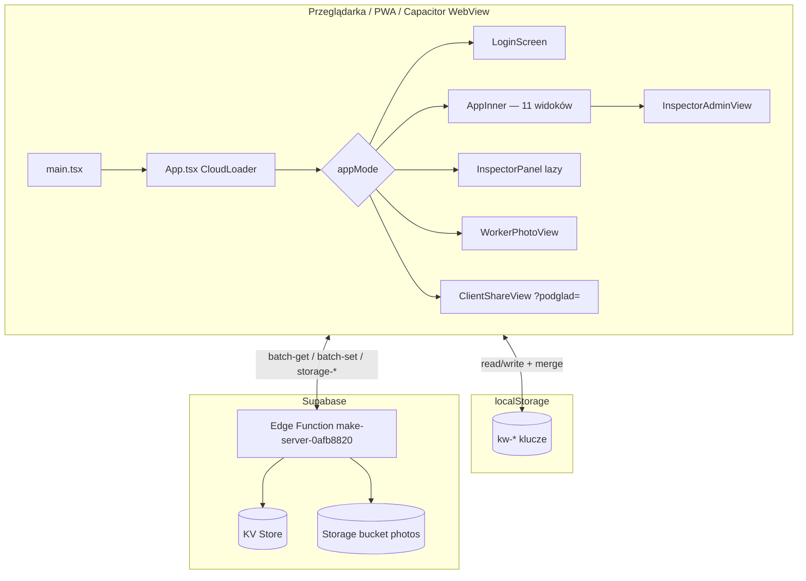
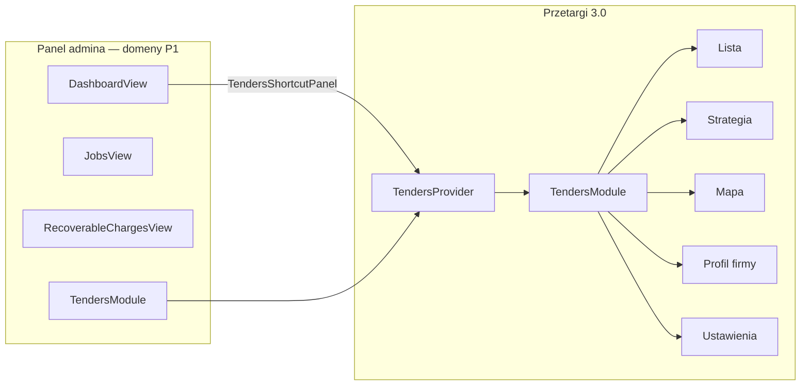

# W&G DOM — przewodnik architektury (living document)

> **Dla kogo:** programista, reviewer — kto ma zrozumieć system **bez czytania plik po pliku**.  
> **Produkcja:** https://www.wgdom.fun · **Repo:** https://github.com/dawidthai125/wgdom · branch `main`  
> **Ostatnia aktualizacja tego dokumentu:** 2026-07-05 (**Bundle #4A Roboty 2.0 MIN** · docs sync · runtime SHIPPED v2.45.32+ · prod **2.63.35+**)
> **★ Mapa aplikacji dla AI:** [`AGENT-APP-MAP.md`](AGENT-APP-MAP.md) · **★ Onboarding:** [`AGENT-ONBOARDING.md`](AGENT-ONBOARDING.md) · **★ SSOT baseline prod:** [`PROJECT-HANDOFF-CURRENT.md`](PROJECT-HANDOFF-CURRENT.md) · **★ SSOT Workflow:** [`WORKFLOW-ARCHITECTURE-v2.63.md`](WORKFLOW-ARCHITECTURE-v2.63.md) · **★ POST ZI:** [`MASTER-HANDOFF-POST-ZI-2026.md`](MASTER-HANDOFF-POST-ZI-2026.md)  
> **Backup baseline:** tag `pre-next-feature-2.50.64` · [`BACKUP-REPORT-2.50.64.md`](BACKUP-REPORT-2.50.64.md) · [`SESSION-HANDOFF-PRE-NEXT-FEATURE-2.50.64.md`](SESSION-HANDOFF-PRE-NEXT-FEATURE-2.50.64.md)

---

## ⚠️ Obowiązek utrzymania tego pliku

**Przy każdej zmianie funkcji, naprawie lub nowej funkcji** — równolegle z CHANGELOG i instrukcją — zaktualizuj **ten dokument**, jeśli dotyczy:

- nowego panelu, klucza danych, endpointu API, flow syncu
- zmiany deployu (Vercel / Supabase / PWA cache)
- nowej konwencji lub pułapki, o której warto pamiętać

**Kolejność pracy (obowiązkowa):**

1. Implementacja (+ chmura, jeśli dane trwałe)
2. Wpis w `CHANGELOG` (`changelog-data.ts`)
3. Instrukcja `HelpView` / hinty nawigacji (jeśli widoczne dla użytkownika)
4. **Aktualizacja `docs/ARCHITECTURE.md`** (sekcja dotycząca zmiany + data na górze)
5. Krótkie podsumowanie po polsku

Reguły projektu: `.cursor/rules/wgdom-development.mdc`

---

## 1. Szybki start (5 minut)

### Onboarding deweloperski (pełna ścieżka)

```text
AGENTS.md
  → docs/AGENT-APP-MAP.md            (★ mapa widoków + moduły — START dla AI)
  → docs/AGENT-ONBOARDING.md         (mapa systemu — START)
  → PROJECT-HANDOFF-CURRENT.md       (baseline 2.63.27)
  → docs/TI-B4-CLOSEOUT.md           (smoke agregat NG-01–04 · Z-04)
  → MASTER-HANDOFF-POST-ZI-2026.md   (WM Druk COMPLETE)
  → ZI-2026-HANDOFF.md               (generator ZI prod)
  → CURRENT-TASK.md
  → WORKFLOW-ARCHITECTURE-v2.63.md   (★ SSOT Workflow — obowiązkowe przy zmianach Przetargu)
  → ARCHITECTURE.md § 11 (sync) · § 12.1.8 (WM Druk) · § 15.1 (widoki)
  → WORKFLOW-RELEASE-DEPLOY.md
```

**Hasło użytkownika „kontynuuj WGDOM”:** dodatkowo `.cursor/rules/wgdom-stan-projektu.mdc`.

**Wznowienie po przerwie:** [`CURRENT-TASK.md`](../CURRENT-TASK.md) → [`PROJECT-HANDOFF-CURRENT.md`](PROJECT-HANDOFF-CURRENT.md) → ten dokument § 11 (sync), § 12.1.3 (Przetargi 3.0), § 15.1 (widoki admin).

```bash
cd WGDOM1
npm install
cp .env.example .env   # jeśli istnieje; uzupełnij VITE_SUPABASE_*
npm run dev              # http://127.0.0.1:5173
npm run build            # produkcja → dist/
npm run test:mobile      # Playwright na www.wgdom.fun (domyślnie)
npm run audit:mobile     # statyczny audyt kodu mobile
```

**Deploy frontendu:** `git push origin main` → Vercel Git Integration (auto-build). **Nie** używaj `vercel deploy` / `vercel --prod`.  
**VERIFY DEPLOY:** push SUCCESS + `version.json` prod + app OK — bez pollingu GitHub/Vercel. Szczegóły: [`WORKFLOW-RELEASE-DEPLOY.md`](WORKFLOW-RELEASE-DEPLOY.md).  
**Deploy backendu:** push zmian w `supabase/functions/**` → GitHub Action `Deploy Supabase Edge Functions`.

**Zmienne środowiskowe (Vite → frontend):**

| Zmienna | Gdzie ustawić | Opis |
|---------|---------------|------|
| `VITE_SUPABASE_PROJECT_ID` | `.env` / Vercel | ID projektu Supabase |
| `VITE_SUPABASE_ANON_KEY` | `.env` / Vercel | Klucz anon (publiczny) |
| `VITE_SUPABASE_FUNCTION_SLUG` | opcjonalnie | Domyślnie `make-server-0afb8820` |

Konfiguracja: `src/config/supabase.ts` → `isSupabaseConfigured()` — bez tych zmiennych sync nie działa (UI pokazuje błąd chmury).

---

## 2. Stos technologiczny

| Warstwa | Technologia |
|---------|-------------|
| UI | React 18, TypeScript, Vite 6 |
| Style | Tailwind CSS 4, `src/styles/mobile.css` |
| Komponenty UI | shadcn/Radix (`src/app/components/ui/`) |
| Routing | **Brak react-router** — nawigacja przez stan React w `App.tsx` |
| Dane lokalne | `localStorage` + merge timestampów |
| Chmura | Supabase Edge Function (Hono) + KV store + Storage |
| Hosting UI | Vercel (SPA, auto-deploy z `main`) |
| PWA | `scripts/sw.template.js` → `dist/sw.js`, `manifest.webmanifest` |
| Native | Capacitor (Android/iOS) — WebView → www.wgdom.fun |
| Testy E2E | Playwright (`e2e/`) |
| PDF | pdfmake (lazy load), docx (dynamic import) |

---

## 3. Architektura wysokiego poziomu



### 3.1 Domeny produktu (admin) — P1 baseline v2.51.x

```text
┌─────────────┐  ┌─────────────┐  ┌──────────────────┐  ┌─────────────────────────────┐
│  Dashboard  │  │   Roboty    │  │ Do Rozliczenia   │  │         Przetargi           │
│  (Pulpit)   │  │   (jobs)    │  │ (recoverable…)   │  │        (tenders)            │
└──────┬──────┘  └─────────────┘  └──────────────────┘  └──────────────┬──────────────┘
       │                                                              │
       │ TendersShortcutPanel                                         │ TendersProvider
       │ (skrót → Strategia)                                          ▼
       │                                                    ┌─────────────────┐
       └───────────────────────────────────────────────────│  TendersModule  │
                                                            │ Lista · Strategia│
                                                            │ Mapa · Profil   │
                                                            │ Ustawienia      │
                                                            └─────────────────┘
```

**Command Center removed in v2.51.0** — brak `CommandCenterProvider`, `TenderCenterProView`, `OwnerDashboard`.



**Zasada:** aplikacja to **offline-first SPA**. Prawda biznesowa = merge(localStorage, stan React, chmura) z regułami timestampów i tombstone'ów.

---

## 4. Bootstrap aplikacji

| Plik | Rola |
|------|------|
| `index.html` | Viewport, PWA meta, CSS anty-zoom iOS; **2.50.20:** md+ `overflow: hidden` na `html/body/#root` |
| `src/main.tsx` | React root, SW, Capacitor shell, klawiatura mobile, viewport desktop, deep linki |
| `src/app/App.tsx` | **Monolit** — auth, admin, worker, changelog, cloud loader |
| `src/styles/index.css` | Import fontów, tailwind, theme, **mobile.css** |

**Łańcuch renderowania:**

```
main.tsx → App (default export) → CloudLoader → AppInnerWithAuth
```

- `CloudLoader` — przy starcie: **dwufazowy bootstrap** (§ 11.5): faza 1 CORE → `ready=true`; faza 2 DEFERRED w tle. Timeout 5 s → UI i tak się pokaże.
- `AppInnerWithAuth` — wybór trybu po `sessionStorage` / query `?podglad=`.

---

## 5. Tryby aplikacji (auth / routing)

Nawigacja **nie używa URL** (poza `?podglad=` i deep linkami). Stan w React + `sessionStorage`.

| `appMode` | Komponent | Wejście |
|-----------|-----------|---------|
| `login` | `LoginScreen` | Domyślny |
| `admin` | `AppInner` + `AdminAccessContext` | Panel administracyjny, rola ≠ inspector |
| `inspector` | `InspectorPanel` (**lazy**) | Przycisk Inspektor, rola `inspector` |
| `worker` | `WorkerPhotoView` | Pracownik — telefon + PIN 4 cyfry |

**Session storage:**

| Klucz | Znaczenie |
|-------|-----------|
| `wg-session-mode` | `admin` \| `inspector` \| `worker` |
| `wg-worker-name`, `wg-worker-id` | Sesja pracownika |
| `wg-inspector-visit-recorded` | Jednorazowy event wizyty inspektora |

**Role admina** (`src/lib/admin-auth.ts`): `super_admin` | `admin` | `moderator` | `inspector`  
- `adminCanViewRates()` — moderator **nie widzi** stawek PLN/h.  
- Super Admin (⚙): użytkownicy, hasła, restore backupów chmurowych, **flagi AppSettings** (patrz § 5.1).

### 5.1 AppSettings ACL — widoki opcjonalne (Super Admin)

**SSOT handoff:** [`SESSION-HANDOFF-SUPER-ADMIN-ACL-GUIDE-CHANGES.md`](SESSION-HANDOFF-SUPER-ADMIN-ACL-GUIDE-CHANGES.md) · **prod 2.62.92**

Pola w `kw-app-settings` (`src/lib/app-settings.ts`). **Domyślnie `false`.** Tylko **Super Admin** edytuje w `AdminSettingsModal` (⚙).

| Flaga | Helper | Widok / funkcja | Kto poza super_admin |
|-------|--------|-----------------|----------------------|
| `tendersTabForStaffEnabled` | `adminCanViewTendersTab` | menu `tenders` | admin + moderator |
| `workCatalogForAdminEnabled` | `adminCanViewWorkCatalog` | Przetargi → zakładka Biblioteka robót | admin |
| `instructionsForAdminEnabled` | `adminCanViewInstructions` | menu `guide` — Instrukcja | admin |
| `changesForAdminEnabled` | `adminCanViewChanges` | menu `changelog` — Zmiany | admin |

**Wzorzec implementacji:** helper w `admin-auth.ts` → `canView*` w `App.tsx` → `buildAdminNavItems({ canView*Nav })` → guard w `AdminViewRouter` + `useEffect` redirect na `dashboard` przy direct URL.

**Test ACL guide/changelog:** `scripts/test-admin-guide-acl.mjs`

**Widoczność etykiet ról w UI (20.5A.7)** — `src/lib/role-visibility.ts` → `visibleRoleLabelForViewer(viewerRole, subjectRole)`:

| Viewer | Widzi etykiety |
|--------|----------------|
| `super_admin` | wszystkie role + Pracownik |
| `admin`, `moderator` | tylko Inspektor (+ Pracownik) |
| `inspector` | tylko Inspektor (+ Pracownik) |

Filtr stosowany w `resolveAuthorContact()` (`content-author-contact.ts`) i `AuthorAttribution`; bypassy: `EmployeeSmsModal`, `RecoverableChargesView`. Topbar: tooltip roli tylko dla super admina. **Admin Settings (⚙)** — pełne role (ekran zarządzania). Dane KV (`authorAdminRole`, `senderRole`) bez zmian — tylko prezentacja.

---

## 6. Panel administracyjny (`AppInner`)

### 6.1 Widoki (`View` union)

| `view` | Opis | Główna funkcja w App.tsx |
|--------|------|--------------------------|
| `dashboard` | Pulpit V3: **KPI** (5) · **Braki dokumentów** · **Pilne uwagi** (kategorie) · **Przetargi — skrót** (`TendersShortcutPanel`) · dolna siatka operacyjna | `DashboardView` |
| `payroll` | Lista płac | `PayrollView` |
| `schedule` | Grafik tygodnia | `ScheduleView` |
| `directory` | Kartoteka pracowników | `DirectoryView` |
| `contacts` | Kontakty e-mail | `ContactsView` |
| `archive` | Archiwum tygodni | `ArchiveView` |
| `jobs` | Roboty (pełny CRUD) | `JobsView` |
| `inspector` | Monitoring inspektora (feed admin) | `InspectorAdminView` |
| `photos` | Galeria zdjęć (admin) — zaakceptowane zdjęcia ekipy; ZIP całej roboty / kategorii | `JobPhotosGalleryView` w `App.tsx` |
| `jobfiles` | Pliki robót | `JobAllFilesView` / browser |
| `guide` | Instrukcja obsługi (FAQ) | `GuideView` `mode="instructions"` | Super Admin zawsze; admin gdy `instructionsForAdminEnabled` |
| `changelog` | Historia wersji (CHANGELOG UI) | `GuideView` `mode="changes"` | Super Admin zawsze; admin gdy `changesForAdminEnabled` |
| `tenders` | **Przetargi 3.0** — `TendersModule` (Lista, Strategia, Mapa, Profil, Ustawienia) | Super Admin zawsze; admin/moderator gdy `tendersTabForStaffEnabled` |

Widoki nieaktywne są **odmontowywane** (`{view==="jobs"&&<JobsView/>}`) — scroll wewnątrz każdego widoku.

### 6.2 Shell admin — mobile i desktop scroll (**2.50.20**)

**Zasada:** dokument (`html`/`body`) **nie scrolluje**. Jedyne scrollowanie pionowe/poziome — wewnątrz aktywnego widoku.

```text
html, body, #root          overflow: hidden (mobile + md+)
└─ .admin-app-shell        100dvh (mobile) / var(--app-height) (desktop)
   └─ AdminViewRouter      flex min-h-0 min-w-0 overflow-hidden
      └─ [widok aktywny]    overflow-y-auto lub overflow-x-auto (tabela)
```

| Warstwa | Plik / klasa | Rola |
|---------|--------------|------|
| Dokument | `index.html` | Bazowo `overflow: hidden`; md+ wysokość `var(--app-height)` |
| Shell | `src/styles/mobile.css` `.admin-app-shell` | md+: `padding-top: var(--app-viewport-offset-top)`, `box-sizing: border-box` |
| Router | `src/app/admin/AdminViewRouter.tsx` | `min-w-0` — flex nie wypycha poziomo całego okna |
| Pulpit | `src/app/DashboardView.tsx` | `min-w-0` + `overflow-y-auto` na panelu głównym |
| Media | `src/app/MediaView.tsx` | `min-w-0` — containment szerokości |
| Viewport | `src/lib/app-viewport.ts` | **Tylko desktop** — `--app-height` z `visualViewport` |

**Mobile (`<768px`):**

- Dolna nawigacja (`md:hidden`) — 4 skróty + Menu
- Shell: `.admin-app-shell` → `height: 100dvh`
- Pull-to-refresh: **brak** — sync przez chmurę + wskaźnik statusu

**Desktop (≥768px) — historia:**

- Przed **2.50.20:** `@media (min-width: 768px)` ustawiał `overflow-y: auto` na `html/body` → **podwójny scrollbar** z wewnętrznym scroll widoków.
- Po **2.50.20:** Fix A — `overflow: hidden` na dokumencie; szczegóły: [`docs/SESSION-HANDOFF-2.50-DESKTOP-LAYOUT.md`](SESSION-HANDOFF-2.50-DESKTOP-LAYOUT.md).

**Testy:** `scripts/smoke-test-desktop-layout-2.50.20.mjs`, `e2e/desktop-layout.spec.ts`, `e2e/desktop-smoke.spec.ts`.

### 6.3 Sync admina

| Mechanizm | Opis |
|-----------|------|
| `useLocalStorage` | Hook w `App.tsx` — zapis do LS + `applyWriteTimestamps` + listener `storage` (cross-tab) |
| Auto-push | `useEffect` na 7 slice'ach stanu → debounce **2 s** → `runCloudSync()` |
| Pull on focus | `pullFromCloudAndMerge()` — visibility, focus, native resume |
| Pełny push | `pushAllDataToCloudSafe` → `computeMergedDataBundle` → merge z LS przed chmurą |
| Ochrona race | `pullInFlightRef`, `suppressAutoSyncUntilRef` (~4,5 s po pull), anulowanie timera push przy pull |
| **Mutation guard** | `cloud-sync-mutation-guard.ts` — `begin/end` token per scope; `isBlocked()` w `runCloudSync` / `pullFromCloudAndMerge` / `scheduleAutoCloudSync`; `reset()` po bootstrap (`CloudLoader`); **Przydziały robót** — `withKwJobsWorkEntryMutation` w `PayrollJobAssignmentsPanel` (v2.63.16) |

**Bundle admina:** `adminDataBundle()` = kolejność `DATA_KEYS`.

---

## 7. Panel inspektora (pole)

**Plik:** `src/app/InspectorPanel.tsx` (**lazy-loaded** od v2.35.15)

**INSPECTOR-JOB-ASSIGN-001 (v2.63.13):** widoczność robót po `assignedInspectorId` (= `AdminSession.id`). Stan **`jobsAll`** (persist/sync LS + chmura) vs **`jobsVisible`** = `filterJobsForInspector(jobsAll, session.id)` — tylko UI (#012). Notatki operacyjne: ACL + `linkedJobId` ∈ visible (#011). Helper: `src/lib/inspector-job-assignment.ts`.

| Zakładka | Opis |
|----------|------|
| `dashboard` | Pulpit WM — KPI, „Dzisiaj”, Action Center (max 3), tygodniowe statystyki |
| `jobs` | Lista robót (karty + postęp %) + szczegóły sekcjami (WM, docs, pliki, zdjęcia, raporty) |
| `gallery` | Galeria zdjęć ekip |
| `files` | Przeglądarka plików + ZIP |
| `portfolio` | Portfolio WM |

**Sprint 20.2A (v2.45.40) — bez nowych KV, bez zmian `mergeJobsById`:**

| Element | Plik | Opis |
|---------|------|------|
| Postęp kontroli | `inspector-dashboard.ts` | `computeInspectionProgress()` — **20.2A.1:** documents 50% + stage 25% + photos 15% + notes 10% (bez `filesPct`; zlecenie/kosztorys tylko w REQUIRED_DOCS) |
| KPI / Action Center | `InspectorDashboard.tsx` | `computeInspectorKpiStats`, `buildActionCenterItems`, `buildTodayJobs` |
| Karty | `InspectorJobCard.tsx` | Postęp %, brakujące do odbioru, ostatnia aktywność, 🔴🟠🟢 |
| Checklist grupy | `InspectorDocChecklist.tsx` | Dokumentacja / Pomiary / Zdjęcia + licznik `n/8` |
| FAB zdjęcie | `InspectorQuickPhotoFab.tsx` | Aparat + wybór roboty → `uploadInspectorPhoto` / `photo-queue` |

Smoke: `npx vite-node scripts/smoke-test-inspector-20.2a.mjs`

**Sync inspektora:**

- Własny `useState` dla `jobs` + `directory` (nie `useLocalStorage`)
- `persistJobs()` → LS + `pushKeysToCloudSafe(["kw-jobs"])`
- `refreshFromCloud()` — mount, focus, visibility, co **120 s**, pull-to-refresh
- **Storage listener** (v2.35.15) — natychmiastowa sync z adminem w innej karcie (`kw-jobs`, `kw-directory`)
- `pushKeysToCloudSafe` — merge z **localStorage przed chmurą** (v2.35.15)

Inspektor **nie** syncuje payroll / archive / contacts — celowo.

---

## 8. Panel inspektora (zakładka admina) — 20.5B.2

**Plik:** `src/app/InspectorAdminView.tsx`  
**Rola:** centrum **monitoringu** (nie workspace operacyjny).

- Feed aktywności z `job-activity.ts` + filtry (w tym billing proposal/note)
- CTA „Otwórz w Robotach” → `pendingJobId` + `pendingJobSection` (`inspector-feed-deeplink.ts`)
- Nieprzeczytane + statystyki logowań — `inspector-stats.ts` · `kw-inspector-stats`
- **Dashboard WM** — KPI „Aktywne WM” + alerty terminów odbioru w „Uwaga dziś”; szczegóły w **Roboty** i **InspectorPanel** (zakładka Portfolio WM). Nie w Inspektorze admin (20.5B.2, 20.5B.4).
- Akcje operacyjne (upload, checklista, approve billing, email plików) — wyłącznie **`JobsView`**

**Panel terenowy** (`InspectorPanel.tsx`) — osobny flow, bez zmian w 20.5B.2.

---

## 9. Panel pracownika

**Plik:** `WorkerPhotoView` w `App.tsx` (~linia 13300+)

- Logowanie: 9 cyfr telefonu + PIN 4 cyfry (`workerPinHash` w kartotece)
- Zakładki: Roboty, Grafik, Wypłata
- Sync: `pushKeysToCloudSafe` dla `kw-jobs`, `kw-week-employees`
- Pull: `reloadWorkerData()` — focus, visibility, PTR, native resume
- **v2.35.15:** po pull zapisuje payroll/archive/week range do localStorage
- Kolejka zdjęć offline: `src/lib/photo-queue.ts`
- Privacy shield przy blur karty: `privacy-shield.ts`

### 9.1 Dokumentacja robót — worker → admin → inspektor (20.5B.6A.1+)

**Model:** `workerReports[]` w `Job` @ `kw-jobs` — **bez osobnego klucza KV**. Merge: `mergeJobsById` w `cloud-sync.ts`.

| Rola | UI | Dane |
|------|-----|------|
| **Pracownik** | `WorkerPhotoView` → `JobReportForm` (`layout="worker"`) | zakres → `workScopeText`; wymiary → `rooms[]`; obrys → `sketch` |
| **Admin** | `JobsView` tab **Dokumentacja** → `JobWorkerReportsPanel` | odczyt/zatwierdzenie raportów; tab **Zdjęcia** → `photos[]` |
| **Inspektor** | `InspectorPanel` tab **Dokumentacja** + **Galeria** | raporty read-only; checklista `InspectorDocChecklist`; plan PDF = `jobFiles[]` kind `plan_techniczny` |

**Worker progress flow (20.5B.6A.4, UX only):** `computeWorkerJobProgress()` w `src/lib/worker-job-progress.ts` — postęp wyliczany **dynamicznie** z `myPhotos` (zdjęcia pracownika) i `myReports` (jego wpisy w `workerReports[]`): Zdjęcia → Dokumentacja (`workScopeText`) → Wymiary (`rooms[]`) → Obrys (`sketch`). UI: `WorkerJobProgressFlow`, `WorkerStepCta`, baner edukacyjny. **Brak nowych pól**, brak zapisu stanu progress, brak sticky UI. Klik kroku → `scrollIntoView` do `#worker-section-*`.

**Semantyka (20.5A.8/9):**

- **Zdjęcia ekipy** → `photos[]` (before/after/progress) — tab Zdjęcia
- **Obrys** → `workerReports[].sketch` — upload „Foto rysunku”, **nie** tab Zdjęcia
- **Plan techniczny PDF** → `jobFiles[]` kind `plan_techniczny` — dokument kontraktowy, **≠** sketch

**Naming (20.5B.6A.1):** tab „Raporty” → **„Dokumentacja”** we wszystkich rolach (copy only).

**Handoff:** [`SESSION-HANDOFF-20.5B-ROBOTY-DOC-VERSION-2026-06.md`](SESSION-HANDOFF-20.5B-ROBOTY-DOC-VERSION-2026-06.md) · **Audyt GO:** [`AUDIT-WORKER-INSPECTOR-READINESS-20.5B.md`](AUDIT-WORKER-INSPECTOR-READINESS-20.5B.md)

**Pliki:** `JobReportForm.tsx`, `JobWorkerReportsPanel.tsx`, `job-documents.ts` (`JOB_DOCUMENTATION_SOURCE_HELP`, `RYSUNEK_PLAN_CHECKLIST_HELP`), `syncJobDocumentsFromReports()`

### 9.2 Kontakt z inspektorem — szablony wiadomości (2.1.0 → 2.1.1, v2.50.70)

**Cel:** z poziomu roboty wysłać email do inspektora WM z czytelnym podsumowaniem „po naszej stronie gotowe” vs „brakuje zlecenia/kosztorysu” — **bez załączników**, reuse `POST /send-job-email`.

| Element | Opis |
|---------|------|
| **UI** | `JobsView` → przycisk „Kontakt z inspektorem” → `JobInspectorContactModal.tsx` |
| **Odbiorca** | `EmailContact.isInspector` w `kw-contacts`; **2.1.1:** `isDefaultInspector` — jeden domyślny (`resolveDefaultInspectorContact`: oznaczony → fallback 1× inspektor → null) |
| **Kontakty UI** | Checkbox „Inspektor WM” + „Domyślny odbiorca inspektora” (tylko gdy inspektor); badge „Inspektor” + „Domyślny”; radio max jeden |
| **Modal UX (2.1.1)** | Start z domyślnym odbiorcą, „Wyślij” od razu aktywne; „Zmień odbiorcę ▼” — pełna lista `isInspector`; hint „Wysyłka testowa” gdy inny niż domyślny; powitanie w treści po zmianie odbiorcy |
| **Szablony A–D** | `inspector-message-templates.ts` — brak zlecenia/kosztorysu × faza (`inferJobPhase`, handover); **E (podziękowanie) poza MVP** |
| **Auto-sugestia** | Priorytet: D > C > A > B wg `documents.zlecenie`, `documents.kosztorys`, fazy |
| **Treść maila** | Sekcje „Po naszej stronie dostępne” (zdjęcia, plan techniczny, dokumentacja robót) i „Brakuje” (zlecenie/kosztorys) — wyliczane z job |
| **Wysyłka** | Payload `{ mode: "inspector_template", introMessage, photos: [], reportSections: [] }` — Edge akceptuje intro ≥40 znaków bez zdjęć/raportów |
| **Historia** | `activityLog` typ `email_sent` + tekst z `inspectorTemplateActivityText()` (nazwa szablonu) |

**Pliki:** `src/lib/inspector-message-templates.ts`, `src/lib/email-contacts.ts`, `src/app/JobInspectorContactModal.tsx`, `src/app/ContactsView.tsx`, `src/app/JobsView.tsx`, `supabase/functions/make-server-0afb8820/index.tsx` (`send-job-email`).

**Smoke:** `scripts/smoke-test-inspector-templates-2.1.mjs`

---

## 10. Model danych

### 10.1 Klucze biznesowe (`DATA_KEYS` w `cloud-sync.ts`)

| Klucz | Zawartość | Kto R/W |
|-------|-----------|---------|
| `kw-directory` | Kartoteka pracowników | Admin, worker (login), inspector (read) |
| `kw-week-employees` | Lista płac — bieżący tydzień | Admin, worker (edit) |
| `kw-archive` | Zapisane tygodnie (snapshots) | Admin |
| `kw-weekFrom` / `kw-weekTo` | Zakres dat tygodnia płac (Pn–So; niedziela = wciąż ten sam tydzień) | Admin |

**Tydzień płacowy (v2.45.14, rollover v2.49.20):** zakres Pn–So. **Nd przed 20:00** — domykany tydzień (wypłaty w sobotę). **Nd od 20:00** — w panelu admina startuje **nadchodzący** tydzień (archiwum + pusta lista, gdy **brak nierozliczonej kasy sobotniej**). **Pn+** — to samo przy pierwszym wejściu, jeśli tydzień w tyle. Auto-archiwum + email backup: niedziela. Alert spójności nie pokazuje się przy pustej liście na nowy tydzień.

**Rollover blokada (Sprint 20.1C, v2.49.20):** `hasPayrollRolloverBlockers()` w `src/lib/payroll-rollover.ts` — blokuje gdy `!settled && calcEmployeeSaturdayCash() > 0`. **Nie blokuje:** ⏭ PRZENIESIONO, biweekly `!isPayoutWeek`, urlop, net ≤ 0. Używane w `tryPayrollWeekCycle`, `trySundayArchiveOnly`, `goToCurrent` (`App.tsx`). Kasa per osoba = ten sam model co `totalSaturdayCash` (tygodniówki + biweekly payout week).
| `kw-jobs` | Roboty (zdjęcia, pliki, WM, activity…) | Wszyscy |
| `kw-contacts` | Kontakty e-mail | Admin |
| `kw-employee-leaves` | Nieobecności pracowników (urlop / L4 / bezpłatny, tygodnie Pn–So) | Admin |
| `kw-recoverable-charges` | Pozycje do rozliczenia / odzyskania (Sprint 20.3A) | Admin (write); Inspektor (read-only, 20.5A.3A) |
| `kw-operational-notes` | Notatki operacyjne — baza wiedzy (P0, v2.57.0) | Admin staff (write); inspektor read/create/comment/ACK (P2A v2.58.0) |

**Notatki operacyjne (P0, v2.57.0):**

| Aspekt | Opis |
|--------|------|
| **Osobna domena** | **≠** `job.notes` (Uwagi wewnętrzne roboty) **≠** `job.jobNotes[]` (WM / billing) |
| **Model** | Tablica `OperationalNote[]` w `kw-operational-notes` — tytuł, treść, `contentRev`, komentarze, `revisions[]` (tylko edycja treści), status `active` / `archived` |
| **Powiązanie z robotą** | Opcjonalne `linkedJobId` + `linkedJobNameSnapshot`; panel `JobOperationalNotesPanel` w Roboty → Przegląd; deep link + `returnNav` do tej samej roboty |
| **ACL (P0 + P2A)** | `super_admin` / `admin` / `moderator` — pełny CRUD w module admin; inspektor — `canView` / `canComment` / `canCreate` / ACK; **bez** edit/archive/delete/share (guardy lib `inspectorStaffMutationBlocked`) |
| **Inspektor UI (P2A, v2.58.0)** | `OperationalNotesView` z `variant="inspector"` w overlay `InspectorPanel` — ikona ScrollText + badge unread w headerze (bez 6. taba bottom nav); lista tylko **aktywnych** (`filterOperationalNotesForInspectorActive`); brak Archiwum, Audytu, Edytuj, Usuń, share toggle |
| **Inspektor sync (P2A)** | `InspectorPanel` — fetch/merge/push tych samych 4 kluczy co admin: `pushOperationalNotesToCloud()`, merge notes/read-state/audit/tombstones przy `refreshFromCloud` |
| **Udostępnienie inspektorowi** | `shareWithInspector` — widoczność dla roli inspektor; przy create inspektora **auto `true`** (lib); toggle w UI admin |
| **Archiwum** | `archiveOperationalNote` / `restoreOperationalNote` — bez hard delete |
| **Logical delete** | `deleteOperationalNoteLogical` + tombstone `kw-operational-notes-deleted-ids` |
| **Audit log** | `kw-operational-notes-audit-log` — append-only, cap 3000 (`operational-notes-audit.ts`); akcje: create, update, comment, archive, restore, delete, share_toggle, job_link_change, **ack** (P2C v2.57.5) |
| **Audit UI (P2C, v2.57.5)** | Przycisk **Audyt** w `OperationalNotesView` → Sheet `OperationalNotesAuditPanel` — **Super Admin only** (`canAccessOperationalNotesAudit`); filtry akcji/użytkownika/notatki + wyszukiwanie; paginacja 50 (`operational-notes-audit-filters.ts`); brak 3. taba i osobnego menu |
| **ACK → audit (P2C)** | `ackOperationalNoteWithAudit()` — przy ręcznym ACK i auto-ACK autora przy create zapisuje wpis `action: ack` z `detail: Potwierdził wersję N` |
| **Read state (P1)** | `kw-operational-notes-read-state` — merge w sync; badge/banner ACK (P1) |
| **Dashboard widget (P2B, v2.57.4)** | `DashboardOperationalNotesWidget` + `computeOperationalNotesDashboardSummary()` na Pulpicie — KPI per użytkownik |
| **Sync** | `pushOperationalNotesToCloud()`, `pullOperationalNotesAuxFromCloud()`, `mergeOperationalNotes()` — LWW po `updatedAt` / `lastActivityAt` |
| **Sync reconcile (PLATFORM-SYNC-01A, v2.63.33)** | Po `await pullAndMergeDataBundle` w `runCloudSync` / `pullFromCloudAndMerge`: `reconcileOperationalNotesInMergedBundle()` — odczyt świeżego `kw-operational-notes` z LS + merge przed `applyAdminDataBundle` / push; **naprawia race archiwizacji** (stale closure nie cofa `archived` → `active`). **ETAP B** (generation counter · telemetry) — **ON HOLD**. Test: `test-operational-notes-sync-race-p0.mjs` P0R-T05–T09 |
| **Backup completeness (v2.58.1 HF)** | SSOT `OPERATIONAL_NOTES_BACKUP_KEYS` w `cloud-sync.ts` — 4 klucze w: export/import UI (`App.tsx`), snapshot lokalny (`local-data-backup.ts`), email tygodniowy (`EMAIL_KV_KEYS` w `backup-lib.mjs`), full backup niedzielny (via spread EMAIL) |
| **Menu** | **Notatki operacyjne** — między Roboty a Inspektor (`operationalnotes`) |

Pliki: `src/lib/operational-notes.ts`, `src/lib/operational-notes-audit.ts`, `src/lib/operational-notes-audit-filters.ts`, `src/lib/operational-notes-read-state.ts`, `src/lib/operational-notes-dashboard.ts`, `src/app/OperationalNotesView.tsx`, `src/app/OperationalNotesAuditPanel.tsx`, `src/app/DashboardOperationalNotesWidget.tsx`, `src/app/JobOperationalNotesPanel.tsx`, `src/app/InspectorPanel.tsx`, `src/app/AppInnerWithAuth.tsx`, `src/app/App.tsx`, `src/app/admin/admin-nav.ts`.

**Do rozliczenia (Sprint 20.3A + 20.4A Foundation, v2.47.00):**

| Aspekt | Opis |
|--------|------|
| **Model** | Tablica `RecoverableCharge[]` w `kw-recoverable-charges` — status `open` / `partial` / `settled`; źródło `job` (opcjonalny `sourceJobId`) lub `standalone` |
| **Settlement ledger (20.4A)** | `settlements[]` (`RecoverableChargeSettlement`), cache `amountSettled` / `amountRemaining`; status wyliczany przez `deriveChargeAmounts()` — UI rozliczania w 20.4B |
| **Legacy** | `normalizeRecoverableCharges`: brak settlements → `[]`; legacy `settled` → syntetyczny wpis migracyjny; legacy `partial` → reset do `open` |
| **Merge** | `mergeRecoverableCharges()` — union `settlements` po `id` (`mergeSettlementsById`), potem `deriveChargeAmounts()`; pola skalarne LWW po `updatedAt` |
| **UI (20.4B, v2.47.10)** | `RecoverableChargesView.tsx` + `SettleChargeModal.tsx` — KPI (do rozliczenia / częściowo / odzyskano), Rozlicz, historia, status tylko do odczytu |
| **Dashboard V3 (v2.50.74)** | Kategoria **Do odzyskania** w Pilnych uwagach — `alerts.length` pozycji; klik → moduł. Karta `RecoverableChargesDashboardCard` **usunięta** |
| **Reporting aging (20.4C.2A, v2.48.10)** | `computeRecoverableChargesReportingStats()` — jedno przejście; kubełki 0–30/31–60/61–90/90+ od `createdAt`; tylko open+partial; `RecoverableChargesAnalysisSection.tsx` w module |
| **Alerty (20.4C.2B, v2.48.20)** | `computeRecoverableChargesAlerts()` — A kwota / B wiek>90 / C partial>60 / D brak aktywności>60; `RecoverableChargesAlertsSection.tsx` w module; na Pulpicie V3: `alerts.length` (nie `attentionCount` 0/1) |
| **Insights (20.4C.2C, v2.48.30)** | `computeRecoverableChargesTimeStats()` + `computeRecoverableChargesTopLists()`; `RecoverableChargesInsightsSection.tsx` — KPI miesiąc/rok + TOP 5 |
| **Jobs integracja (20.5A.1, v2.49.00)** | `getRecoverableChargeJobStats()` — agregacja po `sourceJobId` / `targetJobId`; badge 💰 na `JobListCardV2`; `JobRecoverableChargesPanel.tsx` w Przeglądzie roboty; deep link `pendingRecoverableChargeId` → `RecoverableChargesView` |
| **Create from job (20.5A.2, v2.49.10)** | `buildRecoverableChargeDraftFromJob()` + `JobCreateRecoverableChargeModal.tsx` — modal na robocie (bez nawigacji); `pendingRecoverableChargeCreatePreset` → moduł z auto-create; `finalizeRecoverableChargeDraftForSave()` współdzielony |
| **Inspektor review (20.5A.3A, v2.49.70)** | `InspectorPanel` — read-only fetch/merge `kw-recoverable-charges` (bez `pushRecoverableChargesToCloud`); `JobRecoverableChargesPanel` `variant="inspector"` w sekcji WM — kwoty, KPI, pełna historia `settlements[]`; badge 💰 na `InspectorJobCard`. Kwoty odzyskania ≠ `adminCanViewRates` (stawki PLN/h) |
| **Badge menu** | `countUnsettledRecoverableCharges()` — open + partial |
| **Menu** | **Do rozliczenia** (💰); **Media** = Zdjęcia + Pliki robot (jak Instrukcja/Zmiany) |
| **Sync** | Admin: `pushRecoverableChargesToCloud()`; Inspektor: tylko odczyt LS + cloud merge; tombstone `kw-recoverable-charges-deleted-ids` |
| **Inspektor uwagi (20.5A.4, v2.49.80)** | `JobNote.recoverableChargeId` + `context: billing` w `kw-jobs`; `activityLog` typ `inspector_billing_note`; wątek w `JobRecoverableChargesPanel`; bez push `kw-recoverable-charges` |
| **Billing evidence (20.5A.5, v2.50.42)** | `JobNote.attachments[]`; `uploadBillingEvidence()` → `storage-upload` prefix `billing-evidence-`; inspektor/admin podgląd w wątku pozycji |
| **Billing proposal (20.5A.6, v2.50.44)** | `JobNote.context: billing_proposal` + `proposalStatus` pending/approved/rejected w `kw-jobs`; inspektor `appendBillingProposalNote()` + dowody `uploadBillingProposalEvidence()`; admin approve → `createChargeDraftFromProposal()` + `appendRecoverableChargeCreate()` → `kw-recoverable-charges`; reject z `rejectedReason`; KPI/badge 💰 **nie** liczą propozycji pending |
| **Backlog** | 20.3C legacy CC + GuideView · Roboty 2.0 FULL — tylko na polecenie |

Pliki: `src/lib/recoverable-charges.ts`, `src/lib/job-wm.ts`, `src/lib/billing-evidence-upload.ts`, `src/app/RecoverableChargesView.tsx`, `src/app/JobRecoverableChargesPanel.tsx`, `src/app/JobCreateRecoverableChargeModal.tsx`, `src/app/InspectorBillingProposalModal.tsx`, `src/app/BillingProposalReviewCard.tsx`, `src/app/InspectorPanel.tsx`, `src/app/JobsView.tsx`, `src/app/MediaView.tsx`.

**Nieobecności (Sprint 20.0A, v2.45.37, prod `778f616`):**

| Aspekt | Opis |
|--------|------|
| **Model** | Tablica `EmployeeLeave[]` w `kw-employee-leaves` — typy: urlop / L4 / bezpłatny; zakres tygodni Pn–So |
| **UI** | `EmployeeLeavesSection.tsx` w kartotece — CRUD; walidacja overlap + blokada tygodni w archiwum |
| **Payroll leave overlay** | `payroll-leave-overlay.ts` — na **live** liście płac: `netPay`/`grossPay`=0, **godziny bez zmian**; etykiety 🏖 URLOP / 🤒 CHOROBOWE / 🚫 BEZPŁATNY |
| **Biweekly** | `calcBiweeklyWeekNetWithLeave` — cash split i payout zerowane w tygodniu urlopu |
| **Archive snapshot freeze** | Przy `buildWeekSnapshot` zamrażany `leaveStatus` w `EmployeeSnapshot`; archiwalna lista płac i PDF/DOCX **tylko ze snapshotu** — bez live lookup urlopów dodanych później |
| **Eksport** | `payroll-export.ts` — `payrollNetDisplayText()` → „URLOP” / status zamiast kwoty net |
| **Sync** | `mergeEmployeeLeaves()` w `cloud-sync.ts`; push przez `pushEmployeeLeavesToCloud()` |
| **Edge** | Walidacja payloadu + overlap w `batch-set`; filtrowanie ID z tombstone list |

Pliki: `src/lib/employee-leaves.ts`, `src/lib/payroll-leave-overlay.ts`, `src/app/EmployeeLeavesSection.tsx`, `src/app/PayrollView.tsx`.

**Odroczenie wypłaty (Sprint 20.1A, v2.45.38, prod `f24fafe` — CLOSED):**

| Aspekt | Opis |
|--------|------|
| **Model danych** | Pole opcjonalne `payrollCarryForward` na `WeekEmployee` w `kw-week-employees` — `{ amount, targetWeekFrom, targetWeekTo, createdAt }`. **Bez nowego klucza KV / Edge deploy.** |
| **UI** | Lista płac (`PayrollView`) + panel pracownika (`WeekEmployeeDetail`) — przycisk ⏭ „Przenieś na następny tydzień” (jednorazowo, **weekly only**). |
| **MODEL A (frozen amount)** | Kwota `amount` **zamrożona** w momencie kliknięcia — **nie** przelicza się po zmianie godzin/stawki w tygodniu źródłowym. |
| **Tydzień źródłowy (carry out)** | `displayNetPay=0`, etykieta **PRZENIESIONO**; `carryForwardOut` w snapshot. |
| **Tydzień docelowy (carry in)** | `displayNet = baseNet + carryForwardIn` (tylko jeden tydzień docelowy). |
| **Priorytet overlay** | urlop → carry out → carry in → biweekly |
| **Biweekly V1 (blocked)** | Wypłata co 2 tygodnie — **zablokowana** (`canDeferPayroll` → `biweekly_blocked`). Urlop blokuje przeniesienie. |
| **Archive snapshot freeze** | Przy `buildWeekSnapshot(..., savedWeeksForCarry?)` zamrażane w `EmployeeSnapshot`: `carryForwardOut`, `carryForwardTargetFrom/To`, `carryForwardIn`, `carryForwardFromWeek`. Archiwalna lista płac **tylko ze snapshotu** — historyczne kwoty niezmienne. |
| **Archive behavior** | `ArchiveView` renderuje zamrożone `carryForwardOut/In` z `EmployeeSnapshot`; brak live recalc z bieżących `WeekEmployee`. |
| **PDF/DOCX export** | `payroll-export.ts` — `payrollNetDisplayText()`: W1 „PRZENIESIONO”; W2 `4500,00 (+2250,00 przen.)` — tekst ze snapshotu archiwum. |
| **Sync** | `pickPayrollCarryForward()` w `mergeWeekEmployeeRecord` — merge nie gubi defer gdy chmura nie ma pola |
| **Double-click guard** | Drugie ⏭ → `already_deferred` (BLOCKED) |

Pliki: `src/lib/payroll-carry-forward.ts`, `src/lib/payroll-carry-snapshot.ts`, `src/app/PayrollView.tsx`, `src/app/WeekEmployeeDetail.tsx`, `src/app/app-domain.ts`, `src/lib/payroll-export.ts`, `src/app/ArchiveView.tsx`, `src/lib/cloud-sync.ts` (merge carry).

**Carry forward workflow (Sprint 20.1B, v2.45.39 — CLOSED):** rozdzielenie **saved** (backup) vs **closed** (historyczny).

| Aspekt | Opis |
|--------|------|
| **`isPayrollWeekSaved`** | `savedWeeks.some(weekFrom/weekTo)` — kopia zapasowa istnieje |
| **`isPayrollWeekClosed`** | `weekFrom/weekTo ≠ getPayrollWeekRange(now)` — kalendarzowe (legacy / testy) |
| **`isPayrollWeekClosedForUi`** | Jak wyżej, **ale** `hasRolloverBlockers` → nadal operacyjny (Sprint 20.1D) |
| **Defer ⏭** | Dozwolony gdy **nie** closed (UI); zablokowany: `closed_week` (nie `archived_week`) |
| **Aktywny tydzień (saved lub nie)** | Lista płac + PDF/DOCX z **live** `weekEmployees`; urlopy z live overlay |
| **Tydzień historyczny (closed)** | Lista płac + PDF/DOCX ze **snapshotu**; defer zablokowany |
| **Snapshot refresh** | `refreshSavedActiveWeekSnapshot()` w `App.tsx` — po defer, toggle settled, edycji rosteru (tylko gdy saved + operacyjny) |
| **Banery UI** | Zapisany operacyjny: „kopia zapasowa”; historyczny: „podgląd ze snapshotu” |
| **B5 closed week UI (v2.63.22)** | `displayEmployees` SSOT w `PayrollView`; closed → read-only (brak mutacji rosteru/przydziałów); `WeekEmployeeDetail.readOnly`; empty state bez live fallback |

Pliki 20.1B: `src/lib/payroll-cycle.ts`, `src/app/PayrollView.tsx`, `src/app/App.tsx`, `src/lib/payroll-leave-overlay.ts` (biweekly overlay tylko closed).

**Payroll rollover (Sprint 20.1C, v2.49.20 — lokalnie):**

| Aspekt | Opis |
|--------|------|
| **Plik** | `src/lib/payroll-rollover.ts` — `calcEmployeeSaturdayCash`, `blocksPayrollRollover`, `hasPayrollRolloverBlockers` |
| **Warunek blokady** | `!emp.settled && saturdayCash > 0` |
| **saturdayCash** | Tygodniówka: `calcWeeklyNetWithCarry`; biweekly: `displayNet` tylko w `isPayoutWeek`, inaczej 0 |
| **Zwolnienia** | Carry out (PRZENIESIONO), biweekly accrual, urlop, net ≤ 0 — przez `saturdayCash === 0` |
| **Bez zmian** | `autoArchiveAndAdvance`, `buildWeekSnapshot`, MODEL A, `computePayrollCashSplit`, sync KV |
| **Smoke** | `scripts/smoke-test-payroll-rollover-20.1c.mjs` |
| **20.1C.2** | Dashboard alerty = `listPayrollRolloverBlockers` (v2.49.40) |

**Closed week semantics (Sprint 20.1D, v2.49.60 — CLOSED):**

| Aspekt | Opis |
|--------|------|
| **Problem** | Nd ≥20:00 zegar → W2, ale blockers trzymają stan na W1; stary `isPayrollWeekClosed` = historyczny |
| **Fix** | `isPayrollWeekClosedForUi(week, hasRolloverBlockers)` — calendar behind + blockers → **nie** closed |
| **UI** | `PayrollView`, `App.tsx` snapshot refresh, `payroll-leave-overlay` biweekly |
| **Smoke** | `scripts/smoke-test-payroll-week-closed-20.1d.mjs` (T1–T6) |

**Lista Płac — Przydziały robót (PAYROLL-ASSIGNMENTS-P1, v2.59.49, prod `94ad114` — CLOSED):**

| Aspekt | Opis |
|--------|------|
| **Cel** | Edycja `job.workEntries[]` z Listy Płac — alternatywny widok do Roboty → Pracownicy |
| **SSOT godzin** | `dayBaseHoursOnly(emp.days[dayKey])` — **tylko odczyt** w panelu przydziałów |
| **SSOT przydziałów** | `Job.workEntries[]` w `kw-jobs` — ten sam model co `JobsView` |
| **UI tryby** | `PayrollView.payrollListMode`: `summary` \| `detailed` \| `assignments` (localStorage `wg-payroll-list-mode`) |
| **Panel** | `assignments` + wybrany pracownik → `PayrollJobAssignmentsPanel`; inaczej → `WeekEmployeeDetail` |
| **Spójność** | Reuse `payrollJobConsistencyAlerts`, `jobHoursComparableToPayrollBase`, `jobSitesForEmployeeOnDate` — **bez duplikacji** Dashboard |
| **Badge** | 🟢🟡🔴 na liście (tryb assignments) — `employeePayrollAssignmentBadge()` |
| **Filtr robót** | Dropdown: `inferJobPhase !== "completed"` (`jobsForPayrollAssignmentDropdown`) |
| **Kopia wczoraj** | `copyEmployeeAssignmentsFromPreviousDay` + `distributeHoursAcrossEntries` |
| **Zapis** | `onSetJobs={setJobs}` w `AdminViewRouter` → sync jak Roboty |
| **Delete persistence (2.62.34)** | `Job.deletedWorkEntryTombstones[]` — SSOT `removeWorkEntryFromJobs` / `removeWorkEntriesMatchingFromJobs`; merge w `mergeWorkEntriesById` |
| **Zakaz** | Brak nowego KV; brak zmian wypłat/grafiku/sobót/zaliczek |

Pliki: `src/lib/payroll-job-assignments.ts`, `src/app/PayrollJobAssignmentsPanel.tsx`, `src/app/PayrollView.tsx`, `src/app/admin/AdminViewRouter.tsx`, `src/app/app-domain.ts` (algorytm spójności), `src/app/JobsView.tsx` (wzorcowa edycja). Handoff: [`SESSION-HANDOFF-PAYROLL-ASSIGNMENTS-P1.md`](SESSION-HANDOFF-PAYROLL-ASSIGNMENTS-P1.md). Smoke: `scripts/test-payroll-assignments-p1.mjs`.

**Nowy typ danych → MUSISZ:** dodać do `DATA_KEYS`, hook stanu w adminie, merge w `mergeDataKey`, push/pull paths, tombstone przy DELETE.

### 10.2 Tombstones (usunięcia nie wracają z chmury)

| Klucz | Dotyczy |
|-------|---------|
| `kw-jobs-deleted-ids` | Usunięte roboty |
| `kw-directory-deleted-ids` | Usunięci pracownicy |
| `kw-contacts-deleted-ids` | Usunięte kontakty |
| `kw-archive-deleted-ids` | Usunięte tygodnie archiwum |
| `kw-employee-leaves-deleted-ids` | Usunięte nieobecności (Sprint 20.0A) — merge i Edge batch-set filtrują te ID |
| `kw-recoverable-charges-deleted-ids` | Usunięte pozycje do rozliczenia (Sprint 20.3A) |
| `kw-operational-notes-deleted-ids` | Logicznie usunięte notatki operacyjne (P0, v2.57.0) |
| `Job.deletedWorkEntryTombstones[]` | Usunięte wpisy `workEntries[]` per robota (2.62.34) — merge w `mergeJobsById`, nie osobny klucz KV |

### 10.3 Klucze konfiguracyjne (chmura przez `persistKey`)

| Klucz | Zawartość |
|-------|-----------|
| `kw-admin-passwords` | Hash hasła per userId |
| `kw-admin-users-config` | Role, custom users, telefony |
| `kw-app-settings` | `athPreviewEnabled`, `tendersTabForStaffEnabled`, `workCatalogForAdminEnabled`, `instructionsForAdminEnabled`, `changesForAdminEnabled`, `catalogWriteMode`, … |
| `kw-inspector-stats` | Logowania / wizyty inspektorów |
| `kw-tenders-pipeline` | Pipeline przetargów BZP (status, notatki) — Super Admin |

### 10.4 Tylko lokalne (bez chmury)

`kw-local-snapshot-bundle`, `kw-jobs-last-good`, `wg-payroll-list-mode`, flagi UI, `sessionStorage`.

---

## 11. Sync i merge (`src/lib/cloud-sync.ts`)

**Serce systemu.** Przed edycją syncu — przeczytaj ten plik.

**★ ADR (przyszłość Cloud Sync):** [`architecture/ADR-CLOUD-SYNC-ARCHITECTURE.md`](architecture/ADR-CLOUD-SYNC-ARCHITECTURE.md) — Status **PROPOSED** · Evidence Gate **OPEN** · SYNC-ARCH Design Freeze **BLOCKED** · Implementation **BLOCKED**. Audyty Recovery: [`recovery/`](recovery/).

### 11.1 Główne funkcje

| Funkcja | Kiedy używać |
|---------|--------------|
| `fetchKeysFromCloud(keys)` | Odczyt batch z API |
| `pushKeysToCloud(keys, values)` | Surowy zapis (CloudLoader bootstrap) |
| `pushKeysToCloudSafe(keys, values)` | Push z merge LS + chmura — **inspektor, worker, pojedyncze klucze** |
| `pushAllDataToCloudSafe(bundle)` | Pełny push admina — 7 kluczy + tombstones |
| `pullAndMergeDataBundle(bundle)` | Pull bez zapisu — odświeżenie UI admina |
| `computeMergedDataBundle(bundle)` | Fetch + merge — używane przez push i pull |
| `prepareDataBundleForCloudPush` | Admin: merge React z LS przed chmurą |
| `prepareKeysForCloudPush` | Partial keys: merge LS przed chmurą (v2.35.15) |
| `mergeDataKey` / `mergeJobsById` | Logika per-typ |
| `mergeWeekEmployeeRecord` | Stawka, dni, **settled** — osobne timestampy |
| `persistKey(key, value)` | LS + opcjonalny cloud (settings, stats) |

### 11.2 Zasady merge (skrót)

- **Jobs:** per `id`, winner po `updatedAt` + merge pól (documents, photos, activity…)
- **Week employees:** **UNION po `weekEmployeeMergeKey`** (`directoryId` → `dir:{id}`; legacy: name/id) — lokalne dodanie z Kadr nie ginie przy starszym snapshotcie chmury (**PAYROLL-CLOUD-RECOVERY P0**, v2.63.15). Per klucz: `mergeWeekEmployeeRecord` dla pól (stawka, dni, settled). **RC-B-1 (v2.63.30):** mutacje składu tygodnia **tylko** przez **PWRB** (`src/lib/payroll-week-roster-bundle.ts`) — para `kw-week-employees` + `kw-week-employees-deleted-ids`; inwarianty **I-1…I-4** (revocation przy re-add). Closeout: [`recovery/SYNC-ARCH-01-RC-B-1-CLOSEOUT.md`](recovery/SYNC-ARCH-01-RC-B-1-CLOSEOUT.md). Auto-sync defer: **`CloudSyncMutationGuard`** scope `kw-week-employees` (B3, v2.63.18) + **`suppressAutoSyncUntilRef`** — legacy `payrollRosterPushRef` usunięty w B3.2 (v2.63.20).
- **Jobs / workEntries:** `mergeWorkEntriesById` union + tombstone (bez zmian w P0 guard). **PAYROLL-JOBS-ASSIGNMENT-SYNC-GUARD P0** (v2.63.16): edycja przydziałów LP opakowana w `CloudSyncMutationGuard` scope `kw-jobs` — auto-sync defer podczas mutacji; recovery `reset()` po bootstrap.
- **Edge `batch-set` (FIX A, 2026-06-03):** `mergeWeekEmployeeRecordByTimestamps` używa `pickSettledByTimestamps` / `isLikelySpuriousUnsettle` jak klient; `mergeWeekEmployeesUnion` zawsze scala rekordy (nie zastępuje całego wpisu po `weekEmployeeRichness`)
- **Edge `batch-set` (B6, v2.63.23):** union listy `kw-week-employees` po **`weekEmployeeMergeKey`** (`directoryId` SSOT) — parity z klientem P0; expansion guard scala (nie `KeepPrevRoster` po UUID); SSOT `src/lib/payroll-week-employee-merge.ts`
- **Restore banner (RB, v2.63.24):** `PayrollView` — CTA „Przywróć z archiwum” gdy `payrollMetrics` archiwum > live (`activeDays` lub `totalHours` + EPS); `shouldShowPayrollRestoreBanner` w `cloud-sync.ts`; richness **nie** wyzwala UI
- **Directory:** lokalna lista decyduje o składzie; pola scalane per id
- **Archive:** lokalna lista + merge `weekEmployees` wewnątrz tygodnia
- **Employee leaves:** per `id`, winner po `updatedAt`; union z filtrem `kw-employee-leaves-deleted-ids` — usunięte wpisy **nie wracają** z chmury (Sprint 20.0A)
- **Remis timestampów:** preferencja **chmury** (v2.35.14+)
- **Po pull admina:** `suppressAutoSyncUntilRef` — nie pushuj od razu pętlą

### 11.3 Pułapki syncu (NIE psuj)

1. **Nigdy** nie zapisuj trwałych danych tylko w React state bez LS/chmury.
2. Partial push (`pushKeysToCloudSafe`) **musi** iść przez `prepareKeysForCloudPush` — inaczej nadpiszesz edycje admina z innej karty.
3. Inspektor w tej samej karcie co admin — używaj storage events; między urządzeniami — timestamp merge.
4. Usuwanie roboty → `addDeletedJobId` + `pushJobsAfterDelete`.
5. Usuwanie z kartoteki → `pushDirectoryToCloud` (natychmiast).
6. **Stale localStorage + bootstrap push** — stary LS może przywrócić usunięte klucze KV (admin passwords, martwe URL w jobs). Fix: P11/P15 w `CloudLoader`; po incydencie **hard refresh**. Szczegóły → [`INCIDENTS-2026-06.md`](INCIDENTS-2026-06.md).
7. **Logout nie uruchamia ponownie CloudLoader** — merge bootstrap tylko przy pierwszym mount strony.
8. **`mergeDataKey` ↔ importy nagłówka** — każda funkcja wywoływana w `case` musi być zaimportowana w `cloud-sync.ts`. Regresja **2.62.39** (`2b8980c`): usunięto `mergeDeliveryPackagePublications` przy dodaniu Security Log → `ReferenceError` przy `runCloudSync` (hotfix **2.62.42** `d799033`). Patrz [`SESSION-HANDOFF-2026-06-24.md`](SESSION-HANDOFF-2026-06-24.md) §4. i bootstrap merge (P11, czerwiec 2026)

| Mechanizm | Plik | Rola |
|-----------|------|------|
| `wouldBlockPayrollShrink` | `cloud-sync.ts` | Blokuje push gdy `activeDays` lub `totalHours` spada >50% vs chmura |
| `applyPayrollGuardBeforePush` | `cloud-sync.ts` | Wywoływany przed batch-set payroll |
| **`finalizePayrollBundleMerge`** | `cloud-sync.ts` | **SSOT B4 (v2.63.21)** — align + sanitize + week mismatch (20.1C.1) + P11 richness; bootstrap **i** runtime |
| `applyBootstrapPayrollMerge` | `cloud-sync.ts` | CloudLoader bootstrap — wrapper → `finalizePayrollBundleMerge` |
| `applyRuntimePayrollAntiLeak` | `cloud-sync.ts` | **Runtime only** — pusty skład po rolloverze; nie przenoś osób z KV |
| `sanitizeWeekEmployeesForTargetRange` | `cloud-sync.ts` | Odrzuca rekordy spoza docelowego zakresu tygodnia |
| `CloudSyncMutationGuard` | `cloud-sync-mutation-guard.ts` | Blokuje pull/push podczas mutacji `kw-week-employees` / `kw-jobs` (B3, v2.63.18) |
| **`payroll-week-roster-bundle.ts` (PWRB)** | facade RC-B-1 | `pwrAdd`/`pwrRemove`/`pwrPush` — jedyny entry UI mutacji pary roster+tombstones |

Test: `npx vite-node scripts/test-p11-bootstrap-payroll.mjs` · `npx vite-node scripts/test-payroll-bootstrap-runtime-parity-b4.mjs` (B4 parity 13) · **`npm run audit:pwrb`** (RC-B-1 boundary)

### 11.4 Egress i pełny bundle (P0 audit 2026-06-29) · **OPEN**

> **Incydent:** Supabase `exceed_egress_quota` → sync admina pada (`Failed to fetch` w przeglądarce, HTTP 402 na bramce).  
> **SSOT:** [`SESSION-HANDOFF-P0-CLOUD-SYNC-EGRESS-AUDIT-2026-06-29.md`](SESSION-HANDOFF-P0-CLOUD-SYNC-EGRESS-AUDIT-2026-06-29.md)

| Mechanizm | Egress / transfer | Uwaga |
|-----------|-------------------|--------|
| `runCloudSync` | **3–4× `batch-get`** + **2× `batch-set`** na cykl | Pełny bundle **31 `DATA_KEYS` + tombstones** przy **każdej** zmianie (debounce 2 s) |
| `pullFromCloudAndMerge` | **1× pełny `batch-get`** | Każdy **focus** / **visibility** widocznej karty admina |
| `triggerWeeklyBackupEmail` | POST **wszystkich `DATA_KEYS`** | Niedziela, po zapisie tygodnia — duży **ingress** |
| Inspektor `refreshFromCloud` | `batch-get` 11 kluczy co **120 s** | Równoległa sesja amplifikuje odczyt |
| Przetargi `zip-entry-bytes` | Spiki do **128 MB** response | Pojedyncze operacje dossiera |

**Szac. response jednego pełnego `batch-get`:** ~2–10 MB (zależnie od `kw-jobs`, `kw-archive`, `kw-tenders-pipeline`).

**Pułapki dla programistów:**

1. **Nie** zakładaj, że `Failed to fetch` = błąd kodu URL — sprawdź **402 quota** na bramce Supabase.
2. **Nie** dodawaj kolejnych pełnych `batch-get` bez AUDIT egress.
3. Refactor na delta-sync — **tylko na polecenie** po odblokowaniu billing + brief; **nie** ruszać Payroll Guard / P11 merge bez review.

### 11.5 Admin passwords (`kw-admin-passwords`, P15)

- Klucz KV: mapa `userId → SHA-256("wgdom-admin-account-v1:" + login + ":" + password)`.
- **Brak klucza** = hasło startowe z `BUILTIN_ADMIN_ACCOUNTS` (`admin-auth.ts`).
- **`mergeAdminPasswordOverrides(local, cloud)`** (P15): baza = klucze z chmury; lokal nadpisuje tylko wspólne klucze; klucze tylko w LS **nie wracają** do push.
- **`shouldPushAdminPasswordOverridesOnBootstrap`**: nie pushuj gdy `cloudKeys < localKeys` (chmura jest źródłem prawdy o składzie override).

Test: `npx vite-node scripts/test-p15-admin-password-merge.mjs`

**Nie mieszaj** z ogólnym `mergeDataKey` — admin passwords mają osobną logikę w `CloudLoader`, nie w `cloud-sync.ts`.

### 11.6 CloudLoader CORE / DEFERRED bootstrap (Performance 1.3A+, prod `a6cdb4a`)

**Cel:** szybsze `ready=true` — cięższe klucze przetargów i kontaktów pobierane **po** wejściu w UI (login / admin).

**SSOT liczby `batch-get` (Recovery E-08 / E-09):** faza 1 = **12 kl.** blocking · faza 2 = **28 kl.** deferred.

| Faza | Kiedy | `batch-get` (SSOT) | Skład (referencja) | Plik |
|------|--------|-------------------|-------------------|------|
| **CORE** | przed `setReady(true)` | **12 kl.** | 6 core + 3 tombstone + 3 admin | `CloudLoader.tsx` L59–67 |
| **DEFERRED** | `void` po `ready` | **28 kl.** | 6 deferred + tombstones (w tym `kw-employee-leaves-deleted-ids`, `kw-recoverable-charges-deleted-ids`) | `fetchAndMergeDeferredBootstrap()` |

**CORE:** `kw-directory`, `kw-week-employees`, `kw-archive`, `kw-weekFrom`, `kw-weekTo`, `kw-jobs`.

**DEFERRED:** `kw-tenders-pipeline`, `kw-tenders-company-profile`, `kw-tenders-custom-keywords`, `kw-contacts`, `kw-employee-leaves`, `kw-recoverable-charges`.

Po zakończeniu fazy 2: event `wgdom-deferred-bootstrap` (`WGDOM_DEFERRED_BOOTSTRAP_EVENT`) → `TendersProvider` wywołuje `bumpProfileVersion()` (profil firmy w module Przetargi).

**Uwaga:** `useTendersPipeline` nadal może robić własny fetch pipeline przy mount CC — nie zakłada danych z fazy 1 CloudLoader.

**Dokumentacja sesji:** [`SESSION-HANDOFF-PERFORMANCE-2026-06.md`](SESSION-HANDOFF-PERFORMANCE-2026-06.md)

---

### 11.7 ARCH-001 — Circular Dependency Prevention (2026-06-13)

**Status:** obowiązuje od v2.53.3 · wynik incydentu P0 v2.53.1 → hotfix v2.53.2

#### Incydent (v2.53.1)

| Pole | Wartość |
|------|---------|
| **Wersja** | 2.53.1 (UX.1A) |
| **Objaw** | Biały ekran — aplikacja nie renderuje się |
| **Błąd** | `Uncaught ReferenceError: Cannot access '…' before initialization` (minifikacja: `Pa`) |
| **Chunk** | `app-core` (Vite manualChunk: `cloud-sync.ts`) |
| **Root cause** | **ESM circular dependency** + **Temporal Dead Zone (TDZ)** przy inicjalizacji modułu |

#### Łańcuch awarii (uproszczony)

```text
cloud-sync (inicjalizacja…)
  → tenders-sync
    → tender-cost-calibration
      → cloud-sync          ← cykl #1 (static import)
      → tenders-bzp
        → tenders-pipeline-session-cache
          → cloud-sync      ← cykl #2 (WGDOM_DEFERRED_BOOTSTRAP_EVENT)
```

Przy starcie aplikacji `session-cache` rejestruje `window.addEventListener` używając eksportu z `cloud-sync`, który **nie zdążył** zostać zainicjalizowany → crash przed pierwszym renderem React.

#### Naprawa (v2.53.2)

- `tender-cost-calibration.ts` — `fetchKeysFromCloud` / `persistKey` tylko przez **`import()` dynamiczny** (async).
- `tenders-pipeline-session-cache.ts` — lokalna stała `"wgdom-deferred-bootstrap"` (bez importu z `cloud-sync`).
- Usunięty value-import `matchPriorityBuyer` z `tenders-bzp` w kalibracji (tylko `import type`).

---

#### ★ P0 ARCH RULE (obowiązkowa)

**`cloud-sync` nie może być importowany na poziomie modułu (static `import`) przez:**

| Kategoria | Przykłady |
|-----------|-----------|
| **Modele domenowe** | `tenders-bzp`, `recoverable-charges`, `employee-leaves` |
| **Feature modules** | `tender-cost-calibration`, `tenders-bzp-company`, store katalogów |
| **Sync participants** | Moduły importowane **przez** `cloud-sync.ts` do merge (bezpośrednio lub w drzewie zależności) |
| **Cloud-sync consumers w cyklu** | Każdy moduł w drzewie `cloud-sync → … → moduł → cloud-sync` |

**Zakazane relacje:**

```text
cloud-sync ↔ domena
cloud-sync ↔ feature
cloud-sync ↔ sync participant
cloud-sync ↔ cloud-sync consumer (static, w tym samym drzewie init)
```

**Dozwolone:**

| Wzorzec | Przykład |
|---------|----------|
| UI → cloud-sync | `CloudLoader.tsx`, `App.tsx`, panele zapisu |
| Bootstrap → cloud-sync | Faza CORE/DEFERRED w `CloudLoader` |
| Orchestrator → cloud-sync | Jednokierunkowo: tylko cloud-sync importuje merge helpery |
| **Dynamic `import()`** | `await import("@/lib/cloud-sync")` w funkcjach async |
| **Dependency injection** | Przekazanie `persistKey` / callback z warstwy UI (preferowane przy nowych modułach) |

**Niedozwolone (przykłady):**

```text
❌ cloud-sync → tenders-sync → tender-cost-calibration → cloud-sync (static)
❌ cloud-sync → … → tenders-bzp → session-cache → cloud-sync (static)
```

**Dlaczego:** ESM ładuje moduły w kolejności zależności; cykl powoduje, że binding `const` / `let` jest w **TDZ** w momencie użycia → `ReferenceError` → **white screen** bez error boundary (crash przed React).

---

#### Lessons Learned — P0 White Screen (v2.53.1)

1. **Objaw:** Pusty `#root`, brak UI — błąd tylko w konsoli przeglądarki.
2. **Root cause:** Cykl importów w chunku startowym (`app-core`), nie błąd React ani UX.1A layout.
3. **Naprawa:** Rozbić cykl — dynamic import lub lokalna stała zamiast importu z orchestratora.
4. **Jak unikać:**
   - Przed dodaniem `import … from cloud-sync` w `src/lib/**` — sprawdź, czy moduł jest w drzewie zależności `cloud-sync.ts`.
   - Merge helpery (`tenders-sync`, `employee-leaves`, …) **nigdy** nie importują cloud-sync.
   - Unikaj **top-level side effects** (`window.addEventListener`, async I/O) w modułach lib współdzielonych z app-core.
   - Uruchom `node scripts/audit-import-cycles.mjs` przed release’em dotykającym sync/lib.
   - `madge --circular src/` może nie wykryć cykli runtime TDZ — testuj **preview build** + ładowanie strony logowania.

---

#### Audyt repo (ARCH-001, read-only 2026-06-13)

**Skrypt:** `node scripts/audit-import-cycles.mjs` — skan `src/lib`, cykle ESM, naruszenia P0, module-level listeners.

**Module-level `window.addEventListener` w `src/lib`:**

| Plik | Uwagi |
|------|--------|
| `tenders-pipeline-session-cache.ts` | Fix 2.53.2 — lokalna stała zdarzenia; **backlog:** przenieść rejestrację do `TendersProvider` init |

**Top-level static import `cloud-sync` w `src/lib` (consumers — OK poza drzewem merge):**

`admin-auth`, `app-settings`, `ath-parser`, `billing-evidence-upload`, `company-qualification-profile`, `experience-reference-upload`, `inspector-stats`, `job-*-upload`, `local-data-backup`, `tenders-admin`, `tenders-bzp`, `tenders-bzp-award`, `tenders-bzp-company`, `tenders-bzp-learn`, `tender-external-docs`, `weekly-backup-email`, `wgdom-cost-catalog-store`, `wgdom-user-classification-dictionary` — **bezpieczne**, o ile nie trafią do drzewa init `cloud-sync` (lazy / po bootstrap).

**Dynamic import cloud-sync (wzorzec P0-safe):**

- `tender-cost-calibration.ts` — load/save store

**P0 static import w drzewie `cloud-sync` (audyt 2026-06-13 — backlog refaktor, nie blokuje prod po 2.53.2):**

| Moduł | Uwaga |
|-------|--------|
| `wgdom-user-classification-dictionary.ts` | cloud-sync importuje `defaultStore`; moduł importuje `persistKey` — **latentny cykl** |
| `wgdom-cost-catalog-store.ts` | Store poza merge default; static cloud-sync — refaktor → dynamic import |
| `job-file-upload.ts` | W reachability przez job-documents chain — refaktor → API_BASE only lub dynamic |

Audyt: `npm run audit:import-cycles` → JSON z `p0StaticImportViolations`, `cyclesFound`, `moduleLevelWindowListeners`.

---

#### Raport ryzyka (ARCH-001)

| Moduł | Ryzyko | Powód | Zalecenie |
|-------|--------|-------|-----------|
| `cloud-sync.ts` | **HIGH** | Centralny orchestrator, chunk app-core | Nie importować consumerów; trzymać merge helpery czyste |
| `tenders-sync.ts` | **HIGH** | Bezpośredni sync participant | Zero importu cloud-sync; płytkie zależności |
| `tender-cost-calibration.ts` | **MEDIUM** | Historyczny cykl P0 (naprawiony) | Zachować dynamic import; unikać value-import z `tenders-bzp` |
| `tenders-pipeline-session-cache.ts` | **MEDIUM** | Module-level listener + łańcuch z `tenders-bzp` | Stała zdarzenia lokalna; rozważyć init w Provider |
| `tenders-bzp.ts` | **MEDIUM** | Static cloud-sync + session-cache | Nie łączyć z drzewem merge cloud-sync |
| `tenders-bzp-learn.ts` | **MEDIUM** | cloud-sync + używany przez pipeline | Rozważyć lazy persist przy refaktorze |
| `wgdom-user-classification-dictionary.ts` | **HIGH** | cloud-sync ↔ dictionary (static obie strony) | Backlog: dynamic import jak kalibracja |
| `wgdom-cost-catalog-store.ts` | **MEDIUM** | Store + static cloud-sync w reachability | Dynamic import persist |
| `job-file-upload.ts` | **MEDIUM** | cloud-sync w drzewie job-documents | Import tylko API_BASE lub lazy |
| `recoverable-charges.ts` | **LOW** | Merge participant, brak cloud-sync | Utrzymać separację |
| `employee-leaves.ts` | **LOW** | Merge participant, brak cloud-sync | Utrzymać separację |
| `payroll-cycle.ts` / billing lib | **LOW** | Poza drzewem cloud-sync | Brak akcji |

---

## 12. Supabase — backend

**Funkcja:** `supabase/functions/make-server-0afb8820/index.tsx`  
**Project ref:** `bdpygdvfgbggermvqtys` (w workflow deploy)  
**Klient API:** `API_BASE` = `https://{PROJECT_ID}.supabase.co/functions/v1/{slug}`  
**Auth nagłówków:** `Authorization: Bearer {VITE_SUPABASE_ANON_KEY}`

### 12.1 Endpointy (prefiks `/make-server-0afb8820/`)

| Metoda | Ścieżka | Opis |
|--------|---------|------|
| GET | `/health` | Healthcheck |
| POST | `/batch-get` | `{ keys: string[] }` → `{ values: unknown[] }` |
| POST | `/batch-set` | `{ keys, values }` — z ochroną przed shrink jobs/directory |
| POST | `/batch-del` | Usuwanie kluczy KV |
| GET | `/jobs-backup-status` | Status backupów robót |
| POST | `/restore-jobs-backup` | Przywrócenie robót |
| GET | `/payroll-backup-status` | Backup listy płac |
| POST | `/restore-payroll-backup` | Przywrócenie płac |
| GET | `/data-backup-status` | Pełny backup danych |
| POST | `/restore-data-backup` | Przywrócenie bundle |
| POST | `/storage-upload-url` | Signed URL upload |
| POST | `/storage-upload` | Upload pliku (zdjęcia, PDF, ATH…) |
| POST | `/storage-delete` | Usunięcie z bucket |
| POST | `/kosztorys-preview` | Podgląd kosztorysu ATH |
| POST | `/send-backup-email` | Mail backup |
| POST | `/send-job-email` | Mail roboty (+ `mode: inspector_template` — szablony inspektora 2.1.0) |
| POST | `/send-payroll-email` | Mail listy płac |
| POST | `/send-job-files-email` | Mail plików |
| GET | `/client-share` | Token podglądu klienta `?podglad=` |
| GET/POST | `/sms-*` | SMS bulk, nadawcy, historia |
| GET | `/tenders-bzp-search` | Proxy BZP — `?days=30&pages=4&province=PL02`, filtr remont/modernizacja |
| GET | `/tenders-bzp-notice` | HTML ogłoszenia BZP — `?noticeNumber=` |
| GET | `/tenders-bzp-documents` | Skan załączników — `?tenderId=&noticeNumber=` (readmodels → mp-client → off-platform: **v2.55.0** `*.ezamawiajacy.pl` → Logintrade → …) |
| GET | `/tenders-bzp-analyze-swz` | Analiza SWZ z HTML/PDF (serwer) — `?noticeNumber=` lub `?tenderId=&documentIndex=` |
| GET | `/tenders-bzp-award-result` | **v2.45.7** — wynik postępowania z BZP — `?bzpNumber=` / `?moIdentifier=` |
| GET | `/tenders-bzp-document-bytes` | Pobranie załącznika base64 — e-Zamówienia, `?downloadUrl=` lub **v2.55.0** `?sourcePageUrl=` (ezamawiajacy sesja replay) |
| POST | `/tenders-bzp-upload` | Upload SWZ/kosztorysu do storage `tenders/{id}/` |
| POST | `/tenders-bzp-attach-to-job` | Kopiowanie plików przetargu → roboty |
| POST | `/tenders-external-discover` | **v2.44** — linki z ogłoszenia + **v2.55.0** ezamawiajacy (priorytet) + Logintrade + crawl BIP |

**Storage bucket:** `make-0afb8820-photos` (public, auto-create) — **jedyny bucket** w projekcie (audyt 2026-06-10: 140 obiektów, 54.15 MB). Frontend uploaduje wyłącznie przez Edge (`/storage-upload`, `/storage-delete`); bez bezpośredniego `supabase.storage` w `src/`.

**Pre-feature backup (v2.50.64):** pełny eksport storage — [`AUDIT-STORAGE-BACKUP-COMPLETENESS-2.50.64.md`](AUDIT-STORAGE-BACKUP-COMPLETENESS-2.50.64.md) (**STORAGE BACKUP COMPLETE 100%**). Skrypty: `run-pre-feature-backup-2.50.64.mjs`, `run-storage-full-backup-2.50.64.mjs`.

### 12.1.1 Przetargi BZP (pipeline v2.37 → v2.45.12)

**Klucz chmury:** `kw-tenders-pipeline` — tablica `TenderPipelineItem[]` (+ `kw-tenders-company-profile`, `kw-tenders-custom-keywords`, `kw-tenders-deleted-ids`).

**Dostęp:** Super Admin zawsze; Administrator i Moderator — gdy `tendersTabForStaffEnabled` w `kw-app-settings`.

#### Pliki — lista / sync

| Plik | Rola |
|------|------|
| `src/lib/tenders-bzp.ts` | Typy pipeline, scoring, merge, API klienta, `patchOurEstimatePln`, dashboard stats |
| `src/lib/tenders-sync.ts` | Merge pipeline z chmurą (P0 quality kosztorys), CSV, deleted ids |
| `src/lib/tender-dossier-merge.ts` | **P0/P1** — ranking jakości `tenderDossier.kosztorys` przy merge |
| `src/lib/tenders-bzp-keywords.ts` | Słowa kluczowe scoringu (sync z Edge) |
| `src/lib/tenders-bzp-learn.ts` | Uczenie słów z przetargów „interesuje nas” |
| `src/lib/tenders-actions.ts` | **v2.45.8** — chipy „wymaga działania”, auto-wynik BZP, alerty pulpitu, .ics, porównanie cen |
| `src/lib/tenders-wadium.ts` | **v2.45.7** — wadium % wartości, limit profilu, blokada udziału |
| `src/lib/tenders-map-coords.ts` | Geolokacja heurystyczna Wrocław + siatka kafelków OSM |
| `src/app/TendersView.tsx` | UI listy, filtry, lejek, chipy akcji, mapa (zwijana) |
| `src/app/TendersMapPanel.tsx` | **v2.45.12** — mapa OSM (kafelki) Wrocław + markery + lista punktów |
| `src/app/TenderKeywordsPanel.tsx` | **v2.45.12** — własne słowa kluczowe + podgląd wbudowanego słownika |
| `src/app/TenderBidPrepPanel.tsx` | **v2.45.5+** — karta ofertowa (checklist, wadium, wynik BZP, pakiet PDF) |

#### Pliki — szczegóły przetargu (po rozwinięciu)

| Plik | Rola |
|------|------|
| `src/app/TenderDetailPanel.tsx` | Auto-analiza przy expand; **`analyzeTenderSwzEnhanced`** (pdf.js klient); historia szacunku |
| `src/app/TenderDossierPanel.tsx` | Karta przetargu (brief, kosztorys, przedmiar) |
| `src/app/TenderAttachmentsPanel.tsx` | Załączniki e-Zamówienia + podgląd ZIP/PDF/ATH |
| `src/app/TenderExternalDocsPanel.tsx` | **v2.44** — dokumenty u zamawiającego (BIP, linki z ogłoszenia) |
| `src/app/TenderFitPanel.tsx` | Dopasowanie profilu, wymagania vs firma, referencje z luką PLN |
| `src/app/TenderBidProposalPanel.tsx` | Propozycja ceny ofertowej (kalkulator) · P3.1 hero KPI |
| `src/app/TenderPriceBasePanel.tsx` | Baza cen — katalog WGDOM + parametry wyceny (P3.2.0) |
| `src/app/TenderCompanyProfilePanel.tsx` | Profil firmy + kwalifikacja (bez katalogu stawek) |
| `src/lib/tender-document-resolver.ts` | Parsowanie najlepszego załącznika BZP + **`parseExternalTenderDocuments`** |
| `src/lib/tenders-bzp-analyze-local.ts` | **v2.45.7** — analiza SWZ po stronie klienta (pdf.js, kryteria, tabele) |
| `src/lib/tenders-bzp-award.ts` | **v2.45.7** — parser + fetch wyniku postępowania |
| `src/lib/tender-bid-package-pdf.ts` | **v2.45.7** — eksport „Pakiet wyceny” PDF (pdfmake) |
| `src/lib/tenders-bzp-doc-parse.ts` | PDF (pdf.js), DOCX, XLSX, ZIP, **7Z** → kosztorys / tekst SWZ |
| `src/lib/wgdom-7z-archive.ts` | **P2-H.3** — rozpakowywanie .7z (7z-wasm LGPL) |
| `src/lib/tenders-bzp-swz.ts` | Analiza SWZ (wartość, wadium, kryteria, tabele) |
| `src/lib/tenders-bzp-fit.ts` | Dopasowanie przetarg ↔ profil, `estimatedValuePlnFromItem` |
| `src/lib/tenders-bzp-brief.ts` | Brief z HTML ogłoszenia |
| `src/lib/tenders-bzp-company.ts` | Profil firmy W&G DOM, `TenderCompanyCostModel` (schema **v6**) |
| `src/lib/tenders-bid-calculator.ts` | Kalkulator oferty — robocizna + materiały + Kp + stałe + marża |
| `src/lib/tenders-bid-prep.ts` | Checklist karty ofertowej, linia na liście przetargów |
| `src/lib/company-labor-cost.ts` | **v2.43** — model z listy płac + koszty poboczne tygodniowe |
| `src/lib/tender-external-docs.ts` | **v2.44** — wyciąganie linków z HTML, portale BIP |
| `src/lib/wheel-scroll-forward.ts` | **v2.43.1** — scroll kółkiem z nagłówków flex |

#### Flow auto-analizy (`TenderDetailPanel`, raz na `item.id`)

1. Pobierz HTML ogłoszenia (`/tenders-bzp-notice`) + listę załączników BZP.
2. Analiza SWZ: **`analyzeTenderSwzEnhanced`** (klient pdf.js + HTML; fallback serwer `/tenders-bzp-analyze-swz`).
3. Parsuj najlepsze załączniki (`parseBestTenderDocuments`) → kosztorys ATH / SWZ z PDF.
4. Zbuduj `tenderDossier` (brief + kosztorys).
5. **Jeśli brak kosztorysu lub wartości SWZ** → `POST /tenders-external-discover` (BIP, crawl portali Wrocław).
6. Przelicz `tenderFit` + `computeTenderBidProposal`.
7. **v2.45.8:** po załadowaniu / sync BZP — `autoFetchAwardResults` (max 5) dla postępowań po terminie.

#### Pola `TenderPipelineItem` (ważne od v2.38+)

| Pole | Opis |
|------|------|
| `bzpDocuments` | Załączniki z e-Zamówienia (po skanie) |
| `noticeHtml` | Cache HTML ogłoszenia |
| `swzAnalysis` | Wartość, wadium, kryteria, tabele, opłacalność |
| `tenderDossier` | `{ brief, kosztorys, builtAt }` |
| `tenderFit` | Dopasowanie + szacunek szans % |
| `ourEstimatePln` | Ręczny / auto szacunek brutto |
| `estimateHistory` | **v2.45.7** — historia zmian „Nasz szacunek” |
| `awardResult` | **v2.45.7** — wykonawca, kwota wygranej, `isUs` |
| `awardFetchAttemptedAt` | **v2.45.8** — cooldown auto-pobierania wyniku |
| `externalDocDiscovery` | **v2.44** `{ pageLinks, files[], status, builtAt }` |
| `linkedJobId` | Powiązana robota po wygranej |

#### UX przetargów (v2.45.5–2.45.12)

- **Karta ofertowa** (`TenderBidPrepPanel`) — checklist, analiza SWZ, wadium + blokada, referencje, wynik BZP, porównanie cen, .ics terminu, pakiet PDF.
- **Chipy „wymaga działania”** — filtry: termin bez wyceny, wadium, brak kosztorysu, referencje NIE, obciążenie zespołu.
- **Pulpit admin (7G, historyczny)** — skrót przetargowy na Pulpicie (`TendersShortcutPanel`); pełna strategia w **Przetargi → Strategia**. Polonizacja: v2.50.43. Legacy `tenderDashStats` **usunięte** (Performance 1.1C, `a6cdb4a`). Archiwum CC: [`archive/command-center/`](archive/command-center/) (**SUPERSEDED**).
- **Mapa Wrocław** — kafelki **OpenStreetMap** (`tile.openstreetmap.org`) + markery; **nie** `staticmap.openstreetmap.de` (niedostępny). Panel domyślnie rozwinięty.
- **Słownik słów kluczowych** — wbudowany w `tenders-bzp-keywords.ts` (~280 haseł) + opcjonalne własne w chmurze (`kw-tenders-custom-keywords`).

#### Edge — przetargi

| Endpoint | Opis |
|----------|------|
| `GET /tenders-bzp-search` | Proxy BZP. Skan `PL02` + orgi WM, ZIK, ZIM, TBS, Gmina, MOPS (Wrocław) |
| `GET /tenders-bzp-award-result` | **v2.45.7** — szuka ogłoszenia o wyniku (`ContractAwardNotice`) |
| `POST /tenders-external-discover` | Body: `{ tenderId, noticeHtml, … }` → `{ discovery }` |

**Deploy Supabase wymagany** przy zmianie endpointów przetargowych (`index.tsx`).

**Zarządzanie sekcją (v2.45):** klucze `kw-tenders-*` w `DATA_KEYS`; merge w `tenders-sync.ts`; CSV, bulk, profil, słownik słów kluczowych.

**P3.6 — filtry klientów strategicznych (v2.56.9, UX only):** `src/lib/tenders-strategic-client-filters.ts` — SSOT dopasowania WM · ZZK (`priorityBuyerId=zik`) · MOPS · TBS · Gminy (gmina/ZIM) · Uczelnie (heurystyka nazwy, Wrocław). Chipy z licznikiem na `TendersView`; stan w `useTendersPipeline.strategicClientFilter`. Handoff: [`SESSION-HANDOFF-P3-PRICING-BZP-PIPELINE.md`](SESSION-HANDOFF-P3-PRICING-BZP-PIPELINE.md) § 6. **Bez** zmian pipeline/sync/Edge.

**P1 WM false exclude (v2.56.10):** `matchesTenderExcludeKeyword()` w `tenders-bzp-keywords.ts` + mirror `matchesBzpExcludeKeyword()` w Edge `index.tsx` — frazy `budowa budynk*` wymagają granicy słowa; `przebudowa` / `rozbudowa` / `nadbudowa` nie trafiają w exclude nowej budowy. Handoff: [`SESSION-HANDOFF-P3-PRICING-BZP-PIPELINE.md`](SESSION-HANDOFF-P3-PRICING-BZP-PIPELINE.md) § 7. Test: `test-tender-exclude-renovation-budowa.mjs`.

### 12.1.3 Przetargi 3.0 — Strategia + skrót pulpitu

> **Command Center removed in v2.51.0** — runtime CC usunięty; **v2.51.1** — rename `tender-center-*` → `tenders-strategy-*`, folder `src/app/tenders/strategy/`.

**Moduł:** `src/app/tenders/TendersModule.tsx` — 6 zakładek (Lista, Strategia, Mapa, Profil firmy, **Baza cen**, Ustawienia).

**Provider:** `src/app/tenders/context/TendersProvider.tsx` — pipeline BZP, decyzje właściciela, snapshot strategii (`useTendersStrategySnapshot`).

**Pulpit V3:** `DashboardView` → operacje (Braki + Pilne uwagi) + `TendersShortcutPanel` (pilne terminy, wygrane bez roboty, wymagające decyzji; CTA **Przetargi → Strategia**). Strategia wyłącznie w zakładce **Przetargi → Strategia** (`TendersStrategyContent`).

| Plik | Rola |
|------|------|
| `src/lib/dashboard-urgent-today.ts` | **SSOT** liczników Pilnych uwag |
| `src/app/DashboardPilneUwagiSection.tsx` | UI kategorii Pilnych uwag |
| `src/app/tenders/components/TendersShortcutPanel.tsx` | Skrót przetargowy na Pulpicie |
| `src/app/tenders/context/useTendersStrategySnapshot.ts` | Hook snapshot strategii |
| `src/app/tenders/context/tenders-strategy-snapshot.ts` | Typ `TendersStrategySnapshot` |
| `src/app/tenders/components/TendersStrategyContent.tsx` | UI zakładki Strategia |
| `src/app/tenders/strategy/components/TendersStrategyHero.tsx` | Indeks kondycji + tryb wzrostu |
| `src/app/tenders/strategy/components/ActionCenter.tsx` | Centrum działań |
| `src/lib/tenders-strategy-action-center.ts` | Logika Action Center |
| `src/lib/tenders-strategy-forecast-90d.ts` | Prognoza 90 dni |
| `src/lib/tenders-strategy-decision.ts` | Scoring / GO·HOLD·NO-GO |
| `src/lib/tenders-strategy-financial-capacity.ts` | Zdolność finansowa |
| `src/lib/tenders-strategy-ui-labels-pl.ts` | Etykiety PL strategii |

**Pipeline:** `src/app/tenders/strategy/hooks/useTendersPipeline.ts` — `loading=false` po pipeline+rescore; award/BZP w tle.

**Dokumentacja historyczna CC (SUPERSEDED):** [`archive/command-center/`](archive/command-center/)

**Polonizacja UI (20.3B+ FULL, v2.50.43):** etykiety w `tenders-strategy-ui-labels-pl.ts`; enumy GO/HOLD/NO-GO bez zmian. **Smoke:** `scripts/smoke-test-ui-language-20.3b-full.mjs`, `smoke-test-ui-language-20.3b.mjs`.

**Prod baseline:** v2.51.0 (`39b1892`) — usunięcie CC runtime; v2.51.1 — rename ETAP 4. **Kwalifikacja ofertowa P2-F** — § 12.1.5. Rozszerzenia Fazy 8 — § 12.1.4.

### 12.1.5 P2-F — Tender Qualification Pipeline (CLOSED, v2.51.19–2.51.24)

> **★ Handoff SSOT:** [`SESSION-HANDOFF-P2-F-TENDER-QUALIFICATION.md`](SESSION-HANDOFF-P2-F-TENDER-QUALIFICATION.md)

**Status:** **COMPLETE** (P2-F.0 → P2-F.5) · prod **`e015453`** · **2.51.24**

Pipeline **SWZ → profil wykonawcy → dopasowanie → dokumenty ofertowe** (Karta ofertowa przetargu).

| Wersja | Sprint | Commit | Skrót |
|--------|--------|--------|-------|
| 2.51.19 | P2-F.0 | `a2d0f8a` | Formal Requirements Extraction |
| 2.51.20 | P2-F.1 | `28c5602` | Warunki udziału vs `kw-company-profile` |
| 2.51.21 | P2-F.2 | `73683f8` | Experience & References Qualification |
| 2.51.22 | P2-F.3 | `7dd7563` | Company Experience Auto-Build (Roboty/ATH) |
| 2.51.23 | P2-F.4 | `77b352a` | Referencje upload + ATH Quick Access |
| 2.51.24 | P2-F.5 | `e015453` | Works Register Generator PDF/DOCX |

**Klucz chmury:** `kw-company-profile` — `CompanyQualificationProfile` schema **v4** (`company-qualification-profile.ts`); merge w `tenders-sync.ts`.

**Moduły lib (parsowanie + silniki):**

| Plik | Rola |
|------|------|
| `tender-formal-requirements.ts` | Wymagania formalne z SWZ (personel, uprawnienia, członkostwo) |
| `tender-participation-requirements.ts` | Wymagania udziału z tekstu SWZ |
| `tender-participation-check.ts` | MATCH/MISSING/UNKNOWN vs profil |
| `tender-experience-requirements.ts` | Wymogi doświadczenia (minProjects, minValuePln, referenceRequired) |
| `tender-experience-check.ts` | Porównanie `experienceProjects[]` ↔ SWZ; `getMatchingExperienceProjects()` |
| `company-experience-discovery.ts` | Auto-odkrywanie realizacji z Robót/faktur/ATH |
| `experience-reference-upload.ts` | Upload referencji/protokołów → storage |
| `tender-ath-quick-access.ts` | Otwórz przedmiar / Pobierz PDF (reuse ATH viewer) |
| `tender-works-register.ts` | Selekcja realizacji + model wykazu |
| `tender-works-register-pdf.ts` / `-docx.ts` | Export wykazu robót |

**UI:**

| Komponent | Rola |
|-----------|------|
| `CompanyQualificationProfilePanel.tsx` | Profil wykonawcy — realizacje, odkryte, upload referencji |
| `TenderParticipationPanel.tsx` | Warunki udziału + rekomendowane realizacje |
| `TenderWorksRegisterPanel.tsx` | Wykaz robót — Generuj PDF/DOCX |
| `TenderBidPrepPanel.tsx` | Karta ofertowa — agreguje panele P2-F |

**Fundament (P2-E):** `tender-data-ssot.ts`, `tender-document-resolver.ts` — kosztorys ATH, SSOT checklist.

**Test regresji:** `npx vite-node scripts/test-tender-dossier-pipeline.mjs` (161 testów, P2-E + P2-F.0–F.5).

**Trace:** `[FORMAL TRACE]`, `[EXPERIENCE TRACE]`, `[EXPERIENCE DISCOVERY TRACE]`, `[ATH QUICK ACCESS TRACE]`, `[WORKS REGISTER TRACE]`.

**Nie zmieniaj bez polecenia:** merge `kw-company-profile`, semantyka `referenceStatus`, filtry śmieci PDF w parserach SWZ, reuse ATH viewer.

### 12.1.6 P2-G — Tender Cost Intelligence (P2-G.1 COMPLETE)

**Status:** **P2-G.1A–P2-G.3B COMPLETE** · prod backlog **2.53.0**

**Cel:** autorska wycena przetargu z przedmiaru ATH **bez cen** (FOUND_NO_VALUE) — koszt wykonania + oferty min/rekom/agresywna przez rozszerzenie `computeTenderBidProposal()`, **nie** nowy moduł ofertowy.

**Źródła wyceny (UI):**

| `pricingMode` | Badge | Jakość |
|---------------|-------|--------|
| `ath_priced` | Kosztorys ATH | Wysoka |
| `catalog` | Katalog WGDOM | Średnia (Ograniczona gdy UNKNOWN >15%) |

**Chmura:** `kw-wgdom-cost-catalog` — `WgdomCostCatalogStore` (regiony `wroclaw` / `dolnyslask`, **10 kategorii MVP**). Sync: `DATA_KEYS`, `BOOTSTRAP_DEFERRED_KEYS`, merge w `tenders-sync.ts` · edycja: `TenderCompanyProfilePanel` → sekcja **WGDOM Cost Catalog**.

**P2-G.1B — FOUND_NO_VALUE → catalog mode:**

| Warunek | `pricingMode` | Wejście direct cost |
|---------|---------------|---------------------|
| Suma ATH / pozycje z kwotami > 0 | `ath_priced` | Heurystyka R/M z kosztorysu |
| Brak cen + `catalogQuantities[]` | `catalog` | `aggregateCatalogDirectCost()` → reuse Kp, stałe, marża |

**Snapshot:** `catalogQuantities[]` max **250** poz. w `athPreviewToSnapshot()`.

**P2-G.1C — UI:**

| Element | Plik |
|---------|------|
| Kafelek „Nasza wycena” (multi-linia, źródło, status ok) | `tenders-bid-prep.ts`, `buildOurEstimateTileDisplay()` |
| Badge źródła, podstawa kalkulacji, jakość, disclaimer | `TenderBidProposalPanel.tsx` |
| Quality engine | `tender-bid-quality.ts` |
| Persistencja katalogu | `wgdom-cost-catalog-store.ts` |

**P2-G.1D — UX (discoverability + explainability, bez zmian algorytmu):**

| Element | Opis | Plik |
|---------|------|------|
| Klik kafelka „Nasza wycena” | `scrollIntoView` → `#tender-bid-proposal-panel`, hint „Kliknij, aby zobaczyć szczegóły”, rozwinięcie breakdown | `TenderBidPrepPanel.tsx`, `tenders-bid-prep.ts`, `tender-bid-ux.ts` |
| Szczegóły wyceny | Hero KPI (koszt własny · marża · cena oferty), alerty, sekcja „Szczegóły” zwinięta | `TenderBidProposalPanel.tsx`, `computeBidMarginPct()` |
| Baza cen | Zakładka Przetargi — robocizna/materiały per kategoria + parametry firmy | `TenderPriceBasePanel.tsx`, `kw-wgdom-cost-catalog` |
| Profil firmy — segmentacja | Kwalifikacja · Regiony · Słownik · Kalibracja · operacje wyceny (załoga, poboczne) | `TenderCompanyProfilePanel.tsx` |

**Nie zmieniaj bez polecenia:** merge katalogu, ścieżka `ath_priced`, ATH Quick Access, **algorytm `computeTenderBidProposal()`** (1D–1F = UX/inspekcja/słownik klasyfikatora).

**P2-G.1E — Classification Inspector (UNKNOWN analysis, bez zmian kalkulatora):**

| Element | Opis | Plik |
|---------|------|------|
| Podsumowanie klasyfikacji | `buildClassificationSummary()` — total/classified/UNKNOWN, pokrycie %, rozkład kategorii + j.m. | `tender-classification-inspector.ts` |
| Lista UNKNOWN | `buildUnknownRows()` — sort: ilość ↓, LP ↑ | j.w. |
| Hinty katalogu | `buildCatalogTuningHints()` — top słowa z opisów UNKNOWN | j.w. |
| UI inspektora | Sekcja „🔍 Klasyfikacja przedmiaru”, zwijana lista UNKNOWN, sugestie katalogu | `TenderBidProposalPanel.tsx` |
| Jakość z pokrycia | ≥95% Wysoka · 85–95% Dobra · 70–85% Średnia · &lt;70% Ograniczona; advice przy UNKNOWN &gt;15% | `tender-bid-quality.ts` |

**P2-G.1F — WGDOM Construction Dictionary (wiedza klasyfikatora):**

| Element | Opis | Plik |
|---------|------|------|
| Słownik branżowy | 150+ terminów (synonimy, odmiany) → 8 kategorii MVP | `wgdom-construction-dictionary.ts` |
| Klasyfikator | Katalog seed → **słownik** → heurystyka STOLARKA; `classifyAthLineCategoryWithoutDictionary()` do delty | `wgdom-ath-classifier.ts` |
| coverageDelta | UI: pokrycie przed/po słowniku (+X pp) | `tender-classification-inspector.ts`, `TenderBidProposalPanel.tsx` |

**Źródła wiedzy:** KB.pl, słowniki budowlane, poradniki remontowe, UNKNOWN TBS/WM (P2-G.1E). **Bez** cen · **bez** zmian stawek katalogu · **bez** zmian `computeTenderBidProposal()`.

**P2-G.2A — Assisted Classification (user learning):**

| Element | Opis | Plik |
|---------|------|------|
| Słownik użytkownika | `{ phrase, category, source }` — wpisy z ręcznego przypisania UNKNOWN | `wgdom-user-classification-dictionary.ts` |
| Chmura | `kw-wgdom-classification-dictionary` — load/save/merge (jak katalog kosztów) | `cloud-sync.ts`, `tenders-sync.ts` |
| Klasyfikator | Katalog seed → **słownik użytkownika** → słownik branżowy → STOLARKA | `wgdom-ath-classifier.ts` |
| UNKNOWN Inspector | Select kategorii + Zapisz przy każdej pozycji UNKNOWN | `TenderBidProposalPanel.tsx` |
| Reclassification | `buildClassificationSummary()` natychmiast po zapisie — bez re-analizy SWZ | `tender-classification-inspector.ts` |
| Zarządzanie | Profil firmy → 🧠 WGDOM Classification Dictionary (edycja, usuń, przywróć) | `TenderCompanyProfilePanel.tsx` |
| Pokrycie | Metryka z kolorem: zielony &gt;97%, żółty 90–97%, czerwony &lt;90% | `tender-bid-ux.ts` |

**Cel biznesowy:** pokrycie klasyfikacji 97–99% na realnych przetargach TBS/WM — bez rozbudowy wyłącznie słownika programisty.

**P2-G.2B — Cost Category Expansion CORE (poprawność kubełka, nie pokrycie %):**

| Element | Opis | Plik |
|---------|------|------|
| **TRANSPORT_UTYLIZACJA** | Wywóz gruzu/odpadów — normy m³/kpl (≠ rozbiórka) | `wgdom-cost-catalog.ts` |
| **WENTYLACJA** | Kratki, nawiewniki, anemostaty — normy szt/mb | j.w. |
| Słownik | Terminy gruzu przeniesione z ROZBIORKI; wentylacja; pomiary zerowania → ELEKTRYKA | `wgdom-construction-dictionary.ts` |
| Anti-double-count | Gdy przedmiar ma TRANSPORT_UTYLIZACJA → `weeklyAncillaryLines({ excludeWasteDisposal: true })` | `tenders-bid-calculator.ts`, `company-labor-cost.ts` |
| Migracja user dict | ROZBIORKI + fraza gruz/odpad → TRANSPORT_UTYLIZACJA przy normalize | `wgdom-user-classification-dictionary.ts` |
| Inspektor | Nowe kubełki w `CLASSIFICATION_CATEGORY_ORDER` | `tender-classification-inspector.ts` |

**Backlog P2-G.2C:** ~~GLADZIE_TYNKI / WYPOSAZENIE~~ **COMPLETE** (v2.52.9) · ~~WM/ZZK wod-kan + gaz~~ **COMPLETE** (v2.55.3).

**P2-G.2C — WM/ZZK/MOPS classification expansion (v2.55.3):**

| Element | Opis | Plik |
|---------|------|------|
| **HYDRAULIKA** | Rozszerzenie wod-kan: rurociągi PVC/PP, WC, baterie, Thermaflex (≠ duplikat INSTALACJE_WODKAN) | `wgdom-cost-catalog.ts`, `wgdom-construction-dictionary.ts`, `wgdom-phrase-rules.ts` |
| **INSTALACJE_GAZ** | Nowa kategoria — rurociągi gazowe, zawory, gazomierze, przyłącza (≠ kuchnia AGD) | j.w. |
| **ROBOTY_OGOLNOBUDOWLANE** | Przebicia otworów, zamurowania | j.w. |
| **WYPOSAZENIE** | Kuchnie/kuchenki gazowe, piekarnik, AGD | j.w. |
| Katalog MVP | 12 → **14** kategorii (`WGDOM_COST_CATEGORY_IDS`) | `wgdom-cost-catalog.ts` |
| Inspektor | 15 kubełków (14 + UNKNOWN) w `CLASSIFICATION_CATEGORY_ORDER` | `tender-classification-inspector.ts` |
| Test regresji | §23 — 15 pozycji WM/ZZK | `test-tender-cost-intelligence.mjs` |

**P2-G.2D — WM/ZZK/MOPS C.O. expansion (v2.55.4):**

| Element | Opis | Plik |
|---------|------|------|
| **INSTALACJE_CO** | Nowa kategoria — grzejniki, głowice, zawory C.O., spuszczenie/odpowietrzenie układu | `wgdom-cost-catalog.ts`, `wgdom-construction-dictionary.ts`, `wgdom-phrase-rules.ts` |
| **HYDRAULIKA** | Terminy C.O. przeniesione z HYDRAULIKA (≠ duplikat) | j.w. |
| Katalog MVP | 14 → **15** kategorii | `wgdom-cost-catalog.ts` |
| Inspektor | 16 kubełków (15 + UNKNOWN) | `tender-classification-inspector.ts` |
| Test regresji | §24 — 10 pozycji C.O. | `test-tender-cost-intelligence.mjs` |

**P2-G.2C — Work Category Refinement (GLADZIE_TYNKI + WYPOSAZENIE, v2.52.9):**

| Element | Opis | Plik |
|---------|------|------|
| **GLADZIE_TYNKI** | Gładzie, tynki, szpachlowanie, narożniki — normy m² + **mb** (≠ szeroki GK) | `wgdom-cost-catalog.ts` |
| **WYPOSAZENIE** | Tabliczki opisowe, oznaczenia — normy szt/kpl, niski materiał | j.w. |
| **GK (węższy)** | Tylko zabudowa sucha: regips, profile CD/UD, sufity podwieszane | j.w., `wgdom-construction-dictionary.ts` |
| Phrase rules | Narożniki/gładzie → GLADZIE_TYNKI; tabliczki → WYPOSAZENIE | `wgdom-phrase-rules.ts` |
| Migracja user dict | GK + fraza gładź/tynk/narożnik → GLADZIE_TYNKI (selektywnie) | `wgdom-user-classification-dictionary.ts` |
| Inspektor | 12 kubełków + UNKNOWN w `CLASSIFICATION_CATEGORY_ORDER` | `tender-classification-inspector.ts` |
| Katalog chmura | normalize merge 10→12 kat. bez utraty stawek użytkownika | `wgdom-cost-catalog-store.ts` |

**Powód wydzielenia:** pozycje mb (narożniki) w GK dostawały fallback m² — błędna wycena mimo poprawnej klasyfikacji (P2-G.2D).

**P2-G.2D — Phrase-Based Classification (frazy robocze, nie tokeny):**

| Element | Opis | Plik |
|---------|------|------|
| Phrase rules | ~60 reguł `contains` / `prefix` po `foldPolishText()` — obsługa odmian (np. katownika aluminiowego) | `wgdom-phrase-rules.ts` |
| Pipeline | katalog seed → **user dict** → **phrase rules** → słownik branżowy → STOLARKA → UNKNOWN | `wgdom-ath-classifier.ts` |
| Priorytet | User dictionary zawsze przed phrase rules | j.w. |
| Inspektor | `buildUnknownPhraseHints()` — top frazy UNKNOWN (wpływ = suma ilości) | `tender-classification-inspector.ts` |
| UI | „Top nieznane frazy” w `TenderBidProposalPanel` | j.w. |
| Kalkulator | **Bez zmian** — tylko lepsza klasyfikacja pozycji ATH | — |

**Backlog:** split STOLARKA — tylko na polecenie po audycie misclassification.

**P2-G.3B — Historical Cost Calibration (MIN):**

**P2-G.3C — Classification Quality Benchmark (v2.56.8 CLOSED):** audyt prod KV + poprawa warstwy seed (katalog + frazy + słownik).

| Element | Opis | Plik |
|---------|------|------|
| Audyt prod | `audit-p2g3c-classification-prod.mjs` — WM/ZZK/MOPS/UWr, ATH only, TOP UNKNOWN | `scripts/audit-p2g3c-*.json` |
| Metryki | Pełny klasyfikator + warstwa seed (bez słownika branżowego) | `wgdom-ath-classifier.ts` |
| Normalizacja | `foldPolishText` — collapse whitespace (podwójne spacje ATH) | `wgdom-ath-classifier.ts` |
| Mapowania prod | cokoliki, brodziki, kabiny, przyłącza gaz, plafoniery | `wgdom-phrase-rules.ts` v3.2 |

**P3 UX Stabilization (v2.56.7 CLOSED):** uproszczenie Wyceny + jakość klasyfikacji; **benchmark materiałów rynku HOLD**.

| Element | Opis | Plik |
|---------|------|------|
| Wycena UX | 1 główny alert; „Pokaż pozostałe alerty”; Benchmark/Materiały/Pozycje/Szczegóły zwinięte | `TenderBidProposalPanel.tsx` |
| Słowniki 3.1 | Bruk → PODLOGI; dachy/zagospodarowanie → ROBOTY_OGOLNOBUDOWLANE; izolacje/tynki → GLADZIE_TYNKI | `wgdom-phrase-rules.ts`, `wgdom-construction-dictionary.ts` |
| HOLD | Brak Leroy/Castorama/OBI/crawlerów/API zewnętrznych dla materiałów | — |

**P3.1 — Wycena UX (v2.56.0 CLOSED):** Hero KPI bez scrollu; marża = `(recommended − costPrice) / costPrice`; breakdown domyślnie zwinięty (`breakdownOpen=false`).

**P3.2.0 — Baza cen (v2.56.0 CLOSED):** Wydzielenie `kw-wgdom-cost-catalog` + parametry `costModel` (rbh, Kp, marża, indeksy) z Profilu firmy → zakładka **Baza cen**. Bez benchmarków rynkowych.

**P3.5 — Ceny per pozycja (v2.56.1 CLOSED):** `buildCatalogLinePricingView()` + `TenderCatalogLinePricingSection` w Wycena → Szczegóły (read-only, UNKNOWN bez cen w podsumowaniu).

**P3.5B — Override per przetarg (v2.56.2 CLOSED):** `kw-tender-price-overrides` · `TenderCategoryPriceOverrideModal` · silnik `computeFromCatalogRow(…, overrideLookup)` · hero KPI natychmiast po zapisie.

**P3.4A — Historia materiałów (v2.56.6 CLOSED):** rozszerzenie `kw-wgdom-cost-catalog-history` + `material-history.ts` + `material-impact.ts` — trend i wpływ vs własna firma; **bez benchmarku rynku**.

| Element | Opis | Plik |
|---------|------|------|
| Snapshot materiału | `materialPlnPerUnit` w `CostCatalogRateEntry` | `wgdom-cost-catalog-history.ts` |
| Triple view mat. | Baza cen — Nasza / N dni temu / trend | `MaterialHistoryUi.tsx`, `TenderPriceBasePanel.tsx` |
| Wpływ materiałów | (nasza − historia) × ilość | `material-impact.ts`, `TenderCatalogLinePricingSection.tsx` |

**P3.3D — Benchmark Impact (v2.56.5 CLOSED):** `labor-benchmark-impact.ts` — wpływ finansowy odchyleń robocizny × ilość; hero + podsumowanie kategorii; **bez wpływu na kalkulator**.

| Element | Opis | Plik |
|---------|------|------|
| Model impact | (nasza − max/min) × qty gdy poza zakresem | `labor-benchmark-impact.ts` |
| Podsumowanie | Benchmark · Odchylenie · Wpływ — sort po impact | `TenderCatalogLinePricingSection.tsx` |
| Hero alert | Benchmark Impact pod KPI Wyceny | `TenderBidProposalPanel.tsx` |

**P3.3B — Benchmark robocizny PRO (v2.56.4 CLOSED):** `LaborBenchmarkEdition` + `kw-wgdom-cost-catalog-history` — transparentność źródeł, historia własnych stawek, trend 90 dni; **bez wpływu na kalkulator**.

| Element | Opis | Plik |
|---------|------|------|
| Edycja PRO | editionId, effectiveFrom, sources[], methodology | `labor-benchmark-data.ts` |
| Historia firmy | Snapshots przy zapisie Bazy cen (ring 100) | `wgdom-cost-catalog-history.ts` |
| Triple view | Nasza / Rynek / N dni temu + trend ↗↘→ | `LaborBenchmarkUi.tsx`, `TenderPriceBasePanel.tsx` |
| Pokrycie | KPI X / 15 kategorii | `computeLaborBenchmarkCoverage()` |

**P3.3A — Benchmark robocizny MVP (v2.56.3 CLOSED):** `labor-benchmark.ts` + `labor-benchmark-data.ts` — porównanie read-only nasza robocizna vs zakres referencyjny; UI w Baza cen i Wycena; **bez wpływu na kalkulator**.

| Element | Opis | Plik |
|---------|------|------|
| Zakresy MVP | Statyczne min/avg/max per kategoria benchmarku | `labor-benchmark-data.ts` |
| Porównanie | below / ok / above / unavailable | `labor-benchmark.ts` |
| UI Baza cen | Kolumna Benchmark + alert poza zakresem | `TenderPriceBasePanel.tsx` |
| UI Wycena | Podsumowanie kategorii + hero alert | `TenderCatalogLinePricingSection.tsx`, `TenderBidProposalPanel.tsx` |
| Chmura | `kw-tender-price-overrides` — `DATA_KEYS` + merge per tender | `cloud-sync.ts`, `tenders-sync.ts` |
| UI edycji | Podsumowanie kategorii → Edytuj → modal global vs override | `TenderCatalogLinePricingSection.tsx`, `TenderCategoryPriceOverrideModal.tsx` |
| Kalkulator | `computeTenderBidProposal({ priceOverrides })` | `tenders-bid-calculator.ts`, `wgdom-catalog-cost-engine.ts` |
| Pola pipeline | `submittedBidPln`, `submittedAt` (optional, null = brak) | `tenders-bzp.ts` |
| Snapshot | `HistoricalCostSnapshot` — recommended, submitted, cost, award, tenderType, categories | `tender-cost-calibration.ts` |
| Chmura | `kw-tender-calibration` — merge by snapshot id, max 500 | `tender-cost-calibration.ts`, `cloud-sync.ts` |
| Analityka | `buildCalibrationSummary()`, `computeCalibrationDelta()` | j.w. |
| Hints | `buildCatalogCalibrationHints()` — N≥10, **read-only** (bez auto-zmiany katalogu) | j.w. |
| UI wycena | 📈 Kalibracja historyczna w sekcji **Oferta** (`TenderOfferSection`; dedup z panelu wyceny UX.1A) | j.w. |
| UI profil | 🎯 Kalibracja WGDOM w `TenderCompanyProfilePanel` | j.w. |
| Zapis oferty | Status submitted/won/lost → „Zapisz ofertę złożoną” + snapshot | `TenderDetailPanel.tsx` |

**Zasada:** uczenie na ofertach **W&G we Wrocławiu** — własne dane first; bez Sekocenbud/Intercenbud/AI API.

**Stabilność app-core (2.53.2 HOTFIX):** `tender-cost-calibration.ts` **nie importuje** `cloud-sync` na poziomie modułu (tylko `import()` w async load/save). `tenders-pipeline-session-cache.ts` używa lokalnej stałej `"wgdom-deferred-bootstrap"` zamiast importu z `cloud-sync` — unika cyklu `cloud-sync → tenders-sync → tender-cost-calibration → tenders-bzp → session-cache → cloud-sync` przy starcie aplikacji.

**Moduły lib:**

| Plik | Rola |
|------|------|
| `wgdom-cost-catalog.ts` | Typy, seed, `getCategoryRate()` |
| `wgdom-cost-catalog-store.ts` | load/save/merge, `kw-wgdom-cost-catalog` |
| `wgdom-ath-classifier.ts` | `classifyAthLineCategory()` — katalog → user dict → phrase rules → branżowy |
| `wgdom-catalog-cost-engine.ts` | `computeFromCatalogRow()`, `aggregateCatalogDirectCost()` |
| `tenders-bid-calculator.ts` | `computeTenderBidProposal()` + `pricingMode` |
| `tender-bid-quality.ts` | `assessBidQuality()`, `extractCalculationBasis()` |
| `tender-bid-ux.ts` | P2-G.1D/2A — nav hint, flow, profile sections, coverage tone |
| `tender-classification-inspector.ts` | P2-G.1E — summary, UNKNOWN rows, catalog tuning hints, coverageDelta |
| `wgdom-construction-dictionary.ts` | P2-G.1F — 150+ terminów branżowych, `matchConstructionDictionary()` |
| `wgdom-phrase-rules.ts` | P2-G.2D — reguły fraz roboczych, `matchWgdomPhraseRules()` |
| `wgdom-user-classification-dictionary.ts` | P2-G.2A — user learning, `matchUserClassificationDictionary()` |
| `tender-cost-calibration.ts` | P2-G.3B — historical snapshots, calibration summary, catalog hints |
| `tender-workspace-ux.ts` | UX.1A — sekcje workspace, summary snapshot, monitoring counts |

**Test:** `npx vite-node scripts/test-tender-cost-intelligence.mjs` (357+ asercji) · regresja P2-F: `test-tender-dossier-pipeline.mjs`

### 12.1.7 P2-H — Tender Documents, ZIP & 7Z Archives (H.1–H.5D, v2.55.0–2.55.10)

**Status:** **P2-H STREAM FULLY CLOSED** (H.1–H.6 + H.5A–H.5D)  
**Handoff SSOT:** [`docs/SESSION-HANDOFF-P2-H-TENDER-DOCUMENTS.md`](SESSION-HANDOFF-P2-H-TENDER-DOCUMENTS.md)

Seria **pobieranie i rozpakowywanie załączników** z platform off-BZP oraz archiwów ZIP/7Z w pipeline dossier.

| Sprint | Wersja | Skrót |
|--------|--------|-------|
| P2-H.1 | 2.55.0 | Adapter `*.ezamawiajacy.pl` (Marketplanet) — JSESSIONID + repository/download |
| P2-H.1 hotfix | 2.55.1 | `sourcePageUrl` w `tenders-bzp-document-bytes` + preview |
| P2-H.2 | 2.55.2 | Single ZIP unpack · `filterOuterArchiveWhenInnerExists` |
| **P2-H.3** | **2.55.5** | **7Z** — `list7zFiles` / `read7zEntry` / `pickBestFrom7zBytes` |
| **P2-H.4** | **2.55.6** | UX copy 7Z — `sevenZUnpackOk` / `sevenZInnerCount` w `scanSummary` |
| **P2-H.6** | **2.55.7** | Filtr folderów w `listZipFiles` / `list7zFiles` (prerequisite P2-H.5) |
| **P2-H.5A** | **2.55.8** | PDF przedmiar MVP — discovery + UX, bez pozycji/OCR |
| **P2-H.5B** | **2.55.9** | Heurystyki PDF — KNR/KNNR, pozycje, `likelyScan` guard |
| **P2-H.5C** | **2.55.10** | `noTextLayer` → CASE 3 (CAD bez tekstu) |
| **P2-H.5D** | **2.55.10** | Multi-ATH tie-break + sync discovery ↔ dossier |

**Pipeline inner candidates:**

```text
buildTenderDocCandidates()
  → outer doc
  → if .zip: listZipFiles + inner (max 20)
  → if .7z:  list7zFiles + inner (max 20)
  → filterOuterArchiveWhenInnerExists()  // pomija outer gdy są inner
  → discoverBestCostDocument({ tenderTitle })  // priority → confidence → titleMatch
  → parseTenderDocumentCandidate()       // readZipEntry | read7zEntry
```

**7Z — biblioteka:** `7z-wasm@1.2.0` (**LGPL**, OK komercyjnie). Odrzucono `archive-wasm` (GPL-3.0).

**Pole `zipInnerPath`:** używane dla inner z **ZIP i 7Z** (bez rename).

**Cost discovery (P2-H.5A–5D):** typy `pdf_przedmiar` / `zip_pdf_przedmiar`. **P2-H.5B:** heurystyki KNR. **P2-H.5C:** `noTextLayer` (pageCount=0 lub chars=0) → CASE 3 z komunikatem CAD/OCR. **P2-H.5D:** `scoreCostTitleMatch()` — depriorytetyzacja opcji/wentylacji; po dossier parse sync `costDiscovery.source` z faktycznym plikiem.

**Kluczowe pliki:** `pdf-przedmiar-heuristic.ts`, `tender-cost-discovery.ts`, `tenders-bzp-doc-parse.ts`

**UI:** `TenderAttachmentsPanel` — „Pokaż pliki w ZIP/7Z” · `JobFilePreviewModal` — auto-extract outer archiwum.

**Komunikat karty ofertowej (P2-H.4/H.5A):** `sevenZKosztorysMissingLine()` tylko gdy `kosztorysFound === false`; PDF przedmiar → „Znaleziono przedmiar PDF” (`costTypeKosztorysFoundLine`).

**Testy:**

| Skrypt | Zakres |
|--------|--------|
| `scripts/test-pdf-przedmiar-heuristic.mjs` | P2-H.5B/5C heurystyki |
| `scripts/test-tender-cost-discovery.mjs` | P2-H.5D multi-ATH tie-break |
| `scripts/test-tender-7z-archive.mjs` | list/read/pick/candidates/cost + P2-H.5A PDF |
| `scripts/test-tender-dossier-pipeline.mjs` | dossier + P2-F + P2-H.5A |
| `scripts/smoke-test-ezamawiajacy-p2h1.mjs` | Marketplanet T1–T10 |
| `scripts/smoke-test-ezamawiajacy-p2h2-double-unpack.mjs` | ZIP double unpack |
| `scripts/fixtures/test.7z` | Fixture ATH+XLSX+PDF |

**Audyt prod (Kąty Wrocławskie):** P2-H.3 działa; archiwum 14 MB = PDF projektów bez ATH/XLS — nie bug unpack.

**Nie zmieniaj bez polecenia:** merge ZIP/7Z w resolver, semantyka `zipInnerPath`, lazy chunk 7z-wasm, wymóg `sourcePageUrl` Marketplanet.

### 12.1.14 P0 — ZIP ATH Recovery (duże archiwum WM, v2.61.4)

**Status:** **CLOSED** · commit **`653abe0`** · Edge deploy **PASS**  
**Handoff SSOT:** [`docs/SESSION-HANDOFF-P0-ZIP-ATH-RECOVERY.md`](SESSION-HANDOFF-P0-ZIP-ATH-RECOVERY.md)

Problem: przetargi WM (`*.ezamawiajacy.pl`) — przedmiar w **`DOKUMENTACJA PROJEKTOWA.zip`** (często **> 15 MB**), formularz oferty XLSX błędnie wygrywał discovery.

| Warstwa | Fix |
|---------|-----|
| Discovery | `isFormalOfferCostFilename()` — wyklucza formularz oferty z `discoverBestCostDocument()` |
| Download | `loadDocBytes()` — sesja **ezamawiajacy** przed BZP readmodels (off-platform first) |
| Edge limit | ZIP/7Z outer do **128 MB** (`maxBytesForDownload`) |
| Edge API | `GET tenders-bzp-zip-catalog` — lista inner bez full ZIP w przeglądarce |
| Edge API | `GET tenders-bzp-zip-entry-bytes` — extract pojedynczego ATH/PDF/XLSX |
| Diagnostyka | `TenderDownloadDiag` — HTTP status, content-type, finalUrl, rejectReason |

```text
buildTenderDocCandidates()
  → ZIP: fetchTenderZipCatalog() [Edge] → inner candidates
  → parse: fetchTenderZipEntryBytes(innerPath) [Edge]
discoverBestCostDocument()  // skip formal offer XLSX
```

**Metryki dossier:** `zipInnerCount`, `zipUnpackOk` (obok `sevenZInnerCount` dla 7Z).

**Kluczowe pliki:** `tender-cost-discovery.ts`, `tender-document-resolver.ts`, `tenders-bzp.ts`, `make-server-0afb8820/index.tsx`

**Testy:** `test-tender-zip-catalog-tp113.mjs` · `verify-tp113-zip-ath-recovery.mjs` · `test-tender-cost-discovery.mjs` (TP113)

**Walidacja prod:** TP113 `08dec13d-5547-aa6d-5fad-9500015c4ea0` — zipSize 112984898 · ATH discovery · 40 rows.

**Nie zmieniaj bez polecenia:** limit 128 MB tylko dla archiwów; `noticeNumber` wymagany do discovery ezamawiajacy; ponowny skan dossiera po release dla starych snapshotów KV.

### 12.1.15 V4.2 — Kosztorys PRO Dashboard (v2.62.0)

**Status:** **COMPLETE** (UI + lib, bez zmian discovery/parsera ATH)  
**Wejście:** Przetargi → przetarg → workspace **Kosztorys**

Ekran decyzyjny właściciela firmy — KPI, TOP pozycje, filtry branżowe i ocena bez otwierania ATH.

```text
TenderKosztorysWorkspace
  → buildKosztorysV4Display()           // SSOT catalogQuantities (cap 500)
  → buildKosztorysProDashboard(item)    // KPI · TOP 20 · assessment · FIT
  → filterCatalogLinesByConstructionCategory()  // construction-keywords.ts
```

| Sekcja UI | Źródło danych |
|-----------|---------------|
| 8 KPI (pozycje, wycenione, pokrycie, wartość, marża, FIT, status) | `tender-kosztorys-pro-dashboard.ts` + `buildCatalogLinePricingView` |
| TOP 20 pozycji | sort `quantity × (material + labor)` malejąco |
| Filtry branżowe | `matchConstructionKeywordsInText` (`construction-keywords.ts`) |
| Ocena kosztorysu | `buildKosztorysProAssessment` + `analyzeConstructionScope` + `computeConstructionBusinessFit` |
| Pobierz ATH | `downloadAthSourceFile()` w `tender-ath-quick-access.ts` |

**Status oferty:** `GOTOWE DO OFERTY` gdy pokrycie ≥ 70% i priced > 0; inaczej `WYMAGA WYCENY`.

**Kluczowe pliki:** `TenderKosztorysWorkspace.tsx`, `tender-kosztorys-pro-dashboard.ts`, `tender-detail-v4-display.ts`, `tender-ath-quick-access.ts`

**Testy:** `test-v41-kosztorys-workspace.mjs` (T12–T13) · `test-construction-scope-analysis.mjs` · `test-construction-business-fit.mjs` · regresja `test-tender-cost-discovery.mjs`

**Nie zmieniaj bez polecenia:** `tender-cost-discovery.ts`, `tender-document-resolver.ts`, `tenders-bzp-doc-parse.ts`, `tender-dossier-pipeline.ts`, parser ATH, Edge.

### 12.1.15a Kosztorys V4 — fazy procesu UX (P0, v2.62.64)

**Status:** **CLOSED** · commit **`4056223`** · **prezentacja only** (bez zmian parserów / pipeline / Edge)  
**Handoff:** [`SESSION-HANDOFF-KOSZTORYS-PROCESS-UX-P0.md`](SESSION-HANDOFF-KOSZTORYS-PROCESS-UX-P0.md)

Jeden SSOT fazy procesu na zakładce Kosztorys V4 — zamiast stałego „Analiza kosztorysu…”.

```text
TenderDetailPage
  ├── useTenderDocumentsBootstrap → autoRunning
  └── useTenderDossierHeavyLazy   → dossierBuilding, dossierParseFailed, retry
        ↓
TenderKosztorysWorkspace
  └── deriveKosztorysProcessPhase(item, session)  ← tender-kosztorys-process-phase.ts
        ↓
KosztorysProcessStatusBar                         ← badge + hint + retry
```

| Faza (`id`) | Etykieta |
|-------------|----------|
| `waiting_data` | Oczekiwanie na dane |
| `downloading_docs` | Pobieranie dokumentów |
| `preparing_docs` | Przygotowanie dokumentów |
| `parsing_kosztorys` | Analiza kosztorysu |
| `ready` | Kosztorys gotowy |
| `not_found` | Nie znaleziono kosztorysu |
| `failed` | Analiza została przerwana |

**Legacy:** `isKosztorysAwaitingHeavyParse()` w `tender-analysis-status-ux.ts` nadal używane w Owner View / Wycena — **nie** usuwać bez P1 migracji.

**Test:** `test-tender-kosztorys-process-phase.mjs` (18)

**Nie zmieniaj bez polecenia:** logika w `deriveKosztorysProcessPhase` rozproszona po komponentach · zmiana `buildTenderDossierHeavy` pod UX.

### 12.1.15b Kosztorys V4 — health procesu UX (P2, lokalnie)

**Status:** **CLOSED** · commit **2.62.66** · **prezentacja only** (bez zmian parserów / pipeline / Edge)  
**Handoff:** [`SESSION-HANDOFF-KOSZTORYS-PROCESS-UX-P2.md`](SESSION-HANDOFF-KOSZTORYS-PROCESS-UX-P2.md)

Warstwa zdrowia procesu — wykrywanie długotrwałej lub zatrzymanej analizy kosztorysu. **Nie przerywa parsera, nie anuluje requestów, nie zatrzymuje pipeline.**

```text
TenderKosztorysWorkspace
  ├── useKosztorysProcessHealth (poll 5s)     ← hook obserwatora
  │     └── deriveKosztorysProcessHealth()    ← tender-kosztorys-process-health.ts (SSOT)
  │           ├── tickKosztorysActivityClock()
  │           ├── snapshotKosztorysActivityFingerprint()
  │           └── applyKosztorysHealthToPhaseView()
  └── KosztorysProcessStatusBar               ← data-kosztorys-health + retry
```

| `status` | Próg bezczynności | UI |
|----------|-------------------|-----|
| `healthy` | &lt; 30 s | brak komunikatu |
| `slow` | ≥ 30 s | „Analiza trwa dłużej niż zwykle…” |
| `stale` | ≥ 90 s | „Wygląda na zatrzymaną analizę.” + **Spróbuj ponownie** |
| `timeout` | ≥ 180 s | komunikat timeout + retry · faza techniczna `e12` |

**Źródła danych (read-only):** `getDossierTraceLog()` · `retryNonce` · `dossierBuilding` · `dossierSaving` · `autoRunning` · `Date.now()`.

**Retry:** istniejące `retryDossierParse()` — health tylko pokazuje przycisk przy `stale` / `timeout`.

**Test:** `test-tender-kosztorys-process-health.mjs` (16)

**Nie zmieniaj bez polecenia:** progi w komponentach React · anulowanie pipeline przy timeout · nowe endpointy / zapis KV.

### 12.1.16 P0/P1 — Kosztorys Merge Quality Protection (TP113 / TP182, v2.62.1 infra)

**Status:** **CLOSED** · commity **`4574182`** (P0 cloud merge) · **`50d7501`** (P1 BZP merge)  
**Handoff SSOT:** [`docs/SESSION-HANDOFF-P0-P1-KOSZTORYS-MERGE-QUALITY.md`](SESSION-HANDOFF-P0-P1-KOSZTORYS-MERGE-QUALITY.md)

Chroni `tenderDossier.kosztorys` przed regresją do formularza ofertowego XLSX przy scalaniu pipeline — **niezależnie od `updatedAt` rekordu**.

```text
mergeTenderDossierByQuality(a, b)     ← tender-dossier-merge.ts (SSOT rankingu)
  ├── mergePipelineItem()             ← tenders-sync.ts (P0: LS ↔ cloud)
  └── mergeTenderPipeline()           ← tenders-bzp.ts (P1: Odśwież BZP)
```

| Ścieżka | Wejście | Wywołanie |
|---------|---------|-----------|
| **P0 Cloud sync** | `loadTendersPipeline()` · CloudLoader · backup import | `mergeTenderPipelineForCloud` → `mergePipelineItem` |
| **P1 BZP refresh** | `refreshFromBzp()` → `runBzpMerge()` | `mergeTenderPipeline(baseItems, mapped)` |

**Ranking źródeł:** ATH > NOR > PDF przedmiar > ZIP PDF > XLSX kosztorys > formularz ofertowy > brak.  
**Tie-breaker:** `rowCount` → `parsedAt` (nie `updatedAt` pipeline).

| Plik | Zmiana |
|------|--------|
| `tender-dossier-merge.ts` | `pickBetterKosztorys`, `mergeTenderDossierByQuality`, `kosztorysSourceQualityTier` |
| `tenders-sync.ts` | `tenderDossier: mergeTenderDossierByQuality(a.tenderDossier, b.tenderDossier)` |
| `tenders-bzp.ts` | `tenderDossier: mergeTenderDossierByQuality(prev.tenderDossier, item.tenderDossier)` |

**Testy:** `test-tender-dossier-merge-quality.mjs` (P0, 18) · `test-tender-bzp-merge-quality.mjs` (P1, 12)

**Nie zmieniaj bez polecenia:** ranking w `tender-dossier-merge.ts` bez audytu TP113/TP182 · parsery ATH/PDF · `existingKosztorys` w `analyzeTenderWithDossier` (osobna warstwa — TP190A używa `pickBetterKosztorys`).

### 12.1.17 PDF WM Przedmiar Recovery (TP196–TP198C, v2.62.10)

**Status:** **CLOSED** · commit **`1992340`**  
**Handoff SSOT:** [`docs/SESSION-HANDOFF-PDF-WM-RECOVERY.md`](SESSION-HANDOFF-PDF-WM-RECOVERY.md)

Heurystyczny parser PDF przedmiaru robót dla dokumentów WM (bez pełnego OCR). Benchmark **TP182:** 86 → **123 pozycji**.

```text
tender-document-resolver.ts
  → parsePdfPrzedmiarHeuristic(buffer, filename)
       ├── parseKalkWlasnaPrzedmiarLine   (TP197/198B — kotwica KNR_IN_LINE)
       ├── normalizeUnitToken             (TP198C — aliasy j.m. → szt)
       └── pdfPrzedmiarRowDedupKey        (TP198A — lp|code|unit|qty|description)
```

| Plik | Rola |
|------|------|
| `src/lib/pdf-przedmiar-heuristic.ts` | **SSOT** parsera PDF przedmiaru |
| `scripts/test-pdf-przedmiar-heuristic.mjs` | Regresja TP196–TP198C (63 testy) |
| `scripts/test-tp182-pdf-wm-recovery.mjs` | Benchmark TP182 (≥120 poz.) |

**Nie zmieniaj bez audytu:** klucz dedup · kolejność kotwic kalk własna · mapowanie jednostek WM.

### 12.1.18 TP200 — Parser Version + Kosztorys Fidelity

**Status:** **TP200 EPIC CLOSED** — TP200A (v2.62.11) · TP190B/C v3 (2.62.23–2.62.27) · **TP200B (2.62.82, parser v4)**  
**Handoff SSOT:** [`docs/SESSION-HANDOFF-TP200-PLANNED.md`](SESSION-HANDOFF-TP200-PLANNED.md) · [`docs/SESSION-HANDOFF-TP190-PARSER-V3.md`](SESSION-HANDOFF-TP190-PARSER-V3.md)

| ID | Problem | Pliki | Status |
|----|---------|-------|--------|
| **TP200A** | Stare dossier KV/LS bez `parserVersion` — UI pokazuje snapshot sprzed TP198 | `tender-dossier-parser-version.ts`, `tender-dossier-pipeline.ts` | **CLOSED 2.62.11** |
| **TP190B/C** | Bump `CURRENT_PARSER_VERSION=3`; anti-downgrade; stale rebuild; batch tooling | `tender-dossier-merge.ts`, `tp190c-batch-rebuild.ts` | **CLOSED 2.62.27** |
| **TP200B** | Priced rows cap 500; parse loop `discoveryWinnerSource`; parser v4 lazy rescan truncated snapshots | `tenders-bzp-brief.ts`, `tender-document-resolver.ts`, `tender-dossier-parser-version.ts` | **CLOSED 2.62.82** |

**TP200A/TP200B mechanizm:** `CURRENT_PARSER_VERSION` (`4` od TP200B) na `tenderDossier.parserVersion` · `isDossierParserStale()` → lazy rescan Dokumenty/Wycena · `existingKosztorysUnlessStale` przy lazy parse · `existingKosztorysForRebuildPick` przy forced rebuild (TP190C-1). **`SNAPSHOT_PRICED_ROWS_CAP=500`** w `athPreviewToSnapshot` · SSOT liczby pozycji: `kosztorysEffectiveRowCount` (`rowCount` przed `rows.length`).

**Test:** `test-tender-dossier-parser-version.mjs` · `test-tp190b-dossier-stability.mjs` · `test-tp190c-stale-rebuild-protection.mjs` · `test-tp190c-batch-rebuild.mjs`.

### 12.1.18a PRICE-BRIDGE — Tender Active Catalog Resolver (PB-1/PB-2/PB-2b)

**Status:** **PB-1/PB-2 CLOSED** (v2.62.83) · **PB-2b V4 KPI parity CLOSED** (v2.62.86) · **PB-WRITE / SSOT-CUTOVER** — backlog  
**Plik SSOT:** `src/lib/tender-active-catalog.ts` — `resolveActiveCatalogForTender()`

| Element | Opis |
|---------|------|
| **Public API** | Jedyny entry point wyceny katalogowej dla modułu Przetargów |
| **Polityka** | Work-first gdy `pricedActiveWorkCount > 0` (`isCompanyPricePresent`); inaczej legacy |
| **Adapter** | Wewnętrznie wyłącznie `resolveCatalogForEngine()` — bez nowego silnika |
| **`isFallback`** | `true` gdy efektywny katalog z legacy (Baza cen) — chip UI |
| **Wire PB-2** | `TenderDetailPanel` · `TenderBidProposalPanel` → `computeTenderBidProposal` / line pricing |
| **Wire PB-2b** | `tender-detail-v4-display.ts` (`buildKosztorysV4Stats`, KPI Wycena) · `tender-kosztorys-pro-dashboard.ts` · `computeTenderBidProposal` default |
| **Helper PB-2b** | `resolveTenderPricingCatalogForDisplay()` — jeden read path dla V4/PRO |

**Poza zakresem:** `TenderPriceBasePanel` (WRITE legacy) · zmiany adaptera/silnika · PB-WRITE.

**Test:** `test-tender-price-bridge.mjs` · `test-tender-pb-2b-v4-parity.mjs` · golden gate: `test-work-catalog-golden.mjs` · `test-work-catalog-compat.mjs`.

### 12.1.18b PB-3 — Work Catalog Bootstrap (legacy → work)

**Status:** **PB-3 CLOSED** (v2.62.84) · **PB-WRITE / SSOT-CUTOVER** — backlog  
**Plik SSOT:** `src/lib/work-catalog-bootstrap.ts`

| Element | Opis |
|---------|------|
| **Kolejność** | Po `fetchAndMergeDeferredBootstrap` merge (legacy w LS) |
| **Decyzja** | `WorkCatalogBootstrapDecision` — `action` + `reason` (SSOT logów) |
| **Migrate** | `reason: legacy_present` → `migrateLegacyCostCatalogStoreToWorkCatalog` + `saveWorkCatalogStore` |
| **Skip** | `already_migrated` · `priced_work_exists` · `legacy_empty` |
| **Poza zakresem** | Brak zmian adaptera / silnika / Tender pricing / Single Writer |

**Test:** `test-work-catalog-bootstrap-pb3.mjs` · regresja `test-work-catalog-migration.mjs` · `test-tender-price-bridge.mjs`.

**Command Center:** usunięty v2.51.0 — **nie wraca**.

### 12.1.19 TP190C-3B/3C — Batch Rebuild Tooling + Prod Migration (v2.62.27 → 2026-06-22)

**Status:** **CLOSED** · tooling **`df2524f`** · prod batch write **TP190C-3C CLOSED**  
**Handoff SSOT:** [`docs/SESSION-HANDOFF-TP190-PARSER-V3.md`](SESSION-HANDOFF-TP190-PARSER-V3.md)

Operacyjne narzędzie migracji stale dossier (`kosztorys.ok` + `parserVersion ≠ CURRENT_PARSER_VERSION`) na prod KV — **bez zmiany logiki UI**.

```text
scripts/tp190c-batch-rebuild.mjs
  → fetch kw-tenders-pipeline (batch-get)
  → runTp190cBatchRebuild({ dryRun: true })   # domyślnie
  → rebuildTenderPipelineItem()               # = UI analyze + dossierFromAnalysisResult
  → [--write] batch-set KV
```

| Plik | Rola |
|------|------|
| `src/lib/tp190c-batch-rebuild.ts` | SSOT: `isStaleDossierCandidate`, `rebuildTenderPipelineItem`, `runTp190cBatchRebuild` |
| `scripts/tp190c-batch-rebuild.mjs` | CLI prod: dry-run / `--write` |
| `scripts/test-tp190c-batch-rebuild.mjs` | T1–T6 (19 PASS) |

**Kandydat stale:** `tenderDossier.kosztorys.ok === true` AND `parserVersion !== CURRENT_PARSER_VERSION` (obecnie **4**).  
**Prod TP190C-3C (2026-06-22):** batch `--write` · **9/9** migrated (6 upgraded, 3 unchanged) · failed **0** · stale **0** (pre-flight 2026-06-23).

**Nie zmieniaj bez polecenia:** domyślny dry-run · izolacja błędów per tender · nie commitować `audit/tp190c3b-*.json`.

### 12.1.20 P1 — Smart Cost Content Detection (v2.62.26+)

**Status:** **CLOSED** · moduł dodany do repo w **`d79f7c1`** (wcześniej untracked od `c869be7`)  
**Handoff deploy:** [`docs/SESSION-HANDOFF-PRODUCTION-UNBLOCK-2026-06-22.md`](SESSION-HANDOFF-PRODUCTION-UNBLOCK-2026-06-22.md) §3

Klasyfikacja kosztorysu/przedmiaru po **treści** pliku XLSX (jednostki miary, KNR, wzorce budowlanki) — sygnał **dodatkowy** obok ATH i reguł nazwy pliku.

| Plik | Rola |
|------|------|
| `src/lib/tender-cost-content-detection.ts` | `scoreCostDocumentFromXlsxBytes`, `isOfferFormXlsxBytes`, typy klasyfikacji |
| `src/lib/tender-cost-discovery.ts` | import scoring w `discoverBestCostDocument()` |
| `src/lib/tenders-bzp-doc-parse.ts` | scoring bytes przy parse BZP |
| `scripts/test-tender-cost-content-detection.mjs` | 19 PASS |

**Nie zmieniaj bez polecenia:** nie zastępuje ATH ani `isFormalOfferCostFilename()` — tylko wzmacnia ranking.

### 12.1.21 WM Schematy jednokreskowe (WM-SCHEMATY-V1, v2.62.51)

**Status:** **MVP + Visual Fidelity V2 CLOSED** (Faza 0→4 + V1A/V1B/V2) · render 1F/3F · PDF A4 landscape · sync KV · UI WM Druk  
**Handoff SSOT:** [`SESSION-HANDOFF-ELECTRICAL-SCHEMATICS.md`](SESSION-HANDOFF-ELECTRICAL-SCHEMATICS.md) · [`SESSION-HANDOFF-WM-SCHEMATY-V2-2026-06-24.md`](SESSION-HANDOFF-WM-SCHEMATY-V2-2026-06-24.md) · [`WM-SCHEMATY-V1-DESIGN-FREEZE.md`](WM-SCHEMATY-V1-DESIGN-FREEZE.md)  
**Powiązane:** § 12.1.8 WM Druk · § 12.1.10 Pomiary Elektryczne (import RAP jednorazowy)

Osobna domena schematów instalacji elektrycznej — użytkownik edytuje dane formularza (nie CAD). SVG generowane automatycznie; PDF = produkt końcowy.

**Zakładki WM Druk (po 2.62.49):**

```text
Odbiory | Pomiary | Schematy | Katalog Pomiarów | Szablony | Historia | Ustawienia
```

| Element | Wartość |
|---------|---------|
| **View** | `wmprint` → zakładka `schematy` → `WmPrintSchematicsPanel.tsx` + `WmPrintSchematicEditor.tsx` |
| **Domena** | `src/lib/electrical-schematics/` (types → normalize → merge → sync → report → render → export-pdf) |
| **KV** | `kw-electrical-schematics` — tablica `SingleLineDiagram[]` |
| **Sync** | LWW merge per `id` (`updatedAt`) · `pushElectricalSchematicsToCloud` · `App.tsx` `commitElectricalSchematics` |
| **Import EM** | Jednorazowy `importSchematicFromMeasurement` — **brak** auto-sync po zmianie RAP |
| **Layout MVP** | `apartment-1f-v1` · `apartment-3f-v1` (UI szablony); `commercial-3f-v1` w domenie, poza UI MVP |
| **Poza MVP** | R1/R6 · `feedFrom`/`position` · ZIP `Schematy/` · WM Historia po eksporcie |

**Model:** `SingleLineDiagram` · `schemaVersion: 1` · `status: draft | final` · `linkStatus: linked | detached | manual`

**Render:** `renderSchematicSvg()` → layout dispatch · `SCHEMATIC_RENDER_VERSION = 5` (2.62.51) · symbole IEC w `symbols/iec-simplified.ts` · bus layout v2 w `layout/bus-layout-v2.ts`

**Layout V2 (2.62.51):** `resolveBusLayoutV2()` — szyna do ostatniego obwodu · kolumny na pełnej szerokości · viewBox 3F **1360×780** · 1F **1248×748** · kropki r=6 · symbole ~1.25× vs V1B

**PDF:** `export-pdf.ts` — SVG → raster PNG @2× (canvas w przeglądarce) → pdf-lib A4 landscape · Noto Sans (`wm-print-pdf-fonts`) · draft = watermark `WERSJA ROBOCZA`

**UI MVP:** lista (search, filtr draft/final) · utwórz z szablonu 1F/3F · import z RAP · duplikuj · usuń · edytor obwodów/presetów · podgląd SVG na żywo · eksport PDF

**Kluczowe pliki:**

| Warstwa | Pliki |
|---------|--------|
| Tabs | `wm-print-tabs.ts` (`schematy` między `pomiary` a `katalog`) |
| UI | `WmPrintSchematicsPanel.tsx`, `WmPrintSchematicEditor.tsx`, `WmPrintView.tsx`, `App.tsx` |
| Domena | `types.ts`, `normalize.ts`, `merge.ts`, `sync.ts`, `report.ts`, `circuit-presets.ts`, `start-templates.ts`, `import-from-measurement.ts` |
| Layout | `layout/apartment-1f-v1.ts`, `layout/apartment-3f-v1.ts`, `layout/bus-layout-v2.ts` |
| Export | `render-svg.ts`, `export-pdf.ts`, `render/svg-raster.ts` |

**Smoke:** `test-schematic-presets-templates-1b.mjs` (77) · `test-schematic-merge-sync-1c.mjs` (29) · `test-schematic-import-from-measurement.mjs` (29) · `test-schematic-render-apartment-3f.mjs` (31) · `test-schematic-v1b-visual-smoke.mjs` (16) · `test-schematic-pdf-smoke.mjs` (22) · `test-schematic-cloud-sync-3a.mjs` (25) · `test-wm-schematics-ui-3b.mjs` (29)

**Visual gate:** Benedyktyńska 22/13 · audyt V2C PDF **93.4%** tuszu vs ref. **92.5%** · **B+** · epic fidelity **CLOSED** (2.62.51)

### 12.1.22 NG-01 — Tender Trust Layer (v2.62.93 → HF-001 v2.62.94)

**Status:** **NG-01.1 lib CLOSED** · **NG-01.2 UI CLOSED** · **NG-01-UX-HF-001 Surface Policy CLOSED** (v2.62.94) — SSOT oceny wiarygodności danych przetargowych (bez nowego KV, bez zmian parserów/merge).

#### UX PRINCIPLES (Trust — prezentacja)

| Zasada | Opis |
|--------|------|
| **Surface Policy** | Jedna zakładka = **jedna dominująca** powierzchnia statusowa. Limity chipów i mount komponentów przez `tender-trust-ui.ts` (`getTrustChipLimit`, `pickDimensionsForSurfaceDisplay`, …). |
| **Information Priority** | Przy konflikcie sygnałów: **trust > workflow strip** (jedna ikona na etapie Process Strip). Komunikat blokady wyceny: **kalkulator warning > trust reason > fallback**. |
| **Silence When OK** | Gdy `overall === trusted` (lub focus dimensions trusted): **brak** bannera Hub, **brak** chipów, **brak** badge dokumentów — użytkownik nie dostaje szumu przy pełnej jakości danych. |

| Warstwa | Plik | Rola |
|---------|------|------|
| **SSOT logika** | `src/lib/tender-trust-layer.ts` | `buildTenderTrustAssessment()` — 6 wymiarów, `overall`, `trustVersion` |
| **SSOT prezentacja** | `src/lib/tender-trust-ui.ts` | Surface Policy, `getTrustChipLimit(surface, viewport)`, strip presentation |
| **Hook UI** | `src/app/hooks/useTenderTrustAssessment.ts` | Jedno `useMemo` → assessment per ekran przetargu |
| **Komponenty** | `src/app/tenders/trust/` | `TrustBanner`, `TrustChip`, `TrustChipRow`, `TrustBadge`, `TrustInlineHint`, `TrustReasonList` — pure, bez I/O |

**Wymiary:** `documents` · `parse` · `kosztorys` · `pricing` · `metadata` · `sync` · poziomy: `trusted` | `partial` | `blocked` | `unknown`.

**Integracja UI (HF-001):** Hub — warunkowy banner + `TrustChipRow`; Process Strip — `buildProcessStripStagePresentation`; Kosztorys — `KosztorysProcessStatusBar` + `TrustInlineHint`; Dokumenty — `TrustBadge` w SummaryHeader; Wycena — `pickPricingBlockedMessage` / `TrustReasonList` w details.

**Test:** `npx vite-node scripts/test-tender-trust-layer.mjs` · `scripts/test-tender-trust-ui-surface.mjs`

**Nie mieszać z:** `tender-intelligence-overlay` (pewność GO/HOLD) · duplikatem Prep Status na Hubie (usunięty w HF-001).

**Nie zmieniaj bez polecenia:** `buildTenderTrustAssessment()` reguły · `buildWorkflowProcessStripStages()` · parsery / merge / sync.

**Nie zmieniaj bez polecenia:** `buildTenderTrustAssessment()` reguły · `buildWorkflowProcessStripStages()` · parsery / merge / sync.

---

### 12.1.23 NG-02 — Tender Automation Pipeline P0 (v2.62.95)

**Status:** **P0 CLOSED** — automatyczny pipeline po otwarciu przetargu (bez nowego KV, bez zmian parserów/merge/sync/Edge).

| Element | Plik | Rola |
|---------|------|------|
| **Mount point** | `TenderDetailPage.tsx` | Jedyny owner hooków V4 |
| **Facade** | `useTenderPipelineRuntime.ts` | Bootstrap + heavy lazy + pricing + trust + `PipelineState` |
| **Bootstrap** | `useTenderDocumentsBootstrap.ts` | Notice → discovery → **auto external parse** → dossier shell |
| **Heavy** | `useTenderDossierHeavyLazy.ts` | `buildTenderDossierHeavy` — zawsze gdy `tenderId` |
| **Pricing** | `useTenderPricingAuto.ts` | `computeTenderBidProposal` po `tenderDossierHeavyParseDone` |
| **External parse SSOT** | `tender-external-discovery-apply.ts` | Wspólne z manual „Szukaj u zamawiającego” |
| **Stan** | `tender-pipeline-types.ts` | `PipelineState` enum · `TenderPipelineRuntime` |
| **Dev** | `TenderPipelineDevTimeline.tsx` | Timeline tylko `import.meta.env.DEV` |
| **Panel** | `TenderDetailPanel.tsx` | **Render only** — `pipelineRuntime` przez props |
| **Legacy** | `TenderDetailPanelHosted` | Accordion `TendersView` gdy `TENDERS_V4_ROUTING=false` · **DEPRECATED not REMOVED** — SSOT: [`NG-03-TENDER-DETAIL-PANEL-DEPRECATION.md`](NG-03-TENDER-DETAIL-PANEL-DEPRECATION.md) · Removal Checklist przed usunięciem |

**PipelineState:** `Idle` → `Notice` → `Discovery` → `External` → `Heavy` → `Pricing` → `Ready` | `Failed`

**P1 slot (nie w P0):** `tender-pipeline-runner.ts` / `useTenderPipelineOrchestrator` — sekwencer zastąpi 3 hooki.

**Test:** `npx vite-node scripts/test-tender-pipeline-automation-p0.mjs` · regresja `test-tender-documents-bootstrap-retry.mjs` · `test-tender-kosztorys-process-health.mjs`

---

### 12.1.24 NG-02.1A — Unified Attachment Gate (v2.62.96)

**Status:** **CLOSED** — jedna bramka SSOT decyzji „czy Heavy Parse może wystartować” (runtime-only adapter, bez zmian parserów/merge/sync).

| Element | Plik | Rola |
|---------|------|------|
| **SSOT gate** | `unified-attachment-gate.ts` | `AttachmentOrigin` · `deriveUnifiedAttachmentGate` · `buildHeavyParseDocumentSet` · `canStartHeavyParse` |
| **Heavy** | `useTenderDossierHeavyLazy.ts` | Start tylko gdy `gate.canStartHeavyParse`; `docs` z `buildHeavyParseDocumentSet` |
| **Runtime** | `useTenderPipelineRuntime.ts` | `pipelineQueued` + `derivePipelineState.canStartHeavyParse` z gate |
| **Bootstrap** | `useTenderDocumentsBootstrap.ts` | `shouldMarkBootstrapCompleted` — external-only czeka na heavy |
| **Faza e5** | `tender-kosztorys-process-phase.ts` | e5 z `gate.canStartHeavyParse` (nie surowe `bzpDocuments.length`) |
| **Dev** | `TenderPipelineDevTimeline.tsx` | Gate Status + Gate Reason (DEV only) |

**Mapowanie external → `TenderBzpDocument`:** indeksy od 10_000 · `platform` = `AttachmentOrigin.External` · dedup URL · max 6 plików (score desc).

**Nie zmienia:** parsery · merge · Trust Layer · Cloud Sync · Pricing · Workflow UI.

**Test:** `npx vite-node scripts/test-unified-attachment-gate.mjs` · regresja pipeline + bootstrap + SmartPZP.

---

### 12.1.25 NG-02.1B — Pipeline Lifecycle Stabilization (v2.62.97)

**Status:** **CLOSED** — jeden SSOT discovery orchestrator; heavy inflight lifecycle; discovery vs pipeline bootstrap phase.

| Element | Plik | Rola |
|---------|------|------|
| **SSOT discovery** | `tender-full-document-discovery.ts` | `runTenderFullDocumentDiscovery` — bootstrap · manual · rescan |
| **Policy** | `resolveDiscoveryForcePolicy` · `shouldRetryEmptyDiscovery` | auto ponawia settled-empty (0 załączników) |
| **Retry scopes** | `tender-pipeline-retry.ts` | `heavy` \| `discovery` \| `full` |
| **DEV telemetry** | `tender-pipeline-discovery-snapshot.ts` | ring buffer snapshotów discovery (DEV only) |
| **Bootstrap** | `useTenderDocumentsBootstrap.ts` | `discoveryCompletedIds` ≠ `pipelineBootstrapCompletedIds` |
| **Heavy** | `useTenderDossierHeavyLazy.ts` | cleanup inflight w abort; zwężone deps |
| **UI** | `TenderDetailPanel.tsx` | cienkie handlery → orchestrator + toasty |

**Modes:** `auto` (pipeline) · `manual` (Odśwież BZP / Szukaj u zamawiającego) · `rescan` (change-monitor).

**Nie zmienia:** parsery · merge · Unified Attachment Gate · Trust · Pricing · Cloud Sync.

**Test:** `test-tender-full-document-discovery.mjs` · `test-tender-dossier-heavy-lifecycle.mjs` · regresja NG-02 + bootstrap + gate.

---

### 12.1.26 NG-02.1C — Production Bootstrap Fix (v2.62.98)

**Status:** **EPIC CLOSED** — naprawa auto bootstrap discovery na prod (sticky session guards + apply-on-success).  
**Closeout:** [`docs/SESSION-HANDOFF-NG-02-EPIC-CLOSE.md`](SESSION-HANDOFF-NG-02-EPIC-CLOSE.md) · [`audit/NG-02-EPIC-CLOSE-REPORT.md`](../audit/NG-02-EPIC-CLOSE-REPORT.md)

| Element | Plik | Rola |
|---------|------|------|
| **Sticky guards** | `useTenderDocumentsBootstrap.ts` | `discoveryCompletedIds` tylko gdy `countTenderAttachments > 0` |
| **Settled-empty reset** | `clearStickyBootstrapStateForSettledEmpty` | przy wejściu w przetarg: KV settled + 0 załączników → kasuj session Sets |
| **Apply-on-success** | `attemptTenderDocumentsBootstrap` | orchestrator bez `isCancelled` z effect; persist authoritative BZP patch mimo cleanup |
| **Pipeline complete** | `shouldMarkPipelineBootstrapCompleted` | brak „complete” przy 0 załącznikach (heavy done osobno) |

**Nie zmienia:** `runTenderFullDocumentDiscovery` · Unified Attachment Gate · Trust · parsery · Pricing · Cloud Sync.

**Test:** `test-tender-documents-bootstrap-retry.mjs` (T9–T12) · regresja `test-tender-full-document-discovery.mjs`.

---

### 12.1.27 P0 — Tender Detail V4 Tab SSOT (v2.63.8)

**Status:** **CLOSED** · commit **`f482016`** · **nawigacja UI only** (bez NG-02 / parserów / sync)  
**Handoff:** [`SESSION-HANDOFF-P0-TENDER-DETAIL-SSOT-TAB.md`](SESSION-HANDOFF-P0-TENDER-DETAIL-SSOT-TAB.md)

Aktywna zakładka detalu przetargu V4 (Przetarg / Dokumenty / Kosztorys / Ceny / Decyzja) musi pochodzić z **URL**, nie z props parenta.

```text
TendersModule (v4Detail z pathname)
  ├── useEffect → activeTab="list" + saveTendersActiveTab("list")
  └── TenderDetailPage (bez prop tab)
        ├── parseTenderDetailPath(location.pathname) → urlTab
        ├── pendingTab (optimistic, handleTabChange)
        └── activeTab = pendingTab ?? urlTab ?? tabFallback
              ├── data-tender-tab={activeTab}
              ├── TenderDetailTabBar
              └── workspace mount (kosztorys / embed panel)
```

| Element | Plik | Rola |
|---------|------|------|
| **SSOT URL** | `tender-detail-routes-v4.ts` | `parseTenderDetailPath`, `buildTenderDetailPath` |
| **Shell** | `TenderDetailPage.tsx` | `activeTab`, `pendingTab`, decyzja z `location.search` |
| **Moduł sync** | `TendersModule.tsx` | `v4Detail` → wymuszenie `list` w Provider |
| **Decyzja sub-tab** | query `?ws=` | `parseDecyzjaWorkspaceQuery` — SSOT query, nie prop |

**Pułapka RR7:** bez pełnego `<Routes>` dla V4, `useLocation().pathname` może opóźniać się vs `window.location` po `navigate()` — **`pendingTab` obowiązkowy** do czasu migracji routingu.

**Nie zmienia:** `useTenderPipelineRuntime` · bootstrap · gate · parsery · Pricing · Trust · Cloud Sync.

**Test:** `test-p0-tender-detail-ssot-tab.mjs` (12) · `e2e/audit-p0-tender-freeze.spec.ts` (tab SSOT).

---

### 12.1.22 Biblioteka Robót i Cennik v3.0 — Foundation P1 + P2 MVP UI (v2.62.85)

**Status:** **P1 FOUNDATION CLOSED** · **P2.1–P2.6 MVP UI PRODUCTION** (v2.62.85) · PB-3 bootstrap **PROD** (v2.62.84) · cutover Przetargi / PB-WRITE **OPEN**  
**FREEZE P1:** [`docs/work-catalog/FOUNDATION-FREEZE-v1.0.md`](work-catalog/FOUNDATION-FREEZE-v1.0.md)  
**FREEZE P2:** [`docs/work-catalog/P2-FREEZE-v1.0.md`](work-catalog/P2-FREEZE-v1.0.md) · [`P2-MVP-FINAL-SUMMARY.md`](work-catalog/P2-MVP-FINAL-SUMMARY.md)  
**Raport P1:** [`audit/P1-WORK-CATALOG-COMPLETION-REPORT.md`](../audit/P1-WORK-CATALOG-COMPLETION-REPORT.md)

Pure lib `src/lib/work-catalog/` — następca semantyczny `wgdom-cost-catalog*` (legacy nadal SSOT **Przetargi → Baza cen**).

| Klucz KV | Model | Merge |
|----------|-------|-------|
| `kw-wgdom-work-catalog` | `WorkCatalogStore` **v4** (v3 normalize→v4) | `mergeWorkCatalogStore` (LWW `updatedAt`) |
| `kw-wgdom-work-bundles` | `WorkBundleStore` v3 | `mergeWorkBundleStore` (LWW) |
| `kw-wgdom-cost-catalog` | `WgdomCostCatalogStore` v1 | **legacy** — bez zmian w P1 |

**Public API:** `@/lib/work-catalog` (`index.ts`) — typy, freshness, seed, migracja, adapter, stores, compat, cloud hooks. **P3 market engine — poza prod (backlog).**

**UI P2 MVP (v2.62.85, jeden release):** widok admin `workcatalog` — `WorkCatalogView.tsx` · hook `useWorkCatalog` · menu **Biblioteka Robót**.

| Sprint | Zakres |
|--------|--------|
| P2.1 | Lista, filtry search/branża/aktywność · `work-catalog-list.ts` |
| P2.2 | `WorkCatalogCompanyPriceField` · `companyPricePln` · `saveWorkCatalogStore` |
| P2.3 | `WorkCatalogActiveToggle` · domyślny filtr `active: "active"` |
| P2.4 | Bulk **Edytuj wiele** · `work-catalog-bulk-price.ts` |
| P2.5 | `WorkCatalogMarketComparison` — firma vs `marketAvgPln` · 🟢≤10% · 🟡11–25% · 🔴>25% |
| P2.6 | `WorkCatalogCompletenessPanel` — Uzupełniono X% · panel Branże |

**Hook reload:** `useWorkCatalog` nasłuchuje `WGDOM_DEFERRED_BOOTSTRAP_EVENT` — po PB-3 migracji lista odświeża się bez remount widoku.

**PB-3 (§ 12.1.18b):** `maybeExecuteWorkCatalogBootstrap()` w deferred merge — legacy → work przy pierwszym logowaniu admina.

**Backlog P3 (nie w prod):** market engine · CSV preview · `marketQuotes` persist.

**Seed:** `docs/work-catalog/SEED-MANIFEST-v1.0.yaml` — 116 robót · 16 branż (`TradeId`).

**Integracja cloud (P1.11):** `DATA_KEYS` + `work-catalog-sync.ts` · deferred bootstrap `kw-wgdom-work-catalog` · zapis po każdej edycji UI.

**Testy:** `test-work-catalog-golden.mjs` (1419) · smoke/persist P2.1–P2.6 (96) · `test-work-catalog-bootstrap-pb3.mjs` · `test-tender-price-bridge.mjs`

**Nie zmieniaj bez polecenia:** schemat v3, merge LWW D5, golden fingerprints, adapter round-trip, lib P1 FREEZE, P2 FREEZE bez hotfix briefu.

---

### 12.1.12 P1 — Document Insights / Owner View Modal (P1A–P1D, v2.59.52)

**Status:** **P1 STREAM CLOSED** (P1A PDF UX · P1B Summary Header · P1C Executive Summary · P1D Work Scope Inference)  
**Handoff SSOT:** [`docs/SESSION-HANDOFF-P1-DOCUMENT-INSIGHTS.md`](SESSION-HANDOFF-P1-DOCUMENT-INSIGHTS.md)  
**Commit:** `ff20fec` · **bez zmian parserów / pipeline / FIX-A/B/C**

Warstwa **frontend-only** nad istniejącym snapshotem `tenderDossier.kosztorys` — modal podglądu jako narzędzie biznesowe dla właściciela firmy.

```text
TenderOwnerView → resolveAthPreviewItem() → InspectorFileItem.previewContext
  → JobFilePreviewModal
       ├── DocumentSummaryHeader     (P1B: typ, pozycje, status, wycena, źródło)
       ├── ExecutiveSummaryCard      (P1C/D: główne roboty, pewność, wartość)
       └── treść PDF / tekst przedmiaru / tabela ATH-NOR
```

| Moduł | Plik lib | Plik UI |
|-------|----------|---------|
| P1A PDF UX | `tender-pdf-preview-ux.ts` | `JobFilePreviewModal.tsx` |
| P1B Summary | `tender-document-summary-header.ts` | `DocumentSummaryHeader.tsx` |
| P1C Executive | `tender-executive-summary.ts` | `ExecutiveSummaryCard.tsx` |
| P1D Inference | `tender-work-scope-inference.ts` | *(w ExecutiveSummaryCard)* |

**Źródła danych (kolejność P1D):** `categories[]` → `parseResult.categories` → `rows[].category` → opisy pozycji / `catalogQuantities` → `brief.scopeDescription`.

**Testy:** `test-p1-pdf-preview-ux.mjs` · `test-p1b-document-summary-header.mjs` · `test-p1c-executive-summary.mjs` · `test-p1d-work-scope-inference.mjs` · regresja `test-p0-ath-preview-hotfix.mjs` · `test-p5-owner-view.mjs`.

**Nie zmieniaj bez briefu:** `tender-dossier-pipeline.ts`, `pdf-przedmiar-heuristic.ts`, `ath-parser.ts`, FIX-A/B/C cache.

### 12.1.13 V3.1 — Tender Intelligence (lib · v2.60.0)

**Status:** **SPRINT 1 COMPLETE** (lib) · **prezentacja UI od 2.62.68** — patrz Workflow SSOT poniżej  
**Plan SSOT:** [`docs/V3.1-SPRINT-1-IMPLEMENTATION-PLAN.md`](V3.1-SPRINT-1-IMPLEMENTATION-PLAN.md)

Agregat `buildTenderIntelligenceContext()` w `TenderDetailPanel` — `scoringContext` z Providera (bez fallback `jobs:[]`). **Layout UI V4** (Hub / Decyzja / jedno CTA): [`WORKFLOW-ARCHITECTURE-v2.63.md`](WORKFLOW-ARCHITECTURE-v2.63.md). Historyczny monolit `TenderOwnerView` nie jest głównym ekranem V4.

| Moduł lib | Rola |
|-----------|------|
| `tender-intelligence-context.ts` | `buildTenderIntelligenceContext()` — agregat SSOT |
| `tender-intelligence-overlay.ts` | Decision Overlay O1–O5 + Reasons Policy |
| `tender-intelligence-next-action.ts` | `resolveOwnerNextAction()` P0–P12 |
| `tender-intelligence-narrative.ts` | Jedno zdanie o przetargu |

**Decision Overlay vs Strategia:** Intelligence pokazuje `displayLabel` po overlay; Strategia — surowy `DECISION_LABEL_PL`.

**Testy:** `test-v31-tender-intelligence.mjs` · `test-tender-workflow-hub.mjs` · regresja `test-p5-owner-view.mjs`.

**Nie zmieniaj bez briefu:** ATH, dossier pipeline, scoring engines.

### 12.1.8 Odbiory WM Druk (`wmprint`, v2.62.49)

**Status:** Moduł **COMPLETE** · ZIP · DOCX · preservation · sync **PASS** · **ZI Tauron 2026 PRODUCTION STABLE** · **TP203 parser** · **P4 upload toast** · **Schematy MVP** (§ 12.1.21)

**Handoff:** [`MASTER-HANDOFF-POST-ZI-2026.md`](MASTER-HANDOFF-POST-ZI-2026.md) · [`SESSION-HANDOFF-WM-PRINT-ODBIORY-DRUK.md`](SESSION-HANDOFF-WM-PRINT-ODBIORY-DRUK.md) · [`SESSION-HANDOFF-WM-ZI-TP203-P4-2026-06-24.md`](SESSION-HANDOFF-WM-ZI-TP203-P4-2026-06-24.md) · [`AGENT-ONBOARDING.md`](AGENT-ONBOARDING.md) § 6  
**★★ SSOT ZI:** [`ZI-2026-HANDOFF.md`](ZI-2026-HANDOFF.md) · validation: [`audit/tauron-audit-2026-06-15/FINAL-ZI-2026-PROD-VALIDATION.md`](../audit/tauron-audit-2026-06-15/FINAL-ZI-2026-PROD-VALIDATION.md) · P0.5B: [`audit/P0.5B-HOUSEKEEPING-REPORT.md`](../audit/P0.5B-HOUSEKEEPING-REPORT.md)

Moduł admina do generowania pakietów dokumentów odbiorowych WM — ZIP per robota, szablony DOCX/PDF, upload dokumentów.

| Element | Wartość |
|---------|---------|
| **View** | `wmprint` → `WmPrintView.tsx` (lazy) |
| **Domena** | `src/lib/wm-print/*` (19 plików TS) |
| **Storage** | bucket `make-0afb8820-photos`, prefix `wm-print/` |

**Klucze KV:** `kw-wm-print-templates` · `kw-wm-print-job-docs` · `kw-wm-print-settings` · `kw-wm-print-history` (cap **1000**, metadane only) · `kw-wm-print-deleted-template-ids` · `kw-wm-print-deleted-job-doc-ids`

**Sync:** `wm-print-sync.ts` · tombstone merge z chmury (2.59.24) · `cloud-sync.ts` → `normalizeWmPrintTemplates(local)`.

**Seed guard (2.59.15):** `maybeExecuteWmPrintSeed()` — 13 slotów tylko gdy local **i** chmura puste.

**Prod KV:** **8** templates · **1× ZI** · canonical **`2b22da48-…`** · legacy **`26f02c78-…`** = **TOMBSTONE**.

**Pliki prod vs legacy:**

| Plik | Prod | Rola |
|------|------|------|
| `generate-zip.ts` | ✓ | Routing ZIP · dedupe |
| `generate-pdf-zi-tauron2026.ts` | ✓ | Generator ZI 2026 · §4 pola **95–97** |
| `address-vars.ts` | ✓ | **TP203** `parseJobAddressParts` |
| `template-upload-toast.ts` | ✓ | **P4** komunikat upload szablonu |
| `zi-tauron2026-form-extract.ts` | ✓ | Preservation pdf.js |
| `wm-print-pdf-fonts.ts` | ✓ | Noto loader (P0.5B) |
| `wm-print-pdf-static.ts` | ✓ | Statyczne PDF (P0.5B) |
| `generate-docx.ts` | ✓ | Oświadczenia DOCX |
| `wm-print-sync.ts` | ✓ | Tombstone · seed |
| `generate-pdf.ts` | legacy | LiveCycle — nie ruszać bez audytu |

**Generowanie:**

```text
generate-zip.ts → buildWmPrintFilesForJob()
  dedupeWmPrintTemplatesByName(...)
  DOCX  → generate-docx.ts (osobny akapit po {{DATE}} w Oświadczeniach)
  ZI    → detectLegacyLiveCycleZiForm → generatePdfZiTauron2026 + preservation §4 (95–97)
        → parseJobAddressParts (TP203) → JOB_STREET/BUILDING/APARTMENT
  pdf   → wm-print-pdf-static.ts
  pdf_form → generate-pdf.ts (martwa gałąź KV poza ZI)
```

**ZI §4 mapping (prod 2.62.46+):** **95** → JOB_STREET · **96** → JOB_BUILDING · **97** → JOB_APARTMENT.  
**§5 zgłaszający (preservation):** 99/111/112 + 101/102/110 — **nie** nadpisywać JOB_* (patrz `SESSION-HANDOFF-WM-ZI-TP203-P4-2026-06-24.md`).  
Bundled `public/wm-print/zi-tauron-2026-template.pdf`.

**Upload szablonu (P4):** `WmPrintView.handleTemplateFilesPick` → `resolveWmPrintTemplateUploadToast` — brak „Dodano 0 plików” gdy storage OK.

**Smoke:** `test-wm-print-address-parser-tp203.mjs` · `test-wm-print-upload-toast-p4.mjs` · `test-wm-print-zi-2026-smoke.mjs` · `test-wm-print-zi-2026-preservation-smoke.mjs` · `test-wm-print-zi-zip-post-cleanup.mjs` · `test-wm-print-p0-1a-docx-fix.mjs` · **`test-wm-print-history-001.mjs`**

**Historia generowania (WM-HISTORY-001):** `src/lib/wm-print/history.ts` · wpis po `res.ok` (PDF/DOCX/ZIP) · UI: zakładka Historia + `JobWmPrintHistoryPanel` w Robotach · **bez** blobów/URL/plików.

**ZI LiveCycle: CLOSED** — nie wracać do XFA, ciphertext, AP, flatten, overlay, TextField2[*], widgety 429/428/427.

**PRODUCTION CRITICAL:** `generatePdfZiTauron2026` · preservation gate · `detectLegacyLiveCycleZiForm` · tombstone sync · dedupe ZIP · pdf.js worker.

**Nie zmieniaj bez polecenia:** seed guard, canonical ZI UUID, routing ZI, merge tombstone.

---

### 12.1.10 Pomiary Elektryczne (`WmPrintView` · `JobElectricalMeasurementsPanel`, v2.59.44)

**Status:** **EM-P0→P1R COMPLETE** · generator DOCX **PRODUCTION STABLE** · szablony Word SSOT

**Handoff SSOT:** [`SESSION-HANDOFF-ELECTRICAL-MEASUREMENTS.md`](SESSION-HANDOFF-ELECTRICAL-MEASUREMENTS.md)

**Domena:** `src/lib/electrical-measurements/*`

| Plik | Rola |
|------|------|
| `types.ts` | Model, enumy, `defaultCircuitDisplayName()` |
| `normalize.ts` | Parse — uzupełnia `displayName`/`sortOrder` dla starych rekordów |
| `merge.ts` | Merge LWW per `id`, filter per `jobId` |
| `report.ts` | CRUD raportów, obwodów (z sortOrder), RCD |
| `preview.ts` | **SSOT etykiet** — `buildAdscPreview` · `buildResistancePreview` · `buildRcdPreview` |
| `measurement-value-engine.ts` | **SSOT wartości** — seed, Zs/Rs, oceny (EM-P1.5) |
| `em-docx-payload.ts` | `buildElectricalMeasurementDocxPayload` — `scalars.ADDRESS = jobDisplayTitle(job)` |
| `em-docx-xml.ts` | Substitute `{{PLACEHOLDER}}` + `expandEmDocxTemplateRows` |
| `generate-em-docx.ts` | Orkiestracja 5 dokumentów DOCX |
| `registry.ts` | Rejestr RAP (1 numer ↔ 1 robota) |
| `measurement-catalog.ts` | Katalog Pomiarów (WM Druk) |
| `measurement-catalog-zip.ts` | ZIP katalogu + integracja WM Druk odbiorowy |
| `sync.ts` | Push `kw-electrical-measurements` + registry + settings |

**Szablony:** `public/em-measurements/*.template.docx` (5 plików · Desktop Word SSOT · EM-P1R)  
**Regeneracja:** `node scripts/templatize-em-p1r-from-ssot.mjs` · **RETIRED:** `build-em-docx-templates.mjs`

**Circuit model:** `id`, `type`, `breakerType`, **`displayName`**, **`sortOrder`** (2+; 1 = Zasilanie w ADSC).

**Model:** `ElectricalMeasurement` — **wiele raportów na jedną robotę** (`jobId` bez unique).

**Klucze KV:** `kw-electrical-measurements` · `kw-electrical-measurement-registry` · `kw-electrical-measurement-settings`

**UI:** WM Druk → **Pomiary** (pełny UI) · Roboty → **Pomiary Elektryczne** (skrót + deep link)

**Smoke:** `test-electrical-measurements-p1.mjs` · `test-em-p1r-visual-smoke.mjs` · `test-em-p1r-hotfix-001-address-parity.mjs`

**Nie zmieniaj bez polecenia:** preview SSOT, value engine, kontrakt placeholderów P1.5, szablony Word 1:1 layout, semantyka rejestru RAP/TEST-RAP.

#### 12.1.10a Electrical Measurements UX Upgrade (2.62.52)

**Status:** **EM-UX-002** · **EM-CATALOG-002** · **EM-CATALOG-001** — **CLOSED**

**Zakres:** samodzielne RAP (detached) · edycja z Katalogu Pomiarów · usuwanie single/bulk · Registry Guard · tombstone sync.

| Element | Wartość |
|---------|---------|
| **`linkStatus`** | `linked` (powiązany z `jobId`) · `detached` (bez roboty) |
| **`manualAddress` / `manualFlatNumber`** | Adres ręczny dla detached — trafia do DOCX, katalogu i ZIP |
| **Edycja katalogu** | `MeasurementCatalogPanel` → `JobElectricalMeasurementsPanel` (`variant="catalog-edit"`) — bez nowego numeru RAP |
| **Usuwanie** | `deleteElectricalMeasurementsFromBundle()` — `removeElectricalMeasurement` + `cancelRegistryForKey` (produkcyjne) |
| **Registry Guard** | Wpis `CANCELLED` zostaje w `kw-electrical-measurement-registry`; `getMaxSequenceForYear` liczy wszystkie wpisy → numer **nigdy** nie wraca do puli |
| **Tombstone sync** | `kw-electrical-measurements-deleted-ids` — union ID; `mergeElectricalMeasurements` filtruje tombstone (wzorzec WM Druk / Notatki) |

**Kluczowe pliki:** `link-status.ts` · `delete-bundle.ts` · `deleted-ids.ts` · `ElectricalMeasurementNewDialog.tsx` · `MeasurementCatalogPanel.tsx`

**Smoke:** `test-electrical-measurements-independent-rap.mjs` · `test-electrical-measurements-catalog-edit.mjs` · `test-electrical-measurements-delete-registry-guard.mjs`

**Przykład Registry Guard:** RAP-45, RAP-46, RAP-47 → usuń RAP-46 → następny nowy raport = **RAP-48** (nie RAP-46).

### 12.1.11 Inspektor — Published Delivery Package (INSPECTOR-P1A/P1B, v2.59.45–46) · UX-002 (v2.59.47)

**Status:** **P1A COMPLETE** · **P1B COMPLETE** · **UX-002 COMPLETE** (sticky pakiet + skróty) · **P1C OPEN** (stale KPI)

**Plan:** [`audit/INSPECTOR-P1-PUBLISHED-DELIVERY-PACKAGE-PLAN.md`](../audit/INSPECTOR-P1-PUBLISHED-DELIVERY-PACKAGE-PLAN.md)

Inspektor **nie** dostaje WM Druk. Admin generuje ZIP w `WmPrintView`, weryfikuje i **publikuje** immutable artefakt do storage + KV. Inspektor pobiera **ten sam ZIP** z `InspectorDeliveryPackagePanel` (read-only sync KV).

| Element | Wartość |
|---------|---------|
| **Domena** | `src/lib/delivery-package-publications/*` · `InspectorDeliveryPackagePanel.tsx` |
| **KV** | `kw-delivery-package-publications` (cap 500) |
| **Storage** | `delivery-package-v{N}-*.zip` via `/storage-upload` (jobId = robota) |
| **UI admin** | WM Druk → Odbiory → „Opublikuj dla inspektora” |
| **UI inspektor** | Sticky 🟢/🔴 (UX-002) · skróty · **Pakiet odbiorowy** above fold · sekcje WM/docs/… |
| **Status publikacji** | `ACTIVE` · `SUPERSEDED` · `REVOKED` — max **1 ACTIVE** / jobId |

**UX-002:** `src/lib/inspector-handover-ux.ts` · `InspectorHandoverQuickBar` · pakiet przed treścią sekcji.

**Manifest:** zapis przy publikacji (`buildDeliveryPackageManifestFromZipBytes`) — foldery Odbiory/Pomiary, INDEX, lista plików read-only dla inspektora.

**Fingerprint:** `generationFingerprint` — zapis P1A; porównanie stale w **P1C**.

**Sync:** admin `pushDeliveryPackagePublicationsToCloud` · inspektor **read-only** merge w `InspectorPanel` (bez push).

**Smoke:** `test-delivery-package-publications-p1a.mjs` · `test-inspector-delivery-package-p1b.mjs` · `test-inspector-ux-002.mjs`

**Nie zmieniaj bez polecenia:** inspektor bez generatorów WM Druk; pobieranie = `zipPublicUrl` (bez regeneracji).

---

### 12.1.9a Workflow UI — architektura V4 (prod 2.62.64–2.62.72)

> **Workflow SSOT znajduje się w [`docs/WORKFLOW-ARCHITECTURE-v2.63.md`](WORKFLOW-ARCHITECTURE-v2.63.md)** — pełny opis Hub, Process Strip, Sticky Primary CTA, Document Summary Header, Grouped Documents, zakładki V4, rejestr SSOT lib i zasady anti-duplikacji. Poniższa § 12.1.9 to kontekst historyczny UX.1.

| Filar | Wersja | Skrót |
|-------|--------|-------|
| Kosztorys V4 fazy procesu | 2.62.64–66 | § 12.1.15a/b |
| Workflow Hub (EPIC A) | 2.62.68 | Przetarg ≠ Decyzja |
| Process Strip + Sticky CTA (B/C) | 2.62.69 | jedno CTA |
| Document Summary Header | 2.62.71 | nagłówek zakładki Dokumenty |
| Workflow Cleanup P0 | 2.62.72 | brak duplikatu „Następny krok” w V2 |

**Testy regresji:** `test-tender-workflow-hub.mjs` · `test-tender-workflow-primary-action.mjs` · `test-tender-workflow-process-strip.mjs` · `test-tender-documents-summary-header.mjs`

---

### 12.1.9 UX.1 — Tender Workspace (v2.53.x · historyczne)

**UX.1A — Tender Workspace Cleanup (MIN, v2.53.1):**

Reorganizacja **ekranu pojedynczego przetargu** (`TenderDetailPanel`) — bez zakładek workspace (UX.1B), bez zmian algorytmów wyceny/P2-F.

| Kolejność sekcji | Komponent / ID |
|------------------|----------------|
| 1. Tender Summary (sticky) | `TenderSummaryBar` · `#tender-summary-bar` |
| 2. Karta ofertowa + 6 kafelków | `TenderBidPrepPanel` (tylko header + tiles) |
| 3. Dokumenty / Załączniki | `TenderAttachmentsPanel` · `#tender-attachments-section` — **primary ATH** |
| 4. Kwalifikacja ofertowa | `TenderQualificationSection` · accordion open: Participation + Works + Fit |
| 5. Wycena | `TenderBidProposalPanel` · `#tender-valuation-section` |
| 6. Oferta | `TenderOfferSection` · złożona + wynik BZP + kalibracja |
| 7. Szczegóły formalne | accordion 📑 · `TenderDossierPanel` · `#tender-formal-details-section` |
| 8. Ogłoszenie HTML | na końcu (poza accordionem) |

**Deduplikacja UX.1A:**

- **Nasza wycena** — jeden input na kafelku `our-bid` (usunięte osobne pole PLN).
- **Kalibracja** — tylko w `TenderOfferSection`; `TenderBidProposalPanel` ma `showHistoricalCalibration={false}`.
- **ATH** — pełny podgląd/PDF w Załącznikach; kafelek kosztorysu → skrót „Zobacz w dokumentach”.

**Monitoring:** banner gdy `changeMonitor.unseenCount > 0` lub `qaMonitor.unseenCount > 0` → `openTendersStrategy()` (sygnał, bez pełnego monitora per-przetarg).

**Przygotowanie pod UX.1B:** stałe sekcji w `tender-workspace-ux.ts` (`TENDER_WORKSPACE_SECTION_ORDER`) — przyszłe zakładki workspace mapują na te same bloki.

**Test:** `npx vite-node scripts/test-tender-workspace-ux.mjs` · regresja: `test-tender-cost-intelligence.mjs`, `test-tender-dossier-pipeline.mjs`

**UX.1B — Tender Workspace Tabs (v2.53.4):**

Architektura **5 workspace** w `TenderDetailPanel` — tylko reorganizacja UI (lazy render), bez zmian algorytmów.

| Workspace | Pytanie | Komponenty |
|-----------|---------|------------|
| **Shell** | — | `TenderSummaryBar` + `TenderWorkspaceTabBar` |
| **Przegląd** | Czy warto startować? | Monitoring, akcje, `TenderBidPrepPanel` (overview), skróty, notatki — **≤ 1 viewport** |
| **Dokumenty** | Jakie dokumenty / SWZ? | `TenderDocumentsWorkspace` · attachments, dossier, HTML, SWZ meta |
| **Kwalifikacja** | Czy spełniamy warunki? | `TenderQualificationWorkspace` · participation, works, fit, wadium, referencje |
| **Wycena** | Za ile startować? | `TenderBidProposalPanel` · historia szacunku · sloty P2-G.3C/D/E |
| **Oferta** | Co z ofertą? | `TenderOfferCompletenessPanel` (P2-F.6) · `TenderOfferSection` |

**SSOT tabs:** `TENDER_WORKSPACE_TAB_ORDER` w `tender-workspace-ux.ts` · mapowanie kafelków: `bidPrepTileToWorkspace()`.

**Anti-CC:** max **5** workspace · nowe funkcje → sub-sekcja w istniejącym tabie · brak KPI/AI dashboard w detail.

**ARCH-001:** shell i workspace komponenty = czysty UI (bez importu `cloud-sync`).

**Handoff historyczny:** [`docs/SESSION-HANDOFF-UX-1-TENDER-WORKSPACE.md`](SESSION-HANDOFF-UX-1-TENDER-WORKSPACE.md) — **superseded** przez [`WORKFLOW-ARCHITECTURE-v2.63.md`](WORKFLOW-ARCHITECTURE-v2.63.md).

**UX.1C — Tender Documents:** tier dokumentów + grouped list + Summary Header — szczegóły w [`WORKFLOW-ARCHITECTURE-v2.63.md`](WORKFLOW-ARCHITECTURE-v2.63.md) § 4.4–4.5. Lib: `tender-workspace-ux.ts` · `tender-documents-tab-summary.ts` · `tender-grouped-documents.ts` (**SHIPPED** prod od `6cd8ebe` — 7 grup accordion w `TenderAttachmentsPanel`).

**UX.1D — Formal Details Compression (v2.53.6):**

Sekcja **Szczegóły formalne** w workspace Dokumenty — skrót domyślnie, pełna karta przetargu lazy.

- `buildTenderFormalDetailsSummary()` — max 5 linii (wadium, termin, kryteria, warunki udziału, wartość)
- `hasTenderFormalDetailsSection()` — czy renderować sekcję
- Pełny `TenderDossierPanel` tylko po rozwinięciu — bez zmian pipeline/danych

**Kolejność workspace Dokumenty:** załączniki → skrót formalny → meta SWZ → HTML BZP.

**SSOT:** test: `scripts/test-tender-workspace-ux.mjs` § UX.1D

**P2-F.6 — Offer Completeness Engine (v2.53.7):**

Sekcja **Kompletność oferty** w workspace **Oferta** — odpowiedź na gotowość pakietu do złożenia (UI-only, bez nowych kluczy KV).

- `src/lib/offer-completeness.ts` — `buildOfferCompletenessSnapshot()`, `buildOfferCompletenessChecklist()`, `resolveOfferReadinessStatus()`
- `TenderOfferCompletenessPanel.tsx` — skrót (licznik + status) + rozwinięcie checklisty (wzorzec UX.1D)
- Reuse SSOT: P2-F.1 warunki udziału · P2-F.2 referencje · P2-F.3 profil · P2-F.5 wykaz robót · polisa OC · pełnomocnictwo (heurystyka SWZ)

**Status globalny:** 🟢 gotowa · 🟡 wymaga uzupełnienia (braki dodatkowe) · 🔴 niekompletna (braki krytyczne).

**SSOT:** test: `scripts/test-tender-workspace-ux.mjs` § P2-F.6

**UX.2S — Strategy Simplification (v2.54.0):**

**Reguła:** Strategia = **centrum decyzji**, nie centrum analityki. Pierwszy ekran odpowiada: „Co mam zrobić dzisiaj?”

**Decision Zone (góra):**
- `StrategyKpiStrip` — 4 liczniki: decyzje · terminy ≤7d · monitoring · wygrane bez roboty
- `StrategyDecisionsTodayPanel` — TOP 5 bez decyzji właściciela (score ↓, termin ↑)
- `StrategyUrgentDeadlinesPanel` — ≤3d / ≤7d, TOP 5 + collapse
- `StrategyMonitoringFeedPanel` — **jeden feed** (change + Q&A + docs + deadline), dedup `tenderItemId+kind+day`
- `BestOpportunityCard` (`liteDefault`) — skrót + „Pokaż analizę”

**Analytics Zone (domyślnie collapsed, lazy):** kondycja · zdolność finansowa · prognoza 30/60/90 · co-jeśli · portfel

**Usunięte z osi UI (logika zostaje w lib):** ActionCenter, TendersAttentionPanel, TenderChangeMonitorPanel, TenderQaMonitorPanel, OpportunityOverview

**SSOT:** `src/lib/tender-strategy-ux.ts` · test: `scripts/test-tender-strategy-ux.mjs`

### 12.1.4 FAZA 8 — Tender → Job → Execution Ready → Executive (CLOSED)

**Status:** **CLOSED** (8.0–8.4, 8.5 MIN/FULL, 9.0, 9.0.1). **9.0.2+** — nie rozpoczęte bez polecenia.

#### Roboty 2.0 MIN (lista admina, v2.45.32) — **SHIPPED**

Warstwa operacyjna **bez** nowych kluczy KV, syncu ani Edge. Logika w [`src/lib/job-list-ops.ts`](../src/lib/job-list-ops.ts); UI w `JobsView` + `JobListCardV2`.

| Element | Opis |
|---------|------|
| KPI nad listą (**UI widoczne, od 20.5Z.4A**) | **3 kafelki:** W toku / Do odbioru (filtr fazy, klik toggle → „Wszystkie”) / BZP (chip `bzp_only`) |
| KPI / chipy (**lib, bez UI od 20.5Z.4A**) | `no_team`, `wm_overdue` — logika w `job-list-ops.ts`; kafelki ukryte w `JobListPanelHeader`; WM overdue → **Pulpit** |
| Sort w grupie miesiąca | WM overdue → bez ekipy → BZP bez startu (`canShowStartExecutionButton`) → reszta po `startDate` desc |
| Karta listy | Badge BZP, **Aktywni dziś** (2.50.41), `resolveWorkerContractDateLabel`, lider; WM — `JobWmPlannedBadge` |

**20.5Z.4A Jobs Cleanup** (`640e3a9`, v2.50.62): UI-only — ukryto KPI „Bez ekipy” / „WM po terminie” i kolejki `no_team` / `wm_overdue` w `JobQueueSections` (`HIDDEN_QUEUE_SECTION_IDS`). **Bez zmian** `job-list-ops.ts`. Handoff: [`SESSION-HANDOFF-20.5Z-PLATFORM-STABILIZATION.md`](SESSION-HANDOFF-20.5Z-PLATFORM-STABILIZATION.md) § 20.5Z.4A.

Test: `npx vite-node scripts/test-job-list-ops-2.0-min.mjs` · manifest: **`LIB-JOBS-LIST-OPS-20-MIN`** · `scope:jobs`.

Audyt + Product Decision History: [`jobs-2.0-product-audit.md`](jobs-2.0-product-audit.md).

#### Roboty 2.1A (UX listy, v2.45.33)

**Tylko prezentacja** — bez zmian w `job-list-ops.ts`, sync, KV ani Edge.

| Plik | Rola |
|------|------|
| `src/app/JobListPanelHeader.tsx` | Nagłówek listy: CTA, KPI (**3 kafelki** od 20.5Z.4A), szukaj + **Filtry ▼**, `JobListFilterBar`, Lista/Kolejki |
| `src/app/JobsView.tsx` | Podłączenie nagłówka; lista + detail bez zmian logiki filtrowania |
| `src/app/JobListCardV2.tsx` | Hierarchia karty: adres+status → klient•termin•lider → BZP→Aktywni dziś→WM→meta → docs/koszt → alerty |
| `src/app/JobListStatus.tsx` | Fazy w jednym rzędzie ze scroll (layout) |

| UX | Opis |
|----|------|
| Kolejność | CTA → KPI (3) → Lista/Kolejki → Szukaj → Fazy → Filtry ▼ → Lista |
| Chipy operacyjne | **BZP** przez klik w kafelek KPI; `no_team` / `wm_overdue` — lib only (20.5Z.4A) |
| Filtry ▼ | Lider realizacji, pracownik (`workEntries`), tryb masowy |
| Mobile | KPI i fazy: `overflow-x-auto` · drill-in MV-2 (2.62.79) — **Mobile Recovery CLOSED** |
| Mobile lista (`<640px`, 20.5Z.5C) | Bez wybranej roboty: lista `flex-1` (pełna szerokość); od `sm`: split `sm:flex-[7]` / `flex-[13]` |

#### Przepływ produktowy

```text
Tender (pipeline BZP, status won)
  → Win (awardResult, linkedJobId opcjonalnie)
  → Create Job (executeCreateJobFromTender + useTenderJobFromPipeline)
  → Execution Ready (Job + baner kontraktu, daty, pliki z przetargu)
  → Executive Dashboard (KPI, Utwórz / Otwórz robotę — ETAP 8.3)
  → Open Job (pendingJobId → Roboty)
  → Start Execution (8.5 MIN: „Rozpocznij realizację” w banerze — `jobPhase` + `handoverStage` + activityLog)
  → Planowa ekipa (8.5 FULL: lider + lista wykonawców w banerze, badge na liście robót)
  → Twoje kontrakty u pracownika (9.0: odczyt planu ekipy w WorkerPhotoView)
```

#### FAZA 9.0 — Delivery Ops MVP (pracownik, Wariant B)

| Plik | Rola |
|------|------|
| `src/app/app-domain.ts` | `isWorkerOnExecutionTeam(job, workerDirectoryId)` |
| `src/app/WorkerPhotoView.tsx` | Sekcje „Twoje kontrakty” + „Wszystkie roboty w toku”; ten sam detail po kliknięciu |

#### FAZA 9.0.1 — status + termin (tylko „Twoje kontrakty”)

| Helper | Reguła |
|--------|--------|
| `resolveWorkerContractStatusLabel` | `linkedTenderId` → `HANDOVER_STAGE_LABELS[inferHandoverStage]`; inaczej `JOB_LIST_STATUS_CONFIG[resolveJobListStatus].label` |
| `resolveWorkerContractDateLabel` | `startDate` + `endDate` → `fmtDate` – `fmtDate`; tylko start → `Start: …`; brak dat → `null` |

Bez zmian: payroll, grafik (`workerTodayWorkInfo`, `scheduleCellFor`), moduł Przetargi, Executive KPI, nowe klucze KV, Edge.

#### ETAP 8.5 MIN (Start Execution)

| Plik | Rola |
|------|------|
| `src/lib/job-wm.ts` | `startJobExecution`, `canShowStartExecutionButton`, `JOB_START_EXECUTION_ACTIVITY_TEXT` |
| `src/app/JobsView.tsx` | Przycisk w banerze „Realizacja kontraktu” (`linkedTenderId`, etap ≠ `in_progress`) |

#### ETAP 8.5 FULL (planowa ekipa — Wariant B lite)

| Pole `Job` | Opis |
|------------|------|
| `executionLeadDirectoryId` | Id lidera z `kw-directory` |
| `executionAssigneeDirectoryIds` | Tablica id planowej ekipy (bez auto `workEntries`) |

| Plik | Rola |
|------|------|
| `src/lib/job-wm.ts` | `assignExecutionTeam`, merge pól ekipy przy sync |
| `src/lib/cloud-sync.ts` | `mergeJobsById` — scalanie lead + union assignees |
| `src/app/JobsView.tsx` | Select lidera + checkboxy ekipy w banerze kontraktu |
| `src/app/JobListCardV2.tsx` | Badge operacyjne + recoverable na karcie listy |

Bez zmian: payroll, grafik, portfolio WM, moduł Przetargi, Executive, Supabase Edge, `workEntries`.

Bez zmian: `executeCreateJobFromTender`, `TenderJobLinkButtons`, pipeline, moduł Przetargi.

#### Etapy i commity

| Etap | Commit | UI | Zakres |
|------|--------|-----|--------|
| 8.0 | `d1b888e` | 2.45.22 | Wspólny create/open job — CC + Classic |
| 8.0A | `5368016` | 2.45.23 | Jeden runtime pipeline (`TendersProvider`) |
| 8.1 | `dd41581` | 2.45.24 | Mapowanie draftu: kwota, daty z umowy + `implementationDays` |
| 8.2 | `8b6e822` | 2.45.25 | Baner realizacji, `plannedHandoverDate`, sync dokumentów |
| 8.3 | `9bac507` | 2.45.26 | Executive: KPI „Wygrane bez roboty”, `TenderJobLinkButtons` |
| 8.4 | `88c25f8` | 2.45.27 | Fallback dat SWZ w `resolveJobDraftDatesFromTender` |

#### Pliki kluczowe

| Plik | Rola |
|------|------|
| `src/lib/create-job-from-tender.ts` | `executeCreateJobFromTender` — Job + activity + attach async |
| `src/lib/tenders-bzp.ts` | `jobDraftFromTender`, `resolveJobDraftDatesFromTender`, `resolveInvoiceAmountFromTender` |
| `src/app/tenders/strategy/hooks/useTenderJobFromPipeline.ts` | Create/open + `pipeline.updateItem(linkedJobId)` |
| `src/app/tenders/strategy/components/TenderJobLinkButtons.tsx` | UI przycisków (won) |
| `src/app/tenders/context/TendersProvider.tsx` | Jedyna instancja `useTendersPipeline` |
| `src/app/TendersView.tsx` | Classic — ten sam pipeline z Context |
| `src/app/tenders/components/TendersShortcutPanel.tsx` | Skrót pulpitu + KPI przetargowe |
| `src/app/admin/AdminViewRouter.tsx` | `TendersProviderScope` → Dashboard + Przetargi |
| `src/app/JobsView.tsx` | Baner „Realizacja kontraktu” (8.2) |

#### Daty draftu (8.1 + 8.4)

Priorytet w `resolveJobDraftDatesFromTender`:

1. `awardResult.contractDate` + `swzAnalysis.implementationDays`
2. `implementationDeadlineRaw` (jednoznaczne: N dni, N miesięcy, „do DD.MM.RRRR”)
3. `tenderDossier.brief.contractPeriod` (ten sam parser)
4. Brak daty — bez zgadywania

`executeCreateJobFromTender` ustawia `plannedHandoverDate` z `draft.endDate` (8.2). Test: `scripts/test-tender-job-draft-dates-8.4.mjs`.

#### Ograniczenia / stabilizacja

- **Nie zmieniać** bez polecenia: `BOOTSTRAP_CORE_KEYS` / `BOOTSTRAP_DEFERRED_KEYS`, `TendersProvider`, `linkedJobId`, `TenderJobLinkButtons` (tylko reuse). Zmiany w `useTendersPipeline` / CloudLoader — tylko z audytem (patrz [`SESSION-HANDOFF-PERFORMANCE-2026-06.md`](SESSION-HANDOFF-PERFORMANCE-2026-06.md)).

### 12.1.2 Galeria zdjęć admin (v2.45.10 → 20.5A.8)

**Widok:** `JobPhotosGalleryView` w `MediaView` (tab Zdjęcia) + sekcja Zdjęcia w `JobsView`.

**Separacja mediów (20.5A.8):** tab **Zdjęcia** = ekipa (approved) + inspektor + rysunki raportów (`media-separation.ts`). Tab **Pliki** = `jobFiles[]` (zlecenie, kosztorys, **plan techniczny**). ZIP: **Zdjęcia ZIP** vs **Dokumenty ZIP**.

**Plan techniczny (20.5A.9):** `jobFiles[].kind === "plan_techniczny"` — PDF wgrywany przez **admina** w Robotach → Pliki roboty. Auto-zaznacza checklistę **`documents.rysunek`** (etykieta UI „Rysunek/Plan”) — **ta sama pozycja odbiorowa** co szkic/wymiary z `workerReports[]`; upload planu = spełnienie wymogu odbiorowego bez osobnego DocType. Inspektor: podgląd/pobranie, bez uploadu. Szkic terenowy pozostaje w `workerReports[].sketch` (obrazy, tab Zdjęcia).

**Spójność plików (20.5B.3, v2.50.51):** opcjonalne `deletedJobFileTombstones[]` na Job — merge (`mergeJobFiles` / `mergeJobsById`) filtruje usunięte/zastąpione pliki po `fileId`; feed (`collectInspectorFeed`) ukrywa orphan upload (R1–R4). Replace: upload OK → tombstone poprzednika → update `jobFiles` → best-effort `deleteJobFile` storage. Skrypt naprawczy: `scripts/repair-job-file-orphans-20.5b3.mjs` (domyślnie read-only; `--apply` tylko `hiddenInspectorFeedIds`).

**Załączniki ogólne (20.5A.10, v2.50.52):** osobne `jobAttachments[]` + `deletedJobAttachmentTombstones[]` — **nie** rozszerza `jobFiles[]`. Dozwolone: PDF, DOC/DOCX, XLS/XLSX, ZIP, RAR, DWG, TXT (max 25 MB); zablokowane obrazy (→ tab Zdjęcia). Storage: prefix `attachments-{ts}-` w `jobs/{jobId}/` (bez zmian Edge). UI: Roboty → Pliki → sekcja „Załączniki ogólne” (admin upload/delete). Email: grupy kontrakt / ogólne. ZIP: `downloadJobAttachmentsZip` → folder `zalaczniki/`. Merge: `mergeJobAttachments` + tombstone (wzorzec 20.5B.3). Pliki: `job-attachments.ts`, `job-attachment-upload.ts`, `job-attachments-pack.ts`, `JobGenericAttachmentsSection.tsx`.

**Files Hub (20.5A.12, v2.50.58):** warstwa prezentacji read-only — **bez migracji danych**. `files-hub-index.ts` agreguje: `jobFiles[]` + `workerReports[]` (wpisy wirtualne) + `jobAttachments[]`. Checklista `documents{}` — sekcja informacyjna (X/9), **nie** wliczana do `countFilesHubItems()`. UI: `JobFilesHub.tsx` w Robotach → Pliki (pełna obsługa); Media → Pliki + `JobFilesBrowser` (read-only, link „Otwórz robotę”). Liczniki: badge Pliki, Media tab, admin nav = hub count. ZIP: bez zmian (Dokumenty / Załączniki / Zdjęcia osobno).

**Worker Report PDF (20.5A.12C, v2.50.61):** `worker-report-pdf.ts` — eksport pojedynczego `workerReports[]` wpisu do PDF (pdfMake lazy + `deliverPdfBlob`). UI: `JobWorkerReportsPanel` (Roboty → Dokumentacja) i `JobFilesHub` (sekcja Dokumentacja robót). Obrys: fetch URL → base64; fallback tekstowy przy błędzie. **Bez zmian** sync/modelu danych.

**JobAllFilesView Hub Alignment (20.5A.12B.1-full, v2.50.62):** `JobAllFilesView` — kafle per adres z trzema warstwami hub (`groupHubContentByJob` w `files-hub-index.ts`): dokumenty kontraktowe, dokumentacja robót (eksport PDF + przejście do dokumentacji), załączniki ogólne (podgląd/pobierz). Widoczność robota = `jobHasFilesHubContent()` (nie tylko `jobFiles[]`). Filtry: Wszystkie / Kontrakt / Dokumentacja / Załączniki + zlecenie/kosztorys/plan techniczny.

| Plik | Rola |
|------|------|
| `src/lib/files-hub-index.ts` | Agregacja hub, liczniki SSOT |
| `src/app/JobFilesHub.tsx` | UI 4 sekcji hub |
| `src/lib/worker-report-pdf.ts` | PDF dokumentacji ekipy (12C) |
| `src/lib/media-separation.ts` | Single source: obrazy vs dokumenty, county |
| `src/lib/photo-labels.ts` | Etykiety kategorii ekipy: `before` / `progress` / `after` + foldery ZIP |
| `src/lib/photo-download.ts` | `collectJobPhotoPackEntries`, `downloadJobAllImagesZip`, galeria ekipy |
| `src/lib/job-documents-pack.ts` | `collectJobDocumentPackEntries` — ZIP tylko dokumentów |
| `src/lib/job-attachments-pack.ts` | `collectJobAttachmentPackEntries` — ZIP załączników ogólnych (`zalaczniki/`) |
| `src/lib/job-attachments.ts` | Model `jobAttachments[]`, tombstone, merge, walidacja MIME |
| `src/lib/job-attachment-upload.ts` | `uploadJobAttachment()` |
| `src/app/JobGenericAttachmentsSection.tsx` | UI „Załączniki ogólne” (admin, Roboty → Pliki) |
| `src/lib/photo-zip.ts` | Pakowanie wielu URL → ZIP (JSZip) |

**Pobieranie (po rozwinięciu roboty w galerii):**

- **Pobierz galerię ZIP** — wszystkie zaakceptowane zdjęcia; foldery: `przed/`, `w-realizacji/`, `po-odbior/`.
- **ZIP kategorii** — tylko wybrana sekcia (Przed remontem / W trakcie / Po remoncie).
- Nazwa pliku w ZIP: `{ulica}-{kategoria}-{data}-{nr}.jpg` (patrz `buildCrewPhotoFilename`).

Inspektor ma analogiczny flow w `InspectorPhotoGallery.tsx` + `InspectorJobPhotosGalleryView.tsx`.

### 12.2 Deploy Supabase

- **Auto:** push na `main` gdy zmieni się `supabase/functions/**` → workflow `.github/workflows/deploy-supabase.yml`
- **Secret GitHub:** `SUPABASE_ACCESS_TOKEN`
- **Ręcznie:** `supabase functions deploy make-server-0afb8820 --project-ref bdpygdvfgbggermvqtys`

**Kiedy deploy Supabase jest wymagany:** zmiana `index.tsx`, nowe endpointy, logika batch-set/shrink, storage, SMS, e-mail.

**Kiedy wystarczy Vercel:** prawie wszystkie zmiany w `src/`, style, PWA, merge po stronie klienta.

---

## 13. Vercel — frontend

**★ Workflow release A/B/C:** [`WORKFLOW-RELEASE-DEPLOY.md`](WORKFLOW-RELEASE-DEPLOY.md)

- Połączenie: GitHub repo `dawidthai125/wgdom` → branch `main` → **Vercel Git Integration** → auto-deploy po push
- **Zakazane:** ręczny `vercel deploy` / `vercel --prod` — jedyny trigger prod: `git push origin main`
- **Brak** `.vercel` w repo — projekt powiązany w dashboardzie Vercel
- Build: `npm run build` → output `dist/`
- **Env vars** (Production + Preview): `VITE_SUPABASE_PROJECT_ID`, `VITE_SUPABASE_ANON_KEY`
- Brak env → aplikacja działa offline-only ze starym LS, sync error w UI
- **Weryfikacja po push:** `curl https://www.wgdom.fun/version.json` — oczekiwana wersja = deploy OK (bez pollingu status API)

**PWA cache (20.5Z.2A):** `dist/sw.js` generowany przy buildzie z `scripts/sw.template.js` — `CACHE = wgdom-shell-{APP_VERSION}`. **Nie podbijaj ręcznie** — wystarczy wpis w `CHANGELOG[0]`.

---

## 13.1 Version Awareness (20.5B.7 → 20.5B.7D → 20.5Z.2A)

| Plik | Rola |
|------|------|
| `src/lib/app-version.ts` | `APP_VERSION` w main bundle (vite `define` z `CHANGELOG[0]`) |
| `src/lib/app-version-check.ts` | Fetch `/version.json`, polling 5 min, `visibilitychange` + `focus`, **cross-tab sync** (20.5B.7D) |
| `src/app/AppUpdateBanner.tsx` | Globalny banner „Odśwież teraz” / „Później” (session dismiss) |
| `dist/version.json` | Generowany przy buildzie — `{ "version": "2.50.x" }` |
| `scripts/read-changelog-version.mjs` | Parser wersji z `changelog-data.ts` (build + smoke) |
| `vite.config.ts` | Plugin `wgdom-version-json` + `wgdom-service-worker` + `__APP_VERSION__` define — **`mkdirSync` przed zapisem do `dist/`** (P0 2026-06-22) |
| `scripts/sw.template.js` | Szablon SW (precache shell, network-first assets) |
| `scripts/generate-service-worker.mjs` | Render `dist/sw.js` z `wgdom-shell-{version}` — **`mkdirSync` przed zapisem** (P0 2026-06-22) |
| `vercel.json` | `Cache-Control: no-store` dla `/version.json` |

**Flow:** karta ładuje bundle z wbudowanym `APP_VERSION`. Co 5 min (oraz przy powrocie do karty) klient pobiera `/version.json` z `cache: no-store`. Gdy `serverVersion !== APP_VERSION` → banner u góry ekranu. **Brak auto-reload** — użytkownik klika „Odśwież teraz” (`location.reload()`).

**20.5Z.2A — SW × version.json:** Service Worker **nie cache'uje** `/version.json` (network-only, bez fallback do `index.html`). Vercel dodatkowo wysyła `Cache-Control: no-store` dla tego pliku. Dzięki temu Version Awareness nie koliduje z precache SW.

**Cross-tab sync (20.5B.7D):** gdy karta wykryje nowszą wersję, zapisuje `localStorage["wg-update-server-version"]`. Pozostałe karty tej samej domeny odbierają `storage` event i ustawiają `serverVersion` bez czekania na polling/focus. Przy starcie hook seeduje stan z tego klucza (jeśli `stored !== APP_VERSION`). Gdy `APP_VERSION === stored` — klucz jest czyszczony. Dismiss (`sessionStorage`) pozostaje per karta.

**Źródło prawdy wersji UI:** `CHANGELOG[0].version` w `changelog-data.ts` — przy release nowy wpis na górze; build automatycznie aktualizuje `version.json` i define.

**Nie dotyczy:** sync, KV, Edge, auth. **Poza zakresem:** auto-reload (20.5B.7C), sync dismiss między kartami.

**P0 deploy (2026-06-22):** na czystym buildzie Vercel katalog `dist/` może nie istnieć w `closeBundle()` — pluginy **muszą** wywołać `mkdirSync(path.dirname(outPath), { recursive: true })` przed `writeFileSync`. Handoff: [`SESSION-HANDOFF-PRODUCTION-UNBLOCK-2026-06-22.md`](SESSION-HANDOFF-PRODUCTION-UNBLOCK-2026-06-22.md).

---

## 14. PWA i mobile

| Plik | Rola |
|------|------|
| `scripts/sw.template.js` | Szablon Service Workera (źródło) |
| `dist/sw.js` | **Generowany przy buildzie** — `CACHE = wgdom-shell-{APP_VERSION}`, network-first `/assets/*`, offline fallback |
| `public/manifest.webmanifest` | standalone, ikony maskable |
| `public/offline.html` | Brak sieci |
| `src/lib/pwa-install.ts` | Rejestracja SW (**wyłączona** w Capacitor) |
| `scripts/smoke-test-pwa-version-20.5z2a.mjs` | Smoke PWA + Version hardening (Z1–Z14) |
| `src/styles/mobile.css` | 100dvh, touch 44px, input 16px, klawiatura |
| `src/lib/mobile-keyboard.ts` | `--keyboard-inset`, scroll do focus |
| `scripts/mobile-audit.mjs` | 36 statycznych checków |
| `e2e/mobile-smoke.spec.ts` | Smoke PWA |
| `e2e/mobile-flows.spec.ts` | Flow logowania admin/inspektor/pracownik |
| `e2e/desktop-smoke.spec.ts` | Desktop smoke — `overflow: hidden`, lazy chunks |
| `e2e/desktop-layout.spec.ts` | **2.50.20** — 1366×768 / 1280×720, brak scrollu dokumentu |

**Capacitor:** `capacitor.config.ts` — domyślnie `server.url: https://www.wgdom.fun`. Szczegóły: `docs/MOBILE-NATIVE.md`.

**Bundle (v2.35.15):** lazy `panel-inspector`, chunk `ui-vendor`, główny admin ~608 KB (gzip ~149 KB).

---

## 15. Struktura katalogów

```
WGDOM1/
├── src/
│   ├── main.tsx                 # Entry
│   ├── app/
│   │   ├── App.tsx              # ★ Monolit admin + worker + login (~15k linii)
│   │   ├── InspectorPanel.tsx   # Inspektor terenowy
│   │   ├── InspectorAdminView.tsx
│   │   ├── InspectorDashboard.tsx
│   │   ├── TendersView.tsx, TenderDetailPanel.tsx, TenderExternalDocsPanel.tsx, …
│   │   ├── JobCostBreakdownPanel.tsx
│   │   └── components/ui/       # shadcn
│   ├── lib/                     # ★ Logika domenowa + sync
│   │   ├── cloud-sync.ts        # ★★ Sync — czytaj pierwszy przy danych
│   │   ├── tenders-bzp*.ts, tender-*.ts, company-labor-cost.ts  # Przetargi
│   │   ├── admin-auth.ts
│   │   ├── job-documents.ts, job-wm.ts, job-activity.ts
│   │   ├── photo-queue.ts, payroll-export.ts, …
│   │   └── …
│   ├── config/supabase.ts
│   └── styles/
├── supabase/functions/make-server-0afb8820/
│   ├── index.tsx                # ★ Backend API
│   └── kv_store.tsx
├── public/                      # PWA, SW, ikony
├── e2e/                         # Playwright
├── docs/
│   ├── ARCHITECTURE.md          # ★ TEN PLIK
│   └── MOBILE-NATIVE.md
├── guidelines/ROZWOJ.md         # Skrót — odwołuje do ARCHITECTURE.md
├── android/, ios/               # Capacitor
└── .github/workflows/           # CI: mobile smoke, supabase deploy, APK
```

### 15.1 Mapa widoków admina (router + menu)

> **Skrót dla agentów AI:** pełna mapa widoków, modułów lib, KV i sync — [`AGENT-APP-MAP.md`](AGENT-APP-MAP.md).

**Router:** `src/app/admin/AdminViewRouter.tsx` · **Menu:** `src/app/admin/admin-nav.ts` · **Stan widoku:** `View` w `App.tsx` (`setView`).

| `View` key | Etykieta UI | Komponent | Uwagi |
|------------|-------------|-----------|-------|
| `dashboard` | Pulpit | `DashboardView.tsx` | CC executive gdy `canViewTenders` |
| `payroll` | Lista Płac | `PayrollView.tsx` | Carry 20.1A–20.1D · **Przydziały robót P1** (2.59.49) |
| `schedule` | Grafik | *(App.tsx)* | Tydzień Pn–So |
| `directory` / `contacts` | Pracownicy i kontakty | `TeamDirectoryContactsView.tsx` | Zakładki: kartoteka · e-mail (routing wewnętrzny `contacts`) |
| `archive` | Archiwum | *(App.tsx)* | Zapisane tygodnie |
| `jobs` | Roboty | `JobsView.tsx` | MID-B, billing panel 20.5A · **badge menu** = `countActiveJobsForNavBadge()` (W toku + Do odbioru, 20.5Z.5A) |
| `operationalnotes` | Notatki operacyjne | `OperationalNotesView.tsx` | P0 — CRUD, komentarze, archiwum · panel w Roboty → Przegląd |
| `audit` | Audit Hub | `AuditHubView.tsx` | **Super Admin only** · MVP-0B — agregacja logów read-only · § 15.2 |
| `inspector` | Inspektor | `InspectorAdminView.tsx` | Feed zmian terenowych |
| `recoverablecharges` | Do rozliczenia | `RecoverableChargesView.tsx` | Settlement 20.3A–20.4C |
| `media` | Zdjęcia i pliki | `MediaView.tsx` | Galeria obrazów + dokumenty · liczniki · ZIP |
| `guide` | Instrukcja | `GuideView.tsx` | ACL § 5.1 · `mode="instructions"` |
| `changelog` | Zmiany | `GuideView.tsx` | ACL § 5.1 · `mode="changes"` · wersja z `changelog-data.ts` |
| `tenders` | Przetargi | `TendersModule.tsx` | Przetargi 3.0 — Lista, Strategia, Mapa, Profil, Ustawienia |
| `wmprint` | Odbiory WM Druk | `WmPrintView.tsx` | ZIP odbiorowy, szablony, ustawienia · lazy chunk |

**Mobile bottom nav (primary):** Pulpit · Lista Płac · Grafik · Roboty — reszta w „Więcej”.

**Przetargi 3.0:** `TendersProvider` owija `dashboard` + `tenders` gdy `canViewTendersNav` — jeden pipeline BZP. Strategia → zakładka **Strategia** w `TendersModule`.

### 15.2 Audit Hub MVP-0 (v2.62.36–2.62.37)

**Status:** MVP-0A (lib) + MVP-0B (UI) + **P0 hotfix** — **read-only**, **bez nowego KV**, **bez zmian** `cloud-sync.ts` / Edge.

**★ Handoff SSOT:** [`SESSION-HANDOFF-AUDIT-HUB.md`](SESSION-HANDOFF-AUDIT-HUB.md) — mapa plików, adaptery, deep linki, pułapki legacy, backlog MVP-1.

| Element | Plik / klucz |
|---------|----------------|
| Widok | `AuditHubView.tsx` — lazy w `AdminViewRouter` |
| ACL | `canAccessAuditHub()` — `adminIsSuperAdmin` · menu + guard w `App.tsx` |
| Agregacja | `buildAuditFeed()` — **7** adapterów w `src/lib/audit-hub/adapters.ts` |
| Normalizacja P0 | `feedAt()` / `feedActor()` — **każdy adapter** zwraca `at` i `actor` jako `string` (nigdy `undefined`) |
| Filtry / strony | `filterAuditFeed`, `paginateAuditFeed` (50) — `filters.ts` · sort aktorów: `(label ?? "")` |
| Sort feedu | `sortAuditFeed` — `(at ?? "").localeCompare` |
| Deep linki | `resolveAuditHubNavigation()` — `deeplink.ts` → `handleAuditHubDeepLink` w `App.tsx` |
| View model | `buildAuditHubViewModel()` — `view-model.ts` |

**Źródła feedu (istniejące dane):**

| Źródło | KV / pole | Cap | Adapter |
|--------|-----------|-----|---------|
| Notatki operacyjne | `kw-operational-notes-audit-log` | 3000 | `adaptOperationalNotesAudit` |
| Inspektor logowania | `kw-inspector-stats` | 300 | `adaptInspectorLoginEvents` (fetch async w UI) |
| Roboty activity | `job.activityLog[]` | 200 / robota | `adaptJobActivityLog` |
| WM Druk historia | `kw-wm-print-history` | 1000 | `adaptWmPrintHistory` (+ `normalizeWmPrintHistory`) |
| WM Druk audyt Pomiary/Schematy | `kw-wm-druk-audit-log` | 3000 | `adaptWmDrukAudit` |
| Pakiety odbiorowe | `kw-delivery-package-publications` | 500 | `adaptDeliveryPackagePublications` |
| Security log | `kw-security-audit-log` | 5000 | `adaptSecurityAuditLog` |

**P0 prod (2.62.36):** crash `localeCompare` gdy legacy `job.activityLog` miał `actor` undefined (`JobsView` photo_upload bez 4. arg `appendJobActivity`) — naprawione w **2.62.37**.

**Nie zmieniaj bez polecenia:** ACL Super Admin, lazy chunk `AuditHubView`, brak zapisu z poziomu Audit Hub (read-only).

---

### 15.3 Audit Hub MVP-1 — Security Log (v2.62.39)

**Status:** **CLOSED** — 6. źródło `security_log`, append-only KV `kw-security-audit-log`.

| Element | Plik / klucz |
|---------|----------------|
| Lib | `src/lib/security-audit-log.ts` — normalize, merge, append, `recordSecurityAudit` |
| Cloud sync | `pullSecurityAuditLogFromCloud()` — AUX KEY, **nie** w `DATA_KEYS` |
| Adapter | `adaptSecurityAuditLog()` — `feedAt`/`feedActor`, `deepLink: none`, `severity` |
| Hooki AUTH | `AppInnerWithAuth`, `LoginScreen` |
| Hooki PERMISSIONS | `admin-auth.ts`, `AdminSettingsModal` |
| Hook DATA | `deleteJobsByIds()`, `importBackup()`, `DirectoryView.remove()` |
| Hook RECOVERY | `restoreJobsFromCloud/Local`, `restorePayrollFromCloud`, `restoreAllDataFromCloud/Local` |

**Testy:** `scripts/test-security-audit-log.mjs` + rozszerzone `test-audit-hub-*.mjs`.

**AH-REG-1 (v2.63.25):** `notifySecurityAuditLogChanged` w `recordSecurityAudit` + listener w `App.tsx`; `refreshAuditHubAuxFromCloud` w `runCloudSync` i `pullFromCloudAndMerge` — bez nowych źródeł / akcji.

### 15.4 Audit Hub MVP-1B — Recovery Events (v2.62.41)

**Status:** **CLOSED** — rozszerzenie `security_log` (bez nowego źródła Audit Hub).

| Akcja | Kategoria | Severity | Detail (bez PII) |
|-------|-----------|----------|------------------|
| `restore_backup_started` | RECOVERY | info | `scope`, `source`, opcjonalnie `backupSlot` |
| `restore_backup_completed` | RECOVERY | high | + `count` gdy dostępny |
| `restore_backup_failed` | RECOVERY | high | + `message` |
| `data_import_started` | DATA | info | `source: file` |
| `data_import_completed` | DATA | warn | + `count` kluczy |
| `data_import_failed` | DATA | high | + `message` |
| `directory_delete` | DATA | high | `entryId` |

**Wykluczone:** sync push/pull, conflict detection, payroll guard, auto-sync logging.

### 15.5 AUDIT-HUB-WM-001 — integracja WM Druk Pomiary/Schematy (P1)

**Status audytu pierwotnego:** **CLOSED** (2026-06-24) · **implementacja P1:** **Etap 1–3 RELEASED** · **Etap 4 UX** (2.62.77)

**Werdykt (prod po Etap 3):** WM Druk **Pomiary i Schematy** logują do `kw-wm-druk-audit-log` → źródło Audit Hub **`wm_druk`**.

| Zakres WM Druk | Logowanie | Źródło Audit Hub |
|----------------|-----------|------------------|
| Odbiory — PDF/DOCX/ZIP szablonów | `recordHistory()` → `kw-wm-print-history` | `wm_print` |
| Publikacja pakietu inspektora | `kw-delivery-package-publications` + history | `delivery_package` + `wm_print` |
| Pomiary — CRUD RAP, DOCX, ZIP katalog | `recordWmDrukAudit()` | **`wm_druk`** |
| Schematy — create/import/duplicate/delete/PDF | `recordWmDrukAudit()` | **`wm_druk`** |

**Świadomie wykluczone (P1.1 backlog):** `schematic_edited` (anti-flood przy auto-save edytora).

**Handoff historyczny audytu:** [`SESSION-HANDOFF-AUDIT-HUB-WM-001.md`](SESSION-HANDOFF-AUDIT-HUB-WM-001.md) (**SUPERSEDED**).

---

### 15.6 P1 Audit Hub WM — etapy release (Etap 1–4)

**Status:** **Etap 1–3 RELEASED** · **Etap 4** (UI widoczność `wm_druk`) w **2.62.77**

| Etap | Wersja | Zakres |
|------|--------|--------|
| 1 | 2.62.74 | KV `kw-wm-druk-audit-log` · sync AUX · `adaptWmDrukAudit` · feed bez filtra UI |
| 2 | 2.62.75 | Hooki Pomiary/Katalog: `rap_*`, `docx_exported`, `zip_exported` |
| 3 | 2.62.76 | Hooki Schematy: `schematic_*`, `measurement_imported`, `pdf_exported` |
| 4 | 2.62.77 | `AUDIT_FEED_SOURCES` + chip teal · `auditHubDeepLinkLabel` per tab · Help · docs |

| Element | Plik |
|---------|------|
| Lib audytu | `src/lib/wm-druk-audit.ts` |
| Adapter | `adaptWmDrukAudit()` — deep link `{ kind: "wm_print", tab }` z `module` |
| Filtr UI | `AUDIT_FEED_SOURCES` zawiera `wm_druk` |
| Etykiety deep link | `deeplink.ts` — `WM_PRINT_TABS` SSOT |

**Nie rozszerzać** `kw-wm-print-history` o RAP/schematy — schema wymaga `jobId`; detached RAP nie pasuje.

**Testy:** `test-wm-druk-audit.mjs` · `test-audit-hub-adapters.mjs` · `test-audit-hub-view-model.mjs` · smoke Etap 2–3.

**Nie zmieniaj bez polecenia:** merge `kw-electrical-measurements` / schematy LWW · `schematic_edited` hook · schematicId w deep link.

---

## 16. Biblioteki domenowe (`src/lib/`) — mapa

| Moduł | Odpowiedzialność |
|-------|------------------|
| `cloud-sync.ts` | Sync, merge, API, DATA_KEYS |
| `admin-auth.ts` | Logowanie, role, hash SHA-256, sesja |
| `job-documents.ts` | Typy dokumentów, jobFiles (zlec/kosz/**plan_techniczny**), **tombstone 20.5B.3**, sync checklisty rysunek, lock raportu |
| `job-wm.ts` | WM, odbiór, etapy, notatki inspektora/admina |
| `job-activity.ts` | Feed inspektora, typy zdarzeń |
| `job-list-status.ts` | Fazy robót, filtry, badge |
| `job-file-upload.ts` / `job-photo-upload.ts` | Upload → storage API |
| `job-files-browser.ts` | Katalog dokumentów, ZIP dokumentów |
| `media-separation.ts` | **20.5A.8** — `collectJobImages()` / `collectJobDocuments()`, county |
| `photo-queue.ts` | Kolejka offline zdjęć (worker + inspector) |
| `payroll-export.ts` / `payroll-cycle.ts` | PDF/Word listy płac, cykle tygodni |
| `payroll-job-assignments.ts` | **P1 v2.59.49** — edycja `workEntries` z Listy Płac, badge spójności, mutacje jobs |
| `inspector-stats.ts` | Statystyki logowań inspektorów |
| `audit-hub/*` | **MVP-0 + MVP-1 + MVP-1B CLOSED** · **P1 WM Etap 1–4** — agregacja **7** źródeł Audit Hub · handoff: `SESSION-HANDOFF-AUDIT-HUB.md` · § 15.6 |
| `wm-druk-audit.ts` | **P1 Etap 1–3** — append-only audyt WM Pomiary/Schematy · KV `kw-wm-druk-audit-log` |
| `security-audit-log.ts` | **MVP-1 + MVP-1B** — append-only security audit KV `kw-security-audit-log` (AUTH, PERMISSIONS, DATA, RECOVERY) |
| `inspector-dashboard.ts` | Statystyki pulpitu inspektora |
| `email-contacts.ts` | Kontakty mailingowe |
| `operational-notes.ts` | **P0 v2.57.0** — notatki operacyjne: model, ACL, mutacje, merge |
| `operational-notes-audit.ts` | Audit log notatek (append, cap 3000, akcja ack P2C) |
| `operational-notes-audit-filters.ts` | **P2C v2.57.5** — ACL Super Admin, filtry, paginacja audit UI |
| `operational-notes-read-state.ts` | Read receipts + `ackOperationalNoteWithAudit` (P2C) |
| `wm-print/*.ts` | **Odbiory WM Druk** — szablony, ZIP, ZI 2026, DOCX, sync · [`AGENT-ONBOARDING.md`](AGENT-ONBOARDING.md) § 6 · § 12.1.8 |
| `deep-link.ts` | `wgdom://`, `?open=job`, custom events |
| `native-app-bridge.ts` | Przycisk Wstecz Android, resume |
| `capacitor-native.ts` | Status bar, splash, `isNativeApp()` |
| `local-data-backup.ts` / `jobs-safety.ts` | Snapshot przed pushem |
| `app-settings.ts` | Ustawienia globalne (ATH preview) |

---

## 17. Jak bezpiecznie rozbudować

### 17.1 Nowa funkcja w panelu admina

1. Znajdź widok w `App.tsx` (np. `JobsView`) lub wydziel komponent do `src/app/` jeśli duży.
2. Stan: `useLocalStorage` z kluczem z `DATA_KEYS` **albo** pole w istniejącym obiekcie (Job, WeekEmployee).
3. Przy zapisie: timestamp (`applyWriteTimestamps`) — auto przez hook.
4. Auto-sync admina zrobi resztę (debounce 2 s).
5. CHANGELOG + HelpView + **ARCHITECTURE.md**.

### 17.2 Nowe pole w robocie (`Job`)

1. Typ w `App.tsx` (interface `Job`) — docelowo wydzielić typy wspólne.
2. Merge w `mergeJobsById` / `job-wm` / `job-documents` jeśli wymaga specjalnej logiki.
3. Inspektor: `InspectorPanel` — upewnij się że `normalizeJob` obsługuje pole.
4. Test: edycja admin + inspektor + worker — brak cofki po refresh.

### 17.3 Nowy endpoint backend

1. Dodaj route w `supabase/.../index.tsx`.
2. Wołaj z `cloud-sync.ts` lub dedykowanego modułu lib.
3. Deploy Supabase (GitHub Action).
4. Dokumentuj endpoint w sekcji 12 tego pliku.

### 17.4 Zmiana UI mobile

1. Sprawdź `mobile.css` + `100dvh` + `safe-area-inset`.
2. Inputy na mobile ≥16px.
3. Touch min 44px (`touch-target` / `min-h-[44px]`).
4. Uruchom: `npm run audit:mobile` + `npm run test:mobile`.
5. **Playwright ≠ prawdziwy Safari** — krytyczne flow sprawdź na iPhone.

### 17.5 Wydajność

- **Nie** importuj pdfmake statycznie — użyj istniejących lazy loaderów.
- Duże widoki admina: `React.lazy` w [`AdminViewRouter.tsx`](../src/app/admin/AdminViewRouter.tsx) (`JobsView`, `PayrollView`, `TendersModule`, `InspectorAdminView`, …).
- **`vite.config.ts` → `manualChunks`** (stan prod `35614f0`, Performance 2.x **CLOSED**):
  - **PROD:** `app-core`, `pdfjs`, `pdfmake`, `ui-vendor`, `panel-guide` — **bez** `shared-inspector` (usunięte w 2.4A) i **bez** `panel-*` (usunięte w 2.2C).
  - **Startup (2.4A):** entry + 3 modulepreload ≈ **1119 KB**, **4** requesty; brak `shared-inspector` i `pdfjs` w preload.
  - Nie przywracaj `panel-jobs|payroll|tenders|inspector*` ani `shared-inspector` — tworzą SCC / statyczne importy w entry (audyt 2.2B / 2.3A).
  - **`modulePreload.resolveDependencies`** — filtruje preload `panel-*` (legacy po 2.2A); lazy chunki mają prefiks `JobsView-`, `PayrollView-`, itd.
- Po zmianie bundla: `npm run build`, sprawdź brak `Circular chunk` warning, smoke Playwright; przy release podbij `sw.js` cache version.
- Handoff: [`docs/SESSION-HANDOFF-PERFORMANCE-2.x-2026-06.md`](SESSION-HANDOFF-PERFORMANCE-2.x-2026-06.md).

---

## 18. Testy i CI

| Komenda | Co robi |
|---------|---------|
| `npm run build` | Typecheck + produkcyjny bundle |
| `npm run audit:mobile` | Statyczny audyt 36 reguł |
| `npm run test:mobile` | Playwright — domyślnie **https://www.wgdom.fun** |
| `PW_BASE_URL=http://127.0.0.1:4173 npm run test:mobile` | Testy na lokalnym preview |
| `npx vite-node scripts/test-operational-notes-p0.mjs` | P0 Notatki operacyjne — lib ACL, merge, tombstone (24 testy) |
| `npx vite-node scripts/test-operational-notes-p2a.mjs` | P2A Inspektor UI — ACL, sync wiring, header badge (38 testów) |
| `npx vite-node scripts/test-operational-notes-p2c.mjs` | P2C Audit UI — ack audit, filtry, paginacja, ACL Super Admin (36 testów) |
| `npx vite-node scripts/test-operational-notes-hotfix-2.58.1.mjs` | HF v2.58.1 — backup completeness UI/email/snapshot (28 testów) |

**GitHub Actions:**

- `mobile-smoke.yml` — push na main → audit + e2e na produkcji
- `deploy-supabase.yml` — zmiany w `supabase/functions/**`
- `build-android-apk.yml` — APK debug artifact

---

## 19. Czego NIE commitować

- `_206_app.txt`, `_old_app.txt` — backupi App.tsx
- `restore-lista-plac-*.json` — kopie danych
- `supabase/.temp/` — CLI cache
- `icons/`, `music/` — duplikaty assetów (jeśli nie celowo)
- `.env` z sekretami — tylko Vercel / lokalnie

---

## 20. Deep linki i udostępnianie

| Wejście | Obsługa |
|---------|---------|
| `?podglad={token}` | `ClientShareView` — tylko odczyt via API |
| `?open=job&id=` | `deep-link.ts` → event → admin ustawia view |
| `wgdom://job/{id}` | Capacitor / Android intent — `native-app-bridge` |

---

## 21. Changelog i wersjonowanie

- Tablica `CHANGELOG` w `App.tsx` (~linia 9113)
- **Nowa wersja = nowy wpis na górze** (nie edytuj starych)
- Patch +0.0.1 typowo (np. 2.35.15)
- UI pokazuje `CHANGELOG[0].version` w menu Zmiany i badge

**Przy nowych funkcjach uzupełnij też:** `helpSections`, `navItems.hint`, `LabelWithHint` w formularzach.

---

## 22. Historia kluczowych wersji (skrót)

| Wersja | Temat |
|--------|-------|
| — (main, bez bump UI) | Payroll Guard, P11 bootstrap payroll, P15 admin passwords — commity `db1d05a`, `c9db032`, `92d574e` |
| 2.45.12 | Mapa przetargów OSM + panel słownika kluczowych (podgląd wbudowanych haseł) |
| 2.45.11 | Docs — onboarding AGENTS.md, ARCHITECTURE § 12.1 |
| 2.45.10 | Galeria admin — ZIP roboty wg kategorii (ulica, data) — `photo-download.ts` |
| 2.45.9 | Mapa przetargów — tymczasowe SVG (zastąpione OSM w 2.45.12) |
| 2.45.8 | Przetargi — chipy akcji, auto-wynik BZP, alerty pulpitu, .ics |
| 2.45.7 | Przetargi — SWZ pdf.js, wadium, wyniki BZP, pakiet PDF, historia szacunku |
| 2.45.5–6 | Karta ofertowa, profil firmy v6 (MOPS Owsiana wygrany) |
| 2.45.0–4 | Zarządzanie sekcją przetargów, BIP discover, karta ofertowa |
| 2.44.0 | Przetargi — dokumenty z BIP/linków ogłoszenia, `tenders-external-discover` |
| 2.43.0 | Model kosztów z listy płac, kalkulator oferty, `JobCostBreakdownPanel` |
| 2.43.1 | Fix scroll — Przetargi, nagłówki flex, `wheel-scroll-forward` |
| 2.42.0 | Kalkulator ceny ofertowej przetargowej |
| 2.38–2.41 | Karta przetargu, podgląd BZP, profil firmy, dopasowanie, DOCX/XLSX |
| 2.35.15 | Sync LS przed push, storage inspektor, worker payroll LS, lazy inspector, SW v20 |
| 2.35.14 | Pull on focus admin, ochrona cofki, settledUpdatedAt |
| 2.35.13 | Fix sync statusu Rozliczony |
| 2.35.12 | Fix mobile scroll admin |
| 2.35.9 | Inspektor — kółka zlec/kosz na pulpicie |

Pełna historia → tablica `CHANGELOG` w `App.tsx`.

---

## 23. Kontakt z innymi dokumentami

| Plik | Kiedy czytać |
|------|--------------|
| **[`AGENTS.md`](../AGENTS.md)** | **Zawsze na start** — workflow deweloperski (START HERE) |
| **[`PROJECT-GUIDE.md`](../PROJECT-GUIDE.md)** | Architektura skrót + Known Issues |
| **`docs/ARCHITECTURE.md`** | Pełny obraz techniczny (ten plik) |
| **`CHANGELOG.md`** | Skrót ostatnich wersji |
| **`CURRENT-TASK.md`** | Wznowienie sesji — stan bieżącej pracy |
| **`docs/INCIDENTS-2026-06.md`** | Incydenty sync/payroll/admin/media — czerwiec 2026 |
| `guidelines/ROZWOJ.md` | Skrót reguł rozwoju |
| `docs/MOBILE-NATIVE.md` | Capacitor, APK, App Store |
| `.cursor/rules/wgdom-development.mdc` | Reguły rozwoju projektu |
| `.cursor/rules/wgdom-stan-projektu.mdc` | Hasło „kontynuuj WGDOM” — skrót sesji |

---

## Dla programistów

**→ [`AGENTS.md`](AGENTS.md)** — punkt wejścia (czytaj przed kodem)  
**→ [`docs/ARCHITECTURE.md`](docs/ARCHITECTURE.md)** — pełna architektura systemu

*Koniec dokumentu. Przy każdej istotnej zmianie w repo zaktualizuj sekcję, której dotyczy, oraz datę „Ostatnia aktualizacja” na górze.*
