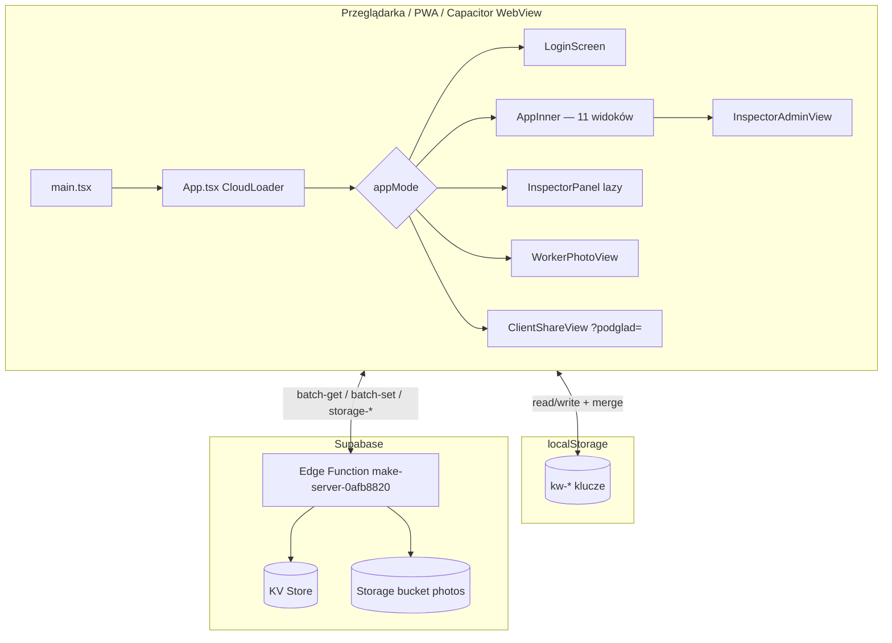

# W&G DOM — przewodnik architektury (living document)

> **Dla kogo:** programista, agent AI, reviewer — kto ma zrozumieć system **bez czytania plik po pliku**.  
> **Produkcja:** https://wgdom.fun · **Repo:** https://github.com/dawidthai125/wgdom · branch `main`  
> **Aktualna wersja UI:** `CHANGELOG[0].version` w `src/app/App.tsx` (obecnie **2.45.0**)  
> **Ostatnia aktualizacja tego dokumentu:** 2026-05-30 (v2.45.0 — zarządzanie sekcją przetargów)

---

## ⚠️ Obowiązek utrzymania tego pliku

**Przy każdej zmianie funkcji, naprawie lub nowej funkcji** — równolegle z CHANGELOG i instrukcją — zaktualizuj **ten dokument**, jeśli dotyczy:

- nowego panelu, klucza danych, endpointu API, flow syncu
- zmiany deployu (Vercel / Supabase / PWA cache)
- nowej konwencji lub pułapki, o której warto pamiętać

**Kolejność pracy (obowiązkowa):**

1. Implementacja (+ chmura, jeśli dane trwałe)
2. Wpis w `CHANGELOG` (`App.tsx`)
3. Instrukcja `HelpView` / hinty nawigacji (jeśli widoczne dla użytkownika)
4. **Aktualizacja `docs/ARCHITECTURE.md`** (sekcja dotycząca zmiany + data na górze)
5. Krótkie podsumowanie po polsku

Reguła Cursor: `.cursor/rules/wgdom-development.mdc`

---

## 1. Szybki start (5 minut)

```bash
cd WGDOM1
npm install
cp .env.example .env   # jeśli istnieje; uzupełnij VITE_SUPABASE_*
npm run dev              # http://127.0.0.1:5173
npm run build            # produkcja → dist/
npm run test:mobile      # Playwright na wgdom.fun (domyślnie)
npm run audit:mobile     # statyczny audyt kodu mobile
```

**Deploy frontendu:** `git push origin main` → Vercel auto-deploy z GitHub.  
**Deploy backendu:** push zmian w `supabase/functions/**` → GitHub Action `Deploy Supabase Edge Functions`.

**Zmienne środowiskowe (Vite → frontend):**

| Zmienna | Gdzie ustawić | Opis |
|---------|---------------|------|
| `VITE_SUPABASE_PROJECT_ID` | `.env` / Vercel | ID projektu Supabase |
| `VITE_SUPABASE_ANON_KEY` | `.env` / Vercel | Klucz anon (publiczny) |
| `VITE_SUPABASE_FUNCTION_SLUG` | opcjonalnie | Domyślnie `make-server-0afb8820` |

Konfiguracja: `src/config/supabase.ts` → `isSupabaseConfigured()` — bez tych zmiennych sync nie działa (UI pokazuje błąd chmury).

---

## 2. Stos technologiczny

| Warstwa | Technologia |
|---------|-------------|
| UI | React 18, TypeScript, Vite 6 |
| Style | Tailwind CSS 4, `src/styles/mobile.css` |
| Komponenty UI | shadcn/Radix (`src/app/components/ui/`) |
| Routing | **Brak react-router** — nawigacja przez stan React w `App.tsx` |
| Dane lokalne | `localStorage` + merge timestampów |
| Chmura | Supabase Edge Function (Hono) + KV store + Storage |
| Hosting UI | Vercel (SPA, auto-deploy z `main`) |
| PWA | `public/sw.js`, `manifest.webmanifest` |
| Native | Capacitor (Android/iOS) — WebView → wgdom.fun |
| Testy E2E | Playwright (`e2e/`) |
| PDF | pdfmake (lazy load), docx (dynamic import) |

---

## 3. Architektura wysokiego poziomu



**Zasada:** aplikacja to **offline-first SPA**. Prawda biznesowa = merge(localStorage, stan React, chmura) z regułami timestampów i tombstone'ów.

---

## 4. Bootstrap aplikacji

| Plik | Rola |
|------|------|
| `index.html` | Viewport, PWA meta, CSS anty-zoom iOS, desktop overflow |
| `src/main.tsx` | React root, SW, Capacitor shell, klawiatura mobile, viewport desktop, deep linki |
| `src/app/App.tsx` | **Monolit** — auth, admin, worker, changelog, cloud loader |
| `src/styles/index.css` | Import fontów, tailwind, theme, **mobile.css** |

**Łańcuch renderowania:**

```
main.tsx → App (default export) → CloudLoader → AppInnerWithAuth
```

- `CloudLoader` — przy starcie: fetch chmury, merge wszystkich `DATA_KEYS`, zapis localStorage, ewentualny push bogatszej wersji. Timeout 5 s → UI i tak się pokaże.
- `AppInnerWithAuth` — wybór trybu po `sessionStorage` / query `?podglad=`.

---

## 5. Tryby aplikacji (auth / routing)

Nawigacja **nie używa URL** (poza `?podglad=` i deep linkami). Stan w React + `sessionStorage`.

| `appMode` | Komponent | Wejście |
|-----------|-----------|---------|
| `login` | `LoginScreen` | Domyślny |
| `admin` | `AppInner` + `AdminAccessContext` | Panel administracyjny, rola ≠ inspector |
| `inspector` | `InspectorPanel` (**lazy**) | Przycisk Inspektor, rola `inspector` |
| `worker` | `WorkerPhotoView` | Pracownik — telefon + PIN 4 cyfry |

**Session storage:**

| Klucz | Znaczenie |
|-------|-----------|
| `wg-session-mode` | `admin` \| `inspector` \| `worker` |
| `wg-worker-name`, `wg-worker-id` | Sesja pracownika |
| `wg-inspector-visit-recorded` | Jednorazowy event wizyty inspektora |

**Role admina** (`src/lib/admin-auth.ts`): `super_admin` | `admin` | `moderator` | `inspector`  
- `adminCanViewRates()` — moderator **nie widzi** stawek PLN/h.  
- Super Admin (⚙): użytkownicy, hasła, restore backupów chmurowych.

---

## 6. Panel administracyjny (`AppInner`)

### 6.1 Widoki (`View` union)

| `view` | Opis | Główna funkcja w App.tsx |
|--------|------|--------------------------|
| `dashboard` | Pulpit, alerty „Uwaga dziś” | `DashboardView` |
| `payroll` | Lista płac | `PayrollView` |
| `schedule` | Grafik tygodnia | `ScheduleView` |
| `directory` | Kartoteka pracowników | `DirectoryView` |
| `contacts` | Kontakty e-mail | `ContactsView` |
| `archive` | Archiwum tygodni | `ArchiveView` |
| `jobs` | Roboty (pełny CRUD) | `JobsView` |
| `inspector` | Oś czasu inspektora (admin) | `InspectorAdminView` |
| `photos` | Galeria zdjęć | `JobPhotosGalleryView` |
| `jobfiles` | Pliki robót | `JobAllFilesView` / browser |
| `guide` | Instrukcja + Changelog | `HelpView`, `ChangelogView` |
| `tenders` | Przetargi BZP (pipeline) | `TendersView` — Super Admin zawsze; admin/moderator gdy `tendersTabForStaffEnabled` |

Widoki nieaktywne są **odmontowywane** (`{view==="jobs"&&<JobsView/>}`) — scroll wewnątrz każdego widoku.

### 6.2 Mobile admin

- Dolna nawigacja (`md:hidden`) — 4 skróty + Menu
- Shell: `.admin-app-shell` → `height: 100dvh` (mobile), `var(--app-height)` (desktop ≥768px)
- `src/lib/app-viewport.ts` — **tylko desktop** — synchronizuje `--app-height` z `visualViewport` (Chrome, pasek zakładek)
- Pull-to-refresh: **brak** — sync przez chmurę + wskaźnik statusu

### 6.3 Sync admina

| Mechanizm | Opis |
|-----------|------|
| `useLocalStorage` | Hook w `App.tsx` — zapis do LS + `applyWriteTimestamps` + listener `storage` (cross-tab) |
| Auto-push | `useEffect` na 7 slice'ach stanu → debounce **2 s** → `runCloudSync()` |
| Pull on focus | `pullFromCloudAndMerge()` — visibility, focus, native resume |
| Pełny push | `pushAllDataToCloudSafe` → `computeMergedDataBundle` → merge z LS przed chmurą |
| Ochrona race | `pullInFlightRef`, `suppressAutoSyncUntilRef` (~4,5 s po pull), anulowanie timera push przy pull |

**Bundle admina:** `adminDataBundle()` = kolejność `DATA_KEYS`.

---

## 7. Panel inspektora (pole)

**Plik:** `src/app/InspectorPanel.tsx` (**lazy-loaded** od v2.35.15)

| Zakładka | Opis |
|----------|------|
| `dashboard` | Pulpit WM, alerty, kółka zlec/kosz |
| `jobs` | Lista robót + szczegóły (WM, docs, pliki, zdjęcia, raporty) |
| `gallery` | Galeria zdjęć ekip |
| `files` | Przeglądarka plików + ZIP |
| `portfolio` | Portfolio WM |

**Sync inspektora:**

- Własny `useState` dla `jobs` + `directory` (nie `useLocalStorage`)
- `persistJobs()` → LS + `pushKeysToCloudSafe(["kw-jobs"])`
- `refreshFromCloud()` — mount, focus, visibility, co **120 s**, pull-to-refresh
- **Storage listener** (v2.35.15) — natychmiastowa sync z adminem w innej karcie (`kw-jobs`, `kw-directory`)
- `pushKeysToCloudSafe` — merge z **localStorage przed chmurą** (v2.35.15)

Inspektor **nie** syncuje payroll / archive / contacts — celowo.

---

## 8. Panel inspektora (zakładka admina)

**Plik:** `src/app/InspectorAdminView.tsx`  
- Feed aktywności z `job-activity.ts`  
- Statystyki logowań — `syncInspectorStatsFromCloud()` + refresh on focus (v2.35.15)  
- Szczegóły roboty: `InspectorAdminJobDetail.tsx`  
- Zmiany jobów przez `setJobs` z admina → dziedziczy auto-sync 2 s

---

## 9. Panel pracownika

**Plik:** `WorkerPhotoView` w `App.tsx` (~linia 13300+)

- Logowanie: 9 cyfr telefonu + PIN 4 cyfry (`workerPinHash` w kartotece)
- Zakładki: Roboty, Grafik, Wypłata
- Sync: `pushKeysToCloudSafe` dla `kw-jobs`, `kw-week-employees`
- Pull: `reloadWorkerData()` — focus, visibility, PTR, native resume
- **v2.35.15:** po pull zapisuje payroll/archive/week range do localStorage
- Kolejka zdjęć offline: `src/lib/photo-queue.ts`
- Privacy shield przy blur karty: `privacy-shield.ts`

---

## 10. Model danych

### 10.1 Klucze biznesowe (`DATA_KEYS` w `cloud-sync.ts`)

| Klucz | Zawartość | Kto R/W |
|-------|-----------|---------|
| `kw-directory` | Kartoteka pracowników | Admin, worker (login), inspector (read) |
| `kw-week-employees` | Lista płac — bieżący tydzień | Admin, worker (edit) |
| `kw-archive` | Zapisane tygodnie (snapshots) | Admin |
| `kw-weekFrom` / `kw-weekTo` | Zakres dat tygodnia płac (Pn–So; niedziela = wciąż ten sam tydzień) | Admin |

**Tydzień płacowy (v2.45.1):** zakres Pn–So. W **niedzielę** aplikacja nadal pokazuje tydzień, który skończył się wczoraj (sobotę) — żeby w sobotę 16–17 można było wypłacać i oznaczać „Rozliczony”. Auto-archiwum i email backup: **niedziela**, tylko gdy wszyscy rozliczeni. Alert spójności lista płac ↔ roboty nie pokazuje się przy pustej liście na nowy tydzień.
| `kw-jobs` | Roboty (zdjęcia, pliki, WM, activity…) | Wszyscy |
| `kw-contacts` | Kontakty e-mail | Admin |

**Nowy typ danych → MUSISZ:** dodać do `DATA_KEYS`, hook stanu w adminie, merge w `mergeDataKey`, push/pull paths.

### 10.2 Tombstones (usunięcia nie wracają z chmury)

| Klucz | Dotyczy |
|-------|---------|
| `kw-jobs-deleted-ids` | Usunięte roboty |
| `kw-directory-deleted-ids` | Usunięci pracownicy |
| `kw-contacts-deleted-ids` | Usunięte kontakty |
| `kw-archive-deleted-ids` | Usunięte tygodnie archiwum |

### 10.3 Klucze konfiguracyjne (chmura przez `persistKey`)

| Klucz | Zawartość |
|-------|-----------|
| `kw-admin-passwords` | Hash hasła per userId |
| `kw-admin-users-config` | Role, custom users, telefony |
| `kw-app-settings` | Np. `athPreviewEnabled`, `tendersTabForStaffEnabled` |
| `kw-inspector-stats` | Logowania / wizyty inspektorów |
| `kw-tenders-pipeline` | Pipeline przetargów BZP (status, notatki) — Super Admin |

### 10.4 Tylko lokalne (bez chmury)

`kw-local-snapshot-bundle`, `kw-jobs-last-good`, `wg-payroll-list-mode`, flagi UI, `sessionStorage`.

---

## 11. Sync i merge (`src/lib/cloud-sync.ts`)

**Serce systemu.** Przed edycją syncu — przeczytaj ten plik.

### 11.1 Główne funkcje

| Funkcja | Kiedy używać |
|---------|--------------|
| `fetchKeysFromCloud(keys)` | Odczyt batch z API |
| `pushKeysToCloud(keys, values)` | Surowy zapis (CloudLoader bootstrap) |
| `pushKeysToCloudSafe(keys, values)` | Push z merge LS + chmura — **inspektor, worker, pojedyncze klucze** |
| `pushAllDataToCloudSafe(bundle)` | Pełny push admina — 7 kluczy + tombstones |
| `pullAndMergeDataBundle(bundle)` | Pull bez zapisu — odświeżenie UI admina |
| `computeMergedDataBundle(bundle)` | Fetch + merge — używane przez push i pull |
| `prepareDataBundleForCloudPush` | Admin: merge React z LS przed chmurą |
| `prepareKeysForCloudPush` | Partial keys: merge LS przed chmurą (v2.35.15) |
| `mergeDataKey` / `mergeJobsById` | Logika per-typ |
| `mergeWeekEmployeeRecord` | Stawka, dni, **settled** — osobne timestampy |
| `persistKey(key, value)` | LS + opcjonalny cloud (settings, stats) |

### 11.2 Zasady merge (skrót)

- **Jobs:** per `id`, winner po `updatedAt` + merge pól (documents, photos, activity…)
- **Week employees:** per `id`; `rateUpdatedAt`, `dataUpdatedAt`, `settledUpdatedAt` osobno
- **Directory:** lokalna lista decyduje o składzie; pola scalane per id
- **Archive:** lokalna lista + merge `weekEmployees` wewnątrz tygodnia
- **Remis timestampów:** preferencja **chmury** (v2.35.14+)
- **Po pull admina:** `suppressAutoSyncUntilRef` — nie pushuj od razu pętlą

### 11.3 Pułapki syncu (NIE psuj)

1. **Nigdy** nie zapisuj trwałych danych tylko w React state bez LS/chmury.
2. Partial push (`pushKeysToCloudSafe`) **musi** iść przez `prepareKeysForCloudPush` — inaczej nadpiszesz edycje admina z innej karty.
3. Inspektor w tej samej karcie co admin — używaj storage events; między urządzeniami — timestamp merge.
4. Usuwanie roboty → `addDeletedJobId` + `pushJobsAfterDelete`.
5. Usuwanie z kartoteki → `pushDirectoryToCloud` (natychmiast).

---

## 12. Supabase — backend

**Funkcja:** `supabase/functions/make-server-0afb8820/index.tsx`  
**Project ref:** `kchwyjlnkdlymwvsnfiu` (w workflow deploy)  
**Klient API:** `API_BASE` = `https://{PROJECT_ID}.supabase.co/functions/v1/{slug}`  
**Auth nagłówków:** `Authorization: Bearer {VITE_SUPABASE_ANON_KEY}`

### 12.1 Endpointy (prefiks `/make-server-0afb8820/`)

| Metoda | Ścieżka | Opis |
|--------|---------|------|
| GET | `/health` | Healthcheck |
| POST | `/batch-get` | `{ keys: string[] }` → `{ values: unknown[] }` |
| POST | `/batch-set` | `{ keys, values }` — z ochroną przed shrink jobs/directory |
| POST | `/batch-del` | Usuwanie kluczy KV |
| GET | `/jobs-backup-status` | Status backupów robót |
| POST | `/restore-jobs-backup` | Przywrócenie robót |
| GET | `/payroll-backup-status` | Backup listy płac |
| POST | `/restore-payroll-backup` | Przywrócenie płac |
| GET | `/data-backup-status` | Pełny backup danych |
| POST | `/restore-data-backup` | Przywrócenie bundle |
| POST | `/storage-upload-url` | Signed URL upload |
| POST | `/storage-upload` | Upload pliku (zdjęcia, PDF, ATH…) |
| POST | `/storage-delete` | Usunięcie z bucket |
| POST | `/kosztorys-preview` | Podgląd kosztorysu ATH |
| POST | `/send-backup-email` | Mail backup |
| POST | `/send-job-email` | Mail roboty |
| POST | `/send-payroll-email` | Mail listy płac |
| POST | `/send-job-files-email` | Mail plików |
| GET | `/client-share` | Token podglądu klienta `?podglad=` |
| GET/POST | `/sms-*` | SMS bulk, nadawcy, historia |
| GET | `/tenders-bzp-search` | Proxy BZP — `?days=30&pages=4&province=PL02`, filtr remont/modernizacja |
| GET | `/tenders-bzp-notice` | HTML ogłoszenia BZP — `?noticeNumber=` |
| GET | `/tenders-bzp-documents` | Skan załączników e-Zamówienia — `?tenderId=` (HEAD probe 1–25) |
| GET | `/tenders-bzp-analyze-swz` | Analiza SWZ z HTML/PDF — `?noticeNumber=` lub `?tenderId=&documentIndex=` |
| GET | `/tenders-bzp-document-bytes` | Pobranie załącznika BZP jako base64 |
| POST | `/tenders-bzp-upload` | Upload SWZ/kosztorysu do storage `tenders/{id}/` |
| POST | `/tenders-bzp-attach-to-job` | Kopiowanie plików przetargu → roboty |
| POST | `/tenders-external-discover` | **v2.44** — linki z ogłoszenia + crawl BIP/portali → pobranie plików do storage |

**Storage bucket:** `make-0afb8820-photos` (public, auto-create)

### 12.1.1 Przetargi BZP (pipeline v2.37 → v2.44)

**Klucz chmury:** `kw-tenders-pipeline` — tablica `TenderPipelineItem[]`.

**Dostęp:** Super Admin zawsze; Administrator i Moderator — gdy `tendersTabForStaffEnabled` w `kw-app-settings`.

#### Pliki — lista / sync

| Plik | Rola |
|------|------|
| `src/lib/tenders-bzp.ts` | Typy pipeline, scoring, merge, API klienta (BZP, dokumenty, upload) |
| `src/lib/tenders-bzp-keywords.ts` | Słowa kluczowe scoringu (sync z Edge) |
| `src/lib/tenders-bzp-learn.ts` | Uczenie słów z przetargów „interesuje nas” |
| `src/app/TendersView.tsx` | UI listy, filtry, lejek pipeline, profil firmy (sticky header) |

#### Pliki — szczegóły przetargu (po rozwinięciu)

| Plik | Rola |
|------|------|
| `src/app/TenderDetailPanel.tsx` | Auto-analiza przy expand: HTML → SWZ → załączniki BZP → **external discover** → dossier |
| `src/app/TenderDossierPanel.tsx` | Karta przetargu (brief, kosztorys, przedmiar) |
| `src/app/TenderAttachmentsPanel.tsx` | Załączniki e-Zamówienia + podgląd ZIP/PDF/ATH |
| `src/app/TenderExternalDocsPanel.tsx` | **v2.44** — dokumenty u zamawiającego (BIP, linki z ogłoszenia) |
| `src/app/TenderFitPanel.tsx` | Dopasowanie profilu, wymagania vs firma, szacunek szans % |
| `src/app/TenderBidProposalPanel.tsx` | Propozycja ceny ofertowej (kalkulator) |
| `src/app/TenderCompanyProfilePanel.tsx` | Profil firmy + model kosztów (schema v5) |
| `src/lib/tender-document-resolver.ts` | Parsowanie najlepszego załącznika BZP + **`parseExternalTenderDocuments`** |
| `src/lib/tenders-bzp-doc-parse.ts` | PDF (pdf.js), DOCX, XLSX, ZIP → kosztorys / tekst SWZ |
| `src/lib/tenders-bzp-swz.ts` | Analiza SWZ (wartość, wadium, opłacalność) |
| `src/lib/tenders-bzp-fit.ts` | Dopasowanie przetarg ↔ profil, `estimatedValuePlnFromItem` |
| `src/lib/tenders-bzp-brief.ts` | Brief z HTML ogłoszenia |
| `src/lib/tenders-bzp-company.ts` | Profil firmy W&G DOM, `TenderCompanyCostModel` (schema **v5**) |
| `src/lib/tenders-bid-calculator.ts` | Kalkulator oferty — robocizna + materiały + Kp + stałe + marża |
| `src/lib/company-labor-cost.ts` | **v2.43** — model z listy płac (13 os., ~28,6 zł/h) + koszty poboczne tygodniowe |
| `src/lib/tender-external-docs.ts` | **v2.44** — wyciąganie linków z HTML, portale BIP, klient API discover |
| `src/lib/wheel-scroll-forward.ts` | **v2.43.1** — scroll kółkiem z nagłówków flex (Przetargi, Grafik…) |

#### Flow auto-analizy (`TenderDetailPanel`, raz na `item.id`)

1. Pobierz HTML ogłoszenia (`/tenders-bzp-notice`) + listę załączników BZP.
2. Analiza SWZ z HTML (`/tenders-bzp-analyze-swz`).
3. Parsuj najlepsze załączniki (`parseBestTenderDocuments`) → kosztorys ATH / SWZ z PDF.
4. Zbuduj `tenderDossier` (brief + kosztorys).
5. **Jeśli brak kosztorysu lub wartości SWZ** → `POST /tenders-external-discover`:
   - linki z ogłoszenia (BIP, platformy, pliki),
   - crawl portali wrocławskich (WM, MOPS, MPWiK…),
   - pobranie plików do `tenders/{tenderId}/external/`,
   - klient: `parseExternalTenderDocuments` → ten sam parser co BZP.
6. Przelicz `tenderFit` (`assessTenderFit`) + opcjonalnie `computeTenderBidProposal`.

#### Pola `TenderPipelineItem` (ważne od v2.38+)

| Pole | Opis |
|------|------|
| `bzpDocuments` | Załączniki z e-Zamówienia (po skanie) |
| `noticeHtml` | Cache HTML ogłoszenia |
| `swzAnalysis` | Wartość, wadium, opłacalność, wymagania |
| `tenderDossier` | `{ brief, kosztorys, builtAt }` |
| `tenderFit` | Dopasowanie + szacunek szans % |
| `ourEstimatePln` | Ręczny / auto szacunek brutto |
| `externalDocDiscovery` | **v2.44** `{ pageLinks, files[], status, builtAt }` |
| `linkedJobId` | Powiązana robota po wygranej |

#### Model kosztów ofertowych (v2.43)

- Domyślnie z **listy płac**: 13 os., ~28,62 zł/h, ZUS 23%, Kp 14%, zysk 8%.
- **Koszty poboczne tygodniowe** (bez materiałów): paliwo 3 aut, narzędzia, BHP, gruz, ubezp., koordynacja — edycja w Profil firmy.
- **Roboty:** `JobCostBreakdownPanel` — alokacja pobocznych na robotę z wpisów godzin.
- **Przetargi:** `TenderBidProposalPanel` — cena z kosztorysu ATH + model firmy.

#### Edge — przetargi

| Endpoint | Opis |
|----------|------|
| `GET /tenders-bzp-search` | Proxy BZP. Skan `PL02` + orgi WM, ZIK, ZIM, TBS, Gmina, MOPS (Wrocław) |
| `POST /tenders-external-discover` | Body: `{ tenderId, noticeHtml, organizationName, priorityBuyerId, title, bzpNumber }` → `{ discovery }` |

**Deploy Supabase wymagany** przy zmianie endpointów przetargowych (`index.tsx`).

**Walidacja (v2.44.1):** external discover nie nadpisuje dobrego kosztorysu BZP; fit/szanse działają też z wartością ATH; kalkulator — jedna marża (próg opłacalności); serwer blokuje `10.*` w URL crawl; bonus dopasowania pliku tylko gdy tytuł ma słowa kluczowe; profil firmy — clamp kosztów.

**Zarządzanie sekcją (v2.45):** klucze `kw-tenders-*` w `DATA_KEYS` (sync + backup); `src/lib/tenders-sync.ts` (merge, CSV, deleted ids); usuwanie / bulk / eksport CSV w `TendersView`; `TenderKeywordsPanel`; edycja referencji w profilu; ustawienia BZP w `AppSettings`; reset w Super Admin ⚙.

#### UX — scroll (v2.43.1)

- `TendersView`: jeden kontener scroll (profil firmy + lista).
- `useWheelScrollForward` na nagłówkach Grafik / Roboty / Instrukcja — kółko myszy przekierowuje do listy poniżej.

### 12.2 Deploy Supabase

- **Auto:** push na `main` gdy zmieni się `supabase/functions/**` → workflow `.github/workflows/deploy-supabase.yml`
- **Secret GitHub:** `SUPABASE_ACCESS_TOKEN`
- **Ręcznie:** `supabase functions deploy make-server-0afb8820 --project-ref kchwyjlnkdlymwvsnfiu`

**Kiedy deploy Supabase jest wymagany:** zmiana `index.tsx`, nowe endpointy, logika batch-set/shrink, storage, SMS, e-mail.

**Kiedy wystarczy Vercel:** prawie wszystkie zmiany w `src/`, style, PWA, merge po stronie klienta.

---

## 13. Vercel — frontend

- Połączenie: GitHub repo `dawidthai125/wgdom` → branch `main` → auto-deploy
- **Brak** `.vercel` w repo — projekt powiązany w dashboardzie Vercel
- Build: `npm run build` → output `dist/`
- **Env vars** (Production + Preview): `VITE_SUPABASE_PROJECT_ID`, `VITE_SUPABASE_ANON_KEY`
- Brak env → aplikacja działa offline-only ze starym LS, sync error w UI

**Po deployu PWA:** podbij wersję cache w `public/sw.js` (`wgdom-shell-vN`) — inaczej użytkownicy mają stary JS do hard refresh.

---

## 14. PWA i mobile

| Plik | Rola |
|------|------|
| `public/sw.js` | Shell cache (v20), network-first, `/assets/*`, fallback offline |
| `public/manifest.webmanifest` | standalone, ikony maskable |
| `public/offline.html` | Brak sieci |
| `src/lib/pwa-install.ts` | Rejestracja SW (**wyłączona** w Capacitor) |
| `src/styles/mobile.css` | 100dvh, touch 44px, input 16px, klawiatura |
| `src/lib/mobile-keyboard.ts` | `--keyboard-inset`, scroll do focus |
| `scripts/mobile-audit.mjs` | 36 statycznych checków |
| `e2e/mobile-smoke.spec.ts` | Smoke PWA |
| `e2e/mobile-flows.spec.ts` | Flow logowania admin/inspektor/pracownik |
| `e2e/desktop-smoke.spec.ts` | Desktop 1920×1080 |

**Capacitor:** `capacitor.config.ts` — domyślnie `server.url: https://wgdom.fun`. Szczegóły: `docs/MOBILE-NATIVE.md`.

**Bundle (v2.35.15):** lazy `panel-inspector`, chunk `ui-vendor`, główny admin ~608 KB (gzip ~149 KB).

---

## 15. Struktura katalogów

```
WGDOM1/
├── src/
│   ├── main.tsx                 # Entry
│   ├── app/
│   │   ├── App.tsx              # ★ Monolit admin + worker + login (~15k linii)
│   │   ├── InspectorPanel.tsx   # Inspektor terenowy
│   │   ├── InspectorAdminView.tsx
│   │   ├── InspectorDashboard.tsx
│   │   ├── TendersView.tsx, TenderDetailPanel.tsx, TenderExternalDocsPanel.tsx, …
│   │   ├── JobCostBreakdownPanel.tsx
│   │   └── components/ui/       # shadcn
│   ├── lib/                     # ★ Logika domenowa + sync
│   │   ├── cloud-sync.ts        # ★★ Sync — czytaj pierwszy przy danych
│   │   ├── tenders-bzp*.ts, tender-*.ts, company-labor-cost.ts  # Przetargi
│   │   ├── admin-auth.ts
│   │   ├── job-documents.ts, job-wm.ts, job-activity.ts
│   │   ├── photo-queue.ts, payroll-export.ts, …
│   │   └── …
│   ├── config/supabase.ts
│   └── styles/
├── supabase/functions/make-server-0afb8820/
│   ├── index.tsx                # ★ Backend API
│   └── kv_store.tsx
├── public/                      # PWA, SW, ikony
├── e2e/                         # Playwright
├── docs/
│   ├── ARCHITECTURE.md          # ★ TEN PLIK
│   └── MOBILE-NATIVE.md
├── guidelines/ROZWOJ.md         # Skrót — odwołuje do ARCHITECTURE.md
├── android/, ios/               # Capacitor
└── .github/workflows/           # CI: mobile smoke, supabase deploy, APK
```

---

## 16. Biblioteki domenowe (`src/lib/`) — mapa

| Moduł | Odpowiedzialność |
|-------|------------------|
| `cloud-sync.ts` | Sync, merge, API, DATA_KEYS |
| `admin-auth.ts` | Logowanie, role, hash SHA-256, sesja |
| `job-documents.ts` | Typy dokumentów, jobFiles, toggle zlec/kosz, lock raportu |
| `job-wm.ts` | WM, odbiór, etapy, notatki inspektora/admina |
| `job-activity.ts` | Feed inspektora, typy zdarzeń |
| `job-list-status.ts` | Fazy robót, filtry, badge |
| `job-file-upload.ts` / `job-photo-upload.ts` | Upload → storage API |
| `job-files-browser.ts` | Katalog plików, ZIP |
| `photo-queue.ts` | Kolejka offline zdjęć (worker + inspector) |
| `payroll-export.ts` / `payroll-cycle.ts` | PDF/Word listy płac, cykle tygodni |
| `inspector-stats.ts` | Statystyki logowań inspektorów |
| `inspector-dashboard.ts` | Statystyki pulpitu inspektora |
| `email-contacts.ts` | Kontakty mailingowe |
| `deep-link.ts` | `wgdom://`, `?open=job`, custom events |
| `native-app-bridge.ts` | Przycisk Wstecz Android, resume |
| `capacitor-native.ts` | Status bar, splash, `isNativeApp()` |
| `local-data-backup.ts` / `jobs-safety.ts` | Snapshot przed pushem |
| `app-settings.ts` | Ustawienia globalne (ATH preview) |

---

## 17. Jak bezpiecznie rozbudować

### 17.1 Nowa funkcja w panelu admina

1. Znajdź widok w `App.tsx` (np. `JobsView`) lub wydziel komponent do `src/app/` jeśli duży.
2. Stan: `useLocalStorage` z kluczem z `DATA_KEYS` **albo** pole w istniejącym obiekcie (Job, WeekEmployee).
3. Przy zapisie: timestamp (`applyWriteTimestamps`) — auto przez hook.
4. Auto-sync admina zrobi resztę (debounce 2 s).
5. CHANGELOG + HelpView + **ARCHITECTURE.md**.

### 17.2 Nowe pole w robocie (`Job`)

1. Typ w `App.tsx` (interface `Job`) — docelowo wydzielić typy wspólne.
2. Merge w `mergeJobsById` / `job-wm` / `job-documents` jeśli wymaga specjalnej logiki.
3. Inspektor: `InspectorPanel` — upewnij się że `normalizeJob` obsługuje pole.
4. Test: edycja admin + inspektor + worker — brak cofki po refresh.

### 17.3 Nowy endpoint backend

1. Dodaj route w `supabase/.../index.tsx`.
2. Wołaj z `cloud-sync.ts` lub dedykowanego modułu lib.
3. Deploy Supabase (GitHub Action).
4. Dokumentuj endpoint w sekcji 12 tego pliku.

### 17.4 Zmiana UI mobile

1. Sprawdź `mobile.css` + `100dvh` + `safe-area-inset`.
2. Inputy na mobile ≥16px.
3. Touch min 44px (`touch-target` / `min-h-[44px]`).
4. Uruchom: `npm run audit:mobile` + `npm run test:mobile`.
5. **Playwright ≠ prawdziwy Safari** — krytyczne flow sprawdź na iPhone.

### 17.5 Wydajność

- **Nie** importuj pdfmake statycznie — użyj istniejących lazy loaderów.
- Duże widoki admina: rozważ `React.lazy` (wzór: `InspectorPanel`).
- `vite.config.ts` → `manualChunks` — nie psuj bez sprawdzenia rozmiaru buildu.
- Po zmianie bundla: podbij `sw.js` cache version.

---

## 18. Testy i CI

| Komenda | Co robi |
|---------|---------|
| `npm run build` | Typecheck + produkcyjny bundle |
| `npm run audit:mobile` | Statyczny audyt 36 reguł |
| `npm run test:mobile` | Playwright — domyślnie **https://wgdom.fun** |
| `PW_BASE_URL=http://127.0.0.1:4173 npm run test:mobile` | Testy na lokalnym preview |

**GitHub Actions:**

- `mobile-smoke.yml` — push na main → audit + e2e na produkcji
- `deploy-supabase.yml` — zmiany w `supabase/functions/**`
- `build-android-apk.yml` — APK debug artifact

---

## 19. Czego NIE commitować

- `_206_app.txt`, `_old_app.txt` — backupi App.tsx
- `restore-lista-plac-*.json` — kopie danych
- `supabase/.temp/` — CLI cache
- `icons/`, `music/` — duplikaty assetów (jeśli nie celowo)
- `.env` z sekretami — tylko Vercel / lokalnie

---

## 20. Deep linki i udostępnianie

| Wejście | Obsługa |
|---------|---------|
| `?podglad={token}` | `ClientShareView` — tylko odczyt via API |
| `?open=job&id=` | `deep-link.ts` → event → admin ustawia view |
| `wgdom://job/{id}` | Capacitor / Android intent — `native-app-bridge` |

---

## 21. Changelog i wersjonowanie

- Tablica `CHANGELOG` w `App.tsx` (~linia 9113)
- **Nowa wersja = nowy wpis na górze** (nie edytuj starych)
- Patch +0.0.1 typowo (np. 2.35.15)
- UI pokazuje `CHANGELOG[0].version` w menu Zmiany i badge

**Przy nowych funkcjach uzupełnij też:** `helpSections`, `navItems.hint`, `LabelWithHint` w formularzach.

---

## 22. Historia kluczowych wersji (skrót)

| Wersja | Temat |
|--------|-------|
| 2.44.0 | Przetargi — dokumenty z BIP/linków ogłoszenia, `tenders-external-discover` |
| 2.43.0 | Model kosztów z listy płac, kalkulator oferty, `JobCostBreakdownPanel` |
| 2.43.1 | Fix scroll — Przetargi, nagłówki flex, `wheel-scroll-forward` |
| 2.42.0 | Kalkulator ceny ofertowej przetargowej |
| 2.38–2.41 | Karta przetargu, podgląd BZP, profil firmy, dopasowanie, DOCX/XLSX |
| 2.35.15 | Sync LS przed push, storage inspektor, worker payroll LS, lazy inspector, SW v20 |
| 2.35.14 | Pull on focus admin, ochrona cofki, settledUpdatedAt |
| 2.35.13 | Fix sync statusu Rozliczony |
| 2.35.12 | Fix mobile scroll admin |
| 2.35.9 | Inspektor — kółka zlec/kosz na pulpicie |

Pełna historia → tablica `CHANGELOG` w `App.tsx`.

---

## 23. Kontakt z innymi dokumentami

| Plik | Kiedy czytać |
|------|--------------|
| **[`AGENTS.md`](../AGENTS.md)** | **Zawsze na start** — krótkie wejście dla AI |
| **docs/ARCHITECTURE.md** | Zawsze — pełny obraz (ten plik) |
| `guidelines/ROZWOJ.md` | Skrót reguł rozwoju |
| `docs/MOBILE-NATIVE.md` | Capacitor, APK, App Store |
| `.cursor/rules/wgdom-development.mdc` | Reguły dla agenta Cursor |
| `.cursor/rules/wgdom-stan-projektu.mdc` | Hasło „kontynuuj WGDOM” — skrót sesji |

---

## Dla agentów AI i nowych programistów

**→ [`AGENTS.md`](AGENTS.md)** — punkt wejścia (czytaj przed kodem)  
**→ [`docs/ARCHITECTURE.md`](docs/ARCHITECTURE.md)** — pełna architektura systemu

*Koniec dokumentu. Przy każdej istotnej zmianie w repo zaktualizuj sekcję, której dotyczy, oraz datę „Ostatnia aktualizacja” na górze.*
