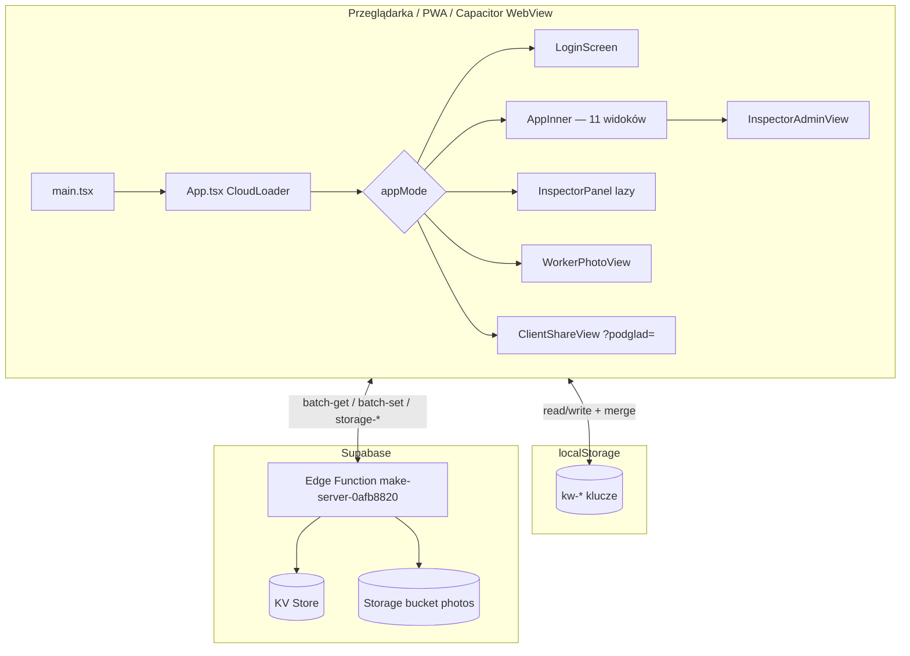

# W&G DOM — przewodnik architektury (living document)

> **Dla kogo:** programista, agent AI, reviewer — kto ma zrozumieć system **bez czytania plik po pliku**.  
> **Produkcja:** https://wgdom.fun · **Repo:** https://github.com/dawidthai125/wgdom · branch `main`  
> **Aktualna wersja UI:** `CHANGELOG[0].version` w [`src/app/changelog-data.ts`](../src/app/changelog-data.ts) (**2.45.40** · Sprint 20.2A Inspector UX)
> **Ostatnia aktualizacja tego dokumentu:** 2026-06-06 (Sprint 20.2A — Inspector UX Refresh; audyt: [`INSPECTOR-AUDIT-20.2A.md`](INSPECTOR-AUDIT-20.2A.md))

---

## ⚠️ Obowiązek utrzymania tego pliku

**Przy każdej zmianie funkcji, naprawie lub nowej funkcji** — równolegle z CHANGELOG i instrukcją — zaktualizuj **ten dokument**, jeśli dotyczy:

- nowego panelu, klucza danych, endpointu API, flow syncu
- zmiany deployu (Vercel / Supabase / PWA cache)
- nowej konwencji lub pułapki, o której warto pamiętać

**Kolejność pracy (obowiązkowa):**

1. Implementacja (+ chmura, jeśli dane trwałe)
2. Wpis w `CHANGELOG` (`changelog-data.ts`)
3. Instrukcja `HelpView` / hinty nawigacji (jeśli widoczne dla użytkownika)
4. **Aktualizacja `docs/ARCHITECTURE.md`** (sekcja dotycząca zmiany + data na górze)
5. Krótkie podsumowanie po polsku

Reguła Cursor: `.cursor/rules/wgdom-development.mdc`

---

## 1. Szybki start (5 minut)

**Wznowienie po przerwie (agent AI):** [`SESSION-HANDOFF-2026-06.md`](SESSION-HANDOFF-2026-06.md) → [`CURRENT-TASK.md`](../CURRENT-TASK.md) → ten dokument § 11 (sync) i § 12.1.4 (Faza 8–9).

```bash
cd WGDOM1
npm install
cp .env.example .env   # jeśli istnieje; uzupełnij VITE_SUPABASE_*
npm run dev              # http://127.0.0.1:5173
npm run build            # produkcja → dist/
npm run test:mobile      # Playwright na wgdom.fun (domyślnie)
npm run audit:mobile     # statyczny audyt kodu mobile
```

**Deploy frontendu:** `git push origin main` → Vercel auto-deploy z GitHub.  
**Deploy backendu:** push zmian w `supabase/functions/**` → GitHub Action `Deploy Supabase Edge Functions`.

**Zmienne środowiskowe (Vite → frontend):**

| Zmienna | Gdzie ustawić | Opis |
|---------|---------------|------|
| `VITE_SUPABASE_PROJECT_ID` | `.env` / Vercel | ID projektu Supabase |
| `VITE_SUPABASE_ANON_KEY` | `.env` / Vercel | Klucz anon (publiczny) |
| `VITE_SUPABASE_FUNCTION_SLUG` | opcjonalnie | Domyślnie `make-server-0afb8820` |

Konfiguracja: `src/config/supabase.ts` → `isSupabaseConfigured()` — bez tych zmiennych sync nie działa (UI pokazuje błąd chmury).

---

## 2. Stos technologiczny

| Warstwa | Technologia |
|---------|-------------|
| UI | React 18, TypeScript, Vite 6 |
| Style | Tailwind CSS 4, `src/styles/mobile.css` |
| Komponenty UI | shadcn/Radix (`src/app/components/ui/`) |
| Routing | **Brak react-router** — nawigacja przez stan React w `App.tsx` |
| Dane lokalne | `localStorage` + merge timestampów |
| Chmura | Supabase Edge Function (Hono) + KV store + Storage |
| Hosting UI | Vercel (SPA, auto-deploy z `main`) |
| PWA | `public/sw.js`, `manifest.webmanifest` |
| Native | Capacitor (Android/iOS) — WebView → wgdom.fun |
| Testy E2E | Playwright (`e2e/`) |
| PDF | pdfmake (lazy load), docx (dynamic import) |

---

## 3. Architektura wysokiego poziomu



**Zasada:** aplikacja to **offline-first SPA**. Prawda biznesowa = merge(localStorage, stan React, chmura) z regułami timestampów i tombstone'ów.

---

## 4. Bootstrap aplikacji

| Plik | Rola |
|------|------|
| `index.html` | Viewport, PWA meta, CSS anty-zoom iOS, desktop overflow |
| `src/main.tsx` | React root, SW, Capacitor shell, klawiatura mobile, viewport desktop, deep linki |
| `src/app/App.tsx` | **Monolit** — auth, admin, worker, changelog, cloud loader |
| `src/styles/index.css` | Import fontów, tailwind, theme, **mobile.css** |

**Łańcuch renderowania:**

```
main.tsx → App (default export) → CloudLoader → AppInnerWithAuth
```

- `CloudLoader` — przy starcie: **dwufazowy bootstrap** (§ 11.5): faza 1 CORE → `ready=true`; faza 2 DEFERRED w tle. Timeout 5 s → UI i tak się pokaże.
- `AppInnerWithAuth` — wybór trybu po `sessionStorage` / query `?podglad=`.

---

## 5. Tryby aplikacji (auth / routing)

Nawigacja **nie używa URL** (poza `?podglad=` i deep linkami). Stan w React + `sessionStorage`.

| `appMode` | Komponent | Wejście |
|-----------|-----------|---------|
| `login` | `LoginScreen` | Domyślny |
| `admin` | `AppInner` + `AdminAccessContext` | Panel administracyjny, rola ≠ inspector |
| `inspector` | `InspectorPanel` (**lazy**) | Przycisk Inspektor, rola `inspector` |
| `worker` | `WorkerPhotoView` | Pracownik — telefon + PIN 4 cyfry |

**Session storage:**

| Klucz | Znaczenie |
|-------|-----------|
| `wg-session-mode` | `admin` \| `inspector` \| `worker` |
| `wg-worker-name`, `wg-worker-id` | Sesja pracownika |
| `wg-inspector-visit-recorded` | Jednorazowy event wizyty inspektora |

**Role admina** (`src/lib/admin-auth.ts`): `super_admin` | `admin` | `moderator` | `inspector`  
- `adminCanViewRates()` — moderator **nie widzi** stawek PLN/h.  
- Super Admin (⚙): użytkownicy, hasła, restore backupów chmurowych.

---

## 6. Panel administracyjny (`AppInner`)

### 6.1 Widoki (`View` union)

| `view` | Opis | Główna funkcja w App.tsx |
|--------|------|--------------------------|
| `dashboard` | Pulpit: operacje (roboty, płace, WM) + **COMMAND CENTER executive** (7G) + „Uwaga dziś” | `DashboardView` |
| `payroll` | Lista płac | `PayrollView` |
| `schedule` | Grafik tygodnia | `ScheduleView` |
| `directory` | Kartoteka pracowników | `DirectoryView` |
| `contacts` | Kontakty e-mail | `ContactsView` |
| `archive` | Archiwum tygodni | `ArchiveView` |
| `jobs` | Roboty (pełny CRUD) | `JobsView` |
| `inspector` | Oś czasu inspektora (admin) | `InspectorAdminView` |
| `photos` | Galeria zdjęć (admin) — zaakceptowane zdjęcia ekipy; ZIP całej roboty / kategorii | `JobPhotosGalleryView` w `App.tsx` |
| `jobfiles` | Pliki robót | `JobAllFilesView` / browser |
| `guide` | Instrukcja + Changelog | `HelpView`, `ChangelogView` |
| `tenders` | Przetargi: **COMMAND CENTER AI** (`TenderCenterProView` / `OwnerDashboard`) lub widok klasyczny | Super Admin zawsze; admin/moderator gdy `tendersTabForStaffEnabled` |

Widoki nieaktywne są **odmontowywane** (`{view==="jobs"&&<JobsView/>}`) — scroll wewnątrz każdego widoku.

### 6.2 Mobile admin

- Dolna nawigacja (`md:hidden`) — 4 skróty + Menu
- Shell: `.admin-app-shell` → `height: 100dvh` (mobile), `var(--app-height)` (desktop ≥768px)
- `src/lib/app-viewport.ts` — **tylko desktop** — synchronizuje `--app-height` z `visualViewport` (Chrome, pasek zakładek)
- Pull-to-refresh: **brak** — sync przez chmurę + wskaźnik statusu

### 6.3 Sync admina

| Mechanizm | Opis |
|-----------|------|
| `useLocalStorage` | Hook w `App.tsx` — zapis do LS + `applyWriteTimestamps` + listener `storage` (cross-tab) |
| Auto-push | `useEffect` na 7 slice'ach stanu → debounce **2 s** → `runCloudSync()` |
| Pull on focus | `pullFromCloudAndMerge()` — visibility, focus, native resume |
| Pełny push | `pushAllDataToCloudSafe` → `computeMergedDataBundle` → merge z LS przed chmurą |
| Ochrona race | `pullInFlightRef`, `suppressAutoSyncUntilRef` (~4,5 s po pull), anulowanie timera push przy pull |

**Bundle admina:** `adminDataBundle()` = kolejność `DATA_KEYS`.

---

## 7. Panel inspektora (pole)

**Plik:** `src/app/InspectorPanel.tsx` (**lazy-loaded** od v2.35.15)

| Zakładka | Opis |
|----------|------|
| `dashboard` | Pulpit WM — KPI, „Dzisiaj”, Action Center (max 3), tygodniowe statystyki |
| `jobs` | Lista robót (karty + postęp %) + szczegóły sekcjami (WM, docs, pliki, zdjęcia, raporty) |
| `gallery` | Galeria zdjęć ekip |
| `files` | Przeglądarka plików + ZIP |
| `portfolio` | Portfolio WM |

**Sprint 20.2A (v2.45.40) — bez nowych KV, bez zmian `mergeJobsById`:**

| Element | Plik | Opis |
|---------|------|------|
| Postęp kontroli | `inspector-dashboard.ts` | `computeInspectionProgress()` — **20.2A.1:** documents 50% + stage 25% + photos 15% + notes 10% (bez `filesPct`; zlecenie/kosztorys tylko w REQUIRED_DOCS) |
| KPI / Action Center | `InspectorDashboard.tsx` | `computeInspectorKpiStats`, `buildActionCenterItems`, `buildTodayJobs` |
| Karty | `InspectorJobCard.tsx` | Postęp %, brakujące do odbioru, ostatnia aktywność, 🔴🟠🟢 |
| Checklist grupy | `InspectorDocChecklist.tsx` | Dokumentacja / Pomiary / Zdjęcia + licznik `n/8` |
| FAB zdjęcie | `InspectorQuickPhotoFab.tsx` | Aparat + wybór roboty → `uploadInspectorPhoto` / `photo-queue` |

Smoke: `npx vite-node scripts/smoke-test-inspector-20.2a.mjs`

**Sync inspektora:**

- Własny `useState` dla `jobs` + `directory` (nie `useLocalStorage`)
- `persistJobs()` → LS + `pushKeysToCloudSafe(["kw-jobs"])`
- `refreshFromCloud()` — mount, focus, visibility, co **120 s**, pull-to-refresh
- **Storage listener** (v2.35.15) — natychmiastowa sync z adminem w innej karcie (`kw-jobs`, `kw-directory`)
- `pushKeysToCloudSafe` — merge z **localStorage przed chmurą** (v2.35.15)

Inspektor **nie** syncuje payroll / archive / contacts — celowo.

---

## 8. Panel inspektora (zakładka admina)

**Plik:** `src/app/InspectorAdminView.tsx`  
- Feed aktywności z `job-activity.ts`  
- Statystyki logowań — `syncInspectorStatsFromCloud()` + refresh on focus (v2.35.15)  
- Szczegóły roboty: `InspectorAdminJobDetail.tsx`  
- Zmiany jobów przez `setJobs` z admina → dziedziczy auto-sync 2 s

---

## 9. Panel pracownika

**Plik:** `WorkerPhotoView` w `App.tsx` (~linia 13300+)

- Logowanie: 9 cyfr telefonu + PIN 4 cyfry (`workerPinHash` w kartotece)
- Zakładki: Roboty, Grafik, Wypłata
- Sync: `pushKeysToCloudSafe` dla `kw-jobs`, `kw-week-employees`
- Pull: `reloadWorkerData()` — focus, visibility, PTR, native resume
- **v2.35.15:** po pull zapisuje payroll/archive/week range do localStorage
- Kolejka zdjęć offline: `src/lib/photo-queue.ts`
- Privacy shield przy blur karty: `privacy-shield.ts`

---

## 10. Model danych

### 10.1 Klucze biznesowe (`DATA_KEYS` w `cloud-sync.ts`)

| Klucz | Zawartość | Kto R/W |
|-------|-----------|---------|
| `kw-directory` | Kartoteka pracowników | Admin, worker (login), inspector (read) |
| `kw-week-employees` | Lista płac — bieżący tydzień | Admin, worker (edit) |
| `kw-archive` | Zapisane tygodnie (snapshots) | Admin |
| `kw-weekFrom` / `kw-weekTo` | Zakres dat tygodnia płac (Pn–So; niedziela = wciąż ten sam tydzień) | Admin |

**Tydzień płacowy (v2.45.14):** zakres Pn–So. **Nd przed 20:00** — domykany tydzień (wypłaty w sobotę). **Nd od 20:00** — w panelu admina startuje **nadchodzący** tydzień (archiwum + pusta lista, gdy wszyscy rozliczeni). **Pn+** — to samo przy pierwszym wejściu, jeśli tydzień w tyle. Auto-archiwum + email backup: niedziela. Alert spójności nie pokazuje się przy pustej liście na nowy tydzień.
| `kw-jobs` | Roboty (zdjęcia, pliki, WM, activity…) | Wszyscy |
| `kw-contacts` | Kontakty e-mail | Admin |
| `kw-employee-leaves` | Nieobecności pracowników (urlop / L4 / bezpłatny, tygodnie Pn–So) | Admin |

**Nieobecności (Sprint 20.0A, v2.45.37, prod `778f616`):**

| Aspekt | Opis |
|--------|------|
| **Model** | Tablica `EmployeeLeave[]` w `kw-employee-leaves` — typy: urlop / L4 / bezpłatny; zakres tygodni Pn–So |
| **UI** | `EmployeeLeavesSection.tsx` w kartotece — CRUD; walidacja overlap + blokada tygodni w archiwum |
| **Payroll leave overlay** | `payroll-leave-overlay.ts` — na **live** liście płac: `netPay`/`grossPay`=0, **godziny bez zmian**; etykiety 🏖 URLOP / 🤒 CHOROBOWE / 🚫 BEZPŁATNY |
| **Biweekly** | `calcBiweeklyWeekNetWithLeave` — cash split i payout zerowane w tygodniu urlopu |
| **Archive snapshot freeze** | Przy `buildWeekSnapshot` zamrażany `leaveStatus` w `EmployeeSnapshot`; archiwalna lista płac i PDF/DOCX **tylko ze snapshotu** — bez live lookup urlopów dodanych później |
| **Eksport** | `payroll-export.ts` — `payrollNetDisplayText()` → „URLOP” / status zamiast kwoty net |
| **Sync** | `mergeEmployeeLeaves()` w `cloud-sync.ts`; push przez `pushEmployeeLeavesToCloud()` |
| **Edge** | Walidacja payloadu + overlap w `batch-set`; filtrowanie ID z tombstone list |

Pliki: `src/lib/employee-leaves.ts`, `src/lib/payroll-leave-overlay.ts`, `src/app/EmployeeLeavesSection.tsx`, `src/app/PayrollView.tsx`.

**Odroczenie wypłaty (Sprint 20.1A, v2.45.38, prod `f24fafe` — CLOSED):**

| Aspekt | Opis |
|--------|------|
| **Model danych** | Pole opcjonalne `payrollCarryForward` na `WeekEmployee` w `kw-week-employees` — `{ amount, targetWeekFrom, targetWeekTo, createdAt }`. **Bez nowego klucza KV / Edge deploy.** |
| **UI** | Lista płac (`PayrollView`) + panel pracownika (`WeekEmployeeDetail`) — przycisk ⏭ „Przenieś na następny tydzień” (jednorazowo, **weekly only**). |
| **MODEL A (frozen amount)** | Kwota `amount` **zamrożona** w momencie kliknięcia — **nie** przelicza się po zmianie godzin/stawki w tygodniu źródłowym. |
| **Tydzień źródłowy (carry out)** | `displayNetPay=0`, etykieta **PRZENIESIONO**; `carryForwardOut` w snapshot. |
| **Tydzień docelowy (carry in)** | `displayNet = baseNet + carryForwardIn` (tylko jeden tydzień docelowy). |
| **Priorytet overlay** | urlop → carry out → carry in → biweekly |
| **Biweekly V1 (blocked)** | Wypłata co 2 tygodnie — **zablokowana** (`canDeferPayroll` → `biweekly_blocked`). Urlop blokuje przeniesienie. |
| **Archive snapshot freeze** | Przy `buildWeekSnapshot(..., savedWeeksForCarry?)` zamrażane w `EmployeeSnapshot`: `carryForwardOut`, `carryForwardTargetFrom/To`, `carryForwardIn`, `carryForwardFromWeek`. Archiwalna lista płac **tylko ze snapshotu** — historyczne kwoty niezmienne. |
| **Archive behavior** | `ArchiveView` renderuje zamrożone `carryForwardOut/In` z `EmployeeSnapshot`; brak live recalc z bieżących `WeekEmployee`. |
| **PDF/DOCX export** | `payroll-export.ts` — `payrollNetDisplayText()`: W1 „PRZENIESIONO”; W2 `4500,00 (+2250,00 przen.)` — tekst ze snapshotu archiwum. |
| **Sync** | `pickPayrollCarryForward()` w `mergeWeekEmployeeRecord` — merge nie gubi defer gdy chmura nie ma pola |
| **Double-click guard** | Drugie ⏭ → `already_deferred` (BLOCKED) |

Pliki: `src/lib/payroll-carry-forward.ts`, `src/lib/payroll-carry-snapshot.ts`, `src/app/PayrollView.tsx`, `src/app/WeekEmployeeDetail.tsx`, `src/app/app-domain.ts`, `src/lib/payroll-export.ts`, `src/app/ArchiveView.tsx`, `src/lib/cloud-sync.ts` (merge carry).

**Carry forward workflow (Sprint 20.1B, v2.45.39 — CLOSED):** rozdzielenie **saved** (backup) vs **closed** (historyczny).

| Aspekt | Opis |
|--------|------|
| **`isPayrollWeekSaved`** | `savedWeeks.some(weekFrom/weekTo)` — kopia zapasowa istnieje |
| **`isPayrollWeekClosed`** | `weekFrom/weekTo ≠ getPayrollWeekRange(now)` — tydzień po rolloverze lub nawigacja wstecz |
| **Defer ⏭** | Dozwolony gdy **nie** closed; zablokowany: `closed_week` (nie `archived_week`) |
| **Aktywny tydzień (saved lub nie)** | Lista płac + PDF/DOCX z **live** `weekEmployees`; urlopy z live overlay |
| **Tydzień historyczny (closed)** | Lista płac + PDF/DOCX ze **snapshotu**; defer zablokowany |
| **Snapshot refresh** | `refreshSavedActiveWeekSnapshot()` w `App.tsx` — po defer, toggle settled, edycji rosteru (tylko gdy saved + operacyjny) |
| **Banery UI** | Zapisany operacyjny: „kopia zapasowa”; historyczny: „podgląd ze snapshotu” |

Pliki 20.1B: `src/lib/payroll-cycle.ts`, `src/app/PayrollView.tsx`, `src/app/App.tsx`, `src/lib/payroll-leave-overlay.ts` (biweekly overlay tylko closed).

**Nowy typ danych → MUSISZ:** dodać do `DATA_KEYS`, hook stanu w adminie, merge w `mergeDataKey`, push/pull paths, tombstone przy DELETE.

### 10.2 Tombstones (usunięcia nie wracają z chmury)

| Klucz | Dotyczy |
|-------|---------|
| `kw-jobs-deleted-ids` | Usunięte roboty |
| `kw-directory-deleted-ids` | Usunięci pracownicy |
| `kw-contacts-deleted-ids` | Usunięte kontakty |
| `kw-archive-deleted-ids` | Usunięte tygodnie archiwum |
| `kw-employee-leaves-deleted-ids` | Usunięte nieobecności (Sprint 20.0A) — merge i Edge batch-set filtrują te ID |

### 10.3 Klucze konfiguracyjne (chmura przez `persistKey`)

| Klucz | Zawartość |
|-------|-----------|
| `kw-admin-passwords` | Hash hasła per userId |
| `kw-admin-users-config` | Role, custom users, telefony |
| `kw-app-settings` | Np. `athPreviewEnabled`, `tendersTabForStaffEnabled` |
| `kw-inspector-stats` | Logowania / wizyty inspektorów |
| `kw-tenders-pipeline` | Pipeline przetargów BZP (status, notatki) — Super Admin |

### 10.4 Tylko lokalne (bez chmury)

`kw-local-snapshot-bundle`, `kw-jobs-last-good`, `wg-payroll-list-mode`, flagi UI, `sessionStorage`.

---

## 11. Sync i merge (`src/lib/cloud-sync.ts`)

**Serce systemu.** Przed edycją syncu — przeczytaj ten plik.

### 11.1 Główne funkcje

| Funkcja | Kiedy używać |
|---------|--------------|
| `fetchKeysFromCloud(keys)` | Odczyt batch z API |
| `pushKeysToCloud(keys, values)` | Surowy zapis (CloudLoader bootstrap) |
| `pushKeysToCloudSafe(keys, values)` | Push z merge LS + chmura — **inspektor, worker, pojedyncze klucze** |
| `pushAllDataToCloudSafe(bundle)` | Pełny push admina — 7 kluczy + tombstones |
| `pullAndMergeDataBundle(bundle)` | Pull bez zapisu — odświeżenie UI admina |
| `computeMergedDataBundle(bundle)` | Fetch + merge — używane przez push i pull |
| `prepareDataBundleForCloudPush` | Admin: merge React z LS przed chmurą |
| `prepareKeysForCloudPush` | Partial keys: merge LS przed chmurą (v2.35.15) |
| `mergeDataKey` / `mergeJobsById` | Logika per-typ |
| `mergeWeekEmployeeRecord` | Stawka, dni, **settled** — osobne timestampy |
| `persistKey(key, value)` | LS + opcjonalny cloud (settings, stats) |

### 11.2 Zasady merge (skrót)

- **Jobs:** per `id`, winner po `updatedAt` + merge pól (documents, photos, activity…)
- **Week employees:** per `id`; `rateUpdatedAt`, `dataUpdatedAt`, `settledUpdatedAt` osobno
- **Edge `batch-set` (FIX A, 2026-06-03):** `mergeWeekEmployeeRecordByTimestamps` używa `pickSettledByTimestamps` / `isLikelySpuriousUnsettle` jak klient; `mergeWeekEmployeesUnion` zawsze scala rekordy (nie zastępuje całego wpisu po `weekEmployeeRichness`)
- **Directory:** lokalna lista decyduje o składzie; pola scalane per id
- **Archive:** lokalna lista + merge `weekEmployees` wewnątrz tygodnia
- **Employee leaves:** per `id`, winner po `updatedAt`; union z filtrem `kw-employee-leaves-deleted-ids` — usunięte wpisy **nie wracają** z chmury (Sprint 20.0A)
- **Remis timestampów:** preferencja **chmury** (v2.35.14+)
- **Po pull admina:** `suppressAutoSyncUntilRef` — nie pushuj od razu pętlą

### 11.3 Pułapki syncu (NIE psuj)

1. **Nigdy** nie zapisuj trwałych danych tylko w React state bez LS/chmury.
2. Partial push (`pushKeysToCloudSafe`) **musi** iść przez `prepareKeysForCloudPush` — inaczej nadpiszesz edycje admina z innej karty.
3. Inspektor w tej samej karcie co admin — używaj storage events; między urządzeniami — timestamp merge.
4. Usuwanie roboty → `addDeletedJobId` + `pushJobsAfterDelete`.
5. Usuwanie z kartoteki → `pushDirectoryToCloud` (natychmiast).
6. **Stale localStorage + bootstrap push** — stary LS może przywrócić usunięte klucze KV (admin passwords, martwe URL w jobs). Fix: P11/P15 w `CloudLoader`; po incydencie **hard refresh**. Szczegóły → [`INCIDENTS-2026-06.md`](INCIDENTS-2026-06.md).
7. **Logout nie uruchamia ponownie CloudLoader** — merge bootstrap tylko przy pierwszym mount strony.

### 11.4 Payroll Guard i bootstrap merge (P11, czerwiec 2026)

| Mechanizm | Plik | Rola |
|-----------|------|------|
| `wouldBlockPayrollShrink` | `cloud-sync.ts` | Blokuje push gdy `activeDays` lub `totalHours` spada >50% vs chmura |
| `applyPayrollGuardBeforePush` | `cloud-sync.ts` | Wywoływany przed batch-set payroll |
| `applyBootstrapPayrollMerge` | `CloudLoader.tsx` | Po fetch z chmury: jeśli chmura bogatsza niż lokal → preferuj chmurę (fix 0 h w UI) |
| `sanitizeWeekEmployeesForTargetRange` | `cloud-sync.ts` | Odrzuca rekordy spoza docelowego zakresu tygodnia |

Test: `npx vite-node scripts/test-p11-bootstrap-payroll.mjs`

### 11.5 Admin passwords (`kw-admin-passwords`, P15)

- Klucz KV: mapa `userId → SHA-256("wgdom-admin-account-v1:" + login + ":" + password)`.
- **Brak klucza** = hasło startowe z `BUILTIN_ADMIN_ACCOUNTS` (`admin-auth.ts`).
- **`mergeAdminPasswordOverrides(local, cloud)`** (P15): baza = klucze z chmury; lokal nadpisuje tylko wspólne klucze; klucze tylko w LS **nie wracają** do push.
- **`shouldPushAdminPasswordOverridesOnBootstrap`**: nie pushuj gdy `cloudKeys < localKeys` (chmura jest źródłem prawdy o składzie override).

Test: `npx vite-node scripts/test-p15-admin-password-merge.mjs`

**Nie mieszaj** z ogólnym `mergeDataKey` — admin passwords mają osobną logikę w `CloudLoader`, nie w `cloud-sync.ts`.

### 11.5 CloudLoader CORE / DEFERRED bootstrap (Performance 1.3A+, prod `a6cdb4a`)

**Cel:** szybsze `ready=true` — cięższe klucze przetargów i kontaktów pobierane **po** wejściu w UI (login / admin).

| Faza | Kiedy | Klucze | Plik |
|------|--------|--------|------|
| **CORE** | przed `setReady(true)` | `BOOTSTRAP_CORE_KEYS` (6) + tombstones + admin keys | `CloudLoader.tsx`, `cloud-sync.ts` |
| **DEFERRED** | `void` po `ready` | `BOOTSTRAP_DEFERRED_KEYS` (5) + tombstones (w tym `kw-employee-leaves-deleted-ids`) | `fetchAndMergeDeferredBootstrap()` |

**CORE:** `kw-directory`, `kw-week-employees`, `kw-archive`, `kw-weekFrom`, `kw-weekTo`, `kw-jobs`.

**DEFERRED:** `kw-tenders-pipeline`, `kw-tenders-company-profile`, `kw-tenders-custom-keywords`, `kw-contacts`, `kw-employee-leaves`.

Po zakończeniu fazy 2: event `wgdom-deferred-bootstrap` (`WGDOM_DEFERRED_BOOTSTRAP_EVENT`) → `CommandCenterContext` wywołuje `bumpProfileVersion()` (profil firmy w CC).

**Uwaga:** `useTendersPipeline` nadal może robić własny fetch pipeline przy mount CC — nie zakłada danych z fazy 1 CloudLoader.

**Dokumentacja sesji:** [`SESSION-HANDOFF-PERFORMANCE-2026-06.md`](SESSION-HANDOFF-PERFORMANCE-2026-06.md)

---

## 12. Supabase — backend

**Funkcja:** `supabase/functions/make-server-0afb8820/index.tsx`  
**Project ref:** `bdpygdvfgbggermvqtys` (w workflow deploy)  
**Klient API:** `API_BASE` = `https://{PROJECT_ID}.supabase.co/functions/v1/{slug}`  
**Auth nagłówków:** `Authorization: Bearer {VITE_SUPABASE_ANON_KEY}`

### 12.1 Endpointy (prefiks `/make-server-0afb8820/`)

| Metoda | Ścieżka | Opis |
|--------|---------|------|
| GET | `/health` | Healthcheck |
| POST | `/batch-get` | `{ keys: string[] }` → `{ values: unknown[] }` |
| POST | `/batch-set` | `{ keys, values }` — z ochroną przed shrink jobs/directory |
| POST | `/batch-del` | Usuwanie kluczy KV |
| GET | `/jobs-backup-status` | Status backupów robót |
| POST | `/restore-jobs-backup` | Przywrócenie robót |
| GET | `/payroll-backup-status` | Backup listy płac |
| POST | `/restore-payroll-backup` | Przywrócenie płac |
| GET | `/data-backup-status` | Pełny backup danych |
| POST | `/restore-data-backup` | Przywrócenie bundle |
| POST | `/storage-upload-url` | Signed URL upload |
| POST | `/storage-upload` | Upload pliku (zdjęcia, PDF, ATH…) |
| POST | `/storage-delete` | Usunięcie z bucket |
| POST | `/kosztorys-preview` | Podgląd kosztorysu ATH |
| POST | `/send-backup-email` | Mail backup |
| POST | `/send-job-email` | Mail roboty |
| POST | `/send-payroll-email` | Mail listy płac |
| POST | `/send-job-files-email` | Mail plików |
| GET | `/client-share` | Token podglądu klienta `?podglad=` |
| GET/POST | `/sms-*` | SMS bulk, nadawcy, historia |
| GET | `/tenders-bzp-search` | Proxy BZP — `?days=30&pages=4&province=PL02`, filtr remont/modernizacja |
| GET | `/tenders-bzp-notice` | HTML ogłoszenia BZP — `?noticeNumber=` |
| GET | `/tenders-bzp-documents` | Skan załączników e-Zamówienia — `?tenderId=` (HEAD probe 1–25) |
| GET | `/tenders-bzp-analyze-swz` | Analiza SWZ z HTML/PDF (serwer) — `?noticeNumber=` lub `?tenderId=&documentIndex=` |
| GET | `/tenders-bzp-award-result` | **v2.45.7** — wynik postępowania z BZP — `?bzpNumber=` / `?moIdentifier=` |
| GET | `/tenders-bzp-document-bytes` | Pobranie załącznika BZP jako base64 |
| POST | `/tenders-bzp-upload` | Upload SWZ/kosztorysu do storage `tenders/{id}/` |
| POST | `/tenders-bzp-attach-to-job` | Kopiowanie plików przetargu → roboty |
| POST | `/tenders-external-discover` | **v2.44** — linki z ogłoszenia + crawl BIP/portali → pobranie plików do storage |

**Storage bucket:** `make-0afb8820-photos` (public, auto-create)

### 12.1.1 Przetargi BZP (pipeline v2.37 → v2.45.12)

**Klucz chmury:** `kw-tenders-pipeline` — tablica `TenderPipelineItem[]` (+ `kw-tenders-company-profile`, `kw-tenders-custom-keywords`, `kw-tenders-deleted-ids`).

**Dostęp:** Super Admin zawsze; Administrator i Moderator — gdy `tendersTabForStaffEnabled` w `kw-app-settings`.

#### Pliki — lista / sync

| Plik | Rola |
|------|------|
| `src/lib/tenders-bzp.ts` | Typy pipeline, scoring, merge, API klienta, `patchOurEstimatePln`, dashboard stats |
| `src/lib/tenders-sync.ts` | Merge pipeline z chmurą, CSV, deleted ids |
| `src/lib/tenders-bzp-keywords.ts` | Słowa kluczowe scoringu (sync z Edge) |
| `src/lib/tenders-bzp-learn.ts` | Uczenie słów z przetargów „interesuje nas” |
| `src/lib/tenders-actions.ts` | **v2.45.8** — chipy „wymaga działania”, auto-wynik BZP, alerty pulpitu, .ics, porównanie cen |
| `src/lib/tenders-wadium.ts` | **v2.45.7** — wadium % wartości, limit profilu, blokada udziału |
| `src/lib/tenders-map-coords.ts` | Geolokacja heurystyczna Wrocław + siatka kafelków OSM |
| `src/app/TendersView.tsx` | UI listy, filtry, lejek, chipy akcji, mapa (zwijana) |
| `src/app/TendersMapPanel.tsx` | **v2.45.12** — mapa OSM (kafelki) Wrocław + markery + lista punktów |
| `src/app/TenderKeywordsPanel.tsx` | **v2.45.12** — własne słowa kluczowe + podgląd wbudowanego słownika |
| `src/app/TenderBidPrepPanel.tsx` | **v2.45.5+** — karta ofertowa (checklist, wadium, wynik BZP, pakiet PDF) |

#### Pliki — szczegóły przetargu (po rozwinięciu)

| Plik | Rola |
|------|------|
| `src/app/TenderDetailPanel.tsx` | Auto-analiza przy expand; **`analyzeTenderSwzEnhanced`** (pdf.js klient); historia szacunku |
| `src/app/TenderDossierPanel.tsx` | Karta przetargu (brief, kosztorys, przedmiar) |
| `src/app/TenderAttachmentsPanel.tsx` | Załączniki e-Zamówienia + podgląd ZIP/PDF/ATH |
| `src/app/TenderExternalDocsPanel.tsx` | **v2.44** — dokumenty u zamawiającego (BIP, linki z ogłoszenia) |
| `src/app/TenderFitPanel.tsx` | Dopasowanie profilu, wymagania vs firma, referencje z luką PLN |
| `src/app/TenderBidProposalPanel.tsx` | Propozycja ceny ofertowej (kalkulator) |
| `src/app/TenderCompanyProfilePanel.tsx` | Profil firmy + model kosztów (schema **v6**) |
| `src/lib/tender-document-resolver.ts` | Parsowanie najlepszego załącznika BZP + **`parseExternalTenderDocuments`** |
| `src/lib/tenders-bzp-analyze-local.ts` | **v2.45.7** — analiza SWZ po stronie klienta (pdf.js, kryteria, tabele) |
| `src/lib/tenders-bzp-award.ts` | **v2.45.7** — parser + fetch wyniku postępowania |
| `src/lib/tender-bid-package-pdf.ts` | **v2.45.7** — eksport „Pakiet wyceny” PDF (pdfmake) |
| `src/lib/tenders-bzp-doc-parse.ts` | PDF (pdf.js), DOCX, XLSX, ZIP → kosztorys / tekst SWZ |
| `src/lib/tenders-bzp-swz.ts` | Analiza SWZ (wartość, wadium, kryteria, tabele) |
| `src/lib/tenders-bzp-fit.ts` | Dopasowanie przetarg ↔ profil, `estimatedValuePlnFromItem` |
| `src/lib/tenders-bzp-brief.ts` | Brief z HTML ogłoszenia |
| `src/lib/tenders-bzp-company.ts` | Profil firmy W&G DOM, `TenderCompanyCostModel` (schema **v6**) |
| `src/lib/tenders-bid-calculator.ts` | Kalkulator oferty — robocizna + materiały + Kp + stałe + marża |
| `src/lib/tenders-bid-prep.ts` | Checklist karty ofertowej, linia na liście przetargów |
| `src/lib/company-labor-cost.ts` | **v2.43** — model z listy płac + koszty poboczne tygodniowe |
| `src/lib/tender-external-docs.ts` | **v2.44** — wyciąganie linków z HTML, portale BIP |
| `src/lib/wheel-scroll-forward.ts` | **v2.43.1** — scroll kółkiem z nagłówków flex |

#### Flow auto-analizy (`TenderDetailPanel`, raz na `item.id`)

1. Pobierz HTML ogłoszenia (`/tenders-bzp-notice`) + listę załączników BZP.
2. Analiza SWZ: **`analyzeTenderSwzEnhanced`** (klient pdf.js + HTML; fallback serwer `/tenders-bzp-analyze-swz`).
3. Parsuj najlepsze załączniki (`parseBestTenderDocuments`) → kosztorys ATH / SWZ z PDF.
4. Zbuduj `tenderDossier` (brief + kosztorys).
5. **Jeśli brak kosztorysu lub wartości SWZ** → `POST /tenders-external-discover` (BIP, crawl portali Wrocław).
6. Przelicz `tenderFit` + `computeTenderBidProposal`.
7. **v2.45.8:** po załadowaniu / sync BZP — `autoFetchAwardResults` (max 5) dla postępowań po terminie.

#### Pola `TenderPipelineItem` (ważne od v2.38+)

| Pole | Opis |
|------|------|
| `bzpDocuments` | Załączniki z e-Zamówienia (po skanie) |
| `noticeHtml` | Cache HTML ogłoszenia |
| `swzAnalysis` | Wartość, wadium, kryteria, tabele, opłacalność |
| `tenderDossier` | `{ brief, kosztorys, builtAt }` |
| `tenderFit` | Dopasowanie + szacunek szans % |
| `ourEstimatePln` | Ręczny / auto szacunek brutto |
| `estimateHistory` | **v2.45.7** — historia zmian „Nasz szacunek” |
| `awardResult` | **v2.45.7** — wykonawca, kwota wygranej, `isUs` |
| `awardFetchAttemptedAt` | **v2.45.8** — cooldown auto-pobierania wyniku |
| `externalDocDiscovery` | **v2.44** `{ pageLinks, files[], status, builtAt }` |
| `linkedJobId` | Powiązana robota po wygranej |

#### UX przetargów (v2.45.5–2.45.12)

- **Karta ofertowa** (`TenderBidPrepPanel`) — checklist, analiza SWZ, wadium + blokada, referencje, wynik BZP, porównanie cen, .ics terminu, pakiet PDF.
- **Chipy „wymaga działania”** — filtry: termin bez wyceny, wadium, brak kosztorysu, referencje NIE, obciążenie zespołu.
- **Pulpit admin (7G)** — **W&G DOM COMMAND CENTER AI** (executive summary): briefing, health, capacity, okazja, prognoza 90d, Action Center (max 3). Szczegóły → [`tender-center-7g-executive.md`](tender-center-7g-executive.md). Legacy `tenderDashStats` **usunięte** (Performance 1.1C, `a6cdb4a`).
- **Mapa Wrocław** — kafelki **OpenStreetMap** (`tile.openstreetmap.org`) + markery; **nie** `staticmap.openstreetmap.de` (niedostępny). Panel domyślnie rozwinięty.
- **Słownik słów kluczowych** — wbudowany w `tenders-bzp-keywords.ts` (~280 haseł) + opcjonalne własne w chmurze (`kw-tenders-custom-keywords`).

#### Edge — przetargi

| Endpoint | Opis |
|----------|------|
| `GET /tenders-bzp-search` | Proxy BZP. Skan `PL02` + orgi WM, ZIK, ZIM, TBS, Gmina, MOPS (Wrocław) |
| `GET /tenders-bzp-award-result` | **v2.45.7** — szuka ogłoszenia o wyniku (`ContractAwardNotice`) |
| `POST /tenders-external-discover` | Body: `{ tenderId, noticeHtml, … }` → `{ discovery }` |

**Deploy Supabase wymagany** przy zmianie endpointów przetargowych (`index.tsx`).

**Zarządzanie sekcją (v2.45):** klucze `kw-tenders-*` w `DATA_KEYS`; merge w `tenders-sync.ts`; CSV, bulk, profil, słownik słów kluczowych.

### 12.1.3 W&G DOM COMMAND CENTER AI + pulpit executive (ETAP 4–7G)

**Pełny moduł:** `src/app/TenderCenterProView.tsx` → `src/app/tender-center/components/OwnerDashboard.tsx` (lazy chunk `TenderCenterProView-*.js`).

**Pulpit (ETAP 7G):** `DashboardView` → `CommandCenterExecutivePanel` — ten sam silnik co CC przez `useCommandCenterExecutiveSnapshot`.

| Plik | Rola |
|------|------|
| `src/app/tender-center/hooks/useCommandCenterExecutiveSnapshot.ts` | Snapshot: health, briefing, action center, forecast, best opportunity, … |
| `src/app/tender-center/components/CommandCenterExecutivePanel.tsx` | Executive summary (5 kart + Action Center max 3) |
| `src/lib/tender-center-health.ts` | Health Index |
| `src/lib/tender-center-morning-briefing.ts` | Morning Briefing |
| `src/lib/tender-center-action-center.ts` | Action Center |
| `src/lib/tender-center-forecast-90d.ts` | Prognoza 90 dni |
| `src/lib/tender-center-decision.ts` | Scoring / najlepsza okazja |
| `src/lib/tender-center-financial-capacity.ts` | Zdolność finansowa (pulpit: z impact najlepszej okazji) |

**Pipeline CC (1.2A):** `useTendersPipeline` — `loading=false` po pipeline+rescore; award/BZP w tle (nie blokują marki CC).

**Dokumentacja AI:** [`docs/tender-center-7g-executive.md`](tender-center-7g-executive.md) · komponenty UI legacy 5A: [`tender-center-pro-legacy-components.md`](tender-center-pro-legacy-components.md)

**Prod 7G:** commit `7d49be2`. Rozszerzenia Fazy 8 (8.3 executive CTA) — § 12.1.4.

### 12.1.4 FAZA 8 — Tender → Job → Execution Ready → Executive (CLOSED)

**Status:** **CLOSED** (8.0–8.4, 8.5 MIN/FULL, 9.0, 9.0.1). **9.0.2+** — nie rozpoczęte bez polecenia.

#### Roboty 2.0 MIN (lista admina, v2.45.32)

Warstwa operacyjna **bez** nowych kluczy KV, syncu ani Edge. Logika w [`src/lib/job-list-ops.ts`](../src/lib/job-list-ops.ts); UI w `JobsView` + `JobListCard`.

| Element | Opis |
|---------|------|
| KPI nad listą | W toku / Do odbioru (filtr fazy, klik toggle → „Wszystkie”) / Bez ekipy / BZP / WM po terminie (chipy) |
| Chipy | `no_team` — `phase !== completed` && brak `executionAssigneeDirectoryIds`; `bzp_only` — `linkedTenderId` + aktywna; `wm_overdue` — reuse `wmJobsWithOverduePlanned` |
| Sort w grupie miesiąca | WM overdue → bez ekipy → BZP bez startu (`canShowStartExecutionButton`) → reszta po `startDate` desc |
| Karta listy | Badge BZP, Ekipa: 0/N, `resolveWorkerContractDateLabel`; WM — `JobWmPlannedBadge` |

Test: `node scripts/test-job-list-ops-2.0-min.mjs` (lub `npx vite-node`).

Audyt pełny MIN/MID/FULL: [`jobs-2.0-product-audit.md`](jobs-2.0-product-audit.md).

#### Roboty 2.1A (UX listy, v2.45.33)

**Tylko prezentacja** — bez zmian w `job-list-ops.ts`, sync, KV ani Edge.

| Plik | Rola |
|------|------|
| `src/app/JobListPanelHeader.tsx` | Nagłówek listy: CTA w jednym rzędzie, KPI (5 kafelków, scroll poziomy), szukaj + **Filtry ▼**, `JobListFilterBar` |
| `src/app/JobsView.tsx` | Podłączenie nagłówka; lista + detail bez zmian logiki filtrowania |
| `src/app/JobListCard.tsx` | Hierarchia karty: adres+status → klient•termin → BZP→Ekipa→WM→meta → docs/koszt → alerty |
| `src/app/JobListStatus.tsx` | Fazy w jednym rzędzie ze scroll (layout) |

| UX | Opis |
|----|------|
| Kolejność | CTA → KPI → Szukaj → Fazy → Filtry ▼ (zwinięte) → Lista |
| Chipy operacyjne | **Brak** drugiego rzędu pod KPI — Bez ekipy / BZP / WM tylko przez klik w kafelek KPI |
| Filtry ▼ | Pracownik (`workEntries`), tryb masowy, legenda statusów |
| Mobile | KPI i fazy: `overflow-x-auto` |

#### Przepływ produktowy

```text
Tender (pipeline BZP, status won)
  → Win (awardResult, linkedJobId opcjonalnie)
  → Create Job (executeCreateJobFromTender + useTenderJobFromPipeline)
  → Execution Ready (Job + baner kontraktu, daty, pliki z przetargu)
  → Executive Dashboard (KPI, Utwórz / Otwórz robotę — ETAP 8.3)
  → Open Job (pendingJobId → Roboty)
  → Start Execution (8.5 MIN: „Rozpocznij realizację” w banerze — `jobPhase` + `handoverStage` + activityLog)
  → Planowa ekipa (8.5 FULL: lider + lista wykonawców w banerze, badge na liście robót)
  → Twoje kontrakty u pracownika (9.0: odczyt planu ekipy w WorkerPhotoView)
```

#### FAZA 9.0 — Delivery Ops MVP (pracownik, Wariant B)

| Plik | Rola |
|------|------|
| `src/app/app-domain.ts` | `isWorkerOnExecutionTeam(job, workerDirectoryId)` |
| `src/app/WorkerPhotoView.tsx` | Sekcje „Twoje kontrakty” + „Wszystkie roboty w toku”; ten sam detail po kliknięciu |

#### FAZA 9.0.1 — status + termin (tylko „Twoje kontrakty”)

| Helper | Reguła |
|--------|--------|
| `resolveWorkerContractStatusLabel` | `linkedTenderId` → `HANDOVER_STAGE_LABELS[inferHandoverStage]`; inaczej `JOB_LIST_STATUS_CONFIG[resolveJobListStatus].label` |
| `resolveWorkerContractDateLabel` | `startDate` + `endDate` → `fmtDate` – `fmtDate`; tylko start → `Start: …`; brak dat → `null` |

Bez zmian: payroll, grafik (`workerTodayWorkInfo`, `scheduleCellFor`), Tender Center, Executive, nowe klucze KV, Edge.

#### ETAP 8.5 MIN (Start Execution)

| Plik | Rola |
|------|------|
| `src/lib/job-wm.ts` | `startJobExecution`, `canShowStartExecutionButton`, `JOB_START_EXECUTION_ACTIVITY_TEXT` |
| `src/app/JobsView.tsx` | Przycisk w banerze „Realizacja kontraktu” (`linkedTenderId`, etap ≠ `in_progress`) |

#### ETAP 8.5 FULL (planowa ekipa — Wariant B lite)

| Pole `Job` | Opis |
|------------|------|
| `executionLeadDirectoryId` | Id lidera z `kw-directory` |
| `executionAssigneeDirectoryIds` | Tablica id planowej ekipy (bez auto `workEntries`) |

| Plik | Rola |
|------|------|
| `src/lib/job-wm.ts` | `assignExecutionTeam`, merge pól ekipy przy sync |
| `src/lib/cloud-sync.ts` | `mergeJobsById` — scalanie lead + union assignees |
| `src/app/JobsView.tsx` | Select lidera + checkboxy ekipy w banerze kontraktu |
| `src/app/JobListCard.tsx` | Badge „Ekipa: N” |

Bez zmian: payroll, grafik, portfolio WM, Tender Center, Executive, Supabase Edge, `workEntries`.

Bez zmian: `executeCreateJobFromTender`, `TenderJobLinkButtons`, pipeline, Command Center.

#### Etapy i commity

| Etap | Commit | UI | Zakres |
|------|--------|-----|--------|
| 8.0 | `d1b888e` | 2.45.22 | Wspólny create/open job — CC + Classic |
| 8.0A | `5368016` | 2.45.23 | Jeden runtime pipeline (`CommandCenterProvider`) |
| 8.1 | `dd41581` | 2.45.24 | Mapowanie draftu: kwota, daty z umowy + `implementationDays` |
| 8.2 | `8b6e822` | 2.45.25 | Baner realizacji, `plannedHandoverDate`, sync dokumentów |
| 8.3 | `9bac507` | 2.45.26 | Executive: KPI „Wygrane bez roboty”, `TenderJobLinkButtons` |
| 8.4 | `88c25f8` | 2.45.27 | Fallback dat SWZ w `resolveJobDraftDatesFromTender` |

#### Pliki kluczowe

| Plik | Rola |
|------|------|
| `src/lib/create-job-from-tender.ts` | `executeCreateJobFromTender` — Job + activity + attach async |
| `src/lib/tenders-bzp.ts` | `jobDraftFromTender`, `resolveJobDraftDatesFromTender`, `resolveInvoiceAmountFromTender` |
| `src/app/tender-center/hooks/useTenderJobFromPipeline.ts` | Create/open + `pipeline.updateItem(linkedJobId)` |
| `src/app/tender-center/components/TenderJobLinkButtons.tsx` | UI przycisków (won) |
| `src/app/tender-center/context/CommandCenterContext.tsx` | Jedyna instancja `useTendersPipeline` (8.0A) |
| `src/app/TendersView.tsx` | Classic — ten sam pipeline z Context (8.0A) |
| `src/app/tender-center/components/CommandCenterExecutivePanel.tsx` | Pulpit executive + KPI (8.3) |
| `src/app/admin/AdminViewRouter.tsx` | Handlery job → `DashboardView` + `TenderCenterProView` |
| `src/app/JobsView.tsx` | Baner „Realizacja kontraktu” (8.2) |

#### Daty draftu (8.1 + 8.4)

Priorytet w `resolveJobDraftDatesFromTender`:

1. `awardResult.contractDate` + `swzAnalysis.implementationDays`
2. `implementationDeadlineRaw` (jednoznaczne: N dni, N miesięcy, „do DD.MM.RRRR”)
3. `tenderDossier.brief.contractPeriod` (ten sam parser)
4. Brak daty — bez zgadywania

`executeCreateJobFromTender` ustawia `plannedHandoverDate` z `draft.endDate` (8.2). Test: `scripts/test-tender-job-draft-dates-8.4.mjs`.

#### Ograniczenia / stabilizacja

- **Nie zmieniać** bez polecenia: `BOOTSTRAP_CORE_KEYS` / `BOOTSTRAP_DEFERRED_KEYS`, `CommandCenterProvider`, `linkedJobId`, `TenderJobLinkButtons` (tylko reuse). Zmiany w `useTendersPipeline` / CloudLoader — tylko z audytem (patrz [`SESSION-HANDOFF-PERFORMANCE-2026-06.md`](SESSION-HANDOFF-PERFORMANCE-2026-06.md)).

### 12.1.2 Galeria zdjęć admin (v2.45.10)

**Widok:** `JobPhotosGalleryView` w `App.tsx` (zakładka `photos`).

| Plik | Rola |
|------|------|
| `src/lib/photo-labels.ts` | Etykiety kategorii ekipy: `before` / `progress` / `after` + foldery ZIP |
| `src/lib/photo-download.ts` | Nazwy plików (ulica-data), `buildJobGalleryZipEntries`, `downloadJobGalleryZip` |
| `src/lib/photo-zip.ts` | Pakowanie wielu URL → ZIP (JSZip) |

**Pobieranie (po rozwinięciu roboty w galerii):**

- **Pobierz galerię ZIP** — wszystkie zaakceptowane zdjęcia; foldery: `przed/`, `w-realizacji/`, `po-odbior/`.
- **ZIP kategorii** — tylko wybrana sekcia (Przed remontem / W trakcie / Po remoncie).
- Nazwa pliku w ZIP: `{ulica}-{kategoria}-{data}-{nr}.jpg` (patrz `buildCrewPhotoFilename`).

Inspektor ma analogiczny flow w `InspectorPhotoGallery.tsx` + `InspectorJobPhotosGalleryView.tsx`.

### 12.2 Deploy Supabase

- **Auto:** push na `main` gdy zmieni się `supabase/functions/**` → workflow `.github/workflows/deploy-supabase.yml`
- **Secret GitHub:** `SUPABASE_ACCESS_TOKEN`
- **Ręcznie:** `supabase functions deploy make-server-0afb8820 --project-ref bdpygdvfgbggermvqtys`

**Kiedy deploy Supabase jest wymagany:** zmiana `index.tsx`, nowe endpointy, logika batch-set/shrink, storage, SMS, e-mail.

**Kiedy wystarczy Vercel:** prawie wszystkie zmiany w `src/`, style, PWA, merge po stronie klienta.

---

## 13. Vercel — frontend

- Połączenie: GitHub repo `dawidthai125/wgdom` → branch `main` → auto-deploy
- **Brak** `.vercel` w repo — projekt powiązany w dashboardzie Vercel
- Build: `npm run build` → output `dist/`
- **Env vars** (Production + Preview): `VITE_SUPABASE_PROJECT_ID`, `VITE_SUPABASE_ANON_KEY`
- Brak env → aplikacja działa offline-only ze starym LS, sync error w UI

**Po deployu PWA:** podbij wersję cache w `public/sw.js` (`wgdom-shell-vN`) — inaczej użytkownicy mają stary JS do hard refresh.

---

## 14. PWA i mobile

| Plik | Rola |
|------|------|
| `public/sw.js` | Shell cache (v20), network-first, `/assets/*`, fallback offline |
| `public/manifest.webmanifest` | standalone, ikony maskable |
| `public/offline.html` | Brak sieci |
| `src/lib/pwa-install.ts` | Rejestracja SW (**wyłączona** w Capacitor) |
| `src/styles/mobile.css` | 100dvh, touch 44px, input 16px, klawiatura |
| `src/lib/mobile-keyboard.ts` | `--keyboard-inset`, scroll do focus |
| `scripts/mobile-audit.mjs` | 36 statycznych checków |
| `e2e/mobile-smoke.spec.ts` | Smoke PWA |
| `e2e/mobile-flows.spec.ts` | Flow logowania admin/inspektor/pracownik |
| `e2e/desktop-smoke.spec.ts` | Desktop 1920×1080 |

**Capacitor:** `capacitor.config.ts` — domyślnie `server.url: https://wgdom.fun`. Szczegóły: `docs/MOBILE-NATIVE.md`.

**Bundle (v2.35.15):** lazy `panel-inspector`, chunk `ui-vendor`, główny admin ~608 KB (gzip ~149 KB).

---

## 15. Struktura katalogów

```
WGDOM1/
├── src/
│   ├── main.tsx                 # Entry
│   ├── app/
│   │   ├── App.tsx              # ★ Monolit admin + worker + login (~15k linii)
│   │   ├── InspectorPanel.tsx   # Inspektor terenowy
│   │   ├── InspectorAdminView.tsx
│   │   ├── InspectorDashboard.tsx
│   │   ├── TendersView.tsx, TenderDetailPanel.tsx, TenderExternalDocsPanel.tsx, …
│   │   ├── JobCostBreakdownPanel.tsx
│   │   └── components/ui/       # shadcn
│   ├── lib/                     # ★ Logika domenowa + sync
│   │   ├── cloud-sync.ts        # ★★ Sync — czytaj pierwszy przy danych
│   │   ├── tenders-bzp*.ts, tender-*.ts, company-labor-cost.ts  # Przetargi
│   │   ├── admin-auth.ts
│   │   ├── job-documents.ts, job-wm.ts, job-activity.ts
│   │   ├── photo-queue.ts, payroll-export.ts, …
│   │   └── …
│   ├── config/supabase.ts
│   └── styles/
├── supabase/functions/make-server-0afb8820/
│   ├── index.tsx                # ★ Backend API
│   └── kv_store.tsx
├── public/                      # PWA, SW, ikony
├── e2e/                         # Playwright
├── docs/
│   ├── ARCHITECTURE.md          # ★ TEN PLIK
│   └── MOBILE-NATIVE.md
├── guidelines/ROZWOJ.md         # Skrót — odwołuje do ARCHITECTURE.md
├── android/, ios/               # Capacitor
└── .github/workflows/           # CI: mobile smoke, supabase deploy, APK
```

---

## 16. Biblioteki domenowe (`src/lib/`) — mapa

| Moduł | Odpowiedzialność |
|-------|------------------|
| `cloud-sync.ts` | Sync, merge, API, DATA_KEYS |
| `admin-auth.ts` | Logowanie, role, hash SHA-256, sesja |
| `job-documents.ts` | Typy dokumentów, jobFiles, toggle zlec/kosz, lock raportu |
| `job-wm.ts` | WM, odbiór, etapy, notatki inspektora/admina |
| `job-activity.ts` | Feed inspektora, typy zdarzeń |
| `job-list-status.ts` | Fazy robót, filtry, badge |
| `job-file-upload.ts` / `job-photo-upload.ts` | Upload → storage API |
| `job-files-browser.ts` | Katalog plików, ZIP |
| `photo-queue.ts` | Kolejka offline zdjęć (worker + inspector) |
| `payroll-export.ts` / `payroll-cycle.ts` | PDF/Word listy płac, cykle tygodni |
| `inspector-stats.ts` | Statystyki logowań inspektorów |
| `inspector-dashboard.ts` | Statystyki pulpitu inspektora |
| `email-contacts.ts` | Kontakty mailingowe |
| `deep-link.ts` | `wgdom://`, `?open=job`, custom events |
| `native-app-bridge.ts` | Przycisk Wstecz Android, resume |
| `capacitor-native.ts` | Status bar, splash, `isNativeApp()` |
| `local-data-backup.ts` / `jobs-safety.ts` | Snapshot przed pushem |
| `app-settings.ts` | Ustawienia globalne (ATH preview) |

---

## 17. Jak bezpiecznie rozbudować

### 17.1 Nowa funkcja w panelu admina

1. Znajdź widok w `App.tsx` (np. `JobsView`) lub wydziel komponent do `src/app/` jeśli duży.
2. Stan: `useLocalStorage` z kluczem z `DATA_KEYS` **albo** pole w istniejącym obiekcie (Job, WeekEmployee).
3. Przy zapisie: timestamp (`applyWriteTimestamps`) — auto przez hook.
4. Auto-sync admina zrobi resztę (debounce 2 s).
5. CHANGELOG + HelpView + **ARCHITECTURE.md**.

### 17.2 Nowe pole w robocie (`Job`)

1. Typ w `App.tsx` (interface `Job`) — docelowo wydzielić typy wspólne.
2. Merge w `mergeJobsById` / `job-wm` / `job-documents` jeśli wymaga specjalnej logiki.
3. Inspektor: `InspectorPanel` — upewnij się że `normalizeJob` obsługuje pole.
4. Test: edycja admin + inspektor + worker — brak cofki po refresh.

### 17.3 Nowy endpoint backend

1. Dodaj route w `supabase/.../index.tsx`.
2. Wołaj z `cloud-sync.ts` lub dedykowanego modułu lib.
3. Deploy Supabase (GitHub Action).
4. Dokumentuj endpoint w sekcji 12 tego pliku.

### 17.4 Zmiana UI mobile

1. Sprawdź `mobile.css` + `100dvh` + `safe-area-inset`.
2. Inputy na mobile ≥16px.
3. Touch min 44px (`touch-target` / `min-h-[44px]`).
4. Uruchom: `npm run audit:mobile` + `npm run test:mobile`.
5. **Playwright ≠ prawdziwy Safari** — krytyczne flow sprawdź na iPhone.

### 17.5 Wydajność

- **Nie** importuj pdfmake statycznie — użyj istniejących lazy loaderów.
- Duże widoki admina: `React.lazy` w [`AdminViewRouter.tsx`](../src/app/admin/AdminViewRouter.tsx) (`JobsView`, `PayrollView`, `TenderCenterProView`, `InspectorAdminView`, …).
- **`vite.config.ts` → `manualChunks`** (stan prod `35614f0`, Performance 2.x **CLOSED**):
  - **PROD:** `app-core`, `pdfjs`, `pdfmake`, `ui-vendor`, `panel-guide` — **bez** `shared-inspector` (usunięte w 2.4A) i **bez** `panel-*` (usunięte w 2.2C).
  - **Startup (2.4A):** entry + 3 modulepreload ≈ **1119 KB**, **4** requesty; brak `shared-inspector` i `pdfjs` w preload.
  - Nie przywracaj `panel-jobs|payroll|tenders|inspector*` ani `shared-inspector` — tworzą SCC / statyczne importy w entry (audyt 2.2B / 2.3A).
  - **`modulePreload.resolveDependencies`** — filtruje preload `panel-*` (legacy po 2.2A); lazy chunki mają prefiks `JobsView-`, `PayrollView-`, itd.
- Po zmianie bundla: `npm run build`, sprawdź brak `Circular chunk` warning, smoke Playwright; przy release podbij `sw.js` cache version.
- Handoff: [`docs/SESSION-HANDOFF-PERFORMANCE-2.x-2026-06.md`](SESSION-HANDOFF-PERFORMANCE-2.x-2026-06.md).

---

## 18. Testy i CI

| Komenda | Co robi |
|---------|---------|
| `npm run build` | Typecheck + produkcyjny bundle |
| `npm run audit:mobile` | Statyczny audyt 36 reguł |
| `npm run test:mobile` | Playwright — domyślnie **https://wgdom.fun** |
| `PW_BASE_URL=http://127.0.0.1:4173 npm run test:mobile` | Testy na lokalnym preview |

**GitHub Actions:**

- `mobile-smoke.yml` — push na main → audit + e2e na produkcji
- `deploy-supabase.yml` — zmiany w `supabase/functions/**`
- `build-android-apk.yml` — APK debug artifact

---

## 19. Czego NIE commitować

- `_206_app.txt`, `_old_app.txt` — backupi App.tsx
- `restore-lista-plac-*.json` — kopie danych
- `supabase/.temp/` — CLI cache
- `icons/`, `music/` — duplikaty assetów (jeśli nie celowo)
- `.env` z sekretami — tylko Vercel / lokalnie

---

## 20. Deep linki i udostępnianie

| Wejście | Obsługa |
|---------|---------|
| `?podglad={token}` | `ClientShareView` — tylko odczyt via API |
| `?open=job&id=` | `deep-link.ts` → event → admin ustawia view |
| `wgdom://job/{id}` | Capacitor / Android intent — `native-app-bridge` |

---

## 21. Changelog i wersjonowanie

- Tablica `CHANGELOG` w `App.tsx` (~linia 9113)
- **Nowa wersja = nowy wpis na górze** (nie edytuj starych)
- Patch +0.0.1 typowo (np. 2.35.15)
- UI pokazuje `CHANGELOG[0].version` w menu Zmiany i badge

**Przy nowych funkcjach uzupełnij też:** `helpSections`, `navItems.hint`, `LabelWithHint` w formularzach.

---

## 22. Historia kluczowych wersji (skrót)

| Wersja | Temat |
|--------|-------|
| — (main, bez bump UI) | Payroll Guard, P11 bootstrap payroll, P15 admin passwords — commity `db1d05a`, `c9db032`, `92d574e` |
| 2.45.12 | Mapa przetargów OSM + panel słownika kluczowych (podgląd wbudowanych haseł) |
| 2.45.11 | Docs AI — AGENTS.md, ARCHITECTURE § 12.1 |
| 2.45.10 | Galeria admin — ZIP roboty wg kategorii (ulica, data) — `photo-download.ts` |
| 2.45.9 | Mapa przetargów — tymczasowe SVG (zastąpione OSM w 2.45.12) |
| 2.45.8 | Przetargi — chipy akcji, auto-wynik BZP, alerty pulpitu, .ics |
| 2.45.7 | Przetargi — SWZ pdf.js, wadium, wyniki BZP, pakiet PDF, historia szacunku |
| 2.45.5–6 | Karta ofertowa, profil firmy v6 (MOPS Owsiana wygrany) |
| 2.45.0–4 | Zarządzanie sekcją przetargów, BIP discover, karta ofertowa |
| 2.44.0 | Przetargi — dokumenty z BIP/linków ogłoszenia, `tenders-external-discover` |
| 2.43.0 | Model kosztów z listy płac, kalkulator oferty, `JobCostBreakdownPanel` |
| 2.43.1 | Fix scroll — Przetargi, nagłówki flex, `wheel-scroll-forward` |
| 2.42.0 | Kalkulator ceny ofertowej przetargowej |
| 2.38–2.41 | Karta przetargu, podgląd BZP, profil firmy, dopasowanie, DOCX/XLSX |
| 2.35.15 | Sync LS przed push, storage inspektor, worker payroll LS, lazy inspector, SW v20 |
| 2.35.14 | Pull on focus admin, ochrona cofki, settledUpdatedAt |
| 2.35.13 | Fix sync statusu Rozliczony |
| 2.35.12 | Fix mobile scroll admin |
| 2.35.9 | Inspektor — kółka zlec/kosz na pulpicie |

Pełna historia → tablica `CHANGELOG` w `App.tsx`.

---

## 23. Kontakt z innymi dokumentami

| Plik | Kiedy czytać |
|------|--------------|
| **[`AGENTS.md`](../AGENTS.md)** | **Zawsze na start** — workflow agenta (START HERE) |
| **[`PROJECT-GUIDE.md`](../PROJECT-GUIDE.md)** | Architektura skrót + Known Issues |
| **`docs/ARCHITECTURE.md`** | Pełny obraz techniczny (ten plik) |
| **`CHANGELOG.md`** | Skrót ostatnich wersji |
| **`CURRENT-TASK.md`** | Wznowienie sesji — stan bieżącej pracy |
| **`docs/INCIDENTS-2026-06.md`** | Incydenty sync/payroll/admin/media — czerwiec 2026 |
| `guidelines/ROZWOJ.md` | Skrót reguł rozwoju |
| `docs/MOBILE-NATIVE.md` | Capacitor, APK, App Store |
| `.cursor/rules/wgdom-development.mdc` | Reguły dla agenta Cursor |
| `.cursor/rules/wgdom-stan-projektu.mdc` | Hasło „kontynuuj WGDOM” — skrót sesji |

---

## Dla agentów AI i nowych programistów

**→ [`AGENTS.md`](AGENTS.md)** — punkt wejścia (czytaj przed kodem)  
**→ [`docs/ARCHITECTURE.md`](docs/ARCHITECTURE.md)** — pełna architektura systemu

*Koniec dokumentu. Przy każdej istotnej zmianie w repo zaktualizuj sekcję, której dotyczy, oraz datę „Ostatnia aktualizacja” na górze.*
