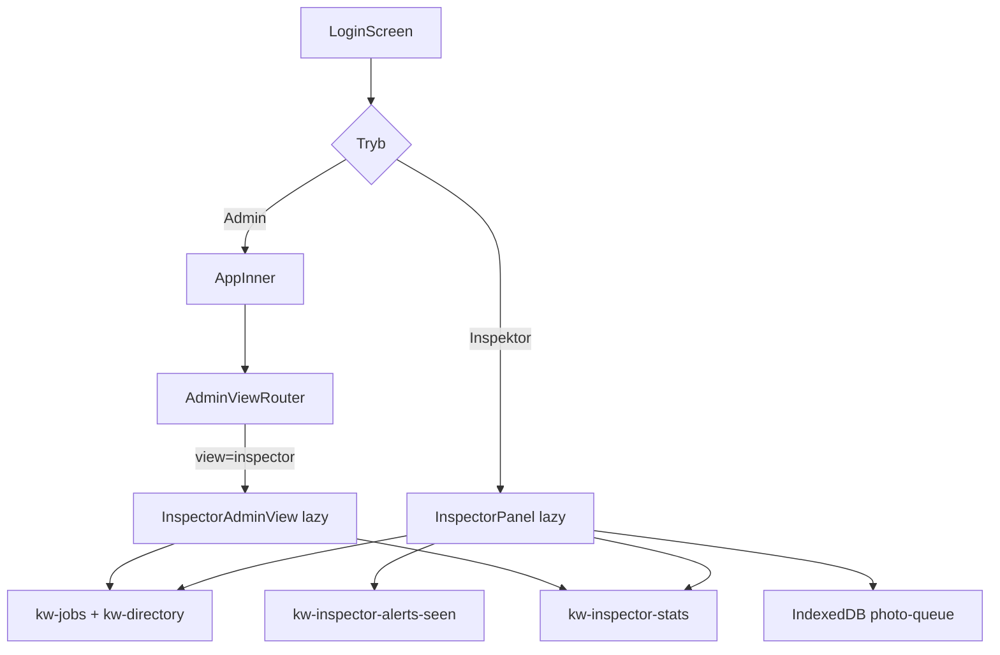

# Sprint 20.2A — Inspector Modern UX (AUDIT + DESIGN ONLY)

> **Data audytu:** 2026-06-06  
> **Tryb:** AUDYT + DESIGN — **bez implementacji, bez commitów**  
> **Prod baseline:** v2.45.39 · Sprint 20.1B CLOSED  
> **Cel:** Plan modernizacji Panelu Inspektora względem Payroll, Robotów 2.1A i Tender Center 7G

---

## Spis treści

1. [Mapa architektury](#1-mapa-architektury)
2. [Mapa UX — ekrany i workflow](#2-mapa-ux--ekrany-i-workflow)
3. [Lista problemów](#3-lista-problemów)
4. [Propozycja nowego dashboardu](#4-propozycja-nowego-dashboardu)
5. [Nowe funkcje — ocena wykonalności](#5-nowe-funkcje--ocena-wykonalności)
6. [Propozycja sprintów](#6-propozycja-sprintów)
7. [Podsumowanie ryzyka](#7-podsumowanie-ryzyka)

---

## 1. Mapa architektury

### 1.1 Dwa wejścia do świata inspektora



| Wejście | Routing | Komponent | Użytkownik |
|---------|---------|-----------|------------|
| **Pole** | `appMode === "inspector"` w `AppInnerWithAuth.tsx` | `InspectorPanel` (lazy `panel-inspector`) | Inspektor terenowy |
| **Admin** | `view === "inspector"` w `AdminViewRouter.tsx` | `InspectorAdminView` (lazy `panel-inspector-admin`) | Admin / moderator — podgląd aktywności |

**Lazy load:** oba panele lazy; `vite.config.ts` **nie preloaduje** chunków `panel-inspector*` (Performance 2.4A CLOSED — nie zmieniać bez polecenia).

---

### 1.2 Komponenty (`src/app/`)

| Plik | Linie (~) | Rola | Kluczowe eksporty |
|------|-----------|------|-------------------|
| `InspectorPanel.tsx` | **1465** | Monolit panelu terenowego — sync, nawigacja, lista, szczegóły roboty | `InspectorPanel` |
| `InspectorDashboard.tsx` | 479 | Pulpit alertów + KPI + PDF raport | `InspectorDashboard` |
| `InspectorNavigation.tsx` | 203 | Dolna nawigacja 5 zakładek + sekcje roboty | `InspectorBottomNav`, `InspectorJobSectionNav`, `InspectorQuickActions`, `getJobSections` |
| `InspectorPhotoGallery.tsx` | 456 | Galeria zdjęć ekipy + inspektora, upload, ZIP | `InspectorPhotoGallery` |
| `InspectorJobPhotosGalleryView.tsx` | 251 | Cross-job: zatwierdzone zdjęcia ekipy | `InspectorJobPhotosGalleryView` |
| `InspectorAdminView.tsx` | 575 | Admin: feed aktywności + statystyki logowań | `InspectorAdminView` |
| `InspectorAdminJobDetail.tsx` | 590 | Admin: szczegóły roboty (mirror sekcji pola) | `InspectorAdminJobDetail` |
| `InspectorHelp.tsx` | 262 | Baner + modal FAQ + hinty `?` | `InspectorHelpBanner`, `InspectorHelpModal`, `InspectorHint` |
| `InspectorJobFileUpload.tsx` | 56 | Upload zlecenia/kosztorysu | `InspectorJobFileUpload` |
| `JobInspectorFilesPanel.tsx` | 340 | Panel plików roboty + ZIP pack | `JobInspectorFilesPanel` |

**Powiązane (współdzielone z Robotami / Worker):**

| Plik | Rola w flow inspektora |
|------|------------------------|
| `JobWmPanel.tsx` | Odbiór WM — etapy, notatki insp.↔admin, zdjęcia WM |
| `WmPortfolioView.tsx` | Portfolio WM (zakładka + admin embedded) |
| `JobFilesBrowser.tsx` | Przeglądarka plików cross-job |
| `WorkScopeEditor.tsx` / `WorkScopeDisplay` | Raporty ekipy (zakresy, wymiary) |
| `JobFilePreviewModal.tsx` | Podgląd PDF/ATH |
| `LoginScreen.tsx` | Osobne logowanie inspektora |

---

### 1.3 Lib / logika domenowa (`src/lib/`)

| Plik | Rola |
|------|------|
| `inspector-dashboard.ts` | Alerty pulpitu: pliki, dokumenty, terminy, urgency score |
| `inspector-activity-stats.ts` | Statystyki tygodnia/miesiąca/roku + PDF |
| `inspector-stats.ts` | Logowania/wejścia (`kw-inspector-stats`), seen alerts |
| `inspector-report-pdf.ts` | Eksport PDF miesiąc/rok |
| `job-activity.ts` | Typy feedu: `inspector_document/file/stage/note/photo` |
| `job-documents.ts` | **Checklist** 8 typów `REQUIRED_DOCS` + 9 `DOCUMENT_TYPES` |
| `job-wm.ts` | Etapy odbioru, `inspectorPhotos`, notatki WM |
| `job-photo-upload.ts` | Upload zdjęć inspektora → Supabase storage |
| `job-file-upload.ts` | Upload zlecenia/kosztorysu |
| `photo-queue.ts` | Kolejka offline IndexedDB (`kind: "inspector"`) |
| `photo-labels.ts` | 4 kategorie zdjęć inspektora |
| `photo-download.ts` | ZIP / nazwy plików inspektora |
| `cloud-sync.ts` | Merge `inspectorPhotos`, `hiddenInspectorFeedIds`, stats |
| `admin-auth.ts` | Rola `inspector`, konta, `listInspectorUsersForLogin` |

**Brak dedykowanych plików:** `*checklist*` (checklista = `REQUIRED_DOCS` w `job-documents.ts`), `*inspection*` (kontrola = workflow WM na `Job`), `*audit*` runtime (skrypty `scripts/audit-*` to diagnostyka repo).

---

### 1.4 Hooki

| Hook | Plik | Rola |
|------|------|------|
| `useInspectorSectionSpy` | `InspectorNavigation.tsx` | IntersectionObserver scroll-spy — **zdefiniowany, ale nieużywany** w `InspectorPanel` (sekcje = przełącznik tabów, nie scroll) |
| `usePullToRefresh` | `usePullToRefresh.tsx` | PTR na dashboard, lista, galeria, pliki, szczegóły |
| `useMediaFailureRevision` | `useMediaFailureRevision.tsx` | Odświeżanie martwych URL mediów |

Brak katalogu `hooks/` dedykowanego inspektorowi — logika w monolicie `InspectorPanel.tsx`.

---

### 1.5 Storage / KV

| Klucz | Zawartość | Sync inspektora |
|-------|-----------|-----------------|
| `kw-jobs` | Roboty: `documents`, `jobFiles`, `inspectorPhotos`, `activityLog`, `jobNotes`, `workerReports`, `handoverStage`, `plannedHandoverDate` | **R/W** — `pushKeysToCloudSafe` |
| `kw-directory` | Kartoteka (imiona, telefony — **bez stawek**) | **R** — pull + storage listener |
| `kw-jobs-deleted-ids` | Tombstones robotów | merge przy pull |
| `kw-directory-deleted-ids` | Tombstones kartoteki | merge przy pull |
| `kw-inspector-stats` | Zdarzenia login/visit | `recordInspectorEvent` → `persistKey` |
| `kw-inspector-alerts-seen` | Per-user: feed seen, notes seen | `syncAlertsSeenFromCloud` |
| `kw-admin-users-config` | Konfig kont (refresh) | pull przy sync |
| IndexedDB `wgdom-photo-queue-v1` | Offline zdjęcia | lokalnie, flush on `online` |
| `sessionStorage` | `wg-session-mode`, `wg-inspector-visit-recorded` | sesja |

**Inspektor celowo NIE syncuje:** payroll, archive, contacts, tenders.

---

### 1.6 Routing

```
main.tsx → App → CloudLoader → AppInnerWithAuth
  appMode === "inspector" → Suspense → InspectorPanel

AppInner → AdminViewRouter
  view === "inspector" → Suspense → InspectorAdminView
  pendingInspectorJobId + inspectorInitialTab → deep link do roboty
```

Nawigacja wewnętrzna inspektora: **stan React** (`mainTab`, `selectedId`, `jobSection`) — brak URL routing.

**Zakładki główne (`InspectorMainTab`):** `dashboard` | `jobs` | `gallery` | `files` | `portfolio`

**Sekcje roboty (`InspectorJobSection`):** `wm` | `files` | `docs` | `team` | `reports` | `photos`

---

### 1.7 Zależności

#### Jobs (silna — wspólny model `Job`)

```
InspectorPanel / InspectorAdminJobDetail
  → kw-jobs (documents, jobFiles, inspectorPhotos, activityLog, handoverStage, …)
  → JobWmPanel, JobMetaPickers, JobInspectorFilesPanel
  → mergeJobsById w cloud-sync.ts
```

Admin `JobsView` linkuje do zakładki Inspektor; zmiany inspektora widoczne w Robotach (zlecenie/kosztorys live).

#### Worker Portal (średnia — read-mostly)

| Element | Kierunek |
|---------|----------|
| `workerReports` | Worker pisze → inspektor czyta (sekcja Raporty) |
| `photos` (ekipa) | Worker upload → inspektor widzi zatwierdzone (Galeria) |
| `workEntries` | Admin/worker → inspektor widzi ekipę + telefony |
| `photo-queue.ts` | Współdzielony mechanizm offline (`kind: "inspector"` vs `"worker"`) |

#### Payroll (brak)

Żaden plik `Inspector*` nie importuje modułów payroll. Inspektor explicite bez stawek PLN/h (`InspectorHint`: „Bez wypłat i stawek”).

---

### 1.8 Model „kontroli” (istniejący — bez osobnej encji)

W WGDOM **kontrola inspektora = workflow odbioru WM na robocie (`Job`)**:

| Aspekt | Pole / mechanizm |
|--------|------------------|
| Etap kontroli | `handoverStage` (`awaiting_order` → `in_progress` → `ready_for_handover` → `handed_over`) |
| Termin | `plannedHandoverDate` |
| Checklist dokumentów | `documents: Record<DocType, boolean>` — 8 wymaganych |
| Zdjęcia kontroli | `inspectorPhotos[]` — 4 kategorie |
| Notatki | `jobNotes` (WM panel) — dialog insp.↔admin |
| Ślad | `activityLog[]` — typy `inspector_*` |
| Postęp (obliczalny) | % = f(docs, files, stage, photos) — **brak w UI, dane są** |

---

## 2. Mapa UX — ekrany i workflow

### Legenda kliknięć

Liczba dotknięć do **głównej czynności** (od ekranu startowego inspektora, bez logowania).

---

### 2.1 Panel terenowy — zakładka **Pulpit** (`InspectorDashboard`)

| | |
|---|---|
| **Cel** | Priorytetyzacja pracy: alerty admina, brakujące pliki/dokumenty, terminy WM |
| **Workflow** | Otwórz app → Pulpit (domyślny) → filtr chipów → tap wiersz alertu → szczegóły roboty w odpowiedniej sekcji |
| **Kliknięcia** | Oznacz dokument z pulpitu: **1** (QuickBtn). Otwórz robotę z alertu: **1**. Upload zdjęcia: **4–5** (przez listę) |
| **Problemy UX** | Brak sekcji „Dzisiaj”; KPI 6 kafelków bez ikon akcentowych (vs Roboty 2.1B); alerty = płaskie `JobRow`, nie karty z postępem; filtry chipów duplikują sekcje zamiast jednego widoku |
| **Przestarzałe wizualnie** | `StatTile` / `JobRow` — styl 2024; brak hierarchii jak `JobListCard`; PDF raport na pulpicie zajmuje dużo miejsca |
| **Nieintuicyjne** | „Aktywne” w KPI ≠ „kontrole aktywne”; brak jednego wskaźnika postępu kontroli; filtr „Terminy” ukrywa alerty plików |

---

### 2.2 Panel terenowy — zakładka **Roboty** (lista)

| | |
|---|---|
| **Cel** | Przegląd wszystkich robót WM z filtrem statusu i wyszukiwarką |
| **Workflow** | Roboty → szukaj/filtruj → tap karta → szczegóły |
| **Kliknięcia** | Otwórz robotę: **1**. Zmień sekcję w robocie: **+1** |
| **Problemy UX** | Karty `rounded-2xl` OK, ale brak paska postępu; badge zlecenie/kosztorys/dok redundantne z pulpitem; 5 zakładek dolnych — „Galeria” i „Pliki” duplikują wejścia z roboty |
| **Przestarzałe wizualnie** | Brak KPI nad listą (vs `JobListPanelHeader`); brak sortowania po pilności/terminie; status „W trakcie” żółty pill — słaba hierarchia |
| **Nieintuicyjne** | Domyślny filtr „Aktywne” — inspektor nie widzi zdanych bez przełączenia; brak widoku „moje na dziś” |

---

### 2.3 Panel terenowy — **Szczegóły roboty** (6 sekcji)

Nawigacja: **poziomy pasek sekcji** (tylko jedna sekcja renderowana naraz — nie pełny scroll dokumentu).

#### Sekcja WM (`wm`)

| | |
|---|---|
| **Cel** | Etap odbioru, data planowana, notatki insp.↔admin, zdjęcia WM |
| **Workflow** | Otwórz robotę → WM (domyślna) → `JobWmPanel` → etap / notatka / data |
| **Kliknięcia** | Odpowiedz adminowi: **2** (lista/pulpit → robotę). Zmień etap: **3–4** |
| **Problemy** | `JobWmPanel` bogaty ale gęsty; sugestia etapu po upload zlecenia łatwo missed; historia „Ostatnie zmiany” na dole WM — mało widoczna |
| **Przestarzałe** | Formularz etapów jak w adminie sprzed Roboty 2.0; brak timeline |

#### Sekcja Pliki (`files`)

| | |
|---|---|
| **Cel** | Zlecenie + kosztorys: oznacz „Jest” lub wgraj PDF/ATH |
| **Workflow** | Pliki → toggle Jest / upload → opcjonalnie podgląd |
| **Kliknięcia** | Oznacz Jest: **3** (roboty → robotę → pliki → toggle). Upload: **4–5** |
| **Problemy** | Dwa duże kafle + panel plików poniżej — dużo scrolla; upload i toggle w jednym widoku mylące |
| **Przestarzałe** | Grid 2-kolumnowy bez progress; brak CTA „szybki upload” |

#### Sekcja Dokumenty (`docs`)

| | |
|---|---|
| **Cel** | Checklist 9 typów dokumentów (8 wymaganych) |
| **Workflow** | Docs → tap pola → toggle ✓ |
| **Kliknięcia** | Oznacz 1 dokument: **3** (roboty → robotę → docs → tap) |
| **Problemy** | Grid 2×5 — małe etykiety na mobile; brak grupowania (pomiary / odbiory / administracja); brak % postępu |
| **Przestarzałe** | Wygląd jak forma admina 2023; vs Tender checklist (`TenderBidPrepPanel`) — dużo bardziej czytelny |

#### Sekcja Pracownicy (`team`)

| | |
|---|---|
| **Cel** | Kto pracował + telefon (bez stawek) |
| **Kliknięcia** | Zadzwoń: **3** + tap tel link |
| **Problemy** | Pochodne z `workEntries` — może być puste mimo przypisanej ekipy planowej (`executionAssigneeDirectoryIds` niewidoczne) |
| **Nieintuicyjne** | Brak planowej ekipy z Fazy 8.5 — inspektor nie widzi „Ekipa: N” jak admin |

#### Sekcja Raporty (`reports`)

| | |
|---|---|
| **Cel** | Raporty ekipy: zakres, wymiary, rysunki |
| **Kliknięcia** | Rozwiń raport: **3** |
| **Problemy** | Accordion jeden na raz; tabela wymiarów na wąskim ekranie — horizontal scroll OK ale brak podsumowania |
| **Przestarzałe** | Styl tabeli HTML; brak kart raportu |

#### Sekcja Zdjęcia (`photos`)

| | |
|---|---|
| **Cel** | Galeria ekipy (read) + upload zdjęć inspektora (4 kategorie) |
| **Kliknięcia** | Upload zdjęcia: **4–5** (robotę → photos → wybierz kategorię → caption → camera/file) |
| **Problemy** | Upload wymaga wyboru label + caption przed aparatem; brak FAB „szybkie zdjęcie”; offline queue niewidoczna w UI |
| **Przestarzałe** | Galeria funkcjonalna ale UI sprzed Roboty galerii admin (ZIP, kategorie) |

---

### 2.4 Panel terenowy — zakładka **Galeria** (cross-job)

| | |
|---|---|
| **Cel** | Wszystkie zatwierdzone zdjęcia ekipy ze wszystkich robót |
| **Kliknięcia** | Otwórz robotę ze zdjęcia: **2** |
| **Problemy** | Osobna zakładka — redundancja z sekcją photos w robocie; brak filtra „oczekujące na akceptację” (pending) |
| **Nieintuicyjne** | Inspektor nie uploaduje tutaj — tylko podgląd ekipy |

---

### 2.5 Panel terenowy — zakładka **Pliki** (cross-job)

| | |
|---|---|
| **Cel** | `JobFilesBrowser` — wszystkie pliki wszystkich robót |
| **Kliknięcia** | Podgląd pliku: **2–3** |
| **Problemy** | Drugi poziom nawigacji obok sekcji files w robocie — cognitive overload |
| **Przestarzałe** | Browser tekstowy vs nowoczesny file explorer |

---

### 2.6 Panel terenowy — zakładka **Portfolio**

| | |
|---|---|
| **Cel** | `WmPortfolioView` — zestawienie odbiorów WM |
| **Kliknięcia** | Otwórz robotę: **2** |
| **Problemy** | Piąta zakładka dolna — mało odkrywalna; nakłada się z pulpitem (terminy) |
| **Nieintuicyjne** | Nazwa „Portfolio” nie sugeruje „harmonogram odbiorów” |

---

### 2.7 Panel terenowy — **Header**

| | |
|---|---|
| **Cel** | Tożsamość, sync, pomoc, wylogowanie |
| **Problemy** | **7+ akcji** w jednym rzędzie (logo, sync badge, chmura, odśwież, pomoc, muzyka, wyloguj); na mobile ukryte etykiety — ikony bez opisu |
| **Przestarzałe** | `CompanyMusicPlayer` w panelu roboczym inspektora — nietypowe UX |
| **Nieintuicyjne** | Dwa przyciski sync (badge + chmura + odśwież) |

---

### 2.8 Admin — **InspectorAdminView** (zakładka Inspektor)

| | |
|---|---|
| **Cel** | Feed aktywności inspektora + statystyki logowań + portfolio WM |
| **Workflow** | Admin → Inspektor → filtruj feed → klik adres → `InspectorAdminJobDetail` |
| **Kliknięcia** | Zobacz zmianę: **2**. Oznacz przeczytane: **1** |
| **Problemy** | Feed chronologiczny bez grupowania po robocie; paginacja 10 — archaiczna vs infinite scroll; brak KPI „wymaga uwagi” |
| **Przestarzałe** | `FeedCard` prosty; brak executive summary jak CC 7G |
| **Nieintuicyjne** | Zakładka „Portfolio WM” w adminie duplikuje widok inspektora |

---

### 2.9 Porównanie z nowoczesnymi modułami WGDOM

| Cecha | Roboty 2.1A | Payroll 20.1B | Tender CC 7G | Inspektor (dziś) |
|-------|-------------|---------------|--------------|------------------|
| KPI z ikonami i akcentem | ✅ `JobListPanelHeader` | ✅ totals + banery | ✅ 5 kart executive | ⚠️ `StatTile` bez ikon |
| Karty z hierarchią | ✅ `JobListCard` | ✅ wiersze lista płac | ✅ action cards | ⚠️ `JobRow` / proste karty |
| Postęp wizualny | ⚠️ fazy | ✅ saved/closed | ✅ health index | ❌ brak % |
| Action Center (max 3) | ✅ KPI klik = filtr | — | ✅ max 3 akcje | ❌ długa lista alertów |
| Mobile-first | ✅ scroll KPI | ✅ | ✅ | ⚠️ OK technicznie, słaba IA |
| Lazy / performance | ✅ | ✅ | ✅ osobny chunk | ✅ lazy — OK |

---

## 3. Lista problemów

### P0 — blokujące odbiór „nowoczesnego” produktu

| ID | Problem | Dowód w kodzie |
|----|---------|------------------|
| P0-1 | **Brak jednego wskaźnika postępu kontroli** — inspektor nie widzi „67% gotowe” | Dane w `documents` + `handoverStage`; UI nie agreguje |
| P0-2 | **Zbyt wiele kliknięć do codziennych czynności** (zdjęcie, dokument) | Upload: job → section photos → label → caption |
| P0-3 | **5 zakładek dolnych** — Galeria/Pliki/Portfolio rozpraszają | `InspectorBottomNav` — 5 tabów |
| P0-4 | **Monolit 1465 linii** — trudny rozwój bez regresji | `InspectorPanel.tsx` |
| P0-5 | **Wizualna luka vs Roboty 2.1A** — brak KPI header, słabe karty | `JobListPanelHeader` vs prosta lista |

### P1 — UX / IA

| ID | Problem |
|----|---------|
| P1-1 | Brak widoku **„Dzisiaj”** (termin `plannedHandoverDate === today`) |
| P1-2 | Sekcje roboty = **taby** zamiast scroll + sticky TOC (`useInspectorSectionSpy` nieużywany) |
| P1-3 | Header przeładowany — sync × 3, muzyka, 7 akcji |
| P1-4 | Checklist dokumentów — grid 2 kolumny, brak grup |
| P1-5 | Admin feed bez grupowania po robocie / priorytecie |
| P1-6 | Planowa ekipa (`executionAssigneeDirectoryIds`) niewidoczna dla inspektora |
| P1-7 | Offline photo queue — brak UI „X zdjęć czeka na wysłanie” |

### P2 — techniczne / dług techniczny

| ID | Problem |
|----|---------|
| P2-1 | Duplikacja logiki: `InspectorPanel` vs `InspectorAdminJobDetail` (~590 linii mirror) |
| P2-2 | Lokalne typy `InspectorJob` w panelu zamiast wspólnego `app-domain` |
| P2-3 | Brak testów smoke dedykowanych inspektorowi (vs payroll 20.0A/20.1A/20.1B) |
| P2-4 | `useInspectorSectionSpy` — martwy kod lub niedokończona migracja |

### P3 — nice-to-have

| ID | Problem |
|----|---------|
| P3-1 | Brak mapy adresów kontroli |
| P3-2 | Brak notatek głosowych |
| P3-3 | PDF raport na pulpicie — niszowy, zajmuje miejsce |

---

## 4. Propozycja nowego dashboardu

### 4.1 Założenia projektowe

1. **Nie wprowadzać nowego klucza KV** w 20.2A — reuse `Job.documents`, `handoverStage`, `inspectorPhotos`, `activityLog`.
2. **Kontrola = Job WM** — UI mówi „kontrola” / „odbiór”, dane zostają w `kw-jobs`.
3. **Wzorzec wizualny:** `JobListPanelHeader` + `JobListCard` + `CommandCenterExecutivePanel` (max 3 akcje).
4. **Mobile-first:** jedna kolumna, KPI scroll poziomy, FAB na zdjęcie.
5. **Admin `InspectorAdminView`:** ten sam język KPI, inny layout (szeroki desktop).

### 4.2 Funkcja postępu kontroli (0–100%)

Propozycja wag (bez nowych pól):

| Składnik | Waga | Źródło |
|----------|------|--------|
| Dokumenty wymagane (`REQUIRED_DOCS`) | 40% | `job.documents` |
| Zlecenie + kosztorys (pliki) | 20% | `documents.zlecenie/kosztorys` lub `jobFiles` |
| Etap WM | 20% | `handoverStage` mapowany na 0–100% |
| Zdjęcia inspektora (min. 1 per aktywna faza) | 10% | `inspectorPhotos.length` |
| Notatka / komunikacja | 10% | `jobNotes` niepuste lub `activityLog` inspector_note |

Nowy helper: `computeInspectionProgress(job): { percent, breakdown, missing[] }` w `inspector-dashboard.ts`.

---

### 4.3 Wireframe — Nowy Inspector Dashboard (ASCII)

```
┌─────────────────────────────────────────────────────────────┐
│  W&G DOM          Jan Kowalski · Inspektor WM    [☁ ✓] [?] │  ← uproszczony header
├─────────────────────────────────────────────────────────────┤
│  Dzień dobry, Jan 👋                                         │
│  3 kontrole wymagają uwagi · 2 zaplanowane na dziś          │
├─────────────────────────────────────────────────────────────┤
│  SEKCJA A — KPI (scroll →)                                   │
│  ┌──────────┐ ┌──────────┐ ┌──────────┐ ┌──────────┐     │
│  │ 🔵 Aktywne│ │ 🟠 Uwaga │ │ 🟢 Zakończ│ │ 📷 Zdjęcia│     │
│  │    12    │ │     3    │ │     45   │ │  2 oczek.│     │
│  └──────────┘ └──────────┘ └──────────┘ └──────────┘     │
├─────────────────────────────────────────────────────────────┤
│  SEKCJA B — DZISIAJ (plannedHandoverDate = today + soon)   │
│  ┌─────────────────────────────────────────────────────┐   │
│  │ 📍 ul. Kwiatowa 5 m.12          Odbiór za 0 dni   │   │
│  │ Klient: WM Wrocław  ·  Etap: Gotowe do odbioru      │   │
│  │ ████████████░░░░░░░░  72%                           │   │
│  │ [Otwórz kontrolę]              [📷 Szybkie zdjęcie]  │   │
│  └─────────────────────────────────────────────────────┘   │
│  ┌─────────────────────────────────────────────────────┐   │
│  │ 📍 ul. Różana 8                   Odbiór za 2 dni   │   │
│  │ ██████░░░░░░░░░░░░░░  38%                           │   │
│  └─────────────────────────────────────────────────────┘   │
├─────────────────────────────────────────────────────────────┤
│  ACTION CENTER (max 3 — jak CC 7G)                           │
│  ① Brak kosztorysu — ul. Polna 3        [Oznacz Jest]      │
│  ② Odpowiedź admina — ul. Słoneczna 1   [Otwórz WM]        │
│  ③ 4 brakujące dok. — ul. Leśna 7       [Checklist]        │
├─────────────────────────────────────────────────────────────┤
│  SEKCJA C — MOJE ROBOTY (karty)                              │
│  [Szukaj…]  [Aktywne ▼]                                      │
│  ┌─────────────────────────────────────────────────────┐   │
│  │ ul. Polna 3 m.4              [W trakcie] [WM: Realiz.]│   │
│  │ Klient X · Start 01.06.2026                         │   │
│  │ ████████░░░░░░░░░░░░  45%                           │   │
│  │ Zlecenie ✓  Kosztorys ✗  Dok. 5/8  📷 3             │   │
│  └─────────────────────────────────────────────────────┘   │
│  ┌─────────────────────────────────────────────────────┐   │
│  │ ul. Mickiewicza 10           [Do odbioru]           │   │
│  │ ██████████████████░░  90%                           │   │
│  └─────────────────────────────────────────────────────┘   │
├─────────────────────────────────────────────────────────────┤
│  SEKCJA E — CHECKLIST SKRÓT (rozwijana / w robocie)         │
│  📷 Zdjęcia (3/4 kat.)  📐 Pomiary ✓  📄 Dok. 5/8          │
│  📋 Dokumentacja  🔑 Odbiory ○  📝 Notatki (1 nowa)        │
├─────────────────────────────────────────────────────────────┤
│  [Pulpit]  [Roboty]  [+]  [Mapa*]  [Więcej ▼]              │  ← 4+1 zamiast 5
└─────────────────────────────────────────────────────────────┘
        * Mapa — sprint 20.2B
        [+] FAB → aparat / szybkie zdjęcie do wybranej roboty
```

---

### 4.4 Wireframe — Szczegóły kontroli (jedna strona scroll)

Zamiast 6 tabów — **jeden scroll** z sticky mini-nav (reuse `useInspectorSectionSpy`):

```
┌─────────────────────────────────────────────────────────────┐
│  ← Wróć do Pulpitu                                          │
│  ul. Kwiatowa 5 m.12                                        │
│  ████████████████░░░░  72%  Gotowe do odbioru · za 0 dni   │
├─────────────────────────────────────────────────────────────┤
│  [WM] [Pliki] [Dok.] [Ekipa] [Raporty] [Zdjęcia]  ← sticky │
├─────────────────────────────────────────────────────────────┤
│  ── WM ─────────────────────────────────────────────────    │
│  (JobWmPanel skrócony — etap, data, notatki)                │
│  ── Pliki ───────────────────────────────────────────────   │
│  ── Checklist ─────────────────────────────────────────────   │
│  Grupa: Pomiary i odbiory                                   │
│    [✓] Pomiary   [○] Kominiarz   [○] Oświadczenia         │
│  Grupa: Dokumentacja                                        │
│    [✓] Zlecenie  [✓] Kosztorys  [○] Rysunek               │
│  ── Zdjęcia ──────────────────────────────────────────────   │
│  [📷 Dodaj]  kategorie jako chipy                           │
└─────────────────────────────────────────────────────────────┘
```

---

### 4.5 Uproszczenie nawigacji dolnej

| Dziś (5) | Propozycja (4 + FAB) |
|----------|----------------------|
| Pulpit | **Pulpit** (nowy dashboard) |
| Roboty | **Roboty** (karty + postęp) |
| Galeria | → wchodzi w Robota / sekcja Zdjęcia |
| Pliki | → wchodzi w Robota / sekcja Pliki + „Wszystkie pliki” w menu „Więcej” |
| Portfolio | → sekcja na Pulpicie „Harmonogram odbiorów” lub Więcej |

---

## 5. Nowe funkcje — ocena wykonalności

| # | Funkcja | Trudność | Ryzyko regresji | Wpływ na kod | Rekomendacja |
|---|---------|----------|-----------------|--------------|--------------|
| 1 | **Szybkie dodawanie zdjęć** (FAB, camera capture, domyślna kategoria) | **Średnia** | Średnie — `photo-queue`, `uploadInspectorPhoto`, merge photos | `InspectorPanel`, nowy `InspectorQuickPhoto.tsx`, reuse `photo-queue.ts` | ✅ **20.2A** — wysoki ROI, dane/sync gotowe |
| 2 | **Notatki głosowe** | **Wysoka** | Wysokie — nowe pole na Job, storage audio, sync rozmiar, privacy | Nowe pole `inspectorVoiceNotes[]`, Edge storage, transkrypcja opcjonalna | ⏳ **20.2C** — po UX baseline; rozważyć tylko upload audio bez transkrypcji |
| 3 | **Timeline kontroli** | **Niska–Średnia** | Niskie — read-only z `activityLog` | Nowy `InspectorTimeline.tsx`, filtr `inspector_*` | ✅ **20.2B** — dane już są w `activityLog` |
| 4 | **Mapa kontroli** | **Średnia** | Niskie–Średnie — heurystyka adresów, brak lat/lng w Job | Reuse wzorzec `tenders-map-coords.ts` + `TendersMapPanel` (OSM) | ⏳ **20.2B** — prototyp Wrocław; bez nowego KV |
| 5 | **Score jakości kontroli** | **Niska** | Niskie — derived metric | `computeInspectionProgress` + ewentualnie `inspectionQualityScore` | ✅ **20.2A** — część dashboardu KPI |
| 6 | **Mobile-first inspector mode** | **Średnia** | Średnie — dotyk całego `InspectorPanel` | Refactor layout, FAB, sticky nav, offline badge | ✅ **20.2A + 20.2C** — 20.2A IA/layout; 20.2C native/Capacitor |

### Szczegóły wybranych funkcji

#### 1. Szybkie zdjęcia

- **Istniejące:** `uploadInspectorPhoto`, `queuePhoto({ kind: "inspector" })`, flush on `online`
- **Brakuje:** FAB, `capture="environment"`, wybór roboty z kontekstu „Dzisiaj”, domyślny label `in_progress`
- **Ryzyko:** merge `inspectorPhotos` w `cloud-sync.ts` — nie zmieniać logiki merge

#### 2. Notatki głosowe

- **Brak** infrastruktury audio w Job; worker ma tekstowe raporty
- **Wymaga:** bucket storage (istnieje), limit rozmiaru, UI nagrywania (MediaRecorder API)
- **Rekomendacja:** odłożyć do 20.2C; alternatywa w 20.2B: szybka notatka tekstowa z szablonów

#### 3. Timeline

- `jobInspectorHistory()` już filtruje 5 wpisów — rozszerzyć do pełnego timeline z datami grupowanymi „Dziś / Wczoraj / Tydzień”
- Admin `InspectorAdminView` może dostać ten sam komponent zamiast płaskiego feedu

#### 4. Mapa

- Job ma `address`, `flatNumber` — brak współrzędnych
- `tenders-map-coords.ts` — heurystyka ulic Wrocławia → reuse dla robót
- Markery kolorowane wg `plannedHandoverStatus` (overdue/soon/ok)

#### 5. Score jakości

```
score = inspectionProgressPercent
      + bonus (wszystkie REQUIRED_DOCS)
      - penalty (overdue bez aktualizacji > 7 dni)
```

Bez ML — reguły biznesowe w `inspector-dashboard.ts`.

#### 6. Mobile-first

- Technicznie mobile OK (`100dvh`, `min-h-[44px]`, PTR)
- Problem to **IA i gęstość**, nie brak responsive
- 20.2C: Capacitor camera plugin, haptic na checklist, badge offline queue

---

## 6. Propozycja sprintów

### Sprint 20.2A — UX Refresh (MVP wizualny + postęp)

**Cel:** Nowoczesny pulpit i karty robót — parytet z Roboty 2.1A.

| Zakres | Pliki (szacunek) |
|--------|------------------|
| `computeInspectionProgress()` + KPI 4 kafle | `inspector-dashboard.ts`, `InspectorDashboard.tsx` |
| Sekcja „Dzisiaj” + Action Center (max 3) | `InspectorDashboard.tsx` |
| Karty robót z paskiem % | `InspectorPanel.tsx` (lista) lub nowy `InspectorJobCard.tsx` |
| Uproszczenie bottom nav (4 + menu Więcej) | `InspectorNavigation.tsx`, `InspectorPanel.tsx` |
| Header cleanup (sync zjednoczony, muzyka do Więcej) | `InspectorPanel.tsx` |
| Checklist grupowany + % w sekcji docs | `InspectorPanel.tsx` / wydzielony komponent |
| FAB szybkie zdjęcie (MVP) | nowy komponent + `InspectorPanel.tsx` |
| Smoke test | `scripts/smoke-test-inspector-20.2a.mjs` |
| Docs | `CHANGELOG`, `ARCHITECTURE.md` § inspektor, `GuideView` |

**Poza zakresem 20.2A:** mapa, głos, refactor admin mirror, scroll-spy pełny (opcjonalnie koniec 20.2A jeśli czas).

**Edge deploy:** nie wymagany (frontend only).

---

### Sprint 20.2B — Smart Tools

**Cel:** Narzędzia zwiększające produktywność terenową.

| Zakres |
|--------|
| Timeline kontroli (`InspectorTimeline.tsx`) — pole + admin feed |
| Mapa kontroli OSM (reuse `tenders-map-coords`) |
| Jakość kontroli — rozszerzone reguły + badge na karcie |
| Admin `InspectorAdminView` — KPI executive + grupowanie feedu po `jobId` |
| Wydzielenie wspólnego `InspectorJobDetail` (redukcja duplikacji Panel vs AdminJobDetail) |
| Szablony szybkich notatek tekstowych |

---

### Sprint 20.2C — Mobile Inspector

**Cel:** Doświadczenie natywne w terenie.

| Zakres |
|--------|
| UI kolejki offline („3 zdjęcia czekają”) |
| Capacitor / `capture` — natywny aparat |
| Notatki głosowe (upload audio → storage) — jeśli biznes potwierdzi |
| Haptic / gesture (swipe między sekcjami) |
| E2E Playwright flow inspektora na prod |
| Opcjonalnie: planowa ekipa widoczna w sekcji Team |

---

### Zależności między sprintami

```
20.2A (UX + progress + FAB photo)
   ↓
20.2B (timeline, mapa, admin executive, refactor detail)
   ↓
20.2C (native, voice, offline polish, E2E)
```

**Nie ruszać w żadnym sprincie bez audytu:** `vite.config.ts`, `manualChunks`, lazy loading Performance 2.x, merge `cloud-sync.ts` poza `inspectorPhotos` / testami.

---

## 7. Podsumowanie ryzyka

### SZACOWANY ROZMIAR ZMIAN

# **MEDIUM–HIGH**

| Obszar | Uzasadnienie |
|--------|--------------|
| Rozmiar | `InspectorPanel.tsx` 1465 linii + 6 powiązanych komponentów + dashboard lib |
| Złożoność | Nowy progress model, zmiana IA (5→4 tabów), FAB photo, karty |
| Testowanie | Brak istniejących smoke inspektora — trzeba dodać od 20.2A |
| Oszczędność | Reuse Jobs/CC wzorców UI — bez nowego KV, bez Edge |

**20.2A alone:** **MEDIUM**  
**Pełna seria 20.2A + 20.2B + 20.2C:** **HIGH**

---

### RYZYKO REGRESJI

# **MEDIUM**

| Ryzyko | Poziom | Mitygacja |
|--------|--------|-----------|
| Sync `kw-jobs` / merge photos | **Średnie** | Nie zmieniać `mergeJobsById` bez testów; smoke upload + toggle doc |
| `JobWmPanel` współdzielony z adminem | **Średnie** | Tylko layout wrapper; nie zmieniać logiki WM |
| Admin widzi te same dane co inspektor | **Niskie** | Read path bez zmian modelu |
| Performance bundle | **Niskie–Średnie** | Nowe komponenty w lazy chunk `panel-inspector`; nie dotykać vite config |
| Worker raporty / zdjęcia ekipy | **Niskie** | Inspektor read-only na `workerReports` / `photos` |
| Payroll | **Brak** | Zero coupling |

---

## Załącznik A — Checklist dokumentów (stan obecny)

| `DocType` | Etykieta | Wymagany (`REQUIRED_DOCS`) |
|-----------|----------|----------------------------|
| `zlecenie` | Zlecenie | ✅ |
| `zakres` | Zakres prac | ✅ |
| `kosztorys` | Kosztorys | ✅ |
| `kominiarz` | Kominiarz | ✅ |
| `pomiary` | Pomiary | ✅ |
| `oswiadczenia` | Oświadczenia | ✅ |
| `gwarancje` | Gwarancje | ✅ |
| `rysunek` | Rysunek | ✅ |
| `zdjecia` | Zdjęcia (dok.) | ❌ (opcjonalny w `DOCUMENT_TYPES`) |

Propozycja grup w UI (Sekcja E):

- **Pomiary i odbiory:** pomiary, kominiarz, oświadczenia
- **Dokumentacja umowy:** zlecenie, zakres, kosztorys, gwarancje, rysunek
- **Zdjęcia i materiały:** zdjecia (+ `inspectorPhotos` osobno)

---

## Załącznik B — Pliki kluczowe do czytania przed implementacją

```text
1. docs/INSPECTOR-AUDIT-20.2A.md     ← ten dokument
2. src/app/InspectorPanel.tsx        ← monolit do refaktoru
3. src/app/InspectorDashboard.tsx    ← pulpit
4. src/lib/inspector-dashboard.ts    ← logika alertów
5. src/app/JobListCard.tsx           ← wzorzec kart Roboty 2.1A
6. src/app/JobListPanelHeader.tsx    ← wzorzec KPI
7. docs/ARCHITECTURE.md § 7          ← sync inspektora
8. src/lib/job-wm.ts                 ← etapy WM
9. src/lib/photo-queue.ts            ← offline photos
```

---

## Status

| | |
|---|---|
| **Implementacja** | ❌ Nie rozpoczęta (zgodnie z poleceniem) |
| **Commit** | ❌ Brak |
| **Następny krok** | Zatwierdzenie zakresu **20.2A** przez właściciela produktu |

---

*Koniec raportu audytowego Sprint 20.2A — Inspector Modern UX (AUDIT + DESIGN ONLY).*
