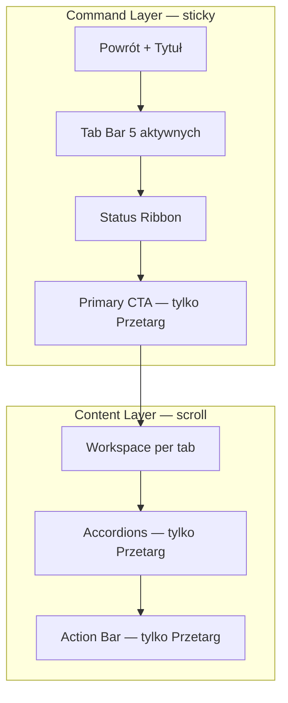

# NG-03 — Tender Workspace UX · DESIGN FREEZE

> **Status:** **DESIGN FREEZE** · SSOT implementacji NG-03  
> **Data freeze:** 2026-06-30  
> **Baseline prod:** **v2.62.99** · https://www.wgdom.fun  
> **Audyt źródłowy:** [`audit/NG-03-TENDER-WORKSPACE-UX-ARCHITECTURE-AUDIT.md`](../audit/NG-03-TENDER-WORKSPACE-UX-ARCHITECTURE-AUDIT.md)  
> **Workflow techniczny (niezmienny):** [`WORKFLOW-ARCHITECTURE-v2.63.md`](WORKFLOW-ARCHITECTURE-v2.63.md)  
> **Pipeline (niezmienny):** NG-02 `useTenderPipelineRuntime` — bez zmian w tej fazie

---

## 0. Werdykt freeze

| Pole | Wartość |
|------|---------|
| **Faza** | NG-03.0 DESIGN FREEZE |
| **Następna faza** | **NG-03.1 Navigation** (po akceptacji tego dokumentu) |
| **Zakres freeze** | Prezentacja UI · nawigacja · layout · progressive disclosure |
| **Poza freeze** | Parsery · dossier · sync KV · scoring engines · NG-02 runtime |

**Zasady wiążące implementację:**

1. **SSOT FIRST** — dane z istniejących agregatów lib; UI nie buduje własnej logiki biznesowej.
2. **Reuse First** — rozszerzać `TenderDetailPage`, `TenderWorkflowHubPanel`, `tender-detail-routes-v4.ts`; nie tworzyć równoległego shella.
3. **Zero Duplicate Logic** — jeden wizualny kanał na sygnał (patrz §4 Status Ribbon).
4. **Mobile First** — projekt od viewportu ≤390px; desktop = rozszerzenie, nie osobny produkt.
5. **Jedno CTA** — reguła WORKFLOW §4.3 zachowana; V2 **nigdy** nie przywraca sekcji „Następny krok”.

---

## 1. Docelowy wireframe — Tender Workspace

### 1.1 Widok ogólny (detal przetargu V4)

```text
┌──────────────────────────────────────────────────────────────────┐
│ COMMAND LAYER (sticky · shrink-0 · nie scrolluje z treścią)      │
│ ┌──────────────────────────────────────────────────────────────┐ │
│ │ [← Powrót do listy]                                          │ │
│ │ Tytuł przetargu (max 2 linie mobile · pełny desktop)           │ │
│ │ [Przetarg][Dokumenty][Kosztorys][Ceny][Decyzja]  ← 5 tabów   │ │
│ │ ── tylko tab=Przetarg ─────────────────────────────────────  │ │
│ │ STATUS RIBBON (trust compact + Process Strip)                │ │
│ │ PRIMARY CTA (sticky w Command Layer)                           │ │
│ └──────────────────────────────────────────────────────────────┘ │
├──────────────────────────────────────────────────────────────────┤
│ CONTENT LAYER (flex-1 · overflow-y-auto · overscroll-contain)    │
│                                                                  │
│   { workspace specyficzny dla aktywnego tabu }                   │
│                                                                  │
│   ── tylko tab=Przetarg ──────────────────────────────────────  │
│   [Accordion: Szczegóły postępu]  (domyślnie ZWINIĘTY)           │
│   [Accordion: Informacje o przetargu] (domyślnie ZWINIĘTY)       │
│   [ACTION BAR — sticky bottom mobile / inline desktop]           │
│                                                                  │
└──────────────────────────────────────────────────────────────────┘
```

### 1.2 Diagram warstw



### 1.3 Co znika z obecnego UI (freeze — nie wracać)

| Element as-is (2.62.99) | Decyzja freeze |
|-------------------------|----------------|
| KPI bar 8-komórkowy w chrome | Zastąpiony **KPI Compact** w accordion / drawer (§3.1) |
| Tab `strategia` / `materialy` w detalu | **Usunięte** z Tab Bar (nie placeholder) |
| Trust Banner + Chips + Strip jako 3 osobne bloki | **Scalone** w Status Ribbon |
| `TenderWorkspaceV2Panel` zawsze rozwinięty | **Accordion** „Szczegóły postępu” |
| Executive blocks pod Hubem (key facts, warunki, zakres) | **Accordion** „Informacje o przetargu” |
| `TenderAnalysisStatusStrip` w operatorze | Wchłonięty w Ribbon / Dokumenty |
| Breadcrumb 3-poziomowy w chrome | **Opcjonalny** — ukryty na mobile |

---

## 2. Command Layer

### 2.1 Definicja

**Command Layer** = jedyna strefa, która odpowiada na pytanie: *„Co mam teraz zrobić w tym przetargu?”*

| Właściwość | Wartość |
|------------|---------|
| Pozycja | `shrink-0` · `z-10` · `border-b` · `backdrop-blur` |
| Scroll | **Nie** scrolluje z Content Layer |
| Wysokość docelowa mobile | **≤ 50vh** przy tab=Przetarg (CTA widoczne bez scrollu content) |
| Wysokość docelowa desktop | **≤ 280px** przy tab=Przetarg |

### 2.2 Składowe (kolejność obowiązująca)

| # | Slot | Komponent docelowy | Tab(y) | SSOT lib |
|---|------|-------------------|--------|----------|
| 1 | Nawigacja wstecz | Przycisk „Powrót do listy” | wszystkie | `TENDERS_LIST_PATH` |
| 2 | Tytuł | `h1` · 1 linia (Kosztorys) / 2 linie (inne) | wszystkie | `item.title` |
| 3 | Tab Bar | 5 slugów V4 | wszystkie | `tender-detail-routes-v4.ts` |
| 4 | KPI Compact | opcjonalny pasek 4 komórek | wszystkie oprócz Kosztorys | `buildKpiBarProCells` → subset |
| 5 | Status Ribbon | trust + Process Strip | **tylko Przetarg** | §4 |
| 6 | Primary CTA | `TenderWorkflowPrimaryAction` | **tylko Przetarg** | `tender-workflow-primary-action.ts` |

### 2.3 Wyjątek — tab Kosztorys

```text
Command Layer (compact):
  [← Lista] · Tytuł line-clamp-1 · [5 tabs]
  (brak KPI · brak Ribbon · brak CTA)
```

Uzasadnienie: maksymalna przestrzeń na tabelę / karty kosztorysu (zachować `compactKosztorysChrome`).

### 2.4 Primary CTA — reguły freeze

- **Jedno** miejsce w całym workspace (WORKFLOW §4.3).
- Montowane **wyłącznie** w Command Layer, nie w Content.
- `position: sticky` w obrębie Command Layer lub bezpośrednio pod Ribbon w tym samym kontenerze sticky.
- Busy/disabled: istniejące flagi `autoRunning`, `dossierBuilding`, `kosztorysSession` — **bez zmian logiki**.

---

## 3. Content Layer

### 3.1 Definicja

**Content Layer** = odpowiedź na pytanie specyficzne dla tabu (*dokumenty / kosztorys / wycena / decyzja*).

| Właściwość | Wartość |
|------------|---------|
| Pozycja | `flex-1 min-h-0 overflow-y-auto` |
| Padding | `px-4 sm:px-6` · `pb` z safe-area |
| Zasada | **Brak duplikacji** sygnałów z Command Layer |

### 3.2 Mapa Content per tab

| Tab V4 | Pytanie użytkownika | Content (tylko to) | Komponent bazowy |
|--------|---------------------|--------------------|------------------|
| **przetarg** | Co dalej + kontekst zwijany | Accordions + Action Bar | `TenderPrzetargWorkspace` (refactor) |
| **dokumenty** | Jakie docs i stan analizy? | Summary Header · grouped attachments · formal · BZP HTML | `TenderDocumentsWorkspace` |
| **kosztorys** | Czy kosztorys gotowy? | PRO dashboard · fazy E0–E12 · wiersze (cards mobile) | `TenderKosztorysWorkspace` |
| **ceny** | Za ile startować? | Kalkulator · override · klasyfikacja (cards mobile) | `TenderBidProposalPanel` |
| **decyzja** | GO/HOLD/ODPUŚĆ? | Sub-taby: Przegląd · Kwalifikacja · Oferta | `TenderDecisionView` + P2-F |

### 3.3 Tab Przetarg — Content (po freeze)

```text
CONTENT (scroll):
  (pusty slot — Command Layer wystarcza do akcji)

  ▼ Accordion [Szczegóły postępu]     default: CLOSED
      ├── Postęp % (jedna linia)
      ├── Blockers (jeśli są)
      ├── V2 checklista skrócona (max 5 pozycji + „rozwiń”)
      └── Plik pozycji (skrót)

  ▼ Accordion [Informacje o przetargu] default: CLOSED
      ├── KPI pełne (8) lub drawer
      ├── Podstawowe dane
      ├── Warunki udziału (skrót + link → Decyzja/Kwalifikacja)
      ├── Zakres robót
      └── Portfolio chip (link → Strategia modułu)

  ACTION BAR (§8)
```

### 3.4 KPI Compact vs pełne KPI

| Wariant | Gdzie | Komórki |
|---------|-------|---------|
| **KPI Compact** | Command Layer (opcjonalnie pod tab bar) | Termin · Wartość · Dokumenty · Wycena |
| **KPI Pełne (8)** | Accordion „Informacje” lub drawer „Więcej KPI” | wszystkie z `buildKpiBarProCells` |

**Freeze:** nigdy 8 komórek w stałym chrome na mobile.

---

## 4. Status Ribbon

### 4.1 Definicja

**Status Ribbon** = jeden wizualny kanał łączący **Trust** i **Process Strip**.

Zastępuje obecny układ:
```text
AS-IS:  TrustBanner → TrustChipRow → ProcessStrip  (3 rzędy)
TO-BE:  StatusRibbon = [TrustCompact?] + ProcessStrip  (1–2 rzędy)
```

### 4.2 Anatomia

```text
┌─────────────────────────────────────────────────────────────┐
│ STATUS RIBBON (tab=Przetarg only)                           │
├─────────────────────────────────────────────────────────────┤
│ Row A (warunkowy): Trust compact                            │
│   [partial docs] [kosztorys ⚠] [+N]   lub  brak gdy trusted │
├─────────────────────────────────────────────────────────────┤
│ Row B (zawsze): Process Strip                               │
│   [Dokumenty][Analiza][Kosztorys][Wycena][Oferta]           │
│   + trust overlay per etap (istniejący pickStripStage*)      │
└─────────────────────────────────────────────────────────────┘
```

### 4.3 Reguły Trust w Ribbon

| Reguła | SSOT |
|--------|------|
| Banner pełnej szerokości | Tylko gdy `shouldRenderHubTrustBanner` — **nad** Ribbon, max 1 |
| Chipy | Max **3** visible + chip `+N` · surface=`hub` |
| Strip overlay | Zachować `trustStageOverlayLevel` per etap |
| Brak drugiego `TrustChipRow` | Usunąć duplikat w legacy chrome |

### 4.4 Process Strip — bez zmian semantyki

Pięć etapów (kolejność stała):

```text
Dokumenty → Analiza → Kosztorys → Wycena → Oferta
```

| Etap | Nawigacja V4 | Uwaga freeze |
|------|--------------|--------------|
| documents / analysis | `dokumenty` | — |
| kosztorys | `kosztorys` | — |
| wycena | `ceny` | — |
| offer | `decyzja` (+ opcjonalnie `?ws=offer`) | — |
| **kwalifikacja** | **NG-03.1:** brak etapu Strip; dostęp przez Decyzja sub-tab | nie dodawać 6. etapu bez audytu |

---

## 5. Nowa hierarchia informacji

### 5.1 Poziomy (od najwyższego priorytetu)

```text
L0  OPERATOR ACTION     Primary CTA + Action Bar
L1  PROCESS STATE       Status Ribbon (Strip + trust compact)
L2  TAB CONTEXT         Workspace content aktywnego tabu
L3  SUPPORTING DETAIL   Accordions (postęp, informacje)
L4  PORTFOLIO CONTEXT   Strategia modułu (link z L3)
```

### 5.2 Macierz sygnał → jedno miejsce

| Sygnał biznesowy | L0 | L1 | L2 | L3 |
|------------------|----|----|----|----|
| Następna akcja | **CTA** | — | — | — |
| Etap procesu | — | **Strip** | — | — |
| Problem zaufania | — | **Trust compact** | per-tab hint | — |
| % postępu | — | — | — | **Accordion postęp** |
| Blockers | — | — | — | **Accordion postęp** |
| Dokumenty lista | — | — | **Dokumenty tab** | — |
| Kosztorys tabela | — | — | **Kosztorys tab** | — |
| Wycena PLN | — | KPI compact | **Ceny tab** | KPI pełne |
| GO/HOLD/ODPUŚĆ | — | — | **Decyzja tab** | — |
| Kwalifikacja P2-F | — | — | **Decyzja/Kwalifikacja** | — |
| Portfolio / Action Center | — | — | — | link → **Strategia modułu** |

### 5.3 Zakazane duplikacje (freeze)

Implementacja **MUSI ODRZUCIĆ** PR-y, które przywracają:

- V2 filary obok Process Strip w stanie rozwiniętym domyślnie
- `TenderAnalysisStatusStrip` równolegle do Ribbon na Przetargu
- Key facts grid pod Hubem bez accordion
- Drugi zestaw trust chipów na tym samym tabie

---

## 6. Docelowa nawigacja

### 6.1 Moduł Przetargi (bez zmian strukturalnych w freeze)

```text
[Lista] [Strategia] [Mapa] [Profil firmy] [Biblioteka robót] [Baza cen] [Ustawienia]
```

### 6.2 Detal przetargu — Tab Bar V4 (po freeze)

**Aktywne slugi URL** (`TENDER_DETAIL_V4_TAB_ORDER` — docelowy):

```text
przetarg → dokumenty → kosztorys → ceny → decyzja
```

**Usunięte z Tab Bar:**

- `strategia` — treść w module Strategia + link z accordion Informacje
- `materialy` — feature flag / backlog; brak placeholder „Wkrótce”

### 6.3 Decyzja — sub-nawigacja (NG-03.1)

```text
/decyzja                    → Przegląd (werdykt + ekonomia)
/decyzja?ws=qualification    → Kwalifikacja (P2-F)
/decyzja?ws=offer           → Oferta (completeness)
```

**UI obowiązkowe:** `TenderDecyzjaSubTabBar` — 3 widoczne sub-taby (nie tylko query string).

### 6.4 Strategia — jeden punkt wejścia (freeze: opcja A)

| Źródło | Cel |
|--------|-----|
| Accordion Informacje → „Pozycja w portfolio” | `/przetargi` tab=strategia + highlight `tenderId` |
| `TenderMonitoringBanner` | reuse `openTendersStrategy` |
| Tab detal `strategia` | **NIE ISTNIEJE** |

### 6.5 Deep linki zachowane

| Link | Status |
|------|--------|
| `/przetargi/:id/:tab` | Zachowany |
| `?ws=qualification\|offer` | Zachowany + widoczny sub-tab |
| Process Strip → tab | Zachowany |
| CTA → tab | Zachowany |
| Legacy accordion | Deprecate w docs; nie rozwijać |

---

## 7. Układ mobile

### 7.1 Viewport referencyjny

- **Primary:** 390×844 (iPhone 14 class)
- **Minimum:** 320px szerokości
- **Touch:** min `44×44px` na wszystkich akcjach Command + Action Bar

### 7.2 Mobile — Command Layer (tab Przetarg)

```text
┌─────────────────────────┐
│ ← Powrót                │  44px
│ Tytuł (max 2 linie)     │  ~48px
│ [Tabs scroll horizontal]│  44px
│ Trust chips (max 1 row)   │  ~32px (warunkowo)
│ [Dok][Anal][Kosz][Wyc][Of] scroll │ ~40px
│ ┌─────────────────────┐ │
│ │  PRIMARY CTA        │ │  ~56px sticky
│ └─────────────────────┘ │
└─────────────────────────┘
≈ 220–280px chrome przed content
```

### 7.3 Mobile — Content + Action Bar

```text
┌─────────────────────────┐
│ ▶ Szczegóły postępu     │  collapsed
│ ▶ Informacje            │  collapsed
│                         │
│      (scroll area)      │
│                         │
├─────────────────────────┤
│ ACTION BAR (sticky)     │  pb + safe-area
│ [Upload][Analiza][···]  │
└─────────────────────────┘
```

- Action Bar: `position: sticky; bottom: 0` w Content Layer
- Padding dolny content: `pb-[calc(actionBar+safe-area)]`
- Wzorzec: `OperationalNotesView` drill-in · `JobsView` MV-2 (bez pełnoekranowego drill-in listy)

### 7.4 Mobile — tabele Kosztorys / Ceny

| As-is | To-be (NG-03.5) |
|-------|-----------------|
| `overflow-x-auto` + `min-w-[520px+]` | `sm:hidden` **card per wiersz** |
| — | `hidden sm:block` tabela desktop |

### 7.5 Mobile — moduł Lista

Bez zmian w freeze Command/Content detalu; NG-03.4 osobno: chip tiers na wierszu listy.

---

## 8. Układ desktop

### 8.1 Viewport referencyjny

- **≥1024px** — pełny layout
- Command Layer: KPI Compact może być **jednym rzędem** pod tab bar
- Content: max-width opcjonalnie `max-w-5xl mx-auto` (decyzja produktowa NG-03.2)

### 8.2 Desktop — Command Layer (tab Przetarg)

```text
┌────────────────────────────────────────────────────────────────────────┐
│ ← Powrót    breadcrumb (opcjonalny)                                    │
│ Tytuł przetargu (pełny)                                                │
│ [Przetarg][Dokumenty][Kosztorys][Ceny][Decyzja]                        │
│ Termin │ Wartość │ Dokumenty │ Wycena          [Więcej KPI ▾]          │
│ [Trust chips inline]  [Dokumenty][Analiza][Kosztorys][Wycena][Oferta]  │
│ ┌──────────────────────────────────────────────────────────────────┐  │
│ │ PRIMARY CTA                                          [progress]│  │
│ └──────────────────────────────────────────────────────────────────┘  │
└────────────────────────────────────────────────────────────────────────┘
```

### 8.3 Desktop — Action Bar

- **Nie** sticky bottom — inline pod accordions lub prawa kolumna toolbar
- Przyciski w jednym rzędzie: e-Zamówienia · Upload · Analiza · Eksport PDF · Utwórz robotę

### 8.4 Desktop — Decyzja

```text
┌─────────────────────────────────────────────────────────┐
│ Sub-tab: [Przegląd] [Kwalifikacja] [Oferta]              │
├─────────────────────────────────────────────────────────┤
│ Werdykt (duży) │ Ekonomia │ przyciski GO/HOLD/ODPUŚĆ    │
│ (dwukolumnowy layout gdy ≥lg)                             │
└─────────────────────────────────────────────────────────┘
```

---

## 9. Progressive Disclosure

### 9.1 Zasada

> Domyślnie pokazuj **minimum do akcji** (L0–L1). Szczegóły (L3) za gestem użytkownika.

### 9.2 Mapa disclosure

| Element | Domyślny stan | Trigger rozwinięcia |
|---------|----------------|---------------------|
| Status Ribbon — trust chips | Skrócone (max 3) | tap `+N` → sheet z pełną listą |
| V2 postęp / checklista | **Zamknięte** | accordion „Szczegóły postępu” |
| Executive blocks | **Zamknięte** | accordion „Informacje o przetargu” |
| KPI pełne (8) | Ukryte | drawer „Więcej KPI” |
| Bid breakdown | Zwinięty | istniejące `breakdownOpen` |
| Formal details (Dokumenty) | Skrót | „Pokaż pełne szczegóły formalne” |
| Blockers | Widoczne w accordion gdy są | auto-expand accordion jeśli `blockers.length > 0` |

### 9.3 Auto-expand (wyjątki)

| Warunek | Akcja UI |
|---------|----------|
| `blockers.length > 0` | Accordion „Szczegóły postępu” **otwarty** przy pierwszym wejściu |
| `trustAssessment.overall === blocked` | Trust banner nad Ribbon (istniejąca polityka HF-001) |
| Inne sekcje | **Zamknięte** |

### 9.4 Czego nie chować

- Primary CTA (zawsze w Command Layer)
- Process Strip (zawsze w Ribbon)
- Tab Bar (zawsze w Command Layer)
- Werdykt na Decyzja/Przegląd (zawsze widoczny)

---

## 10. Makieta kolejności sekcji

### 10.1 Tab PRZETARG — kolejność finalna

```text
COMMAND (sticky)
  1. Powrót
  2. Tytuł
  3. Tab Bar (5)
  4. KPI Compact (4) — opcjonalnie; ukryj gdy Kosztorys
  5. Status Ribbon
     5a. Trust compact (warunkowo)
     5b. Process Strip
  6. Primary CTA

CONTENT (scroll)
  7. Accordion „Szczegóły postępu” [default: closed]
     7.1 Pasek %
     7.2 Blockers
     7.3 Checklista skrócona (V2 subset)
     7.4 Plik pozycji (skrót)
  8. Accordion „Informacje o przetargu” [default: closed]
     8.1 KPI pełne / drawer trigger
     8.2 Podstawowe dane
     8.3 Warunki udziału (skrót)
     8.4 Zakres robót
     8.5 Portfolio link
  9. Action Bar
     9.1 Monitoring banner (inline, 1 linia)
     9.2 e-Zamówienia · Upload · Analiza · Eksport · Roboty
  10. Link tekstowy → Decyzja (zachować)
```

### 10.2 Tab DOKUMENTY

```text
COMMAND: 1–3 (bez Ribbon, CTA, KPI opcjonalnie)
CONTENT:
  1. Źródło platformy
  2. TenderDocumentsSummaryHeader (+ trust badge)
  3. TenderAttachmentsPanel (7 grup)
  4. Szczegóły formalne (collapsible)
  5. Meta SWZ / HTML BZP
```

### 10.3 Tab KOSZTORYS

```text
COMMAND: compact (1–3)
CONTENT:
  1. Trust inline hint (kosztorys dimension)
  2. PRO dashboard KPI
  3. Fazy procesu E0–E12
  4. Tabela / mobile cards
  5. Retry / health (istniejące)
```

### 10.4 Tab CENY

```text
COMMAND: 1–3
CONTENT:
  1. Trust pricing dimension
  2. Podsumowanie PLN (hero)
  3. Klasyfikacja / UNKNOWN
  4. Katalog linii (cards mobile)
  5. Override cen (istniejący modal)
```

### 10.5 Tab DECYZJA

```text
COMMAND: 1–3
SUB-TAB BAR: Przegląd | Kwalifikacja | Oferta
CONTENT (per sub-tab):
  Przegląd:    Werdykt → Kontekst → Ekonomia → Owner buttons
  Kwalifikacja: P2-F panels (wadium, referencje, fit, rejestr)
  Oferta:      Completeness + submitted bid + award
```

---

## 11. Mapowanie implementacji → fazy

| Faza | Zakres freeze | Sekcje dotknięte |
|------|---------------|------------------|
| **NG-03.0** | Ten dokument | — |
| **NG-03.1** | §6.3 sub-taby Decyzja · §6.2 usunięcie placeholder tabs | Tab Bar, routes |
| **NG-03.2** | §2 Command Layer · §4 Ribbon · §9 accordions | Hub, Page chrome |
| **NG-03.3** | §7.3 · §10.1 slot 9 Action Bar | Operator section |
| **NG-03.4** | Lista (poza detalem) | `TendersView` |
| **NG-03.5** | §7.4 mobile cards | Kosztorys, Ceny |
| **NG-03.6** | §6.4 Strategia bridge | Strategia moduł link |
| **NG-03.7** | Polish, HelpView, E2E | docs |

---

## 12. SSOT techniczny (implementacja — referencja)

| Temat | Plik SSOT | Modyfikowalny w NG-03 |
|-------|-----------|------------------------|
| Slugi V4 | `src/lib/tender-detail-routes-v4.ts` | tak (NG-03.1) |
| Tab labels | `TENDER_DETAIL_V4_TAB_LABELS` | tak |
| Process Strip | `src/lib/tender-workflow-process-strip.ts` | tylko prezentacja |
| CTA | `src/lib/tender-workflow-primary-action.ts` | **nie** (logika) |
| Intelligence | `src/lib/tender-intelligence-context.ts` | **nie** |
| Trust | `src/lib/tender-trust-layer.ts`, `tender-trust-ui.ts` | tylko prezentacja |
| Runtime | `useTenderPipelineRuntime.ts` | **nie** w NG-03 UX |
| KPI cells | `src/lib/tender-detail-v4-display.ts` | subset helper NG-03.2 |

---

## 13. Kryteria akceptacji freeze

Design freeze uznaje się za **ZATWIERDZONY**, gdy właściciel repo potwierdzi:

- [ ] 5 tabów detalu (bez strategia/materialy placeholder)
- [ ] Command Layer + Content Layer split
- [ ] Status Ribbon zamiast 3 osobnych bloków trust+strip
- [ ] CTA zawsze widoczne na Przetarg bez scrollu content
- [ ] Accordions domyślnie zamknięte (wyjątek: blockers)
- [ ] Sub-taby Decyzja w NG-03.1
- [ ] Mobile cards w NG-03.5
- [ ] Brak zmian NG-02 pipeline / parserów

Po akceptacji: **start NG-03.1 Navigation** — wyłącznie zakres §6.

---

## 14. Historia dokumentu

| Data | Wersja | Zmiana |
|------|--------|--------|
| 2026-06-30 | 1.0 | NG-03.0 DESIGN FREEZE — pierwsza publikacja SSOT |

---

**Następny krok:** Akceptacja właściciela → **NG-03.1 Navigation** (implementacja §6.2–6.3).
