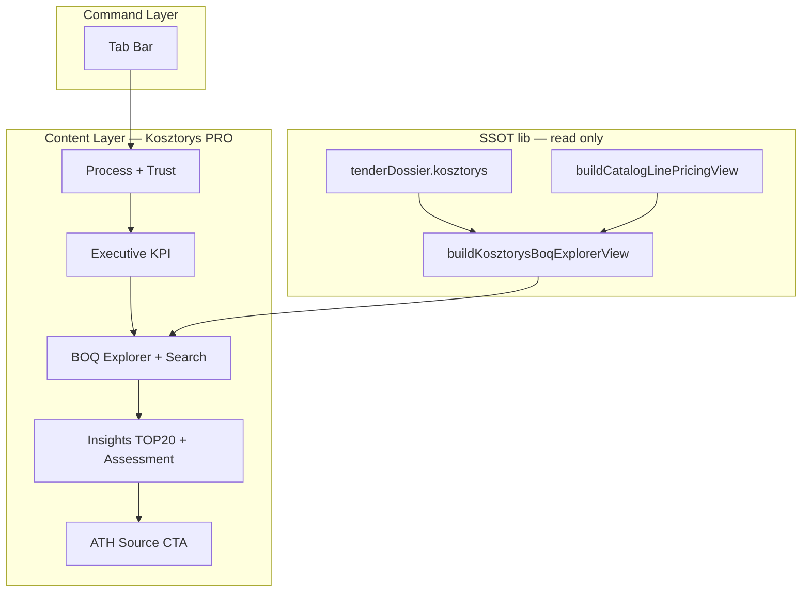

# NG-04 — Kosztorys Workspace PRO · DESIGN FREEZE

> **Status:** **DESIGN FREEZE** · SSOT implementacji NG-04  
> **Data freeze:** 2026-07-01  
> **Baseline prod:** **v2.63.8** · commit **`f482016`**  
> **Audyt źródłowy:** [`audit/NG-04-KOSZTORYS-WORKSPACE-PRO-AUDIT.md`](../audit/NG-04-KOSZTORYS-WORKSPACE-PRO-AUDIT.md)  
> **Workflow (niezmienny):** [`WORKFLOW-ARCHITECTURE-v2.63.md`](WORKFLOW-ARCHITECTURE-v2.63.md)  
> **Pipeline (niezmienny):** NG-02 `useTenderPipelineRuntime` · parse heavy lazy · **bez zmian w tej fazie**

---

## 0. Werdykt freeze

| Pole | Wartość |
|------|---------|
| **Faza** | NG-04.0 DESIGN FREEZE · **NG-04.1 PLAN READY** |
| **Następna faza** | **NG-04.1 BOQ Explorer IMPLEMENT** — plan: [`NG-04.1-BOQ-EXPLORER-IMPLEMENTATION-PLAN.md`](NG-04.1-BOQ-EXPLORER-IMPLEMENTATION-PLAN.md) |
| **Zakres freeze** | Prezentacja UI tab **Kosztorys** · unified BOQ · search · benchmark per linia |
| **Poza freeze** | Parsery ATH/PDF · `athPreviewToSnapshot` shape · sync KV · NG-02 runtime · kalkulator oferty core |

**Hasło sesji:** „kontynuuj WGDOM” + scope **NG-04**.

---

## 1. Zasady wiążące (Architecture Rules)

1. **SSOT FIRST** — dane wyłącznie z: `tenderDossier.kosztorys`, `buildCatalogLinePricingView`, `buildKosztorysProDashboard`, `resolvedCostStatus`, `trustAssessment`.
2. **Reuse First** — rozszerzać `TenderKosztorysWorkspace`; wpiąć `TenderCatalogLinePricingSection` / row renderers z Ceny; **nie** tworzyć `TenderKosztorysWorkspaceV2.tsx` równolegle.
3. **Zero Duplicate Logic** — jeden ViewModel BOQ (`buildKosztorysBoqExplorerView` · Principle #001); zakaz drugiego benchmarku lub pricing engine.
4. **Mobile First** — BOQ od ≤390px; desktop = więcej kolumn, nie osobny produkt.
5. **Search First** — pole wyszukiwania BOQ obowiązkowe w NG-04.1 (opis, LP, kod KNR).
6. **URL SSOT tab** — bez zmian (`parseTenderDetailPath` · `pendingTab` · 2.63.8).
7. **Jedno CTA** — tab Kosztorys **bez** Primary CTA w Command Layer (WORKFLOW §4.3).

### 1.1 NG-04 Principle #001 — One BOQ Row · One ViewModel · Many Views

> **Status:** **WIĄŻĄCE** od NG-04.1 · obowiązuje wszystkie fazy NG-04.

```text
tenderDossier.kosztorys + buildCatalogLinePricingView
              │
              ▼
     KosztorysBoqRowViewModel[]     ← JEDEN SSOT merge (lib, pure)
              │
    ┌─────────┼─────────┬──────────────┐
    ▼         ▼         ▼              ▼
 BOQ Table  Mobile    TOP 20      Search/Filter
  (desktop)  Cards   (dashboard)   (pure fn)
```

| Reguła | Znaczenie |
|--------|-----------|
| **One BOQ Row** | Jedna pozycja = jeden rekord z `catalogQuantities` jako anchor; merge ATH `rows` + `CatalogLinePricingRow` po kluczu freeze (lp → opis) |
| **One ViewModel** | Typ `KosztorysBoqRowViewModel` + builder `buildKosztorysBoqExplorerView()` — **jedyny** punkt łączenia danych BOQ |
| **Many Views** | UI (tabela, karty, TOP 20, liczniki) **tylko renderuje** ViewModel; zakaz własnego merge / map w komponentach React |

**Zakazy:** `TenderKosztorysWorkspace` nie wolno budować wierszy inline; TOP 20 musi używać **`selectTopCostRows()`** na ViewModel (nie lokalnego `slice()`).

### 1.2 NG-04 Principle #002 — Lazy Rendering First

> **Status:** **WIĄŻĄCE** od NG-04.1 · obowiązuje BOQ Explorer i kolejne widoki listy.

| Reguła | Znaczenie |
|--------|-----------|
| **ViewModel raz** | `buildKosztorysBoqExplorerView()` wywoływany **jeden raz** per `item` + overrides revision (np. `useMemo`) |
| **Search bez rebuild** | `filterKosztorysBoqRows(view.rows, …)` — **nigdy** nie woła merge ani pricing lib |
| **Sort bez rebuild** | Sortowanie (TOP 20, przyszłe kolumny) na **kopii** lub indeksach ViewModel — **nigdy** rebuild merge |
| **Desktop = Mobile** | Ta sama tablica `KosztorysBoqRowViewModel[]` (po filtrze) dla tabeli i kart |
| **Wirtualizacja** | Lista renderuje `filteredRows`; w przyszłości `react-window` / virtual list podmienia tylko warstwę prezentacji |

### 1.3 NG-04 Principle #003 — Search ≠ Merge

> **Status:** **WIĄŻĄCE** od NG-04.1.

```text
buildKosztorysBoqExplorerView()  ← JEDYNY merge ATH + WGDOM + meta
filterKosztorysBoqRows()       ← JEDYNY search/filter (pure, na gotowych rows)
selectTopCostRows()            ← JEDYNY TOP N po wartości WGDOM (pure)
```

**Zakaz:** ponowne łączenie ATH/WGDOM, ponowne `buildCatalogLinePricingView`, mapowanie `rows[]` w handlerze search/sort/filter w React.

### 1.4 Helper SSOT — `selectTopCostRows()`

```typescript
selectTopCostRows(rows: KosztorysBoqRowViewModel[], limit?: number): KosztorysBoqRowViewModel[]
```

- Sort malejąco po `wgdomLinePln` (0 pomijane).
- **TOP 20** i dashboard **muszą** używać tego helpera — zakaz lokalnego `slice()` / własnego sortu wartości.

---

## 2. Docelowy wireframe — Kosztorys Workspace PRO

### 2.1 Widok ogólny

```text
┌──────────────────────────────────────────────────────────────────┐
│ COMMAND LAYER (TenderDetailPage — istniejący)                    │
│ [← Lista]  Tytuł                                                 │
│ [Przetarg][Dokumenty][Kosztorys][Ceny][Decyzja]                  │
│ (brak Primary CTA · brak Status Ribbon na tab≠Przetarg)          │
├──────────────────────────────────────────────────────────────────┤
│ CONTENT — TenderKosztorysWorkspace PRO                           │
│                                                                  │
│ ┌─ Process ────────────────────────────────────────────────────┐ │
│ │ KosztorysProcessStatusBar + TrustInlineHint                  │ │
│ └──────────────────────────────────────────────────────────────┘ │
│                                                                  │
│ ┌─ Executive KPI (reuse PRO hero + 4 KPI) ─────────────────────┐ │
│ │ Pozycje · Pokrycie · FIT · Status · Wycenione · Marża        │ │
│ └──────────────────────────────────────────────────────────────┘ │
│                                                                  │
│ ┌─ BOQ Explorer (NG-04.1) ─────────────────────────────────────┐
│ │ [🔍 Szukaj…]  [Filtry branżowe chips — reuse]                  │
│ │ ┌────────────────────────────────────────────────────────────┐ │
│ │ │ Unified table / mobile cards                               │ │
│ │ │ LP · Opis · j.m. · Ilość · KNR                             │ │
│ │ │ Cena ATH · Wartość ATH  (— gdy brak)                       │ │
│ │ │ Cena WGDOM · Wartość WGDOM · Benchmark badge               │ │
│ │ └────────────────────────────────────────────────────────────┘ │
│ │ Paginacja / „Pokaż więcej” (reuse preview limit pattern)       │
│ └──────────────────────────────────────────────────────────────┘ │
│                                                                  │
│ ┌─ Insights (reuse + rozszerzenie) ──────────────────────────────┐
│ │ Ocena kosztorysu · TOP 20 · Category chips ATH                 │
│ └──────────────────────────────────────────────────────────────┘ │
│                                                                  │
│ ┌─ Source actions (reuse) ───────────────────────────────────────┐
│ │ Pełny podgląd ATH · Pobierz ATH                                │
│ └──────────────────────────────────────────────────────────────┘ │
└──────────────────────────────────────────────────────────────────┘
```

### 2.2 Diagram warstw



---

## 3. Model wiersza PRO (freeze)

**Nowy typ (lib only · pure function):**

```typescript
// NG-04.1 — typ kanoniczny (nazwa finalna w planie implementacji)
interface KosztorysBoqRowViewModel {
  lp: string;
  description: string;
  unit: string;
  quantity: string;
  knrHint: string;              // extractKatalogHintFromDescription
  athUnitPrice: string | null;  // rows match by lp/description key
  athTotal: string | null;
  wgdomUnitPln: number | null;  // material + labor per unit
  wgdomLinePln: number | null;
  pricing: CatalogLinePricingRow | null;  // reuse existing
  benchmarkStatus: LaborBenchmarkStatus | null;  // per category rollup only
  isUnknown: boolean;
}
```

**Merge key (freeze):** dopasowanie `catalogQuantities[i]` → `rows[]` po **`lp`**; fallback: normalizowany prefix opisu (max 80 znaków). **Nie** fuzzy match w NG-04.1.

**Kolumny obowiązkowe w tabeli:**

| Kolumna | Źródło | Gdy pusta |
|---------|--------|-----------|
| LP, Opis, j.m., Ilość | `catalogQuantities` | — |
| KNR | `extractKatalogHintFromDescription` | „—” |
| Cena ATH | `rows.unitPrice` | „—” + tooltip FOUND_NO_VALUE |
| Wartość ATH | `rows.total` | „—” |
| Cena WGDOM | pricing view | „Nie wyceniono” |
| Wartość WGDOM | pricing view | „—” |
| Benchmark | reuse badge z Ceny | ukryj gdy UNKNOWN |

---

## 4. Co zostaje (reuse bez redesignu)

| Element | Decyzja |
|---------|---------|
| `KosztorysProcessStatusBar` | **Bez zmian** funkcjonalnych |
| `buildKosztorysProDashboard` | **Reuse** KPI + assessment + TOP 20 |
| Filtry branżowe `KOSZTORYS_PRO_FILTER_OPTIONS` | **Reuse** |
| `JobFilePreviewModal` | **Reuse** — pełny ATH z R/M/S |
| `TrustInlineHint` / `TrustReasonList` | **Reuse** |
| `TenderMobileRowCard` / `TenderDesktopTable` | **Reuse** shell |
| Lazy heavy parse | **Bez zmian** — mount tab kosztorys |

---

## 5. Co znika / nie wraca

| Element | Decyzja freeze |
|---------|----------------|
| Tabela tylko `catalogQuantities` bez cen | **Zastąpiona** unified BOQ (NG-04.1) |
| Debug banner `rows_fallback` jako docelowy UX | **Usunąć** po NG-04.1 (zostawić dev-only flag) |
| Duplikat pełnej wyceny na Ceny i Kosztorys | **Konsolidacja** — Kosztorys = BOQ+ benchmark; Ceny = kalkulator oferty + overrides edit |
| Osobny epic parser R/M/S w snapshot | **Poza NG-04** — backlog G-02 |

---

## 6. Zakres faz implementacji

| Faza | ID | Deliverable | DoD test |
|------|-----|-------------|----------|
| Freeze | **NG-04.0** | Ten dokument + audyt | Review |
| BOQ | **NG-04.1** | Unified table + search + merge helper | `test-ng04-kosztorys-pro-unified-row.mjs` (nowy) + `test-v41-kosztorys-workspace.mjs` |
| Benchmark UI | **NG-04.2** | Badge per linia (reuse Ceny) | pricing tests PASS |
| ATH insight | **NG-04.3** | Kolumny ATH + tooltip priced/no-value | TP200B golden PASS |
| Polish | **NG-04.4** | Mobile polish, HelpView, EPIC CLOSE | E2E mobile smoke |

**NG-04.4+ (opcjonalny):** persist `code` in snapshot — **wymaga nowego AUDIT + bump parserVersion**.

---

## 7. Integracja z innymi tabami

| Tab | Relacja PRO |
|-----|-------------|
| **Dokumenty** | Wejście parse; link „Otwórz Kosztorys” gdy ready |
| **Kosztorys** | **NG-04 scope** — BOQ decision screen |
| **Ceny** | Kalkulator, override **edit**, eksport oferty — **nie** duplikować BOQ table |
| **Decyzja** | Czyta `bidProposal` + trust — **bez** zmian |
| **Przetarg** | Executive summary — link do Kosztorys PRO KPI |

---

## 8. Mobile (freeze)

| Breakpoint | Zachowanie |
|------------|------------|
| ≤390px | KPI 2×2 grid; BOQ = karty; search sticky top content |
| 640–1023px | Tabela horizontal scroll; KPI 4 col |
| ≥1024px | Pełna tabela unified |

**Touch targets:** ≥44px (NG-03 freeze — kontynuacja).

---

## 9. Out of scope (explicit)

- Edycja pozycji BOQ / własny kosztorys
- OCR PDF (uxCase 3)
- Nowy parser / zmiana `SNAPSHOT_PRICED_ROWS_CAP`
- `market-average-engine` integracja (osobny epic P3)
- Historia zmian pozycji (osobny backlog G-09)
- Command Layer Primary CTA na Kosztorys
- Zmiany `useTenderPipelineRuntime` contract

---

## 10. Regression gates (pre-merge każdej fazy)

```bash
npx vite-node scripts/test-v41-kosztorys-workspace.mjs
npx vite-node scripts/test-tender-kosztorys-process-phase.mjs
npx vite-node scripts/test-tender-kosztorys-process-health.mjs
npx vite-node scripts/test-tp200b-snapshot-fidelity.mjs
npx vite-node scripts/test-tender-price-bridge.mjs
npm run build
```

**Golden tenders (nie złamać):** TP182 ≥120 rows · TP200B cap 500 · parser v4 stale rescan.

---

## 11. Production impact (prognoza)

| Faza | Impact |
|------|--------|
| NG-04.0 freeze | **None** |
| NG-04.1–04.2 | **Low** — UI + pure lib; brak sync |
| Snapshot extension | **High** — **poza** tym freeze |

---

## 12. Akceptacja freeze

Implementacja **NG-04.1** może startować dopiero gdy:

- [x] Audyt [`NG-04-KOSZTORYS-WORKSPACE-PRO-AUDIT.md`](../audit/NG-04-KOSZTORYS-WORKSPACE-PRO-AUDIT.md) zaakceptowany
- [x] Ten DESIGN FREEZE zaakceptowany przez właściciela repo
- [x] Plan NG-04.1 [`NG-04.1-BOQ-EXPLORER-IMPLEMENTATION-PLAN.md`](NG-04.1-BOQ-EXPLORER-IMPLEMENTATION-PLAN.md) gotowy
- [ ] Brak równoległego epicu parsera (TP200 CLOSED)
- [ ] Workflow: PLAN → IMPLEMENT → TEST → BUILD → COMMIT (na polecenie) → PUSH → VERIFY

---

## 13. Powiązane SSOT

| Dokument | Rola |
|----------|------|
| [`WORKFLOW-ARCHITECTURE-v2.63.md`](WORKFLOW-ARCHITECTURE-v2.63.md) § 5.3 | Tab Kosztorys |
| [`NG-03-DESIGN-FREEZE.md`](NG-03-DESIGN-FREEZE.md) | Wzorzec Command/Content |
| [`SESSION-HANDOFF-TP200-PLANNED.md`](SESSION-HANDOFF-TP200-PLANNED.md) | Snapshot fidelity |
| [`ARCHITECTURE.md`](ARCHITECTURE.md) § 12.1 | Tender dossier |
