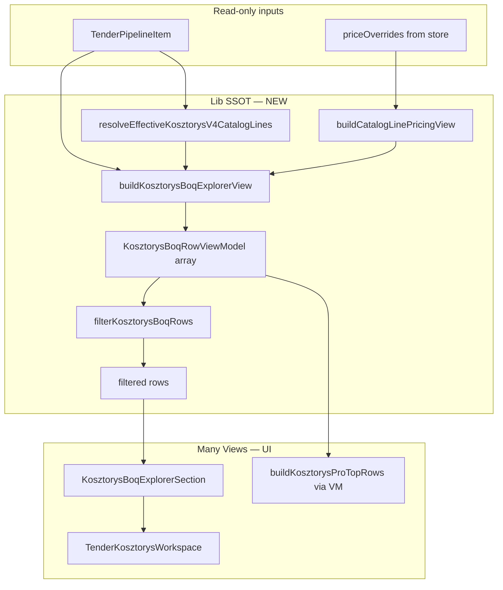

# NG-04.1 — BOQ Explorer · PLAN WYKONAWCZY

> **Status:** **PLAN ONLY** · gotowy do **IMPLEMENT**  
> **Data:** 2026-07-01  
> **Epic:** NG-04 — Kosztorys Workspace PRO  
> **Faza:** **NG-04.1** — BOQ Explorer  
> **Baseline prod:** **v2.63.8** · commit **`f482016`**  
> **Design freeze:** [`NG-04-DESIGN-FREEZE.md`](NG-04-DESIGN-FREEZE.md) · Principle **#001**  
> **Audyt:** [`audit/NG-04-KOSZTORYS-WORKSPACE-PRO-AUDIT.md`](../audit/NG-04-KOSZTORYS-WORKSPACE-PRO-AUDIT.md)

**Nie implementuj bez tego planu.** Zakaz zmian: NG-02 runtime, parsery ATH/PDF, `athPreviewToSnapshot`, `TenderDetailPage` contract.

---

## 0. Cel NG-04.1

Zastąpić tabelę „Pełny kosztorys” (tylko `catalogQuantities`) **BOQ Explorerem**: jeden ViewModel wiersza, search, unified tabela/karty z kolumnami ilościowymi + ATH (gdy priced) + WGDOM (wycena katalogowa).

| W scope NG-04.1 | Poza scope (kolejne fazy) |
|-----------------|---------------------------|
| `buildKosztorysBoqExplorerView()` — SSOT merge | Benchmark badge per linia → **NG-04.2** |
| Search / filter tekstowy + reuse filtry branżowe | Tooltip FOUND_NO_VALUE polish → **NG-04.3** |
| `KosztorysBoqExplorerSection` UI (table + mobile) | Override edit UI → **Ceny tab** |
| Refactor TOP 20 na ViewModel slice | R/M/S w snapshot → backlog G-02 |
| Testy regresji + nowy test pack | HelpView / EPIC close → **NG-04.4** |

---

## 1. Założenia obowiązkowe (checklist)

- [x] **Reuse First** — `TenderMobileRowCard`, `TenderDesktopTable`, filtry z `tender-kosztorys-pro-dashboard`
- [x] **SSOT First** — merge tylko w `src/lib/tender-kosztorys-boq-explorer.ts`
- [x] **Zero Duplicate Logic** — Principle #001: One BOQ Row · One ViewModel · Many Views
- [x] **Runtime NG-02** — `useTenderPipelineRuntime` **bez zmian**
- [x] **Parsery** — `ath-parser.ts`, `pdf-przedmiar-heuristic.ts`, `athPreviewToSnapshot` **bez zmian**
- [x] **UI shell** — rozszerzyć **`TenderKosztorysWorkspace.tsx`** (+ wydzielone komponenty prezentacyjne jako dzieci)

---

## 2. Architektura docelowa NG-04.1



---

## 3. Lista plików

### 3.1 Nowe pliki

| Plik | Typ | Rola |
|------|-----|------|
| `src/lib/tender-kosztorys-boq-explorer.ts` | **lib SSOT** | Typy ViewModel, merge ATH+WGDOM, `buildKosztorysBoqExplorerView`, `filterKosztorysBoqRows`, `matchAthPricedRow` |
| `src/app/kosztorys/KosztorysBoqExplorerSection.tsx` | **UI** | Search input, filtry chips (props), tabela desktop + karty mobile |
| `src/app/kosztorys/KosztorysBoqRowFields.tsx` | **UI** | Pure render helpers pól wiersza (Many Views — wspólne mobile/desktop) |
| `scripts/test-ng04-kosztorys-boq-explorer.mjs` | **test** | Unit merge, search, edge cases (T01–T20) |

### 3.2 Pliki do modyfikacji

| Plik | Zmiana | Ryzyko |
|------|--------|--------|
| `src/app/TenderKosztorysWorkspace.tsx` | Zamiana `KosztorysCatalogTable` + lokalnej logiki filtrów na `KosztorysBoqExplorerSection`; `useMemo` ViewModel | **MEDIUM** |
| `src/lib/tender-kosztorys-pro-dashboard.ts` | `buildKosztorysProTopRows` czyta slice ViewModel zamiast własnego `lineValuePln` map | **LOW** |
| `scripts/test-v41-kosztorys-workspace.mjs` | T10–T12: BOQ Explorer mount contract, search, brak regresji empty states | **LOW** |
| `src/app/changelog-data.ts` | Wpis release **2.63.9** (na końcu IMPLEMENT) | **LOW** |
| `docs/NG-04-DESIGN-FREEZE.md` | Principle #001 (done) | — |
| `audit/NG-04-KOSZTORYS-WORKSPACE-PRO-AUDIT.md` | Link do planu (opcjonalny) | — |

### 3.3 Pliki — **NIE DOTYKAĆ** w NG-04.1

| Plik | Powód |
|------|-------|
| `src/app/hooks/useTenderPipelineRuntime.ts` | Runtime NG-02 frozen |
| `src/lib/ath-parser.ts` | Parser frozen |
| `src/lib/pdf-przedmiar-heuristic.ts` | Parser frozen |
| `src/lib/tenders-bzp-brief.ts` (`athPreviewToSnapshot`) | Snapshot shape frozen |
| `src/lib/tender-dossier-pipeline.ts` | Heavy parse frozen |
| `src/app/TenderDetailPage.tsx` | Mount contract bez zmian |
| `src/lib/tender-catalog-line-pricing.ts` | Pricing engine — tylko **import**, bez edycji logiki |
| `src/app/TenderBidProposalPanel.tsx` | Ceny tab — bez duplikacji BOQ |
| `src/app/TenderCatalogLinePricingSection.tsx` | NG-04.2 benchmark reuse |

### 3.4 Pliki — import only (reuse bez fork)

| Plik | Użycie |
|------|--------|
| `src/lib/tender-detail-v4-display.ts` | `resolveEffectiveKosztorysV4CatalogLines`, `extractKatalogHintFromDescription`, `resolveTenderPricingCatalogForDisplay` |
| `src/lib/tender-data-ssot.ts` | `resolvedCostStatus` → flaga `hasAthPrices` w ViewModel meta |
| `src/lib/tender-price-overrides.ts` | `getTenderPriceOverrides` |
| `src/app/tenders/mobile/tender-mobile-row-cards.tsx` | Shell tabeli |

---

## 4. Specyfikacja lib SSOT (`tender-kosztorys-boq-explorer.ts`)

### 4.1 Typy (export)

```typescript
export interface KosztorysBoqRowViewModel {
  rowKey: string;                    // stabilny klucz React: lp lub hash opisu
  lp: string;
  description: string;
  unit: string;
  quantity: string;
  knrHint: string;
  athUnitPrice: string | null;
  athTotal: string | null;
  athMatched: boolean;               // true gdy merge z rows[]
  wgdomUnitPln: number | null;
  wgdomLinePln: number | null;
  wgdomPriced: boolean;
  pricing: CatalogLinePricingRow | null;
  isUnknown: boolean;
  searchText: string;                // precomputed fold dla Search First
}

export interface KosztorysBoqExplorerView {
  rows: KosztorysBoqRowViewModel[];
  meta: {
    totalRows: number;
    athPricedCount: number;
    wgdomPricedCount: number;
    hasAthPrices: boolean;           // resolvedCostStatus FOUND_WITH_VALUE
    sourceFilename: string | null;
    catalogSourceLabel: string;
  };
}
```

### 4.2 Builder

```typescript
export function buildKosztorysBoqExplorerView(opts: {
  item: TenderPipelineItem;
  priceOverrides?: TenderPriceOverrideEntry[];
}): KosztorysBoqExplorerView;
```

**Algorytm merge (freeze):**

1. Anchor: `resolveEffectiveKosztorysV4CatalogLines(item)` — jak dziś.
2. Index ATH: `Map` po `normalizeLp(lp)`; secondary index po `normalizeDescPrefix(description, 80)`.
3. Dla każdej linii catalog: `matchAthPricedRow(catalogLine, athIndex)`.
4. Pricing: jeden call `buildCatalogLinePricingView(catalog, …)` → `Map` po `lp`.
5. `searchText` = fold(lp + description + knrHint + unit).
6. **Nie** iterować `rows` bez odpowiadającej catalog line (orphan ATH → meta counter opcjonalny, nie w tabeli NG-04.1).

### 4.3 Search

```typescript
export function filterKosztorysBoqRows(
  rows: KosztorysBoqRowViewModel[],
  opts: {
    query?: string;
    categoryFilter?: KosztorysProFilterId;  // reuse filterCatalogLinesByConstructionCategory
  },
): KosztorysBoqRowViewModel[];
```

- Query: case-insensitive, fold PL diacritics (reuse pattern z `foldConstructionText` lub lokalny `foldBoqSearch`).
- Puste query → pass-through.
- Category filter: delegacja do `lineMatchesConstructionFilter` (istniejący).

---

## 5. Specyfikacja UI

### 5.1 `KosztorysBoqExplorerSection`

**Props:**

```typescript
{
  view: KosztorysBoqExplorerView;
  categoryFilter: KosztorysProFilterId;
  onCategoryFilterChange: (id: KosztorysProFilterId) => void;
  previewLimit?: number;  // default 20
}
```

**Sekcje:**

1. **Search** — `<input type="search">` sticky w sekcji (`data-kosztorys-boq-search`), `aria-label="Szukaj pozycji kosztorysu"`.
2. **Filtry branżowe** — przeniesione z workspace (reuse `KOSZTORYS_PRO_FILTER_OPTIONS`).
3. **Tabela unified** — kolumny NG-04.1:

| Kolumna | NG-04.1 | Uwaga |
|---------|---------|-------|
| Lp, Opis, j.m., Ilość, KNR | ✅ | |
| Cena ATH, Wartość ATH | ✅ | „—” gdy brak; bez tooltip (04.3) |
| Cena WGDOM, Wartość WGDOM | ✅ | fmtPln |
| Benchmark | ❌ | NG-04.2 |

4. **Paginacja** — reuse pattern `showAllRows` / `previewLimit=20`.
5. **Empty states** — gdy filter → `kosztorysFilterEmptyMessage`; gdy search 0 wyników → „Brak pozycji dla zapytania …”.

**data-* atrybuty (testy / E2E):**

- `data-kosztorys-boq-explorer`
- `data-kosztorys-boq-row-count`
- `data-kosztorys-boq-search`

### 5.2 Zmiany w `TenderKosztorysWorkspace.tsx`

| As-is | NG-04.1 |
|-------|---------|
| `buildKosztorysV4Display` → `catalogRows` → `KosztorysCatalogTable` | `buildKosztorysBoqExplorerView` → `KosztorysBoqExplorerSection` |
| Lokalny `filteredCatalogLines` + `visibleRows` | `filterKosztorysBoqRows(view.rows, { query, categoryFilter })` |
| Banner `rows_fallback` | Usunąć z UI prod; zostawić `data-kosztorys-source=rows_fallback` tylko gdy `buildKosztorysV4Display().source === 'rows_fallback'` (dev) |
| `KosztorysCatalogTable` (local function) | **Usunąć** po migracji |

**Bez zmian:** Process bar, Trust, KPI hero, PRO dashboard, TOP 20 section, ATH CTA, category chips ATH, modal.

---

## 6. Kolejność implementacji

```text
Krok 1  lib/types + merge + tests T01–T12     (pure, bez UI)
Krok 2  search/filter pure + tests T13–T16
Krok 3  KosztorysBoqRowFields + KosztorysBoqExplorerSection (presentational)
Krok 4  TenderKosztorysWorkspace integracja
Krok 5  tender-kosztorys-pro-dashboard TOP 20 → ViewModel
Krok 6  test-v41 rozszerzenie T10–T12
Krok 7  build + pełny regression pack
Krok 8  changelog 2.63.9 (przed commit na polecenie)
```

### Krok 1 — Lib merge (bloker)

- Utworzyć `tender-kosztorys-boq-explorer.ts`.
- Zaimplementować `normalizeLp`, `matchAthPricedRow`, `buildKosztorysBoqExplorerView`.
- Test: `test-ng04-kosztorys-boq-explorer.mjs` T01–T12.

**DoD:** merge TP182-like fixture: catalog 3 linie, ATH 3 priced, 1 bez ATH match → `athMatched=false`.

### Krok 2 — Search

- `filterKosztorysBoqRows` + `searchText` precompute.
- Test T13–T16: query po opisie, LP, KNR; filter branżowy + search razem.

### Krok 3 — UI components

- `KosztorysBoqRowFields.tsx` — format ATH/WGDOM display strings.
- `KosztorysBoqExplorerSection.tsx` — bez logiki merge.

### Krok 4 — Workspace integracja

- Podłączyć ViewModel w `useMemo([item, priceOverridesRevision])`.
- `priceOverridesRevision` — workspace **nie** ma dziś props; czytać store jak dashboard **lub** dodać opcjonalny prop z `TenderDetailPage` **bez** zmiany runtime — **preferencja planu:** czytać `loadTenderPriceOverridesStoreLocal()` w `useMemo` jak `buildKosztorysProDashboard` (zero zmian `TenderDetailPage`).

### Krok 5 — TOP 20 refactor

- `buildKosztorysProTopRows(pricingRows)` → `buildKosztorysProTopRowsFromBoqView(view)` slice sort po `wgdomLinePln`.
- Zachować istniejący export jako thin wrapper dla Ceny tab jeśli używany — grep przed edycją.

### Krok 6–7 — Regresja

- Uruchomić pełny pack (§8).
- Naprawić tylko regresje w scope.

---

## 7. Zależności między komponentami

```text
TenderDetailPage
  └─ TenderKosztorysWorkspace
       ├─ KosztorysProcessStatusBar          [bez zmian]
       ├─ buildKosztorysProDashboard         [krok 5: zależy od ViewModel]
       ├─ buildKosztorysBoqExplorerView      [NOWY lib — krok 1]
       │    ├─ resolveEffectiveKosztorysV4CatalogLines
       │    ├─ buildCatalogLinePricingView
       │    └─ resolvedCostStatus
       ├─ filterKosztorysBoqRows             [krok 2]
       └─ KosztorysBoqExplorerSection        [krok 3–4]
            ├─ KosztorysBoqRowFields
            ├─ TenderMobileRowCard
            └─ TenderDesktopTable
```

| Zależność | Kierunek | Uwaga |
|-----------|----------|-------|
| ViewModel → Section | 1:N | Section nigdy nie woła pricing lib bezpośrednio |
| Dashboard → ViewModel | optional | Ten sam `useMemo` w workspace, przekazać `view` do dashboard buildera |
| Trust → Workspace | bez zmian | Trust nie czyta ViewModel |
| Ceny tab → pricing lib | izolacja | Brak importu BOQ explorer w BidProposalPanel |

---

## 8. Plan testów

### 8.1 Nowy — `test-ng04-kosztorys-boq-explorer.mjs`

| ID | Scenariusz | Asercja |
|----|------------|---------|
| T01 | Pusty dossier | `rows.length === 0` |
| T02 | Catalog 2 linie, brak rows | `athMatched=false`, ATH null |
| T03 | Catalog + rows po LP | `athUnitPrice` populated |
| T04 | LP mismatch, opis prefix match | fallback merge |
| T05 | LP mismatch, opis mismatch | brak ATH |
| T06 | Pricing classified | `wgdomLinePln > 0` |
| T07 | Pricing UNKNOWN | `isUnknown=true` |
| T08 | FOUND_WITH_VALUE meta | `hasAthPrices=true` |
| T09 | PDF / FOUND_NO_VALUE | `hasAthPrices=false`, ATH null |
| T10 | 500 catalog cap | `rows.length <= 500` |
| T11 | Search po opisie | filter zwraca subset |
| T12 | Search fold ą→a | „malowanie” znajduje „Malowanie” |
| T13 | Filter elektryczne + search | intersection |
| T14 | rowKey stabilność | ten sam lp → ten sam key |
| T15 | Orphan ATH rows | nie pojawiają się w output |
| T16 | Principle #001 | jeden builder, dwa filtry → ta sama długość bazowa |

**Gate:** 16/16 PASS.

### 8.2 Rozszerzenie — `test-v41-kosztorys-workspace.mjs`

| ID | Scenariusz |
|----|------------|
| T10 | `buildKosztorysBoqExplorerView` nie psuje `resolveEffectiveKosztorysV4CatalogLines` count |
| T11 | Formal document → 0 rows (spójność z V4 empty) |
| T12 | `rows_fallback` source — ViewModel nadal z effective catalog jeśli jest |

### 8.3 Regression pack (obowiązkowy przed merge)

```bash
npx vite-node scripts/test-ng04-kosztorys-boq-explorer.mjs
npx vite-node scripts/test-v41-kosztorys-workspace.mjs
npx vite-node scripts/test-tender-kosztorys-process-phase.mjs
npx vite-node scripts/test-tender-kosztorys-process-health.mjs
npx vite-node scripts/test-tp200b-snapshot-fidelity.mjs
npx vite-node scripts/test-tender-price-bridge.mjs
npx vite-node scripts/test-tender-dossier-pipeline.mjs
npm run build
```

### 8.4 Manual smoke (post-deploy)

| ID | Kroki | Oczekiwane |
|----|-------|------------|
| M1 | Przetarg z ATH priced → Kosztorys | BOQ Explorer widoczny, kolumny ATH + WGDOM |
| M2 | Search fragment opisu | Lista filtruje się live |
| M3 | Filtr Elektryczne | Subset pozycji |
| M4 | PDF przedmiar (brak cen) | ATH „—”, WGDOM wycena jeśli classified |
| M5 | Mobile ≤390px | Karty, search dostępny |
| M6 | Zakładka Ceny | Bez regresji — tabela wyceny działa |
| M7 | Pełny podgląd ATH | Modal bez zmian |

---

## 9. Analiza regresji

| Obszar | Ryzyko | Mitigacja |
|--------|--------|-----------|
| **Merge LP/opis** | **HIGH** | T03–T05 golden fixtures; nie zmieniać algorytmu bez testu |
| **`buildCatalogLinePricingView`** | **HIGH** | Import only; zero edycji |
| **TOP 20 wartości** | **MEDIUM** | Krok 5 + porównanie sumy przed/po na fixture |
| **Empty states formal doc** | **MEDIUM** | T11; reuse `resolveEffectiveKosztorysV4CatalogLines` |
| **Process / trust / lazy parse** | **LOW** | Brak zmian hooków |
| **Ceny tab** | **LOW** | Nie dotykać BidProposalPanel |
| **TP200B snapshot** | **LOW** | Brak zmian snapshot |
| **Mobile layout** | **MEDIUM** | M5; reuse cards |
| **Performance 500 rows** | **MEDIUM** | `useMemo` na view; filter po view, nie re-merge |
| **Search PL diacritics** | **LOW** | T12 |

### SSOT compliance

| Reguła | NG-04.1 |
|--------|---------|
| SSOT FIRST | ✅ jeden lib builder |
| Reuse First | ✅ mobile shell, filtry, pricing view |
| Zero Duplicate Logic | ✅ Principle #001 |
| Search First | ✅ obowiązkowy search |
| URL tab SSOT | ✅ bez zmian |

---

## 10. Plan rollout NG-04.1

### 10.1 Wersjonowanie

| Pole | Wartość |
|------|---------|
| **Wersja** | **2.63.9** |
| **Label** | `NG-04.1 — Kosztorys BOQ Explorer` |
| **Typ zmian** | UI + pure lib (brak migracji KV) |

### 10.2 Bundle commit (propozycja)

```text
feat(tenders): NG-04.1 Kosztorys BOQ Explorer — unified ViewModel + search

- buildKosztorysBoqExplorerView (Principle #001)
- KosztorysBoqExplorerSection replaces catalog-only table
- test-ng04-kosztorys-boq-explorer.mjs
```

**Pliki w bundle:** wyłącznie §3.1 + §3.2 (bez audit/docs jeśli osobny commit docs).

### 10.3 Workflow

```text
IMPLEMENT (kroki 1–7)
  → TEST (§8.1–8.3) — 0 FAIL
  → BUILD — PASS
  → COMMIT — na wyraźne polecenie
  → PUSH main — na polecenie
  → VERIFY — curl https://www.wgdom.fun/version.json → 2.63.9
  → Manual M1–M7
```

### 10.4 Production impact

| Warstwa | Impact |
|---------|--------|
| **Supabase / KV / sync** | **NONE** |
| **Parsery / dossier** | **NONE** |
| **Użytkownik** | **LOW** — bogatsza tabela Kosztorys; zachowanie parse bez zmian |
| **Rollback** | Revert commit UI+lib; brak migracji danych |

### 10.5 Po rollout

- Zaktualizować `CURRENT-TASK.md` — NG-04.1 DONE · następny NG-04.2
- Opcjonalny `SESSION-HANDOFF-NG-04.1.md` przy EPIC milestone
- **Nie** zamykać epica NG-04 — tylko faza 04.1

---

## 11. Kryteria ukończenia (Definition of Done)

- [ ] `buildKosztorysBoqExplorerView` jest jedynym merge point (Principle #001)
- [ ] `TenderKosztorysWorkspace` używa `KosztorysBoqExplorerSection`
- [ ] Search + filtry branżowe działają na ViewModel
- [ ] `test-ng04` 16/16 PASS
- [ ] Regression pack §8.3 PASS
- [ ] `npm run build` PASS
- [ ] Brak zmian w plikach §3.3
- [ ] Changelog 2.63.9 przygotowany
- [ ] Manual M1–M7 checklist w handoff (po deploy)

---

## 12. Następna faza po NG-04.1

| Faza | Scope |
|------|-------|
| **NG-04.2** | Benchmark badge per linia — reuse `LaborBenchmarkStatusBadge` w `KosztorysBoqRowFields` |
| **NG-04.3** | Tooltip ATH FOUND_NO_VALUE / priced partial |
| **NG-04.4** | HelpView, polish, EPIC CLOSE |

---

## 13. Powiązane dokumenty

- [`NG-04-DESIGN-FREEZE.md`](NG-04-DESIGN-FREEZE.md) — Principle #001
- [`audit/NG-04-KOSZTORYS-WORKSPACE-PRO-AUDIT.md`](../audit/NG-04-KOSZTORYS-WORKSPACE-PRO-AUDIT.md)
- [`WORKFLOW-ARCHITECTURE-v2.63.md`](WORKFLOW-ARCHITECTURE-v2.63.md) § 5.3
