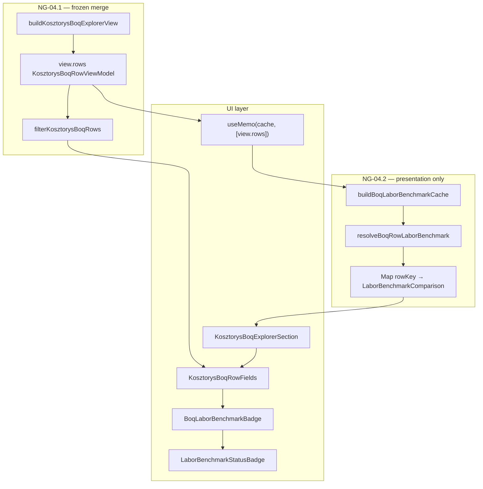

# NG-04.2 — Benchmark per Line · PLAN WYKONAWCZY

> **Status:** **PLAN ONLY** · gotowy do **IMPLEMENT**  
> **Data:** 2026-07-01  
> **Epic:** NG-04 — Kosztorys Workspace PRO  
> **Faza:** **NG-04.2** — Benchmark per Line  
> **Baseline prod:** **v2.63.9** · commit **`5112718`**  
> **Design freeze:** [`NG-04.2-DESIGN-FREEZE.md`](NG-04.2-DESIGN-FREEZE.md) · Principles **#001–#005**  
> **Audyt:** [`audit/NG-04.2-BENCHMARK-PER-LINE-AUDIT.md`](../audit/NG-04.2-BENCHMARK-PER-LINE-AUDIT.md)

**Nie implementuj bez tego planu.** Zakaz zmian: NG-02 runtime, parsery ATH/PDF, `buildKosztorysBoqExplorerView` merge logic, `TenderDetailPage` contract.

---

## 0. Cel NG-04.2

Dodać kolumnę / pole **Benchmark robocizny** (badge compact) do BOQ Explorer — per pozycja, read-only, bez nowego modelu danych.

| W scope NG-04.2 | Poza scope |
|-----------------|------------|
| `resolveBoqRowLaborBenchmark()` — pure view helper | ATH benchmark |
| `buildBoqLaborBenchmarkCache()` — derived UI cache (#005) | Wpływ finansowy (zł) per linia |
| `BoqLaborBenchmarkBadge` — adapter UI | `LaborBenchmarkCell` / tooltip (→ NG-04.3) |
| Kolumna desktop + pole mobile w BOQ Explorer | Filtr „poza benchmarkiem” |
| Test pack + M8.2 gate | `market-average-engine` |
| Changelog **2.63.10** (na końcu IMPLEMENT) | Zmiany tab Ceny |

---

## 1. Założenia obowiązkowe (checklist)

- [x] **#001** — badge w `KosztorysBoqRowFields` / `BoqLaborBenchmarkBadge`; jeden `KosztorysBoqRowViewModel`
- [x] **#002** — cache budowany raz per `view.rows`; search/filter nie rebuild ViewModel
- [x] **#003** — `tender-kosztorys-boq-explorer.ts` **bez** importu benchmark
- [x] **#004** — brak pól `benchmark*` w ViewModel; tylko `row.pricing`
- [x] **#005** — `useMemo` cache na `view.rows`; lookup przy renderze wiersza
- [x] **Reuse First** — `LaborBenchmarkStatusBadge`, `compareLaborRateToBenchmark`
- [x] **Zero Duplicate Logic** — jeden algorytm `labor-benchmark.ts`
- [x] **Runtime NG-02** — bez zmian
- [x] **Parsery** — bez zmian

---

## 2. Architektura docelowa NG-04.2



### 2.1 Przepływ danych (freeze)

```text
item change / overrides revision
  → useMemo: boqView = buildKosztorysBoqExplorerView({ item })     [#002 · #003]

mount / boqView.rows reference change
  → useMemo: benchmarkCache = buildBoqLaborBenchmarkCache(boqView.rows)  [#005]

searchQuery / categoryFilter change
  → useMemo: filteredRows = filterKosztorysBoqRows(boqView.rows, …)   [#003]
  → benchmarkCache UNCHANGED (ta sama referencja Map)

render row
  → BoqLaborBenchmarkBadge(row, benchmarkCache)
  → cache.get(row.rowKey) → LaborBenchmarkStatusBadge compact
```

---

## 3. Lista plików

### 3.1 Nowe pliki

| Plik | Typ | Rola |
|------|-----|------|
| `src/lib/tender-kosztorys-boq-benchmark.ts` | **lib pure** | `resolveBoqRowLaborBenchmark`, `buildBoqLaborBenchmarkCache` |
| `src/app/kosztorys/BoqLaborBenchmarkBadge.tsx` | **UI adapter** | Cache lookup + `LaborBenchmarkStatusBadge`; zero logiki biznesowej |
| `scripts/test-ng04-2-benchmark-per-line.mjs` | **test** | T01–T12 unit + static gates |

### 3.2 Pliki do modyfikacji

| Plik | Zmiana | Ryzyko |
|------|--------|--------|
| `src/app/kosztorys/KosztorysBoqExplorerSection.tsx` | `useMemo` → `buildBoqLaborBenchmarkCache(view.rows)`; przekazanie cache do wierszy | **LOW** |
| `src/app/kosztorys/KosztorysBoqRowFields.tsx` | Kolumna `<td>` + pole mobile „Benchmark rbh”; użycie `BoqLaborBenchmarkBadge` | **LOW** |
| `scripts/test-ng04-m8-large-boq-performance.mjs` | Sekcja **M8.2** — cache build, brak recompute on filter | **LOW** |
| `scripts/test-v41-kosztorys-workspace.mjs` | T14–T15: nagłówek Benchmark, mount contract | **LOW** |
| `docs/NG-04.2-DESIGN-FREEZE.md` | Status IMPLEMENT READY; #005; `BoqLaborBenchmarkBadge` | — |
| `docs/NG-04-DESIGN-FREEZE.md` | §1.4–1.5 po release (opcjonalnie w IMPLEMENT) | — |
| `src/app/changelog-data.ts` | Wpis **2.63.10** (koniec IMPLEMENT) | **LOW** |
| `CHANGELOG.md` | Skrót 2.63.10 | **LOW** |

### 3.3 Pliki — **NIE DOTYKAĆ**

| Plik | Powód |
|------|-------|
| `src/lib/tender-kosztorys-boq-explorer.ts` | #003 — merge bez benchmark |
| `src/lib/labor-benchmark.ts` | SSOT algorytm — import only |
| `src/lib/labor-benchmark-data.ts` | SSOT zakresy |
| `src/lib/tender-catalog-line-pricing.ts` | SSOT wycena |
| `src/lib/tender-kosztorys-pro-dashboard.ts` | `marketHint` bez zmian |
| `src/app/hooks/useTenderPipelineRuntime.ts` | NG-02 frozen |
| `src/lib/ath-parser.ts` · `pdf-przedmiar-heuristic.ts` | Parser frozen |
| `src/app/TenderDetailPage.tsx` | Mount contract |
| `src/app/TenderBidProposalPanel.tsx` | Ceny tab |
| `src/app/TenderCatalogLinePricingSection.tsx` | Bez zmian funkcjonalnych |
| `src/app/LaborBenchmarkUi.tsx` | Reuse bez fork |

### 3.4 Import only (reuse)

| Moduł | Użycie |
|-------|--------|
| `@/lib/labor-benchmark` | `compareLaborRateToBenchmark`, `LaborBenchmarkComparison` |
| `@/lib/wgdom-cost-catalog` | `normalizeWgdomCostUnit` |
| `@/app/LaborBenchmarkUi` | `LaborBenchmarkStatusBadge` |

---

## 4. Specyfikacja komponentów i helperów

### 4.1 `resolveBoqRowLaborBenchmark(row)` — lib pure

```typescript
// src/lib/tender-kosztorys-boq-benchmark.ts

export function resolveBoqRowLaborBenchmark(
  row: KosztorysBoqRowViewModel,
): LaborBenchmarkComparison | null
```

| Warunek | Zwrot |
|---------|-------|
| `row.isUnknown` | `null` |
| `!row.pricing` | `null` |
| `laborPlnPerUnit` null / ≤ 0 | `null` |
| `normalizeWgdomCostUnit(unit)` null | `null` |
| `compareLaborRateToBenchmark(…).status === "unavailable"` | `null` |
| inaczej | `LaborBenchmarkComparison` |

**Bez** `options.history` — compact badge only (#004).

### 4.2 `buildBoqLaborBenchmarkCache(rows)` — lib pure (#005)

```typescript
export function buildBoqLaborBenchmarkCache(
  rows: readonly KosztorysBoqRowViewModel[],
): ReadonlyMap<string, LaborBenchmarkComparison>
```

- Iteruje `rows`; dla każdego `rowKey` woła `resolveBoqRowLaborBenchmark`
- Pomija wpisy `null` (brak klucza w Map)
- **Nie** mutuje `rows`
- Używany wyłącznie z `useMemo([view.rows])` w sekcji

### 4.3 `BoqLaborBenchmarkBadge` — UI adapter

```typescript
// src/app/kosztorys/BoqLaborBenchmarkBadge.tsx

export function BoqLaborBenchmarkBadge({
  rowKey,
  cache,
}: {
  rowKey: string;
  cache: ReadonlyMap<string, LaborBenchmarkComparison>;
}): JSX.Element | null
```

| Odpowiedzialność | Tak / Nie |
|------------------|-----------|
| `cache.get(rowKey)` | ✅ |
| `LaborBenchmarkStatusBadge` compact | ✅ |
| `resolveBoqRowLaborBenchmark` | ❌ (tylko w `buildBoqLaborBenchmarkCache`) |
| `compareLaborRateToBenchmark` | ❌ |
| Własne progi / kolory | ❌ |

Brak wpisu w cache → render `null` (ukryty badge).

### 4.4 Integracja w `KosztorysBoqExplorerSection`

```typescript
const benchmarkCache = useMemo(
  () => buildBoqLaborBenchmarkCache(view.rows),
  [view.rows],
);

// filteredRows — bez benchmarkCache w deps
const filteredRows = useMemo(
  () => filterKosztorysBoqRows(view.rows, { query: searchQuery, categoryFilter }),
  [view.rows, searchQuery, categoryFilter],
);
```

Przekazanie `benchmarkCache` do `BoqRowDesktopCells` / `boqRowMobileFields` (prop drilling 1 poziom).

### 4.5 Delta UI

**Desktop** — nowa kolumna po „Wartość WGDOM”:

| Nagłówek | Zawartość |
|----------|-----------|
| `Benchmark` | `<BoqLaborBenchmarkBadge rowKey={row.rowKey} cache={benchmarkCache} />` |

**Mobile** — pole w `boqRowMobileFields`:

```typescript
{ label: "Benchmark rbh", value: <BoqLaborBenchmarkBadge … /> }  // lub helper zwracający ReactNode
```

`data-kosztorys-boq-benchmark` na komórce (test contract).

---

## 5. Kolejność implementacji

| Krok | Zadanie | DoD |
|------|---------|-----|
| **1** | `tender-kosztorys-boq-benchmark.ts` — resolve + cache builder | `test-ng04-2` T01–T06 green |
| **2** | `BoqLaborBenchmarkBadge.tsx` | T07 render contract (mock cache) |
| **3** | `KosztorysBoqExplorerSection` — `useMemo` cache | T08 static: deps bez searchQuery |
| **4** | `KosztorysBoqRowFields` — kolumna + mobile | T09–T10 visual contract |
| **5** | `test-ng04-m8` — M8.2 | M8.2 PASS |
| **6** | `test-v41` T14–T15 | PASS |
| **7** | Pełna regresja + `npm run build` | wszystkie gates |
| **8** | Changelog 2.63.10 | na polecenie COMMIT |

**Zasada:** krok 1 przed UI; nie modyfikować `tender-kosztorys-boq-explorer.ts`.

---

## 6. Plan testów

### 6.1 Nowy: `scripts/test-ng04-2-benchmark-per-line.mjs`

| ID | Opis | Assert |
|----|------|--------|
| T01 | Classified row ELEKTRYKA, labor w zakresie | status `ok`, cache ma `rowKey` |
| T02 | Labor powyżej max | status `above` |
| T03 | Labor poniżej min | status `below` |
| T04 | `isUnknown` | `resolve` → null, brak w cache |
| T05 | UNKNOWN category / brak zakresu j.m. | null |
| T06 | `buildBoqLaborBenchmarkCache` 500 rows | < 50 ms, size ≤ priced classified |
| T07 | Spójność z `compareLaborRateToBenchmark` direct | ten sam status |
| T08 | Static: `tender-kosztorys-boq-explorer.ts` | **nie** importuje `labor-benchmark` |
| T09 | Static: `filterKosztorysBoqRows` | **nie** importuje benchmark lib |
| T10 | Static: `BoqLaborBenchmarkBadge` | **nie** importuje `compareLaborRateToBenchmark` |
| T11 | Cache reference: ten sam `view.rows` po filter symulacji | ta sama Map instance (test lib) |
| T12 | `laborPlnPerUnit` z `pricing` = input compare | golden LP match |

### 6.2 Rozszerzenie: `test-ng04-m8-large-boq-performance.mjs` (M8.2)

| ID | Opis | Próg |
|----|------|------|
| M8.2.1 | `buildBoqLaborBenchmarkCache` 500 | < 50 ms |
| M8.2.2 | 50× filter — `benchmarkCache` referencja stable (mock useMemo pattern) | unchanged ref |
| M8.2.3 | Build ViewModel 500 — bez regresji vs 04.1 | < 2500 ms |
| M8.2.4 | Static explorer bez benchmark import | PASS |

### 6.3 Rozszerzenie: `test-v41-kosztorys-workspace.mjs`

| ID | Opis |
|----|------|
| T14 | `KosztorysBoqExplorerSection` source zawiera `buildBoqLaborBenchmarkCache` |
| T15 | `KosztorysBoqRowFields` / explorer zawiera `BoqLaborBenchmarkBadge` lub `Benchmark` header |

### 6.4 Regresja obowiązkowa (bez zmian skryptów)

```bash
npx vite-node scripts/test-ng04-kosztorys-boq-explorer.mjs
npx vite-node scripts/test-tender-kosztorys-process-phase.mjs
npx vite-node scripts/test-tender-kosztorys-process-health.mjs
npx vite-node scripts/test-tp200b-snapshot-fidelity.mjs
npx vite-node scripts/test-tender-price-bridge.mjs
npx vite-node scripts/test-labor-benchmark.mjs
npx vite-node scripts/test-labor-benchmark-pro.mjs
npm run build
```

### 6.5 Manual smoke (pre-release)

| Scenariusz | Oczekiwanie |
|------------|-------------|
| Desktop BOQ, 20 poz. | Kolumna Benchmark widoczna; badge OK/⚠ |
| Mobile ≤390px | Pole „Benchmark rbh” na karcie |
| Search aktywny | Badge na przefiltrowanych; brak lag |
| Filtr branżowy | j.w. |
| UNKNOWN pozycja | Brak badge |
| Tab Ceny | Bez regresji category summary |

---

## 7. Analiza regresji

| Obszar | Ryzyko | Mitigacja |
|--------|--------|-----------|
| Merge ViewModel (#003) | **NONE** | explorer.ts frozen |
| Search/filter perf (#002, #005) | **LOW** | M8.2 cache ref stable |
| TOP 20 | **NONE** | Bez zmian |
| ATH/WGDOM kolumny | **NONE** | Tylko nowa kolumna |
| `marketHint` KPI | **LOW** | dashboard.ts frozen |
| Tab Ceny | **LOW** | Brak zmian w pricing section |
| NG-02 phase | **NONE** | `test-tender-kosztorys-process-phase` |
| Bundle | **LOW** | Moduły już w graph (Ceny) |
| UX: outlier vs category avg | **INFO** | Dokumentowane w freeze §8 |

**Golden tenders:** TP182 · TP200B cap 500 · parser v4 stale.

---

## 8. Rollout

### 8.1 Wersja docelowa

| Pole | Wartość |
|------|---------|
| **Version** | **2.63.10** |
| **Label changelog** | NG-04.2 Benchmark per Line |
| **Epic** | NG-04 (faza 04.2) |

### 8.2 Workflow release

```text
IMPLEMENT (ten plan)
  → TEST (§6 pełna macierz)
  → BUILD (npm run build)
  → [na polecenie] COMMIT
  → PUSH main
  → VERIFY: curl https://www.wgdom.fun/version.json → 2.63.10
  → RELEASE REPORT (docs/RELEASE-REPORT-NG-04.2.md)
```

### 8.3 Pre-release gate

| Gate | Warunek |
|------|---------|
| M8 (04.1) | Bez regresji |
| M8.2 (04.2) | PASS |
| `test-ng04-2` | 12/12 |
| Build | PASS |
| Static #003 | explorer bez benchmark import |

### 8.4 Production impact

| Warstwa | Impact |
|---------|--------|
| KV / sync | **NONE** |
| Parsery | **NONE** |
| Tab Kosztorys | **LOW** — +1 kolumna |
| Tab Ceny | **NONE** |

### 8.5 Rollback

Revert commit NG-04.2 — BOQ Explorer wraca do stanu 04.1 (bez kolumny Benchmark). Brak migracji danych.

### 8.6 Po release

| Task | Faza |
|------|------|
| ATH tooltip FOUND_NO_VALUE | NG-04.3 |
| `LaborBenchmarkCell` expanded w BOQ | NG-04.3 |
| Filtr benchmark + EPIC close | NG-04.4 |
| Aktualizacja `NG-04-DESIGN-FREEZE.md` §1.4–1.5 | Po VERIFY |

---

## 9. Definition of Done (NG-04.2)

- [ ] `resolveBoqRowLaborBenchmark` + `buildBoqLaborBenchmarkCache` w lib
- [ ] `BoqLaborBenchmarkBadge` — adapter bez logiki biznesowej
- [ ] BOQ Explorer: kolumna Benchmark desktop + mobile
- [ ] `useMemo` cache keyed `[view.rows]` — search/filter poza deps cache
- [ ] Brak pól benchmark w `KosztorysBoqRowViewModel`
- [ ] `test-ng04-2` + M8.2 + regresja §6.4 PASS
- [ ] `npm run build` PASS
- [ ] RELEASE na polecenie (2.63.10)

---

## 10. Powiązane SSOT

| Dokument | Rola |
|----------|------|
| [`NG-04.2-DESIGN-FREEZE.md`](NG-04.2-DESIGN-FREEZE.md) | Principles #004–#005, adapter |
| [`NG-04-DESIGN-FREEZE.md`](NG-04-DESIGN-FREEZE.md) | #001–#003 epic |
| [`NG-04.1-BOQ-EXPLORER-IMPLEMENTATION-PLAN.md`](NG-04.1-BOQ-EXPLORER-IMPLEMENTATION-PLAN.md) | Wzorzec planu |
| [`audit/NG-04.2-BENCHMARK-PER-LINE-AUDIT.md`](../audit/NG-04.2-BENCHMARK-PER-LINE-AUDIT.md) | Mapa źródeł |

**Następny krok:** **IMPLEMENT** na polecenie „kontynuuj WGDOM” + scope **NG-04.2**.
