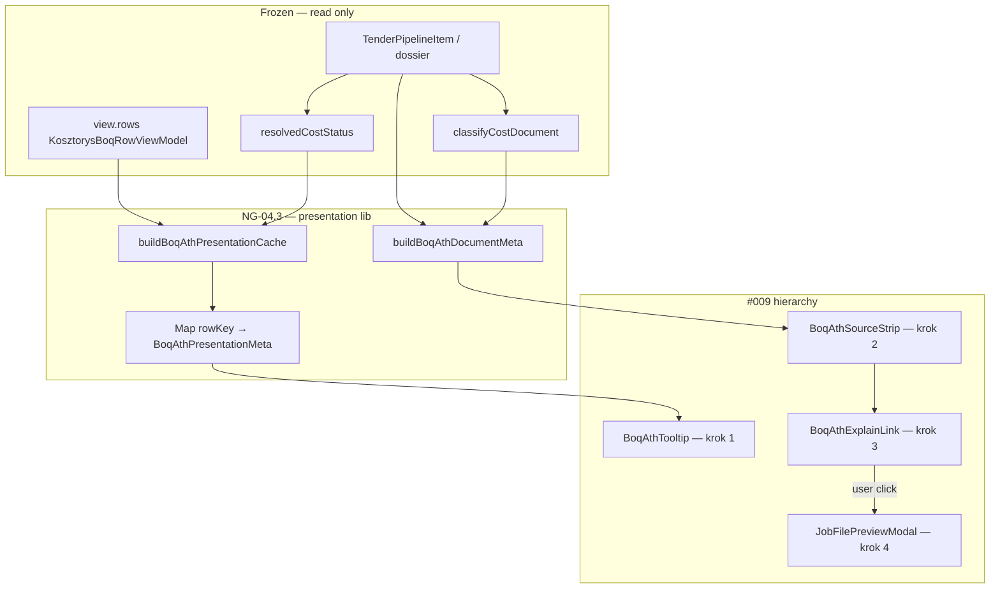

# NG-04.3 — ATH Fidelity · PLAN WYKONAWCZY

> **Status:** **PLAN ONLY** · gotowy do **IMPLEMENT**  
> **Data:** 2026-07-01  
> **Epic:** NG-04 — Kosztorys Workspace PRO  
> **Faza:** **NG-04.3** — ATH Fidelity  
> **Baseline prod:** **v2.63.10**  
> **Design freeze:** [`NG-04.3-DESIGN-FREEZE.md`](NG-04.3-DESIGN-FREEZE.md) · Principles **#001–#009**  
> **Audyt:** [`audit/NG-04.3-ATH-FIDELITY-AUDIT.md`](../audit/NG-04.3-ATH-FIDELITY-AUDIT.md)

**Nie implementuj bez tego planu.** Zakaz: parser z BOQ, rozszerzenie `KosztorysBoqRowViewModel`, kopiowanie tabel ATH, zmiany NG-02 runtime / `athPreviewToSnapshot`.

---

## 0. Cel NG-04.3

Użytkownik na BOQ Explorer **rozumie** komórki ATH (cena / „—”) i kontekst dokumentu — **bez re-parse** i **bez** duplikacji pełnej tabeli ATH.

| W scope NG-04.3 | Poza scope |
|-----------------|------------|
| Tooltip per komórka ATH (FOUND_NO_VALUE, no match, priced) | Inline R/M/S |
| Source chip + confidence (document-level) | Persist `code` w snapshot |
| CTA tekstowy → istniejący modal | Przedmiar formula per row |
| `buildBoqAthPresentationCache()` derived | Session `AthPreviewResult` cache |
| KNR hint tooltip „z opisu” | Parser / `athPreviewToSnapshot` |
| Test pack + regresja | OCR PDF case 3 |
| Changelog **2.63.11** (na końcu IMPLEMENT) | Auto-open modal |

---

## 1. Założenia obowiązkowe (checklist)

- [x] **#001–#003** — merge ViewModel bez ATH metadata; search ≠ merge
- [x] **#004–#007** — brak pól prezentacji w ViewModel; benchmark cache bez regresji
- [x] **#008** — Explain, Not Re-parse — zero `parseKosztorysBytes` w BOQ
- [x] **#009** — Explain Before Expand: tooltip → chip → CTA → modal
- [x] **Reuse** — Radix Tooltip, `resolvedCostStatus`, `classifyCostDocument`, `JobFilePreviewModal`
- [x] **NG-02 frozen** — `useTenderPipelineRuntime` bez zmian

---

## 2. Architektura docelowa (#008 · #009)



### 2.1 Przepływ danych (freeze)

```text
useMemo: boqView = buildKosztorysBoqExplorerView({ item })     [#002 · #003]

useMemo: athPresentationCache = buildBoqAthPresentationCache(
  boqView.rows,
  { costStatus: resolvedCostStatus(item) },
)                                                              [#007 · deps: view.rows + costStatus]

useMemo: athDocumentMeta = buildBoqAthDocumentMeta(item)       [#007 · deps: item id + dossier revision]

search / filter
  → filteredRows only; athPresentationCache UNCHANGED

render ATH cell
  → BoqAthTooltip(cache.get(rowKey))     [#009 krok 1]

render BOQ header
  → BoqAthSourceStrip(athDocumentMeta)   [#009 krok 2]
  → BoqAthExplainLink(onOpenPreview)     [#009 krok 3] — opcjonalny w strip

user clicks CTA / existing „Pełny podgląd ATH”
  → JobFilePreviewModal                  [#009 krok 4 — workspace handler]
```

---

## 3. Lista plików

### 3.1 Nowe pliki

| Plik | Typ | Rola |
|------|-----|------|
| `src/lib/tender-kosztorys-boq-ath-presentation.ts` | **lib pure** | `resolveBoqAthCellState`, `buildBoqAthPresentationCache`, `buildBoqAthDocumentMeta`, confidence buckets |
| `src/app/kosztorys/BoqAthTooltip.tsx` | **UI adapter** | Lookup cache → Radix Tooltip; **zero** resolve w TSX |
| `src/app/kosztorys/BoqAthSourceStrip.tsx` | **UI adapter** | Chip typ/confidence/plik |
| `src/app/kosztorys/BoqAthExplainLink.tsx` | **UI adapter** | Tekstowy CTA → `onOpenAthPreview` prop |
| `scripts/test-ng04-3-ath-fidelity.mjs` | **test** | T01–T14 |

### 3.2 Pliki do modyfikacji

| Plik | Zmiana | Ryzyko |
|------|--------|--------|
| `src/app/kosztorys/KosztorysBoqRowFields.tsx` | `BoqAthTooltip` przy Cena ATH / Wartość ATH | **LOW** |
| `src/app/kosztorys/KosztorysBoqExplorerSection.tsx` | `useMemo` caches; `BoqAthSourceStrip`; prop `onOpenAthPreview?` | **LOW** |
| `src/app/TenderKosztorysWorkspace.tsx` | Przekazanie `onOpenAthPreview` do sekcji (reuse istniejącego stanu modala) | **LOW** |
| `scripts/test-v41-kosztorys-workspace.mjs` | T18–T20: mount contract #009 | **LOW** |
| `scripts/test-ng04-m8-large-boq-performance.mjs` | M8.11 — ath cache perf + static | **LOW** |
| `src/app/changelog-data.ts` | **2.63.11** (koniec IMPLEMENT) | **LOW** |
| `CHANGELOG.md` | Skrót 2.63.11 | **LOW** |
| `docs/NG-04.3-DESIGN-FREEZE.md` | #009 (done) | — |

### 3.3 Pliki — **NIE DOTYKAĆ**

| Plik | Powód |
|------|-------|
| `src/lib/tender-kosztorys-boq-explorer.ts` | #003 — merge bez ATH presentation |
| `src/lib/ath-parser.ts` | Parser frozen |
| `src/lib/tenders-bzp-brief.ts` | Snapshot frozen |
| `src/lib/pdf-przedmiar-heuristic.ts` | Parser frozen |
| `useTenderPipelineRuntime.ts` | NG-02 |
| `JobFilePreviewModal.tsx` | Reuse bez fork (krok 4) |
| `src/lib/tender-kosztorys-boq-benchmark.ts` | 04.2 bez regresji |

---

## 4. Specyfikacja lib — `tender-kosztorys-boq-ath-presentation.ts`

### 4.1 `resolveBoqAthCellState(row, ctx)`

```typescript
export type BoqAthCellState =
  | "priced"
  | "no_value_doc"
  | "no_match"
  | "empty_priced_row";

export function resolveBoqAthCellState(
  row: KosztorysBoqRowViewModel,
  ctx: { costStatus: ResolvedCostStatus },
): BoqAthCellState
```

| Priorytet | Warunek | State |
|-----------|---------|-------|
| 1 | `costStatus === FOUND_NO_VALUE` | `no_value_doc` |
| 2 | `row.athMatched && row.athUnitPrice` | `priced` |
| 3 | `row.athMatched && !row.athUnitPrice` | `empty_priced_row` |
| 4 | default | `no_match` |

### 4.2 `buildBoqAthPresentationCache(rows, ctx)`

- Zwraca `ReadonlyMap<string, BoqAthPresentationMeta>`
- `tooltipPl` z mapy freeze §3 DESIGN FREEZE
- `knrHint` = `row.knrHint` pass-through; `knrHintSource: "description"`
- **Nie** woła parsera

### 4.3 `buildBoqAthDocumentMeta(item)`

```typescript
export function buildBoqAthDocumentMeta(
  item: TenderPipelineItem,
): BoqAthDocumentMeta | null
```

| Pole | SSOT |
|------|------|
| `sourceType` | `classifyCostDocument(item)?.type` |
| `sourceFilename` | `kosztorys.sourceFilename` |
| `confidenceLabel` | `scanSummary.costDiscovery.confidence` → bucket |
| `pdfCaseLabel` | `pdfPrzedmiarCase` 2/3 only |

**Confidence buckets (freeze):** ≥0.85 Wysoka · ≥0.6 Średnia · <0.6 Niska · brak → `null`.

---

## 5. Komponenty UI (#009)

### 5.1 `BoqAthTooltip` — krok 1

```typescript
export function BoqAthTooltip({
  rowKey,
  cache,
  children,  // formatted ATH value or "—"
}: {
  rowKey: string;
  cache: ReadonlyMap<string, BoqAthPresentationMeta>;
  children: React.ReactNode;
})
```

- `cache.get(rowKey)` → tooltip tylko gdy `athCellState !== "priced"` lub priced z opcjonalnym hintem
- Import: `@/app/components/ui/tooltip` (Radix)
- **Zakaz:** `resolveBoqAthCellState` w komponencie

### 5.2 `BoqAthSourceStrip` — krok 2

- Render pod tytułem „BOQ Explorer”, nad search
- Chips: `[ATH]` / `[PDF]` + confidence + skrócony filename (tooltip pełna ścieżka)
- `data-kosztorys-ath-source-strip`

### 5.3 `BoqAthExplainLink` — krok 3

- Tekst: „Szczegóły w pełnym podglądzie ATH” (lub reuse copy workspace)
- `onClick` → prop z `TenderKosztorysWorkspace` (ten sam handler co przycisk „Pełny podgląd ATH”)
- **Nie** otwiera modala sam z siebie przy mount

### 5.4 Modal — krok 4

- **Bez zmian** `JobFilePreviewModal`
- Workspace: jeden `previewItem` state — istniejący przycisk + opcjonalny link ze strip

---

## 6. Kolejność implementacji (#009 enforced)

| Krok | Zadanie | DoD | #009 |
|------|---------|-----|------|
| **1** | `tender-kosztorys-boq-ath-presentation.ts` + testy T01–T08 | lib green | — |
| **2** | `BoqAthTooltip` + integracja w `KosztorysBoqRowFields` | T09, manual „—” + tooltip | **krok 1** |
| **3** | `BoqAthSourceStrip` + `buildBoqAthDocumentMeta` w sekcji | T10–T11 | **krok 2** |
| **4** | `BoqAthExplainLink` + wire z workspace | T12 | **krok 3** |
| **5** | Verify modal path unchanged (smoke) | T13 | **krok 4** |
| **6** | M8.11 + `test-v41` T18–T20 + pełna regresja | all PASS | — |
| **7** | Changelog 2.63.11 | na polecenie COMMIT | — |

**Zasada:** kroki 2–4 **sekwencyjnie** — nie wdrażać CTA (4) przed tooltipami (2).

---

## 7. Plan testów

### 7.1 Nowy: `scripts/test-ng04-3-ath-fidelity.mjs`

| ID | Opis | Assert |
|----|------|--------|
| T01 | FOUND_NO_VALUE → `no_value_doc` | tooltip text contains „Przedmiar bez cen” |
| T02 | Priced row → `priced` | state priced |
| T03 | Matched, empty unit price → `empty_priced_row` | |
| T04 | Unmatched + FOUND_WITH_VALUE → `no_match` | |
| T05 | `buildBoqAthPresentationCache` 500 rows | < 50 ms |
| T06 | Cache stable ref po filter simulation | |
| T07 | `buildBoqAthDocumentMeta` — ATH type | sourceType ATH |
| T08 | Confidence 0.9 → „Wysoka” | bucket |
| T09 | Static: explorer bez `ath-presentation` import | #003 |
| T10 | Static: `BoqAthTooltip` bez `resolveBoqAthCellState` | #006 pattern |
| T11 | Static: sekcja bez `parseKosztorys` / `fetchAndParse` | #008 |
| T12 | Static: brak duplikatu tabeli ATH w `KosztorysBoqRowFields` | #009 |
| T13 | Static: workspace jeden `JobFilePreviewModal` | krok 4 |
| T14 | ViewModel type — brak `athTooltip` fields | #007 |

### 7.2 Rozszerzenie M8 — `M8.11`

| ID | Opis | Próg |
|----|------|------|
| M8.11.1 | `buildBoqAthPresentationCache(500)` | < 50 ms |
| M8.11.2 | 50× filter — ath cache ref stable | unchanged |
| M8.11.3 | Benchmark cache nadal stable | M8.10 PASS |

### 7.3 Rozszerzenie `test-v41-kosztorys-workspace.mjs`

| ID | Opis |
|----|------|
| T18 | `KosztorysBoqExplorerSection` importuje `buildBoqAthPresentationCache` |
| T19 | `BoqAthTooltip` w row fields |
| T20 | `BoqAthSourceStrip` + brak `parseKosztorysBytes` w sekcji |

### 7.4 Regresja obowiązkowa

```bash
npx vite-node scripts/test-ng04-3-ath-fidelity.mjs
npx vite-node scripts/test-ng04-2-benchmark-per-line.mjs
npx vite-node scripts/test-ng04-kosztorys-boq-explorer.mjs
npx vite-node scripts/test-ng04-m8-large-boq-performance.mjs
npx vite-node scripts/test-v41-kosztorys-workspace.mjs
npx vite-node scripts/test-tender-kosztorys-process-phase.mjs
npx vite-node scripts/test-tp200b-snapshot-fidelity.mjs
npx vite-node scripts/test-tender-price-bridge.mjs
npm run build
```

### 7.5 Manual smoke (#009)

| # | Scenariusz | Oczekiwanie |
|---|------------|-------------|
| M1 | PDF przedmiar FOUND_NO_VALUE | „—” + tooltip przedmiar bez cen |
| M2 | ATH priced TP fixture | Cena ATH bez alarmu; opcjonalny hint |
| M3 | Chip ATH/PDF widoczny przed kliknięciem modala | krok 2 przed 4 |
| M4 | CTA nie auto-otwiera modala przy wejściu na tab | #009 |
| M5 | Mobile card — tooltip na polu Cena ATH | touch ≥44px target na ⓘ |
| M6 | Benchmark kolumna bez regresji | 04.2 |

---

## 8. Analiza regresji

| Obszar | Ryzyko | Mitigacja |
|--------|--------|-----------|
| `KosztorysBoqRowViewModel` | **NONE** | static T14 |
| `buildKosztorysBoqExplorerView` | **NONE** | static T09 |
| NG-02 runtime | **NONE** | brak dotyku pipeline |
| Benchmark 04.2 | **LOW** | pełna regresja 04.2 |
| M8 search/filter | **LOW** | M8.11 stable cache |
| Modal / parse | **NONE** | reuse; static T11 |
| Tab Ceny / Trust | **LOW** | read-only SSOT |
| TP200B snapshot | **NONE** | bez zmian snapshot |
| UX clutter | **MEDIUM** | #009 hierarchy — tooltip minimal on priced rows |

**Golden:** TP182 · TP200B cap 500 · FOUND_NO_VALUE PDF fixture z `test-v41`.

---

## 9. Rollout

### 9.1 Wersja

| Pole | Wartość |
|------|---------|
| **Version** | **2.63.11** |
| **Label** | NG-04.3 ATH Fidelity |
| **Epic** | NG-04 faza 04.3 |

### 9.2 Workflow

```text
IMPLEMENT (ten plan, kolejność §6)
  → TEST (§7)
  → BUILD
  → [na polecenie] COMMIT
  → PUSH
  → VERIFY: curl https://www.wgdom.fun/version.json → 2.63.11
  → RELEASE REPORT (docs/RELEASE-REPORT-NG-04.3.md)
  → CURRENT-TASK: NG-04.3 CLOSED · NG-04.4 ACTIVE
```

### 9.3 Pre-release gate

| Gate | Warunek |
|------|---------|
| `test-ng04-3` | 14/14 |
| M8.11 | PASS |
| Regresja §7.4 | PASS |
| Static #008 #009 | PASS |
| Manual M1–M6 | PASS |

### 9.4 Production impact

| Warstwa | Impact |
|---------|--------|
| KV / sync | **NONE** |
| Parsery | **NONE** |
| Tab Kosztorys | **LOW** — tooltips + strip |
| Bundle | **LOW** — Radix Tooltip już w app |

### 9.5 Rollback

Revert commit NG-04.3 — BOQ wraca do stanu 2.63.10 (ATH „—” bez tooltipów).

### 9.6 Po release

| Task | Faza |
|------|------|
| NG-04.4 polish + EPIC close | NEXT |
| Persist `code` in snapshot | NG-04.4+ / G-08 |
| R/M/S inline | G-02 |

---

## 10. Definition of Done

- [ ] `buildBoqAthPresentationCache` + `buildBoqAthDocumentMeta` w lib
- [ ] `BoqAthTooltip` przy komórkach ATH (#009 krok 1)
- [ ] `BoqAthSourceStrip` (#009 krok 2)
- [ ] `BoqAthExplainLink` → workspace modal handler (#009 krok 3–4)
- [ ] Brak parsera / nowych pól ViewModel
- [ ] Brak kopii tabeli ATH w BOQ
- [ ] `test-ng04-3` + M8.11 + regresja PASS
- [ ] `npm run build` PASS

---

## 11. Powiązane SSOT

| Dokument | Rola |
|----------|------|
| [`NG-04.3-DESIGN-FREEZE.md`](NG-04.3-DESIGN-FREEZE.md) | #008 · #009 |
| [`audit/NG-04.3-ATH-FIDELITY-AUDIT.md`](../audit/NG-04.3-ATH-FIDELITY-AUDIT.md) | Mapa utrat |
| [`NG-04.2-BENCHMARK-PER-LINE-IMPLEMENTATION-PLAN.md`](NG-04.2-BENCHMARK-PER-LINE-IMPLEMENTATION-PLAN.md) | Wzorzec cache |

**Następny krok:** **IMPLEMENT** na polecenie „kontynuuj WGDOM” + scope **NG-04.3**.
