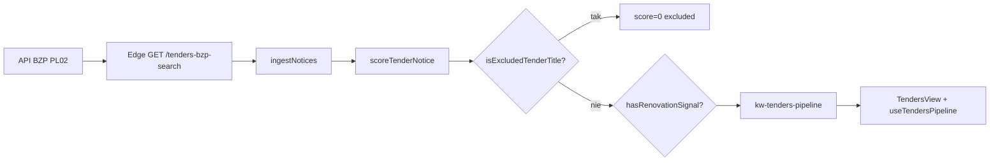

# SESSION HANDOFF — P3 Wycena · BZP Pipeline · Filtry strategiczne

> **★★ Handoff deweloperski** — seria P3 (wycena, baza cen, benchmarki), pipeline BZP, P3.6 filtry klientów, P1 WM false exclude.  
> **Data closeout:** 2026-06-13 · **Baseline prod:** **v2.56.10** · commit **`7acbecf`**  
> **Hasło:** „kontynuuj WGDOM” → czytaj też [`PROJECT-HANDOFF-CURRENT.md`](PROJECT-HANDOFF-CURRENT.md) + [`CURRENT-TASK.md`](../CURRENT-TASK.md)

---

## 1. Wejście dla nowej sesji (kolejność)

```text
1. AGENTS.md
2. docs/PROJECT-HANDOFF-CURRENT.md     ← baseline prod (2.56.10)
3. TEN PLIK                           ← P3 + BZP + filtry + audyty
4. docs/SESSION-HANDOFF-P2-H-TENDER-DOCUMENTS.md   ← dokumenty ZIP/7Z/PDF
5. docs/SESSION-HANDOFF-UX-1-TENDER-WORKSPACE.md ← 5 tabs workspace
6. docs/SESSION-HANDOFF-P2-F-TENDER-QUALIFICATION.md
7. CURRENT-TASK.md
8. docs/ARCHITECTURE.md § 12.1.1–12.1.7 · § 15.1
9. docs/WORKFLOW-RELEASE-DEPLOY.md
```

**Verify prod (jedno curl, bez pollingu):**

```bash
curl -s https://www.wgdom.fun/version.json
# oczekiwane: { "version": "2.56.10" }
```

---

## 2. Co robimy (produkt) — mapa domen

```text
┌─────────────┐  ┌─────────────┐  ┌──────────────────┐  ┌─────────────────────────────────────┐
│  Dashboard  │  │   Roboty    │  │ Do Rozliczenia   │  │            Przetargi 3.0            │
│  (Pulpit)   │  │   (jobs)    │  │ (billing WM)     │  │  Lista · Strategia · Mapa · Profil  │
└──────┬──────┘  └─────────────┘  └──────────────────┘  │  Baza cen · Ustawienia              │
       │ TendersShortcutPanel                              └──────────────────┬──────────────────┘
       └────────────────────────────────────────────────────────────────────┘
```

**Przetargi — ścieżka użytkownika:**

1. **Lista** (`TendersView`) — pipeline BZP, filtry strategiczne P3.6, bulk/CSV
2. **Karta przetargu** (`TenderDetailPanel`) — **5 workspace tabs** (UX.1B): Przegląd · Dokumenty · Kwalifikacja · **Wycena** · Oferta
3. **Strategia** — GO/HOLD/NO-GO, prognoza 90d, Action Center (tylko ta zakładka, nie Pulpit)
4. **Baza cen** — katalog WGDOM, benchmark robocizny, historia materiałów

**Nie przywracać:** Command Center runtime (usunięty v2.51.0). Archiwum: [`archive/command-center/`](archive/command-center/).

---

## 3. Seria P3 — chronologia (CLOSED sprinty)

| Wersja | Sprint | Commit | Skrót |
|--------|--------|--------|-------|
| **2.56.0** | P3.1 + P3.2.0 | — | Hero KPI Wycena + zakładka Baza cen (`kw-wgdom-cost-catalog`) |
| **2.56.1** | P3.5 | `16b792e` | Ceny per pozycja kosztorysu (read-only) |
| **2.56.2** | P3.5B | `f74fe1b` | Override cen per przetarg (`kw-tender-price-overrides`) |
| **2.56.3** | P3.3A | — | Benchmark robocizny MVP (read-only) |
| **2.56.4** | P3.3B | — | Benchmark PRO + historia stawek 90d |
| **2.56.5** | P3.3D | — | Benchmark Impact (PLN odchylenie × ilość) |
| **2.56.6** | P3.4A | `1fd2948` | Historia materiałów + impact vs własna firma |
| **2.56.7** | P3 UX | `9759ef9` | Wycena cleanup + słowniki klasyfikacji 3.1 |
| **2.56.8** | P2-G.3C | `66a619e` | Benchmark klasyfikacji prod — UNKNOWN 16→0 |
| **2.56.9** | **P3.6** | **`d3ecbe4`** | **Filtry klientów strategicznych (WM/ZZK/…)** |
| **2.56.10** | **P1 WM** | **`7acbecf`** | **Fix false exclude „przebudowa budynku”** |

**Status streamu P3 (wycena):** **ACTIVE** — podstawy zamknięte; backlog: P2-G.3D/E, benchmark materiałów rynku (**HOLD** po audycie KB/Leroy).

---

## 4. Architektura Wycena (slot workspace)

**UI:** `TenderBidProposalPanel.tsx` w zakładce **Wycena** (`TenderDetailPanel` → lazy mount).

| Warstwa | Pliki | Rola |
|---------|-------|------|
| Kalkulator | `tender-bid-proposal.ts`, `tender-cost-engine.ts` | Koszt własny, marża, cena oferty |
| Katalog | `wgdom-cost-catalog.ts`, `TenderPriceBasePanel.tsx` | Baza cen, rbh, Kp, indeksy |
| Pozycje ATH | `tender-catalog-line-pricing.ts` | Ceny per linia kosztorysu |
| Override | `tender-price-overrides.ts` | Nadpisania per tenderId × kategoria |
| Klasyfikacja | `tender-cost-intelligence.ts`, `tender-cost-classification.ts` | Kategorie WM/ZZK, phrase rules |
| Benchmark rbh | `labor-benchmark.ts`, `labor-benchmark-impact.ts` | Porównanie read-only + wpływ PLN |
| Materiały hist. | `material-history.ts`, `material-impact.ts` | Trend 90d własnej firmy |
| Kalibracja | `tender-cost-calibration.ts` | P2-G.3B historical snapshots |

**Klucze chmury (Przetargi / wycena):**

| Klucz | Zawartość |
|-------|-----------|
| `kw-wgdom-cost-catalog` | Katalog pozycji + parametry costModel |
| `kw-wgdom-cost-catalog-history` | Snapshoty stawek rbh + materialPlnPerUnit |
| `kw-tender-price-overrides` | Override per przetarg |
| `kw-tenders-pipeline` | Pipeline BZP (lista przetargów) |
| `kw-company-profile` | Profil wykonawcy P2-F (schema v4) |

**Zasada:** benchmarki robocizny i materiałów historycznych są **read-only** — nie zmieniają kalkulatora oferty bez osobnego sprintu.

---

## 5. Pipeline BZP — jak działa ingest



| Etap | Plik | Opis |
|------|------|------|
| Proxy BZP | `supabase/.../index.tsx` | Skan `orderType=Works`, orgi Wrocław (WM, ZIK/ZZK, ZIM, TBS, Gmina, MOPS) |
| Scoring klient | `tenders-bzp.ts` | `WROCLAW_PRIORITY_BUYERS`, `priorityBuyerId` (ZZK = **`zik`**) |
| Słowa kluczowe | `tenders-bzp-keywords.ts` | Include remont + exclude nowa budowa |
| **P1 fix** | `matchesTenderExcludeKeyword()` | Granica słowa: `przebudowa` ≠ `budowa budynku` |
| Mirror Edge | `matchesBzpExcludeKeyword()` w `index.tsx` | **Deploy Supabase wymagany** przy zmianie exclude |
| Pipeline hook | `useTendersPipeline.ts` | Merge, rescore, award w tle |
| Lista UI | `TendersView.tsx` | Filtry, sort, bulk, P3.6 chipy |

**Ważne:** WGDOM skanuje BZP tylko **`orderType=Works`** + filtr remontowy. MOPS publikuje głównie usługi/dostawy — **poza zakresem** produktowym (audyt 2026-06-13).

**Po fixie 2.56.10:** odzyskany przykład WM — Sępa Szarzyńskiego, BZP 00273812, score 143 (audyt `audit-wm-exclude-120d.mjs`).

---

## 6. P3.6 — Filtry klientów strategicznych (**CLOSED** v2.56.9)

| Pole | Wartość |
|------|---------|
| **SSOT** | `src/lib/tenders-strategic-client-filters.ts` |
| **UI** | `TendersView.tsx` — chipy z licznikiem |
| **Stan** | `useTendersPipeline.strategicClientFilter` |
| **Zakres** | **UX only** — bez zmian pipeline/sync/Edge |

**Filtry:** WM · ZZK (`priorityBuyerId=zik`) · MOPS · TBS · Gminy (gmina/ZIM) · Uczelnie (heurystyka Wrocław).

**Test:** `npx vite-node scripts/test-tenders-strategic-client-filters.mjs` → **52 PASS**

**Nie zmieniaj bez polecenia:** wspólny import w audytach (`audit-p2g3c-classification-prod.mjs`, `audit-p2h5-pdf-przedmiar.mjs`, `audit-p2h-full-regression.mjs`).

---

## 7. P1 — WM false exclude przebudowa (**CLOSED** v2.56.10)

**Problem:** tytuł `REMONT I PRZEBUDOWA BUDYNKU…` → `excluded=true` przez substring `"budowa budynku"` w `"przebudowa budynku"`.

**Fix:**

- `matchesTenderExcludeKeyword()` — frazy `budowa budynk*` wymagają granicy słowa
- Prefiksy `prze` / `roz` / `nad` + `budowa` = remont, nie nowa budowa
- Mirror w Edge dla spójności ingest

**Test:** `npx vite-node scripts/test-tender-exclude-renovation-budowa.mjs` → **18 PASS**  
**Audyt:** `npx vite-node scripts/audit-wm-exclude-120d.mjs`

**Deploy:** zmiana exclude = **frontend + Supabase Edge** (oba muszą być na prod).

---

## 8. Audyty read-only (bez implementacji)

### 8a. KB.pl + Leroy Merlin (źródła cen zewnętrznych)

| Źródło | Werdykt | Uwagi |
|--------|---------|-------|
| **KB.pl** | GO WITH CONDITIONS | Tylko ręczna kuracja lub licencja B2B; scraping/API = NO GO |
| **Leroy Merlin** | NO GO live | Ewentualnie ręczny snapshot referencyjny |
| **Rekomendacja** | **B** > A | Własna Baza Cen + benchmarki + klasyfikacja > integracja KB+Leroy |

**Benchmark materiałów rynku:** **HOLD** (P3.2.x backlog).

### 8b. WM + MOPS — źródła publikacji vs WGDOM

| Zamawiający | Publikuje | WGDOM widzi |
|-------------|-----------|-------------|
| **WM** | BZP, wm.wroc.pl, eZamawiający/Marketplanet | BZP Works + scoring; luka była w exclude (naprawione 2.56.10) |
| **MOPS** | BIP MOPS + BZP (usługi/dostawy) | Brak Works w BZP — poza zakresem |

**Skrypt audytu (lokalny):** `scripts/audit-wm-mops-sources.mjs` — nie wymaga commitu.

---

## 9. Struktura plików — Przetargi (mapa dla programisty)

```text
src/app/
  TendersView.tsx              ← lista + P3.6 filtry
  tenders/
    TendersModule.tsx          ← 6 zakładek modułu
    context/TendersProvider.tsx
    strategy/hooks/useTendersPipeline.ts
    components/TenderDetailPanel.tsx
    components/TenderWorkspaceTabBar.tsx
  TenderBidProposalPanel.tsx   ← Wycena hero KPI
  TenderPriceBasePanel.tsx     ← Baza cen

src/lib/
  tenders-bzp.ts               ← typy, scoring, priority buyers
  tenders-bzp-keywords.ts      ← include/exclude P1
  tenders-strategic-client-filters.ts  ← P3.6 SSOT
  tender-cost-intelligence.ts  ← klasyfikacja ATH
  wgdom-cost-catalog.ts        ← katalog cen
  labor-benchmark*.ts          ← benchmark rbh
  material-history.ts          ← historia materiałów

supabase/functions/make-server-0afb8820/index.tsx
  GET /tenders-bzp-search      ← ingest + matchesBzpExcludeKeyword
```

**Workspace UX.1B:** max **5 tabs**, lazy render — szczegóły w [`SESSION-HANDOFF-UX-1-TENDER-WORKSPACE.md`](SESSION-HANDOFF-UX-1-TENDER-WORKSPACE.md).

---

## 10. Testy regresji (przed zmianami Przetargów)

| Obszar | Komenda |
|--------|---------|
| P3.6 filtry | `npx vite-node scripts/test-tenders-strategic-client-filters.mjs` |
| P1 WM exclude | `npx vite-node scripts/test-tender-exclude-renovation-budowa.mjs` |
| Klasyfikacja prod | `npx vite-node scripts/audit-p2g3c-classification-prod.mjs` |
| Dossier / 7Z / PDF | `npx vite-node scripts/test-tender-dossier-pipeline.mjs` |
| Workspace UX | `npx vite-node scripts/test-tender-workspace-ux.mjs` |
| Kwalifikacja P2-F | `npx vite-node scripts/test-tender-dossier-pipeline.mjs` |

---

## 11. Priorytety kolejnych prac (strategia produktu)

**Obecny werdykt:** moduł **Przetargi = PRODUCTION READY**. Workflow end-to-end działa produkcyjnie.

**Priorytet:** **realne przetargi** (audyty operacyjne na żywych postępowaniach) **zamiast** nowych funkcji.

| Priorytet | Temat | Co sprawdzać |
|-----------|-------|--------------|
| **P1** | Audyty nowych przetargów | Znalezienie kosztorysu · klasyfikacja · wycena · UNKNOWN na rzeczywistych postępowaniach |
| **P2** | Kalibracja wyceny | Porównanie względem wygranych i przegranych ofert (`tender-cost-calibration.ts`) |
| **P3** | Rozwój Bazy Cen | Uzupełnianie katalogu na podstawie historii firmy (nie integracji zewnętrznych) |

### Backlog techniczny (tylko na polecenie po AUDIT)

| Temat | Status |
|-------|--------|
| P2-H.7 — Edge magic bytes 7z | OPEN (techniczny) |
| P2-G.3D/E — benchmark jakości / RMS | OPEN → slot Wycena |
| P2-F.6 — kompletność oferty (checklist) | OPEN → slot Oferta |
| P3.7+ — dalsze filtry/lista | OPEN |
| Benchmark materiałów rynku (KB/Leroy) | **HOLD** |
| P2 Audit Center — security log | OPEN |
| Kolejny UNKNOWN sweep | gdy nowe ATH w pipeline |

**Proces:** `AUDIT → RCA → PLAN → IMPLEMENT` — brak kodu bez audytu.

---

## 12. Czego NIE robić / NIE zmieniać bez polecenia

### Zakazy produktowe (bez osobnej decyzji biznesowej)

- Command Center reworki · nowe dashboardy
- Leroy API · Castorama API · OBI API · scraping KB.pl
- Benchmark materiałów rynku (integracja zewnętrzna)
- OCR PDF · nowe crawlery

### Zakazy techniczne

- Merge/sync `kw-tenders-pipeline`, `kw-wgdom-cost-catalog`, payroll guard
- Struktura 5 workspace tabs (UX.1B), lazy render, Anti-CC
- Semantyka `zipInnerPath`, Marketplanet `sourcePageUrl` (P2-H)
- `matchesTenderExcludeKeyword` granica słowa (P1) — regresja WM
- P3.6 filtry jako UX-only — nie przenosić logiki do Edge bez audytu
- Command Center — nie przywracać

---

## 13. Werdykt closeout

```text
BASELINE v2.56.10 · PRODUCTION VERIFIED (version.json)
Moduł Przetargi: PRODUCTION READY
Workflow: Przetarg → dokumentacja → kosztorys → klasyfikacja → wycena → oferta — działa produkcyjnie
P3.0–P3.6 CLOSED · P1 WM false exclude CLOSED · P2-G.3C CLOSED (UNKNOWN 0%)
P2-H stream CLOSED (H.1–H.6 + H.5A/B/C/D) · UX.1 CLOSED · P2-F CLOSED · P1 CLOSED
Klienci strategiczni aktywni: WM · ZZK · MOPS · TBS · Gminy · Uczelnie
Priorytet: REALNE PRZETARGI (audyty operacyjne P1/P2/P3) zamiast nowych funkcji
OPEN (na polecenie): P2-H.7 · P2-G.3D/E · P2-F.6 · benchmark materiałów HOLD · P2 Audit Center
Gotowe do wznowienia pracy
```
