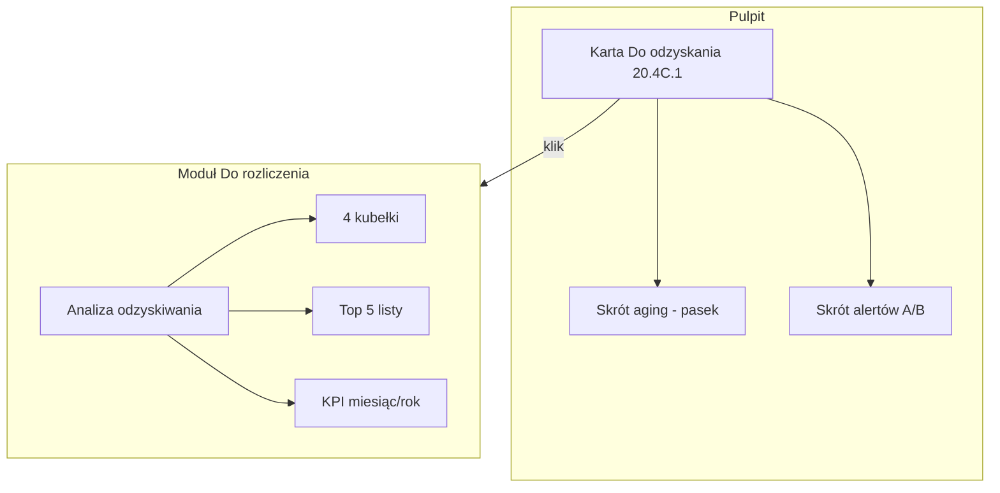
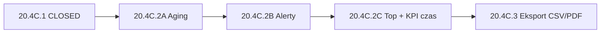

# Sprint 20.4C.2 — Aging + Alerty + Top Listy (AUDIT + DESIGN)

> **Data audytu:** 2026-06-06  
> **Tryb:** AUDYT + DESIGN — **bez implementacji, bez commitów, bez deploy**  
> **Prod baseline:** v2.48.00 · Sprint 20.4C.1 CLOSED (`1d65ec5`)  
> **Źródła:** `recoverable-charges.ts`, `RecoverableChargesDashboardCard.tsx`, `RecoverableChargesView.tsx`, `DashboardView.tsx`, `docs/SETTLEMENT-REPORTING-AUDIT-20.4C.md`

---

## Spis treści

1. [Kontekst i cel biznesowy](#1-kontekst-i-cel-biznesowy)
2. [KROK 1 — Aging](#2-krok-1--aging)
3. [KROK 2 — Alerty](#3-krok-2--alerty)
4. [KROK 3 — Top listy](#4-krok-3--top-listy)
5. [KROK 4 — Dashboard vs moduł](#5-krok-4--dashboard-vs-moduł)
6. [KROK 5 — Sekcja „Analiza odzyskiwania”](#6-krok-5--sekcja-analiza-odzyskiwania)
7. [KROK 6 — KPI czasowe](#7-krok-6--kpi-czasowe)
8. [KROK 7 — Wydajność](#8-krok-7--wydajność)
9. [KROK 8 — Architektura](#9-krok-8--architektura)
10. [KROK 9 — Plan implementacji 20.4C.2A/B/C](#10-krok-9--plan-implementacji-204c2abc)
11. [RECOMMENDATION](#11-recommendation)

---

## 1. Kontekst i cel biznesowy

### 1.1 Ewolucja pytań właściciela

| Etap | Pytanie | Sprint |
|------|---------|--------|
| 1 | „Ile mamy do odzyskania?” | 20.4B (moduł) + **20.4C.1** (Pulpit) |
| 2 | **„Które pieniądze są najbardziej zagrożone i wymagają działania?”** | **20.4C.2** |

### 1.2 Stan po 20.4C.1 (v2.48.00)

| Element | Stan |
|---------|------|
| Karta Pulpitu „Do odzyskania” | 4 KPI + najstarsza pozycja (dni) |
| Alarm 20.4C.1 | `≥ 2 000 PLN` **lub** `> 30 dni` (prosty, wczesny) |
| Moduł Do rozliczenia | 3 KPI + lista + Rozlicz + historia |
| `attentionCount` (Pulpit) | **Bez** billing recovery |
| Aging kubełki | **Brak** |
| Top listy | **Brak** |
| KPI miesiąc/rok | **Brak** |

### 1.3 Ograniczenie audytu

**Bez zmian modelu KV** — wyłącznie agregacje z istniejących pól:

| Pole w spec | Pole w kodzie | Uwaga |
|-------------|---------------|-------|
| `inspectorName` | `responsibleInspector` | + `onBehalfOf` w `settlements[]` |
| `status` | derived via `deriveChargeAmounts()` | nie edytować ręcznie |
| pozostałe | `amount`, `amountSettled`, `amountRemaining`, `settlements[]`, `createdAt`, `updatedAt`, `sourceJobId` | bez zmian |

---

## 2. KROK 1 — Aging

### 2.1 Definicja (rekomendacja)

| Parametr | Wartość |
|----------|---------|
| **Zbiór** | Pozycje z `amountRemaining > 0` (`status` open lub partial) |
| **Data odniesienia** | `createdAt` (wiek należności, nie ostatnia edycja) |
| **Wiek** | `ageDays = floor((now − createdAt) / 86400000)` |

### 2.2 Kubełki

| Kubełek | Warunek `ageDays` |
|---------|-------------------|
| **0–30 dni** | `≤ 30` |
| **31–60 dni** | `31–60` |
| **61–90 dni** | `61–90` |
| **90+ dni** | `> 90` |

### 2.3 Metryki per kubełek

Dla każdej grupy:

| Metryka | Obliczenie |
|---------|------------|
| **Liczba pozycji** | `count` pozycji w kubełku |
| **Suma PLN** | `sum(amountRemaining)` |

**Przykład (wymaganie użytkownika):**

```
0–30 dni     4 pozycje    2 100 PLN
31–60 dni    2 pozycje    1 800 PLN
61–90 dni    1 pozycja      900 PLN
90+ dni      3 pozycje    4 200 PLN
─────────────────────────────────
Razem       10 pozycji    9 000 PLN  (= Do odzyskania na karcie)
```

**Reguła spójności:** suma PLN czterech kubełków **musi równać się** `toRecoverSum` z karty 20.4C.1.

### 2.4 Wartość biznesowa

| Aspekt | Ocena |
|--------|-------|
| Identyfikacja „utkniętych” środków | **HIGH** |
| Priorytetyzacja działań windykacyjnych | **HIGH** |
| Rozmowa z inspektorem / klientem | **MEDIUM** |
| Wizualna mapa ryzyka (90+ = czerwony segment) | **HIGH** |

### 2.5 Układ UI (rekomendacja)

#### Wariant A — 4 komórki (preferowany)

```
┌────────────┬────────────┬────────────┬────────────┐
│  0–30 dni  │ 31–60 dni  │ 61–90 dni  │   90+ dni  │
│  4 poz.    │  2 poz.    │  1 poz.    │  3 poz.    │
│  2 100 zł  │  1 800 zł  │   900 zł   │  4 200 zł  │
└────────────┴────────────┴────────────┴────────────┘
```

#### Wariant B — pasek proporcjonalny (uzupełnienie)

Jeden poziomy bar: segmenty `%` sumy PLN; kolor 90+ = amber/red.

#### Gdzie pokazać?

| Miejsce | Zakres | Uzasadnienie |
|---------|--------|--------------|
| **Dashboard** | **Skrót** — pasek + „90+: 4 200 zł (3 poz.)” pod kartą 20.4C.1 | Właściciel widzi ryzyko bez wchodzenia w moduł |
| **Moduł** | **Pełne** 4 kubełki + liczba + PLN | Analiza operacyjna, miejsce na szczegóły |

**Rekomendacja:** **C — hybryda** (patrz §5): skrót na Pulpicie, pełny aging w module.

### 2.6 Relacja do alarmu 20.4C.1

| Stan dziś | Po 20.4C.2 |
|-----------|------------|
| Alarm przy `> 30 dni` | **Doprecyzować:** alarm karty = progi operacyjne (A/B); aging 0–30/31–60 to **informacja**, nie alarm |

**Rekomendacja:** W 20.4C.2B **podnieść próg alarmu karty** z `> 30` na `> 90 dni` (zgodnie z alertem B), żeby nie dublować „żółtego” stanu przy każdej pozycji po miesiącu. Kubełek 31–60 informuje bez alarmu.

---

## 3. KROK 2 — Alerty

### 3.1 Analiza progów (A–D)

#### A — Kwota pozostała ≥ 2 000 PLN

| Kryterium | Ocena |
|-----------|-------|
| Wartość biznesowa | **HIGH** — duże ekspozycje |
| Fałszywe alarmy | **LOW** |
| Rekomendowany próg | **`amountRemaining >= 2000`** (już w 20.4C.1) |
| Prezentacja | Licznik na karcie: „2 pozycje ≥ 2 000 zł” |

#### B — Pozycja > 90 dni

| Kryterium | Ocena |
|-----------|-------|
| Wartość biznesowa | **HIGH** — klasyczny ageing |
| Fałszywe alarmy | **LOW** |
| Rekomendowany próg | **`ageDays > 90`** od `createdAt`, unsettled |
| Prezentacja | Licznik + powiązanie z kubełkiem 90+ |

#### C — Pozycja częściowo rozliczona > 60 dni

| Kryterium | Ocena |
|-----------|-------|
| Wartość biznesowa | **MEDIUM** — „zawieszone” partial |
| Fałszywe alarmy | **MEDIUM** — celowe długie partial możliwe |
| Rekomendowany próg | `status === partial` **AND** `daysSince(firstSettlement.settledAt) > 60` **AND** `amountRemaining > 0` |
| Prezentacja | **Informacja** (nie czerwony alarm) — „1 partial bez postępu > 60 dni” |

**Definicja pierwszego settlement:** `min(settlements[].settledAt)` (wykluczyć `legacy-migration-*` z liczenia „postępu” jeśli jedyny wpis).

#### D — Brak aktywności > 60 dni

| Kryterium | Ocena |
|-----------|-------|
| Wartość biznesowa | **MEDIUM** — martwe sprawy |
| Fałszywe alarmy | **MEDIUM** — edycja opisu resetuje `updatedAt` |
| Rekomendowany próg | `daysSince(lastActivity) > 60` gdzie `lastActivity = max(updatedAt, max(settlements.settledAt))` |
| Prezentacja | Tylko w module / sekcji „Wymaga uwagi” (max 3 pozycje) |

### 3.2 Macierz alertów — rekomendacja końcowa

| Alert | Włączyć w 20.4C.2 | Severity | Dashboard | Moduł |
|-------|-------------------|----------|-----------|-------|
| **A** ≥ 2 000 PLN | **TAK** | warning | skrót na karcie | licznik + lista |
| **B** > 90 dni | **TAK** | warning | skrót + `attentionCount` | kubełek 90+ |
| **C** partial > 60 dni | **TAK** | info | opcjonalny skrót | sekcja analizy |
| **D** brak aktywności > 60 dni | **TAK (P1)** | info | nie | top 3 w module |

### 3.3 `attentionCount` — propozycja

**Problem:** `attentionCount` dziś sumuje payroll, dokumenty, inspektora, WM — liczba szybko rośnie.

**Rekomendacja (nie inflacyjna):**

```typescript
// +1 do attentionCount jeśli ANY:
const billingNeedsAttention =
  hasUnsettledChargeOver2000 ||
  hasUnsettledChargeOlderThan90Days;

if (billingNeedsAttention) attentionCount += 1;
```

| Zasada | Uzasadnienie |
|--------|--------------|
| **+1**, nie +N | Billing to jedna kategoria ryzyka, jak „braki dokumentów” |
| **Nie** liczyć partial-60 ani brak-aktywności | Zbyt dużo szumu na Pulpicie |
| Sekcja „Uwaga dziś” | **Opcjonalnie** jeden wiersz „Do odzyskania — 3 pozycje wymaga uwagi” z linkiem do modułu (max 1 blok, nie lista 20 pozycji) |

### 3.4 Prezentacja alertów na karcie Dashboard (20.4C.2B)

Rozszerzenie `RecoverableChargesDashboardCard` pod KPI:

```
⚠ 2 pozycje ≥ 2 000 zł · 1 pozycja > 90 dni
```

`isAlarm` karty = `alertA || alertB` (próg 90 dni zamiast 30 z 20.4C.1).

---

## 4. KROK 3 — Top listy

Max **5 pozycji** per lista; klik → zaznaczenie w module / scroll do pozycji.

### 4.1 Największe nierozliczone

| | |
|--|--|
| **Sort** | `amountRemaining` DESC |
| **Zbiór** | unsettled |
| **Wartość biznesowa** | **HIGH** |
| **Koszt wdrożenia** | **LOW** |
| **Priorytet** | **P0** |
| **Kolumny UI** | Opis, pozostało, status, źródło, wiek (dni) |

### 4.2 Najstarsze nierozliczone

| | |
|--|--|
| **Sort** | `createdAt` ASC (unsettled) |
| **Wartość biznesowa** | **HIGH** |
| **Koszt** | **LOW** |
| **Priorytet** | **P0** |
| **Kolumny UI** | Opis, wiek, pozostało, inspektor |

### 4.3 Największe odzyskane

| | |
|--|--|
| **Sort** | `amountSettled` DESC gdzie `status === settled` |
| **Wartość biznesowa** | **MEDIUM** (motywacja / dowód skuteczności) |
| **Koszt** | **LOW** |
| **Priorytet** | **P1** |
| **Uwaga** | Wykluczyć / oznaczyć pozycje z jedynym `legacy-migration-*` |

### 4.4 Najczęściej wskazywany inspektor

| | |
|--|--|
| **Definicja (rekomendowana)** | `count` unsettled gdzie `responsibleInspector` niepusty; tie-break suma `amountRemaining` |
| **Alternatywa** | Agregacja `onBehalfOf` w settlements — **P2**, wyższy koszt |
| **Wartość biznesowa** | **MEDIUM** |
| **Koszt** | **MEDIUM** |
| **Priorytet** | **P2** |
| **UI** | Top 3 inspektorów: imię, liczba pozycji, suma PLN pozostało |

### 4.5 Najwięcej rozliczeń (na pozycję)

| | |
|--|--|
| **Sort** | `settlements.length` DESC (min 2) |
| **Wartość biznesowa** | **MEDIUM** — złożone case’y |
| **Koszt** | **LOW** |
| **Priorytet** | **P2** |
| **UI** | Tytuł, N rozliczeń, X/Y zł |

### 4.6 Podsumowanie priorytetów

| Lista | P0 (20.4C.2C) | P1 | P2 |
|-------|---------------|-----|-----|
| Największe nierozliczone | ✓ | | |
| Najstarsze nierozliczone | ✓ | | |
| Największe odzyskane | | ✓ | |
| Inspektor | | | ✓ |
| Najwięcej rozliczeń | | | ✓ |

**MVP 20.4C.2C:** tylko **#1 + #2** w module.

---

## 5. KROK 4 — Dashboard vs moduł (rekomendacja UX)

### 5.1 Opcje A / B / C

| Opcja | Opis | Ocena |
|-------|------|-------|
| **A** Wszystko pod kartą na Pulpicie | Aging + alerty + top 5 × 2 | **Odrzucone** — przeładowanie Pulpitu (~1200 linii już teraz) |
| **B** Wszystko tylko w module | Pulpit bez zmian poza kartą | **Słabe** — właściciel nie widzi ryzyka bez kliknięcia |
| **C** Hybryda | **Rekomendowane** | |

### 5.2 Rekomendacja **C — hybryda**

| Element | Dashboard (Pulpit) | Moduł Do rozliczenia |
|---------|-------------------|---------------------|
| 4 KPI (20.4C.1) | ✓ karta | ✓ pasek 3 KPI (istnieje) |
| Aging | **Skrót:** pasek 4 segmentów + suma 90+ | **Pełne:** 4 kubełki z poz. + PLN |
| Alerty A/B | **Skrót** pod kartą | Liczniki + sekcja „Wymaga uwagi” (max 3) |
| Alerty C/D | — | Tylko w module |
| Top listy | — | **Pełne** (2× P0 listy) |
| KPI miesiąc/rok | — | Sekcja analizy (20.4C.2 lub 2.5) |
| `attentionCount` | +1 warunkowo | — |



---

## 6. KROK 5 — Sekcja „📊 Analiza odzyskiwania”

### 6.1 Rekomendacja

**TAK** — sekcja w `RecoverableChargesView.tsx`, **bez osobnego modułu / route**.

**Umiejscowienie:** pod istniejącym paskiem 3 KPI, **nad** filtrami i listą.

**Zwijana** na mobile (`<details>` lub collapse) — domyślnie otwarta gdy `isAlarm || bucket90.count > 0`.

### 6.2 Makieta

```
┌─ 📊 Analiza odzyskiwania ─────────────────────────────────────┐
│  Najstarsza pozycja      124 dni                               │
│  Największa pozostała    4 200 PLN                             │
│  Pozycje 90+             3 (4 200 PLN)                         │
│  Pozycje 60+ (partial)   1                                     │
│                                                                │
│  [ 0–30 │ 31–60 │ 61–90 │ 90+ ]  ← 4 kubełki                │
│                                                                │
│  Odzyskano: ten miesiąc  3 200 zł · ten rok  18 400 zł       │
│                                                                │
│  ── Wymaga uwagi (max 3) ──                                    │
│  • Malowanie klatki — 4 200 zł — 124 dni — ≥ 2000            │
│  • Docieplenie — 1 800 zł — 95 dni                           │
│                                                                │
│  ── Największe nierozliczone ──                                │
│  1. … 4 200 zł                                                 │
│  ── Najstarsze nierozliczone ──                                │
│  1. … 124 dni                                                  │
└────────────────────────────────────────────────────────────────┘
```

### 6.3 Komponenty (propozycja)

| Komponent | Plik |
|-----------|------|
| `RecoverableChargesAnalysisSection.tsx` | Nowy — sekcja w module |
| `RecoverableChargesAgingBar.tsx` | Opcjonalnie — pasek na Pulpicie + w module |
| `RecoverableChargesAttentionList.tsx` | Max 3 pozycje z flagami alertów |

---

## 7. KROK 6 — KPI czasowe

### 7.1 Metryki

| Metryka | Obliczenie | Dane | Ryzyko |
|---------|------------|------|--------|
| **Odzyskano w tym miesiącu** | `sum(s.amount)` gdzie `settledAt` w bieżącym miesiącu kalendarzowym | `settlements[]` | **LOW** |
| **Odzyskano w tym roku** | j.w., rok bieżący | `settlements[]` | **LOW** |
| **Średni czas rozliczenia** | Średnia dni `(lastSettlement − createdAt)` tylko `status === settled` | settlements + createdAt | **MEDIUM** |
| **Najszybciej rozliczona** | `min(duration)` among settled | j.w. | **LOW** |
| **Najwolniej rozliczona** | `max(duration)` among settled | j.w. | **LOW** |

### 7.2 Średni czas — definicja rekomendowana

```typescript
// Tylko pozycje w pełni rozliczone (settled)
durationDays = daysBetween(createdAt, lastSettlement.settledAt)
// partial NIE wliczać — zniekształca średnią
```

Tooltip: „Średni czas pełnego zamknięcia pozycji (N=12)”.

### 7.3 Legacy i dokładność

| Case | Mitigacja |
|------|-----------|
| `legacy-migration-*` | Wykluczyć z KPI czasowych i rankingu „odzyskane” |
| Brak `settledAt` | Pominąć wpis |
| Strefa czasowa | Użyć daty lokalnej PL (`getMonth()` / `getFullYear()` na `new Date(settledAt)`) — spójnie z `fmtDate` |

### 7.4 Gdzie pokazać

| Metryka | Dashboard | Moduł |
|---------|-----------|-------|
| Miesiąc / rok | — | **TAK** (2 liczby pod aging) |
| Średni / min / max czas | — | **P1** — jedna linia pod KPI czasowymi |

---

## 8. KROK 7 — Wydajność

### 8.1 Skalowanie

| n pozycji | Średnie m | Operacje | Czas szac. | Werdykt |
|-----------|-----------|----------|------------|---------|
| 50 | 2 | 1× pass + sorty | < 2 ms | ✅ |
| 500 | 3 | 1× pass + 5× sort | < 10 ms | ✅ |
| 5000 | 5 | 1× pass + sort | 30–80 ms | ⚠️ OK w `useMemo` |

### 8.2 Czy potrzebny `computeRecoverableChargesReportingStats()`?

| Helper dziś | Wystarczy na 20.4C.2? |
|-------------|----------------------|
| `recoverableChargesModuleKpi` | Częściowo |
| `recoverableChargesDashboardCardStats` | Częściowo — **rozszerzyć** lub zastąpić |
| `deriveChargeAmounts` per charge | Tak — w pętli |

**Rekomendacja:** **TAK** — jeden aggregator:

```typescript
export function computeRecoverableChargesReportingStats(
  charges: RecoverableCharge[],
  options?: { now?: Date; jobsById?: Map<string, Job> },
): RecoverableChargesReportingStats
```

Zwraca w **jednym przejściu:**

- `agingBuckets[4]` — count + sumRemaining
- `alerts` — counts A/B/C/D + `itemsAttention` (top 3)
- `topLargestUnsettled[5]`, `topOldestUnsettled[5]`
- `timeKpi` — month, year, avg/min/max duration
- `dashboard` — pola zgodne z kartą 20.4C.1 (refactor bez zmiany UI contract)

**Korzyść:** Dashboard i moduł czytają **ten sam obiekt** → KPI zawsze zgodne.

### 8.3 Cache

| Potrzeba | Decyzja |
|----------|---------|
| Osobny KV cache | **Nie** |
| `useMemo([charges, jobs])` | **Tak** |
| Denormalizacja w KV | **Nie** — `amountRemaining` już na rekordzie |

---

## 9. KROK 8 — Architektura

### 9.1 Wpływ na pliki

| Plik | Ryzyko | Zmiana |
|------|--------|--------|
| `recoverable-charges.ts` | **LOW** | +`computeRecoverableChargesReportingStats`, typy; refactor `recoverableChargesDashboardCardStats` → delegacja |
| `RecoverableChargesDashboardCard.tsx` | **LOW** | +pasek aging, rozszerzone alerty |
| `RecoverableChargesView.tsx` | **MEDIUM** | +sekcja Analiza (~100–150 linii) |
| `DashboardView.tsx` | **LOW** | +`attentionCount` billing (+1), bez rozrostu pliku (logika w lib) |
| `cloud-sync.ts` | **Brak** | — |
| `mergeRecoverableCharges` | **Brak** | — |
| `deriveChargeAmounts` | **Brak** | tylko odczyt |

### 9.2 Bundle size

| Element | Wpływ |
|---------|-------|
| Nowe komponenty modułu | +4–8 KB gzip (lazy — moduł już code-split `RecoverableChargesView-*.js`) |
| Pasek aging na Pulpicie | +1–2 KB w main/dashboard chunk |
| Brak nowych bibliotek | **0** |

### 9.3 Potwierdzenie: brak zmian modelu

| Obszar | Zmiana |
|--------|--------|
| `RecoverableCharge` interface | **NIE** |
| `RecoverableChargeSettlement` | **NIE** |
| KV keys | **NIE** |
| `applySettlement` / merge | **NIE** |

---

## 10. KROK 9 — Plan implementacji 20.4C.2A / B / C

### 10.1 Sprint 20.4C.2A — Aging

| Element | Zakres |
|---------|--------|
| `computeRecoverableChargesReportingStats` | agingBuckets[4] |
| `RecoverableChargesAgingBar` | 4 segmenty PLN |
| Dashboard | Skrót pod kartą |
| Moduł | 4 kubełki w sekcji Analiza (szkielet) |
| Smoke | suma kubełków = toRecoverSum |
| Refactor | `recoverableChargesDashboardCardStats` → używa aggregatora |

| Ocena | |
|-------|--|
| Wartość biznesowa | **HIGH** |
| Ryzyko | **LOW** |
| Pliki | **4–5** |
| Wersja | v2.48.10 (propozycja) |

---

### 10.2 Sprint 20.4C.2B — Alerty

| Element | Zakres |
|---------|--------|
| Alerty A/B/C/D w lib | flagi + `attentionItems[]` |
| Karta Dashboard | skrót alertów; `isAlarm` → próg 90 dni |
| `attentionCount` | +1 warunkowo |
| Moduł | „Wymaga uwagi” max 3 |
| Opcjonalnie | 1 wiersz w „Uwaga dziś” |
| Smoke | progi 2000, 90, partial 60, idle 60 |

| Ocena | |
|-------|--|
| Wartość biznesowa | **HIGH** |
| Ryzyko | **MEDIUM** (semantyka + UAT partial/idle) |
| Pliki | **5–7** |
| Wersja | v2.49.00 (propozycja) |

---

### 10.3 Sprint 20.4C.2C — Top listy + KPI czasowe

| Element | Zakres |
|---------|--------|
| Top 5 największe / najstarsze | Moduł, klik → select |
| KPI miesiąc / rok | Moduł |
| P1: największe odzyskane | Opcjonalnie w tej samej iteracji |
| P2: inspektor, najwięcej rozliczeń | Backlog jeśli czas |
| Średni czas / min / max | Jedna linia |
| Smoke | sort order, month boundary, legacy exclude |
| GuideView + ARCHITECTURE | Dokumentacja |

| Ocena | |
|-------|--|
| Wartość biznesowa | **MEDIUM–HIGH** |
| Ryzyko | **LOW** |
| Pliki | **4–6** |
| Wersja | v2.49.10 (propozycja) |

### 10.4 Zależności



**Alternatywa:** Połączyć 2A+2B w jeden sprint (~8–10 plików) jeśli zespół ma ciągłość kontekstu.

---

## 11. RECOMMENDATION

### Czy 20.4C.2 powinien być następnym sprintem WGDOM?

**TAK** — to logiczny krok po 20.4C.1: od „ile” do „które i dlaczego pilne”, bez zmiany modelu i bez ryzyka sync.

### Ocena LOW / MEDIUM / HIGH

| Wymiar | Ocena | Uzasadnienie |
|--------|-------|--------------|
| **Wartość biznesowa** | **HIGH** | Aging + alerty + top listy = decyzje operacyjne właściciela |
| **Złożoność** | **MEDIUM** | Jeden aggregator + 2–3 komponenty UI; bez nowych KV |
| **Ryzyko** | **LOW–MEDIUM** | Semantyka alertów C/D; refactor alarmu 30→90 dni; `attentionCount` |

### Decyzje projektowe — podsumowanie

| # | Decyzja |
|---|---------|
| 1 | Aging od `createdAt`, 4 kubełki, count + sumRemaining |
| 2 | **Hybryda UX:** skrót Pulpit, pełna analiza w module |
| 3 | `computeRecoverableChargesReportingStats()` — jeden pass |
| 4 | Alerty A/B na Pulpicie; C/D tylko w module |
| 5 | `attentionCount` +1 (nie +N) dla A lub B |
| 6 | Podnieść próg alarmu karty z 30 na **90 dni** (2B) |
| 7 | Top listy MVP: największe + najstarsze (P0) |
| 8 | Sekcja „📊 Analiza odzyskiwania” w module — bez nowego route |
| 9 | KPI miesiąc/rok w module (2C); średni czas P1 |
| 10 | **Brak zmian modelu**, merge, cloud-sync |

### Następny krok

Akceptacja zakresu **20.4C.2A Aging** (lub 2A+2B łącznie) → implementacja.

---

**Dokument:** `docs/SETTLEMENT-REPORTING-AUDIT-20.4C.2.md`  
**Status:** AUDIT + DESIGN COMPLETE — **bez implementacji**  
**Powiązane:** `docs/SETTLEMENT-REPORTING-AUDIT-20.4C.md` (20.4C.1/20.4C.3), `docs/SETTLEMENT-WORKFLOW-AUDIT-20.4A.md`
