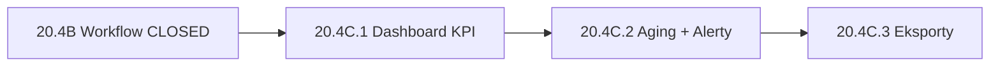

# Sprint 20.4C — Dashboard & Reporting (AUDIT + DESIGN)

> **Data audytu:** 2026-06-06  
> **Tryb:** AUDYT + DESIGN — **bez implementacji, bez commitów, bez deploy**  
> **Prod baseline:** v2.47.10 · Sprint 20.4B CLOSED (`42f77f2`)  
> **Źródła:** `DashboardView.tsx`, `recoverable-charges.ts`, `RecoverableChargesView.tsx`, `docs/SETTLEMENT-WORKFLOW-AUDIT-20.4A.md`, `docs/ADDITIONAL-BILLING-AUDIT-20.3A.md`

---

## Spis treści

1. [Kontekst i cel biznesowy](#1-kontekst-i-cel-biznesowy)
2. [KROK 1 — Dashboard](#2-krok-1--dashboard)
3. [KROK 2 — Aging](#3-krok-2--aging)
4. [KROK 3 — Top listy](#4-krok-3--top-listy)
5. [KROK 4 — Alerty](#5-krok-4--alerty)
6. [KROK 5 — Raporty](#6-krok-5--raporty)
7. [KROK 6 — KPI roczne](#7-krok-6--kpi-roczne)
8. [KROK 7 — Wydajność](#8-krok-7--wydajność)
9. [KROK 8 — Architektura](#9-krok-8--architektura)
10. [KROK 9 — Plan wdrożenia](#10-krok-9--plan-wdrożenia)
11. [RECOMMENDATION](#11-recommendation)

---

## 1. Kontekst i cel biznesowy

### 1.1 Co już działa (po 20.4B)

| Warstwa | Stan |
|---------|------|
| Model KV | `RecoverableCharge` + `settlements[]` + cache `amountSettled` / `amountRemaining` |
| Moduł 💰 Do rozliczenia | KPI 3-liniowy, Rozlicz, historia, status derived |
| Lib KPI | `recoverableChargesModuleKpi()`, `countUnsettledRecoverableCharges()`, `deriveChargeAmounts()` |
| Badge menu | open + partial |
| **Dashboard** | **Brak** — `DashboardView` nie dostaje `recoverableCharges` |
| **Command Center** | **Brak** — poza zakresem tego audytu (tylko analiza CC w alertach) |

### 1.2 Pytania właściciela (cel 20.4C)

| Pytanie | Dane źródłowe |
|---------|----------------|
| Ile pieniędzy czeka na odzyskanie? | `amountRemaining` (open + partial) |
| Gdzie utknęły? | `title`, `sourceJobId`, `clientName`, `responsibleInspector`, aging |
| Jak szybko odzyskujemy? | `settlements[].settledAt` vs `createdAt` |
| Co wymaga uwagi? | progi kwoty, wiek pozycji, partial bez postępu |

### 1.3 Ograniczenie audytu

**Bez zmian modelu danych** — wszystkie metryki wyliczane z istniejących pól:

`amount`, `amountSettled`, `amountRemaining`, `settlements[]`, `targetJobId`, `onBehalfOf`, `createdAt`, `updatedAt`, `status` (derived), `responsibleInspector`, `createdBy`.

---

## 2. KROK 1 — Dashboard

### 2.1 Stan obecny `DashboardView.tsx` (v2.47.10)

| Element | Opis |
|---------|------|
| Layout | `max-w-6xl`, sekcje pionowe, `space-y-6` |
| Nagłówek | „Pulpit” + data + skróty (Grafik, Lista płac, Roboty) |
| **Skróty liczbowe** | Siatka `grid-cols-2 sm:3 lg:5` — **5 kafelków** |
| Kafelki | Roboty w trakcie · Wypłata sob. · Ekipa dziś · Aktywne WM · **Do ogarnięcia** |
| `attentionCount` | Payroll + dokumenty + zdjęcia + inspektor + WM — **bez billing recovery** |
| Command Center | `CommandCenterExecutivePanel` (tylko `canViewTenders`) — pod kafelkami |
| Sekcja „Uwaga dziś” | Warunkowa (`attentionCount > 0`) — długa lista alertów operacyjnych |
| Props | **Brak** `recoverableCharges` — dane są w `App.tsx` / `AdminViewRouter`, nie trafiają na Pulpit |

**Wniosek:** KPI rozliczeń istnieją w module, ale właściciel **nie widzi ich na pierwszym ekranie** po zalogowaniu (domyślny view = `dashboard`).

### 2.2 Propozycja widgetu „💰 Do odzyskania”

#### Wariant rekomendowany: **karta sekcji** (nie 6. kafelek w rzędzie 5)

Umiejscowienie: **między skrótami liczbowymi a Command Center** (lub tuż pod banerem sobotnim).

```
┌──────────────────────────────────────────────────────────────────┐
│  💰 Do odzyskania                              [ Otwórz moduł → ] │
├──────────────────────────────────────────────────────────────────┤
│  Do odzyskania          8 420,00 zł    │  Pozycji: 12           │
│  Rozliczone częściowo:  3              │  Odzyskano: 32 400 zł  │
└──────────────────────────────────────────────────────────────────┘
```

| Metryka UI | Obliczenie (bez zmian modelu) |
|------------|-------------------------------|
| **Do odzyskania** | `toSettleSum + partialRemainingSum` = suma `amountRemaining` gdzie `status ∈ {open, partial}` |
| **Pozycji** | `countUnsettledRecoverableCharges()` |
| **Rozliczone częściowo** | `count` gdzie `status === partial` |
| **Odzyskano** | `recoverableChargesModuleKpi().recoveredSum` (all-time) |

**Uwaga semantyczna:** W module 20.4B „Do rozliczenia” i „Rozliczone częściowo” to **osobne sumy PLN** (open vs partial remaining). Na Dashboardzie główna liczba dla właściciela to **łączne Do odzyskania** (open + partial remaining) — zgodnie z przykładem użytkownika (8 420 PLN).

#### Alternatywa odrzucona: 6. kafelek w `lg:grid-cols-5`

| Minus | Powód |
|-------|--------|
| Za wąski | 4 metryki nie mieszczą się czytelnie |
| Konkurencja UX | „Do ogarnięcia” już jest kafelkiem alarmowym — billing zasługuje na własną kartę z kontekstem |

### 2.3 Wielkość i UX

| Aspekt | Rekomendacja |
|--------|--------------|
| **Wielkość** | Pełna szerokość (`max-w-6xl`), wysokość ~120–160 px (kompakt) |
| **Widoczność** | **Zawsze widoczny** po wejściu na Pulpit (nawet 0 PLN — buduje nawyk) |
| **Stan pusty** | „Brak pozycji do odzyskania” + CTA „Dodaj pozycję” |
| **Stan alarmowy** | Obramowanie amber gdy `unsettledSum > 0` i istnieje pozycja > 30 dni lub > 2000 PLN |
| **Klik** | Cała karta lub przycisk → `onNavigate("recoverablecharges")` |
| **Mobile** | 2×2 grid metryk, stack pionowy |

### 2.4 Wpływ na UX Pulpitu

| Wpływ | Ocena |
|-------|-------|
| Informacyjny | **HIGH** — pierwszy ekran odpowiada na „ile wiszą pieniądze” |
| Przeciążenie | **LOW–MEDIUM** — jedna karta; nie rozszerzać „Uwaga dziś” o 20 pozycji billing |
| Spójność | KPI spójne z modułem (te same helpery lib) |
| Regresja payroll | **Brak** — osobna sekcja, nie dotyka kafelka Wypłata |

### 2.5 Integracja techniczna (design)

```typescript
// AdminViewRouter → DashboardView — nowy prop
recoverableCharges: RecoverableCharge[];
onNavigate: (v: "recoverablecharges" | ...) => void;

// DashboardView — useMemo
const billingKpi = recoverableChargesModuleKpi(recoverableCharges);
const unsettledCount = countUnsettledRecoverableCharges(recoverableCharges);
```

Nowy komponent (rekomendacja): `RecoverableChargesDashboardCard.tsx` — izoluje logikę od ~1200-liniowego `DashboardView.tsx`.

---

## 3. KROK 2 — Aging

### 3.1 Wartość biznesowa

| Wartość | Ocena |
|---------|-------|
| Identyfikacja „utkniętych” środków | **HIGH** |
| Priorytetyzacja windykacji / doliczeń | **HIGH** |
| Rozmowa z inspektorem („ta pozycja wiszą 90 dni”) | **MEDIUM** |

### 3.2 Sposób liczenia (rekomendacja)

**Data odniesienia:** `createdAt` pozycji (nie `updatedAt` — edycja opisu nie resetuje wieku należności).

**Zbiór:** tylko pozycje z `amountRemaining > 0` (open + partial).

**Wiek w dniach:**

```typescript
ageDays = floor((today - createdAt) / 86400000)
```

**Przypisanie do kubełka:**

| Kubełek | Warunek |
|---------|---------|
| 0–30 dni | `ageDays <= 30` |
| 31–60 dni | `31 <= ageDays <= 60` |
| 61–90 dni | `61 <= ageDays <= 90` |
| 90+ dni | `ageDays > 90` |

**Kwota w kubełku:** `sum(amountRemaining)` pozycji w kubełku.

**Przykład użytkownika:**

```
0–30 dni     2 100 PLN
31–60 dni    1 700 PLN
61–90 dni    1 000 PLN
90+ dni      3 620 PLN
─────────────────────
Razem        8 420 PLN  (= Do odzyskania)
```

### 3.3 Warianty alternatywne (odrzucone / P2)

| Wariant | Ocena |
|---------|-------|
| Aging od ostatniego `settlement.settledAt` | P2 — lepszy na „brak aktywności”, nie na wiek należności |
| Aging od `updatedAt` | Odrzucony — mylący przy edycji metadanych |
| Osobny aging dla partial | P2 — kubełek + badge „partial 60+ dni” w alertach |

### 3.4 Prezentacja UI (rekomendacja)

| Poziom | UI |
|--------|-----|
| **20.4C.1** | Jedna linia pod kartą: „Najstarsza: 94 dni · 90+: 3 620 zł” |
| **20.4C.2** | Rozwijana sekcja / 4 komórki z PLN (jak w przykładzie) |
| **Wizualizacja** | Poziome paski proporcjonalne (bez biblioteki chart) — 4 segmenty, suma = 100% |

**Nie** umieszczać pełnego aging w „Uwaga dziś” — tylko skrót + link do modułu.

---

## 4. KROK 3 — Top listy

Dla każdej listy: max **5 pozycji**, link do szczegółów w module.

### 4.1 Największe nierozliczone pozycje

| Kryterium | Wartość |
|-----------|---------|
| **Biznes** | **HIGH** — gdzie jest najwięcej pieniędzy |
| **Koszt** | **LOW** — sort `amountRemaining` desc, slice(5) |
| **Priorytet** | **P0** |
| **Dane** | `title` / opis, `amountRemaining`, `status`, `clientName` lub źródło |

### 4.2 Najstarsze nierozliczone pozycje

| Kryterium | Wartość |
|-----------|---------|
| **Biznes** | **HIGH** — ageing operacyjny |
| **Koszt** | **LOW** — sort `createdAt` asc where remaining > 0 |
| **Priorytet** | **P0** |
| **Dane** | + `ageDays` w UI |

### 4.3 Największe odzyskane kwoty

| Kryterium | Wartość |
|-----------|---------|
| **Biznes** | **MEDIUM** — dowód skuteczności |
| **Koszt** | **LOW** |
| **Priorytet** | **P1** |
| **Definicja** | `max(charge.amountSettled)` lub pozycje `status === settled` sort po `amount` desc |

**Uwaga:** legacy `legacy-migration-*` settlement — wykluczyć z rankingu „sukcesów” (flag `note` zawiera „migracja 20.4A”) lub oznaczyć „(migracja)”.

### 4.4 Najwięcej rozliczeń (na pozycję)

| Kryterium | Wartość |
|-----------|---------|
| **Biznes** | **MEDIUM** — widać złożone case’y częściowe |
| **Koszt** | **LOW** — `settlements.length` |
| **Priorytet** | **P2** |
| **Dane** | tytuł, liczba wpisów, `amount` / `amountSettled` |

### 4.5 Najczęściej wskazywany inspektor

| Kryterium | Wartość |
|-----------|---------|
| **Biznes** | **MEDIUM** — odpowiedzialność operacyjna |
| **Koszt** | **MEDIUM** — agregacja po `responsibleInspector` + `onBehalfOf` w settlements |
| **Priorytet** | **P2** |
| **Definicja** | `count` pozycji unsettled z danym inspektorem LUB `count` settlements z `onBehalfOf` |

**Rekomendacja:** w 20.4C.2 tylko **Top inspektorzy (pozycje otwarte)** — prostsze, bez join settlements.

### 4.6 Podsumowanie priorytetów top list

| Lista | P0 | P1 | P2 |
|-------|----|----|-----|
| Największe nierozliczone | ✓ | | |
| Najstarsze nierozliczone | ✓ | | |
| Największe odzyskane | | ✓ | |
| Najwięcej rozliczeń | | | ✓ |
| Inspektor | | | ✓ |

---

## 5. KROK 4 — Alerty

### 5.1 Propozycje progów

| Alert | Warunek | Wartość biznesowa |
|-------|---------|-------------------|
| **Kwota > 2000 PLN** | `amountRemaining >= 2000` (lub `amount >= 2000` dla open) | **HIGH** |
| **Pozycja > 90 dni** | `ageDays > 90` && `amountRemaining > 0` | **HIGH** |
| **Brak aktywności > 60 dni** | `daysSince(max(updatedAt, lastSettlement.settledAt)) > 60` && unsettled | **MEDIUM** |
| **Partial > 60 dni** | `status === partial` && dni od pierwszego settlement > 60 && remaining > 0 | **MEDIUM** |

### 5.2 Rekomendacja wdrożenia alertów

| Aspekt | Decyzja |
|--------|---------|
| **Gdzie pokazać** | Badge na karcie Dashboard + opcjonalna pozycja w „Uwaga dziś” (max 3 pozycje, nie cała lista) |
| **`attentionCount`** | **+1** jeśli istnieje ≥1 pozycja 90+ dni LUB ≥1 pozycja ≥ 2000 PLN remaining — **nie** +1 per pozycja (inflacja) |
| **Command Center** | **Nie w 20.4C** — osobna analiza; CC ma własną logikę owner/tenders |
| **Konfiguracja progów** | Stałe w lib na 20.4C; UI settings — backlog |

### 5.3 Przykład UI alertu (skrót w karcie)

```
⚠ 2 pozycje ≥ 2 000 zł · 1 pozycja > 90 dni
```

Klik → moduł z filtrem / pre-sort najstarsze.

### 5.4 Ryzyko fałszywych alarmów

| Ryzyko | Mitigacja |
|--------|-----------|
| Partial celowo długo | Alert „partial 60+” jako **informacja**, nie czerwony alarm |
| Legacy migracja | Pozycje z synthetic settlement — nie liczyć jako „aktywność” |
| Edycja `updatedAt` bez rozliczenia | „Brak aktywności” oparte o `max(updatedAt, lastSettlement)` — OK |

---

## 6. KROK 5 — Raporty

### 6.1 Porównanie formatów

| Format | Wartość dla właściciela | Koszt wdrożenia | Rekomendacja |
|--------|-------------------------|-----------------|--------------|
| **CSV** | **HIGH** — Excel, księgowość, archiwum | **LOW** — wzorzec `exportTendersPipelineCsv` | **P0 — 20.4C.3** |
| **PDF** | **MEDIUM** — prezentacja, druk | **MEDIUM** — `pdfmake` już w projekcie | **P1 — 20.4C.3** |
| **XLSX** | MEDIUM — natywny Excel | **HIGH** — nowa zależność (np. SheetJS) | **Defer** |
| **DOCX** | LOW dla tego modułu | **HIGH** — brak generatora jak payroll | **Defer** |

### 6.2 Rekomendowany eksport CSV (P0)

**Nazwa pliku:** `wgdom-do-rozliczenia-YYYY-MM-DD.csv`  
**Kodowanie:** UTF-8 BOM (`\uFEFF`) — jak przetargi.

#### Arkusz 1 — Pozycje (główny)

| Kolumna | Źródło |
|---------|--------|
| Tytuł | `title` lub skrót opisu |
| Opis | `description` |
| Kwota pierwotna | `amount` |
| Rozliczono | `amountSettled` |
| Pozostało | `amountRemaining` |
| Status | label PL (Do rozliczenia / …) |
| Inspektor | `responsibleInspector` |
| Klient / źródło | `clientName` lub label roboty |
| Data utworzenia | `createdAt` |
| Ostatnia zmiana | `updatedAt` |
| Wiek (dni) | wyliczone |
| Liczba rozliczeń | `settlements.length` |

#### Arkusz 2 — Rozliczenia (opcjonalnie P1)

Osobny CSV `wgdom-rozliczenia-YYYY-MM-DD.csv` — jeden wiersz per `settlement`:

| Kolumna | Źródło |
|---------|--------|
| ID pozycji | `charge.id` |
| Tytuł pozycji | `charge.title` |
| Kwota rozliczenia | `settlement.amount` |
| Data | `settlement.settledAt` |
| Rozliczył | `settlement.settledBy` |
| Na podstawie | `settlement.onBehalfOf` |
| Robota docelowa | `targetJobLabel` lub id |
| Typ | parsowane z `note` (`Typ: …`) |
| Notatka | reszta `note` |

### 6.3 PDF (P1)

**Zakres:** zestawienie na 1–2 strony — KPI + tabela top 20 unsettled + suma aging.  
**Wzorzec:** `inspector-report-pdf.ts` / payroll pdfmake — **lazy import** przy eksporcie.

**Nie** duplikować pełnej historii settlements w PDF na start — za długie przy 100+ wpisach.

### 6.4 Gdzie umieścić eksport

| Miejsce | Uzasadnienie |
|---------|--------------|
| Moduł Do rozliczenia — nagłówek | **P0** — kontekst użytkowania |
| Dashboard — link „Eksport CSV” | P2 — skrót |

---

## 7. KROK 6 — KPI roczne

### 7.1 Metryki i dostępność danych

| Metryka | Obliczenie | Dane | Ryzyko błędu |
|---------|------------|------|--------------|
| **Odzyskano w tym miesiącu** | `sum(s.amount)` gdzie `settledAt` w bieżącym miesiącu kalendarzowym | `settlements[]` | **LOW** |
| **Odzyskano w tym roku** | j.w., rok kalendarzowy | `settlements[]` | **LOW** |
| **Średni czas rozliczenia** | Średnia `(firstSettlement.settledAt - createdAt)` dla pozycji z ≥1 settlement | settlements + createdAt | **MEDIUM** — partial z jednym wczesnym wpisem zaniża |
| **Największa odzyskana pozycja** | `max(amountSettled)` gdzie settled | cache | **LOW** |
| **Największa nierozliczona** | `max(amountRemaining)` gdzie unsettled | cache | **LOW** |

### 7.2 Wartość biznesowa

| Metryka | Ocena |
|---------|-------|
| Miesiąc / rok odzyskane | **HIGH** — „czy idziemy do przodu” |
| Średni czas rozliczenia | **MEDIUM** — przydatny po ≥10 pozycjach z rozliczeniem |
| Min/max pozycje | **MEDIUM** — szybki kontekst |

### 7.3 Rekomendacja prezentacji

| Sprint | Zakres |
|--------|--------|
| **20.4C.1** | Tylko **Odzyskano (łącznie)** na karcie Dashboard (już w module KPI) |
| **20.4C.2** | **Ten miesiąc / ten rok** — 2 dodatkowe liczby pod kartą |
| **20.4C.3** | Średni czas + min/max w eksporcie PDF lub sekcji „Statystyki” w module |

### 7.4 Średni czas rozliczenia — definicja rekomendowana

Dla pozycji `status === settled`:

```typescript
durationDays = daysBetween(createdAt, lastSettlement.settledAt)
```

Dla **partial** — **nie wliczać** do średniej (zniekształcenie).  
Tooltip: „Średni czas pełnego zamknięcia pozycji (N=…)”.

---

## 8. KROK 7 — Wydajność

### 8.1 Złożoność obliczeń

| Operacja | Złożoność |
|----------|-----------|
| `recoverableChargesModuleKpi` | O(n) |
| Aging 4 kubełki | O(n) |
| Top 5 sort | O(n log n) |
| Flatten settlements (eksport/historia roczna) | O(n × m), m = średnia liczba settlements na pozycję |

### 8.2 Skalowanie

| Skala | n pozycji | Szac. czas (useMemo, desktop) | Ocena |
|-------|-----------|-------------------------------|-------|
| Mała firma | 50 | < 1 ms | ✅ Bez optymalizacji |
| Średnia | 500 | < 5 ms | ✅ Jedna pętla aggregacji |
| Duża (teoretyczna) | 5000 | 20–50 ms | ⚠️ Akceptowalne; unikać wielokrotnych przejść |

**m (settlements):** przy częściowych rozliczeniach typowo 1–5; przy 5000 pozycjach × 10 settlements = 50k wierszy — eksport CSV nadal OK (< 200 ms).

### 8.3 Czy potrzebne cache / helpery?

| Potrzeba | Rekomendacja |
|----------|--------------|
| Osobny KV cache | **Nie** — dane już w localStorage, `amountSettled`/`amountRemaining` na rekordzie |
| Jeden aggregator | **Tak** — `computeRecoverableChargesDashboardStats(charges, jobsById, now)` zwraca wszystko jednym przejściem (20.4C.2) |
| `useMemo` w Dashboard | **Tak** — zależność `[recoverableCharges, jobs]` |
| Debounce | **Nie** — brak inputu na żywo |

### 8.4 Ryzyko przy 5000 pozycji

| Ryzyko | Mitigacja |
|--------|-----------|
| Render długiej listy w Dashboard | Top 5 tylko — nie renderuj pełnej listy |
| PDF timeout | Limit 50 wierszy + „pełny dane w CSV” |
| localStorage rozmiar | Monitoring — poza 20.4C; typowo < 1 MB przy 500 pozycjach |

---

## 9. KROK 8 — Architektura

### 9.1 Ryzyko regresji

| Obszar | Ryzyko | Mitigacja |
|--------|--------|-----------|
| `DashboardView.tsx` | **MEDIUM** — plik ~1200 linii | Wydzielić `RecoverableChargesDashboardCard` + opcjonalnie `recoverable-charges-dashboard.ts` |
| `AdminViewRouter` | **LOW** — dodać prop | 1 linia przekazania `recoverableCharges` |
| `handleNavigate` | **LOW** — rozszerzyć union o `recoverablecharges` jeśli brak | Już istnieje w admin-nav |
| Payroll / Leaves / Inspector | **LOW** | Brak zmian w tych modułach |
| Moduł Do rozliczenia | **LOW** | Dashboard tylko czyta dane |

### 9.2 Ryzyko sync

| Ryzyko | Ocena |
|--------|-------|
| KPI nieaktualne po sync | **LOW** — ten sam stan co moduł; `recoverableCharges` z App state |
| Merge settlements | **Brak zmian** — 20.4C nie dotyka merge |

### 9.3 Ryzyko bundle size

| Element | Wpływ |
|---------|-------|
| Karta Dashboard | +2–4 KB gzip (komponent + stringi PL) |
| CSV export | +1–2 KB (funkcja czystego stringa) |
| PDF export | **0** przy lazy `import()` pdfmake — jak payroll |
| **Nie** importować pdfmake w Dashboard initial load |

### 9.4 Pliki (propozycja architektury)

```
src/lib/recoverable-charges-dashboard.ts   — stats, aging, alerts, top lists (pure)
src/app/RecoverableChargesDashboardCard.tsx — UI karty Pulpitu
src/lib/recoverable-charges-export.ts      — CSV (20.4C.3)
DashboardView.tsx                          — mount karty + prop
AdminViewRouter.tsx                        — przekazanie recoverableCharges
RecoverableChargesView.tsx                 — przycisk Eksport (20.4C.3)
```

**Bez zmian:** `cloud-sync.ts`, model `RecoverableCharge`, `mergeRecoverableCharges`.

---

## 10. KROK 9 — Plan wdrożenia

### 10.1 Sprint 20.4C.1 — Dashboard KPI

| Element | Zakres |
|---------|--------|
| Prop `recoverableCharges` → `DashboardView` | Wiring |
| Karta „💰 Do odzyskania” | 4 metryki z przykładu użytkownika |
| Klik → moduł | `onNavigate("recoverablecharges")` |
| Stan pusty / alarmowy | Wizualne stany |
| `RecoverableChargesDashboardCard` | Nowy komponent |
| Testy | `smoke-test-recoverable-charges-dashboard-20.4c1.mjs` — KPI z fixture |
| **Bez** | aging, top listy, eksport, attentionCount |

| Ocena | Wartość |
|-------|---------|
| Wartość biznesowa | **HIGH** |
| Czas | **~3–5 dni** · 4–6 plików |
| Ryzyko | **LOW** |

**Wersja:** v2.48.00 (propozycja)

---

### 10.2 Sprint 20.4C.2 — Aging + alerty + top listy

| Element | Zakres |
|---------|--------|
| Aging 4 kubełki | Pod kartą Dashboard lub rozwijane |
| Alerty | Progi 2000 PLN, 90 dni, opcjonalnie partial 60+ |
| `attentionCount` | +1 warunkowe (nie per pozycja) |
| Top 5 | Największe + najstarsze nierozliczone |
| KPI okresowe | Odzyskano: ten miesiąc / ten rok |
| `computeRecoverableChargesDashboardStats` | Jeden aggregator |
| Sekcja „Wymaga uwagi” | Max 3 pozycje w karcie |
| Testy | aging buckets, alert rules, top sort |

| Ocena | Wartość |
|-------|---------|
| Wartość biznesowa | **HIGH** |
| Czas | **~5–8 dni** · 6–10 plików |
| Ryzyko | **LOW–MEDIUM** (semantyka alertów) |

**Wersja:** v2.48.10 (propozycja)

---

### 10.3 Sprint 20.4C.3 — Eksporty i raporty

| Element | Zakres |
|---------|--------|
| **CSV pozycje** | P0 — przycisk w module |
| **CSV rozliczenia** | P1 — drugi plik lub drugi arkusz |
| **PDF zestawienie** | P1 — KPI + tabela + aging (lazy pdfmake) |
| GuideView + ARCHITECTURE + changelog | Dokumentacja |
| **Bez** | XLSX, DOCX, Command Center widget |

| Ocena | Wartość |
|-------|---------|
| Wartość biznesowa | **MEDIUM–HIGH** |
| Czas | **~5–7 dni** · 5–8 plików |
| Ryzyko | **LOW** |

**Wersja:** v2.49.00 (propozycja)

### 10.4 Zależności



```
20.4B (v2.47.10) → 20.4C.1 → 20.4C.2 → 20.4C.3
```

**Równolegle poza 20.4C:** JobsView sekcja powiązanych pozycji (audyt 20.3A) — osobny ticket, nie blokuje Dashboard.

---

## 11. RECOMMENDATION

### Czy Dashboard & Reporting powinien być następnym sprintem WGDOM?

**TAK** — naturalne domknięcie serii 20.4 po Foundation + Workflow. Bez 20.4C właściciel nadal musi **świadomie wejść** w moduł 💰, żeby zobaczyć KPI — Pulpit tego nie pokazuje.

### Ocena końcowa LOW / MEDIUM / HIGH

| Wymiar | Ocena | Uzasadnienie |
|--------|-------|--------------|
| **Wartość biznesowa** | **HIGH** | Bezpośrednia odpowiedź: ile wiszy, gdzie, od kiedy, co pilne |
| **Złożoność** | **MEDIUM** | Głównie read-only agregacje + 1 karta UI; bez zmian modelu/sync |
| **Ryzyko** | **LOW–MEDIUM** | DashboardView rozmiar; semantyka alertów do UAT |

### Decyzje projektowe — podsumowanie

| # | Decyzja |
|---|---------|
| 1 | **Karta pełnej szerokości** na Pulpicie — nie 6. kafelek w rzędzie 5 |
| 2 | **Do odzyskania** = suma `amountRemaining` (open + partial) |
| 3 | **Aging** od `createdAt`, kubełki 0–30 / 31–60 / 61–90 / 90+ |
| 4 | **Top listy P0:** największe + najstarsze nierozliczone (max 5) |
| 5 | **Alerty:** 2000 PLN, 90+ dni; `attentionCount` +1 warunkowo |
| 6 | **Eksport P0:** CSV (wzorzec przetargów); PDF P1; XLSX/DOCX defer |
| 7 | **Jeden aggregator** lib dla wydajności przy 500+ pozycjach |
| 8 | **Command Center** — poza 20.4C (osobna decyzja) |
| 9 | **Bez zmian modelu** KV i merge settlements |
| 10 | **Podział:** 20.4C.1 Dashboard → 20.4C.2 Aging/alerty → 20.4C.3 Eksport |

### Rekomendowany pierwszy krok

**Akceptacja zakresu 20.4C.1** → karta Dashboard + wiring props + smoke KPI.

---

**Dokument:** `docs/SETTLEMENT-REPORTING-AUDIT-20.4C.md`  
**Status:** AUDIT + DESIGN COMPLETE — **bez implementacji**  
**Następny krok:** Akceptacja 20.4C.1 Dashboard KPI
