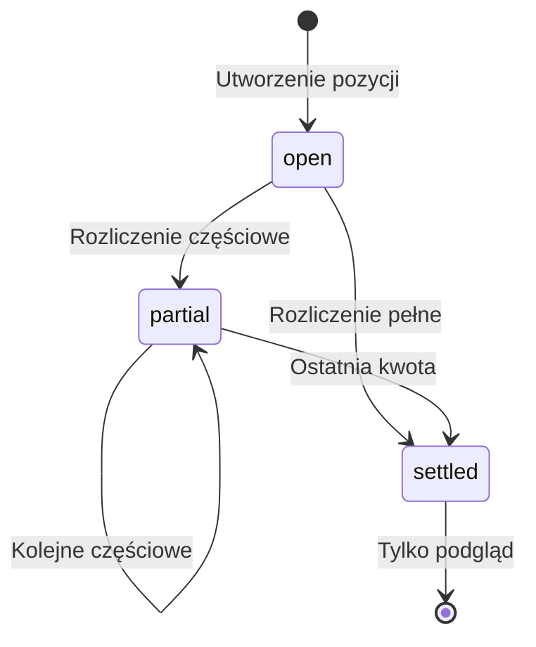
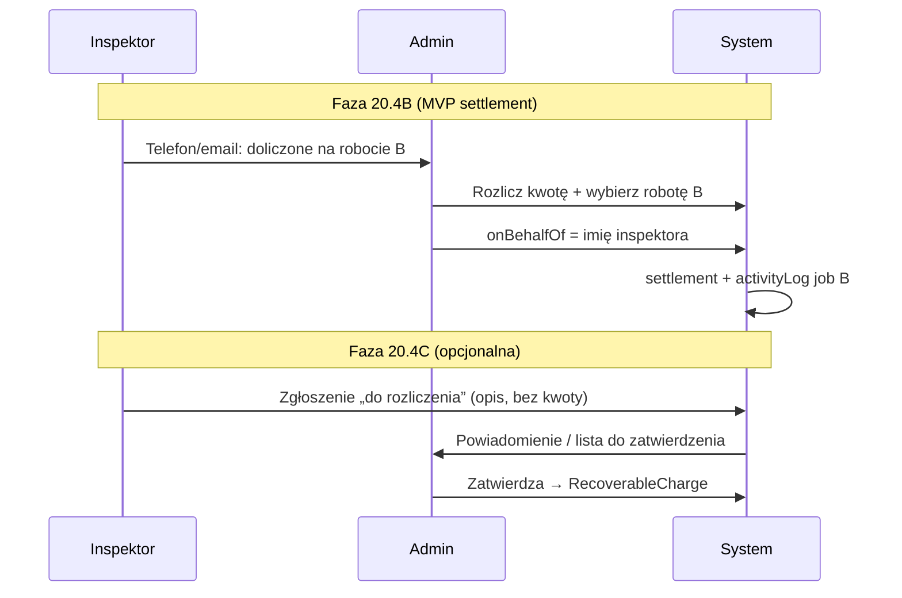
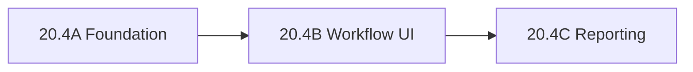

# Sprint 20.4A — Settlement Workflow (AUDIT + DESIGN)

> **Data audytu:** 2026-06-06  
> **Tryb:** AUDYT + DESIGN — **bez implementacji, bez commitów, bez deploy**  
> **Prod baseline:** v2.46.01 · Sprint 20.3B MIN CLOSED  
> **Moduł:** 💰 Do rozliczenia (`RecoverableCharge`, KV `kw-recoverable-charges`)  
> **Źródła:** `src/lib/recoverable-charges.ts`, `RecoverableChargesView.tsx`, `docs/ADDITIONAL-BILLING-AUDIT-20.3A.md`

---

## Spis treści

1. [Kontekst i problem biznesowy](#1-kontekst-i-problem-biznesowy)
2. [KROK 1 — Analiza modelu RecoverableCharge](#2-krok-1--analiza-modelu-recoverablecharge)
3. [KROK 2 — Rozliczenia: wariant A i B](#3-krok-2--rozliczenia-wariant-a-i-b)
4. [KROK 3 — Nowy model: settlements[]](#4-krok-3--nowy-model-settlements)
5. [KROK 4 — Historia rozliczeń](#5-krok-4--historia-rozliczeń)
6. [KROK 5 — Inspektor i admin](#6-krok-5--inspektor-i-admin)
7. [KROK 6 — Widoczność](#7-krok-6--widoczność)
8. [KROK 7 — KPI](#8-krok-7--kpi)
9. [KROK 8 — Architektura i ryzyka](#9-krok-8--architektura-i-ryzyka)
10. [KROK 9 — Plan sprintów 20.4A / 20.4B / 20.4C](#10-krok-9--plan-sprintów-204a--204b--204c)
11. [RECOMMENDATION](#11-recommendation)

---

## 1. Kontekst i problem biznesowy

### 1.1 Co działa dziś (20.3A + 20.3A.1 + 20.3B MIN)

| Funkcja | Stan | Plik |
|---------|------|------|
| CRUD pozycji | ✅ | `RecoverableChargesView.tsx` |
| Źródło: robota / poza systemem | ✅ | `sourceType`, `sourceJobId`, `clientName` |
| Statusy UI: Do rozliczenia / Rozliczone częściowo / Rozliczone | ✅ (etykiety) | `RECOVERABLE_CHARGE_STATUS_LABELS` |
| Mini-KPI (tylko `open`, suma pełnych kwot) | ✅ | `openRecoverableChargesKpi()` |
| Badge menu (liczba `open`) | ✅ | `countOpenRecoverableCharges()` |
| Sync KV + tombstone | ✅ | `cloud-sync.ts` |
| Walidacja kwoty > 0, wymóg roboty | ✅ | `validateRecoverableChargeDraft()` |

### 1.2 Czego brakuje (problem biznesowy)

| Brak | Skutek |
|------|--------|
| Gdzie odzyskano pieniądze | Nie wiadomo, na której robocie / u którego klienta rozliczono |
| Ile odzyskano | Status `partial` / `settled` można ustawić **ręcznie** w formularzu — bez kwoty |
| Ile zostało | Brak pola `amountRemaining`; KPI liczy pełną kwotę pozycji `open` |
| Historia odzyskiwania | Tylko „Historia utworzenia” (createdBy, daty) — brak ledgeru rozliczeń |

### 1.3 Przykład biznesowy (wymaganie użytkownika)

```
Dodatkowe malowanie — 1 200 PLN  (pozycja / źródło: robota A)
        ↓ rozliczenie częściowe
Przedszkole nr 2 — 500 PLN       (robota docelowa B)
        ↓
Pozostało: 700 PLN
Status: Rozliczone częściowo
```

### 1.4 Luka w obecnym UI (krytyczna dla 20.4)

W formularzu edycji admin może **ręcznie zmienić status** bez żadnego rozliczenia:

```517:527:src/app/RecoverableChargesView.tsx
        <label className="block space-y-1">
          <span className="text-xs text-muted-foreground">Status</span>
          <select
            value={draft.status}
            onChange={(e) => onChange({ ...draft, status: e.target.value as RecoverableChargeStatus })}
```

**Wniosek audytu:** Settlement Workflow musi **zastąpić** ręczny dropdown statusem wyliczanym z `settlements[]`.

---

## 2. KROK 1 — Analiza modelu RecoverableCharge

### 2.1 Model obecny (v2.46.01)

```typescript
interface RecoverableCharge {
  id: string;
  createdAt: string;
  updatedAt: string;
  title: string;
  description: string;
  amount: number;                    // kwota należności (oryginał)
  status: "open" | "partial" | "settled";
  sourceType: "job" | "standalone";
  sourceJobId: string;
  clientName: string;
  createdBy: string;
  responsibleInspector: string;
  tags: string[];
}
```

**Uwagi:**
- `amount` = kwota do odzyskania (odpowiednik `amountOriginal` z audytu 20.3A).
- `status` jest **polem zapisanym**, nie pochodnym — bez powiązania z rozliczeniami.
- Brak `settlements`, `amountSettled`, `amountRemaining`.

### 2.2 Jak rozszerzyć model? (rekomendacja)

**Strategia: rozszerzenie w miejscu (additive), bez zmiany klucza KV.**

| Pole | Akcja | Uzasadnienie |
|------|-------|--------------|
| `amount` | **Zostaje** | Kompatybilność KV; semantyka = kwota pierwotna / należność |
| `settlements` | **Dodaj** `RecoverableChargeSettlement[]` | Ledger rozliczeń |
| `amountSettled` | **Dodaj** (cache) | Szybkie KPI, mniej przeliczeń w UI |
| `amountRemaining` | **Dodaj** (cache) | Lista, filtry, badge |
| `status` | **Zostaje w KV**, ale **tylko derived przy zapisie** | Filtry i badge bez przeliczania całej listy; synchronizowany z settlements |
| `settlementVersion` | **Opcjonalnie** | Licznik mutacji settlements — pomoc przy merge (20.4A) |

**Nie zmieniać w 20.4A:**
- `sourceType`, `sourceJobId`, `clientName`, `tags`, `title`, `description`
- Klucz `kw-recoverable-charges`
- Tombstone `kw-recoverable-charges-deleted-ids`
- Model `Job`, Payroll, Inspector KV

### 2.3 Jak nie rozwalić 20.3A?

| Zasada | Implementacja |
|--------|---------------|
| Additive only | Nowe pola opcjonalne w `normalizeRecoverableCharges` — domyślnie `settlements: []` |
| Stare rekordy czytają się bez błędu | `amountSettled = 0`, `amountRemaining = amount` jeśli brak settlements |
| Smoke 20.3A nadal PASS | Testy CRUD bez settlements; osobne testy settlement w 20.4A |
| KPI 20.3A.1 ewoluuje kontrolowanie | Badge/KPI przełączone na `amountRemaining` w 20.4B (nie w 20.4A foundation) |
| UI read-only note usunięty dopiero w 20.4B | Panel szczegółów dostaje sekcję „Rozliczenia” zamiast placeholdera |

### 2.4 Kompatybilność istniejących rekordów

**Scenariusz migracji przy odczycie (`normalizeRecoverableCharges`):**

```
IF settlements.length === 0:
  IF status === "settled" (legacy manual):
    → amountSettled = amount, amountRemaining = 0
    → settlements = [synthetic legacy entry]  LUB  flag legacyManualStatus
  IF status === "partial" (legacy manual):
    → amountSettled = 0, amountRemaining = amount  // brak danych — traktuj jak open
    → status := "open" + opcjonalny tag "wymaga weryfikacji"
  IF status === "open":
    → amountSettled = 0, amountRemaining = amount
```

**Rekomendacja produktowa:**

| Legacy status | Bez settlements | Akcja |
|---------------|-----------------|-------|
| `open` | 0 rozliczeń | Bez zmian |
| `settled` | 0 rozliczeń | **Jednorazowa syntetyczna wpis migracyjny** `legacy-migration` z `note: "Status ustawiony ręcznie przed workflow 20.4"` — zachowuje zamknięcie bez utraty informacji |
| `partial` | 0 rozliczeń | **Reset do `open`** + banner „Wymaga uzupełnienia rozliczeń” — bo nie wiadomo ile rozliczono |

**Backup JSON:** po deploy 20.4A stare pliki `.json` importują się przez ten sam `normalize` — bez migracji serwerowej.

---

## 3. KROK 2 — Rozliczenia: wariant A i B

### Wariant A — Pełne rozliczenie

| Pole UI | Wartość przykładu |
|---------|-------------------|
| Kwota pierwotna | 1 200 PLN |
| Rozliczono (ta operacja) | 1 200 PLN |
| Pozostało | 0 PLN |
| Status | Rozliczone (`settled`) |

**Reguły:**
- `settlement.amount === amountRemaining` (lub admin wpisuje kwotę = pozostała).
- Wymagane: data (auto), `settledBy` (sesja admina).
- Opcjonalne: `targetJobId` (robota docelowa — **rekomendowane**, nie wymagane w MVP).
- Po zapisie: `status → settled`, edycja kwoty pierwotnej **zablokowana** (tylko podgląd + ewentualna korekta przez admin super w 20.4C).

### Wariant B — Częściowe rozliczenie

| Pole UI | Wartość przykładu |
|---------|-------------------|
| Kwota pierwotna | 1 200 PLN |
| Rozliczono (suma) | 500 PLN |
| Pozostało | 700 PLN |
| Status | Rozliczone częściowo (`partial`) |

**Reguły:**
- `0 < settlement.amount <= amountRemaining`.
- Wiele wpisów `settlements[]` — każde częściowe rozliczenie to **osobny rekord**.
- Status `partial` dopóki `amountRemaining > 0`.
- Kolejne rozliczenie 700 PLN na robocie C → drugi wpis → `settled`.

### Diagram przejść statusów (po 20.4)



**Anty-wzorzec (usunąć):** ręczna zmiana statusu w `<select>` bez wpisu settlement.

### UI flow (propozycja 20.4B)

```
Szczegóły pozycji
  ├── Kwota: 1 200 PLN
  ├── Rozliczono: 500 PLN
  ├── Pozostało: 700 PLN
  ├── [ + Rozlicz kwotę ]
  └── Historia rozliczeń (tabela)
```

Formularz „Rozlicz kwotę”:
- Kwota (max = pozostało)
- Robota docelowa (select z listy `jobs`, opcjonalnie „Brak / poza systemem”)
- Notatka (np. „Doliczone do faktury VO”)
- Na podstawie informacji od (opcjonalnie — inspektor)

---

## 4. KROK 3 — Nowy model: settlements[]

### 4.1 Czy potrzebna jest tablica `settlements[]`?

**TAK** — to jedyny sposób na:
- wiele częściowych rozliczeń (Scenariusz C z audytu 20.3A),
- audyt kto/kiedy/ile/gdzie,
- merge wielourządzeniowy bez nadpisywania historii.

Alternatywy odrzucone:

| Alternatywa | Dlaczego nie |
|-------------|--------------|
| Tylko `amountSettled` + `lastSettlementJobId` | Brak historii wielu kroków |
| Osobny KV `kw-recoverable-settlements` | Większe ryzyko sync orphan; dwa merge |
| Rozszerzenie `Job.activityLog` | Brak kwot rozliczenia per pozycja; trudne KPI cross-job |
| Status ręczny | Już jest — nie rozwiązuje problemu |

### 4.2 Rekomendowany schemat

```typescript
/** Pojedyncze rozliczenie / odzysk kwoty — append-only w ramach pozycji. */
export interface RecoverableChargeSettlement {
  id: string;
  amount: number;              // PLN, > 0, 2 dec
  settledAt: string;           // ISO datetime
  settledBy: string;             // displayName admina (z sesji)

  /** Robota, na której odzyskano / doliczono (cel rozliczenia). */
  targetJobId?: string;
  /** Denormalizacja przy zapisie — adres + klient (przetrwa usunięcie job z listy aktywnej). */
  targetJobLabel?: string;

  /** Notatka operacyjna: „doliczone do kosztorysu”, nr faktury, email. */
  note?: string;

  /**
   * Gdy admin rozlicza na podstawie informacji od inspektora (telefon/email).
   * settledBy = admin; onBehalfOf = imię inspektora z pola responsibleInspector lub wpisane.
   */
  onBehalfOf?: string;
  recordedVia?: "admin" | "on_behalf_of_inspector";

  /** Opcjonalnie w 20.4C+: dowód */
  // receiptUrl?: string;
}

export interface RecoverableCharge {
  // ... istniejące pola bez zmian nazw ...

  amount: number;                 // kwota pierwotna (należność)
  amountSettled: number;          // suma settlements (cache)
  amountRemaining: number;        // amount - amountSettled (cache, >= 0)
  status: RecoverableChargeStatus; // derived przy applySettlement
  settlements: RecoverableChargeSettlement[];
}
```

### 4.3 Funkcje domenowe (lib, nie UI)

```typescript
function sumSettlements(settlements: RecoverableChargeSettlement[]): number;
function deriveChargeAmounts(charge: RecoverableCharge): Pick<RecoverableCharge, "amountSettled" | "amountRemaining" | "status">;
function applySettlement(charge: RecoverableCharge, settlement: Omit<RecoverableChargeSettlement, "id">): RecoverableCharge;
function validateSettlementDraft(charge: RecoverableCharge, amount: number): ValidationResult;
// merge: mergeSettlementsById(local[], cloud[]) wewnątrz mergeRecoverableCharges
```

**Reguła spójności:** po każdym `applySettlement` przelicz `amountSettled`, `amountRemaining`, `status`, `updatedAt`.

### 4.4 Powiązanie z robotą docelową

| Relacja | Pole | Opis |
|---------|------|------|
| Źródło kosztu | `sourceJobId` | Skąd powstała należność (robota A) |
| Cel odzysku | `settlement.targetJobId` | Gdzie doliczono (robota B — Przedszkole nr 2) |

**Opcjonalnie 20.4B:** `appendJobActivity(jobB, "note", "Odzysk: 500 PLN — Dodatkowe malowanie (poz. RC-xxx)", admin)` — bez nowego typu `JobActivityType` w 20.4A (minimalny diff: użyć `note` lub dodać `billing_recovery` w 20.4B).

---

## 5. KROK 4 — Historia rozliczeń

### 5.1 Wymagania audytowe

Firma musi widzieć per wpis:

| Pole | Źródło danych |
|------|---------------|
| Data | `settlement.settledAt` → UI `12.07.2026` |
| Kto rozliczył | `settlement.settledBy` → „Dawid” |
| Na jakiej robocie | `targetJobLabel` lub lookup `targetJobId` |
| Kwota | `settlement.amount` → „500 PLN” |
| Kontekst | `note`, `onBehalfOf` |

### 5.2 Widok w panelu szczegółów (makieta)

```
┌─────────────────────────────────────────────────────────┐
│  Dodatkowe malowanie                                    │
│  Kwota: 1 200,00 zł · Rozliczono: 500,00 zł            │
│  Pozostało: 700,00 zł · Status: Rozliczone częściowo   │
├─────────────────────────────────────────────────────────┤
│  Historia rozliczeń                                     │
│  ┌───────────────────────────────────────────────────┐  │
│  │ 10.03.2026 · 500,00 zł                            │  │
│  │ Rozliczył: Dawid                                    │  │
│  │ Robota: Przedszkole nr 2 — ul. …                   │  │
│  │ Notatka: Doliczone do kolejnej roboty (VO)         │  │
│  └───────────────────────────────────────────────────┘  │
│  [ + Rozlicz kolejną kwotę ]                            │
├─────────────────────────────────────────────────────────┤
│  Historia utworzenia (bez zmian)                        │
│  Utworzono · Autor · Ostatnia zmiana                    │
└─────────────────────────────────────────────────────────┘
```

### 5.3 Operacje na historii (zakres sprintów)

| Operacja | 20.4A | 20.4B | 20.4C |
|----------|-------|-------|-------|
| Dodaj settlement | Model + merge | UI | — |
| Podgląd listy settlements | — | UI | — |
| Cofnij / edytuj settlement | — | — | Opcjonalnie (wysokie ryzyko księgowe) |
| Usuń całą pozycję | ✅ (tombstone) | ✅ | ✅ |

**Rekomendacja:** settlements są **append-only** w 20.4A–B. Korekty przez nowy wpis ujemny — **nie** w MVP (zbyt ryzykowne). Ewentualny „write-off” jako osobny status w 20.4C.

---

## 6. KROK 5 — Inspektor i admin

### 6.1 Scenariusz biznesowy

Inspektor informuje telefonicznie lub mailem: *„To już doliczyłem do kolejnej roboty”*. Admin musi to odzwierciedlić w systemie.

### 6.2 Pytania audytowe

| Pytanie | Rekomendacja |
|---------|--------------|
| **A. Czy admin może rozliczyć za inspektora?** | **TAK** — to główny kanał w 20.4B. Inspektor dziś nie ma widoku „Do rozliczenia”. |
| **B. Czy pokazać „Rozliczył: Admin, na podstawie: Inspektor X”?** | **TAK** — pola `settledBy` + `onBehalfOf` + `recordedVia: "on_behalf_of_inspector"`. |

### 6.3 Model workflow (fazy)



| Faza | Zakres | Sprint |
|------|--------|--------|
| **MVP** | Tylko admin rozlicza; checkbox „Na podstawie informacji od inspektora” + pole `onBehalfOf` (prefill z `responsibleInspector`) | **20.4B** |
| **Rozszerzenie** | Inspektor składa **zgłoszenie** (opis, zdjęcie) — admin konwertuje na pozycję / rozliczenie | **20.4C** |
| **Poza zakresem** | Inspektor samodzielnie rozlicza kwoty | Nie — brak uprawnień finansowych |

---

## 7. KROK 6 — Widoczność

### 7.1 Role dziś

| Rola | Dostęp do Do rozliczenia |
|------|--------------------------|
| Admin / Super Admin | Pełny CRUD (`RecoverableChargesView`) |
| Inspektor | **Brak** — osobny panel, bez modułu billing |
| Pracownik | Brak |

### 7.2 Czy projektować „Prywatne / Udostępnione inspektorowi”?

**Rekomendacja: ZOSTAWIĆ NA PÓŹNIEJSZY SPRINT (≥ 20.5 lub 20.4C+).**

| Argument | Ocena |
|----------|-------|
| Wartość vs koszt | Niska w MVP — jedna firma, jeden admin rozlicza |
| Model danych | Wymagałby `visibility: "admin" \| "shared"` + ekran inspektora |
| Ryzyko | Scope creep, uprawnienia, sync |

**Na teraz (20.4A–B):**
- Widoczność: **tylko admin**
- Inspektor: **brak widoku**; ślad przez `onBehalfOf` w historii

**20.4C (opcjonalnie):**
- Read-only podgląd inspektora: pozycje gdzie `responsibleInspector` = ja (bez kwot edycji)
- Lub powiadomienie na pulpicie inspektora: „Twoje zgłoszenia rozliczone”

---

## 8. KROK 7 — KPI

### 8.1 Metryki docelowe (po settlement)

| Metryka UI (PL) | Obliczenie | Priorytet |
|-----------------|------------|-----------|
| **Do rozliczenia** | `sum(amountRemaining)` gdzie `status ∈ {open, partial}` | P0 |
| **Rozliczone częściowo** | `count` gdzie `status === partial` lub `amountSettled > 0 && amountRemaining > 0` | P1 |
| **Odzyskano** (okres) | `sum(settlement.amount)` w wybranym okresie (np. miesiąc bieżący) | P1 |
| **Odzyskano** (łącznie) | `sum(wszystkie settlement.amount)` — **uwaga:** to nie to samo co „do rozliczenia” | P2 |
| Liczba pozycji otwartych | `count` gdzie `amountRemaining > 0` | P0 (badge) |

**Przykład użytkownika:**

```
Do rozliczenia:     8 200 PLN   ← sum(amountRemaining), open+partial
Rozliczone częściowo: 1 400 PLN ← sum(amountRemaining) tylko partial LUB sum(amountSettled) partial
Odzyskano:         32 000 PLN   ← sum(settlements) w roku / all-time (osobna metryka!)
```

### 8.2 Stan KPI dziś vs docelowy

| Miejsce | Dziś (2.46.01) | Po 20.4B |
|---------|----------------|----------|
| Mini-KPI widoku | Suma pełnych kwot tylko `open` | Suma `amountRemaining` (open+partial) |
| Badge menu | `count(open)` | `count(amountRemaining > 0)` |
| Kolumna lista | Pełna `amount` | Pokazać `pozostało` lub `500/1200` |
| Dashboard | Brak | Kafelek P1 w **20.4C** |
| Command Center | Brak | Widget P2 w **20.4C** — świadomy wyjątek od CC polonizacji |

### 8.3 Gdzie pokazać (rekomendacja sprintów)

| Miejsce | Sprint | Uzasadnienie |
|---------|--------|--------------|
| **Do rozliczenia** — pasek 3 KPI | 20.4B | Bezpośrednia wartość dla właściciela |
| **Sidebar badge** | 20.4B | `count(remaining > 0)` |
| **Dashboard** — kafelek + alert ageing | 20.4C | `attentionCount`, top 5 najstarszych |
| **Command Center** | 20.4C+ | Owner-only; nie blokuje settlement core |
| **Roboty** — zakładka powiązane pozycje | 20.4B | Kontekst źródło/cel |

---

## 9. KROK 8 — Architektura i ryzyka

### 9.1 Migracja danych

| Ryzyko | Poziom | Mitigacja |
|--------|--------|-----------|
| Stare rekordy bez `settlements` | LOW | `normalize` + reguły legacy (§2.4) |
| Ręczny status `partial` bez kwot | MEDIUM | Reset do `open` + banner w UI |
| Import backup sprzed 20.4 | LOW | Ten sam `normalize` przy imporcie JSON |
| Zmiana semantyki KPI | MEDIUM | Osobny smoke + changelog; komunikat w Guide |

### 9.2 Sync chmury (KV)

**Obecny merge:** cały rekord `RecoverableCharge` — wygrywa nowszy `updatedAt`.

**Ryzyko:** dwa urządzenia dodają **różne** settlements tej samej pozycji równolegle — starszy rekord może **nadpisać** tablicę `settlements`.

**Mitigacja (20.4A — wymagana w foundation):**

```typescript
function mergeSettlements(local: Settlement[], cloud: Settlement[]): Settlement[] {
  const byId = new Map<string, Settlement>();
  for (const s of [...local, ...cloud]) byId.set(s.id, s); // przy remisie: cloud lub wyższy settledAt
  return [...byId.values()].sort((a, b) => a.settledAt.localeCompare(b.settledAt));
}

// W mergeRecoverableCharges: po wyborze charge (LWW updatedAt),
// ZAWSZE mergeSettlements(prev.settlements, next.settlements) — nie brać settlements „z wygrywającego” w ciemno
```

| Ryzyko sync | Poziom | Mitigacja |
|-------------|--------|-----------|
| Utrata settlements przy merge | **HIGH** bez fix | Union settlements by `id` |
| Konflikt kwot cache | MEDIUM | Po merge zawsze `deriveChargeAmounts()` |
| Tombstone delete charge | LOW | Już działa — settlements znikają z rekordem |

### 9.3 Backup / restore

- `kw-recoverable-charges` już w backup JSON (`App.tsx` export).
- Nowe pola serializują się automatycznie.
- **Test:** smoke import/export po 20.4A.

### 9.4 Regresje innych modułów

| Moduł | Dotknięty? | Ryzyko |
|-------|------------|--------|
| Payroll | Nie | LOW |
| Employee Leaves | Nie | LOW |
| Inspector | Tylko opcjonalny `activityLog` w 20.4B | LOW |
| Job model | Tylko append activity, nie nowe pola Job | LOW |
| Command Center | Widget opcjonalny 20.4C | LOW |

### 9.5 Dokładność kwot

| Ryzyko | Poziom | Mitigacja |
|--------|--------|-----------|
| Float drift | MEDIUM | `toFixed(2)` wszędzie; testy 1200 - 500 = 700 |
| settlement > remaining | HIGH | Walidacja `validateSettlementDraft` |
| Suma settlements > amount | HIGH | Blokada zapisu |

**Ogólna ocena ryzyka wdrożenia settlement:** **MEDIUM** (sync settlements merge = główny techniczny punkt uwagi).

---

## 10. KROK 9 — Plan sprintów 20.4A / 20.4B / 20.4C

> **Uwaga numeracji:** Sprint 20.3B został użyty na UI Language MIN. Settlement przesuwa się na **20.4x** zgodnie z tym audytem.

### Sprint 20.4A — Foundation (model + merge + derive)

**Cel:** Przygotować dane pod workflow bez pełnego UI rozliczania.

| Element | Zakres |
|---------|--------|
| Typ `RecoverableChargeSettlement` | Schema + `normalize` |
| Pola `settlements`, `amountSettled`, `amountRemaining` | Additive na `RecoverableCharge` |
| `deriveChargeAmounts`, `applySettlement`, `validateSettlementDraft` | `recoverable-charges.ts` |
| `mergeRecoverableCharges` | Union `settlements` by id + recompute |
| Migracja legacy status | Reguły §2.4 w `normalize` |
| Testy | `smoke-test-recoverable-charges-settlement-20.4a.mjs` — derive, partial, full, merge |
| **Bez** | UI „Rozlicz”, Dashboard, Inspector, usuwanie dropdown statusu |

**Pliki (szac.):** `recoverable-charges.ts`, `cloud-sync.ts` (jeśli merge helper), smoke, `changelog-data.ts`, `GuideView` (sekcja planowana), `ARCHITECTURE.md` (krótki akapit)

**Szacunek:** ~4–6 plików · **MEDIUM** · regresja **LOW** jeśli UI nietknięte

---

### Sprint 20.4B — Workflow (UI + reguły biznesowe)

**Cel:** Pełny Wariant A i B w produkcji.

| Element | Zakres |
|---------|--------|
| UI „Rozlicz kwotę” | Modal / panel w `ChargeDetailPanel` |
| Historia rozliczeń | Lista chronologiczna |
| Usunięcie ręcznego `<select> status` | Status tylko derived |
| Wyświetlanie Kwota / Rozliczono / Pozostało | Nagłówek + lista `X/Y zł` |
| `targetJobId` + `targetJobLabel` | Select roboty docelowej |
| `onBehalfOf` | Checkbox + pole (inspektor) |
| `appendJobActivity` na robocie docelowej | Opcjonalnie typ `note` |
| KPI 3-liniowy w widoku | Do rozliczenia / częściowo / pozycje |
| Badge menu | `amountRemaining > 0` |
| Sekcja w `JobsView` | Pozycje jako źródło + jako cel (read-only linki) |
| Testy E2E/smoke | Rozliczenie partial + full na prod |

**Pliki (szac.):** `RecoverableChargesView.tsx`, `recoverable-charges.ts`, `JobsView.tsx` (sekcja), `admin-nav.ts` (badge), `GuideView`, smoke

**Szacunek:** ~8–12 plików · **MEDIUM** · regresja **MEDIUM** (UX + KPI)

---

### Sprint 20.4C — Visibility / Reporting

**Cel:** Widoczność dla właściciela i opcjonalnie inspektora.

| Element | Zakres |
|---------|--------|
| Dashboard kafelek | „Do odzyskania” PLN + link do widoku |
| `attentionCount` | Pozycje > 30 dni z `amountRemaining > 0` |
| Eksport CSV/PDF | Otwarte pozycje + historia rozliczeń okresu |
| Command Center widget | Owner-only, opcjonalnie |
| Inspektor: zgłoszenie pozycji | Formularz bez kwoty → kolejka admina (opcjonalnie) |
| Inspektor: read-only | Pozycje gdzie `responsibleInspector` match (opcjonalnie) |
| `written_off` | Anulowanie należności z powodem (opcjonalnie) |
| Widoczność shared | **Tylko jeśli** wymagane po UAT 20.4B — inaczej backlog |

**Szacunek:** ~10–15 plików · **MEDIUM** · regresja **LOW–MEDIUM**

### Zależności



```
20.3A/20.3A.1/20.3B MIN (CLOSED) → 20.4A → 20.4B → 20.4C
```

**Wersjonowanie propozycja:**
- 20.4A → v2.47.00 (model only, niewidoczne dla usera lub dev note)
- 20.4B → v2.48.00 (workflow live)
- 20.4C → v2.49.00 (dashboard + export)

---

## 11. RECOMMENDATION

### Czy wdrażać Settlement Workflow jako następny moduł WGDOM?

**TAK — rekomendacja: wdrożyć jako następny logiczny krok po foundation 20.3A.**

| Kryterium | Ocena | Uzasadnienie |
|-----------|-------|--------------|
| **Wartość biznesowa** | **HIGH** | Bez ledgeru moduł jest kartoteką — nie odpowiada na „ile odzyskano / ile zostało” |
| **Złożoność** | **MEDIUM** | Wzorzec znany (`employee-leaves` + append ledger); główna trudność = merge settlements |
| **Ryzyko** | **MEDIUM** | Sync wielourządzeniowy; migracja legacy manual status |
| **ROI** | **HIGH** | 2–3 sprinty na domknięcie pętli od rejestru do odzysku |

### Decyzje projektowe — podsumowanie

| # | Decyzja |
|---|---------|
| 1 | **`settlements[]`** jako ledger; nie osobny KV |
| 2 | **`amount`** zostaje jako kwota pierwotna; dodać `amountSettled` / `amountRemaining` (cache) |
| 3 | **`status` derived** przy zapisie — usunąć ręczny dropdown w 20.4B |
| 4 | **Cel rozliczenia** = `settlement.targetJobId` (robota docelowa, np. Przedszkole nr 2) |
| 5 | **Admin rozlicza za inspektora** w 20.4B (`onBehalfOf`); pełny kanał inspektora w 20.4C |
| 6 | **Widoczność shared** — odłożyć; admin-only do końca 20.4B |
| 7 | **Merge settlements by id** — obowiązkowe w 20.4A foundation |
| 8 | **KPI** — przejście na `amountRemaining`; Dashboard w 20.4C |
| 9 | **Command Center** — bez zmian w 20.4A/B; widget opcjonalnie 20.4C |

### Ocena końcowa LOW / MEDIUM / HIGH

| Wymiar | Poziom |
|--------|--------|
| Wartość biznesowa | **HIGH** |
| Złożoność implementacji | **MEDIUM** |
| Ryzyko projektu | **MEDIUM** |
| Pilność względem innych modułów | **HIGH** — foundation bez settlement nie domyka obietnicy modułu |

### Czy jednym „dużym” sprintem?

| Wariant | Realność |
|---------|----------|
| 20.4A + 20.4B razem | Możliwe dla doświadczonego sprintu (~2 tyg.), ale **ryzykowne** — lepiej rozdzielić model/merge od UI |
| Rekomendowany plan | **20.4A (1 sprint)** → **20.4B (1 sprint)** → **20.4C (opcjonalny)** |

---

**Dokument:** `docs/SETTLEMENT-WORKFLOW-AUDIT-20.4A.md`  
**Status:** AUDIT + DESIGN COMPLETE — **bez implementacji**  
**Następny krok:** Akceptacja zakresu **20.4A Foundation** → implementacja modelu i merge settlements
