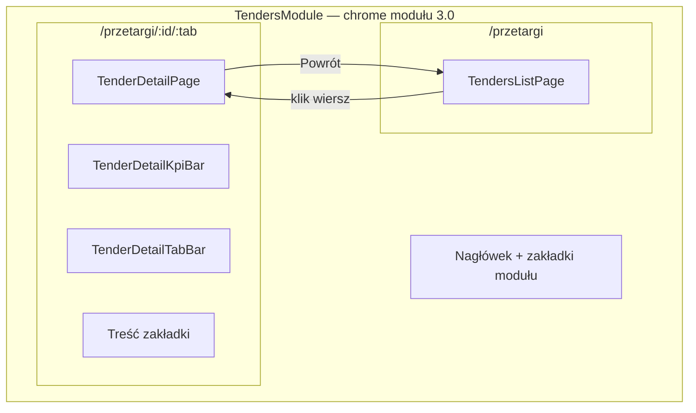

# Przetargi V4 — plan UX (nawigacja i routing)

**Status:** Faza 1 MVP — w implementacji  
**Baseline:** V3.1 Intelligence (2.60.0) — bez zmian logiki scoringu / overlay / dossier  
**Zakres V4:** UX · routing · nawigacja · layout

---

## Problem (V3)

```text
Lista → accordion → TenderDetailPanel → scroll → utrata orientacji
```

Użytkownik traci kontekst: nie wie, czy jest na liście czy w szczegółach; KPI i zakładki są „w środku” accordionu.

---

## Cel (V4)

```text
Lista → klik → /przetargi/:id/:tab → osobny widok szczegółu
```

- Powrót do listy jednym kliknięciem  
- Breadcrumb + tytuł przetargu  
- KPI bar na górze (termin, wadium, ZNW, wartość, warunki udziału)  
- Tab bar V4 (7 zakładek; MVP: 4 aktywne + 3 placeholder)

---

## Routing (SSOT)

| Ścieżka | Ekran |
|---------|--------|
| `/przetargi` | Lista przetargów (`TendersListPage`) |
| `/przetargi/:tenderId` | Redirect / domyślna zakładka `przetarg` |
| `/przetargi/:tenderId/:tab` | Szczegół (`TenderDetailPage`) |

**Slugi zakładek V4** (plik `src/lib/tender-detail-routes-v4.ts`):

| Slug V4 | Etykieta UI | Legacy workspace (UX.1B) | MVP |
|---------|-------------|--------------------------|-----|
| `przetarg` | Przetarg | — (shell formalny) | Aktywna |
| `kosztorys` | Kosztorys | `documents` (docelowo) | Placeholder |
| `ceny` | Ceny | `valuation` | Aktywna → `TenderBidProposalPanel` |
| `materialy` | Materiały | — | Placeholder |
| `strategia` | Strategia | — | Placeholder |
| `decyzja` | Decyzja | `overview` | Aktywna → `TenderOwnerView` |
| `dokumenty` | Dokumenty | `documents` | Aktywna → `TenderDocumentsWorkspace` |

---

## Mapa ekranów



**Warstwy (bez zmian logiki V3.1):**

- Intelligence / scoring / overlay — tylko w `decyzja` przez istniejący `TenderOwnerView` + `buildTenderIntelligenceContext`
- Dokumenty / dossier / ATH — reuse `TenderDocumentsWorkspace` + stan z `TenderDetailPanel`
- Wycena — reuse `TenderBidProposalPanel`

---

## Feature flag

```ts
// src/lib/tenders-v4-config.ts
export const TENDERS_V4_ROUTING = true
```

- `true` — lista bez accordionu, nawigacja URL, `TenderDetailPage`  
- `false` — legacy accordion + `TenderDetailPanel` inline (rollback bez revertu kodu)

Router: `BrowserRouter` w `main.tsx`; synchronizacja `view === "tenders"` w `App.tsx` gdy pathname zaczyna się od `/przetargi`.

---

## MVP Fazy 1 (definicja done)

1. Klik w przetarg → URL `/przetargi/:id/przetarg` (lub inna zakładka)  
2. Osobny widok — brak accordionu na liście  
3. Powrót do listy → `/przetargi`  
4. KPI bar: 5 pól display-only (brak danych → „—”)  
5. Zakładki aktywne: **Przetarg**, **Ceny**, **Dokumenty**, **Decyzja**  
6. **Kosztorys**, **Materiały**, **Strategia** → „Wkrótce”  
7. Build PASS · testy V3.1 bez regresji  

**Poza MVP Fazy 1:** pełne zakładki Kosztorys/Materiały/Strategia, usunięcie legacy accordion, E2E `/przetargi/*`, deep link z Pulpitu bez `pendingTenderId`.

---

## Kolejność wdrożenia

| Krok | Opis |
|------|------|
| **1** | SSOT routes + config flag |
| **2** | `BrowserRouter` + sync view ↔ pathname |
| **3** | `TendersListPage` (lista bez panelu) |
| **4** | `TenderDetailPage` shell + KPI + tab bar |
| **5** | Embed `TenderDetailPanel` (content-only) dla decyzja/dokumenty/ceny |
| **6** | Placeholder zakładek + zakładka Przetarg (metadane) |
| **7** | Build + smoke V3.1 |
| **Faza 2** | Pełne zakładki, deprecacja accordion, testy E2E, changelog prod |

---

## Zakazy (Faza 1)

Nie modyfikować: `tender-intelligence-*`, silnik scoringu, ATH parser, dossier pipeline, qualification workspace, kalkulator wyceny, strategia COMMAND CENTER.

---

*Ostatnia aktualizacja: 2026-06-18 — Faza 1 MVP*
