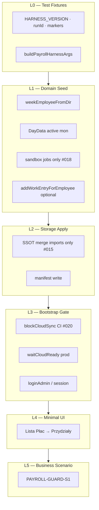

# TEST-INFRA-001 — Universal Payroll Test Harness · DESIGN FREEZE

> **Status:** **DESIGN FREEZE FINAL — APPROVED** · **READY FOR IMPLEMENTATION**  
> **Data freeze:** 2026-07-01 · **data akceptacji:** 2026-07-01 · **wersja dokumentu:** v1.1 FINAL  
> **Epic ID:** TEST-INFRA-001  
> **Baseline prod:** v2.63.16+ (`CloudSyncMutationGuard` CLOSED) · **STABILIZATION WINDOW:** ACTIVE  
> **Implementacja:** **nie rozpoczęta** — tylko na wyraźne polecenie (okno stabilizacji)

---

## 0. Werdykt freeze

| Pole | Wartość |
|------|---------|
| **Epic ID** | TEST-INFRA-001 — Universal Test Harness (Payroll P0 → Core reuse) |
| **Principles** | **#014–#026** — FINAL |
| **Nowe pole KV** | **Brak** — harness używa istniejących kluczy |
| **Zmiana modelu danych** | **Brak** — seed przez SSOT lib |
| **Zakres** | L0–L5, API harness, manifest, macierz środowisk, Prod Job Sandbox |
| **Poza zakresem (implementacja P0)** | Ekstrakcja `removeWeekEmployee` do lib · konfiguracja `HARNESS_SANDBOX_JOB_IDS` — patrz §13 backlog techniczny |
| **Status implementacji** | **READY FOR IMPLEMENTATION** (design zamrożony; kod **nie** rozpoczęty) |

### Ocena końcowa

**DESIGN FREEZE FINAL — APPROVED**

Warunki z audytu FINAL REVIEW (#018 Prod Job Sandbox, rozszerzony manifest, zamrożona lista SSOT, #014–#026) są spełnione. Dokument zatwierdzony przez właściciela repo — implementacja harnessu **dozwolona na polecenie**, z uwzględnieniem backlogu technicznego §13 przed prod smoke.

---

## 1. Cel i kontekst

Harness przygotowuje **dane i UI preconditions** dla Playwright w module Lista Płac (Przydziały robót). Nie zastępuje testów jednostkowych (`test-cloud-sync-mutation-guard.mjs`, T11/T12).

**Problem źródłowy:** POST RELEASE SMOKE P0 — false negative harnessu (błędny model `DayData`, brak manifestu, losowe joby prod).

**Istniejący wzorzec do reuse:** `e2e/fixtures/e2e-seed.ts`, `e2e/helpers/jobs.ts` (`blockCloudSync`).

---

## 2. Architektura L0–L5



| Warstwa | Odpowiedzialność | Zakaz |
|---------|------------------|-------|
| **L0** | Stałe ID, `HARNESS_VERSION`, prefixy `e2e-payroll-` / `smoke-payroll-` | Logika domenowa |
| **L1** | Budowa obiektów przez SSOT lib | Własne reguły godzin/merge |
| **L2** | Wstrzyknięcie do LS + manifest | Własne funkcje merge |
| **L3** | Cloud block / ready, auth | Pełny bootstrap replace |
| **L4** | Nawigacja do panelu testowego | Ścieżka Kadry (chyba że scenariusz explicite) |
| **L5** | Assert scenariusza biznesowego | Seed danych |

---

## 3. Principles #014–#026 (wiążące — FINAL)

### #014 — Harness Never Owns Domain

Harness **orchestruje** wywołania SSOT. Zero własnych reguł: godzin LP, spójności LP↔Roboty, deduplikacji składu, merge KV.

Dozwolone w harness: stałe testowe, manifest, nawigacja UI, `page.evaluate` jako transport do LS.

### #015 — SSOT Import Only

L1 i L2 **wyłącznie** importują symbole z zamrożonej listy (§8). Zakaz lokalnych `mergeArrayById`, `mergeDirectoryEntry`, własnych parserów `DayData`.

L2 może: odczytać LS → wywołać SSOT merge → zapisać wynik → zaktualizować manifest.

### #016 — Manifest Mandatory on Prod

Każdy run na prod (`target: "prod"`) **musi** utworzyć `HarnessRunManifest` przed jakąkolwiek mutacją danych.

Brak manifestu = **HARD FAIL** (nie uruchamiaj scenariusza).

Cleanup w bloku `finally` — bez wyjątków.

### #017 — Merge-Only on Prod

Na prod **zakaz**:

- `localStorage.setItem("kw-jobs", JSON.stringify(entireArray))`
- `localStorage.setItem("kw-week-employees", JSON.stringify(entireArray))`
- `localStorage.setItem("kw-directory", JSON.stringify(entireArray))`
- nadpisywania `kw-weekFrom` / `kw-weekTo`
- `pushAllDataToCloud` / `batch-set` pełnego snapshotu

Dozwolone: chirurgiczny patch po ID z manifestu + `pushKeysToCloud` / `pushDirectoryToCloud` / `pushWeekEmployeesToCloud` tylko dla `cloudPushKeys[]`.

### #018 — Prod Job Sandbox

Na prod harness **nie może** używać losowych / dowolnych robotów z dropdownu użytkownika.

`workEntry` i scenariusze przydziałów dozwolone **wyłącznie** na jobach spełniających **co najmniej jedno**:

| Kryterium | Opis |
|-----------|------|
| **A — Marker adresu** | `job.address` lub `job.notes` zawiera `• TEST-INFRA-001` lub prefix `smoke-payroll-` |
| **B — Whitelist** | `job.id` ∈ `HARNESS_SANDBOX_JOB_IDS` (konfiguracja testowa, max 2 joby, utrzymywane ręcznie przez Super Admin) |
| **C — Synthetic preview-only** | Joby `e2e-payroll-job-*` — **tylko** `localhost` / `preview`, **nigdy** prod |

**Strategia prod (domyślna):** kryterium **B** jeśli whitelist skonfigurowana; inaczej **A** (dedykowane joby sandbox w prod KV).

**Zakaz:** `jobsForPayrollAssignmentDropdown(jobs)[0]` bez walidacji sandbox na prod.

### #019 — Tombstone Parity on Cleanup

Cleanup sync-safe:

| Artefakt | SSOT delete |
|----------|-------------|
| `workEntry` | `removeWorkEntryFromJobs` → `appendWorkEntryTombstone` |
| `directory` | filter z `kw-directory` + `addDeletedDirectoryId` |
| `weekEmployee` | filter po `weekEmployeeId` + `pushWeekEmployeesToCloud` |

Manifest musi rejestrować `workEntryTombstoneIds` i `directoryDeletedIds` (§5).

### #020 — CI Isolation

| Środowisko | Cloud |
|------------|-------|
| `localhost`, `preview` | `blockCloudSync(page)` — **wymagane** w CI |
| `prod` | live sync — tylko scenariusze sync-guard (L5), nigdy w unit gate CI |

Regresja CI = preview @4173, nie prod.

### #021 — Harness Versioning

Stała `HARNESS_VERSION` (semver) w manifeście i w raporcie testu.

Gate kompatybilności: harness `1.x` wymaga app `≥ 2.63.16` (guard). Breaking change w SSOT merge → bump minor harness + aktualizacja §8.

### #022 — HarnessPreconditionError vs ScenarioFail

Dwa typy porażki — **rozdzielne w raporcie CI**:

| Typ | Znaczenie | Przykład |
|-----|-----------|----------|
| `HarnessPreconditionError` | Dane/UI niegotowe — **nie** regresja produktu | `NO_HOURS`, `NO_SANDBOX_JOBS`, `PANEL_EMPTY` |
| `ScenarioFail` | Preconditions OK, assert scenariusza failed | dropdown cofnięty po sync |

Kody precondition: `NO_WEEK_EMPLOYEE`, `NO_HOURS`, `NO_SANDBOX_JOBS`, `BOOTSTRAP_TIMEOUT`, `SANDBOX_VIOLATION`.

### #023 — Production Directory Semantics

Seed `DirectoryEmployee` musi przejść `isProductionDirectoryEmployee` (`testAccount !== true`, nie heurystyka konta testowego).

Marker harness w `notes` / `position`, nie w imieniu przypominającym konto `test`.

### #024 — Respect Payroll Roster Push Window

Seed i cleanup **nie walczą** z orchestracją z PAYROLL-CLOUD-RECOVERY (#005):

- nie wykonuj pull-merge składu w oknie `payrollRosterPushRef`
- po mutacji składu preferuj `pushWeekEmployeesToCloud(..., { skipPayrollGuard: true })` gdy dodajesz osobę bez godzin
- odczekaj `suppressAutoSyncUntilRef` przed assert UI po seed

### #025 — Harness Must Be Disposable

Każdy artefakt utworzony przez harness musi być **w pełni usuwalny** przez `cleanupPayrollScenario` + manifest.

Żaden run nie może pozostawiać trwałych danych bez `runId` w śledzonym ID.

Jeśli cleanup fail → raport **CRITICAL** + lista IDs do ręcznego usunięcia.

### #026 — Harness Must Be Deterministic

Ten sam `runId` + `target` + `mode` + `HARNESS_VERSION` → ten sam stan L1 (poza `crypto.randomUUID()` w entry — UUID zapisywane w manifeście przy tworzeniu).

`currentWeekRange()` z fixture dla preview; prod używa **istniejącego** `kw-weekFrom`/`kw-weekTo` (nie zmienia).

CI: `blockCloudSync` eliminuje niedeterminizm chmury.

---

## 4. API (zamrożone)

### Lokalizacja (plan implementacji)

```text
e2e/
  fixtures/payroll-harness-seed.ts
  helpers/test-harness/
    core/manifest.ts
    core/storage-apply.ts
    core/bootstrap-gate.ts
    core/cleanup.ts
    payroll/payroll-ui.ts
    payroll/scenarios/guard-s1.ts
  payroll-guard-s1.spec.ts
```

### `seedPayrollAssignmentScenario`

```typescript
export const HARNESS_VERSION = "1.0.0";

export type PayrollHarnessTarget = "localhost" | "preview" | "prod";
export type PayrollAssignmentSeedMode = "empty" | "withEntryOnJobA";

export interface SeedPayrollAssignmentOptions {
  target: PayrollHarnessTarget;
  mode?: PayrollAssignmentSeedMode;
  /** preview/localhost: synthetic sandbox jobs OK; prod: sandbox only #018 */
  jobStrategy?: "sandbox" | "synthetic";
  runId?: string;
  /** prod: always true; preview: true when target !== localhost full-replace dev */
  mergeOnly?: boolean;
}

export interface PayrollAssignmentSeedResult {
  manifest: HarnessRunManifest;
  empName: string;
  weekEmployeeId: string;
  directoryId: string;
  weekFrom: string;
  weekTo: string;
  jobAId: string;
  jobBId: string;
  assignmentDateIso: string;
}

export async function seedPayrollAssignmentScenario(
  page: Page,
  opts: SeedPayrollAssignmentOptions,
): Promise<PayrollAssignmentSeedResult>;
```

### `waitForPayrollAssignmentReady`

```typescript
export interface WaitPayrollReadyOptions {
  timeoutMs?: number;
  requireDodajRobocine?: boolean;
  requireSelect?: boolean;
}

export async function waitForPayrollAssignmentReady(
  page: Page,
  result: PayrollAssignmentSeedResult,
  opts?: WaitPayrollReadyOptions,
): Promise<void>;
```

### `cleanupPayrollScenario`

```typescript
export interface CleanupOptions {
  target: PayrollHarnessTarget;
  pushCloud?: boolean; // prod: default true
}

export interface CleanupReport {
  runId: string;
  removed: { workEntries: number; weekEmployees: number; directory: number };
  tombstonesWritten: number;
  cloudPushed: string[];
  success: boolean;
}

export async function cleanupPayrollScenario(
  page: Page,
  manifest: HarnessRunManifest,
  opts: CleanupOptions,
): Promise<CleanupReport>;
```

---

## 5. HarnessRunManifest (rozszerzony — FINAL)

```typescript
export interface HarnessPriorSnapshots {
  /** Klucz: weekEmployeeId — stan przed patchem days / carry */
  weekEmployees?: Record<string, unknown>;
  /** Klucz: jobId — tylko sandbox jobs dotknięte przez harness */
  jobs?: Record<string, unknown>;
  /** Klucz: directoryId */
  directory?: Record<string, unknown>;
}

export interface HarnessRunManifest {
  runId: string;
  harnessVersion: string;
  environment: "localhost" | "preview" | "prod";
  createdAt: string;
  scenarioId: string;

  directoryIds: string[];
  weekEmployeeIds: string[];
  workEntryIds: string[];
  /** jobId → entryId[] — do cleanup + audytu */
  workEntryTombstoneIds: Array<{ jobId: string; entryId: string }>;
  /** IDs dodane do kw-directory-deleted-ids podczas cleanup */
  directoryDeletedIds: string[];
  touchedJobIds: string[];
  /** Stan LS sprzed mutacji — do rollbacku gdy patch istniejącego rekordu */
  priorSnapshots: HarnessPriorSnapshots;
  /** Wartość sprzed seed, jeśli harness ustawiał tryb listy */
  priorPayrollListMode: string | null;
  /** Klucze KV do push po cleanup na prod */
  cloudPushKeys: string[];
  keysWritten: string[];
}
```

### Sekwencja cleanup (SSOT)

```text
1. Dla każdego workEntryId → removeWorkEntryFromJobs (tombstone auto)
2. Zapis workEntryTombstoneIds w manifeście (audyt)
3. weekEmployees.filter(id ∉ weekEmployeeIds) → pushWeekEmployeesToCloud
4. directory: filter + addDeletedDirectoryId → pushDirectoryToCloud
5. priorSnapshots rollback — tylko gdy harness patchował istniejący rekord (nie usuwał)
6. przywróć priorPayrollListMode jeśli ≠ null
7. pushKeysToCloud(cloudPushKeys) na prod
```

---

## 6. Macierz środowisk

| Capability | localhost | preview | prod |
|------------|-----------|---------|------|
| `blockCloudSync` | zalecane | **wymagane CI** | **zakaz** (sync-guard) |
| Full LS slice replace | dozwolone (dev) | dozwolone | **zakaz** |
| Merge-only | opcjonalnie | zalecane | **wymagane** |
| Synthetic jobs (`e2e-payroll-job-*`) | TAK | TAK | **NIE** |
| Losowe joby użytkownika | NIE | NIE | **NIE** |
| Sandbox jobs (#018) | TAK | TAK | **TAK — jedyne** |
| Manifest + cleanup | zalecane | **wymagane** | **wymagane** |
| L5 Guard S1 live sync | opcjonalnie | skip (blocked) | **TAK** |

---

## 7. Prod Job Sandbox — operacyjna specyfikacja (#018)

### Wybór jobów

```typescript
function isHarnessSandboxJob(job: Job, target: PayrollHarnessTarget): boolean {
  if (target !== "prod") {
    return job.id.startsWith("e2e-payroll-job-") || job.notes?.includes("• TEST-INFRA-001");
  }
  if (HARNESS_SANDBOX_JOB_IDS.includes(job.id)) return true;
  return (
    job.address?.includes("smoke-payroll-") ||
    job.notes?.includes("• TEST-INFRA-001")
  );
}

function selectSandboxJobsForHarness(jobs: Job[], target: PayrollHarnessTarget): Job[] {
  const candidates = jobs.filter((j) => isHarnessSandboxJob(j, target));
  if (candidates.length < 2) {
    throw new HarnessPreconditionError("NO_SANDBOX_JOBS", "Need ≥2 sandbox jobs");
  }
  return candidates.slice(0, 2);
}
```

`selectSandboxJobsForHarness` jest **filtrem orchestracji** na już załadowanych jobach — **nie** zastępuje `jobsForPayrollAssignmentDropdown` (używany opcjonalnie do walidacji UI).

### Usunięte z poprzedniej wersji designu

- ~~„preferuj istniejące 2 roboty z dropdown” na prod~~
- ~~`jobStrategy: "existing"` bez sandbox check~~

Zastąpione przez **#018** i `jobStrategy: "sandbox" | "synthetic"`.

---

## 8. Zamrożona lista dozwolonych importów SSOT

Harness **MOŻE** importować **wyłącznie** symbole z poniższej listy. Import spoza listy = naruszenie #015.

### `src/app/app-domain.ts`

| Symbol | Użycie harness |
|--------|----------------|
| `weekEmployeeFromDir` | L1 nowy WeekEmployee |
| `defaultDays`, `defaultDay` | L1 bazowy kalendarz |
| `defaultDirEmployee` | L1 szkielet directory |
| `filterDirectoryForPayrollWeekAdd` | L1 dedup przed dodaniem |
| `isProductionDirectoryEmployee` | L1/#023 walidacja |
| `isTestDirectoryEmployee` | L1 guard — reject |
| `dayBaseHoursOnly` | L3 gate |
| `dayKeyForIsoInWeek` | L1 data przydziału |
| `weekDayColumns` | L1 pierwszy dzień roboczy |
| `hoursWorked` | L1 walidacja (read-only) |

### `src/lib/payroll-job-assignments.ts`

| Symbol | Użycie harness |
|--------|----------------|
| `addWorkEntryForEmployee` | L1 seed entry |
| `removeWorkEntryFromJobs` | cleanup #019 |
| `removeWorkEntriesMatchingFromJobs` | cleanup bulk (gdy runId w entry.notes) |
| `jobsForPayrollAssignmentDropdown` | L3 UI gate (walidacja, nie wybór prod job) |
| `appendWorkEntryTombstone` | tylko przez `removeWorkEntryFromJobs` |

### `src/lib/job-list-status.ts`

| Symbol | Użycie harness |
|--------|----------------|
| `inferJobPhase` | L1 filtr completed (informacyjnie) |

### `src/lib/cloud-sync.ts`

| Symbol | Użycie harness |
|--------|----------------|
| `mergeJobsById` | L2 merge patch jobów |
| `mergeWeekEmployees` | L2 merge składu (**nie** `mergeWeekEmployeesUnion`) |
| `mergeDirectory` | L2 merge kartyoteki |
| `mergeWorkEntriesById` | tylko pośrednio przez `mergeJobsById` |
| `weekEmployeeMergeKey` | L2 diagnostyka (opcjonalnie) |
| `normalizeJobsValue` | L2 parse |
| `addDeletedDirectoryId` | cleanup |
| `getDeletedDirectoryIds` | cleanup read |
| `DIRECTORY_DELETED_IDS_KEY` | manifest / cleanup |
| `pushKeysToCloud` | cleanup prod |
| `pushDirectoryToCloud` | cleanup prod |
| `pushWeekEmployeesToCloud` | cleanup prod |
| `DATA_KEYS` | allowlist kluczy |

### `e2e/fixtures/e2e-seed.ts`

| Symbol | Użycie harness |
|--------|----------------|
| `currentWeekRange` | L0 tydzień preview |
| `hashAdminPassword` | L3 auth preview |
| `buildE2eSeedArgs` | wzorzec — nie import bezpośredni w payroll harness |

### `e2e/helpers/jobs.ts`

| Symbol | Użycie harness |
|--------|----------------|
| `blockCloudSync` | L3 #020 |

### Jawny zakaz importów

- `App.tsx` (stan React, `removeWeekEmployee`, `persistPayrollRoster`)
- Wewnętrzne helpery harness jako źródło prawdy merge
- `mergeWeekEmployeesUnion` — **symbol nie istnieje**; używać `mergeWeekEmployees`

---

## 9. Harness Core — reuse modułów

| Moduł | L0–L3 Core | Rozszerzenie manifestu | Gotowość |
|-------|------------|------------------------|----------|
| **Payroll / Przydziały** | pełne | workEntry*, weekEmployee* | **P0** |
| **Roboty** | pełne + `e2e/helpers/jobs.ts` | workEntry* | **P1** |
| **Delegacje** | core | `payrollCarryForward` w priorSnapshots | P2 |
| **Rozliczenia** | core | `settled` w priorSnapshots | P2 |
| **Kadry** | core | directory* only | P2 |
| **Koszty** | core | `extraCosts[]` w priorSnapshots | P3 |

---

## 10. Plan implementacji (poza freeze)

| Faza | Zakres | Gate |
|------|--------|------|
| P0 | L0–L2 preview + manifest | vite-node seed unit |
| P1 | L3–L4 + `waitForPayrollAssignmentReady` | select visible preview |
| P2 | L5 S1 preview CI | `npm run test:e2e:payroll-guard` |
| P3 | prod merge-only + cleanup | dry-run manifest |
| P4 | prod smoke nightly | S1 live sync |

---

## 11. Ryzyka resztkowe (akceptowane)

| Ryzyko | Mitigacja w freeze |
|--------|-------------------|
| Brak `removeWeekEmployee` w lib | filter + `pushWeekEmployeesToCloud` (#019) |
| Whitelist sandbox jobów pusta na prod | `HarnessPreconditionError NO_SANDBOX_JOBS` — fail loud |
| Cleanup crash | #025 + CRITICAL report + manual ID list |
| Kolizja nazw z `e2e-z1-*` | osobny prefix `e2e-payroll-` |

---

## 12. Changelog dokumentu

| Wersja | Data | Zmiana |
|--------|------|--------|
| v0.1 | 2026-07-01 | Szkic TEST-INFRA-001 (audyt) |
| v1.0 FINAL | 2026-07-01 | FINAL REVISION: #014–#026, manifest, #018, SSOT list, `mergeWeekEmployees` |
| v1.1 FINAL | 2026-07-01 | **DESIGN FREEZE FINAL — APPROVED** · READY FOR IMPLEMENTATION · backlog §13 |

---

## 13. Backlog techniczny (przed / równolegle z implementacją)

| ID | Element | Priorytet | Kiedy |
|----|---------|-----------|-------|
| **TI-B1** | Ekstrakcja `removeWeekEmployee()` do warstwy lib (SSOT cleanup składu tygodnia; dziś tylko `App.tsx`) | P1 | Przed prod smoke L5 lub równolegle z P3 implementacji |
| **TI-B2** | Konfiguracja `HARNESS_SANDBOX_JOB_IDS` (≥2 joby sandbox na prod, Principle #018) | **P0 gate** | **Obowiązkowe przed pierwszym uruchomieniem produkcyjnym** harnessu |

**TI-B2 bez spełnienia:** prod run kończy się `HarnessPreconditionError NO_SANDBOX_JOBS` — zamierzone (fail loud).

---

*TEST-INFRA-001 DESIGN FREEZE v1.1 FINAL — APPROVED · READY FOR IMPLEMENTATION · kod na polecenie.*
