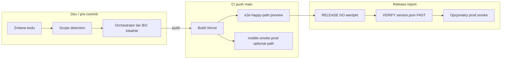

# TEST-INFRA-001 — Infrastruktura testowa · DESIGN FREEZE

> **Status:** **DESIGN FREEZE v2.0 — APPROVED** · **DESIGN ONLY** · **STOP**  
> **Data freeze:** 2026-07-01  
> **Epic ID:** TEST-INFRA-001  
> **Baseline prod:** v2.63.25 (`d9ba13f`)  
> **STABILIZATION WINDOW:** ACTIVE  
> **Implementacja:** **nie rozpoczęta** — tylko na wyraźne polecenie  
> **Podstawa:** [`TEST-INFRA-001-AUDIT-REPORT.md`](TEST-INFRA-001-AUDIT-REPORT.md)  
> **Powiązane:** [`WORKFLOW-RELEASE-DEPLOY.md`](WORKFLOW-RELEASE-DEPLOY.md)

**Zakaz tego dokumentu:** implementacja · kod · nowe testy biznesowe · backlog programistyczny · opis implementacji

---

## 0. Werdykt freeze

| Pole | Wartość |
|------|---------|
| **Przedmiot** | Infrastruktura testowa WGDOM — manifest, orchestrator, release gates, klasy testów, lifecycle |
| **MVP** | Manifest SSOT + Orchestrator + Payroll Harness E2E (L0–L5 preview CI) |
| **Poza MVP** | CI lib suite · prod nightly · reuse harness Roboty · coverage |
| **Principles infrastruktury** | **#001–#013** (ten dokument) |
| **Principles harness Payroll** | **#014–#026** (Aneks A — bez zmian) |
| **Nowe pole KV** | **Brak** |
| **Zmiana modelu danych** | **Brak** |

**DESIGN FREEZE v2.0 — APPROVED**

---

## 1. Cel i kontekst

TEST-INFRA-001 porządkuje **jak** uruchamiać i klasyfikować istniejące testy WGDOM (~241 lib · ~126 smoke · 9 E2E · ~128 forensic audit). Nie definiuje nowych scenariuszy biznesowych.

**Problem źródłowy (audyt):**

- brak jednego manifestu testów release,
- brak orchestratora — sety ad hoc w handoffach,
- release gate = build + wybrane E2E, nie pakiet lib,
- POST RELEASE payroll false negative — brak harness E2E LP/Przydziały,
- `audit-*` mylone z regresją.

**Cel MVP:** SSOT manifest + orchestrator + pierwszy harness E2E (Payroll) w preview CI.

---

## 2. Zakres MVP

| Element | Opis | Gate MVP |
|---------|------|----------|
| **Manifest SSOT** | Jeden plik konfiguracyjny — listy testów per klasa, per release tier | Obowiązkowy |
| **Test Orchestrator** | Jedna komenda uruchamiająca zestawy z manifestu | Obowiązkowy |
| **Klasy testów** | Formalny podział: lib · smoke · e2e · audit | Obowiązkowy |
| **Release Gates A/B/C** | Mapowanie manifest → gate per [`WORKFLOW-RELEASE-DEPLOY.md`](WORKFLOW-RELEASE-DEPLOY.md) | Obowiązkowy |
| **Payroll Harness L0–L5** | Preview CI: seed + manifest + cleanup + scenariusz PAYROLL-GUARD-S1 | Obowiązkowy |
| **Dokumentacja lifecycle** | Kiedy uruchamiać który tier | Obowiązkowy |

**MVP nie obejmuje:** nowych testów domenowych · pełnego CI lib · prod smoke nightly · E2E Przetargi/BOQ.

---

## 3. Zakres poza MVP

| Element | Uzasadnienie wyłączenia z MVP |
|---------|-------------------------------|
| Smoke agregat NG-01–04 (`test-tenders-stabilization-smoke.mjs`) | Osobny artefakt stabilizacji (R-02); orchestrator **rezerwuje slot**, plik poza MVP |
| CI gate pełnego pakietu lib Payroll + NG-02 | Wymaga stabilizacji manifestu i czasu CI |
| E2E Przetargi workspace w default CI | SMOKE-03 class · preview seed tender |
| E2E Audit Hub / BOQ UI | Brak krytycznej regresji bez nowych testów biznesowych |
| Prod harness L5 live sync (nightly) | Wymaga sandbox jobów (#018) i ops gate |
| Coverage / mutation / Vitest | Zmiana stacku — poza freeze |
| Edge Function suite poza payroll merge | Osobny obszar backend |
| Capacitor / native | Brak infrastruktury |
| Automatyczny gate egress/quota Supabase | Ops/billing, nie test harness |
| Reuse harness Roboty / Kadry / Delegacje (P1–P3) | Po domknięciu Payroll MVP |

---

## 4. Manifest testów

### 4.1 Definicja

**Manifest testów** — jeden plik SSOT (konceptualnie: `test-manifest.json` lub równoważny) opisujący **wszystkie** testy objęte infrastrukturą TEST-INFRA-001. Nie zastępuje istniejących skryptów — **indeksuje** je.

### 4.2 Struktura wpisu

Każdy wpis manifestu **musi** zawierać:

| Pole | Opis |
|------|------|
| `id` | Stabilny identyfikator (np. `LIB-PAYROLL-B4`) |
| `class` | `lib` \| `smoke` \| `e2e` \| `audit` |
| `path` | Ścieżka do skryptu/spec |
| `runner` | `vite-node` \| `playwright` \| `node` |
| `environment` | `node` \| `preview` \| `prod` \| `any` |
| `releaseTier` | `A` \| `B` \| `C` \| `none` |
| `mandatory` | `always` \| `conditional` \| `optional` |
| `condition` | Np. `scope:payroll`, `scope:tenders`, `scope:platform` |
| `owner` | Moduł domenowy (Payroll · Przetargi · Platform · WM · EM) |
| `status` | `active` \| `deprecated` \| `forensic-only` |

### 4.3 Zasady manifestu

| # | Zasada |
|---|--------|
| **#001** | Jeden wpis = jeden plik wykonywalny. Brak grupowania logicznego w manifeście — grupowanie robi orchestrator (`suite`). |
| **#002** | Skrypt spoza manifestu **nie jest** release gate. Może istnieć w repo jako legacy/forensic. |
| **#003** | Klasa `audit` — domyślnie `status: forensic-only`, `releaseTier: none`, `mandatory: optional`. |
| **#004** | Każda zmiana release gate wymaga aktualizacji manifestu w tym samym commicie co dodanie/usunięcie skryptu z gate. |
| **#005** | Manifest wersjonowany semver (`manifestVersion`). Breaking: usunięcie `mandatory: always` z tier B/C. |

### 4.4 Suite (zestawy logiczne)

Orchestrator czyta **suite** z manifestu — nazwane listy `id`:

| Suite ID | MVP | Opis |
|----------|-----|------|
| `gate-a-build` | ✓ | Tylko `npm run build` (implicit) |
| `gate-b-relevant` | ✓ | Warunkowy smoke/lib per scope release |
| `gate-c-e2e-preview` | ✓ | E2E happy + version + payroll harness preview |
| `lib-payroll-core` | ✓ | Pakiet lib PAYROLL-CLOUD-RECOVERY B1–B6 + RB |
| `lib-ng02-core` | rezerwa | NG-02 pipeline — poza MVP implementacji suite |
| `lib-ng04-core` | rezerwa | BOQ — poza MVP |
| `smoke-stabilization-ng01-04` | rezerwa | Slot R-02 — plik może nie istnieć |
| `e2e-prod-mobile` | istniejący | Obecny CI mobile-smoke — opcjonalny tier |
| `audit-forensic` | ✓ | Etykieta — **nigdy** auto w release |

---

## 5. Test Orchestrator

### 5.1 Definicja

**Test Orchestrator** — jeden entrypoint (konceptualnie: `npm run test:infra -- --suite <id>`) uruchamiający suite z manifestu w ustalonej kolejności, ze wspólnym raportem.

### 5.2 Zachowanie

| # | Zasada |
|---|--------|
| **#006** | Orchestrator **nie** zawiera logiki domenowej — tylko dispatch: runner + path + env. |
| **#007** | Kolejność w suite: `lib` → `smoke` → `e2e` (fail-fast domyślnie; `--continue` opcjonalnie). |
| **#008** | Raport końcowy: PASS/FAIL per `id`, czas, klasa, `HarnessPreconditionError` vs `ScenarioFail` (E2E harness). |
| **#009** | Exit code ≠ 0 gdy failed dowolny wpis **blokujący**: `mandatory: always` **lub** wybrany przez `--scope` (scope-matched) `mandatory: conditional`. `mandatory: optional` **nigdy** nie blokuje release. *(MB-1 Test-Gate Integrity — ujednolicenie semantyki release gate.)* |
| **#010** | Orchestrator respektuje `environment`: preview wymaga `npm run build && npm run preview` przed E2E. |
| **#011** | Prod suite wymaga jawnej flagi `--allow-prod` (domyślnie blokada). |

### 5.3 Mapowanie na istniejące komendy (MVP)

| Suite | Obecna komenda | Po MVP |
|-------|----------------|--------|
| `gate-c-e2e-preview` | `npm run test:e2e:happy` + `test:e2e:version` | orchestrator node orchestrator --suite gate-c-e2e-preview` |
| `lib-payroll-core` | ręczne `vite-node scripts/test-payroll-*.mjs` | orchestrator |
| Payroll harness | — | `orchestrator --suite gate-c-e2e-preview` (includes harness spec) |

---

## 6. Release Gates

### 6.1 Tier A — minor (docs / hotfix import)

| Gate | Manifest suite | Obowiązkowy |
|------|----------------|-------------|
| Build | implicit | **TAK** |
| Lib / smoke / E2E | — | **NIE** |
| VERIFY version.json | post-push manual | warunkowo |

### 6.2 Tier B — functional UI

| Gate | Manifest suite | Obowiązkowy |
|------|----------------|-------------|
| Build | implicit | **TAK** |
| `gate-b-relevant` | scope-matched lib + smoke z manifestu | **TAK** |
| E2E preview | — | **NIE** (domyślnie) |
| VERIFY version.json | post-push | **TAK** przy bump CHANGELOG |

**Reguła scope:** release dotykający Payroll → dołącz `lib-payroll-core`. Release Przetargi → slot `lib-ng02-core` (gdy zdefiniowany w manifeście). Platform (layout/mobile) → `audit:mobile` + wybrane smoke.

### 6.3 Tier C — major release

| Gate | Manifest suite | Obowiązkowy |
|------|----------------|-------------|
| Build | implicit | **TAK** |
| `gate-b-relevant` | pełny scope release | **TAK** |
| `gate-c-e2e-preview` | happy + version + payroll harness | **TAK** |
| `e2e-prod-mobile` | obecny CI mobile | **opcjonalny** (flaky prod) |
| VERIFY version.json | post-push | **TAK** |

### 6.4 CI vs lokalny release

| Warstwa | CI (MVP) | Lokalny przed push |
|---------|----------|-------------------|
| Build | Vercel auto | `npm run build` |
| E2E preview | `e2e-happy-path.yml` | `gate-c-e2e-preview` |
| Mobile prod | `mobile-smoke.yml` | opcjonalny |
| Lib payroll | **nie w CI (MVP)** | `lib-payroll-core` dla tier B/C payroll |
| Orchestrator | **nie w CI (MVP)** | obowiązkowy tier B/C |

### 6.5 Zasady gate

| # | Zasada |
|---|--------|
| **#012** | **RELEASE GO** ≠ **PRODUCTION VERIFIED** — zgodnie z WORKFLOW § 3.2. |
| **#013** | Orchestrator PASS dla tier wymaganego przez release **blokuje** RELEASE GO przy FAIL. Brak uruchomienia suite = RELEASE NOT READY (tier B/C). |

---

## 7. Klasy testów

### 7.1 `lib`

| Atrybut | Wartość |
|---------|---------|
| **Runner** | `vite-node scripts/test-*.mjs` |
| **Środowisko** | Node, bez przeglądarki |
| **Cel** | Regresja logiki `src/lib` — SSOT domeny |
| **Czas** | Sekundy–minuty per plik |
| **Release** | Tier B/C (scope) |
| **Przykłady** | `test-cloud-sync-mutation-guard.mjs`, `test-payroll-bootstrap-runtime-parity-b4.mjs`, `test-tender-dossier-pipeline.mjs` |

**Zasada:** lib **nie** zastępuje E2E UI. lib **nie** wymaga chmury (wyjątek: testy parsujące merge bez live KV).

### 7.2 `smoke`

| Atrybut | Wartość |
|---------|---------|
| **Runner** | `vite-node scripts/smoke*.mjs` lub krótki Playwright |
| **Środowisko** | Node · dist bundle · częściowo prod probe |
| **Cel** | Szybka weryfikacja release, bundle, integracja kilku modułów |
| **Czas** | Sekundy–kilka minut |
| **Release** | Tier B/C (relevant) |
| **Przykłady** | `smoke-prod-bundle-*.mjs`, `smoke-test-payroll-carry-forward-20.1b.mjs` |

**Zasada:** smoke może importować lib — nadal klasa `smoke` jeśli plik w `smoke*.mjs`.

### 7.3 `e2e`

| Atrybut | Wartość |
|---------|---------|
| **Runner** | Playwright (`e2e/*.spec.ts`) |
| **Środowisko** | **preview :4173** (CI gate) · prod tylko `--allow-prod` |
| **Cel** | Ścieżki UI wielorole, mobile, harness z seed |
| **Czas** | Minuty |
| **Release** | Tier C (preview); prod opcjonalny |
| **Przykłady** | `worker-admin-inspector-happy-path.spec.ts`, `payroll-guard-s1.spec.ts` (MVP harness) |

**Zasada:** E2E CI **domyślnie preview** + `blockCloudSync` (#020). Prod E2E nie blokuje MVP gate.

### 7.4 `audit`

| Atrybut | Wartość |
|---------|---------|
| **Runner** | `vite-node scripts/audit-*.mjs` · `npm run audit:mobile` · `audit:import-cycles` |
| **Środowisko** | Node · statyczna analiza · forensics |
| **Cel** | RCA, audyt jednorazowy, investigacja — **nie** regresja release |
| **Czas** | Zróżnicowany |
| **Release** | **Nigdy** obowiązkowy (forensic-only) |
| **Przykłady** | `audit-p0-3*.mjs`, `scripts/mobile-audit.mjs` |

**Zasada:** Wpis `audit` w manifeście musi mieć `status: forensic-only`. Uruchomienie przez orchestrator tylko z `--include-audit` (explicit).

### 7.5 Macierz klasy × tier

| Klasa | Tier A | Tier B | Tier C | CI MVP |
|-------|--------|--------|--------|--------|
| lib | — | scope | scope | — |
| smoke | — | scope | scope | — |
| e2e preview | — | — | **TAK** | częściowo |
| e2e prod | — | — | opcja | mobile-smoke |
| audit | — | — | — | audit:mobile only |

---

## 8. Testy obowiązkowe przed RELEASE

### 8.1 Zawsze (każdy push `main`)

| ID | Test / gate | Klasa |
|----|-------------|-------|
| **G-BUILD** | `npm run build` | implicit |
| **G-CI-E2E-PREVIEW** | happy path + version (path filter CI) | e2e |

### 8.2 Tier B — functional UI (scope release)

| ID | Warunek | Suite / wpisy manifestu |
|----|---------|-------------------------|
| **G-LIB-PAYROLL** | zmiana Payroll / sync / LP | `lib-payroll-core` |
| **G-LIB-NG02** | zmiana Przetargi pipeline | `lib-ng02-core` (gdy w manifeście) |
| **G-LIB-NG04** | zmiana BOQ/kosztorys | `lib-ng04-core` (gdy w manifeście) |
| **G-SMOKE-SCOPE** | odpowiedni `smoke-test-*` z manifestu `mandatory: conditional` | smoke |
| **G-AUDIT-MOBILE** | zmiana layout/mobile CSS | `audit:mobile` (klasa audit, ale gate platform) |
| **G-IMPORT-CYCLES** | nowy import cross-module | `audit:import-cycles` |

### 8.3 Tier C — major release

| ID | Suite |
|----|-------|
| **G-E2E-PREVIEW** | `gate-c-e2e-preview` — happy + version + **payroll harness S1** |
| **G-LIB-SCOPE** | pełny scope tier B |
| **G-VERIFY** | jedno `curl version.json` post-push |

### 8.4 Harness Payroll (Tier C, preview)

| ID | Scenariusz | Klasa |
|----|------------|-------|
| **G-HARNESS-S1** | PAYROLL-GUARD-S1 — przydział + assert UI (preconditions via harness) | e2e |

Wymaga Principles **#014–#026** (Aneks A).

---

## 9. Testy opcjonalne

| ID | Opis | Kiedy uruchamiać |
|----|------|------------------|
| **O-E2E-PROD-MOBILE** | `npm run test:mobile` vs wgdom.fun | Po major release · monitoring · nie blokuje RELEASE GO |
| **O-E2E-TENDER-AUDIT** | `audit-p0-tender-freeze.spec.ts` | Zmiana workflow Przetargów — poza default CI |
| **O-SMOKE-STAB-NG01-04** | Agregat stabilizacji R-02 | Okres STABILIZATION — gdy plik istnieje |
| **O-LIB-WM-EM** | Pełne pakiety WM Druk / EM | Release WM-only |
| **O-FORENSIC-AUDIT** | Wszystkie `scripts/audit-*` | RCA incydentu — ręcznie |
| **O-PROD-HARNESS-L5** | Payroll harness live sync prod | Nightly / post-config sandbox #018 |
| **O-BUNDLE-SMOKE** | `smoke-prod-bundle-<version>.mjs` | Po deploy · weryfikacja artefaktu |
| **O-PERF-NG04** | `test-ng04-m8-large-boq-performance.mjs` | Release BOQ performance |

**Zasada:** FAIL testu opcjonalnego **nie blokuje** RELEASE GO — raportuje się osobno.

---

## 10. Lifecycle uruchamiania testów

### 10.1 Diagram

### 10.2 Fazy lifecycle

| Faza | Kto | Co | Gate |
|------|-----|-----|------|
| **F1 — Edit** | Dev | Zmiana w `src/` | — |
| **F2 — Scope** | Dev / orchestrator | Mapowanie plików → suite (Payroll · Tenders · Platform) | — |
| **F3 — Local gate** | Dev | `build` + orchestrator suite tier B lub C | przed commit release |
| **F4 — Commit** | Dev | Manifest update jeśli gate zmieniony | tracked files |
| **F5 — CI** | GitHub Actions | build + E2E preview (+ mobile path) | auto |
| **F6 — Release report** | Wykonawca | BUILD / TEST / GIT / RELEASE / VERSION / WERDYKT | WORKFLOW |
| **F7 — Verify prod** | Wykonawca | jedno `curl version.json` | FAST |
| **F8 — Post-release** | Ops / dev | opcjonalne O-* | nie blokuje |

### 10.3 Zdarzenia wyzwalające

| Zdarzenie | Minimalny suite |
|-----------|-----------------|
| Hotfix docs | Tier A |
| UI fix jednego modułu | Tier B + scope |
| Epic close / minor release | Tier B |
| Major / stabilization milestone | Tier C |
| Incydent prod RCA | O-FORENSIC-AUDIT (poza release) |
| STABILIZATION weekly | O-SMOKE-STAB-NG01-04 (gdy istnieje) |

### 10.4 Środowiska

| Env | Dozwolone klasy | Domyślne |
|-----|-----------------|----------|
| Node | lib · smoke · audit | lib regression |
| preview :4173 | e2e · harness | CI gate |
| prod | e2e (opcja) · smoke probe · harness L5 (opcja) | tylko `--allow-prod` |

---

## 11. Definition of Done — TEST-INFRA-001

Epic TEST-INFRA-001 uznaje się za **COMPLETE** wyłącznie gdy spełnione są **wszystkie** kryteria:

| # | Kryterium DoD | Weryfikacja |
|---|---------------|-------------|
| **D1** | Manifest SSOT istnieje, `manifestVersion` ≥ 1.0, zawiera min. wpisy `lib-payroll-core` + `gate-c-e2e-preview` | review manifest |
| **D2** | Orchestrator uruchamia suite z manifestu jedną komendą, raport PASS/FAIL per `id` | demo run |
| **D3** | Klasy lib/smoke/e2e/audit — każdy aktywny gate wpis ma poprawną klasę; audit = forensic-only | audit manifest |
| **D4** | Payroll Harness L0–L5 preview: seed + manifest + cleanup + PAYROLL-GUARD-S1 PASS w `gate-c-e2e-preview` | CI/local |
| **D5** | Principles #001–#013 respektowane w orchestratorze | review |
| **D6** | Principles #014–#026 respektowane w harness (Aneks A) | review |
| **D7** | Tier B/C dokumentacja w WORKFLOW lub README infra — mapowanie scope → suite | docs |
| **D8** | Brak nowych testów biznesowych poza PAYROLL-GUARD-S1 (harness preconditions + istniejący assert guard) | scope check |
| **D9** | `npm run build` PASS po integracji entrypoint | build |
| **D10** | CHANGELOG + ARCHITECTURE zaktualizowane **po implementacji** (poza tym design freeze) | release process |

**DoD nie obejmuje:** CI lib suite · prod nightly · NG-01–04 agregat · coverage.

---

## 12. Relacja dokumentów

| Dokument | Rola |
|----------|------|
| **Ten plik (v2.0)** | SSOT infrastruktury — manifest, orchestrator, gates, klasy, lifecycle, DoD |
| [`TEST-INFRA-001-AUDIT-REPORT.md`](TEST-INFRA-001-AUDIT-REPORT.md) | Audyt stanu wyjściowego — read only |
| [`WORKFLOW-RELEASE-DEPLOY.md`](WORKFLOW-RELEASE-DEPLOY.md) | Tier A/B/C release — nadrzędny proces deploy |
| **Aneks A (poniżej)** | Harness Payroll L0–L5 — Principles #014–#026 (v1.1 bez zmian merytorycznych) |

---

## Aneks A — Payroll Harness · Principles #014–#026

> Zachowane z DESIGN FREEZE v1.1 FINAL. Obowiązują **wyłącznie** dla harness E2E Payroll w scope MVP.

### A.1 Architektura L0–L5

| Warstwa | Odpowiedzialność | Zakaz |
|---------|------------------|-------|
| **L0** | Stałe ID, `HARNESS_VERSION`, prefixy `e2e-payroll-` / `smoke-payroll-` | Logika domenowa |
| **L1** | Budowa obiektów przez SSOT lib | Własne reguły godzin/merge |
| **L2** | Wstrzyknięcie do LS + manifest | Własne funkcje merge |
| **L3** | Cloud block / ready, auth | Pełny bootstrap replace |
| **L4** | Nawigacja Lista Płac → Przydziały | Ścieżka Kadry (chyba że scenariusz explicite) |
| **L5** | Assert PAYROLL-GUARD-S1 | Seed danych |

### A.2 Principles (skrót wiążący)

| ID | Treść |
|----|-------|
| **#014** | Harness Never Owns Domain |
| **#015** | SSOT Import Only — zamrożona lista symboli |
| **#016** | Manifest Mandatory on Prod |
| **#017** | Merge-Only on Prod |
| **#018** | Prod Job Sandbox — whitelist / marker / synthetic preview-only |
| **#019** | Tombstone Parity on Cleanup |
| **#020** | CI Isolation — preview `blockCloudSync` |
| **#021** | Harness Versioning — `HARNESS_VERSION` semver |
| **#022** | HarnessPreconditionError vs ScenarioFail |
| **#023** | Production Directory Semantics |
| **#024** | Respect Payroll Roster Push Window |
| **#025** | Harness Must Be Disposable |
| **#026** | Harness Must Be Deterministic |

### A.3 API (zamrożone nazwy)

- `seedPayrollAssignmentScenario(page, opts)`
- `waitForPayrollAssignmentReady(page, result, opts?)`
- `cleanupPayrollScenario(page, manifest, opts)`
- `HarnessRunManifest` — pełna struktura v1.1 (runId, harnessVersion, workEntryTombstoneIds, priorSnapshots, cloudPushKeys, …)

### A.4 Macierz środowisk harness

| Capability | localhost | preview | prod |
|------------|-----------|---------|------|
| `blockCloudSync` | zalecane | **wymagane CI** | zakaz (sync-guard L5) |
| Synthetic jobs | TAK | TAK | **NIE** |
| Sandbox jobs #018 | TAK | TAK | **TAK — jedyne** |
| Manifest + cleanup | zalecane | **wymagane** | **wymagane** |

### A.5 Gate operacyjny prod

Przed pierwszym uruchomieniem harness na prod: **≥2 joby** spełniające #018 (`HARNESS_SANDBOX_JOB_IDS` lub marker). Brak → `HarnessPreconditionError NO_SANDBOX_JOBS` (fail loud).

### A.6 Zamrożona lista importów SSOT

Harness **może** importować wyłącznie symbole z: `app-domain.ts`, `payroll-job-assignments.ts`, `job-list-status.ts`, `cloud-sync.ts`, `e2e-seed.ts`, `e2e/helpers/jobs.ts` — zgodnie z listą v1.1 §8. **Zakaz:** `App.tsx`, własne merge helpers, `mergeWeekEmployeesUnion`.

---

## 13. Changelog dokumentu

| Wersja | Data | Zmiana |
|--------|------|--------|
| v0.1 | 2026-07-01 | Szkic harness Payroll |
| v1.0–v1.1 | 2026-07-01 | Harness FINAL — #014–#026, manifest harness, #018 |
| **v2.0** | **2026-07-01** | **DESIGN FREEZE infrastruktury** — manifest testów, orchestrator, release gates, klasy, lifecycle, DoD; Aneks A = harness v1.1 |
| **v2.1** | **2026-07-02** | **MB-1 Test-Gate Integrity** — korekta #009: wybrany (scope-matched) `mandatory: conditional` jest blokujący (wcześniej blokował wyłącznie `always`); `optional` nadal nieblokujący. SSOT: `isBlockingFailure()`. |

---

*TEST-INFRA-001 DESIGN FREEZE v2.0 — APPROVED · DESIGN ONLY · STOP · implementacja na polecenie.*
