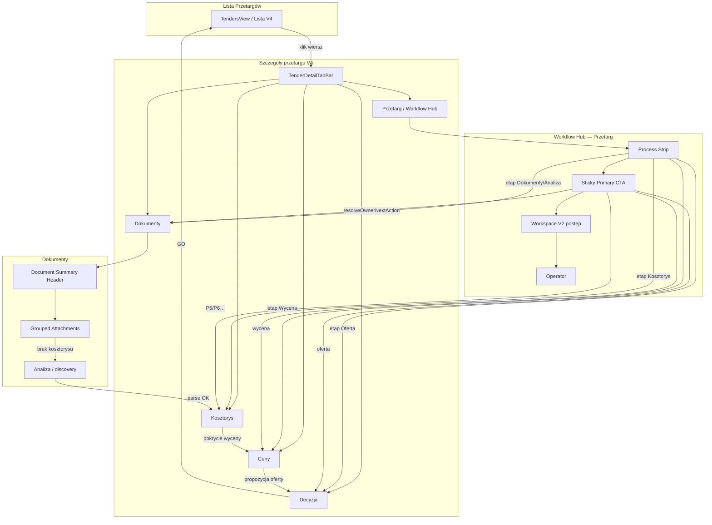

# Workflow Architecture — SSOT v2.63

> **Dla kogo:** programista, reviewer — **jeden dokument** opisujący architekturę Workflow przetargu po serii release'ów **2.62.64–2.62.72**.  
> **Produkcja (baseline dokumentu):** v2.62.72 · commit `16b7fd7` · https://www.wgdom.fun  
> **Data:** 2026-06-25  
> **Status:** **ACTIVE SSOT** — nadrzędny względem rozproszonych opisów w `ARCHITECTURE.md` § 12.1.9 / § 12.1.13 dla tematu Workflow.

---

## 1. Cel i zakres

Ten dokument opisuje **finalną architekturę warstwy Workflow** w szczegółach pojedynczego przetargu (V4):

- **Workflow Hub** — centrum przygotowania oferty (zakładka Przetarg)
- **Process Strip** — pasek pięciu etapów procesu
- **Sticky Primary CTA** — jedyne miejsce głównej rekomendowanej akcji
- **Document Summary Header** — podsumowanie dokumentów na zakładce Dokumenty
- **Grouped Documents** — grupowanie listy załączników (7 grup biznesowych)

**W zakresie:** prezentacja UI, nawigacja V4, agregaty SSOT lib-only, testy regresji UX.  
**Poza zakresem:** parsery ATH/PDF, dossier pipeline, sync KV, scoring engines, backend Edge — te moduły są **konsumentami**, nie częścią Workflow UI.

**Relacja do innych dokumentów:**

| Dokument | Rola względem Workflow |
|----------|------------------------|
| [`ARCHITECTURE.md`](ARCHITECTURE.md) | Living document całego systemu — § 12.1.9 (UX.1), § 12.1.13 (Intelligence) |
| [`SESSION-HANDOFF-UX-1-TENDER-WORKSPACE.md`](SESSION-HANDOFF-UX-1-TENDER-WORKSPACE.md) | Historyczny closeout UX.1 (5 legacy workspace) — **superseded** przez V4 tabs + ten dokument |
| [`CHANGELOG.md`](../CHANGELOG.md) | Historia release'ów 2.62.64–2.62.72 |
| [`PROJECT-HANDOFF-CURRENT.md`](PROJECT-HANDOFF-CURRENT.md) | Baseline prod i commity |

---

## 2. Executive summary

Po serii 2.62.64–2.62.72 ekran przetargu ma **jednoznaczną hierarchię**:

1. **V4 nawigacja** (`TenderDetailPage`) — 7 slugów URL; 5 aktywnych workspace + 2 placeholdery.
2. **Przetarg = Workflow Hub** — proces, CTA, postęp V2, blokery, operator. **Bez** werdyktu GO/HOLD/ODPUŚĆ.
3. **Decyzja = decision-only** — werdykt, ekonomia, zapis decyzji właściciela. **Bez** duplikacji workflow.
4. **Jeden agregat intelligence** — `buildTenderIntelligenceContext()` w `TenderDetailPanel`, przekazywany w dół (bez recompute w V2).
5. **Jedno CTA** — `TenderWorkflowPrimaryAction` (sticky); sekcja „Następny krok” usunięta z V2 (Cleanup P0, 2.62.72).
6. **Dokumenty** — nagłówek podsumowania nad listą; lista w grupach biznesowych (Grouped Documents — **lokalnie**, patrz § 4.5).

**Klasyfikacja zmian serii:** STANDARD REFACTOR / UX-only — bez zmian parserów, pipeline i logiki biznesowej scoringu.

---

## 3. Warstwy architektury

```text
TendersModule
  └── TendersView → TenderDetailPage (V4 shell)
        ├── TenderDetailKpiBar + TenderDetailTabBar
        │
        ├── tab=kosztorys → TenderKosztorysWorkspace (osobny mount)
        │
        └── tab ∈ {przetarg, dokumenty, ceny, decyzja, …}
              └── TenderDetailPanel (embedV4ChromeHidden)
                    ├── intelligenceCtx = buildTenderIntelligenceContext()  ← JEDEN RAZ
                    │
                    ├── embed=workflow-hub (Przetarg)
                    │     └── TenderPrzetargWorkspace
                    │           └── TenderWorkflowHubPanel
                    │                 ├── TenderWorkflowProcessStrip
                    │                 ├── TenderWorkflowPrimaryAction   ← JEDYNE CTA
                    │                 ├── TenderWorkspaceV2Panel        ← postęp, bez CTA
                    │                 ├── WorkflowHubPrepStatus / Blockers / Positions
                    │                 └── TenderWorkflowOperatorSection
                    │
                    ├── embed=overview (Decyzja)
                    │     └── TenderDecisionView
                    │
                    ├── embed=documents (Dokumenty)
                    │     └── TenderDocumentsWorkspace
                    │           ├── TenderDocumentsSummaryHeader
                    │           └── TenderAttachmentsPanel (grouped)
                    │
                    └── embed=valuation (Ceny)
                          └── TenderBidProposalPanel
```

### 3.1 Identyfikatory workspace (legacy ↔ V4)

| V4 tab (`tender-detail-routes-v4.ts`) | Legacy embed workspace | Główny komponent |
|--------------------------------------|------------------------|------------------|
| `przetarg` | `workflow-hub` | `TenderPrzetargWorkspace` |
| `dokumenty` | `documents` | `TenderDocumentsWorkspace` |
| `kosztorys` | *(osobny mount w `TenderDetailPage`)* | `TenderKosztorysWorkspace` |
| `ceny` | `valuation` | `TenderBidProposalPanel` |
| `decyzja` | `overview` (+ opcjonalnie `?ws=qualification\|offer`) | `TenderDecisionView` |
| `strategia` | placeholder | `TenderV4Placeholder` |
| `materialy` | placeholder | `TenderV4Placeholder` |

**SSOT routingu:** `src/lib/tender-detail-routes-v4.ts` · `TENDER_WORKFLOW_HUB_EMBED_WORKSPACE` w `src/lib/tender-workspace-ux.ts`.

### 3.2 Tab SSOT — URL, nie prop (P0 · v2.63.8)

**Handoff:** [`SESSION-HANDOFF-P0-TENDER-DETAIL-SSOT-TAB.md`](SESSION-HANDOFF-P0-TENDER-DETAIL-SSOT-TAB.md)

| Reguła | Szczegół |
|--------|----------|
| Aktywny tab V4 | `parseTenderDetailPath(useLocation().pathname)` |
| Optimistic UI | `pendingTab` w `TenderDetailPage` przy `navigate()` (RR7 bez `<Routes>`) |
| Prop `tab` | **Opcjonalny fallback only** — nie przekazywać z `TendersModule` |
| Moduł Przetargi | Przy `v4Detail`: `activeTab=list` + `saveTendersActiveTab("list")` |
| Decyzja sub-tab | `location.search` (`?ws=qualification\|offer`) |

**Zakaz regresji:** `tab={v4Detail.tab}` na `TenderDetailPage` — powoduje rozjazd URL vs UI.

---

## 4. Pięć filarów UI Workflow

### 4.1 Workflow Hub (EPIC A · 2.62.68)

**Zakładka:** Przetarg  
**Komponent korzenia:** `TenderWorkflowHubPanel`  
**Rola:** Centrum operacyjne przygotowania oferty — postęp, blokery, status prep, plik pozycji, operator.

**Kolejność sekcji (obowiązująca):**

| # | Sekcja | Komponent / lib |
|---|--------|-----------------|
| 1 | Pasek procesu | `TenderWorkflowProcessStrip` |
| 2 | Główna akcja (sticky) | `TenderWorkflowPrimaryAction` |
| 3 | Postęp V2 | `TenderWorkspaceV2Panel` |
| 4 | Status przygotowania | `WorkflowHubPrepStatusDisplay` |
| 5 | Blokery | `WorkflowHubBlockersSection` |
| 6 | Plik pozycji | `WorkflowHubPositionsFileDisplay` |
| 7 | Operator | `TenderWorkflowOperatorSection` |

Poniżej Huba (w `TenderPrzetargWorkspace`): bloki informacyjne — podstawowe dane, warunki udziału, zakres robót, najważniejsze informacje (`tender-detail-v4-display.ts`).

**Czego NIE ma na Przetargu:** werdyktu GO/HOLD/ODPUŚĆ, pełnej ekonomii decyzyjnej, przycisków decyzji właściciela — to zakładka **Decyzja**.

---

### 4.2 Process Strip (EPIC B · 2.62.69)

**Komponent:** `TenderWorkflowProcessStrip`  
**Lib SSOT:** `src/lib/tender-workflow-process-strip.ts`

**Pięć etapów (stała kolejność):**

```text
Dokumenty → Analiza → Kosztorys → Wycena → Oferta
```

| Etap ID | Etykieta PL | Status źródło | Nawigacja V4 po kliknięciu |
|---------|-------------|---------------|----------------------------|
| `documents` | Dokumenty | `computeWorkspaceV2AutoProgress` pillar `documents` | `dokumenty` |
| `analysis` | Analiza | pillar `analysis` | `dokumenty` |
| `kosztorys` | Kosztorys | pillar `kosztorys` | `kosztorys` |
| `wycena` | Wycena | `buildTenderAnalysisStatusRows` / `prepStatus.pricing` | `ceny` |
| `offer` | Oferta | pillar `offer` | `decyzja?ws=offer` |

**Statusy wizualne:** `done` · `partial` · `missing` — mapowane z istniejących SSOT, **bez nowej logiki biznesowej**.

**Test:** `scripts/test-tender-workflow-process-strip.mjs`

---

### 4.3 Sticky Primary CTA (EPIC C · 2.62.69 + Cleanup P0 · 2.62.72)

**Komponent:** `TenderWorkflowPrimaryAction`  
**Lib SSOT:** `src/lib/tender-workflow-primary-action.ts`

**Zasada twarda:** To **jedyne** miejsce prezentacji rekomendowanej akcji następnego kroku (reguły P0–P12).

| Aspekt | SSOT |
|--------|------|
| Wybór akcji | `resolveOwnerNextAction()` → `tender-intelligence-next-action.ts` |
| Etykiety / opis | `buildWorkspaceV2NextActionLabel`, `buildWorkspaceV2NextActionButtonLabel` → `tender-workspace-v2-ux.ts` |
| Postęp % | `computeWorkspaceV2AutoProgress()` |
| Busy / disabled | `buildTenderAnalysisStatusRows()` + flagi `autoRunning`, `dossierBuilding`, `dossierSaving`, `analyzing` |

**Cleanup P0 (2.62.72):** usunięto zduplikowaną sekcję „Następny krok” z `TenderWorkspaceV2Panel`. V2 przyjmuje `intelligenceCtx` z Huba (`_intelligenceCtx`) wyłącznie dla spójności props — **nie buduje** własnego kontekstu ani CTA.

**Test:** `scripts/test-tender-workflow-primary-action.mjs` · asercje w `test-tender-workflow-hub.mjs`

---

### 4.4 Document Summary Header (2.62.71)

**Zakładka:** Dokumenty  
**Komponent:** `TenderDocumentsSummaryHeader`  
**Lib SSOT:** `src/lib/tender-documents-tab-summary.ts` → `buildTenderDocumentsTabSummary()`

**Zawartość nagłówka (agregat istniejących SSOT):**

| Slot | Źródło klasyfikacji |
|------|---------------------|
| SWZ | `classifyTenderDocumentDisplayTier` + role |
| Przedmiar / ATH | tier `ath_przedmiar` |
| Kosztorys | `item.tenderDossier.kosztorys` + `resolvedCostStatus` |
| Umowa | tier `wzor_umowy` |
| Formularz | tier `formularz_ofertowy` |
| Gotowość procesu | `buildTenderAnalysisStatusRows()` |
| Ostatnia analiza | `formatRelativeChangeTime` / dossier timestamps |

**Kolejność w workspace Dokumenty:** źródło platformy → **Summary Header** → załączniki (grouped) → skrót formalny → meta SWZ → HTML BZP.

**Test:** `scripts/test-tender-documents-summary-header.mjs`

---

### 4.5 Grouped Documents (EPIC P2 · UX.1C)

**Zakładka:** Dokumenty (lista w `TenderAttachmentsPanel`)  
**Lib SSOT:** `src/lib/tender-grouped-documents.ts` → `groupTenderAttachmentRows()`

**Siedem grup biznesowych (stała kolejność):**

```text
SWZ → Przedmiary/ATH → Formularze ofertowe → Umowy → OPZ/STWiOR → Załączniki formalne → Pozostałe
```

Klasyfikacja wyłącznie przez istniejące SSOT: `classifyDocumentRole()` + `classifyTenderDocumentDisplayTier()` — **bez nowych klasyfikatorów**.

**Zastępuje:** legacy TOP 5 + „Pokaż pozostałe dokumenty” + `prioritizeTenderDocuments()` (usunięte w Cleanup P0, 2.62.72).

> **Status release:** implementacja **lokalna** (pliki `tender-grouped-documents.ts`, zmiany w `TenderAttachmentsPanel.tsx` — **nie** na `origin/main` w 2.62.72). Architektura docelowa jest opisana tutaj; prod nadal może pokazywać TOP 5 do czasu osobnego release'u Grouped Documents.

**Test:** `scripts/test-tender-grouped-documents.mjs` · regresja tier w `test-tender-workspace-ux.mjs` § UX.1C

---

## 5. Odpowiedzialność zakładek V4

### 5.1 Przetarg

| Pytanie użytkownika | „Co mam teraz zrobić w tym przetargu?” |
|---------------------|----------------------------------------|
| **Odpowiedź UI** | Process Strip + Sticky CTA + postęp V2 + blokery + operator |
| **Dane** | `TenderIntelligenceContext` (read-only w komponentach potomnych) |
| **Nawigacja wyjścia** | CTA i Process Strip → inne zakładki V4 |
| **Nie tu** | Decyzja GO/HOLD/ODPUŚĆ, pełna tabela ATH, kalkulator cen |

### 5.2 Dokumenty

| Pytanie | „Jakie mam dokumenty i jaki jest stan analizy?” |
|---------|------------------------------------------------|
| **Odpowiedź UI** | Summary Header, grouped attachments, dossier, skrót formalny, HTML BZP |
| **Akcje** | Pobierz, podgląd, analiza SWZ, discovery zewnętrzne, uczenie słów kluczowych |
| **Pipeline** | `useTenderDocumentsBootstrap`, `tender-dossier-pipeline` (poza tym dokumentem) |
| **Nie tu** | Kalkulator oferty, werdykt strategiczny |

### 5.3 Kosztorys

| Pytanie | „Czy kosztorys jest gotowy i ile warte są pozycje?” |
|---------|-----------------------------------------------------|
| **Odpowiedź UI** | `TenderKosztorysWorkspace` — Kosztorys PRO dashboard, fazy procesu E0–E12, health timeout/stale |
| **Lazy parse** | `useTenderDossierHeavyLazy` — mount tylko gdy `tab=kosztorys` |
| **SSOT faz** | `tender-kosztorys-process-phase.ts` (P0 2.62.64, P1 2.62.65, P2 2.62.66) |
| **Nie tu** | Sticky CTA (zostaje na Przetargu), decyzja właściciela |

### 5.4 Ceny

| Pytanie | „Za ile startować?” |
|---------|---------------------|
| **Odpowiedź UI** | `TenderBidProposalPanel` — koszt własny, marża, cena oferty, pozycje ATH, klasyfikacja UNKNOWN |
| **Legacy workspace** | `valuation` |
| **SSOT wyceny** | `tenders-bid-calculator.ts`, `wgdom-cost-catalog-store.ts`, overrides per przetarg |
| **Nie tu** | Pełna lista załączników, operator upload |

### 5.5 Decyzja

| Pytanie | „Czy startujemy — GO / HOLD / ODPUŚĆ?” |
|---------|------------------------------------------|
| **Odpowiedź UI** | `TenderDecisionView` — werdykt overlay, kontekst, ekonomia, `TenderOwnerDecisionButtons` |
| **Legacy workspace** | `overview` (+ sub-workspace `qualification` / `offer` przez `?ws=`) |
| **Nie tu** | Process Strip, postęp V2, operator, sticky CTA, blokery workflow (są na Przetargu) |

**Zasada rozdziału (EPIC A):** Workflow = Przetarg · Decision = Decyzja. Link tekstowy na dole Huba kieruje na Decyzję bez duplikacji sekcji.

### 5.6 Placeholdery (poza Workflow SSOT)

| Tab | Status |
|-----|--------|
| `strategia` | `TenderV4Placeholder` — pełna Strategia pozostaje w `TendersModule` |
| `materialy` | `TenderV4Placeholder` — przyszły zakres |

---

## 6. Rejestr SSOT (obowiązujący)

### 6.1 Agregaty Workflow / Intelligence

| Moduł | Plik | Funkcja / eksport | Rola |
|-------|------|-------------------|------|
| Intelligence context | `tender-intelligence-context.ts` | `buildTenderIntelligenceContext()` | **Główny agregat** — jeden punkt budowy w `TenderDetailPanel` |
| Next action P0–P12 | `tender-intelligence-next-action.ts` | `resolveOwnerNextAction()` | Reguły CTA |
| Overlay werdyktu | `tender-intelligence-overlay.ts` | `applyTenderIntelligenceOverlay()` | STARTUJ / ANALIZUJ / ODPUŚĆ (display) |
| Narracja | `tender-intelligence-narrative.ts` | `buildTenderIntelligenceNarrative()` | Jedno zdanie o przetargu |
| Owner views | `tender-owner-view-ux.ts` | `buildOwnerPrepStatusView`, `buildOwnerPositionsFileView`, … | Prep status, pozycje, ryzyka |
| Scoring | `tenders-strategy-decision.ts` | `scoreTenderForOwnerView()` | Bundle scoringu (input z Providera) |

### 6.2 Workflow UI libs

| Moduł | Plik | Rola |
|-------|------|------|
| Process strip | `tender-workflow-process-strip.ts` | Etapy + nawigacja V4 |
| Primary CTA view | `tender-workflow-primary-action.ts` | `buildWorkflowPrimaryActionView()` |
| V2 progress | `tender-workspace-v2-ux.ts` | Postęp %, checklista, timeline, insights, tier dokumentów |
| Analysis status | `tender-analysis-status-ux.ts` | Wiersze gotowości analizy |
| Documents tab summary | `tender-documents-tab-summary.ts` | Nagłówek Dokumenty |
| Grouped documents | `tender-grouped-documents.ts` | 7 grup listy załączników |
| V4 routes | `tender-detail-routes-v4.ts` | Slugi URL, mapowanie legacy |
| Przetarg display | `tender-detail-v4-display.ts` | Key facts, highlights, participation |
| Kosztorys process | `tender-kosztorys-process-phase.ts` | Fazy E0–E12, health, saving |

### 6.3 Komponenty UI (mapa)

| Komponent | Plik |
|-----------|------|
| V4 shell | `TenderDetailPage.tsx` |
| Embed panel | `TenderDetailPanel.tsx` |
| Przetarg workspace | `TenderPrzetargWorkspace.tsx` |
| Workflow Hub | `TenderWorkflowHubPanel.tsx` |
| Process Strip | `TenderWorkflowProcessStrip.tsx` |
| Sticky CTA | `TenderWorkflowPrimaryAction.tsx` |
| Workspace V2 | `TenderWorkspaceV2Panel.tsx` |
| Hub sections | `TenderWorkflowHubSections.tsx` |
| Operator | `TenderWorkflowOperatorSection.tsx` |
| Decyzja | `TenderDecisionView.tsx` |
| Dokumenty workspace | `TenderDocumentsWorkspace.tsx` |
| Documents summary | `TenderDocumentsSummaryHeader.tsx` |
| Attachments | `TenderAttachmentsPanel.tsx` |
| Kosztorys | `TenderKosztorysWorkspace.tsx` |
| Ceny | `TenderBidProposalPanel.tsx` |

### 6.4 Dane wejściowe (nie duplikować w UI)

| Źródło | Skąd |
|--------|------|
| `scoringContext` | `TendersProvider` → `tendersCtx.snapshot.scoringContext` (**wymagane**, bez fallback `jobs:[]`) |
| `item`, `swz` | `TenderPipelineItem`, `item.swzAnalysis` |
| `kosztorysProcessSession` | `buildKosztorysProcessSession()` w panelu |
| Flagi procesu | `autoRunning`, `dossierBuilding`, `dossierSaving`, `analyzing` |

---

## 7. Diagram przepływu użytkownika



**Ścieżka happy path (skrót):**

```text
Lista → Przetarg → [CTA: Pobierz dokumenty] → Dokumenty → analiza
  → Kosztorys (PRO) → Ceny (kalkulator) → Decyzja (GO/HOLD/ODPUŚĆ)
```

---

## 8. Zamknięte EPIC-i (2.62.64–2.62.72)

| EPIC | Wersja | Commit (ref.) | Zakres | Testy |
|------|--------|---------------|--------|-------|
| **Kosztorys V4 fazy P0** | 2.62.64 | — | `deriveKosztorysProcessPhase`, status bar 8 faz | `test-tender-kosztorys-process-phase.mjs` |
| **Kosztorys V4 P1** | 2.62.65 | — | E0–E12, `saving`, lazy hook | j.w. |
| **Kosztorys V4 health P2** | 2.62.66 | — | slow/stale/timeout, retry UI | `test-tender-kosztorys-process-health.mjs` |
| **Workflow Hub** | 2.62.68 | — | Przetarg vs Decyzja split | `test-tender-workflow-hub.mjs` |
| **Process Strip** | 2.62.69 | — | 5 etapów + nawigacja | `test-tender-workflow-process-strip.mjs` |
| **Sticky Primary CTA** | 2.62.69 | — | Jedno CTA z SSOT | `test-tender-workflow-primary-action.mjs` |
| **Document Summary Header** | 2.62.71 | `c577a72` | Nagłówek nad listą Dokumenty | `test-tender-documents-summary-header.mjs` |
| **Workflow Cleanup P0** | 2.62.72 | `16b7fd7` | Usunięcie duplikatu CTA/V2, `intelligenceCtx` z Huba, drop TOP 5 lib | `test-tender-workflow-hub.mjs`, `test-tender-workspace-ux.mjs` |
| **Grouped Documents** | — | *lokalnie* | 7 grup, `groupTenderAttachmentRows` | `test-tender-grouped-documents.mjs` |

---

## 9. Pozostały backlog

### 9.1 Audit Hub

| ID | Status | Opis |
|----|--------|------|
| Audit Hub MVP-0→1B | **CLOSED** (2.62.36–2.62.41) | Agregacja 6 źródeł read-only |
| AUDIT-HUB-WM-001 | **P1 OPEN** | WM Pomiary / Schematy — brak wpisów w Hub |

**Handoff:** [`SESSION-HANDOFF-AUDIT-HUB.md`](SESSION-HANDOFF-AUDIT-HUB.md) · [`SESSION-HANDOFF-AUDIT-HUB-WM-001.md`](SESSION-HANDOFF-AUDIT-HUB-WM-001.md)

### 9.2 Parser Quality

| ID | Status | Opis |
|----|--------|------|
| TP200 | **PLANNED** | Parser version + kosztorys fidelity |
| TP190C | **CLOSED** | Batch rebuild tooling |

**Handoff:** [`SESSION-HANDOFF-TP200-PLANNED.md`](SESSION-HANDOFF-TP200-PLANNED.md)

### 9.3 Workflow Cleanup P1 / P2 (opcjonalnie)

| Priorytet | Temat | Uzasadnienie |
|-----------|-------|--------------|
| **P1** | V2 key docs vs `WorkflowHubPositionsFileDisplay` | Dwa widoki „kluczowych dokumentów” — potencjalny duplikat informacji |
| **P1** | Analysis Status Strip na Przetargu | Rozważyć skrócony pasek statusu analizy pod Process Strip (bez drugiego CTA) |
| **P2** | Release **Grouped Documents** | Domknięcie UX.1C na prod; aktualizacja FAQ GuideView (TOP 5 → grupy) |
| **P2** | `strategia` / `materialy` V4 | Placeholdery → realne workspace lub trwałe przekierowanie |

---

## 10. Zasady dalszego rozwoju Workflow

### 10.1 Anti-duplikacja (twarde)

1. **Jedno `buildTenderIntelligenceContext()`** — tylko w `TenderDetailPanel` (lub Providerze), nigdy w komponentach potomnych Workflow.
2. **Jedno CTA** — wyłącznie `TenderWorkflowPrimaryAction`. Zakaz sekcji „Następny krok” / drugiego przycisku akcji w V2, attachments lub operatorze.
3. **Rozdział Przetarg / Decyzja** — workflow i operator na Przetargu; werdykt i GO/HOLD/ODPUŚĆ na Decyzji.
4. **Prezentacja ≠ logika** — nowe paski, nagłówki i grupy UI muszą **agregować** istniejące lib SSOT, nie kopiować warunków `if` z parserów.
5. **Bez recompute** — komponenty przyjmują `intelligenceCtx` / gotowe view z lib; props `_intelligenceCtx` w V2 jest celowy (brak użycia = brak driftu).

### 10.2 Anti-przeładowanie UI (Anti-CC)

1. **Max 5 legacy workspace** w `TenderDetailPanel` — nowe funkcje → sub-sekcja istniejącego tabu V4.
2. **Lazy mount** — `TenderKosztorysWorkspace`, heavy dossier parse tylko na aktywnym tabie.
3. **Skrót domyślnie, pełnia na żądanie** — wzorzec UX.1D (formal details, offer completeness).
4. **Brak nowych dashboardów KPI** na ekranie przetargu — KPI na liście (V4) i w Strategii modułu.

### 10.3 Checklist przed merge (Workflow)

- [ ] Czy zmiana dotyka tylko warstwy prezentacji?
- [ ] Czy istnieje SSOT lib (nie inline w TSX)?
- [ ] Czy nie powstał drugi CTA / drugi werdykt / drugi process strip?
- [ ] Czy `test-tender-workflow-hub.mjs` + `test-tender-workflow-primary-action.mjs` PASS?
- [ ] Czy `GuideView` FAQ i `CHANGELOG` zaktualizowane przy widocznej zmianie UX?
- [ ] Czy ten dokument (`WORKFLOW-ARCHITECTURE-v2.63.md`) wymaga aktualizacji sekcji?

### 10.4 Klasyfikacja release'ów Workflow

| Typ | Kryteria | Przykład |
|-----|----------|----------|
| **STANDARD REFACTOR** | Tylko UI/prezentacja, bez parserów/pipeline | 2.62.72 Cleanup P0 |
| **UX FEATURE** | Nowy blok UI z istniejącego SSOT | 2.62.71 Summary Header |
| **HOTFIX** | Regresja filtra/nawigacji | 2.62.70 Client Bar |
| **EPIC** | Nowy filar architektury + test dedykowany | 2.62.68 Hub |

---

## 11. Macierz testów regresji Workflow

| Skrypt | Zakres |
|--------|--------|
| `test-tender-workflow-hub.mjs` | Hub embed, brak duplikatu CTA, Decyzja decision-only |
| `test-tender-workflow-primary-action.mjs` | Sticky CTA, busy, etykiety P5/P6/P8 |
| `test-tender-workflow-process-strip.mjs` | 5 etapów, nawigacja V4 |
| `test-tender-workspace-v2-ux.mjs` | Postęp, checklista, timeline, tier docs |
| `test-tender-documents-summary-header.mjs` | Slots summary header |
| `test-tender-grouped-documents.mjs` | 7 grup (po release Grouped Documents) |
| `test-tender-kosztorys-process-phase.mjs` | Fazy kosztorysu (tab Kosztorys) |
| `test-p5-owner-view.mjs` | Regresja Owner / Intelligence |

**Build:** `npm run build` przed każdym release Workflow.

---

## 12. Historia dokumentu

| Data | Wersja doc | Zmiana |
|------|------------|--------|
| 2026-06-25 | v2.63 | Utworzenie SSOT po serii release'ów 2.62.64–2.62.72 |

---

## 13. Szybkie odniesienia

```bash
# Testy Workflow (minimalny zestaw przed release)
npx vite-node scripts/test-tender-workflow-hub.mjs
npx vite-node scripts/test-tender-workflow-primary-action.mjs
npx vite-node scripts/test-tender-workspace-v2-ux.mjs

# Build
npm run build
```

**Pliki startowe:** `AGENTS.md` → **ten dokument** → `ARCHITECTURE.md` § 12.1.9 → `CURRENT-TASK.md`
