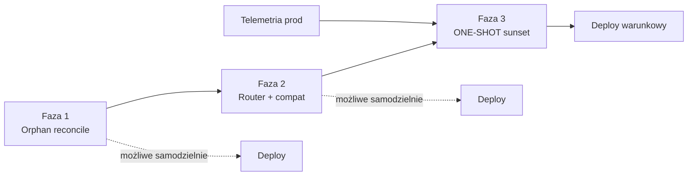

# #5C-5C — Legacy Cleanup · DESIGN FREEZE

> **Status:** **DESIGN FREEZE v1.0 — APPROVED (docs-only)**  
> **Tryb:** PLAN + DESIGN FREEZE · **IMPLEMENT = BLOCKED** (do Owner GO per faza)  
> **Data freeze:** 2026-07-06  
> **Bundle ID:** #5C-5C  
> **Klasa:** **CORE CATALOG** (#CORE-013 — bez Payroll / PWRB / Edge / App)  
> **Baseline prod:** UI **2.63.51** · feature **`50dae97`** · repo HEAD **`82d5075`**  
> **STABILIZATION WINDOW:** ACTIVE  
> **Poprzedniki:** #5C-5A CLOSED · #5C-5B CLOSED · PRODUCTION VERIFIED  
> **AUDIT SSOT:** [CORE-5C-5C-LEGACY-CLEANUP-AUDIT.md](./CORE-5C-5C-LEGACY-CLEANUP-AUDIT.md)  
> **Powiązane:** [CORE-5C-5B-BOOTSTRAP-RECONCILE-DECOUPLE-DESIGN-FREEZE.md](./CORE-5C-5B-BOOTSTRAP-RECONCILE-DECOUPLE-DESIGN-FREEZE.md) · [CORE-01A-DESIGN-FREEZE.md](./CORE-01A-DESIGN-FREEZE.md)

```text
CEL:           Usunąć martwy kod legacy catalog w trzech niezależnych (1–2) lub warunkowych (3) fazach.
ZASADA:        Work Catalog SSOT (#5C-1…#5C-3D); kw-wgdom-cost-catalog poza sync plane (#5C-5A).
WYJĄTEK F3:    ONE-SHOT sunset tylko po evidencji migracji prod + Owner GO.
ZAKAZ:         Payroll · PWRB · CloudLoader · Edge · App.tsx · rename wgdom-cost-catalog.ts · historia KV.
GATE:          Owner GO per faza + Exit Criteria + Payroll Regression Gate (wszystkie fazy).
```

---

## 0. Werdykt freeze

| Pole | Wartość |
|------|---------|
| **Przedmiot** | Fazowe usunięcie orphan reconcile, martwych helperów, router legacy path, ONE-SHOT migrate i `wgdom-cost-catalog-store.ts` |
| **Poza zakresem #5C-5C** | `wgdom-cost-catalog.ts` (typy domeny) · `kw-wgdom-cost-catalog-history` sync · Payroll · UI Przetargów · Edge |
| **Nowe pole KV** | **Brak** |
| **Principles #5C-5C** | **#5C5C-001–#5C5C-012** (§1) |
| **Fazy IMPLEMENT** | **3** — osobne commity / release opcjonalnie per faza |

### Final Decision

**APPROVED (docs-only)** — Design Freeze kompletny. **IMPLEMENT pozostaje BLOCKED** do jawnego **Owner GO** per faza + spełnienia Exit Criteria danej fazy.

### Podsumowanie faz (odpowiedź na pytania właściciela)

| Faza | Niezależna? | Telemetria? | Samodzielny deploy? |
|------|-------------|-------------|---------------------|
| **Faza 1** | **TAK** | **NIE** | **TAK** — zalecany pierwszy slice |
| **Faza 2** | **TAK** (logicznie po F1) | **NIE** | **TAK** — może iść bez F1, ale **zalecana kolejność F1→F2** |
| **Faza 3** | **NIE** | **TAK — WYMAGANA** | **NIE** — wymaga F1+F2 CLOSED + Owner GO + evidencja migracji |

---

## 1. Principles (#5C-5C)

| ID | Zasada |
|----|--------|
| **#5C5C-001** | Jedna faza = jeden commit bundle = jeden cel — bez mieszania faz w jednym commicie. |
| **#5C5C-002** | `wgdom-cost-catalog.ts` **nie** jest usuwany ani rename w #5C-5C (osobny epic). |
| **#5C5C-003** | `kw-wgdom-cost-catalog-history` sync **bez zmian** — historia stawek Work Catalog (#5C-3D). |
| **#5C5C-004** | Faza 1 **nie** dotyka `cloud-sync.ts`, `catalog-write-router.ts`, `work-catalog-bootstrap.ts` (ONE-SHOT). |
| **#5C5C-005** | Faza 2 **nie** dotyka deferred bootstrap ani ONE-SHOT migrate. |
| **#5C5C-006** | Faza 3 **nie** startuje bez telemetrii: % kont z `migratedFromLegacyAt` lub pustym legacy LS. |
| **#5C5C-007** | Zero diff Payroll, PWRB, `CloudLoader.tsx`, Edge, `App.tsx` we **wszystkich** fazach. |
| **#5C5C-008** | `resolveActiveCatalogForTender()` — semantyka work-only (#5C-1) **bez zmian** po każdej fazie. |
| **#5C5C-009** | `buildLegacyCostCatalogFromWorkStore` pozostaje funkcjonalnie (F3: opcjonalny rename w osobnym micro-slice, nie wymagany do CLOSE). |
| **#5C5C-010** | Rollback każdej fazy = `git revert` commitu fazy — brak migracji KV w F1/F2; F3 wymaga runbook ops. |
| **#5C5C-011** | Payroll Regression Gate **15/15** obowiązkowy przed CLOSEOUT każdej fazy. |
| **#5C5C-012** | Nowy gate `LIB-5C-5C-LEGACY-CLEANUP` — rozszerzany per faza w `test-manifest.json`. |

---

## 2. Mapa faz (overview)

```text
#5C-5C
├── FAZA 1 — Orphan reconcile · dead helpers · deprecated aliases · dead exports
│     Ryzyko: NISKIE · Telemetria: NIE · Deploy: SAMODZIELNY
├── FAZA 2 — Router legacy path · compat UI helpers · catalogWriteMode dead routes
│     Ryzyko: ŚREDNIE · Telemetria: NIE · Deploy: SAMODZIELNY (zalecane po F1)
└── FAZA 3 — ONE-SHOT sunset · wgdom-cost-catalog-store removal · adapter/compat trim · cloud-sync coerce
      Ryzyko: WYSOKIE · Telemetria: TAK · Deploy: WARUNKOWY (Owner GO)
```

---

# FAZA 1 — Orphan Reconcile · Dead Helpers · Deprecated Aliases · Dead Exports

## F1.1 Scope

**Cel:** Usunąć kod reconcile i helpery bez runtime callerów — zero wpływu na prod ścieżki zapisu/odczytu katalogu.

| ID | Zakres | Akcja |
|----|--------|-------|
| F1-R01 | `work-catalog-reconcile-bootstrap.ts` | **DELETE** cały plik |
| F1-R02 | `work-catalog-reconcile.ts` | **DELETE** cały plik (logika tylko test/ops; brak prod caller po #5C-5B) |
| F1-R03 | Barrel `work-catalog/index.ts` | **REMOVE** eksporty PB-WRITE-C reconcile |
| F1-R04 | `loadWgdomCostCatalogStore()` async | **DELETE** z `wgdom-cost-catalog-store.ts` |
| F1-R05 | `maybeExecuteWorkCatalogBootstrap` | **DELETE** deprecated alias z `work-catalog-bootstrap.ts` |
| F1-R06 | Skrypty testowe | **MODIFY** — retire/update `test-pb-write-reconcile.mjs`; update `test-work-catalog-public-api.mjs` |
| F1-R07 | Gate #5C-5C | **NEW** `scripts/test-5c-5c-legacy-cleanup-f1.mjs` |
| F1-R08 | Manifest | **MODIFY** `test-infra/test-manifest.json` — `LIB-5C-5C-LEGACY-CLEANUP-F1` |
| F1-R09 | CHANGELOG | **MODIFY** przy IMPLEMENT (patch +0.1) |

**Poza zakresem F1:** router, bootstrap ONE-SHOT, `cloud-sync.ts`, `wgdom-cost-catalog-store.ts` (poza usunięciem async load), compat, adapter.

## F1.2 File Matrix

| Plik | Modyfikacja | Usunięcie | Bez zmian |
|------|-------------|-----------|-----------|
| `src/lib/work-catalog-reconcile-bootstrap.ts` | | **●** | |
| `src/lib/work-catalog-reconcile.ts` | | **●** | |
| `src/lib/work-catalog/index.ts` | **●** (exports) | | |
| `src/lib/wgdom-cost-catalog-store.ts` | **●** (async load only) | | reszta pliku |
| `src/lib/work-catalog-bootstrap.ts` | **●** (alias only) | | `finalizeWorkCatalogAfterDeferredMerge` |
| `scripts/test-pb-write-reconcile.mjs` | **●** retire/archive | | |
| `scripts/test-5c-5c-legacy-cleanup-f1.mjs` | **NEW** | | |
| `scripts/test-work-catalog-public-api.mjs` | **●** | | |
| `test-infra/test-manifest.json` | **●** | | |
| `src/lib/cloud-sync.ts` | | | **●** |
| `src/lib/catalog-write-router.ts` | | | **●** |
| `src/app/*` | | | **●** |

## F1.3 Boundary #CORE-013

| Obszar | Diff F1? | Werdykt |
|--------|----------|---------|
| Payroll / PWRB | **NIE** | **PASS** |
| `CloudLoader.tsx` | **NIE** | **PASS** |
| `App.tsx` | **NIE** | **PASS** |
| Edge | **NIE** | **PASS** |
| `cloud-sync.ts` | **NIE** | **PASS** |
| `finalizeWorkCatalogAfterDeferredMerge` | **NIE** (tylko alias delete) | **PASS** |
| `resolveActiveCatalogForTender` | **NIE** | **PASS** |
| Historia KV | **NIE** | **PASS** |

**Klasyfikacja commitu:** CORE CATALOG — wyłącznie pliki z §F1.2.

## F1.4 Runtime Reachability (docelowa po F1)

| Symbol / plik | Przed F1 | Po F1 |
|---------------|----------|-------|
| `maybeExecuteWorkCatalogReconcile` | DEAD | **REMOVED** |
| `reconcileLegacyToWorkCatalog` | DEAD | **REMOVED** |
| `work-catalog-reconcile*.ts` | DEAD / TEST | **REMOVED** |
| `loadWgdomCostCatalogStore()` async | DEAD | **REMOVED** |
| `maybeExecuteWorkCatalogBootstrap` | DEAD alias | **REMOVED** |
| `finalizeWorkCatalogAfterDeferredMerge` | LIVE | **LIVE** (bez zmian) |
| `loadWgdomCostCatalogStoreLocal` | EDGE (bootstrap) | **LIVE** (bez zmian) |

**Prod call graph:** identyczny jak po #5C-5B — brak reconcile, ONE-SHOT bez zmian.

## F1.5 Rollback

| Element | Procedura |
|---------|-----------|
| **Kod** | `git revert <commit-f1>` |
| **Dane KV** | Brak — żadna faza F1 nie zapisuje do `kw-wgdom-cost-catalog` |
| **LS** | Brak migracji |
| **Ryzyko rollback** | Niskie — przywrócony martwy kod reconcile (orphan) |

## F1.6 Test Matrix

| ID | Test | Typ | Wymagany |
|----|------|-----|----------|
| T1-F1 | `scripts/test-5c-5c-legacy-cleanup-f1.mjs` | **NEW** static reachability | **PASS** |
| T2-F1 | `scripts/test-5c-5b-bootstrap-decouple.mjs` | regresja #5C-5B | **PASS** |
| T3-F1 | `scripts/test-work-catalog-bootstrap-pb3.mjs` | PB-3 ONE-SHOT | **PASS** |
| T4-F1 | `scripts/test-tender-read-ssot-work-only-5c1.mjs` | read SSOT | **PASS** |
| T5-F1 | `scripts/test-work-catalog-public-api.mjs` | barrel API | **PASS** |
| T6-F1 | Payroll gate | 15/15 | **PASS** |
| T7-F1 | `npm run build` | build | **PASS** |

**Retired:** `test-pb-write-reconcile.mjs` — usunąć z manifestu lub oznaczyć `archived` w lifecycle doc.

## F1.7 Exit Criteria

- [ ] Wszystkie testy T1-F1…T7-F1 **PASS**
- [ ] `grep` zero refs: `maybeExecuteWorkCatalogReconcile`, `work-catalog-reconcile-bootstrap`, `loadWgdomCostCatalogStore(` (bez Local)
- [ ] `#CORE-013` checklist PASS — brak plików Payroll w diff
- [ ] Owner GO dla Fazy 1
- [ ] PRODUCTION VERIFIED po deploy (verify FAST `version.json`)

### F1 — Niezależność / telemetria / deploy

| Pytanie | Odpowiedź |
|---------|-----------|
| **Niezależna?** | **TAK** — brak zależności od F2/F3 |
| **Telemetria?** | **NIE** |
| **Samodzielny deploy?** | **TAK** |

---

# FAZA 2 — Compat Router Cleanup · Compat UI Helpers · Legacy Routing

## F2.1 Scope

**Cel:** Usunąć martwe ścieżki zapisu legacy i nieużywane API compat — prod już `work_only`; UI nie woła legacy router.

| ID | Zakres | Akcja |
|----|--------|-------|
| F2-R01 | `saveLegacyCostCatalogRouted` | **DELETE** z `catalog-write-router.ts` + barrel |
| F2-R02 | `appendCostCatalogHistoryRouted` | **DELETE** (legacy history path; work historia przez `appendWorkCatalogRateHistoryIfChanged`) |
| F2-R03 | `canWriteLegacyCatalog` | **DELETE** jeśli zero refs po F2-R01/R02 |
| F2-R04 | `saveWgdomCostCatalogStore` | **DELETE** z `wgdom-cost-catalog-store.ts` |
| F2-R05 | `getActiveCatalog` (store) | **DELETE** — przenieść fixture do test helpera jeśli potrzebny |
| F2-R06 | `work-catalog-compat.ts` | **DELETE** `resolveCatalogForUI`, `isLegacyCatalog`, `resolveCatalogVersion`, `isWorkCatalog` (zachować `resolveCatalogForEngine`) |
| F2-R07 | Barrel exports | **REMOVE** legacy router + usunięte compat symbols |
| F2-R08 | `catalogWriteMode` | **KEEP** enum w `app-settings` — tylko `work_only` / `legacy_only` guard dla work path; **bez** usuwania ustawień KV (ops) |
| F2-R09 | Skrypty | **MODIFY** `test-pb-write-router.mjs`, `test-work-catalog-compat.mjs` |
| F2-R10 | Gate | **NEW/EXTEND** `scripts/test-5c-5c-legacy-cleanup-f2.mjs` |

**Poza zakresem F2:** ONE-SHOT bootstrap, `loadWgdomCostCatalogStoreLocal`, `cloud-sync.ts`, `tenders-sync.ts` merge, całe usunięcie `wgdom-cost-catalog-store.ts`.

## F2.2 File Matrix

| Plik | Modyfikacja | Usunięcie | Bez zmian |
|------|-------------|-----------|-----------|
| `src/lib/catalog-write-router.ts` | **●** legacy routes | | `saveWorkCatalogRouted` |
| `src/lib/wgdom-cost-catalog-store.ts` | **●** save + getActiveCatalog | | LS load, normalize, merge |
| `src/lib/work-catalog/work-catalog-compat.ts` | **●** trim UI helpers | | `resolveCatalogForEngine` |
| `src/lib/work-catalog/index.ts` | **●** exports | | |
| `scripts/test-pb-write-router.mjs` | **●** | | |
| `scripts/test-work-catalog-compat.mjs` | **●** | | |
| `scripts/test-5c-5c-legacy-cleanup-f2.mjs` | **NEW** | | |
| `src/lib/work-catalog-bootstrap.ts` | | | **●** |
| `src/lib/cloud-sync.ts` | | | **●** |

## F2.3 Boundary #CORE-013

| Obszar | Diff F2? | Werdykt |
|--------|----------|---------|
| Payroll / PWRB | **NIE** | **PASS** |
| `cloud-sync.ts` | **NIE** | **PASS** |
| `finalizeWorkCatalogAfterDeferredMerge` | **NIE** | **PASS** |
| `resolveActiveCatalogForTender` | **NIE** | **PASS** |
| `kw-wgdom-cost-catalog-history` | **NIE** | **PASS** |
| UI zapis katalogu (Work Catalog panels) | **NIE** — nadal `saveWorkCatalogRouted` | **PASS** |

**Uwaga:** F2 dotyka write router — regresja tylko przez testy routera + work catalog smoke; **nie** zmienia sync plane.

## F2.4 Runtime Reachability (docelowa po F2)

| Symbol | Przed F2 | Po F2 |
|--------|----------|-------|
| `saveWorkCatalogRouted` | LIVE | **LIVE** |
| `saveLegacyCostCatalogRouted` | DEAD (`work_only`) | **REMOVED** |
| `appendCostCatalogHistoryRouted` | DEAD | **REMOVED** |
| `saveWgdomCostCatalogStore` | DEAD | **REMOVED** |
| `persistKey(kw-wgdom-cost-catalog)` | tylko via save legacy | **ZERO** w `src/` |
| `resolveCatalogForEngine` | LIVE | **LIVE** |
| `resolveCatalogForUI` | TEST only | **REMOVED** |
| `loadWgdomCostCatalogStoreLocal` | EDGE bootstrap | **LIVE** (bez zmian) |

## F2.5 Rollback

| Element | Procedura |
|---------|-----------|
| **Kod** | `git revert <commit-f2>` |
| **Dane KV** | Brak — legacy KV i tak poza sync plane (#5C-5A) |
| **Ops** | Przy `catalogWriteMode=legacy_only` w chmurze (edge) — rollback przywraca martwą ścieżkę zapisu; prod default `work_only` |
| **Ryzyko** | Średnie tylko jeśli ktoś ręcznie ustawił `legacy_only` i polegał na API (nieudokumentowane) |

## F2.6 Test Matrix

| ID | Test | Wymagany |
|----|------|----------|
| T1-F2 | `scripts/test-5c-5c-legacy-cleanup-f2.mjs` | **PASS** |
| T2-F2 | `scripts/test-pb-write-router.mjs` (work path only) | **PASS** |
| T3-F2 | `scripts/test-work-catalog-compat.mjs` (engine path) | **PASS** |
| T4-F2 | `scripts/test-tender-history-ssot-5c3d.mjs` | **PASS** |
| T5-F2 | `scripts/test-5c-5b-bootstrap-decouple.mjs` | **PASS** |
| T6-F2 | `scripts/test-tender-read-ssot-work-only-5c1.mjs` | **PASS** |
| T7-F2 | Payroll gate 15/15 | **PASS** |
| T8-F2 | `npm run build` | **PASS** |

## F2.7 Exit Criteria

- [ ] T1-F2…T8-F2 **PASS**
- [ ] Zero `persistKey` / `saveWgdomCostCatalogStore` w `src/`
- [ ] Zero `saveLegacyCostCatalogRouted` w `src/`
- [ ] `resolveCatalogForEngine` nadal używany przez `tender-active-catalog.ts`
- [ ] Owner GO F2 · PRODUCTION VERIFIED

### F2 — Niezależność / telemetria / deploy

| Pytanie | Odpowiedź |
|---------|-----------|
| **Niezależna?** | **TAK** — nie wymaga F3; **zalecana** po F1 (czystszy barrel, brak reconcile exports) |
| **Telemetria?** | **NIE** |
| **Samodzielny deploy?** | **TAK** |

---

# FAZA 3 — ONE-SHOT Sunset · Legacy Store Removal · Adapter / Compat Cleanup

## F3.1 Scope

**Cel:** Zamknąć ostatnią zależność runtime od `kw-wgdom-cost-catalog` LS/KV — usunąć ONE-SHOT migrate, plik store i defensywne hooki sync; uprościć compat/adapter bez usuwania `wgdom-cost-catalog.ts`.

| ID | Zakres | Akcja |
|----|--------|-------|
| F3-R01 | `finalizeWorkCatalogAfterDeferredMerge` | **MODIFY** — usunąć `loadWgdomCostCatalogStoreLocal` i ONE-SHOT migrate; early skip only |
| F3-R02 | `decideWorkCatalogBootstrap` / migrate branch | **DELETE** lub przenieść do `scripts/ops-migrate-legacy-catalog.mjs` (runbook) |
| F3-R03 | `work-catalog-migrate.ts` | **KEEP** w repo tylko jako import skryptu ops **LUB** **DELETE** jeśli runbook zewnętrzny — decyzja przy IMPLEMENT |
| F3-R04 | `wgdom-cost-catalog-store.ts` | **DELETE** cały plik |
| F3-R05 | `WGDOM_COST_CATALOG_KEY` | **REMOVE** z `cloud-sync.ts` import + `coerceValueForCloudKey` branch |
| F3-R06 | `tenders-sync.ts` | **DELETE** `mergeWgdomCostCatalogForCloud` + re-export key (jeśli zero refs) |
| F3-R07 | `wgdom-cost-catalog-history.ts` | **MODIFY** — import typów bez store (bez zmiany klucza KV) |
| F3-R08 | `work-catalog-compat.ts` | **REFACTOR** — inline `resolveCatalogForEngine` do `tender-active-catalog.ts` **LUB** keep thin wrapper; usunąć legacy input types jeśli unused |
| F3-R09 | `work-catalog-engine-adapter.ts` | **KEEP** funkcję; opcjonalny rename `buildEngineCatalogFromWorkStore` (cosmetic, nie blokuje CLOSE) |
| F3-R10 | `cloud-sync.ts` | **MINIMAL** — tylko F3-R05; **bez** innych diffów |
| F3-R11 | Telemetria / evidencja | **REQUIRED** przed GO — patrz §F3.8 |
| F3-R12 | Gate | `scripts/test-5c-5c-legacy-cleanup-f3.mjs` + update PB-3 tests |

**Twarde OUT OF SCOPE F3:**
- Usunięcie / rename `wgdom-cost-catalog.ts`
- Zmiana `kw-wgdom-cost-catalog-history` w `DATA_KEYS`
- Zmiana UI Przetargów poza import paths

## F3.2 File Matrix

| Plik | Modyfikacja | Usunięcie | Bez zmian |
|------|-------------|-----------|-----------|
| `src/lib/wgdom-cost-catalog-store.ts` | | **●** | |
| `src/lib/work-catalog-bootstrap.ts` | **●** ONE-SHOT out | | hook entry name |
| `src/lib/work-catalog/work-catalog-migrate.ts` | ops-only / **●** | | |
| `src/lib/cloud-sync.ts` | **●** coerce + import | | reszta pliku |
| `src/lib/tenders-sync.ts` | **●** merge legacy | | tender keys |
| `src/lib/wgdom-cost-catalog-history.ts` | **●** import fix | | sync key |
| `src/lib/work-catalog/work-catalog-compat.ts` | **●** trim / inline | | |
| `src/lib/tender-active-catalog.ts` | **●** optional import path | | semantyka SSOT |
| `src/lib/work-catalog/index.ts` | **●** exports migrate/bootstrap types | | |
| `scripts/test-work-catalog-bootstrap-pb3.mjs` | **●** scenariusze B → ops | | |
| `scripts/test-legacy-kv-sync-quiesce-5c5a.mjs` | **●** coerce branch | | |
| `src/lib/wgdom-cost-catalog.ts` | | | **●** |
| `kw-wgdom-cost-catalog-history` sync | | | **●** |

## F3.3 Boundary #CORE-013

| Obszar | Diff F3? | Werdykt |
|--------|----------|---------|
| Payroll / PWRB | **NIE** | **PASS** |
| `CloudLoader.tsx` | **NIE** | **PASS** |
| `App.tsx` | **NIE** | **PASS** |
| Edge | **NIE** | **PASS** |
| `cloud-sync.ts` | **TAK** — minimal coerce only | **PASS** z warunkiem: jeden cel, brak innych diffów w pliku |
| `finalizePayrollBundleMerge` | **NIE** | **PASS** |
| Historia KV | **NIE** (tylko import path) | **PASS** |

**Klasyfikacja:** CORE CATALOG — **osobny commit** od F1/F2; zalecany split F3a (bootstrap) + F3b (store delete + cloud-sync) jeśli diff > 15 plików.

## F3.4 Runtime Reachability (docelowa po F3)

| Symbol / plik | Po F3 |
|---------------|-------|
| `kw-wgdom-cost-catalog` LS read | **ZERO** w `src/` |
| `loadWgdomCostCatalogStoreLocal` | **REMOVED** |
| `finalizeWorkCatalogAfterDeferredMerge` | **LIVE** — no-op skip / log only |
| `resolveActiveCatalogForTender` | **LIVE** — work + engine adapter |
| `wgdom-cost-catalog.ts` | **LIVE** — typy + defaults |
| `buildLegacyCostCatalogFromWorkStore` | **LIVE** (nazwa opcjonalnie zmieniona) |

```text
cloud-sync → finalizeWorkCatalogAfterDeferredMerge()
              └─ skip (already_migrated | priced_work_exists | work_from_cloud)
                 ZERO legacy LS

Przetargi → work store → engine adapter → WgdomCostCatalog
```

## F3.5 Rollback

| Element | Procedura |
|---------|-----------|
| **Kod** | `git revert` commit(ów) F3 — przywraca ONE-SHOT + store |
| **Dane** | Użytkownicy bez migrate po F3 deploy **tracą** auto-migrate — **runbook ops** przed F3 |
| **KV** | `kw-wgdom-cost-catalog` w chmurze może nadal istnieć (stare dane) — nie syncowane od #5C-5A |
| **Ryzyko** | **WYSOKIE** — wymaga backup + manual migrate script |

**Runbook (wymagany przed F3 GO):**
1. Ops script: `migrateLegacyCostCatalogStoreToWorkCatalog` + `saveWorkCatalogRouted` z LS legacy
2. Weryfikacja `migratedFromLegacyAt` na wszystkich kontach prod
3. Komunikat właściciela: brak auto-migrate po F3

## F3.6 Test Matrix

| ID | Test | Wymagany |
|----|------|----------|
| T1-F3 | `scripts/test-5c-5c-legacy-cleanup-f3.mjs` | **PASS** |
| T2-F3 | `scripts/test-5c-5b-bootstrap-decouple.mjs` (update — no legacy read) | **PASS** |
| T3-F3 | `scripts/test-legacy-kv-sync-quiesce-5c5a.mjs` | **PASS** |
| T4-F3 | `scripts/test-work-catalog-bootstrap-pb3.mjs` (ops scenarios) | **PASS** / archived |
| T5-F3 | `scripts/test-tender-read-ssot-work-only-5c1.mjs` | **PASS** |
| T6-F3 | `scripts/test-tender-history-ssot-5c3d.mjs` | **PASS** |
| T7-F3 | `scripts/test-tender-cost-intelligence.mjs` (subset) | **PASS** |
| T8-F3 | Payroll 15/15 | **PASS** |
| T9-F3 | `npm run build` | **PASS** |

## F3.7 Exit Criteria

- [ ] Telemetria §F3.8 spełniona + Owner GO F3
- [ ] T1-F3…T9-F3 **PASS**
- [ ] Zero refs `wgdom-cost-catalog-store` w `src/`
- [ ] Zero `loadWgdomCostCatalogStoreLocal` w `src/`
- [ ] `coerceValueForCloudKey` bez branch `WGDOM_COST_CATALOG_KEY`
- [ ] Runbook ops opublikowany i przetestowany na sandbox
- [ ] PRODUCTION VERIFIED · soak 48h bez zgłoszeń P0 katalogu

## F3.8 Telemetria (gate przed F3 GO)

| Metryka | Próg GO | Źródło |
|---------|---------|--------|
| Konta z `migratedFromLegacyAt` | **100%** aktywnych adminów prod | ręczny audit KV / backup sample |
| Konta ze scenariuszem B (legacy LS + pusty work) | **0** znanych | LS forensics / support |
| `catalogWriteMode !== work_only` | **0** lub zaakceptowane ops | `kw-app-settings` |
| Czas od #5C-5B prod | **≥ 14 dni** soak (zalecane) | release log |

**Bez spełnienia telemetrii → F3 = NO GO** (nawet przy APPROVED DF).

### F3 — Niezależność / telemetria / deploy

| Pytanie | Odpowiedź |
|---------|-----------|
| **Niezależna?** | **NIE** — wymaga F1+F2 CLOSED (lub równoważnego stanu: brak reconcile, brak legacy write path) |
| **Telemetria?** | **TAK — WYMAGANA** |
| **Samodzielny deploy?** | **NIE** — bez Owner GO + evidencji + runbook |

---

## 3. Zależności między fazami



| Relacja | Opis |
|---------|------|
| F1 → F2 | **Zalecana**, nie twarda — F2 nie importuje reconcile |
| F2 → F3 | **Twarda** — F3 zakłada brak `saveWgdomCostCatalogStore` i legacy router |
| F1 → F3 | **Twarda** — F3 zakłada brak reconcile modules |
| Telemetria → F3 | **Twarda** — blokada GO |

---

## 4. GO / NO GO — IMPLEMENT

| Faza | IMPLEMENT GO? | Warunki |
|------|---------------|---------|
| **Faza 1** | **GO warunkowy** | Ten DF APPROVED + Owner GO F1 + Exit F1 |
| **Faza 2** | **GO warunkowy** | F1 CLOSED (zalecane) + Owner GO F2 + Exit F2 |
| **Faza 3** | **NO GO** (domyślnie) | Do czasu telemetrii §F3.8 + F1+F2 CLOSED + runbook + Owner GO F3 |
| **Big-bang F1+F2+F3** | **NO GO** | #5C5C-001 naruszone |

---

## 5. Dokumentacja przy CLOSEOUT (per faza)

| Plik | Kiedy |
|------|-------|
| `docs/ARCHITECTURE.md` § 12.1.18b | F3 CLOSEOUT |
| `docs/AGENT-CONTINUITY-GUIDE.md` | każda faza CLOSED |
| `docs/PROJECT-HANDOFF-CURRENT.md` | każda faza CLOSED |
| `CURRENT-TASK.md` | każda faza |
| `CHANGELOG.md` + `changelog-data.ts` | każda faza IMPLEMENT |

---

## 6. Powiązane SSOT

| Dokument | Rola |
|----------|------|
| [CORE-5C-5C-LEGACY-CLEANUP-AUDIT.md](./CORE-5C-5C-LEGACY-CLEANUP-AUDIT.md) | AUDIT · Removal Matrix R-01…R-15 |
| [CORE-5C-5B-BOOTSTRAP-RECONCILE-DECOUPLE-DESIGN-FREEZE.md](./CORE-5C-5B-BOOTSTRAP-RECONCILE-DECOUPLE-DESIGN-FREEZE.md) | Poprzednik runtime |
| [CORE-01A-DESIGN-FREEZE.md](./CORE-01A-DESIGN-FREEZE.md) | #CORE-013 |

---

*DESIGN FREEZE v1.0 · docs-only · 2026-07-06 · baseline 2.63.51 / 50dae97 / 82d5075*
