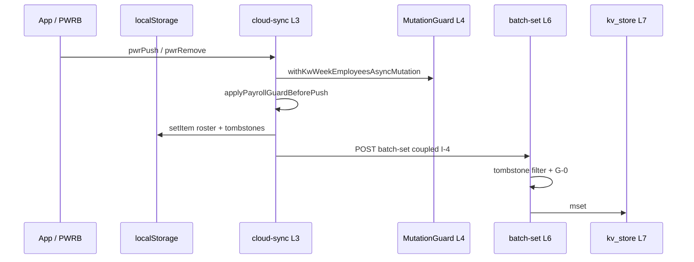

# CORE — Protected Architecture (WGDOM)

> **Status:** **PROPOSED** — SSOT granicy Protected Core (CORE-01A)  
> **Data:** 2026-07-04 · **Prod:** 2.63.30 · **RC-B-1:** CLOSED  
> **Design Freeze:** [CORE-01A-DESIGN-FREEZE.md](./CORE-01A-DESIGN-FREEZE.md) · [#5C-5B Bootstrap/Reconcile Decouple](./CORE-5C-5B-BOOTSTRAP-RECONCILE-DECOUPLE-DESIGN-FREEZE.md) (**APPROVED** · IMPLEMENT BLOCKED)  
> **Tryb:** dokumentacja · **nie zastępuje** [`PAYROLL-CLOUD-SYNC-ARCHITECTURE-AGENT-GUIDE.md`](../PAYROLL-CLOUD-SYNC-ARCHITECTURE-AGENT-GUIDE.md) (operacje)  
> **Implementacja guard:** CORE-01A (statyczny) · **Fixy bypass:** CORE-01B

---

## 1. Definicja Protected Core

**Protected Core** to zamknięty zestaw modułów odpowiedzialnych za **spójność danych Listy Płac i synchronizacji KV**, dla których:

1. Zmiana wymaga **Gate CORE** + macierzy PAYROLL-QUALITY-GATE.
2. Mutacja składu tygodnia LP przechodzi **wyłącznie** przez PWRB (za wyjątkiem udokumentowanych bypass — [Bypass Registry](./CORE-01-BYPASS-REGISTRY.md)).
3. Klient i Edge zachowują **parity B6** na `payroll-week-employee-merge.ts`.
4. CORE-01A **nie zmienia** logiki tych modułów — tylko dokumentuje granicę i egzekwuje statycznie.

---

## 2. Warstwy (L1–L7)

```text
┌──────────────────────────────────────────────────────────────┐
│ L7  KV Store      kv_store.tsx · kv-batch-order.ts           │
├──────────────────────────────────────────────────────────────┤
│ L6  Edge Transport batch-get (read) · batch-set (write)      │
│     supabase/functions/make-server-0afb8820/index.tsx        │
├──────────────────────────────────────────────────────────────┤
│ L5  Bootstrap     CloudLoader.tsx — F1 core + payroll merge  │
├──────────────────────────────────────────────────────────────┤
│ L4  Runtime Guard cloud-sync-mutation-guard.ts               │
├──────────────────────────────────────────────────────────────┤
│ L3  Sync Kernel   cloud-sync.ts — merge, push, tombstones    │
├──────────────────────────────────────────────────────────────┤
│ L2  Merge Engine  payroll-week-employee-merge.ts             │
├──────────────────────────────────────────────────────────────┤
│ L1  Facade        payroll-week-roster-bundle.ts (PWRB)       │
└──────────────────────────────────────────────────────────────┘
```

### 2.1 Pliki per warstwa

| Warstwa | Plik | Odpowiedzialność |
|---------|------|------------------|
| **L1 PWRB** | `src/lib/payroll-week-roster-bundle.ts` | Jedyny publiczny entry mutacji pary `(roster, tombstones)` w UI |
| **L2 Merge** | `src/lib/payroll-week-employee-merge.ts` | `weekEmployeeMergeKey`, UNION list, roster expansion detection |
| **L3 Sync** | `src/lib/cloud-sync.ts` | `DATA_KEYS`, pull/push, `finalizePayrollBundleMerge`, tombstone engine, Payroll Guard |
| **L4 Guard** | `src/lib/cloud-sync-mutation-guard.ts` | Blokada auto-sync podczas mutacji `kw-week-employees` / `kw-jobs` |
| **L5 Bootstrap** | `src/app/CloudLoader.tsx` | F5: fetch → merge → `applyBootstrapPayrollMerge` → `pwrReconcile` → push |
| **L6 Edge** | `supabase/functions/make-server-0afb8820/index.tsx` | `batch-get`/`batch-set`, Edge UNION, G-0, shrink guard |
| **L7 KV** | `kv_store.tsx` | Postgres `kv_store_0afb8820` — `mget`/`mset` |

### 2.2 Poza Protected Core (orchestracja / UI)

| Plik | Rola | Wymóg |
|------|------|-------|
| `src/app/App.tsx` | Handlery LP, `runCloudSync` | Delegacja mutacji składu → PWRB |
| `src/app/PayrollView.tsx` | UI read-only props | Brak direct KV |
| `src/app/hooks/useLocalStorage.ts` | LS hook | Dokumentowany wyjątek — UI state |
| `src/app/WorkerPhotoView.tsx` | Worker panel | **Bypass znany** — BYP-H1 |

---

## 3. Inwarianty (frozen — bez zmiany w CORE-01A)

### G-0 — Globalny

```text
K ∈ roster(W)  ⟹  tombstone(W, K) MUST NOT exist
```

### I-1…I-4 (RC-B-1)

| ID | Warstwa | Opis |
|----|---------|------|
| **I-1** | Klient pull | Revoke tomb gdy cloud roster zawiera mergeKey |
| **I-2** | Edge batch-set | Normalizacja pary przed `mset` |
| **I-3** | `reconcileTombstonesWithRoster` | Import/restore/bootstrap |
| **I-4** | `pushWeekEmployeesToCloud` | Coupled push obu kluczy KV |

### S1-1 — RS payroll exclusion

`pushMergedDataBundleToCloud` / `runCloudSync` **wyklucza** payroll keys z full-bundle push. Domain push = osobna ścieżka PWRB.

### B4 / B6 — Parity

- **B4:** `finalizePayrollBundleMerge` — SSOT bootstrap/runtime merge
- **B6:** `payroll-week-employee-merge.ts` — identyczny kernel klient + Edge

Szczegóły: [`SYNC-ARCH-01-RC-B-1-CLOSEOUT.md`](../recovery/SYNC-ARCH-01-RC-B-1-CLOSEOUT.md).

---

## 4. Dozwolone publiczne API

### 4.1 PWRB (L1) — jedyny entry mutacji składu

| API | Przeznaczenie | Caller produkcyjny |
|-----|---------------|-------------------|
| `pwrAdd` | Dodanie z Kadr + revoke | **Brak** (inline w App — dryft, → 01B) |
| `pwrRemove` | Usunięcie z tygodnia | `App.tsx` `removeWeekEmployee` |
| `pwrPush` | Persist rosteru | `App.tsx` persist, add, clear, replace, restore |
| `pwrReconcile` | Post-merge bootstrap | `CloudLoader.tsx` |
| `pwrImportMerge` | Backup JSON | `App.tsx` `importBackup` |
| `pwrRestorePayrollMerge` | Restore payroll | `App.tsx` `restorePayrollFromCloud` |
| `pwrPullMerge` | Pull helper | Nieużywany |

### 4.2 Merge Engine (L2) — publiczne

| API | Kto importuje |
|-----|---------------|
| `weekEmployeeMergeKey` | cloud-sync, App, Edge, payroll-display |
| `mergeWeekEmployeesList` | cloud-sync, Edge |
| `hasWeekEmployeesRosterExpansion` | cloud-sync, Edge |

### 4.3 Cloud Sync (L3) — podział API

| Klasa | Przykłady | Kto może wołać |
|-------|-----------|----------------|
| **@internal payroll push** | `pushWeekEmployeesToCloud` | **Tylko PWRB** (CI-PWRB-6) |
| **Payroll merge SSOT** | `finalizePayrollBundleMerge`, `mergeWeekEmployeesForWeekRange` | CloudLoader, pull, testy |
| **Tombstone kernel** | `addDeletedWeekEmployeeKey`, `saveDeletedWeekEmployeeKeys` | **Tylko PWRB** + merge pull (CI-PWRB-1…3) |
| **RS transport** | `pushMergedDataBundleToCloud`, `pullAndMergeDataBundle` | App `runCloudSync` |
| **Generic push** | `pushKeysToCloud`, `pushKeysToCloudSafe` | Moduły — **ryzyko bypass** |

Pełna lista ~100 eksportów: audyt CORE-01 — agent guide §1.

### 4.4 Edge (L6)

| Endpoint | Semantyka |
|----------|-----------|
| `POST batch-get` | Read-only `kv.mget` |
| `POST batch-set` | Merge per key + `kv.mset` + daily backup |
| `POST restore-payroll-backup` | UNION + tombstone filter |
| `POST restore-data-backup` | Multi-key restore |

**Brak authZ** na KV — dokumentowane w ADR-CLOUD-SYNC; poza CORE-01A.

---

## 5. Antywzorce (NIE rób)

| Antywzorzec | Skutek | Registry |
|-------------|--------|----------|
| `setWeekEmployees` + osobny push tombów | G-0 broken | RC-B closeout §5.3 |
| `pushKeysToCloudSafe(["kw-week-employees"])` bez PWRB | I-4 broken | BYP-H1 |
| `pwrPush([])` bez tombstonów per removed | Resurrection | BYP-H2 |
| `setWeekEmployees` filter bez `pwrRemove` | Resurrection | BYP-H3 |
| Zmiana `mergeWeekEmployees` tylko klient | B6 FAIL | — |
| Partial push bez `replaceWeekEmployeesKeys` | Edge UNION resurrection | H-R3 |
| Nowy klucz KV bez `DATA_KEYS` + CloudLoader | ENOENT prod | — |
| Edycja L1–L7 bez Gate CORE | Regresja prod | CORE-01A |

---

## 6. Architecture Guard (CORE-01A — tylko statyczny)

| Warstwa | Mechanizm | Status |
|---------|-----------|--------|
| **Statyczny** | `audit-pwrb-boundary.mjs` CI-PWRB-1…10 | Spec w DF · IMPLEMENT pending |
| **Statyczny** | `audit-core-ls-writes.mjs` CI-CORE-LS-1…3 | Spec w DF · IMPLEMENT pending |
| **Proceduralny** | FEATURE Boundary Check (#CORE-014) | **ACTIVE** — [CORE-01A-CHANGE-CHECKLIST.md](./CORE-01A-CHANGE-CHECKLIST.md) |
| **Proceduralny** | `CORE-01A-CHANGE-CHECKLIST.md` | DF Faza 1 |
| **CI** | Gate CORE (`test-manifest` v1.2) | Spec w DF · IMPLEMENT pending |
| **Runtime dev** | `__wgdomCoreGuard` LS wrapper | **CORE-01B** — poza 01A |

---

## 7. Protected Build Gate

```text
Gate CORE = gate-core-protected suite
          + gate-b-relevant (scope payroll intersection)
          + implicit build (Gate A)
```

**Komenda docelowa:**

```bash
npm run test:infra -- --gate CORE --scope core
```

**Obowiązkowy przy diff:**

```text
src/lib/payroll-week-roster-bundle.ts
src/lib/payroll-week-employee-merge.ts
src/lib/cloud-sync.ts
src/app/CloudLoader.tsx
supabase/functions/make-server-0afb8820/index.tsx
```

Szczegóły: [CORE-01A-DESIGN-FREEZE.md](./CORE-01A-DESIGN-FREEZE.md) §7.

---

## 8. Relacja dokumentów SSOT

```text
CORE-PROTECTED-ARCHITECTURE.md     ← GRANICA (ten plik)
        ↓
PAYROLL-CLOUD-SYNC-AGENT-GUIDE    ← JAK działa sync (operacje)
        ↓
SYNC-ARCH-01-RC-B-1-CLOSEOUT     ← CO naprawiono (PWRB)
        ↓
CORE-01-BYPASS-REGISTRY          ← znane luki
        ↓
CORE-01B-BACKLOG                 ← plan fixów runtime
```

| Dokument | Pytanie |
|----------|---------|
| Ten plik | **Co** jest chronione i **jakie** API dozwolone? |
| Agent Guide | **Jak** działa przepływ sync/merge? |
| RC-B-1 Closeout | **Dlaczego** PWRB i I-1…I-4? |
| Bypass Registry | **Gdzie** omijamy PWRB dziś? |
| ADR Cloud Sync | **Dokąd** strategia sync długoterminowo? |

---

## 9. Diagram przepływu zapisu (referencyjny)



**Ścieżka RS (bez payroll keys):** `runCloudSync` → `pushMergedDataBundleToCloud` — S1-1 exclusion.

---

*Ostatnia aktualizacja: 2026-07-04 · PROPOSED · CORE-01A SAFE MODE*
