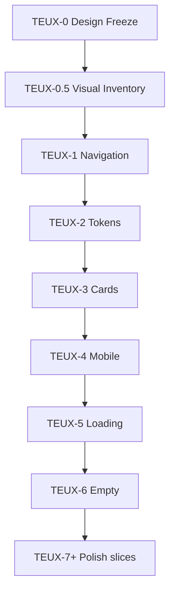

# NG-06-TEUX — Tender Experience & Design System · DESIGN FREEZE

> **Status:** **DESIGN FREEZE v1.1 — PENDING OWNER APPROVAL**  
> **Tryb:** AUDIT → DESIGN FREEZE · **IMPLEMENT = BLOCKED** (do jawnego Owner GO per bundle)  
> **Data freeze:** 2026-07-07  
> **Epic ID:** **NG-06-TEUX** (Tender Experience & Design System)  
> **Klasa:** **FEATURE UI** (#CORE-014 — zero mixed CORE+FEATURE · #CORE-013 boundary)  
> **Baseline prod:** UI **2.63.59** · feature **`ead4de7`** · https://www.wgdom.fun · **Phase 1 COMPLETE** (TEUX-1…6 CLOSED) · **TOKEN FREEZE ACTIVE**  
> **Phase 1 closeout:** [`NG-06-TEUX-PHASE1-CLOSEOUT.md`](./NG-06-TEUX-PHASE1-CLOSEOUT.md)  
> **STABILIZATION WINDOW:** ACTIVE — epic start wymaga Owner GO + brak kolizji z Protected Core  
> **Audyt źródłowy:** sesja AUDIT UX/UI Przetargi 2026-07-07 (20 obszarów)  
> **Workflow (niezmienny):** [`WORKFLOW-ARCHITECTURE-v2.63.md`](../WORKFLOW-ARCHITECTURE-v2.63.md)  
> **Pipeline (niezmienny):** NG-02 `useTenderPipelineRuntime` — **bez zmian** w NG-06-TEUX  
> **Review architektury:** [`ARCHITECTURE-REVIEW-2026-TENDERS.md`](../ARCHITECTURE-REVIEW-2026-TENDERS.md)  
> **Kolizja nazw:** NG-05 MPI (Market Pricing Intelligence) = **osobny program CLOSED** — nie mylić z NG-06-TEUX

```text
CEL:           Ujednolicony Tender Design System + warstwa premium polish (UI-only).
ZASADA:        SSOT lib *-ux.ts · Reuse V4 shell · Zero Duplicate Logic · Mobile First ≤390px.
ZAKAZ:         Pipeline · parsery · sync KV · Payroll · PWRB · CloudLoader · Edge · App.tsx (payroll).
GATE:          Owner GO per bundle + test gate + boundary #CORE-013/#CORE-014 przed commitem.
```

---

## 0. Werdykt freeze

| Pole | Wartość |
|------|---------|
| **Przedmiot** | Design System modułu Przetargi + pipeline **TEUX-0 → 0.5 → 1…6 → 7+** (UI-only) |
| **Poza zakresem** | `useTenderPipelineRuntime` · `tender-dossier-pipeline` · `tenders-bzp-analyze-local` · scoring · sync · Edge · NG-05 MPI implement |
| **Nowe pole KV** | **Brak** |
| **Nowe klucze LS** | Tylko opcjonalne prefs UI (np. collapsed filters) — **bez** danych biznesowych |
| **Principles** | **#TEUX-001–#TEUX-015** (§1) |
| **Bundles IMPLEMENT** | **TEUX-0.5…6** (core) + **TEUX-7+** (polish slices) — osobne commity · jeden bundle = jeden cel |

### Final Decision

**PENDING OWNER APPROVAL** — dokument kompletny do akceptacji. **IMPLEMENT pozostaje BLOCKED** do jawnego **Owner GO** per bundle TEUX-N.

### Warunki startu epicu

| # | Warunek | Status |
|---|---------|--------|
| 1 | Design Freeze v1.0 **APPROVED** przez Ownera | **PENDING** |
| 2 | STABILIZATION WINDOW — explicit override lub zamknięcie Z-01–Z-07 | Owner decision |
| 3 | Brak równoległego bundle CORE (#5C-5C F3) w tym samym commicie | Obowiązkowe |
| 4 | Każdy bundle: `#CORE-014` boundary check PASS przed push | Obowiązkowe |

---

## 1. Principles (#TEUX)

| ID | Zasada |
|----|--------|
| **#TEUX-001** | **UI-only** — zero zmian logiki biznesowej, parserów, merge, scoringu, pipeline runtime. |
| **#TEUX-002** | **SSOT FIRST** — dane z istniejących agregatów lib; UI nie buduje własnych reguł decyzyjnych. |
| **#TEUX-003** | **Reuse First** — rozszerzać `TenderDetailPage`, `TendersView`, `tender-ux-tokens`; nie tworzyć równoległego shella. |
| **#TEUX-004** | **Zero Duplicate Logic** — jeden wizualny kanał na sygnał (zachować Progressive Disclosure A-03-1). |
| **#TEUX-005** | **Mobile First** — projekt od viewportu ≤390px; desktop = rozszerzenie. |
| **#TEUX-006** | **Jedno CTA** — reguła WORKFLOW §4.3 zachowana; TEUX nie przywraca drugiego Primary CTA. |
| **#TEUX-007** | **Design tokens SSOT** — nowe wartości typography/spacing/color tylko przez `tender-ux-tokens.ts` (§2). |
| **#TEUX-008** | **Copy integrity** — zakaz user-facing „AI” dla heurystyk; używać „Rekomendacja” / „Analiza reguł”. |
| **#TEUX-009** | **URL SSOT tab** — bez zmian (`parseTenderDetailPath` · `pendingTab` · 2.63.8). |
| **#TEUX-010** | **Pipeline frozen** — NG-02 facade nietknięty; bootstrap/discovery/heavy lazy bez diff. |
| **#TEUX-011** | **Protected Core** — zero diff `cloud-sync.ts`, `CloudLoader.tsx`, Edge, PWRB, payroll handlers w `App.tsx`. |
| **#TEUX-012** | **Jeden bundle = jeden cel** — zakaz mixed commit FEATURE+CORE (#CORE-013). |
| **#TEUX-013** | **Payroll Regression Gate** — przy każdym bundle: `npm run test:infra -- --gate B --scope payroll` **15/15** (smoke, nie zmiana sync). |
| **#TEUX-014** | **Test manifest** — każdy bundle dodaje lub rozszerza `testIds` w `test-infra/test-manifest.json` (Principle test-infra #006). |
| **#TEUX-015** | **Rollback** — każdy bundle = jeden revert commit; brak migracji danych. |

---

## 2. Tender Design System (SSOT)

> **Plik docelowy (TEUX-2):** `src/lib/tender-ux-tokens.ts`  
> **Komponenty shared (TEUX-2):** `src/app/tenders/design-system/*` (opcjonalny folder — tylko prezentacja)

Design System obejmuje **wyłącznie moduł Przetargi** (`src/app/Tender*`, `src/app/tenders/**`, `src/app/TendersView.tsx`, lib `*-ux.ts` przetargów). **Nie** globalny redesign aplikacji.

### 2.1 Typography

| Token | Wartość | Tailwind docelowy | Użycie |
|-------|---------|-------------------|--------|
| `teux-font-meta` | 11px / 1.35 | `text-[11px] leading-snug` | Etykiety KPI, meta chipów, daty |
| `teux-font-caption` | 12px / 1.4 | `text-xs` | Chipy interaktywne, secondary body, tab bar |
| `teux-font-body` | 13px / 1.45 | `text-[13px]` | Paragrafy, opisy empty state |
| `teux-font-title` | 15px / 1.35 | `text-[15px] font-semibold` | Tytuły kart, sekcji |
| `teux-font-headline` | 18px / 1.3 | `text-lg font-semibold` | Nagłówek modułu, Hero Strategia |
| `teux-font-display` | 24px / 1.2 | `text-2xl font-bold` | KPI liczby (Pulpit, Strategia) |
| `teux-font-mono` | JetBrains Mono | `font-mono tabular-nums` | Kwoty PLN, terminy liczbowe, % |

**Reguły:**

- **Minimum interaktywny:** 12px (`teux-font-caption`) — zakaz `text-[10px]` i `text-[9px]` na **przyciskach i chipach** (migracja stopniowa w bundlach).
- **Label KPI:** `uppercase tracking-wide` tylko na labelach KPI/metric — nie na chipach filtrów.
- **Line clamp:** tytuły listy `line-clamp-2`; Command Layer mobile `line-clamp-1` (tab Przetarg).
- **Semantyka HTML:** jeden `h1` per widok (Command Layer / moduł); sekcje `h2` `text-xs font-semibold` (jak „Moja kolejka”).

**Mapa migracji (as-is → to-be):**

| As-is (częste) | To-be |
|----------------|-------|
| `text-[10px]` chipy | `teux-font-caption` (12px) |
| `text-[9px]` KPI label | `teux-font-meta` (11px) |
| `text-sm` tytuł detalu | `teux-font-title` / `teux-font-headline` per kontekst |

---

### 2.2 Spacing

**Grid bazowy:** 4px (Tailwind unit 1 = 4px).

| Token | Wartość | Użycie |
|-------|---------|--------|
| `teux-space-xs` | 4px (`gap-1`, `p-1`) | Wewnątrz chipów (minimum) |
| `teux-space-sm` | 8px (`gap-2`, `p-2`) | Chipy, tight rows |
| `teux-space-md` | 12px (`gap-3`, `p-3`) | Karty mobile, sekcje |
| `teux-space-lg` | 16px (`gap-4`, `px-4`) | Padding poziomy shell |
| `teux-space-xl` | 24px (`gap-6`, `py-6`) | Między panelami Strategii |
| `teux-space-section` | 16px mobile / 24px desktop | `space-y-4 sm:space-y-6` między sekcjami content |

**Reguły:**

- Padding shell: `px-4 sm:px-6` (bez zmian — SSOT layout).
- Chipy filtrów: `gap-2` między elementami; `px-2.5 py-1.5` wewnątrz.
- Karty listy: `px-4 py-3` (z `py-2.5` as-is — delikatny bump).
- Touch target: **min 44×44px** mobile (`min-h-[44px]`) — zachować z NG-03.
- Safe area: `padding-bottom: max(1rem, env(safe-area-inset-bottom))` na scroll rootach — bez zmian.

---

### 2.3 Color system

Kolory bazują na **istniejących tokenach Tailwind/shadcn** (`primary`, `secondary`, `muted-foreground`, `destructive`, `border`). TEUX **nie wprowadza** nowej palety brand — standaryzuje **semantyczne role**.

| Rola semantyczna | Token / klasa | Użycie |
|------------------|---------------|--------|
| **Primary action** | `bg-primary text-primary-foreground` | CTA, aktywny tab, aktywny chip filtra |
| **Surface default** | `bg-card border-border` | Karty, panele |
| **Surface muted** | `bg-secondary/30` · `bg-secondary/60` | Tab bar tło, chip nieaktywny |
| **Text primary** | `text-foreground` | Tytuły, wartości |
| **Text secondary** | `text-muted-foreground` | Meta, opisy |
| **Urgent / deadline** | `amber-500/*` | Termin ≤7 dni, sekcja „Dzisiaj”, pilne KPI |
| **Warning / action** | `amber-500/10` border `amber-500/25` | Banner rekomendacji (tone action) |
| **Success / positive** | `emerald-500/*` | Wygrane, tone positive insight |
| **Blocked / error** | `destructive/*` · `red-500/*` | Wadium blocked, błędy pipeline |
| **Strategic client** | `orange-500/*` | Segmenty klientów (WM, MOPS, …) |
| **Info / link** | `text-primary` | Linki, powrót do listy |

**Severity stripe (TEUX-3):** pasek 3px po lewej karcie listy:

| Severity | Kolor paska |
|----------|-------------|
| `urgent` | `border-l-amber-500` |
| `blocked` | `border-l-red-500` |
| `default` | `border-l-transparent` |
| `today` | `border-l-amber-400` + istniejący ring |

**Dark mode:** wszystkie nowe komponenty muszą używać par `dark:` tam gdzie as-is już je ma (chipy amber/emerald). TEUX-8 weryfikuje kontrast WCAG AA na chipach.

---

### 2.4 Badge system

**SSOT komponent (TEUX-2):** `TenderUxBadge` — warianty:

| Wariant | Wygląd | Przykład |
|---------|--------|----------|
| `status` | Neutral + border | Status pipeline (nowe, oferta, …) |
| `score` | Primary tint | Trafność % |
| `fit` | Violet tint | Dopasowanie strategiczne |
| `urgent` | Amber | „≤7 dni” |
| `trust` | Mapowany z `TrustChip` — **reuse**, nie duplikat |
| `queue` | Primary ring gdy active | Filtry kolejki |

**Reguły:**

- Badge **nie** jest przyciskiem — interaktywne filtry używają `TenderUxChip` (większy hit area).
- Max **4 badge** w jednym rzędzie karty listy mobile; reszta w `+N` overflow.
- Rozmiar: `teux-font-caption`, `px-2 py-0.5`, `rounded-md`.

---

### 2.5 KPI system

Dwa poziomy (zachować z NG-03, ujednolicić tokeny):

| Poziom | Komponent | Kontekst | Komórki |
|--------|-----------|----------|---------|
| **Compact** | `TenderDetailKpiCompact` | Command Layer (tab ≠ Przetarg) | 4: Termin · Wartość · Dokumenty · Wycena |
| **Display** | `TendersShortcutPanel` / `StrategyKpiStrip` | Pulpit / Strategia | 5+ KPI liczników |
| **Hero** | `TenderCenyWorkspace` summary | Tab Ceny | Kwota PLN hero |

**Tokeny KPI:**

- Label: `teux-font-meta uppercase tracking-wide text-muted-foreground`
- Value: `teux-font-display` lub `text-2xl font-bold tabular-nums font-mono`
- Sub-value: `teux-font-caption text-primary`
- Kontener: `rounded-xl border px-3 py-2.5` + severity border gdy `count > 0`

**Reguła dedup (TEUX-10):** Pulpit pokazuje **max 3 KPI + CTA**; pełny zestaw tylko w Strategii.

---

### 2.6 Hero Header

**Definicja:** pierwszy blok widoku modułu — odpowiada na „gdzie jestem” + „co jest najważniejsze”.

| Widok | Komponent | Składowe |
|-------|-----------|----------|
| **Moduł Przetargi** | `TendersModuleHeader` | Ikona · tytuł · subtitle · CTA Odśwież BZP |
| **Strategia** | `TendersStrategyHero` | Headline · forecast strip · health summary |
| **Detal V4** | `TenderDetailCommandLayer` | Powrót · tytuł · tab bar · (ribbon+CTA na Przetarg) |
| **Lista** | Brak osobnego Hero — search row = anchor |

**TEUX reguły Hero:**

- Wysokość modułu header: **≤ 72px** mobile (bez liczenia tab bar).
- Subtitle modułu: jedna linia `teux-font-caption text-muted-foreground`.
- **Nie** dodawać drugiego Hero w detalu — Command Layer jest Hero detalu.

---

### 2.7 Cards

| Typ karty | Komponent docelowy | Breakpoint |
|-----------|-------------------|------------|
| **List row (mobile)** | `TenderListMobileCard` (nowy, TEUX-3) | `< lg` |
| **List row (desktop)** | `TenderListDesktopCard` (refactor `renderTenderItem`) | `≥ lg` |
| **BOQ / Ceny row** | `TenderMobileRowCard` (istniejący) | `< lg` |
| **Strategy panel** | `rounded-xl border bg-card` (istniejący) | all |
| **KPI tile** | patrz §2.5 | all |

**Anatomia karty listy (mobile):**

```text
┌─ severity stripe ─────────────────────────────┐
│ [status badge] [urgent?]                      │
│ Tytuł przetargu (max 2 linie)               │
│ Zamawiający · miasto (1 linia muted)        │
│ ┌─────────┬─────────┬─────────┐            │
│ │ Termin  │ Trafność│ Wadium  │            │
│ └─────────┴─────────┴─────────┘            │
└──────────────────────────────────────────────┘
```

**Interakcja:** cała karta = jeden `<button>` lub `<a>`; bulk checkbox osobno z `stopPropagation`.

---

### 2.8 Loading

| Stan | Wzorzec docelowy | Zakaz |
|------|------------------|-------|
| **Moduł init** | Skeleton: header + 3 card placeholders | Sam tekst „Ładowanie…” |
| **Lista** | 3× `TenderListCardSkeleton` | Full-page blank |
| **Detal** | Command Layer skeleton + content pulse | Tylko `Loader2` bez layoutu |
| **Dokumenty** | `TenderDocumentsSummarySkeleton` (5 slotów) | Spinner w pustym headerze |
| **Kosztorys BOQ** | 8-row table skeleton | Spinner na całą zakładkę |
| **Inline action** | `Loader2` w przycisku (zachować) | — |
| **Długa operacja** | Stepped label: „Pobieranie → Załączniki → Analiza” | Bez nazwy kroku |

**Tokeny skeleton:** `animate-pulse bg-secondary/60 rounded-md` — spójne z resztą aplikacji.

---

### 2.9 Empty states

**SSOT komponent (TEUX-6):** `TenderUxEmptyState`

| Prop | Opis |
|------|------|
| `icon` | Lucide, 32px, `text-muted-foreground/50` |
| `title` | `teux-font-title` |
| `description` | `teux-font-body text-muted-foreground` |
| `primaryAction?` | `{ label, onClick }` |
| `secondaryAction?` | `{ label, onClick }` link style |

**Macierz empty states:**

| Kontekst | Tytuł | Primary CTA | Secondary |
|----------|-------|-------------|-----------|
| Lista (filtry) | Brak przetargów dla filtrów | Wyczyść filtry | Odśwież z BZP |
| Lista (pusta baza) | Brak aktywnych przetargów | Odśwież z BZP | Zmień zakres listy |
| Mapa | Brak markerów we Wrocławiu | Przejdź do listy | — |
| Dokumenty platforma | Brak dokumentów | Wyszukaj zewnętrzne | — |
| Kosztorys | Brak kosztorysu | Przejdź do Dokumentów | — |
| Strategia (panel) | Brak pozycji | — | — |

---

### 2.10 Motion

| Token | Wartość | Użycie |
|-------|---------|--------|
| `teux-duration-fast` | 150ms | Hover chipów, tab switch |
| `teux-duration-normal` | 200ms | Accordion, sheet |
| `teux-ease` | `ease-out` | Wszystkie transitions UI |

**Reguły:**

- Zachować istniejące `transition-colors duration-150` na tab bar / CTA.
- **Zakaz** auto-animacji layoutu (layout shift) przy ładowaniu danych.
- `animate-spin` tylko na `Loader2` w aktywnych akcjach.
- Collapsible Command Layer (TEUX-7b): `transform translateY` max 200ms — **opcjonalny** reduce-motion: `prefers-reduced-motion: reduce` → bez animacji.

---

### 2.11 Mobile principles

| # | Zasada |
|---|--------|
| M1 | Projekt od **390px** szerokości; test referencyjny: iPhone 14 / Z-05 field cert |
| M2 | **44px** min touch target na wszystkich akcjach |
| M3 | Command Layer tab Przetarg: **≤ 50vh** chrome (NG-03 §2.1) — TEUX-7b collapsible jeśli przekroczone |
| M4 | Modułowe taby dostępne w detalu przez **sheet** (TEUX-4) — nie `max-lg:hidden` bez alternatywy |
| M5 | Operator Action Bar: `sticky bottom-0` tylko `< lg` |
| M6 | Search lista: **nie sticky** `< md` (iOS Safari MOBILE-P0-S1) — FAB filtr jako kompensacja (TEUX-7a) |
| M7 | Native back: `registerNativeBackHandler` — bez zmian |
| M8 | Horizontal scroll tab bar: `overflow-x-auto overscroll-x-contain` + scroll shadow (TEUX-7b) |
| M9 | Reuse `TenderMobileRowCard` pattern — lista musi mieć equivalent (TEUX-3) |
| M10 | Mapa → detal: **navigate V4** (`/przetargi/:id/przetarg`) — nie accordion (TEUX-1) |

---

## 3. Pipeline epicu (overview)

```text
NG-06-TEUX — kolejność wiążąca

TEUX-0    DESIGN FREEZE (ten dokument)           — PENDING APPROVAL
    ↓
TEUX-0.5  VISUAL INVENTORY (docs-only)          — przed pierwszym IMPLEMENT
    ↓
TEUX-1    NAVIGATION                           — ★ CLOSED (2.63.54 · 5a8b820)
    ↓
TEUX-2    DESIGN TOKENS                        — ★ CLOSED (2.63.55 · 3eb70a0) · TOKEN FREEZE
    ↓
TEUX-3    CARDS (lista mobile/desktop)         — ★ CLOSED (2.63.56 · 7a0ae83)
    ↓
TEUX-4    MOBILE (sheet · chrome · touch)      — ★ CLOSED (2.63.57 · d965311)
    ↓
TEUX-5    LOADING (skeletons)                  — ★ CLOSED (2.63.58 · 061fc9a)
    ↓
TEUX-6    EMPTY STATES                         — ★ CLOSED (2.63.59 · ead4de7)
    ↓
TEUX-7+   POLISH (slices on-demand · Owner GO per slice) — ★ READY FOR AUDIT
    ├── 7a  Lista — filtry collapsible + FAB
    ├── 7b  Command Layer polish
    ├── 7c  Accessibility pass
    ├── 7d  Copy — rebrand „AI” → „Rekomendacja”
    ├── 7e  Strategia + Pulpit alignment
    ├── 7f  Legacy Hosted deprecation guard (docs)
    └── 7z  EPIC CLOSEOUT
```

**Zasada:** TEUX-1…6 = **Phase 1 core** — **COMPLETE** ([`NG-06-TEUX-PHASE1-CLOSEOUT.md`](./NG-06-TEUX-PHASE1-CLOSEOUT.md)). **TEUX-7+** = polish slices — każdy osobny commit po zamknięciu TEUX-6, **Owner GO per slice** · **READY FOR AUDIT**.

**SSOT Visual Inventory:** [`NG-06-TEUX-VISUAL-INVENTORY.md`](./NG-06-TEUX-VISUAL-INVENTORY.md)

---

## 4. Bundle specifications

### TEUX-0 — DESIGN FREEZE

| Pole | Wartość |
|------|---------|
| **Zakres** | Ten dokument v1.1 · Owner approval §10 |
| **AC** | Owner podpisuje §0 Final Decision = **APPROVED** |
| **Test gate** | — |
| **Ryzyko** | Brak |
| **Boundary** | Docs only |

---

### TEUX-0.5 — VISUAL INVENTORY

| Pole | Wartość |
|------|---------|
| **Zakres** | **Docs-only** — kompletna inwentaryzacja ekranów i komponentów Przetargów **przed** TEUX-1. Artefakt: [`NG-06-TEUX-VISUAL-INVENTORY.md`](./NG-06-TEUX-VISUAL-INVENTORY.md). Screenshot checklist per widok (Owner). Mapa: komponent → plik → breakpoint → stan (loading/empty/filled). Baseline typography/spacing **as-is** zapisany jako punkt odniesienia migracji. |
| **AC** | T1: Dokument inventory **COMPLETE** — wszystkie widoki § inventory wypełnione. T2: Każdy widok ma: route, komponent root, lista child UI, breakpoint notes. T3: Gap list (P0/P1/P2) zsynchronizowana z audytem 2026-07-07. T4: Owner potwierdza baseline screenshots (opcjonalnie załączniki poza repo). T5: **Zero** diff `src/`. |
| **Test gate** | — (docs only) · review checklist w inventory §9 |
| **Ryzyko** | **Brak** — read-only |
| **Boundary** | Wyłącznie `docs/architecture/NG-06-TEUX-VISUAL-INVENTORY.md` + ewentualna aktualizacja tego DF |

**Gate:** TEUX-1 **BLOCKED** dopóki TEUX-0.5 ≠ COMPLETE.

---

### TEUX-1 — NAVIGATION · **CLOSED**

| Pole | Wartość |
|------|---------|
| **Status** | **CLOSED** — prod **2.63.54** · `5a8b820` · [`NG-06-TEUX-TEUX1-CLOSEOUT.md`](./NG-06-TEUX-TEUX1-CLOSEOUT.md) |
| **Zakres** | (1) `TendersMapTab` → `navigate(buildTenderDetailPath(id, "przetarg"))` zamiast `openTenderInList`. (2) SSOT helper `openTenderDetailV4(navigate, id, tab?)` w `src/lib/tender-detail-nav.ts`. (3) Ujednolicenie: Strategia, Mapa, lista, JobsView deep link → ten sam helper. (4) Weryfikacja URL SSOT tab (`pendingTab`) bez regresji. **Bez** copy pass — to TEUX-7d. |
| **Pliki** | `TendersMapTab.tsx`, `TendersStrategyTab.tsx` / `TendersStrategyContent`, `tender-detail-nav.ts` (new), `TendersListPage.tsx`, grep callers `openTenderInList` |
| **AC** | T1: Klik marker mapy → `/przetargi/:id/przetarg`. T2: Strategia → detal używa `openTenderDetailV4`. T3: Brak ścieżki accordion expand przy `TENDERS_V4_ROUTING=true`. T4: Zero diff pipeline/sync. T5: Native back z detalu → lista bez orphan state. |
| **Test gate** | `scripts/test-tender-detail-nav-teux1.mjs` (`LIB-TENDER-DETAIL-NAV-TEUX1`) · gate B tenders · payroll 15/15 |
| **Ryzyko** | **Niskie** |
| **Boundary #CORE-013/014** | Nav helpers + tab components only — zero Protected Core |

---

### TEUX-2 — DESIGN TOKENS · **CLOSED** · TOKEN FREEZE

| Pole | Wartość |
|------|---------|
| **Status** | **CLOSED** — prod **2.63.55** · `3eb70a0` · [`NG-06-TEUX-TEUX2-CLOSEOUT.md`](./NG-06-TEUX-TEUX2-CLOSEOUT.md) |
| **TOKEN FREEZE** | **ACTIVE** — `tender-ux-tokens.ts` zamrożony do MID EPIC REVIEW |
| **Zakres** | `src/lib/tender-ux-tokens.ts` + `src/app/tenders/design-system/TenderUxBadge.tsx`, `TenderUxChip.tsx`, `TenderUxSectionTitle.tsx`. Adopt referencyjny: `TendersModule` tab bar. §2 Design System = SSOT. |
| **AC** | T1: Tokeny §2.1–2.3 wyeksportowane jako const. T2: `TenderUxChip`: `aria-pressed`, min-h 44px mobile. T3: ≥2 komponenty importują tokeny. T4: Build PASS. |
| **Test gate** | `scripts/test-tender-ux-tokens-teux2.mjs` (`LIB-TENDER-UX-TOKENS-TEUX2`) · gate B tenders |
| **Ryzyko** | **Niskie** |
| **Boundary** | Nowe pliki tokens + design-system only + minimal `TendersModule` |

---

### TEUX-3 — CARDS · **CLOSED**

| Pole | Wartość |
|------|---------|
| **Status** | **CLOSED** — prod **2.63.56** · `7a0ae83` · combined release TEUX-3/4 |
| **Zakres** | `TenderListMobileCard`, `TenderListDesktopCard`, `TenderListCardSkeleton` w `tenders/list/*`. Severity stripe §2.3. Migracja z `TendersView.renderTenderItem`. Tokeny TEUX-2 na badge/chipy karty. |
| **AC** | T1: `< lg` → mobile card layout. T2: `≥ lg` → desktop card. T3: Severity stripe urgent/blocked. T4: V4 navigate on click. T5: Bulk mode + „Dzisiaj” bez regresji. |
| **Test gate** | `scripts/test-tender-list-cards-teux3.mjs` (`LIB-TENDER-LIST-CARDS-TEUX3`) · `test-tender-workspace-ux.mjs` · gate B tenders |
| **Ryzyko** | **Średnie** |
| **Boundary** | `TendersView`, `tenders/list/*`, `tenders-list-ux` (prezentacja) |

---

### TEUX-4 — MOBILE · **CLOSED**

| Pole | Wartość |
|------|---------|
| **Status** | **CLOSED** — prod **2.63.57** · `d965311` · [`NG-06-TEUX-TEUX4-RELEASE-VERIFICATION.md`](./NG-06-TEUX-TEUX4-RELEASE-VERIFICATION.md) |
| **Zakres** | (1) `TenderModuleNavSheet` — menu modułu z detalu `< lg`. (2) Touch/density pass na Command Layer (`max-[390px]`). (3) Scroll shadow tab bar. (4) Operator bar safe-area verify. (5) Tablet valley notes z inventory — bez pełnego redesignu. **Nie** obejmuje list cards (TEUX-3) ani FAB filtrów (TEUX-7a). |
| **AC** | T1: Z detalu mobile → Strategia/Mapa/Profil bez powrotu do listy. T2: Command Layer +1 rząd max (przycisk menu). T3: Tab bar horizontal scroll + shadow. T4: Desktop bez zmian. T5: Z-05 checklist items M1–M5 gotowe do field cert. |
| **Test gate** | `scripts/test-tender-mobile-teux4.mjs` (`LIB-TENDER-MOBILE-TEUX4`) · gate B tenders |
| **Ryzyko** | **Średnie** |
| **Boundary** | `TenderDetailCommandLayer`, `TenderDetailPage`, `TenderModuleNavSheet`, `mobile.css` tylko jeśli tender-scoped |

---

### TEUX-5 — LOADING · **CLOSED**

| Pole | Wartość |
|------|---------|
| **Status** | **CLOSED** — prod **2.63.58** · `061fc9a` · [`NG-06-TEUX-TEUX5-CLOSEOUT.md`](./NG-06-TEUX-TEUX5-CLOSEOUT.md) |
| **Zakres** | Skeleton: moduł init, lista (3 karty), `TenderDocumentsSummaryHeader`, BOQ (8 rows). Stepped label detal gdy `autoRunning`. Tokeny skeleton §2.8. |
| **AC** | T1: Moduł loading ≠ sam tekst. T2: Docs summary skeleton. T3: Kosztorys skeleton. T4: CTA disabled logic bez zmian. |
| **Test gate** | `scripts/test-tender-loading-teux5.mjs` (`LIB-TENDER-LOADING-TEUX5`) · gate B tenders |
| **Ryzyko** | **Niskie** |
| **Boundary** | Loading UI shells only |

---

### TEUX-6 — EMPTY STATES · **CLOSED**

| Pole | Wartość |
|------|---------|
| **Status** | **CLOSED** — prod **2.63.59** · `ead4de7` · [`NG-06-TEUX-TEUX6-CLOSEOUT.md`](./NG-06-TEUX-TEUX6-CLOSEOUT.md) |
| **Zakres** | `TenderUxEmptyState` + migracja: lista, mapa, dokumenty platforma, kosztorys. Deep link CTA przez `buildTenderDetailPath` / `openTenderDetailV4`. |
| **AC** | T1: Reusable component primary+secondary. T2: Lista: filtry vs pusta baza — 2 copy. T3: Kosztorys → CTA Dokumenty. |
| **Test gate** | `scripts/test-tender-empty-states-teux6.mjs` (`LIB-TENDER-EMPTY-STATES-TEUX6`) · gate B tenders |
| **Ryzyko** | **Niskie** |
| **Boundary** | Empty UI + minimal workspace edits |

---

### TEUX-7+ — POLISH (slices)

> **Gate epicu core:** TEUX-6 **CLOSED** — **SPEŁNIONE** (Phase 1 COMPLETE). Każdy slice 7+ = osobny commit + Owner GO · **READY FOR AUDIT**.

#### TEUX-7a — Lista filtry

| Pole | Wartość |
|------|---------|
| **Zakres** | Collapsible „Więcej filtrów”; FAB mobile; LS pref collapsed opcjonalnie |
| **AC** | Lista wyżej na first paint; wszystkie filtry dostępne; presety OK |
| **Test** | `LIB-TENDER-FILTERS-TEUX7A` |
| **Ryzyko** | Średnie |

#### TEUX-7b — Command Layer polish

| Pole | Wartość |
|------|---------|
| **Zakres** | CTA disabled reason (prezentacja only); collapsible chrome; breadcrumb mobile context |
| **AC** | Chrome ≤50vh; Process Strip + CTA zawsze visible; reguły P0–P12 nietknięte |
| **Test** | `LIB-TENDER-COMMAND-TEUX7B` + `test-tender-workflow-primary-action.mjs` |
| **Ryzyko** | Średnie |

#### TEUX-7c — Accessibility

| Pole | Wartość |
|------|---------|
| **Zakres** | `aria-pressed`, bulk checkbox fix, min 12px interactive, kontrast chipów |
| **AC** | Statyczny test brak `text-[10px]` na `button` w tender UI |
| **Test** | `LIB-TENDER-A11Y-TEUX7C` |
| **Ryzyko** | Niskie |

#### TEUX-7d — Copy integrity

| Pole | Wartość |
|------|---------|
| **Zakres** | „AI” → „Rekomendacja”; HelpView FAQ; grep user-facing strings |
| **AC** | Brak „AI” w UI listy/workflow user-facing |
| **Test** | `LIB-TENDER-COPY-TEUX7D` |
| **Ryzyko** | Niskie |

#### TEUX-7e — Strategia + Pulpit

| Pole | Wartość |
|------|---------|
| **Zakres** | Pulpit ≤3 KPI; Strategia spacing; collapsed panels default |
| **AC** | Pełne KPI tylko w Strategii; tokeny na StrategyKpiStrip |
| **Test** | `LIB-TENDER-STRATEGY-TEUX7E` |
| **Ryzyko** | Niskie–średnie |

#### TEUX-7f — Hosted deprecation

| Pole | Wartość |
|------|---------|
| **Zakres** | `NG-06-TEUX-HOSTED-DEPRECATION.md`; dev `console.warn`; `@deprecated` — **bez** usuwania |
| **AC** | Docs + guard; V4 default |
| **Test** | Docs + workspace-ux regresja |
| **Ryzyko** | Niskie |

#### TEUX-7z — EPIC CLOSEOUT

| Pole | Wartość |
|------|---------|
| **Zakres** | `NG-06-TEUX-EPIC-CLOSE-REPORT.md`; continuity docs; HelpView; manifest `SMOKE-TEUX-NG06`; CHANGELOG |
| **AC** | Wszystkie slice CLOSED/DEFERRED; Z-05 sign-off jeśli TEUX-3/4 shipped |
| **Test** | `npm run test:infra -- --suite smoke-teux` |
| **Ryzyko** | Niskie |

---

### 4a. Definition of Done (TEUX-1 · TEUX-2 · TEUX-3)

> **Gate Owner:** [`NG-06-TEUX-OWNER-APPROVAL-GATE.md`](./NG-06-TEUX-OWNER-APPROVAL-GATE.md)  
> Bundle uznany za **CLOSED** dopiero po spełnieniu **wszystkich** kryteriów DoD poniżej + jeden revertible commit.

#### TEUX-1 — Navigation (DoD)

| # | Kryterium |
|---|-----------|
| D1 | `openTenderDetailV4` w `src/lib/tender-detail-nav.ts` — SSOT `navigate` + `buildTenderDetailPath` |
| D2 | `TendersMapTab` — klik marker → `/przetargi/:id/przetarg` |
| D3 | Przy `TENDERS_V4_ROUTING=true` Mapa **nie** używa accordion-only (`openTenderInList` bez navigate) |
| D4 | Strategia → ten sam helper (thin refactor, bez zmiany UX) |
| D5 | `pendingTab` / URL SSOT — brak regresji |
| D6 | Zero diff Protected Core §6 · pipeline runtime |
| D7 | `LIB-TENDER-DETAIL-NAV-TEUX1` PASS |
| D8 | Gate B `scope:tenders` PASS |
| D9 | Gate B `scope:payroll` **15/15** (#TEUX-013) |
| D10 | `npm run build` PASS · CHANGELOG +0.1 · release B · verify FAST |
| D11 | Jeden commit · #CORE-013 PASS |

**Poza DoD TEUX-1:** copy · tokeny · karty · `App.tsx` · sync.

#### TEUX-2 — Design Tokens (DoD)

| # | Kryterium |
|---|-----------|
| D1 | `tender-ux-tokens.ts` — typography, spacing, color roles, motion (§2.1–2.3, §2.10) |
| D2 | `TenderUxBadge`, `TenderUxChip`, `TenderUxSectionTitle` w `tenders/design-system/` |
| D3 | `TenderUxChip`: `aria-pressed`, `min-h-[44px]` mobile |
| D4 | ≥2 komponenty modułu importują tokeny (ref: `TendersModule` tab bar) |
| D5 | Brak nowych wartości typography/spacing poza tokenami w zmienionych plikach |
| D6 | `LIB-TENDER-UX-TOKENS-TEUX2` PASS |
| D7 | Gate B tenders + payroll 15/15 |
| D8 | Build PASS · CHANGELOG · jeden commit |

#### TEUX-3 — Cards (DoD)

| # | Kryterium |
|---|-----------|
| D1 | `TenderListMobileCard`, `TenderListDesktopCard`, `TenderListCardSkeleton` w `tenders/list/*` |
| D2 | `< lg` mobile layout · `≥ lg` desktop layout |
| D3 | Severity stripe urgent/blocked/default/today (§2.3) |
| D4 | Klik karty → `openTenderDetailV4` |
| D5 | Bulk mode + „Dzisiaj” bez regresji |
| D6 | Tokeny TEUX-2 na badge/chipy karty |
| D7 | `LIB-TENDER-LIST-CARDS-TEUX3` PASS |
| D8 | `test-tender-workspace-ux.mjs` regresja PASS |
| D9 | Gate B tenders + payroll 15/15 |
| D10 | Build PASS · CHANGELOG · jeden commit |
| D11 | **MID EPIC REVIEW** (§4c) — Owner GO na TEUX-4 |

---

### 4b. Bundle Complexity

| Rozmiar | Definicja | Bundlery |
|---------|-----------|----------|
| **XS** | Docs-only · zero `src/` | TEUX-0, TEUX-0.5 |
| **S** | 1–5 plików `src/` · ryzyko niskie | **TEUX-1**, **TEUX-2**, TEUX-6, TEUX-7c, TEUX-7d, TEUX-7f |
| **M** | 6–15 plików · refactor widoku · ryzyko średnie | **TEUX-3**, TEUX-4, TEUX-5, TEUX-7a, TEUX-7b, TEUX-7e |
| **L** | >15 plików · cross-cutting · epic review | TEUX-7z |

| Bundle | Size | Pliki (szac.) | Ryzyko | Blokuje |
|--------|------|---------------|--------|---------|
| TEUX-0 | XS | 0 | — | — |
| TEUX-0.5 | XS | 0 | — | TEUX-1 |
| TEUX-1 | **S** | 3–5 + test | Niskie | TEUX-2 |
| TEUX-2 | **S** | 4–6 + test | Niskie | **CLOSED** |
| TEUX-3 | **M** | 8–12 + test | Średnie | **CLOSED** |
| TEUX-4 | M | 6–10 | Średnie | **CLOSED** |
| TEUX-5 | M | 6–10 | Niskie–średnie | **CLOSED** |
| TEUX-6 | S | 4–8 | Niskie | **CLOSED** |
| TEUX-7+ | S–M | varies | varies | **READY FOR AUDIT** |
| TEUX-7z | L | smoke agregat | Niskie | epic close |

---

### 4c. MID EPIC REVIEW (po TEUX-3)

**Obowiązkowy checkpoint** po DoD TEUX-3 · **przed** IMPLEMENT TEUX-4.

| Element | Opis |
|---------|------|
| **Kiedy** | TEUX-3 CLOSED (DoD D1–D11) |
| **Cel** | Ocena Navigation + Tokens + Cards; decyzja GO/HOLD na mobile chrome |
| **Agenda** | Regresja V4 nav · adopcja tokenów · karty ≤390px · Protected Core diff · Z-05 prep |
| **Artefakt** | `NG-06-TEUX-MID-EPIC-REVIEW.md` (Owner + implementer) |
| **Werdykty** | GO TEUX-4 · GO reduced · HOLD (korekta TEUX-3) · DEFER TEUX-5/6 |

Szczegóły agenda + blokady: [`NG-06-TEUX-OWNER-APPROVAL-GATE.md`](./NG-06-TEUX-OWNER-APPROVAL-GATE.md) §6.

---

## 5. Anti-Goals (wiążące)

| Anti-Goal | Powód |
|-----------|-------|
| Zmiana `useTenderPipelineRuntime` | NG-02 frozen |
| Zmiana parserów ATH/PDF/SWZ | Poza scope UX |
| Scalanie tab Ceny z Kosztorys BOQ | ARCHITECTURE-REVIEW §8 |
| Wirtualizacja BOQ 500 rows | Osobny backlog (NG-04) — opcjonalnie po TEUX |
| Implementacja NG-05 MPI | Osobny program |
| Globalny redesign `App.tsx` / admin shell | Poza moduł Przetargi |
| Usunięcie `TenderDetailPanelHosted` w TEUX | Wymaga osobnego AUDIT M-06 |
| Nowe pole KV / sync | #TEUX-001 |

---

## 6. Protected Core — macierz plików zakazanych

Każdy bundle **musi** przejść grep diff check — **zero linii** w:

| Plik / obszar | Powód |
|---------------|-------|
| `src/lib/cloud-sync.ts` | Protected Core |
| `src/app/CloudLoader.tsx` | Protected Core |
| `supabase/functions/**` | Edge |
| `src/lib/payroll-*.ts` (merge, rollover, guard) | Payroll |
| `src/lib/payroll-week-roster-bundle.ts` | PWRB |
| `src/app/App.tsx` (payroll handlers, sync bootstrap) | Protected Core |
| `src/app/hooks/useTenderPipelineRuntime.ts` | Pipeline NG-02 |
| `src/lib/tender-dossier-pipeline.ts` | Parser pipeline |
| `src/lib/tenders-bzp-analyze-local.ts` | Parser SWZ |

**Dozwolone:** `src/app/Tender*.tsx`, `src/app/tenders/**`, `src/app/TendersView.tsx`, `src/lib/tender-*-ux.ts`, `src/lib/tenders-list-ux.ts`, `src/lib/tender-detail-nav.ts`, `src/lib/tender-ux-tokens.ts`, `GuideView` sekcja Przetargi.

---

## 7. Test infrastructure (manifest)

| testId | Bundle | Path |
|--------|--------|------|
| — | TEUX-0.5 | docs only |
| `LIB-TENDER-DETAIL-NAV-TEUX1` | TEUX-1 | `scripts/test-tender-detail-nav-teux1.mjs` |
| `LIB-TENDER-UX-TOKENS-TEUX2` | TEUX-2 | `scripts/test-tender-ux-tokens-teux2.mjs` |
| `LIB-TENDER-LIST-CARDS-TEUX3` | TEUX-3 | `scripts/test-tender-list-cards-teux3.mjs` |
| `LIB-TENDER-MOBILE-TEUX4` | TEUX-4 | `scripts/test-tender-mobile-teux4.mjs` |
| `LIB-TENDER-LOADING-TEUX5` | TEUX-5 | `scripts/test-tender-loading-teux5.mjs` |
| `LIB-TENDER-EMPTY-STATES-TEUX6` | TEUX-6 | `scripts/test-tender-empty-states-teux6.mjs` |
| `LIB-TENDER-FILTERS-TEUX7A` | TEUX-7a | `scripts/test-tender-filters-teux7a.mjs` |
| `LIB-TENDER-COMMAND-TEUX7B` | TEUX-7b | `scripts/test-tender-command-teux7b.mjs` |
| `LIB-TENDER-A11Y-TEUX7C` | TEUX-7c | `scripts/test-tender-a11y-teux7c.mjs` |
| `LIB-TENDER-COPY-TEUX7D` | TEUX-7d | `scripts/test-tender-copy-teux7d.mjs` |
| `LIB-TENDER-STRATEGY-TEUX7E` | TEUX-7e | `scripts/test-tender-strategy-teux7e.mjs` |
| `SMOKE-TEUX-NG06` | TEUX-7z | `scripts/test-tenders-teux-smoke.mjs` |

**Gate B per bundle:**

```bash
npm run build
npx vite-node scripts/test-tender-<bundle>-teuxN.mjs
npm run test:infra -- --gate B --scope tenders
npm run test:infra -- --gate B --scope payroll   # 15/15 — #TEUX-013
```

---

## 8. Release workflow

| Element | Wartość |
|---------|---------|
| **Typ release** | B — functional UI (każdy bundle) |
| **Wersja** | +0.1 patch per bundle (`CHANGELOG[0].version`) |
| **Deploy** | `git push origin main` → verify FAST `version.json` |
| **Rollback** | `git revert` commitu bundla — brak migracji |

---

## 9. Zależności między bundlami



**Twarde gate:** TEUX-1 wymaga TEUX-0 **APPROVED** + TEUX-0.5 **COMPLETE**. TEUX-7+ wymaga TEUX-6 **CLOSED**.

---

## 10. Owner approval checklist

| # | Pytanie | ☐ |
|---|---------|---|
| 1 | Akceptuję Principles #TEUX-001–#TEUX-015 | ☐ |
| 2 | Akceptuję Tender Design System §2 | ☐ |
| 3 | Akceptuję pipeline **TEUX-0 → 0.5 → 1…6 → 7+** | ☐ |
| 4 | Zgadzam się na **TEUX-0.5 Visual Inventory** przed IMPLEMENT | ☐ |
| 5 | Zgadzam się na start **TEUX-1 Navigation** jako pierwszy IMPLEMENT | ☐ |
| 6 | STABILIZATION WINDOW — explicit GO na epic NG-06-TEUX | ☐ |
| 7 | Rozumiem zakaz Protected Core §6 | ☐ |

**Podpis Owner:** _________________ **Data:** _________

---

## 11. Powiązane dokumenty

| Dokument | Rola |
|----------|------|
| [`WORKFLOW-ARCHITECTURE-v2.63.md`](../WORKFLOW-ARCHITECTURE-v2.63.md) | SSOT workflow — niezmienny |
| [`NG-03-DESIGN-FREEZE.md`](../NG-03-DESIGN-FREEZE.md) | Poprzednik workspace UX — CLOSED |
| [`NG-04-DESIGN-FREEZE.md`](../NG-04-DESIGN-FREEZE.md) | Kosztorys PRO — CLOSED |
| [`A-03-1-STATUS-OVERLAP-AUDIT.md`](../A-03-1-STATUS-OVERLAP-AUDIT.md) | Progressive disclosure — respektować |
| [`ARCHITECTURE-REVIEW-2026-TENDERS.md`](../ARCHITECTURE-REVIEW-2026-TENDERS.md) | Review — bez nowego epic refactor |
| [`NG-06-TEUX-VISUAL-INVENTORY.md`](./NG-06-TEUX-VISUAL-INVENTORY.md) | TEUX-0.5 artefakt |
| [`NG-06-TEUX-ARCHITECTURE-REVIEW.md`](./NG-06-TEUX-ARCHITECTURE-REVIEW.md) | Review techniczny TEUX-0.5 |
| [`NG-06-TEUX-OWNER-APPROVAL-GATE.md`](./NG-06-TEUX-OWNER-APPROVAL-GATE.md) | Owner Approval Gate · werdykt READY/BLOCKED |
| [`NG-06-TEUX-MID-EPIC-REVIEW.md`](./NG-06-TEUX-MID-EPIC-REVIEW.md) | Po TEUX-3 — **szablon po review** |

---

| [`NG-05-PROJECT-CLOSEOUT.md`](../NG-05-PROJECT-CLOSEOUT.md) | MPI — osobny program |

---

**NG-06-TEUX DESIGN FREEZE v1.1 — COMPLETE · PENDING OWNER APPROVAL**
