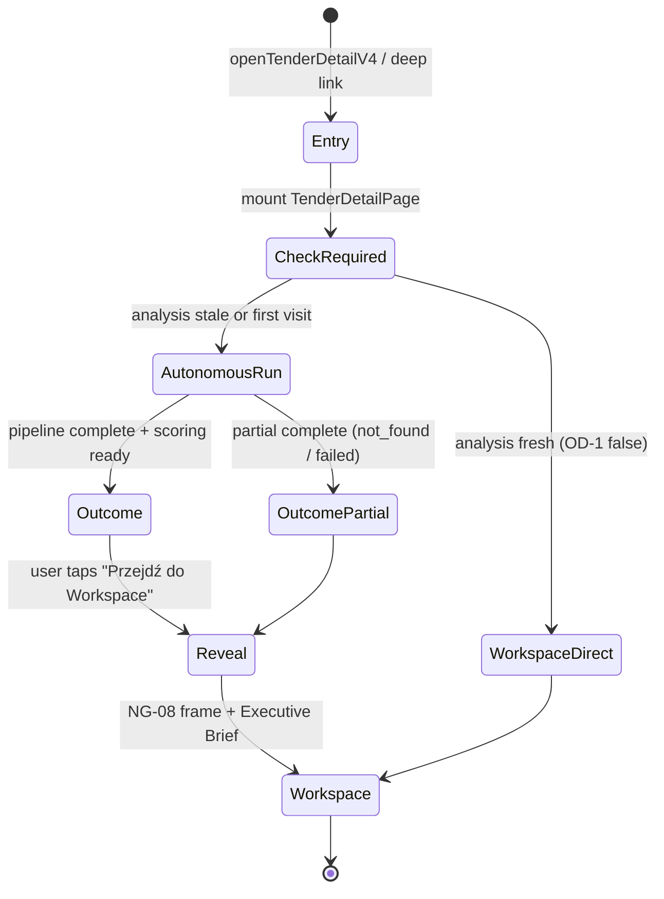

# NG-10 — Autonomous Tender Workspace · DESIGN FREEZE v1.0

> **Status:** **DESIGN FREEZE v1.0 — APPROVED FOR REVIEW**  
> **Data freeze:** 2026-07-10  
> **Bundle ID:** **NG-10**  
> **Class:** **FEATURE UI** (#CORE-013 · #CORE-014)  
> **Baseline prod:** UI **2.63.84** @ **`29f7842`**  
> **Audyt:** NG-10 AUDIT (2026-07-10) — **GO WITH CONDITIONS**  
> **Owner decisions:** R1–R7 zamknięte (ten dokument §0)  
> **IMPLEMENT:** **BLOCKED** do jawnego **Owner GO**

```text
WORKFLOW: AUDIT ✅ → DESIGN FREEZE ✅ (ten plik) → ARCH REVIEW ⏸ → OWNER GO ⛔ → IMPLEMENT ⛔
```

---

## 0. Owner Decisions (frozen)

| ID | Decyzja | Implementacja UX |
|----|---------|------------------|
| **OD-1** | Autonomous Run tylko przy **pierwszym wejściu** lub gdy **zmieniły się dane** (SWZ, przedmiar, kosztorys, dokumenty, wycena, analiza) | `deriveAutonomousRunRequired()` + fingerprint LS (§5) |
| **OD-2** | Podczas Run **Workspace całkowicie zablokowany** — zero tabów, paneli, dokumentów, kosztorysu | Full-screen gate; `TenderDetailCommandLayer` hidden |
| **OD-3** | Ekran AI = **autonomiczny agent**, nie loader — dynamiczne komunikaty zsynchronizowane z pipeline | `TenderAutonomousRunScreen` (§4) |
| **OD-4** | Szacowany czas orientacyjny, aktualizowany | `deriveAutonomousEtaSeconds()` (§6.4) |
| **OD-5** | Osiągnięcia pipeline w czasie rzeczywistym (checklist) | `AutonomousAchievement[]` (§6.3) |
| **OD-6** | Po zakończeniu: **ekran rekomendacji** → dopiero potem Reveal Workspace | `TenderAutonomousOutcomeScreen` (§4.3) |
| **OD-7** | Rekomendacja: 🟢 WARTO STARTOWAĆ / 🟡 WYMAGA DODATKOWEJ ANALIZY / 🔴 NIE WARTO STARTOWAĆ | Mapowanie z `overlay.displayDecision` (§7) |

---

## 1. North Star

```text
Użytkownik otwiera przetarg → (jeśli wymagane) pełnoekranowy Autonomous Agent
→ pipeline NG-02 działa w tle bez zmian runtime → ekran rekomendacji
→ płynny Reveal istniejącego NG-08 Workspace z Executive Brief.
```

**Nie budujemy nowego pipeline.** Budujemy **warstwę prezentacji FEATURE** nad `useTenderPipelineRuntime`.

### Principles (#NG10)

| ID | Zasada |
|----|--------|
| **#NG10-001** | **UI-only** — zero diff `useTenderPipelineRuntime`, parserów, scoringu, `cloud-sync.ts`, Edge. |
| **#NG10-002** | **SSOT FIRST** — sygnały z istniejących derive; nowy lib tylko `tender-autonomous-run-*.ts`. |
| **#NG10-003** | **REUSE FIRST** — `buildTenderIntelligenceContext`, `buildExecutiveSummary`, NG-08 frame post-reveal. |
| **#NG10-004** | **ZERO DUPLICATE LOGIC** — jeden `deriveAutonomousRunPhase()`; brak drugiego orchestratora. |
| **#NG10-005** | **MOBILE FIRST** — pełny ekran, touch 44px, `max-[430px]` density (M-03). |
| **#NG10-006** | **PRODUCTION FIRST** — happy path bez regresji NG-02 auto-run; gate payroll 16/16. |
| **#NG10-007** | **TOKEN FREEZE** — import-only `tender-ux-tokens.ts`; zero nowych exportów tokenów. |
| **#NG10-008** | **Tab URL SSOT frozen** — `parseTenderDetailPath` semantyka bez zmian; gate nie mutuje routingu. |
| **#NG10-009** | **One slice = one goal** — NG-10-03…06 sekwencyjnie (#CORE-013). |

---

## 2. Wireflow

### 2.1 Macro flow



### 2.2 Screen sequence (happy path)

```text
┌─────────────────────────────────────────────────────────────┐
│ S0 — Entry (niewidoczny)                                     │
│ TenderDetailPage mount → useTenderPipelineRuntime (unchanged)│
│ deriveAutonomousRunRequired() → true                         │
└──────────────────────────┬──────────────────────────────────┘
                           ▼
┌─────────────────────────────────────────────────────────────┐
│ S1 — Autonomous Agent Screen (full-screen, OD-2)             │
│ • Agent avatar / pulse                                       │
│ • Live message (1 aktywny)                                   │
│ • ETA chip 🕒                                                │
│ • Achievement checklist (rośnie)                             │
│ • Brak tabów / Command Layer / workspace                     │
└──────────────────────────┬──────────────────────────────────┘
                           │ pipeline + scoring ready
                           ▼
┌─────────────────────────────────────────────────────────────┐
│ S2 — Outcome / Recommendation Screen                         │
│ • 🟢/🟡/🔴 hero recommendation                              │
│ • 3–4 bullet uzasadnienia (pozytywne)                      │
│ • "Na co zwrócić uwagę" (blokery / ostrzeżenia)              │
│ • CTA: "Przejdź do Workspace" (min-h-11)                     │
└──────────────────────────┬──────────────────────────────────┘
                           │ tap CTA lub auto-reveal 2.5s (Owner opt-in later)
                           ▼
┌─────────────────────────────────────────────────────────────┐
│ S3 — Workspace Reveal (existing NG-08)                       │
│ • Fade-in Command Layer + tab bar                            │
│ • Tab `przetarg` — Executive Brief hero                      │
│ • Process Strip + intelligence hub                           │
└─────────────────────────────────────────────────────────────┘
```

### 2.3 Skip path (analysis fresh)

```text
Entry → deriveAutonomousRunRequired() === false
      → S3 bezpośrednio (zero S1/S2)
      → pipeline runtime nadal mount (NG-02 unchanged) — tylko UI gate skipped
```

### 2.4 Entry point unification (frozen)

| Entry | URL (unchanged) | Gate behavior |
|-------|-----------------|---------------|
| Lista → klik | `/przetargi/:id/przetarg` | CheckRequired |
| Pulpit alert | `/przetargi/:id/przetarg` | **Zmiana:** było `decyzja` → ujednolicone na `przetarg` (OD-2 spójność) |
| Strategia | `/przetargi/:id/przetarg` | CheckRequired |
| Deep link `dokumenty`/`kosztorys`/… | URL preserved | Jeśli Run required → **force S1** (ignore tab until Reveal); po Reveal → navigate to requested tab |
| Powrót w sesji (fresh) | any | Skip → S3 |

---

## 3. Makiety ekranów (ASCII)

### 3.1 S1 — Autonomous Agent (mobile-first)

```text
┌──────────────────────────────────────┐
│  ← Powrót do listy          (44px)   │  ← jedyny escape; confirm dialog
├──────────────────────────────────────┤
│                                      │
│            ◉  (pulse ring)           │  ← agent indicator, nie spinner
│         Analiza przetargu            │  TEUX_FONT_HEADLINE
│                                      │
│  ┌────────────────────────────────┐  │
│  │ Pobieram dokumenty…            │  │  ← live message (typewriter 40ms)
│  └────────────────────────────────┘  │
│                                      │
│  🕒 Szacowany czas: około 42 sek     │  TEUX_FONT_CAPTION, aktualizacja 1s
│                                      │
│  ─── Dotychczas ───                  │
│  ✓ Znaleziono 18 dokumentów         │  achievements (fade-in)
│  ✓ Wykryto SWZ                       │
│  ✓ Wykryto przedmiar                 │
│  ○ Rozpoznawanie zakresu robót…      │  pending (muted)
│                                      │
│                                      │
│  (brak tabów · brak dokumentów)      │
└──────────────────────────────────────┘
```

### 3.2 S1 — Desktop (≥1024px)

```text
┌────────────────────────────────────────────────────────────────┐
│  ← Powrót                                                        │
│                                                                  │
│     ┌─────────────────────┐    ┌─────────────────────────────┐ │
│     │      ◉ pulse        │    │ Live feed                    │ │
│     │  Analiza przetargu  │    │ • Pobieram dokumenty…       │ │
│     │                     │    │ • Znaleziono SWZ.           │ │
│     │ 🕒 ~42 sek          │    │ • Wykryto przedmiar.        │ │
│     └─────────────────────┘    │                             │ │
│                                 │ Achievements                 │ │
│                                 │ ✓ 18 dokumentów              │ │
│                                 │ ✓ SWZ · przedmiar            │ │
│                                 └─────────────────────────────┘ │
└────────────────────────────────────────────────────────────────┘
```

### 3.3 S2 — Outcome Screen

```text
┌──────────────────────────────────────┐
│                                      │
│         🟢 WARTO STARTOWAĆ           │  hero — TEUX_FONT_DISPLAY
│                                      │
│  ─── Dlaczego ───                    │
│  • Dokumentacja kompletna            │
│  • Ryzyko niskie                     │
│  • Szacowana marża wysoka            │
│  • Termin realny                     │
│                                      │
│  ─── Na co zwrócić uwagę ───         │
│  • Wadium wymaga potwierdzenia       │  z overlay.allBlocks / trust
│  • 2 pozycje bez ceny w katalogu     │
│                                      │
│  ┌────────────────────────────────┐  │
│  │     Przejdź do Workspace       │  │  min-h-11, primary
│  └────────────────────────────────┘  │
│                                      │
└──────────────────────────────────────┘
```

**Warianty hero:**

| `overlay.displayDecision` | Hero PL |
|---------------------------|---------|
| `GO` | 🟢 **WARTO STARTOWAĆ** |
| `HOLD` | 🟡 **WYMAGA DODATKOWEJ ANALIZY** |
| `NO-GO` | 🔴 **NIE WARTO STARTOWAĆ** |

---

## 4. Animacje i przejścia

### 4.1 S0 → S1 (Run start)

| Element | Animacja | Czas | Uwagi |
|---------|----------|------|-------|
| Workspace chrome | `opacity 1→0`, `pointer-events: none` | 200ms | Ukryj Command Layer + scroll root |
| Agent screen | `opacity 0→1`, `translateY(8px→0)` | 280ms ease-out | `prefers-reduced-motion`: instant |
| Pulse ring | CSS `animate-pulse` + scale 1.0→1.05 loop 2s | continuous | Zastąp spinner |

### 4.2 S1 — Live message

| Efekt | Spec |
|-------|------|
| Message swap | Crossfade 180ms; poprzedni message → achievement jeśli `terminal: true` |
| Typewriter | Opcjonalny 30–50ms/znak dla **aktywnego** komunikatu; achievements bez typewriter |
| Achievement row | `opacity 0→1`, `translateX(-4px→0)` 220ms; stagger 80ms |
| ETA | Licznik `tabular-nums`; zmiana wartości → brief highlight 300ms (`bg-primary/10`) |

### 4.3 S1 → S2 (Outcome reveal)

| Element | Animacja | Czas |
|---------|----------|------|
| Agent pulse | scale down + fade out | 250ms |
| Outcome hero | scale 0.96→1 + fade in | 350ms ease-out |
| Bullets | stagger fade-in 60ms | max 400ms total |
| Haptic (Capacitor) | `impact Light` | opcjonalnie mobile |

**Brak auto-skip S2** w v1.0 — użytkownik musi tap „Przejdź do Workspace” (Owner OD-6).

### 4.4 S2 → S3 (Workspace Reveal)

| Element | Animacja | Czas |
|---------|----------|------|
| Outcome screen | fade out | 200ms |
| NG-08 Command Layer | fade in + slide down 4px | 300ms |
| Executive Brief hero | fade in + `translateY(12px→0)` | 400ms delay 100ms |
| Process Strip | opacity 0→1 | 250ms delay 200ms |

**Scroll position:** top of scroll root po Reveal.

### 4.5 Reduced motion

Gdy `prefers-reduced-motion: reduce`: wszystkie transitions → 0ms; zachowaj zmiany treści bez animacji.

---

## 5. Analysis Freshness — kiedy uruchomić Autonomous Run

### 5.1 SSOT lib (nowy, pure)

```text
src/lib/tender-autonomous-run-fingerprint.ts
```

### 5.2 Fingerprint inputs (frozen)

| Pole fingerprint | Źródło SSOT | Wykrywa zmianę |
|------------------|-------------|----------------|
| `documents` | `countTenderAttachments(item)` + hash zestawu `bzpDocuments[].documentId` + `externalDocDiscovery.builtAt` | nowe/usunięte docs |
| `swz` | `item.swzAnalysis?.analyzedAt` lub hash kluczowych pól SWZ | analiza SWZ |
| `przedmiar` | `resolvedCostStatus(item)` + `classifyCostDocument` kind | przedmiar vs kosztorys |
| `kosztorys` | `tenderDossier.builtAt` + `parserVersion` + `kosztorys.ok` + `kosztorys.rowCount` | parse / rescan |
| `wycena` | `ownerFinanceProposal.computedAt` + `ourEstimatePln` + `pricingCatalogRevision` (context) | nowa wycena |
| `analiza` | `item.tenderFit?.assessedAt` + `changeMonitor.lastCheckedAt` + unseen events count | fit / monitor |

```typescript
// Pseudocode — DESIGN ONLY
function buildAutonomousRunFingerprint(
  item: TenderPipelineItem,
  ownerFinanceProposal: TenderBidProposal | null,
  pricingCatalogRevision: number,
): string;

function deriveAutonomousRunRequired(
  item: TenderPipelineItem,
  fingerprint: string,
  lastCompletedFingerprint: string | null, // LS
  pipelineState: PipelineState,
): boolean;
```

### 5.3 Reguły `deriveAutonomousRunRequired` (frozen)

```text
required = true  WHEN:
  lastCompletedFingerprint === null                    // pierwsze wejście (brak S2 complete w LS)
  OR fingerprint !== lastCompletedFingerprint        // dane się zmieniły
  OR isDossierParserStale(item.tenderDossier)        // reuse trust layer signal
  OR pipelineState === Failed                          // retry UX

required = false WHEN:
  fingerprint === lastCompletedFingerprint
  AND lastCompletedAt within session OR persisted LS
  AND pipelineState in { Ready, Idle } with scoring computable
```

### 5.4 Persistencja (UI-only, bez KV sync)

| Klucz LS | Zawartość |
|----------|-----------|
| `kw-tender-autonomous-run-v1:{tenderId}` | `{ fingerprint, completedAt, outcomeDecision }` |

**Zapis:** po zamknięciu S2 (tap CTA) — nie po S1.  
**Invalidacja:** fingerprint change → wymusza S1 przy następnym wejściu.

### 5.5 Integracja z NG-02 session guards

Autonomous Run **nie zastępuje** `discoveryCompletedIds` / `pipelineBootstrapCompletedIds`.  
Gate UI jest ortogonalny — runtime auto-run działa jak dziś; gate tylko **ukrywa** workspace.

---

## 6. Completion Gate i mapowanie sygnałów

### 6.1 Completion Gate (S1 → S2)

```text
autonomousPipelineComplete =
  pipelineState === PipelineState.Ready
  OR (pipelineState === PipelineState.Failed AND scoring computable)
  OR (pipelineState === PipelineState.Idle
      AND isDocumentDiscoverySettled(item)
      AND !autoRunning AND !dossierBuilding AND !dossierSaving)

autonomousScoringReady =
  intelligenceCtx !== null
  AND intelligenceCtx.scoringBundle !== null
  AND intelligenceCtx.overlay !== null

S1 → S2 when:
  autonomousPipelineComplete
  AND autonomousScoringReady
  AND minDisplayMs elapsed (3000ms — anti-flash)
```

**Partial mode** (0 docs / kosztorys not_found):

```text
S1 → S2 allowed with:
  overlay.displayDecision in { HOLD, NO-GO }
  AND trustAssessment.overall !== 'unknown'
min achievements: dokumenty step settled (even 0)
```

### 6.2 Phase model — `AutonomousRunPhaseId`

```text
doc_fetch → doc_found → swz_found → boq_detect → doc_analyze →
scope_infer → dossier_build → labor_calc → material_calc →
risk_assess → profitability → recommendation_prep → complete
```

Mapowanie **prezentacyjne** — nie nowa maszyna runtime. Jeden `deriveAutonomousRunPhase()` w:

```text
src/lib/tender-autonomous-run-phase.ts
```

### 6.3 Live messages + achievements — tabela sygnałów

| Faza UX | Live message (PL) | Achievement (po zakończeniu fazy) | Sygnał SSOT | Warunek aktywacji |
|---------|-------------------|-----------------------------------|-------------|-------------------|
| `doc_fetch` | Pobieram dokumenty… | ✓ Znaleziono {n} dokumentów | `countTenderAttachments`, `autoRunning` | `PipelineState.Notice\|Discovery` lub `autoRunning` |
| `doc_found` | Przeszukuję źródła dokumentów… | (włączone w licznik docs) | `isDocumentDiscoverySettled` | docs > 0 |
| `swz_found` | Znaleziono SWZ. | ✓ Wykryto SWZ | `item.swzAnalysis` != null | SWZ ready row |
| `boq_detect` | Szukam przedmiaru lub kosztorysu… | ✓ Wykryto przedmiar / ✓ Wykryto kosztorys | `resolvedCostStatus`, `classifyCostDocument` | cost status ≠ NOT_FOUND (partial) |
| `doc_analyze` | Analizuję dokumentację. | ✓ Przeanalizowano dokumentację | `buildTenderAnalysisStatusRows` notice+docs = ready | both ready |
| `scope_infer` | Rozpoznaję zakres robót. | ✓ Rozpoznano {n} pozycji | `item.tenderDossier?.kosztorys?.rowCount` lub `executive.mainWorks.length` | rowCount > 0 OR mainWorks > 0 |
| `dossier_build` | Buduję kosztorys. | ✓ Kosztorys gotowy | `tenderDossierHeavyParseDone` | heavy done |
| `labor_calc` | Wyliczam robociznę. | ✓ Obliczono koszt robocizny | `ownerFinanceProposal.costStack` linia z „robocizn” lub `costPricePln` + labor portion | `ownerFinanceProposal.ok` |
| `material_calc` | Wyliczam materiały. | ✓ Obliczono koszt materiałów | `costStack` linia materiały | j.w. |
| `risk_assess` | Analizuję ryzyko. | ✓ Wykryto {n} ryzyka | `overlay.allBlocks.length` + trust dims severity warn/error | blocks > 0 OR trust warns > 0 |
| `profitability` | Oceniam opłacalność. | ✓ Marża: {pct}% | `OwnerFinanceView.marginPct`, `hasReadyTenderMargin` | margin ready |
| `recommendation_prep` | Przygotowuję rekomendację. | — | `overlay.displayDecision` computed | scoring ready |
| `complete` | (transition to S2) | — | Completion Gate | §6.1 |

**Fallback messages** (gdy faza trwa > ETA/3):

```text
"Nadal pracuję — to może chwilę potrwać."
"Sprawdzam kolejne załączniki."
"Doprecyzowuję wyniki analizy."
```

Reuse rotating copy z `TENDER_OWNER_OPERATOR_COPY` gdzie możliwe.

### 6.4 ETA — `deriveAutonomousEtaSeconds`

**Orientacyjny** — nie gwarantowany SLA.

| Stan pipeline | Bazowy ETA (sek) |
|---------------|------------------|
| Notice/Discovery | 45 |
| External running | 60 |
| Heavy (dossier building) | 35 + min(30, rowCount/20) |
| Pricing | 15 |
| Scoring only | 5 |

```text
etaSeconds = sum(active phase bases) - elapsedSinceRunStart
etaSeconds = max(8, min(etaSeconds, 120))
update: every 1000ms + on phase transition
display: "około {etaSeconds} sekund" (PL plural rules)
```

Źródło elapsed: `runStartedAt` w stanie UI (`TenderDetailPage` useRef).

---

## 7. Outcome Screen — treść (reuse SSOT)

### 7.1 Hero recommendation

| Source | Field |
|--------|-------|
| Decision | `intelligenceCtx.overlay.displayDecision` |
| Label | mapowanie §3.3 (nie `DECISION_LABEL_PL` — Owner copy) |

### 7.2 Sekcja „Dlaczego” (pozytywne bullets)

**SSOT:** `deriveAutonomousOutcomePositives(intelligenceCtx)` — pure, max 4.

| Priorytet | Sygnał | Przykładowy bullet |
|-----------|--------|-------------------|
| 1 | `countTenderAttachments > 0` + docs settled | Dokumentacja kompletna |
| 2 | `overlay.allBlocks.length === 0` + fit.score ≥ 65 | Ryzyko niskie |
| 3 | `hasReadyTenderMargin` + margin ≥ 15% | Szacowana marża wysoka |
| 4 | `daysUntilTenderDeadline` ≥ 7 | Termin realny |
| 5 | `overlay.confidence === 'high'` | Wysoka pewność analizy |

Fallback: `filterPositiveReasons(topDecisionReasons(bundle))` — reuse z overlay.

### 7.3 Sekcja „Na co zwrócić uwagę”

**SSOT:** `deriveAutonomousOutcomeWatchouts(intelligenceCtx)` — max 5.

| Priorytet | Sygnał |
|-----------|--------|
| 1 | `overlay.allBlocks` → `message` |
| 2 | `overlay.heroBlocks` |
| 3 | `trustAssessment` dimensions severity warn/error → `messagePl` |
| 4 | `ownerFinanceProposal.warnings` |
| 5 | `bidPrepChecks` failed items |

### 7.4 CTA

| Label | Akcja |
|-------|-------|
| Przejdź do Workspace | `setAutonomousPhase('revealed')` + zapis fingerprint LS + Reveal anim §4.4 |

---

## 8. Reveal — kryteria i stan końcowy

### 8.1 Reveal triggers

| Trigger | v1.0 |
|---------|------|
| Tap „Przejdź do Workspace” | **TAK** (primary) |
| Auto-reveal timer | **NIE** (defer v1.1) |
| Back button z S2 | Powrót do listy (confirm) — **nie** Reveal |

### 8.2 Stan po Reveal

| Element | Zachowanie |
|---------|------------|
| `TenderDetailCommandLayer` | visible — pełny NG-08 frame |
| Domyślny tab | `przetarg` (chyba że deep link §2.4 → navigate po Reveal) |
| Executive Brief | `TenderPrzetargWorkspace` hero — `buildPrzetargExecutiveBundle` |
| Intelligence hub | `id="tender-intelligence-hub"` scroll target optional |
| Pipeline runtime | kontynuuje w tle (rescan) — bez zmian |
| Primary CTA | `TenderWorkflowPrimaryAction` — standard NG-08 |

### 8.3 UX KPI (frozen)

| ID | KPI | Target |
|----|-----|--------|
| **KPI-NG10-01** | Fresh analysis → Workspace bez gate | **0** dodatkowych klików |
| **KPI-NG10-02** | Stale analysis → Outcome → Workspace | **≤1** klik (CTA) |
| **KPI-NG10-03** | Gate nie pokazuje tabów/paneli | **0** leaks (grep + manual) |
| **KPI-NG10-04** | Mobile touch targets | **≥44px** (M-03) |
| **KPI-NG10-05** | Payroll gate regresja | **16/16** |

---

## 9. Architektura komponentów

### 9.1 Nowe pliki (allowlista)

| Plik | Klasa | Rola |
|------|-------|------|
| `src/lib/tender-autonomous-run-fingerprint.ts` | FEATURE lib | Fingerprint + `deriveAutonomousRunRequired` |
| `src/lib/tender-autonomous-run-phase.ts` | FEATURE lib | Phase + messages + achievements + ETA |
| `src/lib/tender-autonomous-run-outcome.ts` | FEATURE lib | Positives + watchouts derive |
| `src/lib/tender-autonomous-run-ux.ts` | FEATURE lib | Copy PL, labels, constants |
| `src/app/tenders/autonomous/TenderAutonomousRunScreen.tsx` | FEATURE UI | S1 full-screen |
| `src/app/tenders/autonomous/TenderAutonomousOutcomeScreen.tsx` | FEATURE UI | S2 recommendation |
| `src/app/tenders/autonomous/TenderAutonomousGate.tsx` | FEATURE UI | Orchestrator S1/S2 vs children |
| `scripts/test-tender-autonomous-run-phase.mjs` | test | LIB-NG10-01 |

### 9.2 Modyfikacje (allowlista)

| Plik | Zmiana |
|------|--------|
| `src/app/TenderDetailPage.tsx` | Wrap content w `TenderAutonomousGate`; ukryj chrome gdy gate active |
| `src/app/App.tsx` | `openTenderById` → tab `przetarg` zamiast `decyzja` |
| `src/lib/tender-detail-nav.ts` | (opcjonalnie) dokumentacja default tab |

### 9.3 Off limits (zero diff)

- `useTenderPipelineRuntime.ts`
- `useTenderDocumentsBootstrap.ts`
- `useTenderDossierHeavyLazy.ts`
- `useTenderPricingAuto.ts`
- `tender-dossier-pipeline.ts`
- `tender-full-document-discovery.ts`
- `tenders-strategy-decision.ts`
- `tender-intelligence-overlay.ts` (algorytmy)
- `cloud-sync.ts` · Edge · payroll
- `tender-ux-tokens.ts` (nowe exporty)

---

## 10. Slice Plan NG-10-03…06

### NG-10-03 — Autonomous Run lib + tests

| Pole | Wartość |
|------|---------|
| **Cel** | Pure derive: fingerprint, phase, ETA, achievements |
| **Klasa** | FEATURE lib |
| **Pliki** | `tender-autonomous-run-*.ts` (4 pliki) · `test-tender-autonomous-run-phase.mjs` |
| **Test** | LIB-NG10-01 ≥ 40 cases (phase transitions, fingerprint, ETA bounds) |
| **Gate** | `test:infra --scope tenders` · payroll 16/16 |

### NG-10-04 — Autonomous Agent Screen (S1)

| Pole | Wartość |
|------|---------|
| **Cel** | Full-screen S1 + hard workspace block |
| **Klasa** | FEATURE UI |
| **Pliki** | `TenderAutonomousRunScreen.tsx` · `TenderAutonomousGate.tsx` · `TenderDetailPage.tsx` (wire) |
| **DoD** | KPI-NG10-03 PASS · mobile 44px · reduced motion |
| **Gate** | `test-tender-pipeline-automation-p0.mjs` · E2E smoke |

### NG-10-05 — Outcome Screen + Reveal (S2→S3)

| Pole | Wartość |
|------|---------|
| **Cel** | Recommendation screen + Reveal animation + LS persist |
| **Klasa** | FEATURE UI |
| **Pliki** | `TenderAutonomousOutcomeScreen.tsx` · Gate update · `App.tsx` entry fix |
| **DoD** | KPI-NG10-02 · hero 3 variants · Executive Brief visible post-reveal |
| **Gate** | Gate B tenders + payroll |

### NG-10-06 — Closeout & Polish

| Pole | Wartość |
|------|---------|
| **Cel** | Docs closeout · changelog · owner smoke checklist |
| **Klasa** | docs + test manifest |
| **Pliki** | `NG-10-CLOSEOUT.md` · `CURRENT-TASK.md` · `CHANGELOG` |
| **DoD** | Wszystkie KPI-NG10 · PRODUCTION VERIFIED |

**Kolejność obowiązkowa:** 03 → 04 → 05 → 06. Jeden commit per slice.

---

## 11. Boundary (#CORE-013 / #CORE-014)

| Check | Werdykt |
|-------|---------|
| Mixed CORE+FEATURE w jednym commicie | **BLOCKED** — lib oddzielnie od UI |
| Protected Core diff | **ZERO** |
| Nowe pole KV / sync | **ZERO** |
| Scoring algorithm change | **ZERO** |
| Parser / discovery change | **ZERO** |
| TOKEN FREEZE | **PASS** — import-only tokens |

---

## 12. Test plan (IMPLEMENT)

```bash
# NG-10-03
npx vite-node scripts/test-tender-autonomous-run-phase.mjs

# Regresja pipeline (każdy slice)
npx vite-node scripts/test-tender-pipeline-automation-p0.mjs
npx vite-node scripts/test-tender-kosztorys-process-phase.mjs
npx vite-node scripts/test-unified-attachment-gate.mjs
npm run test:infra -- --gate B --scope tenders
npm run test:infra -- --gate B --scope payroll
```

**Manual smoke (owner):**

1. Fresh tender → S1 → S2 → Reveal → Executive Brief visible  
2. Re-enter same tender → skip S1 → direct Workspace  
3. Odśwież BZP (new doc) → S1 forced  
4. 0 documents tender → S2 partial HOLD/NO-GO  
5. Mobile 430px — full screen, back confirm  
6. Deep link `/dokumenty` stale → S1 → Reveal → lands on `dokumenty`

---

## 13. Risks (frozen — nie blokuje freeze)

| Risk | Mitigacja |
|------|-----------|
| Flash S1 (<3s) na cached analysis | `minDisplayMs` 3000 + skip path |
| ETA niedokładny | Copy „około” + clamp 8–120s |
| Power user frustracja (gate) | Skip gdy fresh fingerprint |
| Deep link tab confusion | Post-reveal navigate |
| `costStack` bez jawnych linii robocizna/materiały | Fallback achievement z `costPricePln` aggregate |

---

## 14. Final Decision

| Pole | Wartość |
|------|---------|
| **DESIGN FREEZE v1.0** | **COMPLETE** |
| **ARCH REVIEW** | **COMPLETE** (NG-10-06 AUDIT 2026-07-10) |
| **OWNER GO IMPLEMENT** | **CLOSED** (slices 03–06) |
| **Epic status** | **COMPLETE** — SSOT [`NG-10-CLOSEOUT.md`](NG-10-CLOSEOUT.md) |

---

*SSOT NG-10 Design Freeze v1.0 · Baseline prod: **2.63.84** @ **29f7842** · AUDIT + Owner decisions incorporated.*
