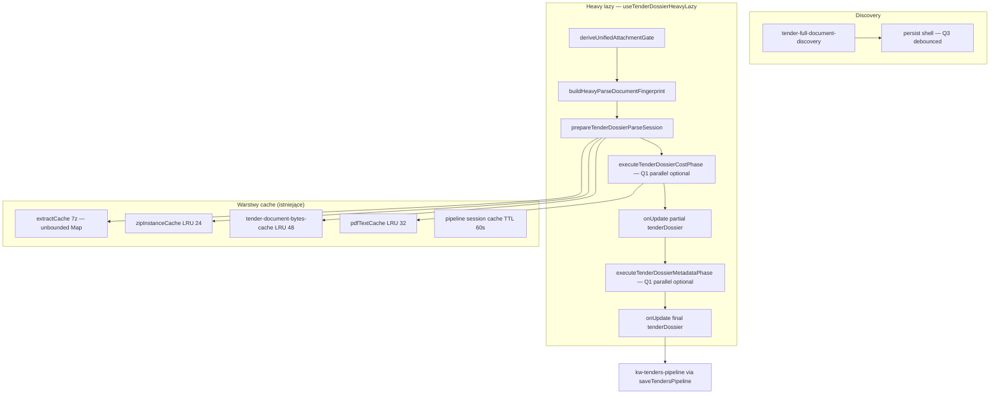

# NG11-A2 — Dossier Artifact Cache · AUDIT + PLAN

| Pole | Wartość |
|------|---------|
| **Program** | NG11-TENDER-PIPELINE-PERFORMANCE |
| **Slice** | **NG11-A2** |
| **Tryb** | **AUDIT → PLAN → DESIGN FREEZE → ARCH REVIEW** (ARCHITECTURE ONLY) |
| **Status** | **IMPLEMENTED** · **Owner GO APPROVED** · **RELEASE NOT READY** (awaiting OWNER QA) |
| **Data** | 2026-07-11 |
| **Baseline prod** | **2.63.98** @ **`608c9ec`** · NG11-Q2 **PRODUCTION VERIFIED** |
| **Zależności** | **NG11-Q2** ✅ · **NG11-Q1** ✅ · **NG11-Q3** ✅ · **NG11-A1** ✅ · **NG11-Q5** ✅ |
| **SSOT programu** | [`NG11-PIPELINE-PERFORMANCE-DESIGN-FREEZE.md`](./NG11-PIPELINE-PERFORMANCE-DESIGN-FREEZE.md) § A2 · §10 · §20.1 · #NG11-007 |

---

## Werdykt skrócony

| Obszar | Werdykt |
|--------|---------|
| **AUDIT** | **PASS WITH CONDITIONS** — warstwy bytes/pdf/zip/7z istnieją; brak cache wyniku heavy parse; fingerprint + `parserVersion` gotowe |
| **PLAN** | **READY** — session Map MVP · flag OFF · skip parse przy hit · serial merge/persist bez zmian |
| **DESIGN FREEZE A2** | **DRAFT READY** — klucz `fingerprint|parserVersion|phase` · eviction LRU+cap · ADR przed KV |
| **ARCH REVIEW** | **PENDING** (ten dokument = input) |
| **Owner GO (IMPLEMENT)** | **APPROVED** |

---

# CZĘŚĆ I — AUDIT REPORT

## 1. Obecny lifecycle artefaktów (as-is prod 2.63.98)

### 1.1 Diagram — od discovery do dossier w KV



### 1.2 Kluczowe pliki

| Warstwa | Plik | Rola |
|---------|------|------|
| **Entry heavy** | `useTenderDossierHeavyLazy.ts` | Gate · fingerprint · cost/metadata split (A1) |
| **Gate + fingerprint** | `unified-attachment-gate.ts` | `buildHeavyParseDocumentFingerprint` · `deriveUnifiedAttachmentGate` |
| **Parse SSOT** | `tender-document-resolver.ts` | `prepareTenderDossierParseSession` · cost/meta loops |
| **Dossier build** | `tender-dossier-pipeline.ts` | `buildTenderDossierCostPhase` · `enrichTenderDossierMetadataPhase` |
| **Parser version** | `tender-dossier-parser-version.ts` | `CURRENT_PARSER_VERSION=4` · `isDossierParserStale` |
| **Bytes cache** | `tender-document-bytes-cache.ts` | LRU 48 · base64 w pamięci |
| **Bytes prefetch** | `tender-document-bytes-prefetch.ts` | ×4 parallel (Q2 upstream) |
| **Doc parse caches** | `tenders-bzp-doc-parse.ts` | ZIP instance 24 · PDF text 32 |
| **7Z extract** | `wgdom-7z-archive.ts` | `extractCache` per archive fingerprint |
| **Pipeline session** | `tenders-pipeline-session-cache.ts` | items TTL 60s — **nie** parse artifacts |
| **Persist Q3** | `tender-pipeline-persist-coalesce.ts` | debounce cloud · LS sync natychmiast |
| **Runtime** | `useTenderPipelineRuntime.ts` | sygnały readiness — **`dossierArtifactHit` BRAK** |

### 1.3 Co jest „artefaktem” dziś

| Artefakt | Gdzie trwa | Invalidacja |
|----------|------------|-------------|
| **Raw bytes załącznika** | `tender-document-bytes-cache` (session Map) | LRU 48 · reload strony |
| **JSZip instance** | `zipInstanceCache` | LRU 24 · `bytesFingerprint` |
| **PDF extracted text** | `pdfTextCache` (Promise) | LRU 32 |
| **7Z extracted files** | `extractCache` (Map per archive) | **Brak eviction** · tylko reload |
| **TenderDossier (kosztorys + scanSummary)** | `item.tenderDossier` w `kw-tenders-pipeline` | `parserVersion` · fingerprint change · manual rescan |
| **Parse session (ephemeral)** | `TenderDossierParseSession` in-memory per run | Koniec run / retry |

**Luka A2:** brak cache **wyniku** faz cost/metadata (`TenderDossierParseSession` snapshot lub `TenderDossierAnalysisResult`) keyed by fingerprint — każdy retry/re-entry z `!tenderDossierHeavyParseDone` ponownie wykonuje P8–P11.

---

## 2. Cache hit / miss (as-is)

| Warstwa | Klucz | Hit path | Miss path |
|---------|-------|----------|-----------|
| **Bytes** | `tenderId\|index\|downloadUrl\|sourcePageUrl` | `fetchTenderDocumentBytes` → return cached base64 | Edge `tenders-bzp-document-bytes` |
| **Prefetch** | filter via `filterBytesPrefetchTodo` | skip fetch | `loadDocBytes` → sets bytes cache |
| **ZIP WASM** | `bytesFingerprint` (24B hash + len) | `loadZipCached` reuse Promise | `JSZip.loadAsync` |
| **PDF text** | `bytesFingerprint` | `extractPdfText` reuse Promise | pdf.js full extract |
| **7Z extract** | `bytesFingerprint` archive | `extractAll7zFiles` Map hit | WASM extract + walk FS |
| **Heavy parse result** | — | **ZAWSZE MISS** (brak warstwy) | full `prepareTenderDossierParseSession` → cost → meta |
| **Gate skip** | `tenderDossierHeavyParseDone` | early return w heavy lazy | start build |
| **Parser stale** | `parserVersion !== CURRENT` | `isDossierParserStale` → wymusza rebuild | pick existing kosztorys |

### 2.1 Fingerprint SSOT (gotowy pod A2)

```138:145:src/lib/tender-pipeline/unified-attachment-gate.ts
export function buildHeavyParseDocumentFingerprint(item: TenderPipelineItem): string {
  const refs = buildHeavyParseAttachmentRefs(item);
  const parts = refs.map((r) => `${r.origin}:${r.id}:${r.filename}`);
  const upload = item.uploadedFile
    ? `${AttachmentOrigin.Upload}:${item.uploadedFile.id}:${item.uploadedFile.filename}`
    : "";
  return [parts.join("|"), upload, item.tenderId ?? "", String(item.tenderDossier?.parserVersion ?? "")].join(";");
}
```

**Uwaga audytu A2-A1:** fingerprint zawiera **`item.tenderDossier?.parserVersion`** — po pierwszym partial persist klucz cache może się zmienić. Plan A2 musi użyć **`CURRENT_PARSER_VERSION`** w kluczu cache (nie wartości z dossier pre-stamp) lub normalizować klucz przed/po stamp.

---

## 3. Invalidation strategy (as-is + plan A2)

| Trigger | Bytes/PDF/ZIP | Dossier KV | Plan A2 artifact |
|---------|---------------|------------|------------------|
| `CURRENT_PARSER_VERSION` bump | miss (inne bytes parse) | `isDossierParserStale` | **invalidate all keys z old version** |
| Zmiana listy załączników | miss (inne index/url) | fingerprint change | **miss** |
| `retryDossierParse()` | **bez zmiany** bytes cache | dossier nadpisywany po parse | **hit możliwy** — główny use-case A2 |
| `invalidatePipelineSessionCache` | nie dotyka bytes | items refresh | **nie dotyka** artifact (osobna pula) |
| Page reload | wszystkie Map czyszczone | LS/KV hydrate | artifact session cleared |
| Flaga OFF | N/A | N/A | serial path (today) |

**#NG11-007 frozen:** invalidacja = **`parserVersion` + `buildHeavyParseDocumentFingerprint`**.

---

## 4. Memory footprint

| Warstwa | Cap | Szacunek RAM (worst) | Ryzyko |
|---------|-----|----------------------|--------|
| **Bytes cache** | 48 entries | 48 × ~2–8 MB base64 (duże ZIP) | **HIGH** — już produkcyjne |
| **ZIP instance** | 24 | 24 × archive WASM | **HIGH** |
| **PDF text** | 32 | 32 × ~1–5 MB string | **MEDIUM** |
| **7Z extractCache** | **∞** | N archiwów × inner files | **HIGH** — pre-existing; **nie dotykać w A2** |
| **TenderDossierParseSession** | 1/run | kosztorys rows cap 500 + SWZ | baseline parse |
| **A2 artifact (plan)** | **cap 8–16** (draft) | 16 × ~session snapshot | **MEDIUM** — wymaga cap + LRU |

**RF-A2-01:** A2 MVP **session-only** Map — **bez** KV `kw-tender-dossier-artifacts` do ADR + Owner GO.

**RF-A2-02:** Eviction **LRU + max entries** (propozycja **12**) + opcjonalny **max serialized KB** per entry (soft guard).

---

## 5. Storage lifecycle

| Store | Lifetime | Sync | A2 scope |
|-------|----------|------|----------|
| `tender-document-bytes-cache` | Tab session | Brak | read-only reuse |
| `kw-tenders-pipeline` | Trwały | `persistKey` (Q3 debounced) | output artifact cache → nadal persist po hit |
| `kw-tender-dossier-artifacts` | **NIE ISTNIEJE** | — | **OUT OF SCOPE MVP** · ADR required |
| LS telemetry | `wgdom-dossier-parse-telemetry` ring 50 | local only | bez zmian |
| F0 timing ring | per `itemId` DEV | optional | nowy stage `heavy.artifact_cache_hit` |

**Zasada A2:** cache **nie zastępuje** `tenderDossier` w KV — przy hit **hydrate** → `onUpdate` → Q3 persist (jak po parse).

---

## 6. Telemetry impact

| Element | As-is | Po A2 (plan) |
|---------|-------|--------------|
| `tender-pipeline-timing.ts` stages | P8–P11 mierzone zawsze | hit → stage `heavy.artifact_cache` ~0ms · miss → unchanged |
| `dossierArtifactHit` runtime signal | **BRAK** | **NOWY** w `useTenderPipelineRuntime` (DF §2.2) |
| `logDossierParseErrorTelemetry` | błędy parse | bez zmian |
| F0 PG gates | P50 per stage | nowy baseline: % hit rate DEV |
| NG10 autonomous fingerprint | `isDossierParserStale` | bez zmian — cache nie omija stale guard |

**Warunek:** telemetry **nie** może raportować hit gdy wynik różni się od świeżego parse (test determinism).

---

## 7. Interaction z A1 / Q1 / Q2 / Q3

| Slice | Interakcja A2 | Werdykt |
|-------|---------------|---------|
| **A1** progressive heavy | Hit może zwrócić **cost phase complete** snapshot → nadal wymaga partial `onUpdate` + metadata path jeśli tylko cost cached | **COMPAT** z warunkiem phase-key |
| **Q5** cost-first | Wcześniejszy `partialDossierReady` przy hit cost cache | **POŻĄDANE** — align z North Star |
| **Q1** parse concurrency | Przy full session hit — **pomija** `runCostParseLoop`/`runMetadataParseLoop` | **COMPAT** |
| **Q2** unpack parallel | Przy hit przed `prepareTenderDossierParseSession` — **pomija** P8 | **COMPAT** — największy zysk |
| **Q3** debounced persist | Hit → `onUpdate` → ten sam coalesce path | **COMPAT** |
| **NG10** gate-exit | Wcześniejszy dossier complete → wcześniejszy timeline | **BENEFIT** · gate-exit 28/28 regresja wymagana |

**A2-A2:** Cache **per phase** (cost / full) bezpieczniejsze niż monolith — cost hit + metadata miss zachowuje A1 semantykę.

---

## 8. Race conditions

| ID | Scenariusz | Severity | Mitigacja (plan) |
|----|------------|----------|------------------|
| **A2-R1** | Dwa równoległe heavy run na ten sam `itemId` | P1 | Istniejący `dossierInflightIds` — **nie startuj drugi** |
| **A2-R2** | Tab A cache write / Tab B cache read | P2 | Session Map per tab — **brak cross-tab** w MVP |
| **A2-R3** | Q1 workers + cache store równolegle | P2 | Store **po** serial merge w resolver — workers tylko read-only |
| **A2-R4** | Hit stale mimo fingerprint match (zmiana URL bez zmiany filename) | P1 | Klucz musi zawierać **downloadUrl** w refs (już w fingerprint przez `id`) — zweryfikować `mapBzpRef` |
| **A2-R5** | Partial persist zmienia `parserVersion` w fingerprint mid-run | P1 | Klucz cache: `buildHeavyParseDocumentFingerprint` **z normalizacją** `parserVersion=CURRENT` |
| **A2-R6** | Cache hit omija `isDossierParserStale` | P0 | **ZAKAZ** — jeśli `isDossierParserStale(dossier)` → **force miss** |
| **A2-R7** | Q3 debounce — hit podczas inflight persist | P2 | Serial on `onUpdate` per item — reuse A1 `pendingPartialSaveRef` semantics |

---

## 9. Rollback strategy

| Mechanizm | Opis |
|-----------|------|
| **Flaga** | `pipelinePerfArtifactCache` default **OFF** (DF §20.1) |
| **Super Admin** | Toggle w ⚙ — bez redeploy |
| **Serial fallback** | Flaga OFF → obecna ścieżka bez `getArtifactCache` |
| **Krytyczny stale hit** | Wyłącz A2 · ewentualnie Q1+Q2 (DF §20.2 OOM playbook) |
| **KV path** | **Nie w MVP** — rollback = flag OFF only |

---

## 10. Cache eviction (plan)

| Polityka | Wartość frozen (draft) |
|----------|------------------------|
| **Scope** | Session `Map` module-scope |
| **Max entries** | **12** tenders (propozycja) |
| **Eviction** | LRU po `lastAccessAt` |
| **Key** | `${tenderId}:${fingerprintNorm}:${parserVersion}:cost\|full` |
| **Value** | Immutable snapshot `ArtifactCacheEntry` (kosztorys + scanSummary partial/full) |
| **Clear all** | `clearDossierArtifactCacheForTests()` · opcjonalnie hook przy `invalidatePipelineSessionCache` — **NIE** auto (różne domeny) |

---

## 11. Compatibility z pipeline runtime

| Check | Werdykt |
|-------|---------|
| `deriveUnifiedAttachmentGate` / `HeavyDone` | **PASS** — hit tylko gdy `!tenderDossierHeavyParseDone` |
| `derivePipelineState` / `derivePipelineReadiness` | **PASS** — `dossierArtifactHit` additive; nie zmienia enum |
| `useTenderPricingAuto` | **CONDITIONAL** — partial hit musi ustawić `kosztorys.ok` przed pricing trigger |
| `tenderDossierHeavyParseDone` predicate | **PASS** — bez zmiany |
| NG10 `deriveAutonomousRunPhase` | **PASS** — benefit only |
| `cloud-sync.ts` / Payroll | **NIE DOTYKANE** |

---

## 12. Audit findings summary

| ID | Severity | Opis |
|----|----------|------|
| **A2-A1** | P0 | Brak warstwy artifact cache — każdy retry = pełny P8–P11 |
| **A2-A2** | P0 | `dossierArtifactHit` + `pipelinePerfArtifactCache` **nie zaimplementowane** |
| **A2-A3** | P1 | Fingerprint zawiera mutable `tenderDossier.parserVersion` — ryzyko key churn |
| **A2-A4** | P1 | `isDossierParserStale` musi force miss — guard obowiązkowy |
| **A2-A5** | P1 | `extractCache` 7z unbounded — pre-existing memory risk (informacyjnie) |
| **A2-A6** | P2 | KV `kw-tender-dossier-artifacts` wymaga **ADR** przed jakimkolwiek persist cache |
| **A2-A7** | P2 | Phase-split cache (cost vs full) zalecane dla A1+Q5 kompatybilności |
| **A2-A8** | P3 | Pre-existing test FAIL (3) — poza scope A2 |

---

# CZĘŚĆ II — PLAN (IMPLEMENT — po Owner GO)

## 14. Mechanizm (frozen draft)

| # | Zasada |
|---|--------|
| **Z1** | Nowy moduł `tender-dossier-artifact-cache.ts` (session Map) |
| **Z2** | Klucz: `normalizeFingerprint(item)` + `CURRENT_PARSER_VERSION` + `phase` |
| **Z3** | **Nie** zmieniać parserów · bytes cache · `wgdom-7z-archive.ts` |
| **Z4** | Worker/store → **immutable** `ArtifactCacheEntry` |
| **Z5** | Hit → hydrate session / dossier → serial `onUpdate` → Q3 persist |
| **Z6** | Flaga `pipelinePerfArtifactCache` default **OFF** |
| **Z7** | `isDossierParserStale` → **force miss** |
| **Z8** | Store miss po successful cost/full phase (hook w resolver lub dossier-pipeline) |

### 14.1 Proponowany moduł

```text
src/lib/tender-pipeline/tender-dossier-artifact-cache.ts

DOSSIER_ARTIFACT_CACHE_MAX = 12
buildArtifactCacheKey(item, phase: 'cost' | 'full'): string
getDossierArtifactCached(key): ArtifactCacheEntry | null
setDossierArtifactCached(key, entry): void  // LRU eviction
isPipelineArtifactCacheEnabled(): boolean    // flag + test override
```

**Integracja (allowlist draft):**

| Plik | Zmiana |
|------|--------|
| `tender-dossier-pipeline.ts` lub `tender-document-resolver.ts` | lookup/store w `buildTenderDossierCostPhase` / po metadata |
| `useTenderDossierHeavyLazy.ts` | expose `dossierArtifactHit` telemetry |
| `app-settings.ts` | `pipelinePerfArtifactCache` |
| `AdminSettingsModal.tsx` | checkbox Super Admin |
| `derive-pipeline-readiness.ts` | opcjonalnie sygnał hit (read-only) |

**NIE w allowlist:** `cloud-sync.ts` · `App.tsx` CORE · Edge · NG10 gate · parsery.

### 14.2 Etapy slice

| Etap | Zakres | DoD |
|------|--------|-----|
| **A2-0** | Flaga + AdminSettings | test flag read |
| **A2-1** | Moduł cache + LRU + key normalize | test determinism |
| **A2-2** | Cost phase hit/miss wire | regresja A1/Q5 |
| **A2-3** | Full phase hit/miss wire | regresja dossier pipeline |
| **A2-4** | `test-ng11-artifact-cache.mjs` | PG-A2 harness |
| **A2-5** | CHANGELOG + ARCHITECTURE §12.1.35 | release docs |

### 14.3 Test plan

| Test | Cel |
|------|-----|
| `test-ng11-artifact-cache.mjs` | hit/miss · stale guard · LRU · flag OFF |
| `test-ng11-a1-progressive-heavy.mjs` | Regresja A1 |
| `test-ng11-cost-first-pricing.mjs` | Regresja Q5 |
| `test-ng11-parse-concurrency.mjs` | Regresja Q1 |
| `test-ng11-unpack-parallel.mjs` | Regresja Q2 |
| `test-ng11-debounce-persist.mjs` | Regresja Q3 |
| `test-tender-autonomous-run-gate-exit.mjs` | 28/28 NG10 |
| `test-tender-dossier-heavy-lifecycle.mjs` | Heavy lazy |
| `npm run build` | PASS |

### 14.4 PG-A2 harness (draft)

| Metryka | Cel |
|---------|-----|
| Retry parse (same fingerprint) | P50 `heavy.archive_unpack` + `heavy.parse_cost` ≈ **−80%** vs miss (mock) |
| Hit rate (DEV profile) | ≥1 hit na 2 retry w test harness |

---

# CZĘŚĆ III — DESIGN FREEZE (A2 supplement)

| Pole | Wartość frozen |
|------|----------------|
| **Scope** | Session artifact cache — cost + full snapshots |
| **Max entries** | **12** (draft — Owner może zatwierdzić 8–16) |
| **Key** | `tenderId` + normalized fingerprint + `CURRENT_PARSER_VERSION` + phase |
| **Invalidation** | stale parser · fingerprint change · LRU eviction |
| **Flag** | `pipelinePerfArtifactCache` OFF default |
| **KV** | **OUT OF SCOPE MVP** — ADR before `kw-tender-dossier-artifacts` |
| **Parser fidelity** | Bez zmian (#NG11-011) |
| **Wersja szac.** | **2.63.99** |
| **Następny slice po A2** | **NG11-A3** discovery fork |

---

# CZĘŚĆ IV — Boundary Check

| Check | Werdykt |
|-------|---------|
| Path B CORE performance | **TAK** |
| #CORE-013 one bundle | A2 osobny commit |
| #CORE-014 FEATURE PASS | **TAK** — cache orchestration only |
| `cloud-sync.ts`? | **NIE** (read Q3 coalesce only) |
| `App.tsx` CORE? | **NIE** |
| NG10 gate exit? | **NIE** |
| Edge API contract? | **NIE** |
| `wgdom-7z-archive.ts` internals? | **NIE** |
| Payroll? | **NIE** |
| Pipeline runtime business logic? | **NIE** — skip parse only |
| Nowe KV bez ADR? | **NIE** |

**Blast radius:** PRIMARY `tender-dossier-artifact-cache.ts` + hook w `tender-dossier-pipeline.ts` / resolver + `app-settings.ts` · **6–8 plików**.

---

# CZĘŚĆ V — Risk Assessment

| Ryzyko | P | I | Mitigacja |
|--------|---|---|-----------|
| Stale artifact served | M | H | `isDossierParserStale` force miss · immutable entries |
| Fingerprint key churn (parserVersion) | M | M | normalize key to `CURRENT_PARSER_VERSION` |
| Memory pressure (12 × dossier) | M | M | LRU cap 12 · flag OFF · monitor F0 |
| A1 partial path regression | L | H | phase-split cache · test A1+Q5 |
| Q3 persist duplicate | L | M | idempotent patch merge |
| Cross-tab stale | L | L | session-only MVP — dokumentacja |
| Scope creep → KV persist | M | H | ADR gate · MVP Map only |

**Ogólny werdykt ryzyka:** **MEDIUM** — akceptowalne przy flag OFF + regresja 76+.

---

# CZĘŚĆ VI — Owner GO Checklist

| # | Warunek | Status |
|---|---------|--------|
| 1 | NG11-Q2 **PRODUCTION VERIFIED** (2.63.98) | **PASS** |
| 2 | AUDIT artifact lifecycle (ten dokument §1) | **PASS** |
| 3 | PLAN phase-split + stale guard §14 | **PASS** |
| 4 | DESIGN FREEZE cap 12 + flag OFF | **DRAFT** |
| 5 | Boundary Check §IV | **PASS** |
| 6 | Risk stale hit — akceptacja Owner | **PENDING** |
| 7 | ARCH REVIEW NG11-A2 | **PENDING** |
| 8 | ADR defer KV — akceptacja MVP session-only | **PENDING** |
| 9 | Regresja gate-exit 28/28 w DoD | **PLANNED** |
| 10 | Nie dotykać parser fidelity / cloud-sync | **CONFIRMED** |

### Werdykt Owner GO

| | |
|---|---|
| **AUDIT → PLAN → DESIGN FREEZE** | **COMPLETE** |
| **ARCH REVIEW** | **PENDING** |
| **Owner GO dla IMPLEMENT NG11-A2** | **NOT READY** |

---

# CZĘŚĆ VII — Prompt dla ChatGPT (ARCH REVIEW / OWNER GO)

```text
Jesteś Architect/Owner W&G DOM. Przeprowadź ARCH REVIEW i decyzję Owner GO dla slice NG11-A2 (Dossier Artifact Cache).

KONTEKST:
- Prod baseline: 2.63.98 PRODUCTION VERIFIED @ 608c9ec
- NG11-Q2 CLOSED (parallel unpack ≤2, flag OFF)
- Program: NG11-TENDER-PIPELINE-PERFORMANCE
- Slice: NG11-A2 — session cache wyniku heavy parse (cost/full), keyed by fingerprint + parserVersion
- SSOT audytu: docs/architecture/NG11-A2-ARTIFACT-CACHE-AUDIT-PLAN.md
- Design Freeze v1.1 § A2 + flag pipelinePerfArtifactCache OFF

ZAKRES IMPLEMENT (jeśli GO):
- tender-dossier-artifact-cache.ts (nowy)
- hook w tender-dossier-pipeline.ts LUB tender-document-resolver.ts
- app-settings.ts + AdminSettings flag
- test-ng11-artifact-cache.mjs
- opcjonalnie dossierArtifactHit w runtime readiness
- BEZ: cloud-sync kernel, Payroll, Edge, NG10 gate, App.tsx CORE, wgdom-7z-archive internals, parser fidelity
- BEZ kv-tender-dossier-artifacts w MVP (ADR later)

PYTANIA DO DECYZJI:
1. Akceptujesz MVP session-only Map (max 12 LRU) bez KV persist cache?
2. Akceptujesz phase-split cache (cost vs full) dla kompatybilności A1+Q5?
3. Akceptujesz ryzyko stale hit z mitigacją isDossierParserStale force miss?
4. Czy PG-A2 harness (retry −80% mock) wystarczy na release bez prod F0 observation?
5. Czy klucz cache ma normalizować parserVersion do CURRENT (nie z dossier mid-run)?

FORMAT ODPOWIEDZI:
- ARCH REVIEW: PASS | PASS WITH CONDITIONS | HOLD
- WARUNKI (max 3)
- WERDYKT OWNER GO: GO IMPLEMENT NG11-A2 | HOLD | GO z warunkami
- CHECKBOX: §17.2 CORE checklist NG11
- NASTĘPNY KROK: komenda dla agenta Cursor

Nie pisz kodu. Tylko review + decyzja.
```

---

*NG11-A2 audit plan · AUDIT COMPLETE · 2026-07-11 · baseline 2.63.98*
