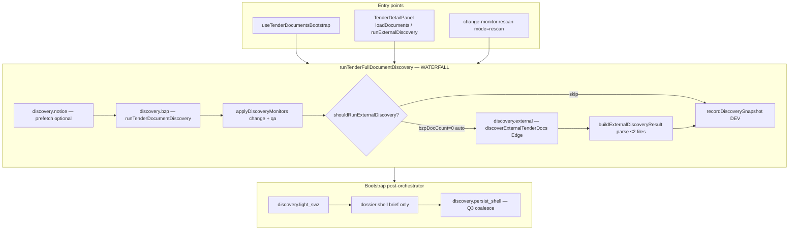

# NG11-A3 — Discovery Fork (Speculative External) · AUDIT + PLAN

| Pole | Wartość |
|------|---------|
| **Program** | NG11-TENDER-PIPELINE-PERFORMANCE |
| **Slice** | **NG11-A3** |
| **Tryb** | **AUDIT → PLAN → DESIGN FREEZE → ARCH REVIEW** (ARCHITECTURE ONLY) |
| **Status** | **AUDIT COMPLETE** · **IMPLEMENT COMPLETE** · **OWNER QA PENDING** |
| **Data** | 2026-07-11 |
| **Baseline prod** | **2.63.99** @ **`447a58b`** · NG11-A2 **PRODUCTION VERIFIED** |
| **Zależności** | **NG11-A2** ✅ · **NG11-Q2** ✅ · **NG11-Q1** ✅ · **NG11-Q3** ✅ · **NG11-A1** ✅ · **NG11-Q5** ✅ · **F0** ✅ |
| **SSOT programu** | [`NG11-PIPELINE-PERFORMANCE-DESIGN-FREEZE.md`](./NG11-PIPELINE-PERFORMANCE-DESIGN-FREEZE.md) § A3 · §3.1 T1 · §19.3 PG-3 · §20.1 · **RF-07** |

---

## Werdykt skrócony

| Obszar | Werdykt |
|--------|---------|
| **AUDIT** | **PASS WITH CONDITIONS** — waterfall sekwencyjny potwierdzony; `isCancelled` hook istnieje ale bootstrap nie anuluje; brak fork/timeout/flag |
| **PLAN** | **READY** — speculative external ∥ BZP · cancel gdy BZP >0 · timeout **45 s** · flag OFF · **bez zmian Edge** |
| **DESIGN FREEZE A3** | **DRAFT READY** — T1 pool max **2** · tylko `mode=auto` · merge/persist serial |
| **ARCH REVIEW** | **PENDING** (ten dokument = input) |
| **Owner GO (IMPLEMENT)** | **APPROVED** · **IMPLEMENTED** · **OWNER QA PENDING** |

---

# CZĘŚĆ I — AUDIT REPORT

## 1. Obecny discovery lifecycle (as-is prod 2.63.99)

### 1.1 Diagram — od mount detalu do shell persist



### 1.2 Kluczowe pliki

| Warstwa | Plik | Rola |
|---------|------|------|
| **SSOT orchestrator** | `tender-full-document-discovery.ts` | `runTenderFullDocumentDiscovery` · policy helpers |
| **BZP discovery** | `tender-document-discovery.ts` | `runTenderDocumentDiscovery` · settled semantics |
| **Bootstrap hook** | `useTenderDocumentsBootstrap.ts` | auto `mode=auto` · inflight guards · persist gate |
| **External client** | `tender-external-docs.ts` | `discoverExternalTenderDocs` → Edge POST |
| **External merge** | `tender-external-discovery-apply.ts` | `buildExternalDiscoveryResult` · parse cap 2 |
| **Manual UI** | `TenderDetailPanel.tsx` | refresh BZP · external-only manual |
| **Change monitor** | `tender-change-monitor.ts` | rescan `includeExternal: false` |
| **Timing F0** | `tender-pipeline-timing.ts` | `discovery.notice/bzp/external/light_swz/persist_shell` |
| **DEV telemetry** | `tender-pipeline-discovery-snapshot.ts` | ring 30 · meta only |
| **Retry** | `tender-pipeline-retry.ts` | scope `discovery` clears bootstrap guards |
| **Heavy gate** | `unified-attachment-gate.ts` | `canStartHeavyParse` po attachment count |
| **Persist Q3** | `tender-pipeline-persist-coalesce.ts` | debounced cloud po `onUpdate` |

### 1.3 Sekwencja as-is (auto bootstrap)

| Krok | Stage timing | Blokujący? | Uwagi |
|------|--------------|------------|-------|
| 1 | `discovery.notice` | Tak (jeśli prefetch) | Tylko gdy brak `noticeHtml` |
| 2 | `discovery.bzp` | Tak | Edge `fetchTenderDocuments` |
| 3 | Monitors | Tak (sync) | change + qa fingerprint diff |
| 4 | `discovery.external` | Tak (warunkowy) | **Tylko po** kroku 2 gdy `bzpDocCount === 0` |
| 5 | `discovery.light_swz` | Tak | HTML parse |
| 6 | `discovery.persist_shell` | Tak | Q3 debounce downstream |

**Luka A3:** krok 4 czeka na wynik BZP — przy historycznie pustym BZP external startuje dopiero po pełnym RTT BZP (często 2–15 s stracone).

---

## 2. Fork points (as-is vs plan A3)

| Punkt | As-is | Plan A3 (fork) |
|-------|-------|----------------|
| **F1** Notice ∥ BZP | Sekwencyjnie | **Bez zmiany MVP** — anchor HTML często z notice |
| **F2** BZP ∥ External | **Sekwencyjnie** | **FORK** — start external gdy auto + includeExternal + HTML + !externalSettled |
| **F3** Join / merge | N/A | **Serial join** — jeśli `bzpDocCount > 0` → **discard** external wynik |
| **F4** Manual / rescan | `skipBzp` lub `includeExternal: false` | **Bez fork** — zachować waterfall |

### 2.1 `shouldRunExternalDiscovery` (SSOT policy dziś)

```102:115:src/lib/tender-pipeline/tender-full-document-discovery.ts
export function shouldRunExternalDiscovery(
  item: TenderPipelineItem,
  mode: TenderDiscoveryMode,
  opts: { includeExternal?: boolean; bzpDocCount: number; noticeHtml?: string | null },
): boolean {
  if (!opts.includeExternal) return false;
  if (!item.tenderId?.trim()) return false;
  const html = (opts.noticeHtml ?? item.noticeHtml ?? "").trim();
  if (!html) return false;
  if (mode === "manual") return true;
  if (opts.bzpDocCount > 0) return false;
  if (isExternalDiscoverySettled(item)) return false;
  return true;
}
```

**A3-A1:** Fork musi użyć **tej samej** polityki po join — nie zmieniać semantyki `bzpDocCount > 0` → skip external merge.

### 2.2 `isCancelled` hook (istnieje, niewykorzystany w bootstrap)

```147:154:src/app/hooks/useTenderDocumentsBootstrap.ts
        const discovery = await runTenderFullDocumentDiscovery(item, {
          mode: "auto",
          prefetchNotice: true,
          includeExternal: true,
          // NG-02.1C: orchestrator kończy fetch; persist gate'ujemy w bootstrap (nie w SSOT).
          isCancelled: () => false,
          deps,
        });
```

**A3-A2:** Bootstrap **zawsze** `isCancelled: () => false` — cancel path dla fork **nie podłączony**.

---

## 3. Candidate generation (dokumenty, nie parse candidates)

| Źródło | Generator | Output | Cap / filtr |
|--------|-----------|--------|-------------|
| **BZP Edge** | `fetchTenderDocuments` | `bzpDocuments[]` | authoritative list |
| **External Edge** | `tenders-external-discover` | `pageLinks[]` + `files[]` | crawl + storage upload server-side |
| **External parse** | `buildExternalDiscoveryResult` | patch + events | parse **≤2** plików relevant |
| **Monitors** | `applyDiscoveryMonitors` | change/qa events | fingerprint diff |

**A3 nie zmienia** generatorów — tylko **scheduling** wywołania external.

---

## 4. Parallel discovery opportunities

| Opportunity | As-is | A3 MVP | Werdykt |
|-------------|-------|--------|---------|
| Speculative external ∥ BZP | **NIE** | **TAK** (flag ON) | **PRIMARY WIN** — skraca P4 gdy BZP puste |
| Notice ∥ BZP | NIE | P2 backlog | anchor risk |
| BZP ∥ light SWZ | NIE | **NIE** — SWZ wymaga HTML po notice | poza scope |
| T1 pool max 2 network | **NIE enforced** | **TAK** (notice+BZP lub BZP+ext) | RF-07 |
| Rescan batch parallel | Serial `for` w change-monitor | **NIE** | poza scope A3 |

### 4.1 Profile „historycznie puste BZP”

W praktyce = **auto** path gdzie po BZP `docs.length === 0` i external jeszcze nie settled — fork spekulatywnie startuje external **przed** znajomością wyniku BZP, anuluje merge gdy BZP >0.

---

## 5. Memory footprint

| Element | Szacunek | Ryzyko |
|---------|----------|--------|
| **BZP docs array** | 0–50 refs | LOW |
| **External discovery object** | pageLinks (10–100) + files metadata | MEDIUM przy równoległym in-flight |
| **buildExternalDiscoveryResult parse** | do 2 plików × bytes | MEDIUM — tylko po join jeśli external wins |
| **Discovery snapshot ring** | 30 × meta | LOW · DEV only |
| **Równoległy fork** | +1 Edge request in-flight | **MEDIUM** — egress / rate limit |

**RF-A3-01:** MVP **nie** równoległego parse external + BZP merge — external parse dopiero po join (jak dziś).

**RF-A3-02:** Timeout **45 s** na gałęzi external — zapobiega wiszącym Promise.

---

## 6. Storage lifecycle

| Store | Lifetime | A3 impact |
|-------|----------|-----------|
| `item.bzpDocuments` | KV `kw-tenders-pipeline` | Bez zmiany — BZP authoritative |
| `item.externalDocDiscovery` | KV | Merge tylko gdy join policy OK |
| `documentsFetchedAt` | KV | Tylko BZP authoritative path |
| Edge storage uploads | Supabase bucket | **Bez zmiany kontraktu Edge** |

**Zasada A3:** przy `bzpDocCount > 0` po join — **nie** zapisywać `externalDocDiscovery` z fork (cancel discard).

---

## 7. Telemetry impact

| Element | As-is | Po A3 (plan) |
|---------|-------|--------------|
| `discovery.bzp` timing | wall = BZP RTT | bez zmiany |
| `discovery.external` timing | po BZP | może **overlap** z BZP — osobny stage |
| `discovery-fork` meta | **BRAK** | **NOWY** opcjonalny: `forkStarted`, `forkCancelled`, `forkWon` |
| F0 PG-3 | P95 `discovery.*` | **cel: brak wzrostu P95** przy BZP>0 (cancel path) |
| `recordDiscoverySnapshot` | meta | rozszerzyć o fork flags (DEV) |

**Warunek:** PG-3 mierzy profil **B ZP z załącznikami** — fork nie powinien podnosić P95 (external cancelled early).

---

## 8. Interaction z A1 / Q1 / Q2 / Q3 / A2

| Slice | Interakcja A3 | Werdykt |
|-------|---------------|---------|
| **Q3** debounced persist | Szybszy `discovery.persist_shell` → ten sam coalesce | **COMPAT** |
| **A1** heavy lazy | Wcześniejsze załączniki → wcześniejszy `canStartHeavyParse` | **BENEFIT** |
| **Q5** cost-first | Wcześniejszy partial pricing path | **BENEFIT** (po A1) |
| **Q1/Q2** parse | Downstream — szybszy discovery = szybszy heavy start | **COMPAT** |
| **A2** artifact cache | Nowe external files → fingerprint change → **miss** (poprawne) | **COMPAT** |
| **NG10** gate-exit | Wcześniejsze attachments → wcześniejszy timeline | **BENEFIT** · regresja 28/28 wymagana |

**A3-A3:** Nie skracać `isDocumentDiscoverySettled` semantics — settled empty BZP nadal authoritative.

---

## 9. Race conditions

| ID | Scenariusz | Severity | Mitigacja (plan) |
|----|------------|----------|------------------|
| **A3-R1** | BZP zwraca docs >0 podczas external in-flight | P0 | Join discard external · `isCancelled` na external branch |
| **A3-R2** | External kończy pierwszy, BZP później puste | P1 | Merge external jak dziś — OK |
| **A3-R3** | Double bootstrap inflight | P1 | Istniejący `bootstrapInflightIds` — bez zmiany |
| **A3-R4** | Q3 persist partial patch podczas fork | P2 | Serial `onUpdate` per item — jak dziś |
| **A3-R5** | Heavy start przed discovery complete | P1 | `deriveUnifiedAttachmentGate` — bez zmiany |
| **A3-R6** | External timeout 45s po BZP complete | P2 | AbortController / Promise.race · nie blokować join |
| **A3-R7** | Egress spike 2× Edge równolegle | P2 | T1 cap **2** · flag OFF default |
| **A3-R8** | Manual `skipBzp` + fork | P0 | Fork **tylko** `mode=auto` + `!skipBzp` |

---

## 10. Rollback strategy

| Mechanizm | Opis |
|-----------|------|
| **Flaga** | `pipelinePerfDiscoveryFork` default **OFF** (DF §20.1) |
| **Super Admin** | Toggle w ⚙ — bez redeploy |
| **Serial fallback** | Flaga OFF → obecny waterfall |
| **Egress incident** | Wyłącz A3 · ewentualnie Q1+Q2 (DF §20.2) |
| **Edge** | **Bez zmian** — rollback = flag OFF only |

---

## 11. Cache eviction / compatibility pipeline runtime

| Check | Werdykt |
|-------|---------|
| `deriveUnifiedAttachmentGate` | **PASS** — bez zmiany |
| `derivePipelineState` / readiness | **PASS** — additive timing only |
| `useTenderPipelineRuntime` | **PASS** — `onExternalRunning` już istnieje w bootstrap |
| `retryTenderPipelinePhase('discovery')` | **PASS** — reset guards · re-run waterfall/fork |
| NG-02.1C persist gate | **CONDITIONAL** — zachować `hasAuthoritativeDiscoveryPatch` semantics |
| Change monitor rescan | **PASS** — `includeExternal: false` pozostaje serial |

---

## 12. Audit findings summary

| ID | Severity | Opis |
|----|----------|------|
| **A3-A1** | P0 | Waterfall BZP → external — strata wall time przy pustym BZP |
| **A3-A2** | P0 | `pipelinePerfDiscoveryFork` **nie zaimplementowane** |
| **A3-A3** | P1 | Brak timeout **45 s** / AbortController na external |
| **A3-A4** | P1 | T1 pool max 2 **nie enforced** w orchestratorze |
| **A3-A5** | P1 | `isCancelled` w bootstrap hardcoded `false` |
| **A3-A6** | P2 | Edge `tenders-external-discover` — **OUT OF SCOPE** zmian (Protected Core) |
| **A3-A7** | P2 | Fork telemetry / PG-3 harness **brak** |
| **A3-A8** | P3 | Pre-existing test `test-tender-full-document-discovery.mjs` — regresja base |

---

# CZĘŚĆ II — PLAN (IMPLEMENT — po Owner GO)

## 14. Mechanizm (frozen draft)

| # | Zasada |
|---|--------|
| **Z1** | Nowy moduł `tender-discovery-fork.ts` (scheduling) **lub** rozszerzenie `tender-full-document-discovery.ts` |
| **Z2** | Fork **tylko** `mode=auto` · `includeExternal` · `!skipBzp` · `!isExternalDiscoverySettled` |
| **Z3** | Start external **równolegle** z `runTenderDocumentDiscovery` gdy flag ON |
| **Z4** | Join: jeśli `bzpDocCount > 0` → cancel/discard external wynik |
| **Z5** | External timeout **45 s** · best-effort abort |
| **Z6** | T1 concurrent network **≤ 2** (notice+BZP lub BZP+external) |
| **Z7** | Flaga `pipelinePerfDiscoveryFork` default **OFF** |
| **Z8** | **Nie** zmieniać Edge API · parsery · `cloud-sync` kernel |
| **Z9** | Bootstrap: przekazać `isCancelled` gdy BZP>0 (fork cancel) |

### 14.1 Proponowany moduł

```text
src/lib/tender-pipeline/tender-discovery-fork.ts

DISCOVERY_FORK_EXTERNAL_TIMEOUT_MS = 45_000
DISCOVERY_T1_NETWORK_POOL = 2
shouldStartDiscoveryFork(item, mode, opts): boolean
runDiscoveryForkJoin(bzpPromise, externalPromise, cancelExternal): ForkJoinResult
isPipelineDiscoveryForkEnabled(): boolean  // flag + test override
```

**Integracja (allowlist draft):**

| Plik | Zmiana |
|------|--------|
| `tender-full-document-discovery.ts` | fork join w `runTenderFullDocumentDiscovery` |
| `useTenderDocumentsBootstrap.ts` | wire `isCancelled` dla fork cancel |
| `app-settings.ts` | `pipelinePerfDiscoveryFork` |
| `AdminSettingsModal.tsx` | checkbox Super Admin |
| opcjonalnie `tender-pipeline-discovery-snapshot.ts` | fork meta DEV |

**NIE w allowlist:** `cloud-sync.ts` · Edge `index.tsx` · `App.tsx` CORE · NG10 gate · parsery.

### 14.2 Etapy slice

| Etap | Zakres | DoD |
|------|--------|-----|
| **A3-0** | Flaga + AdminSettings | test flag read |
| **A3-1** | Fork scheduler + timeout + join discard | test determinism |
| **A3-2** | Wire orchestrator auto mode | regresja NG-02.1B test |
| **A3-3** | Bootstrap `isCancelled` wire | inflight cancel |
| **A3-4** | `test-ng11-discovery-fork.mjs` | PG-A3 harness |
| **A3-5** | CHANGELOG + ARCHITECTURE §12.1.36 | release docs |

### 14.3 Test plan

| Test | Cel |
|------|-----|
| `test-ng11-discovery-fork.mjs` | fork on/off · cancel on BZP>0 · timeout · pool ≤2 |
| `test-tender-full-document-discovery.mjs` | Regresja NG-02.1B policy |
| `test-ng11-debounce-persist.mjs` | Regresja Q3 |
| `test-ng11-a1-progressive-heavy.mjs` | Regresja A1 |
| `test-ng11-artifact-cache.mjs` | Regresja A2 |
| `test-tender-autonomous-run-gate-exit.mjs` | 28/28 NG10 |
| `npm run build` | PASS |

### 14.4 PG-A3 harness (draft)

| Metryka | Cel |
|---------|-----|
| BZP empty profile P50 `discovery.*` | **−30%** vs waterfall (mock BZP 200ms + ext 500ms → join ~500ms not 700ms) |
| BZP>0 profile P95 `discovery.*` | **≤ baseline** (fork cancelled — PG-3) |

---

# CZĘŚĆ III — DESIGN FREEZE (A3 supplement)

| Pole | Wartość frozen |
|------|----------------|
| **Scope** | Speculative external fork przy auto bootstrap |
| **Fork condition** | auto · includeExternal · HTML · !externalSettled · !skipBzp |
| **Cancel** | BZP `docs.length > 0` → discard external |
| **Timeout** | External branch **45 s** |
| **T1 pool** | Max **2** concurrent discovery network ops |
| **Flag** | `pipelinePerfDiscoveryFork` OFF default |
| **Edge** | **ZERO contract change** |
| **Manual/rescan** | Waterfall bez fork |
| **Parser fidelity** | Bez zmian (#NG11-011) |
| **Wersja szac.** | **2.64.0** |
| **Następny slice po A3** | **NG11-A5** strategic/economic decision |

---

# CZĘŚĆ IV — Boundary Check

| Check | Werdykt |
|-------|---------|
| Path B CORE performance | **TAK** |
| #CORE-013 one bundle | A3 osobny commit |
| #CORE-014 FEATURE PASS | **TAK** — orchestration only |
| `cloud-sync.ts`? | **NIE** (read Q3 coalesce only) |
| `App.tsx` CORE? | **NIE** |
| Edge API / `index.tsx`? | **NIE** — Protected Core |
| NG10 gate exit? | **NIE** |
| Payroll? | **NIE** |
| Pipeline runtime business logic? | **NIE** — scheduling only |
| Parser fidelity? | **NIE** |

**Blast radius:** PRIMARY `tender-discovery-fork.ts` + `tender-full-document-discovery.ts` + `useTenderDocumentsBootstrap.ts` (cancel wire) + `app-settings.ts` · **5–7 plików**.

---

# CZĘŚĆ V — Risk Assessment

| Ryzyko | P | I | Mitigacja |
|--------|---|---|-----------|
| Egress spike (2× Edge) | M | M | flag OFF · T1 cap 2 · PG-3 |
| Stale external merge przy BZP>0 | L | H | join discard · test A3-R1 |
| Timeout false negative (slow external) | M | L | 45s frozen · best-effort |
| Bootstrap cancel race | L | M | `bootstrapInflightIds` + serial patch |
| P95 regression BZP>0 | M | M | cancel path · PG-3 harness |
| Scope creep → Edge crawl change | M | H | Protected Core · ADR gate |

**Ogólny werdykt ryzyka:** **MEDIUM** — akceptowalne przy flag OFF + PG-3 + bez Edge diff.

---

# CZĘŚĆ VI — Owner GO Checklist

| # | Warunek | Status |
|---|---------|--------|
| 1 | NG11-A2 **PRODUCTION VERIFIED** (2.63.99) | **PASS** |
| 2 | AUDIT discovery lifecycle (ten dokument §1) | **PASS** |
| 3 | PLAN fork + cancel + timeout §14 | **PASS** |
| 4 | DESIGN FREEZE timeout 45s + flag OFF | **DRAFT** |
| 5 | Boundary Check §IV — **bez Edge** | **PASS** |
| 6 | Egress / PG-3 akceptacja Owner | **PENDING** |
| 7 | ARCH REVIEW NG11-A3 | **PENDING** |
| 8 | RF-07 T1 pool + cancel SSOT | **DRAFT** |
| 9 | Regresja gate-exit 28/28 w DoD | **PLANNED** |
| 10 | Nie dotykać parser / cloud-sync / Edge | **CONFIRMED** |

### Werdykt Owner GO

| | |
|---|---|
| **AUDIT → PLAN → DESIGN FREEZE** | **COMPLETE** |
| **ARCH REVIEW** | **PENDING** |
| **Owner GO dla IMPLEMENT NG11-A3** | **NOT READY** |

---

# CZĘŚĆ VII — Prompt dla ChatGPT (ARCH REVIEW / OWNER GO)

```text
Jesteś Architect/Owner W&G DOM. Przeprowadź ARCH REVIEW i decyzję Owner GO dla slice NG11-A3 (Discovery Fork — speculative external).

KONTEKST:
- Prod baseline: 2.63.99 PRODUCTION VERIFIED @ 447a58b
- NG11-A2 CLOSED (artifact cache session LRU, flag OFF)
- Program: NG11-TENDER-PIPELINE-PERFORMANCE
- Slice: NG11-A3 — równoległy start external discovery gdy BZP jeszcze trwa; cancel gdy BZP>0
- SSOT audytu: docs/architecture/NG11-A3-DISCOVERY-FORK-AUDIT-PLAN.md
- Design Freeze v1.1 § A3 + flag pipelinePerfDiscoveryFork OFF
- RF-07: timeout 45s · T1 pool max 2 · cancel external when BZP docs>0

ZAKRES IMPLEMENT (jeśli GO):
- tender-discovery-fork.ts (nowy) LUB rozszerzenie tender-full-document-discovery.ts
- wire isCancelled w useTenderDocumentsBootstrap.ts
- app-settings.ts + AdminSettings flag
- test-ng11-discovery-fork.mjs
- BEZ: cloud-sync kernel, Payroll, Edge index.tsx, NG10 gate, App.tsx CORE, parser fidelity
- BEZ zmiany kontraktu tenders-external-discover

PYTANIA DO DECYZJI:
1. Akceptujesz speculative external ∥ BZP tylko dla mode=auto (manual/rescan waterfall)?
2. Akceptujesz timeout 45s i discard external gdy BZP zwróci >0 docs?
3. Akceptujesz ryzyko egress (2× Edge równolegle) z mitigacją flag OFF + PG-3 P95 gate?
4. Czy osobny moduł tender-discovery-fork.ts vs inline orchestrator?
5. Czy PG-A3 harness (mock −30% P50 empty BZP) wystarczy bez prod F0 observation?

FORMAT ODPOWIEDZI:
- ARCH REVIEW: PASS | PASS WITH CONDITIONS | HOLD
- WARUNKI (max 3)
- WERDYKT OWNER GO: GO IMPLEMENT NG11-A3 | HOLD | GO z warunkami
- CHECKBOX: §17.2 CORE checklist NG11
- NASTĘPNY KROK: komenda dla agenta Cursor

Nie pisz kodu. Tylko review + decyzja.
```

---

*NG11-A3 audit plan · AUDIT COMPLETE · 2026-07-11 · baseline 2.63.99*
