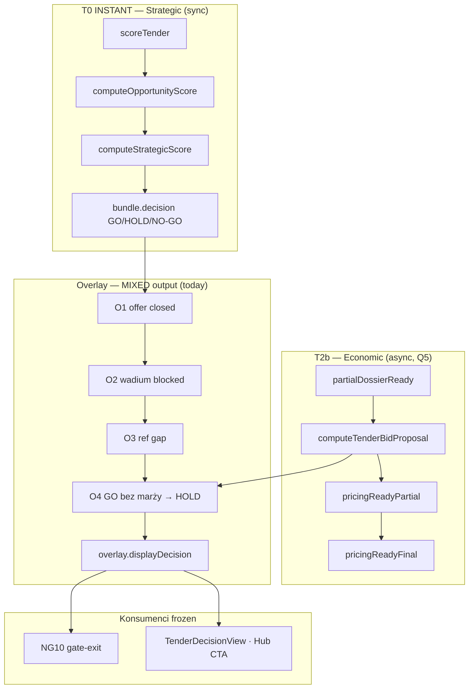

# NG11-A5 — Strategic vs Economic Decision · AUDIT + PLAN

| Pole | Wartość |
|------|---------|
| **Program** | NG11-TENDER-PIPELINE-PERFORMANCE |
| **Slice** | **NG11-A5** |
| **Tryb** | **AUDIT → PLAN → DESIGN FREEZE → ARCH REVIEW** (ARCHITECTURE ONLY) |
| **Status** | **AUDIT COMPLETE** · **IMPLEMENT COMPLETE** · **PRODUCTION VERIFIED** |
| **Data** | 2026-07-11 |
| **Baseline prod** | **2.64.0** @ **`78c0a40`** · NG11-A3 **PRODUCTION VERIFIED** |
| **Zależności** | **NG11-A3** ✅ · **NG11-A2** ✅ · **NG11-Q2** ✅ · **NG11-Q1** ✅ · **NG11-Q3** ✅ · **NG11-A1** ✅ · **NG11-Q5** ✅ · **F0** ✅ |
| **SSOT programu** | [`NG11-PIPELINE-PERFORMANCE-DESIGN-FREEZE.md`](./NG11-PIPELINE-PERFORMANCE-DESIGN-FREEZE.md) § A5 · §2.2 · §3.1 T0/T2b · **#NG11-006** |

---

## Werdykt skrócony

| Obszar | Werdykt |
|--------|---------|
| **AUDIT** | **PASS WITH CONDITIONS** — sygnały Q5 istnieją w runtime; brak jawnego split strategic/economic w `intelligenceCtx` |
| **PLAN** | **READY** — additive fields + wire runtime → context · **bez zmiany** `overlay.displayDecision` / NG10 |
| **DESIGN FREEZE A5** | **DRAFT READY** — mapowanie frozen · lib-only MVP |
| **ARCH REVIEW** | **PASS WITH CONDITIONS** |
| **Owner GO (IMPLEMENT)** | **APPROVED** · **IMPLEMENTED** · **PRODUCTION VERIFIED** |

---

# CZĘŚĆ I — AUDIT REPORT

## 1. Obecna logika strategic / economic (as-is prod 2.64.0)

### 1.1 Diagram — dwa strumienie decyzyjne (implicit, niejawny split)



### 1.2 Kluczowe pliki

| Warstwa | Plik | Rola |
|---------|------|------|
| **Strategic scoring SSOT** | `tenders-strategy-decision.ts` | `scoreTender` · `computeTenderDecision` |
| **Strategic context** | `tenders-strategy-strategic-score.ts` | strategic score + growth mode |
| **Intelligence SSOT** | `tender-intelligence-context.ts` | `buildTenderIntelligenceContext` |
| **Overlay O1–O4** | `tender-intelligence-overlay.ts` | `displayDecision` · confidence · O4 economic |
| **Economic compute** | `useTenderPricingAuto.ts` | `computeTenderBidProposal` |
| **Readiness predicates** | `derive-pipeline-readiness.ts` | `pricingReadyPartial` / `pricingReadyFinal` |
| **Runtime signals** | `useTenderPipelineRuntime.ts` | eksport sygnałów NG11 |
| **Pipeline state** | `derive-pipeline-state.ts` | `PipelineState.Pricing/Ready` |
| **Command layer wire** | `useTenderPrzetargCommandContext.ts` | `intelligenceCtx` + `pipelineRuntime` |
| **NG10 frozen** | `tender-autonomous-run-gate-exit.ts` | `overlay.displayDecision` |

### 1.3 Semantyka as-is

| Pojęcie | As-is implementacja | Warstwa |
|---------|---------------------|---------|
| **Strategic decision** | `bundle.decision` (przed overlay) | T0 sync |
| **Economic input** | `ownerFinanceProposal` + kosztorys | T2b async |
| **Displayed decision** | `overlay.displayDecision` (po O1–O4) | T0+T2b mix |
| **Strategic ready** | **Implicit** — zawsze gdy `scoringContext` + `scoreTender` | Brak pola |
| **Economic ready (partial)** | `pricingReadyPartial` w runtime | **Nie** w `intelligenceCtx` |
| **Economic ready (final)** | `pricingReadyFinal` w runtime | **Nie** w `intelligenceCtx` |

**Luka A5:** DF §2.2 i §8 A5 wymagają jawnych `strategicDecisionReady` / `economicDecisionReady` w intelligence context — **nie zaimplementowane**.

---

## 2. Decision points (fork / join)

| Punkt | Trigger | Output | Blokuje UI? |
|-------|---------|--------|-------------|
| **D1** | `scoreTender` complete | `bundle.decision` | Nie (sync) |
| **D2** | O1–O3 hard blockers | `displayDecision=NO-GO` | Nie |
| **D3** | O4: raw GO + brak marży | `displayDecision=HOLD` | Nie |
| **D4** | `partialDossierReady` | `pricingReadyPartial` | Nie — `PipelineState.Pricing` |
| **D5** | metadata merge + recompute | `pricingReadyFinal` | Nie — `PipelineState.Ready` |
| **D6** | NG10 gate exit | read `displayDecision` | Autonomous only |

**A5-A1:** Join point D3 **miesza** economic (marża) ze strategic (raw GO) w jednym `displayDecision` — zgodne z NG10 frozen, ale brak osobnych sygnałów readiness dla UI/telemetry.

---

## 3. Scoring pipeline

### 3.1 Strategic path (T0)

```74:96:src/lib/tenders-strategy-decision.ts
export function scoreTender(
  item: TenderPipelineItem,
  profile: TenderCompanyProfile,
  strategicContext: StrategicScoreContext,
  now: Date = new Date(),
): TenderScoringBundle {
  const opportunity = computeOpportunityScore(item, profile, now);
  const strategic = computeStrategicScore(item, strategicContext);
  const decision = computeTenderDecision(
    opportunity.score,
    strategic.score,
    strategicContext.growthMode,
  );
  // ...
}
```

- **Bez await** — opportunity + strategic z pól `item` (title, dates, client filters, jobs context).
- **Nie wymaga** kosztorysu do wyliczenia `bundle.decision`.

### 3.2 Economic path (T2b, Q5)

```35:54:src/lib/tender-pipeline/derive-pipeline-readiness.ts
export function derivePricingReadyPartial(opts: {
  partialDossierReady: boolean;
  ownerFinanceProposal: TenderBidProposal | null;
}): boolean {
  return opts.partialDossierReady && opts.ownerFinanceProposal?.ok === true;
}

export function derivePricingReadyFinal(opts: { ... }): boolean {
  if (opts.ownerFinanceProposal?.ok !== true) return false;
  if (!tenderDossierHeavyParseDone(opts.item.tenderDossier)) return false;
  // ...
}
```

### 3.3 Overlay economic rule (O4)

```179:182:src/lib/tender-intelligence-overlay.ts
  } else if (rawDecision === "GO" && !hasReadyTenderMargin(ownerFinanceProposal)) {
    displayDecision = "HOLD";
    downgradeRule = "O4";
  }
```

**Principle #NG11-006:** Strategic ≠ Economic — **częściowo spełnione** (raw vs overlay), ale **brak explicit readiness fields**.

---

## 4. Telemetry impact

| Element | As-is | Po A5 (plan) |
|---------|-------|--------------|
| F0 `pricing.compute_partial` | ✅ istnieje | bez zmiany |
| F0 `pricing.compute_final` | ✅ istnieje | bez zmiany |
| `strategic.ready` | **BRAK** | opcjonalny DEV mark przy build context |
| `economic.partial` / `economic.final` | runtime only | mirror w context meta (DEV) |
| NG10 timeline | `displayDecision` | **bez zmiany** |

**PG:** brak nowego PG dla A5 w DF — regresja gate-exit **28/28** wystarczy.

---

## 5. Interaction z A1 / Q1 / Q2 / Q3 / A2 / A3

| Slice | Interakcja A5 | Werdykt |
|-------|---------------|---------|
| **A1** | `partialDossierReady` → `economicDecisionReady` partial | **PRIMARY INPUT** |
| **Q5** | `pricingReadyPartial/Final` = economic readiness SSOT | **WIRE ONLY** |
| **Q3** | debounce persist — nie zmienia readiness predicates | **COMPAT** |
| **Q1/Q2** | szybszy T2 → wcześniejszy economic ready | **BENEFIT** |
| **A2** | cache hit → szybszy partial → wcześniejszy economic | **BENEFIT** |
| **A3** | szybszy discovery → wcześniejszy heavy → economic | **BENEFIT** |
| **NG10** | `displayDecision` **frozen** | **MUST NOT CHANGE** |

---

## 6. Memory footprint

| Element | Szacunek | Ryzyko |
|---------|----------|--------|
| Nowe pola na `TenderIntelligenceContext` | 4–6 boolean + 2 enum refs | **LOW** |
| Duplicate scoring | **NIE** — reuse `scoringBundle` | **LOW** |
| Extra `useMemo` deps | runtime signals | **LOW** |

---

## 7. Race conditions

| ID | Scenariusz | Severity | Mitigacja (plan) |
|----|------------|----------|------------------|
| **A5-R1** | `pricingReadyPartial` true, `intelligenceCtx` stale bez recompute | P1 | Wire runtime signals do `buildTenderIntelligenceContext` deps |
| **A5-R2** | Strategic GO → O4 HOLD gdy proposal null; UI pokazuje HOLD bez label „economic pending” | P2 | A5 UI optional: badge strategic vs economic |
| **A5-R3** | NG10 gate czyta `displayDecision` podczas partial pricing | P1 | **Nie zmieniać** gate-exit; test regresji 28/28 |
| **A5-R4** | `ownerFinanceProposal` recompute mid-frame vs overlay | P2 | Istniejący `useMemo` chain — bez zmiany kolejności |
| **A5-R5** | Lista przetargów (bez runtime) buduje context bez pricing signals | P2 | `economicDecisionReady=false` default gdy brak runtime |

---

## 8. Rollback strategy

| Mechanizm | Opis |
|-----------|------|
| **Additive lib** | Nowe pola optional — konsumenci ignore → **zero behavior change** |
| **NG10** | `displayDecision` bez zmiany — rollback = revert wire only |
| **Flaga** | DF §20.1 **brak** dedykowanej flagi A5 — MVP **always-on additive** (lib) |
| **UI split** | Opcjonalny follow-up NG10-UX — poza MVP A5 |

---

## 9. Compatibility pipeline runtime

| Check | Werdykt |
|-------|---------|
| `derivePipelineState` | **PASS** — bez zmiany |
| `TenderPipelineRuntime` type | **PASS** — już ma `pricingReadyPartial/Final` |
| `buildTenderIntelligenceContext` | **CONDITIONAL** — rozszerzyć input |
| NG10 gate-exit | **PASS** — frozen |
| `useTenderPipelineRuntime` business logic | **PASS** — tylko pass-through do context |

---

## 10. Audit findings summary

| ID | Severity | Opis |
|----|----------|------|
| **A5-A1** | P0 | Brak `strategicDecisionReady` / `economicDecisionReady` w `TenderIntelligenceContext` |
| **A5-A2** | P0 | Runtime ma `pricingReadyPartial/Final` — nie propagowane do intelligence SSOT |
| **A5-A3** | P1 | `displayDecision` miesza strategic+economic — OK dla NG10, brak osobnych pól export |
| **A5-A4** | P1 | Brak testów `test-ng11-strategic-economic-decision.mjs` |
| **A5-A5** | P2 | Brak F0 stage `strategic.ready` (DEV telemetry backlog) |
| **A5-A6** | P2 | `useTenderPrzetargCommandContext` nie przekazuje pricing readiness do context builder |
| **A5-A7** | P3 | DF wersja slice 2.64.8 historyczna — baseline 2.64.0 → szac. **2.65.0** |

---

# CZĘŚĆ II — PLAN (IMPLEMENT — po Owner GO)

## 11. Mechanizm (frozen draft)

| # | Zasada |
|---|--------|
| **Z1** | Nowy moduł `tender-intelligence-decision-readiness.ts` (pure predicates) |
| **Z2** | Rozszerzyć `TenderIntelligenceContext` o pola readiness + strategic snapshot |
| **Z3** | `strategicDecisionReady` = scoring bundle dostępny (T0) |
| **Z4** | `economicDecisionReady` ≈ `pricingReadyPartial` (z runtime) |
| **Z5** | `economicDecisionFinalReady` ≈ `pricingReadyFinal` |
| **Z6** | `strategicDecision` = `bundle.decision` (explicit export) |
| **Z7** | **`overlay.displayDecision` — BEZ ZMIANY** (NG10 frozen) |
| **Z8** | Wire: `useTenderPrzetargCommandContext` + `TenderDetailPanel` → przekaż runtime signals |
| **Z9** | **Bez** zmian `cloud-sync` · Edge · NG10 gate · parsery |
| **Z10** | UI split (strategic vs economic labels) — **P2 backlog** / osobny NG10-UX slice |

### 11.1 Proponowany model (additive)

```typescript
export interface TenderDecisionReadiness {
  strategicDecisionReady: boolean;
  economicDecisionReady: boolean;      // ≈ pricingReadyPartial
  economicDecisionFinalReady: boolean; // ≈ pricingReadyFinal
  strategicDecision: TenderDecision;   // bundle.decision (raw)
  // displayDecision pozostaje w overlay — SSOT NG10
}
```

### 11.2 Allowlist implementacji (draft)

| Plik | Zmiana |
|------|--------|
| `tender-intelligence-decision-readiness.ts` | **NOWY** — pure derive |
| `tender-intelligence-context.ts` | export readiness na context |
| `useTenderPrzetargCommandContext.ts` | wire runtime → builder input |
| `TenderDetailPanel.tsx` | wire runtime signals (minimal) |
| `test-ng11-strategic-economic-decision.mjs` | **NOWY** |
| opcjonalnie `TenderDecisionView.tsx` | badge „Strategia” / „Ekonomia” (P2 — poza MVP jeśli Owner woli lib-only) |

**NIE w allowlist:** `cloud-sync.ts` · Edge · `tender-autonomous-run-gate-exit.ts` · `tenders-strategy-decision.ts` scoring rules · `App.tsx` CORE.

### 11.3 Etapy slice

| Etap | Zakres | DoD |
|------|--------|-----|
| **A5-0** | Pure readiness module + unit tests | predicates PASS |
| **A5-1** | Extend `TenderIntelligenceContext` | type export |
| **A5-2** | Wire runtime w command context + detail panel | integration |
| **A5-3** | `test-ng11-strategic-economic-decision.mjs` | 15+ cases |
| **A5-4** | Regresja gate-exit 28/28 + Q5 + A1 | PASS |
| **A5-5** | CHANGELOG + ARCHITECTURE §12.1.37 | docs |

### 11.4 Test plan

| Test | Cel |
|------|-----|
| `test-ng11-strategic-economic-decision.mjs` | readiness map · strategic always · economic partial/final |
| `test-ng11-cost-first-pricing.mjs` | Regresja Q5 |
| `test-ng11-a1-progressive-heavy.mjs` | Regresja A1 |
| `test-tender-autonomous-run-gate-exit.mjs` | **28/28** NG10 frozen |
| `npm run build` | PASS |

---

# CZĘŚĆ III — DESIGN FREEZE (A5 supplement)

| Pole | Wartość frozen |
|------|----------------|
| **Scope** | Explicit strategic/economic readiness w `TenderIntelligenceContext` |
| **strategicDecisionReady** | `true` gdy `scoreTender` wykonany (T0) |
| **economicDecisionReady** | `pricingReadyPartial` z runtime SSOT |
| **economicDecisionFinalReady** | `pricingReadyFinal` z runtime SSOT |
| **strategicDecision** | `bundle.decision` (pre-overlay) |
| **displayDecision** | **BEZ ZMIANY** — `overlay.displayDecision` |
| **O1–O4** | **BEZ ZMIANY** |
| **Flaga** | **Brak** (always-on additive lib) — DF §20.1 |
| **NG10 gate-exit** | **ZERO diff** |
| **Wersja szac.** | **2.65.0** |
| **Następny po A5** | **NG11-Q4** (optional Edge) lub epic E2 closeout |

---

# CZĘŚĆ IV — Boundary Check

| Check | Werdykt |
|-------|---------|
| Path B CORE performance | **TAK** — lib/context only |
| #CORE-013 one bundle | A5 osobny commit |
| #CORE-014 FEATURE PASS | **TAK** |
| `cloud-sync.ts`? | **NIE** |
| `App.tsx` CORE? | **NIE** (minimal wire w TenderDetailPanel — allowlist) |
| Edge? | **NIE** |
| NG10 gate-exit? | **READ ONLY** — zero diff |
| Payroll? | **NIE** |
| Parser fidelity? | **NIE** |
| Pipeline runtime business logic? | **NIE** — pass-through signals |

**Blast radius:** PRIMARY `tender-intelligence-decision-readiness.ts` + `tender-intelligence-context.ts` + 2 wire points · **4–6 plików**.

---

# CZĘŚĆ V — Risk Assessment

| Ryzyko | P | I | Mitigacja |
|--------|---|---|-----------|
| NG10 regression przez zmianę displayDecision | L | H | **Zakaz** zmiany overlay output · gate-exit 28/28 |
| UI confusion strategic vs economic | M | L | MVP lib-only; UI badges P2 |
| Stale readiness w useMemo | M | M | Explicit deps z runtime |
| Scope creep → redesign scoring | M | H | Frozen: tylko readiness fields, nie nowe reguły GO/HOLD |
| Lista bez runtime — false negative economic | L | L | Default `economicDecisionReady=false` |

**Ogólny werdykt ryzyka:** **LOW–MEDIUM** — akceptowalne przy additive-only + NG10 frozen.

---

# CZĘŚĆ VI — Owner GO Checklist

| # | Warunek | Status |
|---|---------|--------|
| 1 | NG11-A3 **PRODUCTION VERIFIED** (2.64.0) | **PASS** |
| 2 | AUDIT strategic/economic lifecycle (ten dokument §1) | **PASS** |
| 3 | PLAN readiness fields §11 | **PASS** |
| 4 | DESIGN FREEZE bez zmiany `displayDecision` | **DRAFT** |
| 5 | Boundary Check §IV | **PASS** |
| 6 | NG10 gate-exit regresja w DoD | **PLANNED** |
| 7 | ARCH REVIEW NG11-A5 | **PENDING** |
| 8 | Owner akceptacja lib-only MVP (UI split P2) | **PENDING** |
| 9 | Q5+A1 PRODUCTION VERIFIED jako dependency | **PASS** |
| 10 | Nie dotykać parser / cloud-sync / Edge | **CONFIRMED** |

### Werdykt Owner GO

| | |
|---|---|
| **AUDIT → PLAN → DESIGN FREEZE** | **COMPLETE** |
| **ARCH REVIEW** | **PENDING** |
| **Owner GO dla IMPLEMENT NG11-A5** | **NOT READY** |

---

# CZĘŚĆ VII — Prompt dla ChatGPT (ARCH REVIEW / OWNER GO)

```text
Jesteś Architect/Owner W&G DOM. Przeprowadź ARCH REVIEW i decyzję Owner GO dla slice NG11-A5 (Strategic vs Economic decision model).

KONTEKST:
- Prod baseline: 2.64.0 PRODUCTION VERIFIED @ 78c0a40
- NG11-A3 CLOSED (discovery fork)
- Program: NG11-TENDER-PIPELINE-PERFORMANCE
- Slice: NG11-A5 — jawny split strategic (T0 sync) vs economic (Q5 async) w TenderIntelligenceContext
- SSOT audytu: docs/architecture/NG11-A5-STRATEGIC-ECONOMIC-AUDIT-PLAN.md
- Design Freeze v1.1 § A5 + Principle #NG11-006
- Zależność: NG11-Q5 (pricingReadyPartial/Final już w runtime)

STAN AS-IS:
- scoreTender → bundle.decision (strategic) — T0 instant
- useTenderPricingAuto → pricingReadyPartial/Final — T2b async
- applyTenderIntelligenceOverlay O1–O4 → displayDecision (mix, O4 = economic downgrade)
- NG10 gate-exit czyta overlay.displayDecision — FROZEN

ZAKRES IMPLEMENT (jeśli GO):
- tender-intelligence-decision-readiness.ts (nowy)
- rozszerzenie tender-intelligence-context.ts
- wire useTenderPrzetargCommandContext + TenderDetailPanel
- test-ng11-strategic-economic-decision.mjs
- BEZ: cloud-sync, Payroll, Edge, NG10 gate-exit diff, App.tsx CORE, zmian scoring rules
- displayDecision BEZ ZMIANY

PYTANIA DO DECYZJI:
1. Akceptujesz additive fields (strategicDecisionReady, economicDecisionReady, economicDecisionFinalReady, strategicDecision) bez zmiany displayDecision?
2. MVP lib-only bez UI split w TenderDecisionView — OK?
3. Brak feature flag (always-on additive) — OK?
4. Akceptujesz mapowanie economicDecisionReady = pricingReadyPartial (DF SSOT)?
5. Czy gate-exit 28/28 wystarczy jako jedyny gate NG10?

FORMAT ODPOWIEDZI:
- ARCH REVIEW: PASS | PASS WITH CONDITIONS | HOLD
- WARUNKI (max 3)
- WERDYKT OWNER GO: GO IMPLEMENT NG11-A5 | HOLD | GO z warunkami
- CHECKBOX: §17.2 CORE checklist NG11
- NASTĘPNY KROK: komenda dla agenta Cursor

Nie pisz kodu. Tylko review + decyzja.
```

---

*NG11-A5 audit plan · AUDIT COMPLETE · 2026-07-11 · baseline 2.64.0*
