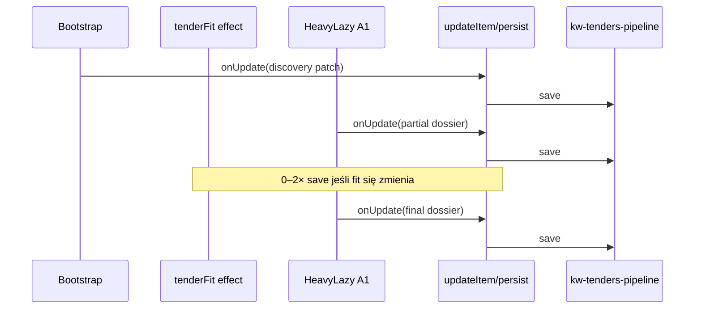

# NG11-Q3 — Debounced Persist · AUDIT + PLAN

| Pole | Wartość |
|------|---------|
| **Program** | NG11-TENDER-PIPELINE-PERFORMANCE |
| **Slice** | **NG11-Q3** |
| **Tryb** | **AUDIT → PLAN → ARCH REVIEW** (ARCHITECTURE ONLY) |
| **Status** | **AUDIT COMPLETE** · **PLAN READY** · **ARCH REVIEW PASS** · **IMPLEMENT COMPLETE** · **2.63.96** |
| **Data** | 2026-07-11 |
| **Zależności** | **NG11-A1** (partial persist) · **NG11-Q5** (early pricing) · Design Freeze v1.1 |
| **SSOT** | [`NG11-PIPELINE-PERFORMANCE-DESIGN-FREEZE.md`](./NG11-PIPELINE-PERFORMANCE-DESIGN-FREEZE.md) §7 Q3 · §19.3 PG-4 · §20.1 |
| **Powiązane** | [`NG11-PIPELINE-PERFORMANCE-ARCHITECTURE-REVIEW.md`](./NG11-PIPELINE-PERFORMANCE-ARCHITECTURE-REVIEW.md) RF-06 · **RF-09** (ten dokument §5.7) · [`WORKFLOW-OWNER-GO.md`](../WORKFLOW-OWNER-GO.md) Path B |

---

## Werdykt skrócony

| Obszar | Werdykt |
|--------|---------|
| **AUDIT** | **PASS WITH CONDITIONS** — persist hot path zidentyfikowany; A1+Q5 zwiększyły liczbę zapisów vs monolit |
| **PLAN** | **READY** — mechanizm debounce zgodny z DF v1.1 |
| **ARCH REVIEW** | **PASS** — RF-09 zaakceptowane (§5.7) |
| **Owner GO (IMPLEMENT)** | **APPROVED** · **RELEASED 2.63.96** |

---

# CZĘŚĆ I — AUDIT

## 1. Kontekst po A1 + Q5

### 1.1 Przepływ persist (as-is, WIP A1+Q5)

```text
TenderDetailPage
  └─ pipeline.updateItem(id, patch)          ← SSOT zapisu item
       └─ useTendersPipeline.updateItem
            ├─ setItems (sync React state)    ← natychmiast UI + Q5 sygnały
            └─ void persist(next)             ← NATYCHMIAST cloud
                 └─ saveTendersPipeline(next)
                      ├─ saveTendersPipelineLocal (full array LS)
                      ├─ patchPipelineSessionCache
                      └─ persistKey("kw-tenders-pipeline")
                           └─ pushKeyToCloud
                                └─ pushKeysToCloudSafe
                                     ├─ fetchKeysFromCloud (batch-get)
                                     ├─ mergeTenderPipelineForCloud
                                     └─ pushKeysToCloud (batch-set)
```

### 1.2 A1 — dwa zapisu orchestratora heavy

`useTenderDossierHeavyLazy.ts`:

| Krok | Akcja | Persist |
|------|--------|---------|
| T2 cost phase | `onUpdate(partialPatch)` — `tenderDossier` (+ opcj. `swzAnalysis`, `ourEstimatePln`) | **1× full pipeline** |
| T3 metadata phase | `onUpdate(finalPatch)` — pełny dossier + SWZ merge | **1× full pipeline** |

Sygnały A1 (`partialPersistPending`, `dossierSaving`) synchronizują **stan React** po `setItems`, **nie** czekają na `persistKey` — Q5 early pricing nie zależy od debounce cloud (warunek QA).

### 1.3 Q5 — brak dodatkowych persist

`useTenderPricingAuto` liczy proposal **in-memory**; nie wywołuje `updateItem`. Recompute po metadata zmienia tylko runtime — **zero** dodatkowych KV writes od Q5.

### 1.4 Diagram czasowy (auto pipeline, jeden tender)



---

## 2. Mapa wywołań save / persist (pipeline scope)

### 2.1 SSOT — `saveTendersPipeline`

| Warstwa | Plik | Funkcja | Uwagi |
|---------|------|---------|-------|
| **API zapisu** | `src/lib/tenders-bzp.ts` | `saveTendersPipeline` | LS + session cache + `persistKey` |
| **Hook UI** | `src/app/tenders/strategy/hooks/useTendersPipeline.ts` | `persist` → `saveTendersPipeline` | Wywoływany z `updateItem`, BZP merge, bulk |
| **Merge cloud** | `src/lib/tenders-sync.ts` | `mergeTenderPipelineForCloud` | LWW per `updatedAt` + field merge |
| **Sync kernel** | `src/lib/cloud-sync.ts` | `persistKey` → `pushKeysToCloudSafe` | **Poza scope Q3** (bez diff) |

### 2.2 Wejścia `updateItem` → persist (ścieżki przetargowe)

| Źródło | Plik | Typ wywołań | Częstotliwość |
|--------|------|-------------|---------------|
| **Auto bootstrap** | `useTenderDocumentsBootstrap.ts` | `onUpdate(patch)` 1× na run | 1 / mount detalu |
| **Heavy A1** | `useTenderDossierHeavyLazy.ts` | partial + final patch | **2×** / heavy run |
| **Runtime wrapper** | `useTenderPipelineRuntime.ts` | przekazuje `onUpdate` | 0 bezpośrednio |
| **Detail page** | `TenderDetailPage.tsx` | `pipeline.updateItem` | proxy |
| **Detail panel** | `TenderDetailPanel.tsx` | fit, discovery manual, notes, status, upload, award… | **1× per akcja**; **notes = per keystroke** |
| **Lista** | `TendersView.tsx` | status `seen` | 1× / otwarcie |
| **Strategy** | `useTenderJobFromPipeline.ts` | `linkedJobId` | rzadko |

### 2.3 Persist poza `updateItem` (ten sam klucz KV)

| Ścieżka | Plik | Kiedy |
|---------|------|-------|
| BZP refresh / auto-sync | `useTendersPipeline.ts` | `runBzpMerge`, `autoFetchAwardResults` |
| Keyword rescore | `useTendersPipeline.ts` | mount / `resyncKeywords` |
| Remove tender | `tenders-bzp.ts` | `removeTenderFromPipeline` |
| Admin reset | `tenders-admin.ts` | reset pipeline |

**Uwaga Q3:** Debounce powinien objąć **głównie `updateItem` burst** na detalu; ścieżki BZP/bulk wymagają jawnej polityki (flush immediate vs współdzielony coalescer).

### 2.4 Kluczowe linie kodu (dowód)

```247:254:src/app/tenders/strategy/hooks/useTendersPipeline.ts
  const updateItem = useCallback((id: string, patch: Partial<TenderPipelineItem>) => {
    setItems((prev) => {
      const next = prev.map((i) =>
        i.id === id ? { ...i, ...patch, updatedAt: new Date().toISOString() } : i,
      );
      void persist(next);
      return next;
    });
  }, [persist]);
```

```667:671:src/lib/tenders-bzp.ts
export async function saveTendersPipeline(items: TenderPipelineItem[]): Promise<void> {
  saveTendersPipelineLocal(items);
  patchPipelineSessionCache(items);
  await persistKey(TENDERS_PIPELINE_KEY, items);
}
```

---

## 3. Liczba zapisów — profile LIGHT / MEDIUM / HEAVY

### 3.1 Metodologia szacunku

- **Liczba wywołań** `saveTendersPipeline` (= KV round-trip przez `pushKeysToCloudSafe`) na **jedno** auto-otwarcie detalu przetargu (bez interakcji użytkownika).
- **Rozmiar payloadu** zależy od profilu (kosztorys / dossier), nie od liczby wywołań orchestratora.
- F0.1 baseline **nie mierzył** `persist_*` w przeglądarce — liczby poniżej z audytu kodu + projekcja.

### 3.2 Tabela — auto pipeline (post A1+Q5, **pre-Q3**)

| Profil | Tender ref (F0.1) | Fazy persist | Wywołań `saveTendersPipeline` (typical) | Wywołań (worst, fit churn) |
|--------|-------------------|--------------|----------------------------------------|----------------------------|
| **LIGHT** | TP192B · 20 dok. | discovery → partial → final | **3** | **5** |
| **MEDIUM** | TP113 · ZIP+ATH · 302 wiersze | j.w. | **3** | **5** |
| **HEAVY** | Kąty 7z · 46 wierszy PDF | j.w. | **3** | **5** |

Składniki typical (3):

1. Bootstrap discovery shell (`attemptTenderDocumentsBootstrap` → `onUpdate`)
2. A1 partial dossier (`kosztorys.ok`)
3. A1 final dossier (`scanSummary.parsedAt`)

Składniki dodatkowe worst (+0–2):

- `TenderDetailPanel` `useEffect` → `onUpdate({ tenderFit })` po `swzAnalysis` / `tenderDossier.builtAt` / `parsedAt`

### 3.3 Porównanie z monolitem (pre-A1)

| Model | Wywołań / auto-run |
|-------|-------------------|
| Monolit heavy (prod 2.63.94) | **2** (discovery + jeden heavy patch) |
| **A1+Q5 (WIP)** | **3+** (+50% minimum) |

**Wniosek audytu:** A1 poprawia time-to-pricing, ale **zwiększa churn KV** — Q3 jest **uzasadniony i wymagany** dla PG-4 (cel −50% writes vs baseline po A1).

### 3.4 Wpływ rozmiaru profilu (egress bytes / write)

| Profil | Szac. rozmiar `tenderDossier` w item | Bytes / write (order of magnitude)* |
|--------|--------------------------------------|-------------------------------------|
| LIGHT | mały / pusty kosztorys | niski |
| MEDIUM | duży ATH snapshot | **wysoki** |
| HEAVY | średni PDF przedmiar | średni-wysoki |

\*Każdy write = **pełna tablica** `kw-tenders-pipeline` (N items × rozmiar item), nie delta.

**Przykład:** 80 przetargów w pipeline, MEDIUM dossier ~200–400 KB w item → jeden persist może przesłać **dziesiątki MB** łącznie (get+set).

### 3.5 Interakcja użytkownika (poza auto)

| Akcja | Writes bez Q3 |
|-------|---------------|
| Edycja notatki (każdy znak) | **1 / keystroke** |
| Zmiana statusu | 1 |
| Manual external discovery | 1 |
| Upload pliku + parse | 2–4 |

Q3 ma **największy ROI** na notatkach i szybkich seriach patchy UI.

---

## 4. Luki i ryzyka (audit findings)

| ID | Severity | Opis |
|----|----------|------|
| **Q3-A1** | P0 | Każdy `updateItem` → natychmiastowy full-array cloud push |
| **Q3-A2** | P1 | A1 split zwiększył minimum writes z 2 → 3 per run |
| **Q3-A3** | P1 | Brak instrumentacji `persist_*` w F0 browser capture (PG-4 trudne do VERIFY bez nowego testu) |
| **Q3-A4** | P1 | `pipelinePerfDebouncePersist` w DF §20.1 — **flaga nie istnieje** w `app-settings.ts` |
| **Q3-A5** | P2 | Multi-tab: dwa debounce timery → reorder writes; merge LWW łagodzi, nie eliminuje |
| **Q3-A6** | P2 | Notes `onChange` — ekstremalny churn; Q3 500 ms redukuje, flush on blur nie istnieje |
| **Q3-A7** | P2 | Rollback DF §20.2: „KV desync → revert Q3” — wymaga flagi OFF + immediate persist path |

---

# CZĘŚĆ II — PLAN (Design Freeze v1.1)

## 5. Mechanizm debounce — specyfikacja

### 5.1 Zasady (frozen)

| # | Zasada |
|---|--------|
| **Z1** | **Stan React natychmiastowy** — `setItems` merge patch sync (Q5 `partialDossierReady` bez zmian) |
| **Z2** | **Cloud debounced** — max **1× `saveTendersPipeline` / 500 ms / okno burst** (per provider instance) |
| **Z3** | **Coalesce patchy** — wiele `updateItem(id, patch)` w oknie → jeden zapis z ostatnim stanem `items` |
| **Z4** | **Pełna tablica** — bez delta (Q4 HOLD); semantyka `mergeTenderPipelineForCloud` bez zmian |
| **Z5** | **Flush obowiązkowy** na triggerach DF §7 Q3 |
| **Z6** | **Feature flag** `pipelinePerfDebouncePersist` default **OFF** (§20.1) |

### 5.2 Architektura modułu (proponowany)

**Nowy plik:** `src/lib/tender-pipeline/tender-pipeline-persist-coalesce.ts`

```text
scheduleTenderPipelinePersist(items: TenderPipelineItem[], opts?: { immediate?: boolean })
flushTenderPipelinePersist(reason: FlushReason): Promise<void>
cancelTenderPipelinePersist()
getTenderPipelinePersistPending(): boolean
```

**Integracja:** `useTendersPipeline.ts`

```text
updateItem(id, patch):
  setItems(prev => merged)           // sync — bez zmian semantyki
  if (!flag) persist(merged)        // legacy path
  else schedulePersist(merged)      // debounced path

persist() używane przez BZP/bulk:
  if debounce ON → flush() then persist()  // ścieżki krytyczne listowe
```

### 5.3 Flush triggers (frozen)

| Trigger | Źródło implementacji | Priorytet |
|---------|----------------------|-----------|
| **Unmount** detalu | `TenderDetailPage` cleanup lub provider-level ref-count | P0 |
| **`PipelineState.Ready`** | `useTenderPipelineRuntime` effect | P0 |
| **`PipelineState.Failed`** | j.w. | P0 |
| **`visibilitychange` → hidden** | `document` listener w module coalesce | P0 |
| **`beforeunload`** | best-effort flush kolejki debounced (RF-09) | **P0** |
| **Manual `persist()` / BZP merge** | flush pending przed zapisem | P0 |

**Kolejność flush (frozen):** `Ready` / `Failed` → `visibilitychange(hidden)` → `beforeunload` → `unmount` — wszystkie wywołują ten sam `flushTenderPipelinePersist(reason)` bez zmiany timera debounce.

### 5.4 Multi-tab — strategia

| Opcja | Opis | Rekomendacja |
|-------|------|--------------|
| **A — Independent debounce** | Każda karta: własny timer; cloud merge LWW | **MVP Q3** (DF RF-06 akceptacja ryzyka) |
| **B — `storage` event wake** | Po zapisie LS inna karta invaliduje cache / reload item | P1 enhancement |
| **C — `BroadcastChannel` flush** | „pipeline-flush” przed hidden | P2 post-Q3 |

**MVP:** Opcja A + **flush on `visibilitychange` hidden** w każdej karcie + istniejący `mergePipelineItem` przy `pushKeysToCloudSafe`.

**Gwarancja danych:** localStorage aktualizowany **sync** przy każdym `setItems` (już dziś przez `saveTendersPipelineLocal` w `persist`); przy debounce cloud **LS musi być sync w `setItems`**, cloud opóźniony — **wymaga rozdzielenia LS vs cloud w `saveTendersPipeline`** lub sync LS w `updateItem` przed debounce.

### 5.5 Rozdzielenie LS vs Cloud (krytyczna decyzja planu)

| Warstwa | Polityka Q3 |
|---------|-------------|
| **localStorage** | **Sync** na każdy merge patch (odporność refresh / single-tab) |
| **Chmura** | **Debounced** 500 ms + flush triggers |
| **Session cache** | Sync z LS (`patchPipelineSessionCache`) |

**Refactor:** `saveTendersPipeline` → `saveTendersPipelineLocalOnly` + `pushTendersPipelineToCloud` lub opcja `{ cloud: boolean }`.

### 5.6 Projektowana redukcja writes (post-Q3)

| Scenariusz | Pre-Q3 | Post-Q3 (target) | Δ |
|------------|--------|------------------|---|
| Auto LIGHT/MED/HEAVY | 3–5 | **2–3** | −33% do −50% |
| Notes 10 s pisania | ~20–40 | **2–4** | −80%+ |
| PG-4 gate | baseline po A1 | **−50%** median writes / heavy run | wymaga testu |

### 5.7 Rekomendacje architektoniczne (ARCH REVIEW)

| ID | Priorytet | Rekomendacja | Status |
|----|-----------|--------------|--------|
| **RF-09** | **P0** | Flush kolejki Debounced Persist również na zdarzeniu **`beforeunload`** | **ACCEPTED** |

#### RF-09 — `beforeunload` flush (frozen dla IMPLEMENT)

**Treść:** Moduł `tender-pipeline-persist-coalesce.ts` rejestruje listener `window.beforeunload`, który wywołuje `flushTenderPipelinePersist("beforeunload")` gdy kolejka cloud ma pending patch (po sync LS).

**Uzasadnienie:**

- Dodatkowe zabezpieczenie przy **zamknięciu karty** lub **odświeżeniu** (F5 / hard navigation) — scenariusz, w którym `visibilitychange` może nie zdążyć lub nie wystąpić przed unload.
- Uzupełnia istniejące flush triggers (bez zastępowania):
  - `PipelineState.Ready`
  - `PipelineState.Failed`
  - `visibilitychange` → `hidden`
  - unmount detalu
- **Nie zmienia** logiki debounce (500 ms, coalesce patchy).
- **Nie zmienia** Cloud Sync kernel (`persistKey` / `mergeTenderPipelineForCloud` — ten sam kontrakt, rzadsze wywołania).
- **Nie zmienia** Pipeline Runtime (`derivePipelineState`, Q5 sygnały — stan React sync).
- **Brak wpływu** na Payroll i NG10 gate exit.

**Implementacja (notatka):**

- `beforeunload` = **best-effort** — przeglądarka może przerwać async `fetch`; LS jest już zsynchronizowany (§5.5), więc single-tab refresh nie traci danych lokalnych.
- Cloud flush w `beforeunload`: użyć `navigator.sendBeacon` **tylko** jeśli w przyszłości pojawi się dedykowany endpoint — **poza scope Q3**; MVP = synchroniczny start `flush()` + `event.preventDefault()` **nie** wymagane (nie blokujemy unload).
- Listener rejestrowany **raz** przy init coalescera; `removeEventListener` przy teardown providera (test harness).

**Test (Q3-5 rozszerzenie):** symulacja pending queue + wywołanie `flush("beforeunload")` → 1 cloud write; brak regresji gdy kolejka pusta.

---

## 6. Wpływ na systemy

### 6.1 KV egress

| Aspekt | Wpływ |
|--------|-------|
| **Liczba batch-get/set** | **↓ znaczący** przy burst patchy |
| **Rozmiar payloadu** | **Bez zmiany** (full array) |
| **Ryzyko** | Opóźniony cloud = mniej egress, ale krótkie okno desync między urządzeniami |

### 6.2 UX

| Aspekt | Wpływ |
|--------|-------|
| UI / pricing / pipeline state | **Neutralny** (stan sync) |
| Notatki | Mniej lagów sieci; cloud sync 500 ms opóźnienia — akceptowalne |
| Multi-device | Krótkie okno (<500 ms + travel) bez cloud copy — flush on hidden łagodzi |
| `dossierSaving` badge | **Bez zmiany** — oparte o hook heavy, nie o cloud |

### 6.3 Pipeline Runtime

| Aspekt | Wpływ |
|--------|-------|
| `derivePipelineState` | **Bez zmian** |
| `partialDossierReady` / Q5 | **Bez zmian** (sync state) |
| Timing `heavy.persist_dossier` | Opcjonalnie: mark **cloud flush** osobno od `onUpdate` (F0 rozszerzenie) |

### 6.4 NG10 Autonomous

| Aspekt | Wpływ |
|--------|-------|
| Gate exit 28/28 | **Brak zmian kontraktu** — gate czyta runtime state, nie KV |
| Timeout 150 s | **Flush on Ready** gwarantuje cloud przed końcem happy path |
| Partial exit | Pricing partial w pamięci — OK; flush on hidden jeśli user zamyka kartę |

### 6.5 Cloud Sync

| Aspekt | Wpływ |
|--------|-------|
| `cloud-sync.ts` kernel | **Brak diff planowany** |
| `mergeTenderPipelineForCloud` | **Bez zmian** |
| `pushKeysToCloudSafe` | Wywoływany rzadziej |
| Rollback | Flaga OFF → immediate persist (legacy) |

### 6.6 Payroll

**Brak wpływu** — Q3 nie dotyka `kw-week-employees`, guardów, CloudLoader.

---

## 7. Blast Radius

| Strefa | Pliki / komponenty | Ryzyko |
|--------|-------------------|--------|
| **PRIMARY** | `useTendersPipeline.ts`, `tender-pipeline-persist-coalesce.ts`, `tenders-bzp.ts` (`saveTendersPipeline` split) | Wysokie — core zapisu |
| **SECONDARY** | `TenderDetailPage.tsx` (unmount flush), `useTenderPipelineRuntime.ts` (Ready/Failed flush) | Średnie |
| **SETTINGS** | `app-settings.ts`, `AdminSettingsModal.tsx` (flaga Q3) | Niskie |
| **TESTS** | `scripts/test-ng11-debounce-persist.mjs` (nowy) | — |
| **DOCS** | `ARCHITECTURE.md` §12.1.x, CHANGELOG | Niskie |
| **OUT OF SCOPE** | `cloud-sync.ts`, Edge, Payroll, NG10 gate lib, `useTenderDossierHeavyLazy` logic A1 | **Zero** |

**Szac. plików implementacji:** 6–10 (FAST RELEASE B po Q3).

---

## 8. Boundary Review

| Check | Werdykt |
|-------|---------|
| **Path B (CORE performance)** | **TAK** — optymalizacja persist pipeline |
| **#CORE-013 one bundle** | Q3 jako **osobny commit** po A1+Q5 |
| **#CORE-014 FEATURE PASS** | **TAK** — brak payroll/sync kernel |
| **Dotyka `cloud-sync.ts`?** | **NIE** (plan) |
| **Dotyka `App.tsx` CORE?** | **NIE** |
| **Dotyka NG10 gate exit?** | **NIE** (tylko flush hook na state) |
| **STABILIZATION WINDOW** | Wyjątek NG11 zatwierdzony w DF §17 |
| **Mixed bundle z Q1/Q2** | **ZAKAZ** — osobne slice commity |

---

## 9. Slice Plan — NG11-Q3 IMPLEMENT

### 9.1 Etapy

| Etap | Zakres | DoD |
|------|--------|-----|
| **Q3-0** | Flaga `pipelinePerfDebouncePersist` w `app-settings.ts` (default OFF) | test flag read |
| **Q3-1** | Moduł `tender-pipeline-persist-coalesce.ts` — schedule/flush/cancel | unit pure |
| **Q3-2** | Split LS sync vs cloud debounce w `saveTendersPipeline` / `updateItem` | brak utraty danych single-tab |
| **Q3-3** | Flush: unmount, Ready, Failed, visibility hidden, **`beforeunload` (RF-09)** | integration |
| **Q3-4** | BZP `persist()` — flush-before-write | regresja listy |
| **Q3-5** | `test-ng11-debounce-persist.mjs` | PG-4 measurable |
| **Q3-6** | CHANGELOG + HelpView + ARCHITECTURE §12.1.31 | release docs |

### 9.2 Test plan

| Test | Cel |
|------|-----|
| `test-ng11-debounce-persist.mjs` | N patchy <500 ms → 1 cloud mock; flush Ready + `beforeunload` (RF-09) → immediate |
| `test-ng11-cost-first-pricing.mjs` | Regresja Q5 — partial pricing bez czekania na cloud |
| `test-ng11-a1-progressive-heavy.mjs` | Regresja A1 |
| `test-tender-autonomous-run-gate-exit.mjs` | 28/28 NG10 |
| `test-ng11-pipeline-timing.mjs` | 11/11 |
| `npm run build` | PASS |

### 9.3 PG-4 acceptance

- Instrumentacja: licznik `persist.cloud.flush` w teście lub mock `persistKey`
- **PASS:** median writes na symulowanym auto-run (3 patchy burst) ≤ **2** cloud flushes (−33% min) lub −50% vs pre-Q3 harness

### 9.4 Release

| Pole | Wartość |
|------|---------|
| **RELEASE MODE** | **B** (functional smoke) |
| **Wersja** | 2.64.x (po A1+Q5 bundle) |
| **Rollback** | `pipelinePerfDebouncePersist = false` w ⚙ Super Admin |

---

## 10. Owner GO Readiness

### 10.1 Checklist

| # | Warunek | Status |
|---|---------|--------|
| 1 | Design Freeze v1.1 Q3 spec | **PASS** |
| 2 | A1+Q5 **committed + PRODUCTION VERIFIED** | **BLOCKED** (WIP uncommitted) |
| 3 | AUDIT persist map (ten dokument §1–4) | **PASS** |
| 4 | PLAN mechanizmu + flush + multi-tab (§5) | **PASS** |
| 5 | Boundary Review Path B (§8) | **PASS** |
| 6 | **ARCH REVIEW** programu NG11-Q3 | **PASS** |
| 7 | **RF-09** (`beforeunload` flush) | **ACCEPTED** (§5.7) |
| 8 | RF-06 multi-tab MVP (Opcja A) | **ACCEPTED** (ARCH REVIEW — akceptacja ryzyka LWW) |
| 9 | LS sync / cloud debounce split (§5.5) | **ACCEPTED** (wymagane w IMPLEMENT) |
| 10 | Flaga `pipelinePerfDebouncePersist` (§5.1 Z6) | **PLANNED** (Q3-0) |

### 10.2 Werdykt Owner GO

| | |
|---|---|
| **AUDIT → PLAN → ARCH REVIEW** | **COMPLETE** |
| **ARCH REVIEW** | **PASS** |
| **Owner GO dla IMPLEMENT NG11-Q3** | **NOT READY** |

**Pozostały bloker (1):**

- Release **A1+Q5** — commit, build, regresja 65/65, push, VERIFY `version.json`.

**Po odblokowaniu:**

1. Właściciel: **`Owner GO — IMPLEMENT NG11-Q3`**
2. IMPLEMENT obejmuje flush triggers: Ready · Failed · `visibilitychange(hidden)` · unmount · **`beforeunload` (RF-09)**
3. RELEASE MODE **B** · rollback: `pipelinePerfDebouncePersist = false`

### 10.3 Kolejność programu (frozen)

```text
F0 ✅ → A1 ✅ (WIP) → Q5 ✅ (WIP) → [release A1+Q5] → Q3 → Q1 → Q2 → …
```

---

## 11. Powiązane dokumenty

| Dokument | Relacja |
|----------|---------|
| [`NG11-PIPELINE-PERFORMANCE-DESIGN-FREEZE.md`](./NG11-PIPELINE-PERFORMANCE-DESIGN-FREEZE.md) | SSOT Q3 · PG-4 · flags |
| [`NG11-PIPELINE-PERFORMANCE-ARCHITECTURE-REVIEW.md`](./NG11-PIPELINE-PERFORMANCE-ARCHITECTURE-REVIEW.md) | RF-06 multi-tab · kontekst programu |
| **Ten dokument §5.7** | **RF-09** `beforeunload` flush (Q3 SSOT) |
| [`audit/ng11-f0-baseline-report.md`](../../audit/ng11-f0-baseline-report.md) | Profile LIGHT/MED/HEAVY |
| [`WORKFLOW-OWNER-GO.md`](../WORKFLOW-OWNER-GO.md) | Path B gate |
| [`CORE-01A-CHANGE-CHECKLIST.md`](./CORE-01A-CHANGE-CHECKLIST.md) | Bundle hygiene |

---

*NG11-Q3 Debounced Persist · AUDIT + PLAN + ARCH REVIEW PASS · 2026-07-11 · ARCHITECTURE ONLY — bez implementacji*
