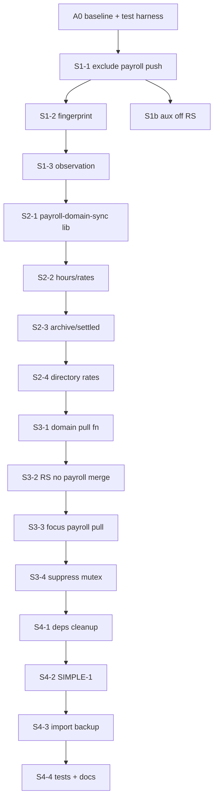

# SYNC-ARCH-01 — Domain Sync Payroll + Aux · DESIGN FREEZE

> **Status:** **DESIGN FREEZE APPROVED** · **IMPLEMENT NOT STARTED**
> **Data:** 2026-07-04 · **Epic:** SYNC-ARCH-01 (ADR Faza A)
> **Tryb:** DESIGN FREEZE + plan implementacji · **ZERO kodu w tym dokumencie**

| Gate | Wartość |
|------|---------|
| Recovery Program | **COMPLETE** |
| Evidence Gate | **CLOSED** |
| Owner GO | **YES** |
| ADR [`ADR-CLOUD-SYNC-ARCHITECTURE.md`](ADR-CLOUD-SYNC-ARCHITECTURE.md) | **ACCEPTED** |
| Documentation Phase | **COMPLETE** |
| SYNC-ARCH Design Freeze (ten dokument) | **APPROVED** |
| Implementation | **BLOCKED** do osobnego owner GO per slice |

**Workflow:** AUDIT (Recovery E-01…E-11) → ADR ACCEPTED → **DESIGN FREEZE (ten plik)** → IMPLEMENT per slice → BUILD → TEST → QUALITY GATE → COMMIT → PUSH → VERIFY FAST → CLOSE slice.

**Release:** [`WORKFLOW-RELEASE-DEPLOY.md`](../WORKFLOW-RELEASE-DEPLOY.md) — każdy slice = **Release B** (functional UI) minimum.

**Jakość:** [`PAYROLL-QUALITY-GATE.md`](../PAYROLL-QUALITY-GATE.md) — L3/L4 dla slice’ów dotykających Payroll P0.

---

## 0. Cel i teza

**Cel:** Odłączyć domenę **Payroll** (roster, godziny, stawki, archive, week range, settled) oraz **Aux** (op notes + audit pull/push w RS) od **Full Bundle Sync** (`runCloudSync`), zastępując je **Domain Sync** — dedykowanym push/pull ograniczonym do kluczy domeny, na wspólnym transporcie `batch-get` / `batch-set`.

**Teza:** SSOT pozostaje **per klucz KV + reguła merge** (`cloud-sync.ts`). Zmiana dotyczy **kto, kiedy i które klucze** synchronizuje — nie semantyki Payroll ani modelu danych.

**Nie jest to:** SYNC-ARCH-02 (Orchestrator), SYNC-ARCH-03 (Edge N+1), PR-PERF-S1 (bundle routing bez domain pull), ani SYNC-ARCH-01B (witness/CAS).

---

## 1. Źródła prawdy (read-only)

| ID | Dokument | Rola |
|----|----------|------|
| ADR | [`ADR-CLOUD-SYNC-ARCHITECTURE.md`](ADR-CLOUD-SYNC-ARCHITECTURE.md) | Decyzja Faza A · constraints · lifecycle |
| E-10 | [`recovery/PAYROLL-DOMAIN-SYNC-IMPACT-ANALYSIS.md`](../recovery/PAYROLL-DOMAIN-SYNC-IMPACT-ANALYSIS.md) | S1–S4 · TASK 8 · ryzyko |
| E-08 | [`recovery/PAYROLL-CLOUD-SYNC-ARCHITECTURE-REVIEW.md`](../recovery/PAYROLL-CLOUD-SYNC-ARCHITECTURE-REVIEW.md) | SIMPLE-1 · Domain feasibility |
| E-09 | [`recovery/PAYROLL-CLOUD-SYNC-FLOW-MAP.md`](../recovery/PAYROLL-CLOUD-SYNC-FLOW-MAP.md) | Macierz ścieżek · duplicate paths |
| E-11 | [`recovery/CLOUD-SYNC-SYSTEM-ARCHITECTURE-REVIEW.md`](../recovery/CLOUD-SYNC-SYSTEM-ARCHITECTURE-REVIEW.md) | Domeny · quick win aux |
| E-05 | [`recovery/PAYROLL-REPLACE-ARCHITECTURE-AUDIT.md`](../recovery/PAYROLL-REPLACE-ARCHITECTURE-AUDIT.md) | Replace semantics — **zamrożone** |
| Baseline merge | [`PAYROLL-CLOUD-RECOVERY-B4-CLOSEOUT.md`](../PAYROLL-CLOUD-RECOVERY-B4-CLOSEOUT.md) | `finalizePayrollBundleMerge` SSOT |
| Guard | [`PAYROLL-JOBS-ASSIGNMENT-SYNC-GUARD-P0-DESIGN-FREEZE.md`](../PAYROLL-JOBS-ASSIGNMENT-SYNC-GUARD-P0-DESIGN-FREEZE.md) | `CloudSyncMutationGuard` — bez zmian kontraktu |

---

## 2. Inwarianty (INV — twarde, niezmienne w SYNC-ARCH-01)

| ID | Inwariant |
|----|-----------|
| **INV-1** | **Merge SSOT** — `finalizePayrollBundleMerge`, `mergeWeekEmployees*`, `mergeDataKey`, tombstones, LWW (`dataUpdatedAt`, `rateUpdatedAt`, `settledUpdatedAt`) — **bez zmiany semantyki** |
| **INV-2** | **Edge replace** — `replaceWeekEmployeesKeys` na Edge pozostaje; **zakres wywołania** zwężony przez SIMPLE-1 (tylko explicit domain push) |
| **INV-3** | **CloudLoader bootstrap** — CORE **12 kl.** + DEFERRED **28 kl.** (`applyBootstrapPayrollMerge`) — **bez zmiany** w SYNC-ARCH-01 |
| **INV-4** | **Istniejące domain push** — `persistPayrollRoster`, `pushPayrollWeekAfterRollover`, `commitOperationalNotes`, `pushJobsAfterDelete` — **zachowane**; RS przestaje je duplikować |
| **INV-5** | **CloudSyncMutationGuard** — scope `kw-jobs` / payroll assignments — **bez regresji** |
| **INV-6** | **Payroll coupling** — `kw-week-employees`, `kw-weekFrom`, `kw-weekTo`, `kw-archive` merge-coupled — **zawsze razem** w domain push/pull Payroll |
| **INV-7** | **API transport** — `fetchKeysFromCloud`, `pushKeysToCloud`, `pushKeysToCloudSafe` — sygnatury **bez breaking change** |
| **INV-8** | **Brak Big Bang** — RS (wąski non-payroll bundle) działa **równolegle** do domain sync aż do zamknięcia S4 |
| **INV-9** | **Zero data loss** — legalny add/remove roster, godziny, archive, settled — **P0 blocker** przy regresji |
| **INV-10** | **STABILIZATION** — brak zmian workflow Przetargi / WM logiki biznesowej / UX |

---

## 3. Zakres (IN SCOPE)

### 3.1 Domena Payroll — klucze

| Klucz | Tombstone | Uwagi |
|-------|-----------|-------|
| `kw-week-employees` | `kw-week-employees-deleted-ids` | roster + godziny + stawki |
| `kw-weekFrom` | — | merge-coupled |
| `kw-weekTo` | — | merge-coupled |
| `kw-archive` | `kw-archive-deleted-ids` | saved weeks |
| `kw-employee-leaves` | `kw-employee-leaves-deleted-ids` | **opcjonalnie** w pull payroll domain (overlay) — bez zmiany merge |

### 3.2 Domena Aux (quick win — S1b)

| Klucz | Obecny RS | Docelowy |
|-------|-----------|----------|
| `kw-operational-notes` (+ read-state, audit-log) | push+pull w RS | tylko `commitOperationalNotes` + dedykowany pull |
| `kw-security-audit-log` | pull w RS | dedykowany pull (Audit Hub) |
| `kw-wm-druk-audit-log` | pull w RS | dedykowany pull (Audit Hub) |

### 3.3 Etapy logiczne (ADR + E-10)

| Etap | Nazwa | Cel |
|------|-------|-----|
| **S1** | Stop push Payroll w RS | Wykluczyć payroll z `pushMergedDataBundle`; RS pull+apply **bez zmian** |
| **S1b** | Stop push/pull Aux w RS | Op notes + audit poza RS push; reuse `commit*` |
| **S2** | Domain push mutacji Payroll | Godziny, stawki, archive, settled, rates sync |
| **S3** | Domain pull Payroll | `pullPayrollDomainFromCloud`; RS bez payroll merge/apply |
| **S4** | Cleanup + SIMPLE-1 | Deps, import, replace split, testy, martwy kod |

### 3.4 SIMPLE-1 (w S4 — obowiązkowe przed zamknięciem epic)

`replaceWeekEmployeesKeys` **tylko** w:
- `persistPayrollRoster`
- `pushPayrollWeekAfterRollover`
- `restorePayrollFromCloud` (jeśli replace)

**Usunąć** z `pushMergedDataBundleToCloud` (pełny RS push).

---

## 4. Wykluczenia (OUT OF SCOPE)

| Obszar | Epic / dokument |
|--------|-----------------|
| Sync Orchestrator (kolejka, leader tab) | **SYNC-ARCH-02** |
| Witness revision + Edge 409 / CAS | **SYNC-ARCH-01B** (opcjonalny) |
| Edge `batch-set` N+1 / mget | **SYNC-ARCH-03** |
| PR-PERF-S1 bundle routing (5 bundli bez domain pull) | **SUPERSEDED** przez ten DF |
| Logika biznesowa Payroll (MODEL A, rollover, EPS) | bez zmian |
| Workflow Przetargi · WM Druk · Tender KV deferred | poza S1–S4; backlog po SYNC-ARCH-01 |
| Worker `WorkerPhotoView` 6 kl. throttle | OQ-10 ADR — osobny hotfix |
| Event Sourcing | ADR odrzucone |
| Zmiana `DATA_KEYS` count / nowe KV | zakazane |

---

## 5. Architektura docelowa (koncept — bez kodu)

```text
[Dziś]
  useEffect(19 deps) → scheduleAutoCloudSync → runCloudSync
    → pull 41kl + aux + audit
    → merge all
    → apply 10kl React
    → push 39kl + replace roster

[Po SYNC-ARCH-01]
  Payroll mutations → schedulePayrollDomainPush (debounce)
    → pushKeysToCloudSafe(payroll keys only) + replace when roster op

  Payroll pull (focus/interval) → pullPayrollDomainFromCloud
    → finalizePayrollBundleMerge → apply payroll slice only

  Non-payroll mutations → scheduleAutoCloudSync (wąski RS)
    → pull/push bez payroll + bez aux (S1/S1b)

  Op notes → commitOperationalNotes (bez zmian kontraktu)
  Audit → refreshAuditHubAux (bez RS)
```

**Tymczasowe okna niespójności (akceptowane):** archive zapisany lokalnie, roster w locie — już występują przy duplicate paths; S2 minimalizuje lukę po S1.

---

## 6. Ryzyka i mitygacje

| ID | Ryzyko | Sev. | Mitygacja (design) |
|----|--------|------|-------------------|
| **R1** | S1 bez S2 — godziny nie trafiają do KV | **P0** | **S2 w ciągu ≤1 release** po S1; monitor `kw-week-employees` KV |
| **R2** | S3 pull nadpisuje lokalną edycję | **P0** | `suppress` podczas mutacji; guard + debounce pull |
| **R3** | Multi-tab duplicate push | **P1** | Throttle istniejący S7-4A; pełne rozwiązanie w SYNC-ARCH-02 |
| **R4** | SIMPLE-1 — remove bez replace w RS | **P0** | Audyt ścieżek remove — wszystkie przez `persistPayrollRoster` (E-10) |
| **R5** | `bundleFingerprint` false negative po S1 | **P1** | Osobny fingerprint non-payroll subset |
| **R6** | Import backup — payroll bez RS | **P1** | S4: domain push po import |
| **R7** | Testy B4/P0 zakładają RS payroll | **P1** | Rewrite testów per slice (S4.4) |

---

## 7. Pliki (przewidywane — IMPLEMENT)

| Plik | S1 | S1b | S2 | S3 | S4 |
|------|:--:|:---:|:--:|:--:|:--:|
| `src/lib/cloud-sync.ts` | ● | ● | ● | ● | ● |
| `src/lib/cloud-sync-throttle.ts` | ● | — | ● | ● | — |
| `src/lib/payroll-domain-sync.ts` | — | — | ● | ● | ● |
| `src/app/App.tsx` | ● | ● | ● | ● | ● |
| `src/app/CloudLoader.tsx` | — | — | — | — | — |
| `supabase/functions/.../index.tsx` | — | — | — | — | — |

**Nowy moduł (koncept):** `src/lib/payroll-domain-sync.ts` — debounce push, `pullPayrollDomainFromCloud`, fingerprint payroll subset. **Bez** logiki merge (reuse `cloud-sync.ts`).

---

## 8. Testy i bramki (gate per slice)

### 8.1 Gate regresji Payroll (każdy slice P0)

```bash
npx vite-node scripts/test-payroll-bootstrap-runtime-parity-b4.mjs
npx vite-node scripts/test-payroll-edge-parity-b6.mjs
npx vite-node scripts/test-payroll-deletion-tombstones-pr-pay-s2.mjs
npx vite-node scripts/test-payroll-archive-restore-eligibility-s6.mjs
npx vite-node scripts/test-payroll-settled-persistence-pr-pay-s5.mjs
npx vite-node scripts/test-payroll-restore-banner-false-positive.mjs
npx vite-node scripts/test-payroll-cloud-sync-frequency-s7-4.mjs
```

### 8.2 Gate infrastruktury

```bash
npm run test:infra -- --scope payroll
```

### 8.3 Nowe testy (planowane)

| Test | Slice | AC |
|------|-------|-----|
| `test-sync-arch-01-s1-rs-no-payroll-push.mjs` | S1 | push RS nie zawiera payroll kluczy |
| `test-sync-arch-01-s2-domain-push-hours.mjs` | S2 | edycja godziny → domain push bez RS |
| `test-sync-arch-01-s3-domain-pull.mjs` | S3 | pull payroll bez full bundle merge |
| `test-sync-arch-01-s4-simple1-replace.mjs` | S4 | replace tylko explicit paths |

### 8.4 BUILD

`npm run build` — **obowiązkowy** każdy slice.

### 8.5 Production Observation

Po każdym slice P0/P1: **24–48h** · `__wgdomSyncMetrics()` · multi-device smoke (EG-4 procedura) · wpis STABILIZATION weekly.

---

## 9. Acceptance Criteria (epic close)

| AC | Kryterium |
|----|-----------|
| **AC-01** | Payroll push **nie** przechodzi przez `pushMergedDataBundle` |
| **AC-02** | Godziny/stawki/archive/settled synchronizują się **bez** RS |
| **AC-03** | Multi-device: druga karta odświeża payroll przez **domain pull** |
| **AC-04** | SIMPLE-1: brak `replaceWeekEmployeesKeys` w RS push |
| **AC-05** | Op notes + audit **nie** w RS push (S1b) |
| **AC-06** | Gate regresji §8.1 **PASS** |
| **AC-07** | `batch-set` payroll-only payload **<<** 39 kl. (metryki prod) |
| **AC-08** | ARCHITECTURE §11 zaktualizowany · CHANGELOG przy widocznej zmianie |
| **AC-09** | 30 dni prod stable → eligibility **SYNC-ARCH-02** (osobna decyzja) |

---

## 10. GO / NO-GO

| Etap | Status |
|------|--------|
| Recovery + Evidence Gate | **CLOSED** |
| ADR | **ACCEPTED** |
| **DESIGN FREEZE (ten dokument)** | **APPROVED** |
| **IMPLEMENT S1** | **NO GO** do osobnego owner GO |
| **SYNC-ARCH-02** | **NO GO** — gate: SYNC-ARCH-01 AC-01…AC-09 + 30d stable |

**Zasada:** **One Bundle = One Goal** — każdy slice implementacji (§11) = osobny commit, release, VERIFY.

---

# 11. Plan implementacji — małe, niezależne etapy

> Poniższy plan **nie jest implementacją**. Każdy wiersz = osobny release B z rollbackiem git revert.

## Faza A0 — Przygotowanie (pre-S1)

| ID | Slice | Zakres | Pliki | Ryzyko | Rollback |
|----|-------|--------|-------|--------|----------|
| **A0-1** | Telemetria baseline | Zapis `__wgdomSyncMetrics()` + rozmiar payload przed S1 | docs only + owner capture | Niskie | — |
| **A0-2** | Test harness S1 | `test-sync-arch-01-s1-rs-no-payroll-push.mjs` (RED przed kodem) | `scripts/` | Niskie | usuń test |

**Gate A0:** owner GO na S1.

---

## Faza S1 — Stop push Payroll w RS (3 slice’y)

| ID | Slice | Zakres dokładny | Zależność | Ryzyko | Test min. | Release |
|----|-------|-----------------|-----------|--------|-----------|---------|
| **S1-1** | Wykluczenie kluczy z push | `pushMergedDataBundleToCloud`: wykluczyć `kw-week-employees`, `kw-weekFrom`, `kw-weekTo`, `kw-archive` + ich tombstones z payload i z `replaceWeekEmployeesKeys` | A0-2 | Średnie P1 | A0-2 PASS | B |
| **S1-2** | Fingerprint non-payroll | `bundleFingerprint` / hash: nie liczyć payroll kluczy **lub** osobny fingerprint dla RS subset | S1-1 | Niskie | S7-4 regresja | B |
| **S1-3** | Observation S1 | 24–48h prod; weryfikacja KV roster add/remove (domain) + brak stale replace z RS | S1-2 | — | metryki | — |

**Krytyczne:** **S2-1 musi wejść przed końcem tygodnia prod po S1-3** (R1).

**Rollback S1:** przywrócić payroll klucze w `pushMergedDataBundleToCloud`.

---

## Faza S1b — Aux off RS (2 slice’y, równoległe do S2 po S1-1)

| ID | Slice | Zakres | Zależność | Ryzyko | Release |
|----|-------|--------|-----------|--------|---------|
| **S1b-1** | Op notes off RS push | Wykluczyć `kw-operational-notes*` z RS push; pull op notes tylko przy wejściu w moduł / `commitOperationalNotes` | S1-1 | Niskie P2 | B |
| **S1b-2** | Audit off RS pull | `refreshAuditHubAuxFromCloud` poza `runCloudSync`; trigger tylko Audit Hub / WM Druk | S1-1 | Niskie P2 | B |

**Rollback S1b:** przywrócić aux w RS cascade.

---

## Faza S2 — Domain push mutacji (4 slice’y)

| ID | Slice | Zakres | Zależność | Ryzyko | Test min. | Release |
|----|-------|--------|-----------|--------|-----------|---------|
| **S2-1** | Lib + debounce push | Utworzyć `payroll-domain-sync.ts`: `schedulePayrollDomainPush`, `pushPayrollDomainToCloud` (4 kl. coupled) | S1-3 PASS | Wysokie P0 | nowy test hours | B |
| **S2-2** | Godziny + stawki + extraCosts | Podłączyć `updateWeekEmployeeDay/Rate/ExtraCosts/updateWeekEmployee` → S2-1 | S2-1 | Wysokie P0 | S2 test + S5 | B |
| **S2-3** | Archive + settled | `doSaveWeek` → push archive; `toggleSettled` → domain push zamiast `runCloudSync` | S2-1 | Wysokie P0 | S6 + S5 | B |
| **S2-4** | Rates from directory | `syncWeekRatesFromDirectory` → `pushWeekEmployeesToCloud` only | S2-1 | Średnie P1 | regresja | B |

**Status implementacji (2026-07-11):** S2-1…S2-4 **CLOSED** · prod **`e819124`** · observation **FULLY CLOSED** (2026-07-11). `payroll-domain-sync.ts` + hooki w `App.tsx`; test `test-sync-arch-01-s2-domain-push-cross-device.mjs` **18/18**. S3 pull domain — osobny slice.

**Rollback S2:** feature flag lub revert hooków w `App.tsx`; RS pull nadal aktualizuje UI.

---

## Faza S3 — Domain pull (4 slice’y)

| ID | Slice | Zakres | Zależność | Ryzyko | Test min. | Release |
|----|-------|--------|-----------|--------|-----------|---------|
| **S3-1** | `pullPayrollDomainFromCloud` | Fetch 4–5 kl.; `finalizePayrollBundleMerge`; apply tylko payroll state | S2-4 | Wysokie P0 | S3 test | B |
| **S3-2** | RS bez payroll merge | `pullFromCloudAndMerge` / `computeMergedDataBundle`: wykluczyć payroll z merge; `applyAdminDataBundle` bez payroll setterów | S3-1 | Wysokie P0 | B4 | B |
| **S3-3** | Focus/visibility payroll | `pullFromCloudAndMerge` → non-payroll; osobny payroll pull z throttle S7-4A | S3-2 | Wysokie P0 | S7-4 + multi-device | B |
| **S3-4** | Suppress mutex | Podczas aktywnej edycji LP — suppress payroll pull (reuse `suppressAutoSync` pattern) | S3-3 | Średnie P1 | ST design | B |

**Rollback S3:** tymczasowo przywrócić payroll w RS pull (S3-2 revert).

---

## Faza S4 — Cleanup + SIMPLE-1 (4 slice’y)

| ID | Slice | Zakres | Zależność | Ryzyko | Release |
|----|-------|--------|-----------|--------|---------|
| **S4-1** | useEffect deps | Usunąć payroll slice z 19-deps; osobny scheduler payroll domain | S3-4 | Średnie P1 | B |
| **S4-2** | SIMPLE-1 | Potwierdzić brak replace w RS; audyt `clearAllWeekEmployees` | S4-1 | Wysokie P0 | B |
| **S4-3** | Import backup | `importBackup` / restore: payroll via domain push | S4-2 | Średnie P1 | B |
| **S4-4** | Testy + martwy kod | Rewrite testów RS race; usuń martwe `pushToCloud`; docs ARCHITECTURE §11 | S4-3 | Niskie | A/docs |

**Epic close:** AC-01…AC-09 + 30d observation → propozycja SYNC-ARCH-02.

---

## 12. Diagram zależności slice’ów



---

## 13. Kolejność wdrożenia (rekomendowana)

```text
A0-1 → A0-2 → S1-1 → S1-2 → [S1b-1, S1b-2 równolegle po S1-1] → S1-3
  → S2-1 → S2-2 → S2-3 → S2-4
  → S3-1 → S3-2 → S3-3 → S3-4
  → S4-1 → S4-2 → S4-3 → S4-4
  → EPIC CLOSE observation 30d
```

**Szacunek:** 15–17 slice’ów release · **nie** łączyć S1+S2 w jednym commicie.

---

## 14. Powiązane aktualizacje docs (po IMPLEMENT — nie w tym DF)

| Plik | Kiedy |
|------|-------|
| `docs/ARCHITECTURE.md` §11 | S4-4 |
| `CURRENT-TASK.md` | każdy slice close |
| `ADR-CLOUD-SYNC-ARCHITECTURE.md` | tylko jeśli SUPERSEDED — nie w SYNC-ARCH-01 |
| `CHANGELOG` / `HelpView` | widoczne zmiany sync (opcjonalne — infra) |

---

**Koniec DESIGN FREEZE · SYNC-ARCH-01 · ZERO IMPLEMENTATION · ZERO BUILD · ZERO COMMIT · ZERO PUSH**

*SSOT implementacji Domain Sync Fazy A — po Recovery Program · zgodny z ADR ACCEPTED · 2026-07-04*
